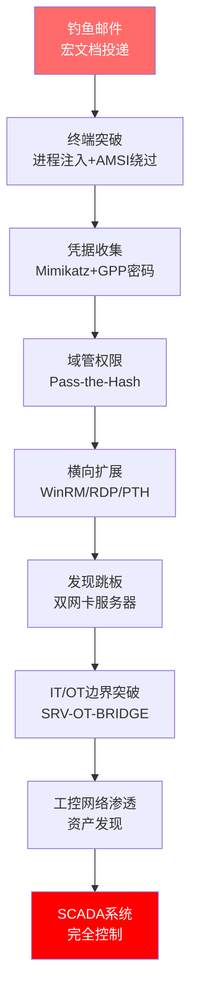

## 案例三：大型企业内网渗透演练

> **案例概要**：某跨国制造企业开展IT/OT融合环境攻防演练，红队从钓鱼邮件起步，穿越三层网络边界，最终触达SCADA工控系统。蓝队历时12天发现入侵痕迹，紫队在事后推动了17项安全改进措施。本案例深入剖析了企业内网渗透的完整攻击链、防御盲区与修复路径。

---

### 一、企业背景与演练目标

#### 1.1 企业基本情况

某跨国制造企业（以下简称"A集团"）是一家年营收超百亿的全球500强企业，在全球15个国家设有分支机构，员工总数约35,000人。其核心业务涵盖汽车零部件、工业自动化设备和精密仪器制造。

| 维度 | 详情 |
|------|------|
| 员工规模 | 全球35,000人，总部位于中国上海 |
| IT基础设施 | Active Directory域环境，约12,000台Windows终端 |
| OT网络 | 8条生产线，SCADA/DCS工控系统，覆盖PLC、HMI、工程师站 |
| 网络架构 | 三层网络：办公网(10.1.0.0/16)、数据中心(172.16.0.0/16)、工控网(192.168.0.0/16) |
| 安全团队 | 12人SOC团队，使用SIEM平台（基于Splunk），部署终端EDR |
| 云服务 | 混合云架构，部分业务迁移至AWS |

#### 1.2 演练目标与范围

本次红蓝对抗演练由董事会授权，紫队（安全治理团队）全程协调，为期30天。

**演练目标：**

1. **评估IT到OT的攻击路径**：验证办公网→数据中心→工控网的网络隔离有效性
2. **检验SOC响应能力**：测量从入侵到检测的平均时间（MTTD）和平均响应时间（MTTR）
3. **发现配置缺陷**：识别域环境、网络设备、安全策略中的薄弱环节
4. **验证工控安全**：评估SCADA系统在遭受网络攻击时的韧性和恢复能力

**演练规则：**

- 红队可使用社会工程、技术攻击，但不得造成物理损害或生产中断
- 蓝队不知晓攻击启动时间，但知晓演练已启动（持续警戒状态）
- 紫队保留随时终止演练的权力（安全熔断机制）
- 所有攻击工具需事先提交审核，严禁使用0day漏洞（除非紫队特别授权）

#### 1.3 演练团队配置

| 角色 | 人数 | 主要职责 | 工具集 |
|------|------|---------|--------|
| 红队 | 6人 | 模拟真实攻击者，执行渗透测试 | Cobalt Strike、Metasploit、自研工具 |
| 蓝队 | 8人 | 监控、检测、响应、溯源 | Splunk SIEM、EDR、Wireshark、YARA |
| 紫队 | 3人 | 规则仲裁、风险管控、记录复盘 | 自定义演练管理平台 |

---

### 二、红队攻击路径详解

#### 2.1 阶段一：初始突破——钓鱼邮件投递（第1-3天）

**目标选择：** 红队通过OSINT信息收集，从LinkedIn和企业官网筛选出3名目标人物——一位区域销售经理（有VPN远程访问权限）、一位IT运维工程师（有域管权限）、一位生产线调度员（有SCADA访问权限）。

**钓鱼邮件设计：** 红队注册了与企业域名高度相似的钓鱼域名（仅差一个字母），并搭建了伪装成企业OA系统的登录页面用于凭据收割。同时向三名目标投递了精心构造的钓鱼邮件：

```text
邮件主题: 2026年度绩效考核通知 - 请在48小时内完成自评
发件人: hr-performance@agroup-cn.com（仿冒域名）
附件: 绩效自评表2026.xlsm（含宏代码）
```

**宏代码执行机制：** 附件中的VBA宏使用了分阶段加载技术：

- 第一阶段：显示伪造的绩效表格界面（掩护用户视线）
- 第二阶段：后台通过PowerShell从远程服务器下载第二阶段载荷
- 第三阶段：加载内存态Cobalt Strike Beacon，建立C2通道

**技术要点——绕过EDR：** 该企业部署的EDR产品对Office宏行为有监控。红队使用了以下技术规避检测：

1. **进程注入**：将Shellcode注入到合法的`explorer.exe`进程中，避免创建可疑子进程
2. **AMSI绕过**：在PowerShell执行前修改内存中的AMSI（反恶意软件扫描接口）检测函数，使其始终返回清洁结果
3. **流量伪装**：C2通信使用HTTPS协议，证书伪装为合法的CDN服务域名，规避网络层检测

```powershell
# 简化的AMSI绕过示例（实际使用了更复杂的混淆）
$a=[Ref].Assembly.GetType('System.Management.Automation.Utils')
$f=$a.GetField('amsiInitFailed','NonPublic,Static')
$f.SetValue($null,$true)
```

**突破结果：** 三名目标中，区域销售经理成功打开宏文档并执行了恶意代码，红队获得其终端的远程访问权限。

#### 2.2 阶段二：域环境渗透与横向扩展（第4-10天）

从初始突破的终端出发，红队逐步深入企业Active Directory域环境：

**步骤一：凭据收集与权限提升**

红队在受害终端上部署了Mimikatz的内存运行版本，成功提取了以下凭据：

- 该员工的域账户NTLM哈希
- 本地管理员账户密码（弱密码：Admin@2024）
- 浏览器中保存的多个内部系统登录凭据

由于该员工属于"销售部门"安全组，其本地账户不是本地管理员。红队发现该部门的组策略中存在配置错误——允许所有域用户安装特定目录下的MSI包。红队利用该配置安装了提权工具，获取了本地管理员权限。

**步骤二：GPP密码发现——获取域管凭据**

红队利用SYSVOL共享中的Group Policy Preferences (GPP) 密码漏洞，发现了域管理员账户的加密密码。GPP密码虽然使用AES-256加密，但微软已公开了密钥，任何人都可以解密。

```bash
# 使用gpp-password工具提取GPP密码
# 工具自动遍历SYSVOL共享中的Groups.xml、Services.xml等文件
# 解密后得到域管理员明文密码：D0main@dm1n_2023!
```

这是企业域环境中极为常见的安全问题——一旦域管密码泄露，整个域环境基本沦陷。

**步骤三：横向移动——服务器渗透**

获得域管权限后，红队开始横向扩展：

| 目标 | 方法 | 结果 |
|------|------|------|
| 文件服务器 | PSRemoting (WinRM) | 成功，获取敏感财务文件访问权限 |
| 数据库服务器 | 域管PTH（Pass-the-Hash） | 成功，获取客户数据库访问权限 |
| 邮件服务器 | 域管直接登录 | 成功，可读取所有员工邮件 |
| VPN网关管理 | RDP域管登录 | 成功，发现VPN配置缺陷 |
| 跳板服务器 | 扫描双网卡主机 | 关键发现——发现IT/OT边界跳板 |

**步骤四：发现关键跳板**

红队使用BloodHound工具分析域环境，绘制了完整的攻击路径图。同时通过nmap扫描，发现了一台特殊的双网卡服务器（`SRV-OT-BRIDGE`），同时拥有`172.16.50.20`（数据中心网段）和`192.168.10.5`（工控网段）两个IP地址。

```text
网络拓扑发现：
┌─────────────┐     ┌──────────────┐     ┌─────────────┐
│  办公网      │────→│  数据中心     │────→│  工控网      │
│ 10.1.0.0/16 │     │ 172.16.0.0/16│     │ 192.168.0.0/16│
│             │     │              │     │             │
│  员工终端    │     │  SRV-OT-BRIDGE│     │ SCADA/PLC   │
│  域控制器    │     │  (双网卡)     │     │ HMI工作站   │
└─────────────┘     └──────────────┘     └─────────────┘
        ↑                  ↑                    ↑
     防火墙策略：       防火墙策略：         内部无防火墙
     允许办公→DC      允许DC→所有服务器    工控网内网段互通
```

#### 2.3 阶段三：IT/OT边界突破与工控系统渗透（第11-15天）

**IT/OT边界突破：**

红队发现`SRV-OT-BRIDGE`这台双网卡服务器运行着Windows Server 2016，且同时加入了办公域和工控域（两个不同的AD域）。利用域管权限，红队可以通过WinRM远程管理该服务器，直接访问工控网络。

这是一个典型的架构安全缺陷——本应部署防火墙或单向网关进行IT/OT隔离的边界，却使用了一台"全能"的跳板服务器来实现网络互通。

**工控网络内部渗透：**

进入工控网络后，红队的攻击策略发生变化——工控环境对稳定性和实时性要求极高，任何误操作都可能导致生产事故。因此红队采取了"静默观察+精准行动"的策略：

1. **资产发现**：通过ARP扫描和端口探测，梳理工控网络资产清单

| 设备类型 | 型号/系统 | 数量 | 关键发现 |
|---------|----------|------|---------|
| PLC控制器 | 西门子S7-1200 | 12台 | 部分使用默认密码 |
| HMI人机界面 | 研华WebAccess | 6台 | Web漏洞未修补 |
| 工程师站 | Win7+TIA Portal | 3台 | 未安装杀毒软件 |
| SCADA服务器 | WinServer2012+iFIX | 2台 | 可远程代码执行 |
| 数据采集机 | 自研采集程序 | 2台 | 以root权限运行，无认证 |

2. **SCADA系统访问**：红队利用域管凭据登录SCADA服务器，成功访问了SCADA控制界面，可以查看所有生产线的实时运行数据，包括设备状态、温度、压力等关键参数。

3. **模拟破坏操作**：红队**严格遵守演练规则**，仅在SCADA界面上截图取证，证明了攻击者可以修改PLC参数设置——这意味着恶意攻击者可能导致设备过热、压力超标等生产安全事故。

4. **持久化机制**：红队在SCADA服务器上部署了隐蔽的后门程序，确保即使域管密码被重置，仍可通过独立凭据维持访问。

#### 2.4 攻击路径总结



---

### 三、蓝队检测与响应全过程

#### 3.1 SOC监控现状（演练前）

演练前，A集团的SOC运营情况如下：

| 能力维度 | 当前状态 | 评估等级 |
|---------|---------|---------|
| SIEM日志覆盖 | 办公网80%、DC 60%、OT网络15% | 部分覆盖 |
| 告警处理 | 日均800+告警，人工处理为主 | 严重过载 |
| 威胁情报 | 使用商业威胁情报源 | 基本具备 |
| 应急响应 | 有预案但未定期演练 | 待改进 |
| OT安全监控 | 基本无专门监控 | 严重不足 |

#### 3.2 蓝队发现过程

**第1-10天：未察觉异常**

红队在前10天的攻击活动中，成功规避了蓝队的所有检测：

- **钓鱼邮件**：邮件网关未能识别仿冒域名（仅检查了SPF，未配置DMARC）
- **宏执行**：EDR告警被淹没在大量低优先级告警中（宏执行告警被归类为"信息"级别）
- **凭据收集**：Mimikatz的内存运行方式绕过了文件层面的检测
- **横向移动**：使用域管凭据的合法认证流量，与正常管理行为难以区分

**第11-12天：关键转折点**

第12天上午，一名资深SOC分析师（入职3年的老员工）在处理日常告警时注意到了一条异常日志：

```text
日志来源: SCADA服务器 Windows事件日志
事件ID: 4688 (进程创建)
进程: powershell.exe
命令行: powershell -enc <base64编码的命令>
父进程: svchost.exe（异常——正常情况下svchost不会派生PowerShell）
来源IP: 172.16.50.20（数据中心网段的IP）
账户: A_GROUP\domain_admin_01（域管账户）
```

**蓝队分析推理链：**

1. 工控网的SCADA服务器上出现PowerShell执行记录→异常（OT环境极少使用PowerShell）
2. 执行源IP来自数据中心网段→跨网络访问，应有日志记录
3. 使用域管账户登录SCADA服务器→非日常运维行为
4. 命令行使用Base64编码→可能隐藏恶意命令

该分析师立即启动了深入调查。

**蓝队溯源行动：**

| 时间 | 操作 | 发现 |
|------|------|------|
| 09:30 | 提取SCADA服务器全量日志 | 确认异常PowerShell执行历史 |
| 10:15 | 分析SRV-OT-BRIDGE跳板日志 | 发现172.16.50.20多次RDP连接记录 |
| 11:00 | 审查域控日志 | 追溯到GPP密码被读取的事件（Event ID 5145） |
| 12:30 | 网络流量分析 | 在NetFlow数据中发现C2通信模式 |
| 14:00 | 全网IOC扫描 | 确认C2服务器IP，提取恶意文件特征 |
| 15:30 | 锁定初始突破点 | 通过邮件网关日志找到钓鱼邮件 |
| 16:00 | 评估攻击范围 | 统计所有受影响系统和账户 |

#### 3.3 蓝队应急响应措施

确认入侵后，蓝队按照事件响应预案启动了应急处置流程：

**第一阶段：遏制（第12天 16:30-18:00）**

1. 隔离受感染终端——断网但**不关机**（保留内存中的取证证据）
2. 阻断C2服务器IP——在防火墙上添加封堵规则
3. 对Cobalt Strike通信流量进行全网过滤
4. 在OT/IT边界防火墙上加临时ACL，禁止非授权跨网访问

**第二阶段：根除（第13-15天）**

1. 对SRV-OT-BRIDGE进行完整磁盘镜像和内存转储（取证）
2. 重置所有域管账户密码（共7个）
3. 清理所有被植入的后门和持久化机制
4. 审查和修复GPP密码问题（删除SYSVOL中的密码配置）
5. 检查所有双网卡服务器的安全配置

**第三阶段：恢复与加固（第16-30天）**

1. 逐步恢复网络连接（先办公网，再OT网络）
2. 部署临时监控规则（针对已知IOC）
3. 全面安全评估和漏洞修补
4. 启动安全架构整改项目

#### 3.4 关键时间指标

| 指标 | 本次演练数据 | 行业基准 | 评估 |
|------|------------|---------|------|
| 攻击突破时间 | 第1天 | - | - |
| SOC检测时间（MTTD） | 12天 | 207天（IBM 2023报告） | 优于基准 |
| 响应遏制时间（MTTR） | 1.5小时 | 73天（IBM 2023报告） | 显著优于基准 |
| 完整溯源时间 | 6.5小时 | - | 较快 |
| 总体攻击驻留时间 | 12天 | 中位数204天 | 需要缩短 |

---

### 四、紫队观察与规则执行

紫队在整个演练过程中承担了关键的协调和风险管控角色：

#### 4.1 安全熔断事件

演练第8天，红队在工控网络内部进行资产扫描时，使用了过于激进的扫描策略，导致一台PLC控制器出现短暂的通信中断（约45秒）。紫队立即发出**黄色警告**，要求红队：

- 立即停止对该PLC的任何扫描操作
- 将扫描速率降低到每秒不超过5个请求
- 提交书面说明和改进方案

第11天，红队在尝试SCADA系统持久化时，差点覆盖了一条生产配方参数。紫队发出**红色警告**，暂停红队工控网操作24小时进行风险评估。

#### 4.2 公平性保障

紫队需要确保演练的公平性：

- **不向蓝队泄露攻击细节**，但可以提示"当前阶段有活跃威胁"
- **不干预红队的战术选择**（除非违反安全规则）
- **确保蓝队拥有必要的资源和工具**
- **记录所有事件时间线**，确保最终报告的准确性

#### 4.3 紫队发现的流程缺陷

紫队在观察中发现了以下组织层面的问题：

1. **蓝队人员能力不均衡**：关键发现由一名资深分析师做出，如果该分析师当天休假，入侵可能继续潜伏
2. **OT安全职责不清**：工控网的安全监控由IT团队和OT运维团队共同负责，但双方都认为对方应该监控
3. **应急响应预案未覆盖OT场景**：现有预案要求"立即断网隔离"，但对工控系统断网可能导致生产中断

---

### 五、深度技术分析

#### 5.1 攻击技术分析

**AMSI绕过的完整技术链：**

红队使用的AMSI绕过技术属于"内存补丁"方案，其原理是定位.NET运行时中`AmsiScanBuffer`函数的入口地址，将其替换为直接返回清洁结果的指令序列。

```text
攻击技术层级分析：
┌────────────────────────────────────────────────┐
│ 层级1: 钓鱼投递                                  │
│   技术: VBA宏 + 混淆脚本 + 模块化加载            │
│   对抗: 邮件网关宏检测、EDR脚本行为分析           │
├────────────────────────────────────────────────┤
│ 层级2: EDR规避                                   │
│   技术: AMSI补丁 + 进程注入 + 反沙箱             │
│   对抗: 内存扫描、行为检测、沙箱逃逸检测          │
├────────────────────────────────────────────────┤
│ 层级3: 横向移动                                  │
│   技术: PTH/PTK + GPP解密 + WinRM远程管理        │
│   对抗: 凭据保护、特权账户监控、网络分段           │
├────────────────────────────────────────────────┤
│ 层级4: 持久化                                   │
│   技术: 计划任务 + WMI事件订阅 + 后门服务        │
│   对抗: 启动项监控、WMI持久化检测、完整性校验     │
└────────────────────────────────────────────────┘
```

**GPP密码漏洞的技术原理：**

Group Policy Preferences (GPP) 允许管理员通过组策略分发配置，包括本地账户密码。密码使用AES-256加密存储在SYSVOL共享的XML文件中，但加密密钥（4个硬编码的字节+用户SID）已被微软公开在MSDN文档中。任何域用户都可以读取SYSVOL，因此任何域用户都可以解密这些密码。

受影响的XML文件类型包括：

- `Groups.xml` — 本地组和用户配置
- `Services.xml` — 服务配置（含服务账户密码）
- `ScheduledTasks.xml` — 计划任务配置
- `DataSources.xml` — ODBC数据源配置
- `Drives.xml` — 映射驱动器配置

#### 5.2 防御盲区分析

**IT/OT网络隔离的技术缺陷：**

| 隔离机制 | 设计意图 | 实际问题 |
|---------|---------|---------|
| 防火墙ACL | 限制IT→OT通信 | 存在"允许管理"规则被滥用 |
| 双网卡服务器 | 作为受控网关 | 本体缺乏加固，成为攻击跳板 |
| VPN跳板 | 远程访问OT设备 | 域管凭据可直接登录 |
| 单向网关 | 物理隔离（仅部署1台） | 仅覆盖部分工控网段 |

**SOC检测盲区：**

1. **OT网络日志覆盖不足**：仅有15%的OT设备日志接入SIEM，SCADA服务器的关键操作日志（参数修改、配方下载）未被采集
2. **跨网络流量分析缺失**：NetFlow数据虽有采集，但缺乏IT/OT跨网段通信的基线模型
3. **告警疲劳**：日均800+告警中，大量是低价值告警（如USB设备插入），真正的高级威胁告警被淹没

---

### 六、演练核心收获

#### 6.1 技术层面

**1. 网络隔离不应依赖单一机制**

双网卡服务器作为IT/OT隔离方案是严重的设计缺陷。正确的隔离方案应该是：

| 隔离方案 | 安全性 | 可用性 | 适用场景 |
|---------|-------|-------|---------|
| 物理隔离（气隙） | 最高 | 最低 | 关键基础设施 |
| 工业单向网关 | 高 | 中等 | SCADA数据采集 |
| 工业防火墙+应用代理 | 中高 | 高 | 常规IT/OT互通 |
| 双网卡服务器（本案例） | 低 | 高 | **不应使用** |

**2. 域环境安全是整体安全的基石**

GPP密码漏洞、弱域管密码、缺乏特权账户管理——这些问题使得域管权限的获取几乎毫不费力。建议实施：

- 部署LAPS（Local Administrator Password Solution）实现本地管理员密码随机化
- 实施PAM（Privileged Access Management）特权访问管理
- 定期使用BloodHound等工具审计域环境攻击路径
- 禁止使用GPP分发密码（使用Windows LAPS或第三方密码管理器替代）

**3. OT安全监控必须专门建设**

工控网络的安全监控不能简单复用IT安全方案，需要考虑以下特殊性：

- 工控协议（Modbus、OPC UA、S7comm）需要专用协议解析
- 工控设备通常不支持安装代理，需要网络侧检测
- 工控环境的基线与IT环境不同，需要建立专门的工控行为基线
- 工控安全事件的响应流程需要考虑生产连续性

#### 6.2 流程层面

**4. 应急响应预案需要覆盖OT场景**

传统的"断网隔离"策略在工控环境下可能导致生产安全事故。建议制定分级响应策略：

| 威胁等级 | IT网络响应 | OT网络响应 |
|---------|----------|----------|
| 低（可疑流量） | 增强监控 | 通知OT运维，观察评估 |
| 中（确认入侵） | 隔离受影响主机 | 限制网络访问，不影响控制器 |
| 高（数据泄露） | 断网+取证 | 切换手动模式，断开IT/OT边界 |
| 严重（破坏意图） | 全网隔离 | 紧急停机流程，人工接管 |

**5. SOC团队需要均衡的能力建设**

关键发现依赖于单一资深分析师，暴露了团队能力建设的短板。建议：

- 建立知识分享机制，将资深分析师的经验转化为标准检测规则
- 部署SOAR（安全编排自动化响应）平台，将常见分析流程自动化
- 定期进行威胁狩猎（Threat Hunting），主动发现被动监控遗漏的威胁
- 建立7×24小时值班制度，确保关键岗位始终有合格分析师

#### 6.3 组织层面

**6. IT/OT安全职责必须明确界定**

"IT说OT安全归OT运维管，OT运维说网络安全归IT管"——这种职责模糊在制造业企业中非常普遍。建议设立统一的工控安全负责人岗位，明确：

- OT网络资产的安全基线由谁制定和维护
- OT安全事件的响应由谁牵头
- OT系统的安全评估由谁组织实施

---

### 七、后续改进措施（紫队推动）

演练结束后，紫队主导制定了17项改进措施，分三个阶段实施：

#### 7.1 紧急修复（1个月内完成）

| 序号 | 措施 | 负责部门 | 完成状态 |
|------|------|---------|---------|
| 1 | 修复GPP密码问题，删除所有SYSVOL中的密码配置 | IT运维 | 已完成 |
| 2 | 重置所有域管账户密码并启用MFA | 安全团队 | 已完成 |
| 3 | 在IT/OT边界部署临时ACL，阻断非授权跨网通信 | 网络团队 | 已完成 |
| 4 | 全面扫描所有双网卡服务器并加固 | IT运维 | 已完成 |

#### 7.2 中期改进（1-3个月完成）

| 序号 | 措施 | 负责部门 | 完成状态 |
|------|------|---------|---------|
| 5 | 部署IT/OT网络间的工业单向网关（数据二极管） | 网络团队 | 进行中 |
| 6 | 在OT网络部署专用工控安全监控平台（支持Modbus/S7/OPC UA协议解析） | 安全团队 | 进行中 |
| 7 | 实施PAM特权访问管理系统，特权操作全程录像 | IT运维 | 已完成 |
| 8 | 邮件网关升级：配置DMARC策略，部署高级钓鱼检测 | IT运维 | 已完成 |
| 9 | EDR策略优化：提升宏执行告警优先级，增加AMSI绕过检测规则 | 安全团队 | 已完成 |
| 10 | 制定OT环境专项应急预案（分级响应策略） | 安全+OT运维 | 已完成 |
| 11 | 部署网络流量基线分析系统（IT/OT跨网段通信建模） | 安全团队 | 进行中 |

#### 7.3 长期建设（3-12个月完成）

| 序号 | 措施 | 负责部门 | 完成状态 |
|------|------|---------|---------|
| 12 | 建立OT安全专职团队（3-5人） | 人力资源 | 规划中 |
| 13 | 部署SOAR平台，实现常见安全事件自动响应 | 安全团队 | 规划中 |
| 14 | 全面域环境安全加固（实施LAPS、禁用NTLM、强化Kerberos策略） | IT运维 | 进行中 |
| 15 | 建立红蓝对抗演练常态化机制（每季度1次） | 安全团队 | 已完成 |
| 16 | 开展全员安全意识培训（含钓鱼识别、密码安全） | 人力资源 | 进行中 |
| 17 | 引入OT系统安全开发生命周期（SDL）要求 | 研发+OT运维 | 规划中 |

---

### 八、改进效果评估

三个月后的跟进评估显示，核心安全指标显著改善：

| 指标 | 演练前 | 演练后3个月 | 改善幅度 |
|------|-------|-----------|---------|
| MTTD（平均检测时间） | 12天 | 2.1天 | 82.5%↓ |
| OT网络日志覆盖率 | 15% | 78% | 420%↑ |
| 域环境攻击路径数 | 23条 | 3条 | 87%↓ |
| 日均安全告警数 | 800+ | 350 | 56%↓（告警质量提升） |
| 特权账户MFA覆盖率 | 0% | 95% | 从无到有 |
| 双网卡服务器数量 | 7台 | 1台（加固+监控） | 86%↓ |

---

### 九、经验总结与最佳实践

#### 9.1 对红队的启示

1. **工控环境攻击需要极高自律**：攻击操作不当可能造成物理损害，必须有严格的操作规范和熔断机制
2. **持久化策略需要因地制宜**：工控环境的持久化不能使用高资源消耗的方案（如频繁的心跳通信），以免影响控制器实时性
3. **静默是核心能力**：在高价值目标中，"被发现"意味着任务失败，隐蔽性比速度更重要

#### 9.2 对蓝队的启示

1. **日志覆盖是检测的前提**：没有日志就没有检测能力，OT网络的日志采集必须补齐
2. **资深分析师是不可替代的资产**：经验驱动的威胁狩猎无法被工具完全替代，团队能力建设至关重要
3. **跨领域知识是蓝队进阶的关键**：工控协议、SCADA系统、PLC编程——这些知识帮助分析师理解OT网络中的异常行为

#### 9.3 对紫队的启示

1. **安全熔断机制必须预先设定**：演练中的安全边界需要量化（如"扫描速率不超过X/秒"），不能依赖主观判断
2. **演练复盘比演练本身更有价值**：组织层面的流程缺陷往往比技术漏洞更难发现，需要紫队的全局视角
3. **改进措施必须有跟踪机制**：紫队应定期检查改进措施的落实情况，避免"演练轰轰烈烈，整改无声无息"

---

### 十、延伸思考：IT/OT融合安全的未来趋势

随着工业4.0和智能制造的深入推进，IT/OT融合是不可逆转的趋势。未来的安全挑战将更加复杂：

1. **边缘计算引入新攻击面**：工业边缘设备（如网关、本地服务器）兼具IT和OT特性，安全防护需要兼顾两者
2. **5G专网改变网络架构**：无线工控通信将模糊IT/OT网络的物理边界
3. **AI驱动的OT安全**：利用机器学习建立工控网络行为基线，实现异常行为的实时检测
4. **数字孪生用于安全验证**：通过工控系统的数字孪生模型，在不影响生产的前提下进行安全测试
5. **供应链安全向OT延伸**：PLC固件、SCADA软件的供应链安全将成为新的关注焦点

---

> **本案例核心教训**：大型企业内网的安全不是单一防线的问题，而是从网络架构、身份管理、监控能力、应急响应到组织职责的系统性工程。IT/OT融合环境的安全尤其需要打破部门壁垒，建立统一的安全治理框架。红蓝对抗演练是检验安全体系最直接有效的方式——它不仅暴露技术漏洞，更揭示流程和组织层面的深层问题。
