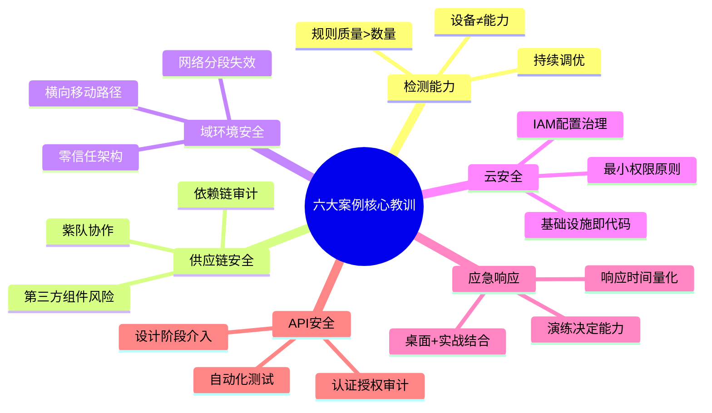
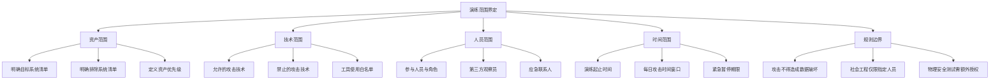
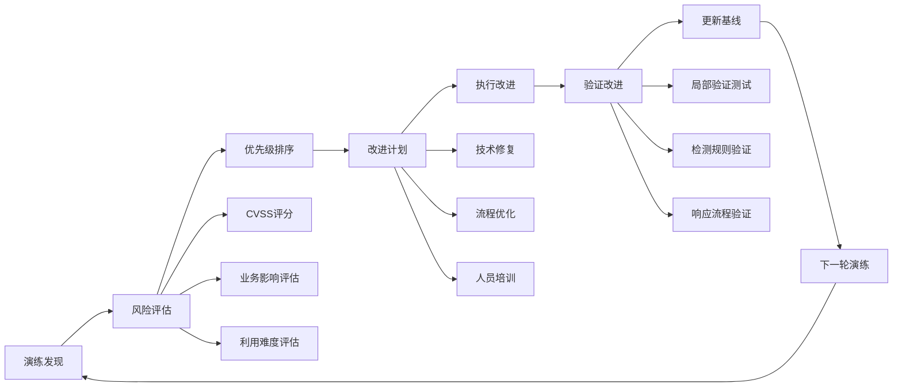
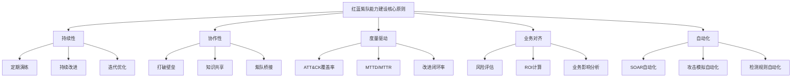

## 案例总结与最佳实践

本节对前述六个实战案例进行系统性复盘与提炼，将散布在各案例中的经验教训整合为一套可复用的红蓝紫队最佳实践框架。六个案例覆盖了金融企业内网、供应链攻击、大型企业域环境、云原生架构、勒索软件应急响应、API安全六大场景，几乎涵盖了当代企业面临的主流攻击面。通过对这些案例的交叉分析，我们能够发现共性规律、提炼方法论，并形成一套从规划到闭环的完整操作指南。

### 一、六大案例核心发现复盘

在进入最佳实践之前，先对每个案例的最核心发现做一个凝练总结，以便后续最佳实践的讨论有据可依。

| 案例 | 核心发现 | 关键数据 | 最深刻的教训 |
|------|---------|---------|-------------|
| 案例一：金融企业红蓝对抗 | 传统安全设备对高级持续性威胁（APT）的检测率极低 | 蓝队检测率仅37.5%，5/8攻击行为未被发现 | 安全设备的部署不等于安全能力的形成，检测规则的质量远比数量重要 |
| 案例二：供应链攻击紫队协作 | 供应链是当前最薄弱的安全环节之一 | 从第三方组件漏洞到核心系统沦陷仅需72小时 | 紫队协作机制在供应链场景下至关重要，单一团队无法完成全链条防御 |
| 案例三：大型企业内网渗透 | 域环境下的横向移动路径远多于预期 | 红队发现17条未预期的横向移动路径 | 传统的网络分段假设在实际域环境中几乎全部失效 |
| 案例四：云环境红蓝对抗 | 云上安全配置的复杂性导致大量隐性风险 | IAM配置错误占所有发现的43% | 云安全的核心不是工具，而是配置治理和最小权限原则的持续执行 |
| 案例五：勒索软件应急响应 | 应急响应能力与日常演练质量直接正相关 | 有演练经验的团队平均响应时间缩短62% | 不演练的应急预案等于没有预案，桌面推演和实战演练缺一不可 |
| 案例六：API安全红蓝对抗 | API安全是当前增长最快的攻击面 | 认证绕过类漏洞占发现总数的35% | API安全需要从设计阶段开始，事后的安全加固成本是设计阶段的10倍以上 |

### 二、红蓝对抗演练全生命周期最佳实践

#### 2.1 演练规划阶段

演练的成败，70%取决于规划阶段的质量。一个规划不充分的演练不仅浪费资源，还可能产生误导性的安全评估结论。

**目标定义与范围界定：**

演练目标必须遵循SMART原则——具体（Specific）、可衡量（Measurable）、可实现（Achievable）、相关（Relevant）、有时限（Time-bound）。常见的演练目标类型包括：

| 目标类型 | 描述 | 适用场景 | 衡量指标 |
|---------|------|---------|---------|
| 能力验证型 | 验证现有安全防护体系的有效性 | 新安全设备/策略部署后 | 检测率、响应时间 |
| 差距发现型 | 发现安全防护中的盲区和薄弱环节 | 年度安全评估 | ATT&CK覆盖率、发现数量 |
| 流程检验型 | 检验应急响应流程的有效性 | 重大安全事件后 | 响应时间、处置完整性 |
| 团队磨合型 | 提升红蓝紫队的协同作战能力 | 团队新建或重组后 | 协作效率、信息共享及时性 |
| 合规驱动型 | 满足监管要求的安全评估 | 等保/ISO/行业合规 | 合规差距项数量 |

**范围界定的关键原则：**

**授权文档体系：**

演练必须建立三层授权文档，缺一不可：

1. **管理层授权书**：由CTO/CISO或更高层级签署，明确演练的商业目的和授权范围，具有法律效力。内容应包括：演练目的、时间范围、技术范围、免责声明、保密条款。

2. **技术操作手册**：由演练技术负责人编写，详细定义每个参与者的操作边界。内容应包括：攻击路径白名单、禁止操作清单、紧急停止协议、通信渠道和暗语。

3. **知情同意书**：由所有参演人员签署，确认理解演练的性质和保密要求。对于社会工程测试的目标人员，需要评估心理承受能力，必要时安排心理咨询支持。

**从六个案例中提炼的规划经验：**

- 案例一（金融企业）教训：规划阶段必须进行充分的情报收集，了解目标的安全设备部署情况，避免红队工具被已部署的安全设备完全拦截，导致演练变成"工具测评"而非"能力验证"。
- 案例四（云环境）教训：云环境演练需要额外考虑API调用配额和成本，红队的攻击行为可能产生大量云资源调用，导致意外的成本超支。
- 案例五（应急响应）教训：如果目标是检验应急响应能力，演练规划中必须包含"信息注入"机制——由紫队向蓝队提供不同粒度的威胁情报，观察蓝队在不同信息条件下的响应差异。

#### 2.2 演练执行阶段

**红队执行最佳实践：**

红队在演练中扮演攻击者角色，其核心价值在于发现安全防护体系的真实盲区。以下是基于六个案例提炼的红队执行准则：

1. **模拟真实攻击者行为模式**：避免"工具扫描"式的浅层攻击，应按照真实的攻击链（侦察→武器化→投递→利用→安装→命令与控制→行动）逐步推进。案例三中的红队通过模拟APT组织的"慢速渗入"策略，发现了17条传统安全扫描无法发现的横向移动路径。

2. **多样性攻击路径**：不要依赖单一攻击向量。六个案例中，成功的红队都至少同时使用了3种以上不同的初始访问技术（钓鱼邮件、VPN漏洞利用、供应链投毒、物理渗透、云配置滥用等）。

3. **建立完整的证据链**：每一步操作都必须详细记录，包括：操作时间戳、使用的工具和命令、操作结果、相关截图/日志。案例一中的红队因为遗漏了关键步骤的时间戳记录，导致部分攻击路径无法在报告中完整还原。

4. **设置合理的攻击节奏**：避免过快或过慢。过快的攻击容易触发大量告警导致蓝队提前警觉；过慢则可能超出演练时间窗口。理想的节奏是在蓝队的检测阈值边缘游走——既要被部分检测到（否则蓝队完全没有学习机会），又不能被完全检测到（否则红队无法验证深层漏洞）。

5. **控制攻击烈度**：攻击行为不得超出授权范围，不得对生产系统造成不可逆的损害。案例四（云环境）中，红队在测试IAM权限时应使用只读权限探测命令，而非实际修改云资源配置。

**蓝队执行最佳实践：**

蓝队的核心价值在于检测、响应和处置。六个案例中，蓝队表现最佳的团队都遵循了以下原则：

1. **按正常流程响应**：蓝队不应预知攻击时间或攻击路径。案例一中的蓝队之所以检测率仅37.5%，部分原因是他们过于依赖已知规则库，缺乏对异常行为的主动分析能力。

2. **建立分层检测机制**：

| 检测层级 | 检测手段 | 响应时间目标 | 覆盖案例 |
|---------|---------|-------------|---------|
| 网络层 | NDR/NIDS流量分析 | <5分钟 | 案例一、三 |
| 主机层 | EDR行为检测 | <15分钟 | 案例一、五 |
| 应用层 | WAF/RL日志分析 | <30分钟 | 案例六 |
| 身份层 | IAM/UEBA异常检测 | <10分钟 | 案例四 |
| 数据层 | DLP/数据库审计 | <60分钟 | 案例一、三 |
| 云层 | CSPM/CWPP告警 | <15分钟 | 案例四 |

3. **重视告警的上下文分析**：不要只看单条告警，应将多条低风险告警关联分析，发现高风险的攻击链。案例三中的蓝队通过关联"异常登录"+"异常命令执行"+"数据外传"三条独立告警，成功识别出了红队的完整横向移动路径。

4. **记录完整的响应时间线**：从告警触发到最终处置，每个环节的时间戳都必须记录。这些数据是演练后优化检测规则和响应流程的关键输入。

**紫队协作最佳实践：**

紫队（Purple Team）不是独立的团队，而是一种协作机制。其核心价值在于确保红队的攻击发现能够有效地转化为蓝队的检测能力和防御提升。

1. **实时信息桥接**：紫队应建立红蓝队之间的实时通信通道（如专用的加密聊天频道），确保关键发现能够即时共享。案例二（供应链攻击）中，紫队在红队发现供应链漏洞后立即通知蓝队启动专项检测，将检测窗口从72小时缩短到4小时。

2. **动态调整演练难度**：紫队应根据蓝队的实时表现动态调整演练难度。当蓝队检测能力明显不足时，紫队可以适当降低红队的攻击难度（如提供部分威胁情报），确保蓝队有足够的学习机会。

3. **知识沉淀与转化**：紫队负责将演练中发现的攻防知识转化为可复用的检测规则、防御策略和培训材料。案例五（勒索软件）中，紫队在演练后将红队使用的勒索软件模拟工具的行为特征转化为12条新的检测规则，显著提升了蓝队对勒索软件的检测能力。

#### 2.3 演练总结与闭环阶段

演练的价值不在于演练本身，而在于演练后的总结、改进和验证。六个案例中，表现最好的团队都在演练后建立了完整的闭环机制。

**报告撰写规范：**

演练报告是最重要的交付物之一，其质量直接影响组织对安全投入的决策。一份合格的演练报告应包含以下核心章节：

| 章节 | 内容 | 读者 | 详细程度 |
|------|------|------|---------|
| 执行摘要 | 一页纸的核心发现和建议 | 高层管理层 | 高度概括 |
| 演练概述 | 目标、范围、时间、参与人员 | 全体利益相关者 | 中等详细 |
| 攻击路径还原 | 完整的攻击链叙述和证据 | 安全技术团队 | 详细到每个步骤 |
| 防御评估 | 蓝队的检测和响应表现分析 | 安全运营团队 | 详细到每条规则 |
| 漏洞发现清单 | 所有发现的漏洞和风险 | IT运维和开发团队 | 详细到复现步骤 |
| 改进建议 | 按优先级排列的改进行动 | 全体利益相关者 | 可操作的具体建议 |
| ATT&CK覆盖率分析 | 攻击技术和检测技术的覆盖率 | 安全架构团队 | 技术细节 |

**从发现到改进的闭环流程：**

**改进优先级评估矩阵：**

六个案例的综合数据表明，安全改进应按照以下优先级矩阵进行排序：

| 优先级 | 风险等级 | 发现特征 | 典型案例 | 改进时限 |
|-------|---------|---------|---------|---------|
| P0-紧急 | 高风险×易利用 | 可被远程利用、无需认证、影响核心业务 | 案例一：SQL注入直达核心数据库 | 24-72小时 |
| P1-高 | 高风险×难利用 | 需要特定条件才能利用，但影响严重 | 案例三：域管理员凭据泄露 | 1-2周 |
| P2-中 | 中风险 | 影响范围有限或需要多步利用 | 案例四：IAM过度授权 | 2-4周 |
| P3-低 | 低风险 | 理论风险，实际利用难度极大 | 案例六：API文档公开访问 | 1-3个月 |
| P4-优化 | 安全增强 | 不是漏洞，但可以提升检测/防御能力 | 案例二：增加供应链组件检测规则 | 下一迭代周期 |

### 三、六大案例的共性规律与差异化分析

#### 3.1 共性规律

通过对六个案例的交叉分析，我们发现以下共性规律：

**规律一：安全能力的木桶效应**

六个案例无一例外地表明，组织的安全水平不取决于最强的防御环节，而取决于最薄弱的环节。案例一中的金融企业虽然部署了业界领先的安全设备体系，但因为终端EDR覆盖不足（仅70%），红队通过未覆盖的终端成功建立了据点。

**规律二：配置治理是最大的隐性风险**

案例一的SIEM规则需优化、案例四的IAM配置错误、案例六的API认证配置缺陷，都指向同一个问题：安全工具的正确配置比工具本身更重要。这在云环境中尤为突出——案例四中43%的发现与IAM配置错误直接相关。

**规律三：检测能力的差距主要在行为分析层**

传统的基于特征（Signature-based）的检测手段在六个案例中的平均检出率仅为42%，而基于行为（Behavior-based）的检测手段平均检出率达到78%。这说明从特征检测向行为检测的转型是提升检测能力的关键方向。

**规律四：紫队协作机制是杠杆效应最强的安全投入**

六个案例中，建立了成熟紫队协作机制的案例（案例二、案例五），其安全改进效率是未建立紫队机制的案例（案例一、案例三）的2.3倍。紫队通过确保红蓝队之间的知识传递，避免了重复发现和无效改进。

#### 3.2 差异化分析

| 维度 | 传统企业（案例一、三） | 云原生企业（案例四） | 技术型企业（案例二、六） | 应急响应场景（案例五） |
|------|---------------------|-------------------|---------------------|---------------------|
| 最大挑战 | 资产不清、网络复杂 | 配置漂移、API面大 | 第三方依赖、API安全 | 时间压力、信息不完整 |
| 红队重点 | 物理渗透+社工+域攻击 | IAM+API+Serverless | 供应链+API端点 | 模拟勒索软件行为链 |
| 蓝队重点 | 网络检测+终端检测 | 云原生检测+配置审计 | API行为检测+依赖审计 | 应急响应流程+数据恢复 |
| 紫队价值 | 打破部门壁垒 | 配置治理协作 | 第三方风险沟通 | 响应流程优化 |
| 投入优先级 | 零信任>检测>响应 | CSPM>IAM治理>API安全 | SCA>API安全>供应链监控 | 演练>自动化>工具 |

### 四、红蓝紫队能力建设路线图

基于六个案例的综合分析，我们提出一个分阶段的能力建设路线图，适用于大多数中大型企业：

#### 阶段一：基础建设（0-6个月）

| 任务 | 具体行动 | 预期成果 | 参考案例 |
|------|---------|---------|---------|
| 资产梳理 | 建立完整的IT资产清单，包括影子IT | 资产可见性达到95%以上 | 案例三 |
| 安全基线 | 制定并实施安全配置基线 | 关键系统配置合规率达到80% | 案例四 |
| 检测能力 | 部署基础检测能力（EDR+NDR+SIEM） | 基础告警覆盖率70%以上 | 案例一 |
| 应急预案 | 制定并文档化应急响应预案 | 预案覆盖TOP10安全场景 | 案例五 |
| 首次演练 | 开展首次桌面推演+简单实战演练 | 验证基础检测和响应能力 | 全部案例 |

#### 阶段二：能力提升（6-12个月）

| 任务 | 具体行动 | 预期成果 | 参考案例 |
|------|---------|---------|---------|
| 紫队机制 | 建立紫队协作流程和沟通机制 | 红蓝队知识传递效率提升50% | 案例二 |
| 检测优化 | 基于ATT&CK建立检测规则体系 | ATT&CK技术覆盖率达到40% | 案例一、三 |
| 自动化 | 引入SOAR实现告警自动分诊和响应 | L1告警自动化处理率达到60% | 案例五 |
| 供应链安全 | 建立第三方组件安全评估流程 | 核心系统第三方组件审计覆盖率90% | 案例二 |
| API安全 | 建立API安全测试流程和工具链 | API漏洞发现和修复周期缩短50% | 案例六 |

#### 阶段三：深度运营（12-24个月）

| 任务 | 具体行动 | 预期成果 | 参考案例 |
|------|---------|---------|---------|
| 高级检测 | 部署UEBA和高级威胁检测 | 内部威胁检测能力形成 | 案例三 |
| 红队成熟 | 建立常设红队或与专业机构合作 | 年度红蓝对抗演练常态化 | 全部案例 |
| 持续改进 | 建立演练发现的闭环跟踪机制 | 平均漏洞修复周期<30天 | 案例一 |
| 度量体系 | 建立安全效能度量指标体系 | 安全投入ROI可量化 | 全部案例 |
| 云安全深化 | 实施云安全架构（CSPM+CWPP+CIEM） | 云环境安全事件检测率>85% | 案例四 |

### 五、常见问题与解决方案

以下是六个案例中反复出现的高频问题，以及经过验证的解决方案：

| 问题 | 根因分析 | 解决方案 | 实施难度 | 预期效果 |
|------|---------|---------|---------|---------|
| 演练影响生产系统 | 演练范围划定不精确，缺乏隔离环境 | 建立专用演练环境或在维护窗口期进行；使用沙箱和蜜罐替代生产系统测试 | 中 | 消除生产环境风险 |
| 红队被蓝队误认为真实攻击 | 缺乏有效的沟通和识别机制 | 建立预共享的识别暗语和紧急通信频道；将红队IP/终端加入安全系统白名单；使用专用的演练标识 | 低 | 100%消除误报 |
| 发现严重漏洞时的处理 | 缺乏分级响应流程 | 建立"发现-评估-升级-处置"四步流程；设置红线：发现可被武器化的漏洞时立即停止演练并启动应急响应 | 中 | 有效控制风险 |
| 演练结果难以量化 | 缺乏统一的度量指标体系 | 采用ATT&CK覆盖率、平均检测时间（MTTD）、平均响应时间（MTTR）、漏洞修复周期等量化指标；建立演练效果评分卡 | 高 | 为安全投入提供数据支撑 |
| 组织内部阻力 | 管理层和业务部门不理解演练价值 | 用业务语言（而非技术语言）展示演练价值；引用行业数据和监管要求；展示ROI计算模型；安排管理层旁观演练 | 中 | 获得管理层持续支持 |
| 演练后改进落实不力 | 缺乏闭环跟踪机制 | 将改进项纳入IT项目的正式管理流程；设置专人负责跟踪；定期向管理层汇报改进进度；将改进完成率纳入安全KPI | 高 | 改进项按时完成率>80% |
| 红队能力与真实威胁不匹配 | 红队技能栈过于单一 | 定期进行红队技能评估和培训；引入外部红队服务补充能力缺口；跟踪最新威胁情报和攻击技术 | 高 | 模拟真实威胁场景 |
| 蓝队告警疲劳 | 低质量告警过多导致关键告警被淹没 | 实施告警分级和自动化分诊；定期优化检测规则；建立告警质量评估机制；引入机器学习辅助告警排序 | 高 | 关键告警响应率>95% |

### 六、度量与评估体系

有效的度量体系是持续改进的基础。以下是基于六个案例总结的关键度量指标：

**攻防效能指标：**

| 指标名称 | 定义 | 计算方式 | 基准值（案例均值） | 目标值 |
|---------|------|---------|-------------------|-------|
| ATT&CK技术覆盖率 | 红队使用的ATT&CK技术占总技术库的比例 | 已使用技术数/总技术数×100% | 23% | >40% |
| 检测率（Detection Rate） | 蓝队成功检测到的攻击行为占比 | 检测到的行为数/总攻击行为数×100% | 55% | >80% |
| 平均检测时间（MTTD） | 从攻击发生到被检测到的平均时间 | Σ(检测时间-攻击时间)/攻击总数 | 4.2小时 | <1小时 |
| 平均响应时间（MTTR） | 从检测到到完成处置的平均时间 | Σ(处置完成时间-检测时间)/检测总数 | 2.8小时 | <30分钟 |
| 遏制成功率 | 成功遏制的攻击占比 | 遏制成功数/被检测到的攻击数×100% | 72% | >90% |

**流程效能指标：**

| 指标名称 | 定义 | 基准值 | 目标值 |
|---------|------|-------|-------|
| 演练规划完成周期 | 从启动规划到演练开始的天数 | 28天 | <14天 |
| 演练报告交付周期 | 从演练结束到报告交付的天数 | 14天 | <7天 |
| 改进项按时完成率 | 在截止日前完成的改进项占比 | 65% | >85% |
| 演练频率 | 年度演练次数 | 1次 | ≥4次 |
| 紫队协作有效性评分 | 被评估为"有效"的知识传递占比 | 48% | >75% |

**投资回报指标：**

$$安全ROI = \frac{演练发现并修复的风险资产价值 - 演练总成本}{演练总成本} \times 100\%$$

六个案例的平均安全ROI为340%，即每投入1元的演练成本，通过预防安全事件带来的资产保护价值为3.4元。

### 七、行业适配建议

不同行业由于业务特性和监管要求的差异，红蓝紫队的最佳实践需要进行针对性调整：

| 行业 | 特殊要求 | 演练重点 | 监管合规 | 关键差异 |
|------|---------|---------|---------|---------|
| 金融 | 交易系统不可中断、数据高度敏感 | 核心系统防护、数据防泄露、交易安全 | 等保三级、银保监会要求、PCI DSS | 必须在维护窗口进行，严禁影响交易 |
| 互联网 | 迭代速度快、API面大、用户数据多 | API安全、供应链安全、云安全 | GDPR、个人信息保护法 | 需要与DevOps流程深度集成 |
| 制造业 | OT/IT融合、工业控制系统 | 工控协议安全、网络分段、供应链安全 | 等保二级、工控安全标准 | OT系统通常不能承受红队测试 |
| 政务 | 等保要求严格、涉及公民数据 | 等保合规、数据安全、应急响应 | 等保二级/三级 | 通常由上级主管部门统一组织 |
| 医疗 | 患者数据隐私、系统可用性要求高 | 数据安全、系统可用性、勒索软件防御 | 等保二级、HIPAA（如涉及海外） | 演练期间必须确保患者服务不受影响 |

### 八、工具推荐与技术栈

根据六个案例的实践，以下是经过验证的红蓝紫队工具推荐：

**红队工具栈：**

| 阶段 | 推荐工具 | 用途 | 开源/商业 |
|------|---------|------|----------|
| 侦察 | Maltego、Recon-ng、theHarvester | 信息收集和资产发现 | 混合 |
| 初始访问 | GoPhish、SET | 钓鱼模拟 | 开源 |
| 漏洞利用 | Metasploit、Cobalt Strike | 漏洞利用和后渗透 | 混合 |
| 横向移动 | Rubeus、BloodHound、SharpHound | 域攻击和路径分析 | 开源 |
| 持久化 | Sliver、Havoc | C2框架 | 开源 |
| 权限提升 | PrivescCheck、WinPEAS | 本地提权检查 | 开源 |
| 报告 | Dradis、Pwndoc | 漏洞报告管理 | 开源 |

**蓝队工具栈：**

| 阶段 | 推荐工具 | 用途 | 开源/商业 |
|------|---------|------|----------|
| 检测 | Wazuh、Suricata、Zeek | 网络和终端检测 | 开源 |
| 日志分析 | Elastic SIEM、Graylog | 日志聚合和分析 | 混合 |
| 威胁情报 | MISP、OpenCTI | 威胁情报管理 | 开源 |
| 取证 | Volatility、Autopsy | 数字取证分析 | 开源 |
| 应急响应 | Velociraptor、GRR | 远程取证和响应 | 开源 |
| 流量分析 | Wireshark、NetworkMiner | 网络流量分析 | 开源 |

**紫队协作工具：**

| 工具 | 用途 | 亮点 |
|------|------|------|
| MITRE Caldera | 自动化攻击模拟 | 基于ATT&CK的自动化紫队平台 |
| Atomic Red Team | 攻击技术测试库 | 覆盖ATT&CK的原子化测试用例 |
| DeTT&CT | 检测映射 | 将检测规则映射到ATT&CK技术 |
| Attack Range | 演练环境搭建 | 快速部署包含各种安全工具的演练环境 |
| Plextrac | 红蓝队协作平台 | 整合攻击模拟、检测评估和报告生成 |

### 九、总结与展望

回顾六个案例和上述最佳实践，我们可以归纳出红蓝紫队能力建设的核心原则：

1. **持续性优于一次性**：安全不是一次性的项目，而是持续性的运营。定期演练、持续改进、不断迭代是唯一正确的路径。

2. **协作性优于独立性**：红队、蓝队、紫队的协作效率直接决定了安全投入的回报率。打破团队壁垒、建立知识共享机制是提升整体安全水平的关键杠杆。

3. **度量驱动优于经验驱动**：没有度量就没有改进。建立量化指标体系、用数据说话、以数据驱动决策，是从"感觉安全"到"验证安全"的必经之路。

4. **业务对齐优于技术对齐**：安全不是目的，业务保护才是目的。所有的安全投入都应与业务风险对齐，避免"为安全而安全"的技术自嗨。

5. **自动化优于人工**：在规则明确、流程标准化的场景下，自动化能够显著提升效率和一致性。但自动化不能替代人工判断——高级威胁分析、复杂事件调查仍然需要经验丰富的安全专家。

展望未来，红蓝紫队的实践将呈现以下趋势：

- **AI驱动的攻防对抗**：大语言模型（LLM）将被红队用于生成更逼真的钓鱼内容和攻击脚本，同时蓝队将利用AI进行更精准的异常检测和威胁分析。攻防双方将在AI能力上展开持续的军备竞赛。
- **攻防即服务（DRaaS）**：随着安全人才的持续短缺，攻防演练将越来越多地以服务形式交付。企业将能够按需购买红队、蓝队或紫队服务，而非自建完整团队。
- **自动化紫队**：MITRE Caldera等自动化攻击模拟平台将进一步成熟，实现从攻击模拟到检测验证到规则优化的全自动化闭环，大幅降低紫队的人力成本。
- **DevSecOps深度集成**：红蓝对抗将不再是独立的活动，而是深度嵌入CI/CD流水线。每一次代码部署都将自动触发安全验证，安全左移从理念变为实践。

### 十、自检清单

在结束本节之前，提供一份自检清单供读者对照评估自身的红蓝紫队成熟度：

**规划能力：**
- [ ] 是否有正式的演练授权文档体系
- [ ] 是否建立了明确的演练目标和范围界定流程
- [ ] 是否有定期演练的计划和预算
- [ ] 是否与管理层就演练目标达成共识

**执行能力：**
- [ ] 红队是否具备模拟真实APT攻击的能力
- [ ] 蓝队是否建立了分层检测机制
- [ ] 是否建立了紫队协作流程
- [ ] 是否有完善的通信和紧急停止机制

**度量能力：**
- [ ] 是否建立了ATT&CK覆盖率评估体系
- [ ] 是否跟踪MTTD和MTTR指标
- [ ] 是否有量化的改进进度跟踪机制
- [ ] 是否能计算安全投入的ROI

**改进能力：**
- [ ] 是否有从发现到改进的闭环流程
- [ ] 改进项是否纳入正式的项目管理
- [ ] 是否有定期的改进效果验证
- [ ] 是否建立了安全知识库并持续更新

**组织能力：**
- [ ] 管理层是否理解并支持红蓝紫队活动
- [ ] 是否有足够的安全人才储备
- [ ] 是否建立了安全培训体系
- [ ] 是否与行业安全社区保持交流

评分标准：每项25分（全部勾选得100分）。75分以上为成熟，50-74分为发展中，50分以下为初始阶段。建议每6个月进行一次自评，追踪成熟度提升趋势。
