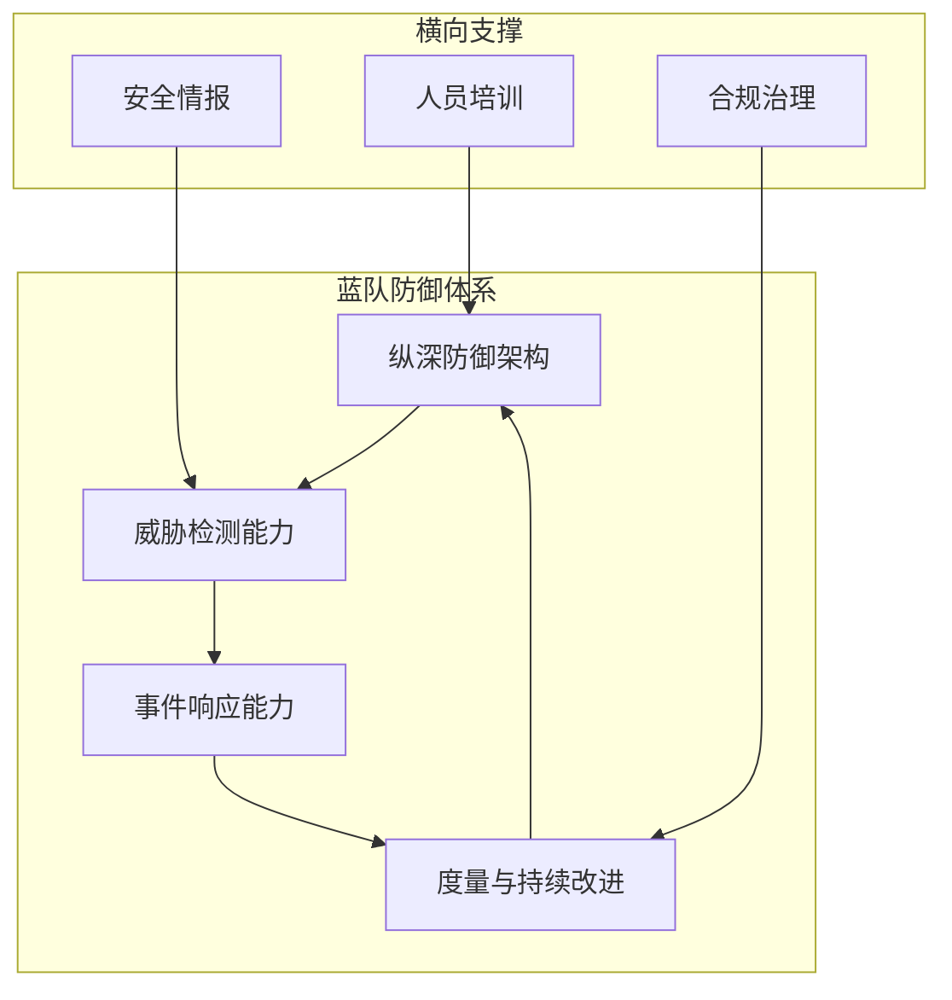
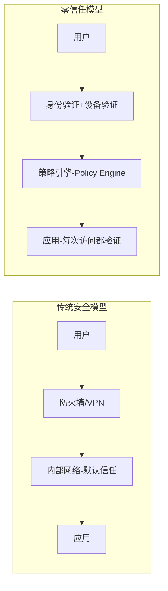
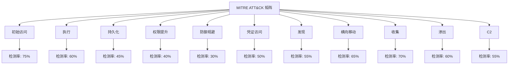
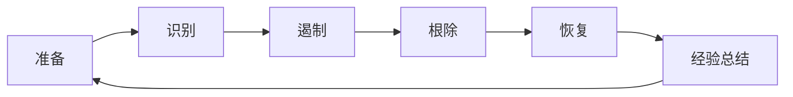

## 26.2.2 蓝队防御体系

蓝队（Blue Team）是网络安全防御体系的核心执行者，其使命是**持续保护组织资产免受网络威胁**。与红队的攻击思维不同，蓝队需要建立一套"纵深防御、主动检测、快速响应"的完整安全运营体系。本节将从架构设计、检测能力、事件响应、度量评估四个维度，系统阐述蓝队防御体系的构建方法论。



### 纵深防御架构

纵深防御（Defense in Depth）源自军事战略思想，核心理念是**不依赖单一安全控制，而是部署多层互补的防御措施**，使得攻击者必须突破每一层才能达成目标，从而大幅提升攻击成本和检测概率。NIST SP 800-53 和 MITRE ATT&CK 框架都强调了分层防御的重要性。

#### 网络层防御

网络层是防御体系的第一道屏障，目标是在网络边界和内部遏制攻击者的横向移动和数据外泄。

**下一代防火墙（NGFW）策略配置与优化**

NGFW 不仅仅是传统防火墙的升级，它集成了应用识别、入侵防御（IPS）、URL 过滤和威胁情报订阅等能力。配置优化的关键要点：

- **默认拒绝策略**：所有入站/出站流量默认阻断，仅放行业务必需端口和协议。常见错误是"允许一切，阻断已知恶意"，这种白名单策略几乎无效
- **应用层策略**：基于应用（而非端口）控制流量。例如，阻断所有非授权的 HTTP 代理工具（如 ngrok、frp），而不仅仅是封端口
- **地理围栏（Geo-fencing）**：对与业务无关的高风险国家/地区实施出站连接阻断。例如，一家纯国内业务的公司应阻断与朝鲜、伊朗的直接通信
- **SSL/TLS 检查**：部署 SSL 解密策略，在网关层解密并检查加密流量中的恶意内容，否则 70% 以上的现代攻击可以"隐身"通过
- **定期策略审计**：每季度清理冗余规则（一般组织存在 30-40% 的无效规则），删除过期的临时放行条目

```bash
# Palo Alto NGFW 策略审计示例：查找未命中次数为0的规则
# 这些规则可能是冗余或过期的
show running security-policy | match "hits 0"
```

**网络分段与微隔离（Micro-segmentation）**

传统的网络分段（VLAN）粒度太粗，现代方案采用软件定义网络（SDN）实现微隔离：

| 方案 | 粒度 | 适用场景 | 代表产品 |
|------|------|---------|---------|
| VLAN 分段 | 子网级 | 基础网络隔离 | 交换机原生支持 |
| 微隔离 | 工作负载级 | 数据中心/云环境 | Illumio, Guardicore |
| 东西向防火墙 | 主机级 | 防止横向移动 | VMware NSX, Cisco ACI |
| 云安全组 | API 级 | 云原生工作负载 | AWS Security Groups, Azure NSG |

实施要点：
- **按业务功能分段**：Web 服务器、应用服务器、数据库服务器分别置于独立网段，仅开放必要的通信路径
- **敏感数据隔离**：财务系统、人事系统、核心代码仓库应部署在独立的安全区域（DMZ 或隔离 VLAN）
- **默认拒绝东西向流量**：同一网段内部的主机间通信也需要显式放行，防止攻击者在网络内部自由横向移动
- **微隔离策略的持续更新**：随着应用架构变化（容器化、微服务），策略需要动态调整

**DNS 安全监控与 Sinkhole 部署**

DNS 是攻击者最常用的 C2 通信和数据外泄通道，DNS 安全监控是蓝队防御的关键环节：

- **DNS Sinkhole（污水池）**：将已知恶意域名解析到内部受控 IP，既阻断了恶意通信，又能通过日志发现被感染的主机。部署方式通常是在内部 DNS 服务器上配置恶意域名的静态 A 记录指向 sinkhole IP
- **DNS 查询日志分析**：监控异常 DNS 模式，如高频 TXT 记录查询（常用于 DNS 隧道数据外泄）、长随机子域名（DGA 域名生成算法的特征）、向新注册域名的查询
- **DNSSEC 验证**：启用 DNS 安全扩展防止 DNS 缓存投毒和 DNS 劫持
- **DoH/DoT 拦截**：阻断客户端直接使用加密 DNS（如 Cloudflare 1.1.1.1、Google 8.8.8.8），强制所有 DNS 查询经过内部 DNS 服务器

```bash
# DNS Sinkhole 配置示例（BIND）
# 在 /etc/bind/named.conf.local 中添加
zone "malicious-domain.com" {
    type master;
    file "/etc/bind/sinkhole.zone";
};

# sinkhole.zone 文件内容
$TTL 86400
@       IN      SOA     ns1.internal.com. admin.internal.com. (
                        2026060101 ; Serial
                        3600       ; Refresh
                        900        ; Retry
        604800       ; Expire
        86400 )      ; Negative Cache TTL
@       IN      A       10.0.0.99   ; Sinkhole IP
*       IN      A       10.0.0.99   ; 通配符匹配所有子域名
```

**网络流量分析（NTA）与异常检测**

NTA（Network Traffic Analysis）工具通过被动监听网络流量，建立正常行为基线，从而检测异常通信模式：

- **全流量捕获（PCAP）**：在网络核心交换机部署镜像端口或 TAP 设备，捕获全量流量用于事后分析。工具如 Zeek（原 Bro）、Suricata
- **NetFlow/IPFIX 分析**：收集流量元数据（源目 IP、端口、协议、字节数、时间），识别大流量外传、异常端口扫描、横向移动迹象
- **加密流量分析**：即使不解密内容，也可以通过流量元数据（包大小分布、时序特征、TLS 指纹 JA3/JA4）识别恶意通信。例如 C2 框架（Cobalt Strike）的 TLS 握手有可识别的 JA3 指纹
- **南北向 vs 东西向监控**：大多数 NTA 侧重互联网边界（南北向），但攻击者 80% 的活动发生在内部网络（东西向），因此内部流量监控同样关键

#### 终端层防御

终端（Endpoint）是攻击者最终需要控制的目标，终端防御的强度直接决定了攻击的成败。

**EDR 部署与策略调优**

EDR（Endpoint Detection and Response）是现代终端安全的基石，它不仅防病毒，更重要的是提供**实时行为监控、威胁检测和事件响应能力**：

- **行为检测 vs 签名检测**：传统杀毒软件依赖特征码签名，对未知威胁（0-day）束手无策。EDR 通过监控进程行为（如 PowerShell 执行链、注入行为、文件落地）检测未知威胁
- **遥测数据收集**：EDR 代理收集丰富的终端遥测数据，包括进程创建/终止、文件读写、注册表修改、网络连接、DLL 加载等，为威胁狩猎和事件调查提供数据基础
- **策略调优方法论**：
  - 先部署在监控模式（Monitor Mode）2-4 周，收集基线数据
  - 分析误报日志，针对业务系统定制检测例外（如 ERP 系统的批量脚本执行）
  - 逐步切换到阻止模式（Prevention Mode），优先阻断高置信度的恶意行为
  - 定期更新检测规则和 IOB（Indicators of Behavior）而非仅 IOC

**应用白名单（AppLocker / WDAC）**

应用白名单是防御恶意软件的终极手段——只允许已批准的应用程序运行，未知程序一律拦截：

- **AppLocker（Windows）**：基于发布者证书、文件路径或文件哈希定义规则。适合中小企业，配置相对简单
- **WDAC（Windows Defender Application Control）**：微软推荐的新一代应用控制策略，不可绕过（AppLocker 可以被 SYSTEM 权限进程绕过），适合高安全环境
- **实施挑战**：白名单的最大难点是**运维成本**——每次系统更新、补丁安装都可能需要更新白名单规则。解决方案是基于发布者证书（而非哈希）定义规则，减少维护负担

```powershell
# WDAC 策略部署示例：仅允许签名程序执行
New-CIPolicy -Level Publisher -FilePath "C:\Policies\BaselinePolicy.xml" -UserPEs
ConvertFrom-CIPolicy -XmlFilePath "C:\Policies\BaselinePolicy.xml" -BinaryFilePath "C:\Policies\SIPolicy.p7b"
Copy-Item "C:\Policies\SIPolicy.p7b" -Destination "C:\Windows\System32\CodeIntegrity\SIPolicy.p7b"
```

**主机入侵检测系统（HIDS）**

HIDS 通过监控主机文件完整性、日志和系统调用来检测入侵行为：

- **文件完整性监控（FIM）**：对关键系统文件（/etc/passwd、/etc/shadow、系统二进制文件）建立哈希基线，定期校验是否被篡改。工具如 OSSEC、Wazuh、Tripwire
- **Rootkit 检测**：通过内核级监控检测隐藏进程、隐藏文件和系统调用劫持。Linux 下可使用 rkhunter、chkrootkit
- **日志聚合与分析**：收集系统日志（syslog、auth.log、audit.log），应用检测规则发现异常登录、权限变更、可疑进程执行等事件

**终端加固基线（CIS Benchmark）**

CIS（Center for Internet Security）提供了针对各操作系统和应用的安全配置基线：

- **核心加固项**：禁用不必要的服务和端口、设置密码策略（最小长度 14 位、90 天轮换）、启用审计日志、关闭自动播放、配置屏幕锁定策略
- **自动化部署**：使用 Ansible/SaltStack 批量推送基线配置到所有终端，避免手动配置的遗漏和不一致
- **合规 vs 安全**：CIS 基线是"及格线"而非"满分"。企业应根据自身威胁模型在基线上增强，如对高风险终端启用更严格的控制

#### 身份层防御

身份已成为新的安全边界。根据 Verizon DBIR 报告，超过 80% 的数据泄露事件涉及凭据滥用或身份验证失败。

**多因素认证（MFA）全覆盖**

MFA 要求用户提供两种以上身份验证因素，大幅降低凭据被盗后的风险：

| 认证因素 | 代表方式 | 安全等级 | 用户体验 |
|---------|---------|---------|---------|
| 你知道的 | 密码、PIN、安全问题 | 低 | 高 |
| 你拥有的 | 硬件令牌、手机 APP、智能卡 | 中-高 | 中 |
| 你生物的 | 指纹、面部识别、虹膜 | 高 | 高 |
| 你在的 | GPS 位置、IP 范围、设备指纹 | 中 | 高 |

MFA 部署的关键决策：
- **优先保护的系统**：VPN、邮件系统、云管理控制台、特权账号是 MFA 覆盖的第一优先级
- **避免 SMS 验证码**：SIM 卡交换攻击（SIM Swapping）使短信验证码不再安全，优先使用 TOTP（时间戳一次性密码）或 FIDO2/WebAuthn 硬件密钥
- **条件访问策略**：根据设备合规状态、地理位置、风险评分动态调整 MFA 要求。例如：公司设备+内网环境可免 MFA，而外部设备+陌生 IP 必须 MFA
- **绕过攻击防御**：MFA 疲劳攻击（反复推送通知直到用户误点通过）、实时代理钓鱼（evilginx2）是 MFA 的主要威胁，需要通过设备绑定和反钓鱼 FIDO2 密钥来防御

**特权访问管理（PAM）**

特权账号（管理员、root、数据库 DBA）是攻击者获取最高控制权的必经之路：

- **特权账号清单**：盘点组织内所有特权账号，包括隐性特权（如服务账户、API 密钥、证书私钥）
- **即时权限（Just-In-Time Access）**：管理员不长期持有特权，而是在需要时临时申请、自动审批、限时收回。工具如 CyberArk、BeyondTrust、HashiCorp Vault
- **特权会话录制**：对特权操作（如 SSH 登录数据库服务器）进行全程录制，用于事后审计和取证
- **密码保险箱**：特权密码存储在加密保险箱中，自动轮换，禁止硬编码在脚本或配置文件中

**零信任架构（Zero Trust）**

零信任的核心原则是"**永不信任，始终验证**"（Never Trust, Always Verify）。Google BeyondCorp 是零信任的标杆实践：



实施零信任的关键组件：
- **身份验证平台**：集成 SSO、MFA、风险评估的统一身份平台（如 Azure AD、Okta）
- **设备信任评估**：检查终端设备的安全状态（补丁级别、EDR 运行状态、磁盘加密、合规性）
- **微分段（Micro-segmentation）**：网络层的零信任实现，每个工作负载独立认证
- **持续验证**：会话建立后持续评估风险，异常行为立即触发重新认证或断开连接

**身份威胁检测（ITDR）**

ITDR（Identity Threat Detection and Response）是 2023 年 Gartner 提出的新安全领域，专门针对身份基础设施的攻击检测：

- **检测目标**：Active Directory 攻击（Kerberoasting、Golden Ticket、DCSync）、身份平台配置篡改、异常权限提升、凭据窃取
- **关键技术**：AD 变更审计（谁修改了哪些 GPO/ACL）、Kerberos 票据异常分析、登录行为基线对比
- **代表产品**：Microsoft Defender for Identity（原 Azure ATP）、CrowdStrike Falcon Identity、Proofpoint ITM

#### 应用层防御

**Web 应用防火墙（WAF）**
- 部署在 Web 应用前端，过滤恶意 HTTP 请求（SQL 注入、XSS、CSRF、RCE）
- 正向/负向模型结合：正向模型仅允许已知安全输入，负向模型阻断已知攻击模式
- 注意 WAF 绕过技术（编码变换、分块传输、HTTP 参数污染），定期进行 WAF 有效性测试

**API 安全网关**
- 现代应用架构中，API 是攻击者的主攻方向
- 实施认证授权（OAuth 2.0 / JWT 验证）、速率限制、输入验证、异常流量检测
- 监控 API 的数据暴露面，防止过度数据返回（OWASP API Security Top 10）

### 威胁检测能力

防御体系的"眼睛"——没有检测能力，再坚固的防线也只是"聋子的墙"。

#### 日志与告警管理

**SIEM 平台搭建与日志接入**

SIEM（Security Information and Event Management）是安全运营中心（SOC）的核心平台，负责日志的集中收集、存储、关联分析和告警：

- **日志源规划**：完整的日志覆盖至少包括以下来源

| 日志类别 | 来源示例 | 检测价值 |
|---------|---------|---------|
| 身份认证 | AD/LDAP、SSO 平台、VPN | 异常登录、暴力破解、凭据滥用 |
| 网络流量 | 防火墙、IDS/IPS、DNS、代理 | 横向移动、C2 通信、数据外泄 |
| 终端行为 | EDR、Sysmon、OS 日志 | 恶意进程、文件操作、权限提升 |
| 应用日志 | Web 服务器、数据库、中间件 | SQL 注入、应用漏洞利用 |
| 云平台 | AWS CloudTrail、Azure Activity Log | 配置篡改、权限滥用 |

- **日志保留策略**：热数据（近 30 天）保留全量原始日志用于实时分析；温数据（30-90 天）压缩存储用于事件调查；冷数据（90 天-1 年）归档存储用于合规和趋势分析
- **日志规范化**：将不同格式的日志统一为标准 Schema（如 ECS、CEF），便于跨源关联分析

**关联规则开发与调优**

关联规则是将多个低级别日志事件组合为有意义的安全告警：

```yaml
# 示例：检测横向移动的关联规则（Sigma 格式）
title: Lateral Movement - PsExec Remote Execution
status: stable
description: 检测通过 PsExec 在远程主机上执行命令的行为
references:
  - https://attack.mitre.org/techniques/T1021/002/
logsource:
  category: process_creation
  product: windows
detection:
  selection:
    Image|endswith: '\PSEXESVC.exe'
    ParentImage|endswith: '\services.exe'
  condition: selection
level: high
tags:
  - attack.lateral_movement
  - attack.t1021.002
```

规则调优原则：
- **从高置信度规则开始**：先部署误报率低的规则（如已知恶意哈希检测），再逐步增加行为检测规则
- **建立白名单机制**：对业务系统产生的误报，记录例外并在规则中添加排除条件，而非直接禁用规则
- **定期回顾效果**：每月评估每条规则的告警数、误报率、真实威胁捕获数，淘汰低效规则

**告警优先级分级与降噪**

告警疲劳（Alert Fatigue）是 SOC 运营的头号杀手——当分析师每天面对数千条告警时，关键威胁会被淹没。解决方案：

- **告警分级模型**：

| 级别 | 定义 | 响应时限 | 处理方式 |
|------|------|---------|---------|
| P1-紧急 | 确认入侵/数据泄露 | 15 分钟 | 自动升级 + SOC 全员响应 |
| P2-高 | 高置信度恶意行为 | 1 小时 | SOC 分析师优先处理 |
| P3-中 | 可疑行为需调查 | 4 小时 | SOC 排队处理 |
| P4-低 | 低风险告警 | 24 小时 | 自动化处理/批量审核 |

- **自动化编排（SOAR）**：对 P3/P4 级别告警，通过预定义的 Playbook 自动执行调查步骤（查询威胁情报、检查历史记录、提取 IOC），减少分析师重复劳动
- **告警聚合**：将同一攻击链的多个告警聚合为一个"安全事件"，减少告警数量的同时保留完整上下文

**用户和实体行为分析（UEBA）**

UEBA 通过机器学习建立用户和实体的行为基线，检测偏离正常模式的异常行为：

- **典型检测场景**：非工作时间登录、异常数据下载量、从陌生位置访问敏感系统、权限异常使用
- **技术原理**：统计建模（均值/标准差）、时序分析、图分析（用户-设备-应用关系图）、聚类分析
- **实施建议**：UEBA 需要 2-4 周的学习期建立基线，期间仅做分析不做阻断，避免对正常业务产生干扰

#### 威胁狩猎（Threat Hunting）

威胁狩猎是蓝队从被动检测转向主动搜索的关键能力——假设攻击者已经在网络中，主动寻找他们的痕迹。

**基于假设的主动搜索**

威胁狩猎始于一个可验证的假设，典型的工作流程：

1. **建立假设**："如果攻击者使用 Cobalt Strike，其 Beacon 通信可能产生特定的 TLS 指纹（JA3）或周期性心跳流量"
2. **收集数据**：从 NTA、EDR、DNS 日志中提取相关数据
3. **分析搜索**：使用 KQL（Kusto Query Language）或 Splunk SPL 搜索异常模式
4. **验证结论**：确认或否定假设，将新发现转化为检测规则
5. **迭代循环**：基于新情报和新假设持续开展狩猎活动

```kql
// KQL 示例：检测可疑的 PowerShell 远程执行
DeviceProcessEvents
| where FileName == "powershell.exe"
| where ProcessCommandLine has_any ("-enc", "-EncodedCommand", "IEX", "Invoke-Expression")
| where InitiatingProcessFileName in ("wmiprvse.exe", "psexesvc.exe", "svchost.exe")
| project Timestamp, DeviceName, AccountName, ProcessCommandLine, InitiatingProcessFileName
| order by Timestamp desc
```

**基于情报驱动的 IOC 排查**

利用威胁情报（TIP）中的 IOC（Indicators of Compromise）进行网络范围的排查：

- **外部威胁情报**：商业情报（Recorded Future、Mandiant）、开源情报（OTX AlienVault、MISP）、行业共享情报（ISAC/ISAO）
- **IOC 类型与应用**：IP 地址/域名用于防火墙和 DNS 过滤、文件哈希用于 EDR 和 SIEM 搜索、YARA 规则用于恶意文件扫描、Sigma 规则用于日志搜索
- **情报质量评估**：并非所有情报都可靠，需评估来源可信度、时效性、上下文相关性

**基于异常行为的统计分析**

当缺乏具体 IOC 时，通过统计异常发现潜在威胁：

- **基线建立**：收集正常业务模式下的流量、登录、数据传输基线
- **偏差检测**：使用统计方法（Z-score、IQR）或机器学习模型检测显著偏离基线的行为
- **常见异常信号**：DNS 查询量突增 300%、某用户单日数据下载超过历史均值 10 倍、凌晨 3 点出现 VPN 登录、短时间内多台主机连接同一外部 IP

**利用 ATT&CK 框架评估检测覆盖**

MITRE ATT&CK 是蓝队评估检测能力的"标尺"：



具体评估方法：
1. 逐一对照 ATT&CK 矩阵中的每项技术，标注当前是否有对应检测能力
2. 对已有的检测能力进行有效性评分（能检测 vs 仅记录日志 vs 完全无覆盖）
3. 识别"盲区"——攻击者可能利用而防御方完全没有检测手段的技术
4. 制定检测能力建设路线图，优先弥补高风险盲区

#### 网络检测与响应（NDR）

NDR 是 NTA 的进化版本，在流量分析基础上增加了响应能力：

- **被动监听架构**：通过网络 TAP 或交换机端口镜像获取全流量数据，不影响网络性能
- **威胁检测**：基于签名的已知恶意软件检测 + 基于行为的未知威胁检测
- **加密流量分析**：在不解密的前提下，通过 TLS 元数据（证书信息、握手特征、流量模式）识别恶意加密通信
- **网络取证**：全包捕获能力支持事后深入分析，还原攻击者的完整活动链

### 事件响应能力

即使防御体系再完善，安全事件仍然会发生。蓝队的核心竞争力在于**检测快、响应快、恢复快**。

#### 响应流程（PICERL 模型）

NIST SP 800-61r2 定义的事件响应生命周期分为六个阶段：



**1. 准备（Preparation）**

准备阶段是整个响应能力的基石——"未雨绸缪"永远优于"亡羊补牢"。

- **响应团队组建**：明确角色分工——事件指挥官（Incident Commander）、技术分析师、通信协调员、法律顾问、公关负责人
- **工具箱准备**：
  - 取证工具：FTK Imager、Volatility、GRR Rapid Response
  - 网络分析：Wireshark、Zeek、NetworkMiner
  - 恶意分析：Cuckoo Sandbox、VirusTotal、Any.Run
  - 沟通工具：独立于企业邮件系统的安全通信通道（如 Signal 群组、专用 Slack 频道）
- **Playbook 预案**：为高频事件类型（钓鱼攻击、勒索软件、DDoS、数据泄露）编写详细的操作手册，包含具体步骤、责任人、对外通报模板
- **桌面推演（Tabletop Exercise）**：每季度进行一次模拟演练，检验流程和团队的响应能力
- **外部资源清单**：预先建立与执法机关、保险公司、外部取证公司、公关公司的联系渠道

**2. 识别（Identification）**

确认事件的真实性和严重程度：

- **告警验证**：对 SIEM/EDR 产生的告警进行人工确认，排除误报。关键步骤包括：检查告警关联的原始日志、查询威胁情报、对比正常行为基线
- **事件分级**：

| 级别 | 标准 | 响应要求 |
|------|------|---------|
| 紧急 | 确认数据泄露/勒索软件/业务中断 | 立即启动全团队响应 |
| 严重 | 高置信度入侵，但数据未外泄 | 4 小时内启动响应 |
| 中等 | 可疑活动，待进一步确认 | 24 小时内调查 |
| 低级 | 已知误报或低风险事件 | 记录归档 |

- **影响评估**：初步判断受影响的系统范围、数据敏感性、业务影响

**3. 遏制（Containment）**

快速限制事件影响范围，防止进一步扩散。遏制策略需要区分短期和长期：

- **短期遏制（几小时内）**：
  - 阻断攻击者的 C2 通信（防火墙封禁恶意 IP/域名）
  - 隔离受感染主机（网络隔离但不关机，保留内存中的证据）
  - 禁用被泄露的账号
- **长期遏制（几天内）**：
  - 更换受影响系统的密码和证书
  - 增强监控规则覆盖新的 IOC
  - 临时加固相关系统的安全配置

**关键原则**：遏制操作不能销毁证据。例如，不要直接重装受感染的系统——先完整取证镜像，再进行遏制。

**4. 根除（Eradication）**

彻底清除攻击者的所有持久化机制：

- **后门检测与清除**：搜索异常注册表启动项、计划任务、服务、WMI 事件订阅、DLL 劫持、Web Shell
- **恶意文件清除**：使用多引擎杀毒扫描、YARA 规则全盘扫描、手动分析未知可疑文件
- **凭据重置**：重置所有可能泄露的凭据（不仅是被入侵系统的凭据，还包括同一环境内共享凭据的其他系统）
- **基础设施重建**：对严重入侵的系统，最安全的做法是从已知良好的镜像重新部署，而非尝试"修复"已受损的系统

**5. 恢复（Recovery）**

将受影响系统恢复到正常运营状态：

- **分阶段恢复**：优先恢复核心业务系统，再逐步恢复次要系统。恢复前确保系统补丁已更新、安全配置已加固
- **验证确认**：恢复后进行安全验证——漏洞扫描、渗透测试、日志监控确认无残留威胁
- **增强监控**：恢复后 30-90 天对恢复系统保持增强级别的监控，防止攻击者二次入侵
- **业务连续性**：确保恢复过程中业务影响最小化，必要时使用备份系统或降级服务

**6. 经验总结（Lessons Learned）**

每次事件都是改进防御的宝贵机会：

- **事件复盘会议**：事件结束后 1-2 周内召开，所有参与人员参加
- **复盘内容**：
  - 事件时间线：从攻击者首次入侵到被发现的时间差（Dwell Time）
  - 检测有效性：哪些检测手段有效？哪些缺失？
  - 响应效率：各阶段耗时是否达标？流程是否顺畅？
  - 根因分析：漏洞/配置缺陷/人为失误的根本原因
- **改进计划**：将复盘发现转化为具体的改进行动项，指定责任人和完成时限
- **知识沉淀**：更新 Playbook、检测规则、培训材料

#### 取证与溯源

**数字取证基础**

- **取证镜像**：使用写保护设备对受影响系统进行全盘镜像（磁盘 + 内存）。内存取证特别重要——许多攻击工具和加密密钥仅存在于内存中
- **时间线分析**：构建事件的精确时间线，关联多源日志（EDR、网络、身份认证、文件系统时间戳），还原攻击者的完整活动链
- **IOC 提取与共享**：从取证分析中提取 IOC，更新到检测规则和威胁情报平台，防止同类攻击再次发生

**攻击溯源方法**

- **基础设施关联**：通过 C2 域名注册信息、IP 托管商、SSL 证书信息追溯攻击者基础设施
- **战术技术特征（TTP）匹配**：对比攻击者的 TTP 与已知威胁组织的特征库，判断是否为 APT 攻击
- **恶意软件分析**：对捕获的恶意样本进行逆向分析，提取代码特征、PDB 路径、字符串特征，辅助归因

### 安全度量与持续改进

**关键安全指标（KPIs）**

| 指标 | 定义 | 目标值 |
|------|------|-------|
| MTTD（平均检测时间） | 从入侵发生到被发现的时间 | < 24 小时 |
| MTTR（平均响应时间） | 从发现到遏制的时间 | < 4 小时 |
| 误报率 | 告警中误报的比例 | < 20% |
| 检测覆盖率 | ATT&CK 技术的检测覆盖比例 | > 60% |
| 扫描修复率 | 已知漏洞在 SLA 内修复的比例 | > 95% |
| 安全培训完成率 | 全员安全意识培训完成比例 | 100% |

**持续改进循环**

蓝队防御体系不是一次性建设的项目，而是持续运营的过程：

1. **防御评估**：通过红队/紫队对抗、渗透测试评估当前防御有效性
2. **差距分析**：将评估结果与 ATT&CK 矩阵对比，识别检测盲区
3. **优先排序**：根据威胁可能性和业务影响，对差距进行优先级排序
4. **能力构建**：针对性地建设新的检测规则、Playbook、培训
5. **效果验证**：通过模拟攻击验证新能力是否有效
6. **迭代循环**：回到步骤 1，持续改进

### 小结

蓝队防御体系的构建是一个系统工程，涵盖网络、终端、身份、应用多个层面的纵深防御，需要日志关联分析、威胁狩猎、UEBA 等多层次的检测能力，以及以 PICERL 模型为框架的事件响应流程。最终目标是建立一个**可度量、可验证、可持续改进**的安全运营体系，将平均检测时间（MTTD）和平均响应时间（MTTR）不断缩短，使组织在面对日益复杂的网络威胁时保持足够的韧性和恢复力。
