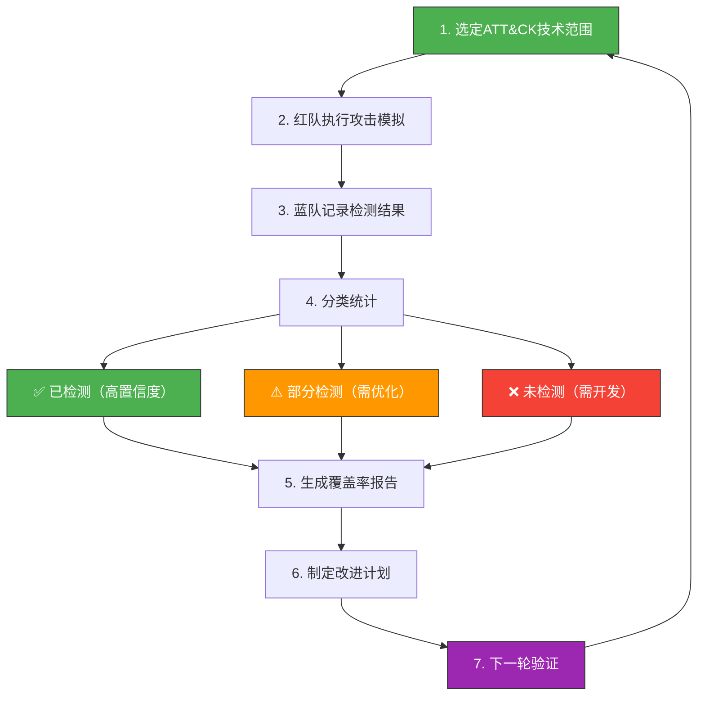
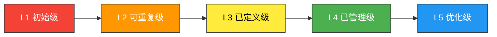

## 26.2.3 紫队协作方法论

### 概述：为什么需要紫队

传统安全运营中，红队和蓝队各自为战——红队专注于发现攻击路径，蓝队专注于构建防御体系。这种分离导致一个根本性问题：**攻击者发现了漏洞，防御者却不知道如何检测；防御者部署了告警，攻击者却不知道它能被发现**。信息不对称严重削弱了组织的整体安全效能。

紫队（Purple Team）并非一个独立的团队，而是一种**协作机制与运营哲学**。它的核心目标是将红队的攻击知识与蓝队的检测能力进行系统性对接，通过持续的反馈循环，将安全防线从"被动响应"提升到"主动演进"。

紫队协作的价值可以用一个公式概括：

```text
安全效能 = 攻击可见性 × 检测覆盖率 × 响应速度
```

三者缺一不可。紫队的作用就是确保这三个维度同步提升，而不是让某一个维度成为短板。

### 紫队协作的核心原则

#### 原则一：边攻边防，实时反馈

紫队协作的核心理念是"边攻边防、实时反馈"。与传统的"红队打完出报告、蓝队看完再改"的串行模式不同，紫队强调在攻击模拟的**同一时间窗口**内，红蓝双方共享信息、即时评估。

这种模式的优势在于：

- **缩短反馈周期**：从传统的数周缩短到即时，蓝队可以在攻击发生的同时验证检测能力
- **降低遗忘成本**：攻击细节在双方的共同记忆中，不会因报告延迟而丢失上下文
- **增强共情理解**：蓝队亲眼看到攻击的复杂度，红队直观了解检测的盲区

#### 原则二：以ATT&CK为共同语言

MITRE ATT&CK框架是紫队协作的"通用语"。红队用它描述攻击技术，蓝队用它映射检测能力，管理层用它衡量安全覆盖率。没有共同框架，红蓝双方的对话将陷入"你说你的、我说我的"的困境。

ATT&CK在紫队中的具体作用：

| 角色 | ATT&CK的用途 |
|------|-------------|
| 红队 | 选择攻击技术、规划攻击路径、记录执行步骤 |
| 蓝队 | 映射检测规则、评估覆盖缺口、规划检测开发 |
| 紫队协调者 | 对齐双方进度、识别优先改进领域、生成覆盖率报告 |
| 管理层 | 理解安全态势、批准资源投入、跟踪改进趋势 |

#### 原则三：安全屋原则（Blameless Culture）

紫队协作必须建立在**无追责文化**的基础上。攻击模拟暴露的每一个问题，都是组织提升安全能力的机会，而不是追责个人的理由。

安全屋原则的具体要求：

- 所有演练发现**不出安全屋**——不在公开会议中点名批评
- 聚焦于**系统性改进**而非个人过失
- 将"检测失败"重新定义为"检测能力待提升"
- 鼓励蓝队成员**主动报告**已知盲区，而非隐瞒

#### 原则四：持续迭代而非一次性活动

紫队不是"打一次演练、出一份报告"的项目制活动。它是嵌入安全运营日常的**持续改进闭环**：

```text
攻击模拟 → 检测验证 → 差距分析 → 规则开发 → 效果验证 → 新一轮攻击模拟
```

每一轮迭代都应聚焦于**上一轮未覆盖或未检测的技术**，逐步提升ATT&CK覆盖率。

### 协作模式

```mermaid
graph TD
    A["🟣 紫队协作模式"]
    
    A --> B["🔄 同步协作"]
    A --> C["📋 异步协作"]
    A --> D["🔄 混合协作"]
    
    B --> B1["红队实时展示攻击"]
    B --> B2["蓝队同步验证检测"]
    B --> B3["即时评估改进效果"]
    B --> B4["适合：成熟团队、小范围测试"]
    
    C --> C1["红队先完成攻击"]
    C --> C2["蓝队独立验证检测"]
    C --> C3["双方汇总差距"]
    C --> C4["适合：初期团队、大范围评估"]
    
    D --> D1["同步验证核心场景"]
    D --> D2["异步补充边缘技术"]
    D --> D3["分层推进覆盖率"]
    D --> D4["适合：大多数组织的务实选择"]

    A --> E["📊 ATT&CK覆盖率评估"]
    E --> E1["红队模拟ATT&CK技术"]
    E --> E2["蓝队记录检测结果"]
    E --> E3["分析未检测技术"]
    E --> E4["制定检测规则计划"]
    E --> F["🔁 持续迭代改进"]

    style A fill:#9C27B0,stroke:#333,color:#fff
    style B fill:#4CAF50,stroke:#333,color:#fff
    style C fill:#2196F3,stroke:#333,color:#fff
    style D fill:#FF5722,stroke:#333,color:#fff
    style F fill:#FF9800,stroke:#333,color:#fff
```



#### 同步协作（推荐用于高优先级场景）

同步协作是紫队协作最高效的模式，适合检测能力差距较大、需要快速闭环的场景。

**执行流程：**

1. **攻击前对齐**（15-30分钟）：红蓝双方确认本轮测试范围、选定的ATT&CK技术、预期的检测路径
2. **实时攻击与检测**：红队逐个执行攻击技术，蓝队同步在SIEM/EDR中观察告警
3. **即时标注**：每个技术执行后，蓝队当场标注"已检测/未检测/部分检测"
4. **快速复盘**（30-60分钟）：双方讨论未检测的技术，分析原因，确定改进优先级

**同步协作的关键约束：**

- 需要红蓝双方**同时在线**，协调成本较高
- 攻击范围通常较窄（单次5-10个技术），以保证深度
- 适合**高价值资产**和**高威胁场景**的定向验证

#### 异步协作（适合初期团队和大范围评估）

异步协作降低了协调门槛，适合紫队建设初期或需要大规模覆盖的场景。

**执行流程：**

1. **红队独立执行**：按照预定技术列表完成攻击模拟，记录详细步骤和工具
2. **交付攻击记录**：红队将攻击日志、截图、时间线整理为标准化文档
3. **蓝队独立验证**：蓝队根据攻击记录，逐项检查检测能力并记录结果
4. **联合差距分析**：双方定期开会，汇总差距并制定改进计划

**异步协作的局限性：**

- 反馈周期较长（通常按周计），不适合需要快速闭环的场景
- 缺乏实时互动，蓝队无法在攻击执行过程中调整检测策略
- 容易因双方优先级冲突导致进度拖延

#### 混合协作（务实选择）

大多数成熟组织最终会选择混合协作模式：

- **核心攻击路径**（影响数据泄露、勒索软件等高危场景）：采用同步协作，确保深度闭环
- **边缘技术覆盖**（低频但合规需要的技术）：采用异步协作，确保广度覆盖
- **分层推进**：第一轮同步覆盖Top 20高威胁技术，第二轮异步扩展到Top 50

### ATT&CK覆盖率评估

覆盖率评估是紫队协作的核心产出，也是衡量安全运营成熟度的关键指标。

#### 基础覆盖率计算

```text
覆盖率 = 已检测技术数 / 已执行技术数 × 100%
```

但这个基础公式过于粗糙。实际评估中需要区分多个维度：

#### 多维度覆盖率模型

| 维度 | 计算方式 | 意义 |
|------|---------|------|
| **技术覆盖率** | 已检测技术 / 已执行技术 | 基础能力指标 |
| **战术覆盖率** | 已覆盖战术 / 总战术数 | 评估攻击链各阶段的检测深度 |
| **子技术覆盖率** | 已检测子技术 / 已执行子技术 | 评估检测精度 |
| **检测质量** | 高置信度检测 / 总检测数 | 区分"能检测"和"检测得好" |
| **检测延迟** | 从攻击到告警的平均时间 | 评估响应速度 |
| **误报率** | 误报数 / 总告警数 | 评估检测规则的实用性 |

#### 覆盖率评估流程



**步骤详解：**

1. **选定技术范围**：基于威胁情报、上一轮差距分析、组织业务特点，选择本轮要测试的ATT&CK技术。通常优先选择：
   - 近期威胁情报中频繁出现的技术
   - 上一轮未检测到的技术
   - 对核心业务资产影响最大的技术

2. **执行攻击模拟**：红队使用真实工具（如Atomic Red Team、MITRE Caldera）或自定义脚本执行每个技术，记录详细的执行参数和结果

3. **记录检测结果**：蓝队在SIEM/EDR中逐一验证每个技术的检测状态，记录检测源（哪个告警触发的）、检测延迟、检测置信度

4. **分类统计**：将每个技术的检测结果分为三类——已检测、部分检测、未检测

5. **生成报告**：输出覆盖率矩阵，按战术、技术、子技术三个层次展示覆盖情况

6. **制定改进计划**：为每个未检测和部分检测的技术制定检测规则开发计划，按优先级排序

7. **下一轮验证**：在下一轮紫队协作中验证改进效果，形成闭环

#### 覆盖率报告模板

```yaml
exercise_summary:
  date: "2025-06-26"
  scope: "Enterprise Network - Tier 1 Assets"
  techniques_tested: 45
  techniques_detected: 32
  coverage_rate: "71.1%"
  
  by_tactic:
    initial_access: "83.3%"    # 5/6
    execution: "66.7%"         # 4/6
    persistence: "75.0%"       # 6/8
    privilege_escalation: "60.0%"  # 3/5
    defense_evasion: "57.1%"   # 4/7
    credential_access: "75.0%"  # 3/4
    discovery: "100.0%"        # 3/3
    lateral_movement: "66.7%"  # 2/3
    collection: "50.0%"        # 1/2
    exfiltration: "100.0%"     # 1/1
    
  detection_quality:
    high_confidence: 25
    medium_confidence: 7
    low_confidence: 0
    false_positives: 3
    
  avg_detection_time: "4.2 minutes"
  max_detection_time: "18 minutes"
```

### 角色与职责

紫队协作需要明确的角色分工，避免"人人负责等于无人负责"的困境。

#### 核心角色

| 角色 | 职责 | 关键技能 |
|------|------|---------|
| **紫队协调者** | 统筹协作计划、对齐双方进度、管理改进闭环 | 项目管理、ATT&CK精通、沟通协调 |
| **红队攻击手** | 执行攻击模拟、记录详细步骤、提供攻击上下文 | 渗透测试、漏洞利用、社会工程 |
| **蓝队检测工程师** | 验证检测能力、开发检测规则、优化告警质量 | 日志分析、规则编写、威胁狩猎 |
| **安全运营分析师** | 实时监控告警、初步分类处置、提供运营反馈 | SIEM操作、事件分类、应急响应 |

#### 协调者的关键作用

紫队协调者是整个协作机制的**枢纽**，其职责包括：

- **计划制定**：确定每轮协作的技术范围、时间安排、参与人员
- **过程管理**：确保攻击按计划执行、检测按标准记录、发现按优先级排序
- **知识管理**：维护覆盖率数据库、跟踪改进进度、归档历史发现
- **向上汇报**：将技术层面的发现转化为管理层可理解的指标和建议

#### 无协调者时的替代方案

中小团队可能无法设立专职协调者。此时可采用以下替代方案：

- **轮值制**：每次协作由红队或蓝队各出一人轮流担任协调
- **模板驱动**：使用标准化的测试模板和报告模板，降低协调成本
- **工具辅助**：利用MITRE Caldera等平台的管理功能自动跟踪进度

### 协作沟通框架

有效的沟通是紫队协作成功的关键。以下是一套经过验证的沟通框架：

#### 演练前沟通

| 事项 | 内容 | 负责人 |
|------|------|--------|
| 范围确认 | 明确测试的系统、网络、时间段 | 紫队协调者 |
| 技术选型 | 确认本轮测试的ATT&CK技术列表 | 红队+紫队协调者 |
| 规则约定 | 明确禁止操作（如生产数据破坏） | 全员确认 |
| 紧急停止 | 定义触发紧急停止的条件和流程 | 紫队协调者 |
| 通知范围 | 确认是否需要通知受影响部门 | 管理层+紫队协调者 |

#### 演练中沟通

**实时标注机制**：每个技术执行后，蓝队在共享文档中实时标注检测状态：

```markdown
## T1003.001 - LSASS Memory Dump

**执行时间**: 2025-06-26 14:32:05
**红队操作**: mimikatz.exe "privilege::debug" "sekurlsa::logonpasswords"
**蓝队标注**: 
- 检测状态: ✅ 已检测
- 检测源: Sysmon Event ID 10 - LSASS Access
- 检测延迟: 2分钟
- 置信度: 高
- 备注: 规则触发正常，告警内容清晰
```

**即时反馈循环**：红队每执行3-5个技术后，双方进行5-10分钟的快速同步：

- 红队：解释攻击思路和技术选择原因
- 蓝队：反馈检测/未检测的具体原因
- 双方：快速确认是否需要调整后续测试计划

#### 演练后沟通

**复盘会议议程**（建议60-90分钟）：

1. **成果回顾**（10分钟）：本次测试的技术数量、覆盖率、关键发现
2. **差距分析**（20分钟）：逐个讨论未检测技术的原因和改进方向
3. **优先级排序**（15分钟）：根据威胁影响和改进难度确定改进顺序
4. **改进计划**（15分钟）：明确每个改进项的负责人和截止时间
5. **下轮计划**（10分钟）：初步确定下一轮协作的方向

### 紫队协作成熟度模型

组织的紫队协作能力可以分为五个成熟度等级：



| 等级 | 特征 | 典型表现 | 改进方向 |
|------|------|---------|---------|
| **L1 初始级** | 偶发性协作 | 红蓝各自行动，偶尔开会讨论 | 建立基本沟通机制 |
| **L2 可重复级** | 有基本流程 | 有测试模板、有复盘机制，但依赖个人 | 标准化流程和工具 |
| **L3 已定义级** | 流程标准化 | 完整的协作流程、角色分工、覆盖率跟踪 | 引入自动化和度量 |
| **L4 已管理级** | 数据驱动 | 覆盖率趋势分析、改进效果量化、持续优化 | 向L5迈进 |
| **L5 优化级** | 智能演进 | AI辅助检测优化、自动化攻击模拟、预测性防御 | 前沿技术探索 |

### 自动化赋能

紫队协作的效率很大程度上取决于自动化水平。以下是关键的自动化场景和推荐工具：

#### 攻击模拟自动化

| 工具 | 用途 | 适用场景 |
|------|------|---------|
| **MITRE Caldera** | 自动化攻击模拟平台 | 大规模技术覆盖、复杂攻击链模拟 |
| **Atomic Red Team** | ATT&CK技术原子测试 | 快速单技术验证、CI/CD集成 |
| **Infection Monkey** | 自动化渗透测试 | 网络横向移动检测、隔离验证 |
| **Cobalt Strike** | 专业红队平台 | 高仿真攻击模拟、长期渗透 |

#### 检测验证自动化

| 工具 | 用途 | 适用场景 |
|------|------|---------|
| **Sigma规则** | 通用检测规则格式 | 跨平台规则共享和转换 |
| **DVCP** | 检测规则验证 | 规则质量评估、误报率分析 |
| **Sigmatory** | Sigma规则生成 | 从攻击日志自动生成检测规则 |
| **Detection Lab** | 检测环境搭建 | 规则开发和测试环境 |

#### 覆盖率跟踪自动化

```yaml
# 覆盖率跟踪配置示例
coverage_tracker:
  data_source: "attack-navigator"
  update_frequency: "weekly"
  
  metrics:
    - technique_coverage_rate
    - tactic_coverage_rate
    - detection_quality_score
    - improvement_velocity
    
  alerts:
    - threshold: "coverage_rate < 50%"
      action: "notify_ciso"
    - threshold: "new_technique_uncovered > 30 days"
      action: "escalate_to_management"
```

### 知识沉淀与组织学习

紫队协作的价值不仅在于单次改进，更在于**组织安全知识的积累**。以下是知识沉淀的最佳实践：

#### 知识库架构

```markdown
knowledge_base/
├── attack_techniques/          # 攻击技术库
│   ├── T1003_credential_dumping.md
│   ├── T1059_command_execution.md
│   └── ...
├── detection_rules/            # 检测规则库
│   ├── sigma_rules/
│   ├── yara_rules/
│   └── custom_rules/
├── exercise_reports/           # 演练报告库
│   ├── 2025-Q2_purple_team_exercise.md
│   └── ...
├── lessons_learned/            # 经验教训库
│   ├── common_gaps.md
│   ├── tool_configurations.md
│   └── ...
└── threat_intelligence/        # 威胁情报库
    ├── recent_campaigns.md
    └── ...
```

#### 知识复用机制

- **规则模板库**：将成功的检测规则归档为模板，供类似场景复用
- **攻击脚本库**：将验证过的攻击脚本标准化，降低下次执行的准备成本
- **差距分析报告**：维护历史差距分析记录，识别系统性薄弱环节
- **最佳实践文档**：将每次协作中发现的有效做法提炼为标准操作程序

### 常见误区与纠正

| 误区 | 正确做法 |
|------|---------|
| 把紫队当成"第三个团队" | 紫队是协作机制，不是独立团队 |
| 追求100%覆盖率 | 优先覆盖高威胁技术，接受合理的风险残留 |
| 只关注技术覆盖率 | 同时关注检测质量、响应速度、误报率 |
| 演练后不出报告 | 每次协作必须产出可执行的改进计划 |
| 蓝队被动等待攻击结果 | 蓝队应主动提出需要验证的检测假设 |
| 将发现用于追责 | 严格执行安全屋原则，聚焦系统性改进 |
| 一次性演练后长期搁置 | 建立固定周期的持续协作机制 |
| 忽视管理层沟通 | 定期向管理层汇报覆盖率趋势和改进价值 |

### 从零开始建立紫队协作

对于尚未建立紫队协作的组织，可以按照以下路径逐步推进：

**第一阶段（1-2个月）：基础建设**

1. 确认管理层支持和资源投入
2. 选定紫队协调者（可以是兼职）
3. 建立基本的沟通机制和会议节奏
4. 使用Atomic Red Team执行首批10个高优先级技术的测试
5. 产出第一份覆盖率报告

**第二阶段（3-6个月）：流程标准化**

1. 完善测试模板和报告模板
2. 引入MITRE Caldera实现自动化攻击模拟
3. 建立检测规则开发和验证的闭环流程
4. 将覆盖率跟踪集成到安全运营仪表板
5. 产出改进计划并跟踪执行进度

**第三阶段（6-12个月）：持续优化**

1. 建立知识库并定期更新
2. 引入检测质量评估指标（置信度、误报率）
3. 优化协作流程，提高单次协作效率
4. 向管理层展示覆盖率趋势和安全效能提升
5. 探索AI辅助检测优化等前沿方向

### 总结

紫队协作方法论的核心可以归纳为"四个一"：

- **一个框架**：以ATT&CK为共同语言，对齐红蓝双方的认知和行动
- **一套流程**：攻击模拟→检测验证→差距分析→规则开发→效果验证的闭环
- **一组指标**：覆盖率、检测质量、响应速度、误报率的多维度度量
- **一种文化**：无追责、持续改进、知识共享的协作文化

紫队不是终点，而是组织安全能力持续演进的**发动机**。每一次协作都在缩小攻击者与防御者之间的信息差，每一轮迭代都在让组织的安全防线更加坚韧。
