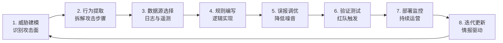
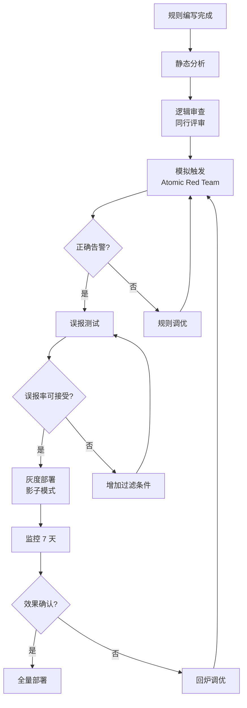

## 26.2.5 蓝队检测工程详解

### 检测工程的本质：从"能看见"到"能看见攻击"

在蓝队防御体系中，检测工程（Detection Engineering）是将安全威胁从"理论可能"转化为"可自动发现"的核心能力。它的本质不是写几条规则，而是建立一套**系统化的方法论**——将威胁情报、攻击行为模式转化为可执行、可验证、可迭代的检测逻辑。

与传统的安全告警不同，检测工程强调三个核心原则：

| 原则 | 含义 | 反例 |
|------|------|------|
| **可验证** | 每条规则都能用具体攻击场景触发 | "发现异常行为"——太模糊，无法验证 |
| **可量化** | 有明确的覆盖指标和误报率统计 | 凭感觉判断"规则效果不错" |
| **可迭代** | 规则随威胁情报持续更新和优化 | 规则写完后从不维护 |

> **一句话定义**：检测工程 = 把"攻击者做了什么"翻译成"系统如何自动发现攻击者做了什么"的过程。

### 检测工程生命周期

一条成熟的检测规则不是一蹴而就的，而是经历完整的生命周期：



**各阶段关键任务：**

1. **威胁建模**：基于 MITRE ATT&CK 框架，识别本组织面临的最可能攻击路径（参考 26.2.1 红队攻击技术体系）
2. **行为提取**：将攻击技术拆解为可观测的行为特征——进程名、命令行参数、网络连接模式、文件操作等
3. **数据源选择**：确认所需日志是否已采集，是否具备足够的字段和保留周期
4. **规则编写**：用 SPL、EQL、KQL、Sigma 等语言实现检测逻辑
5. **误报调优**：通过白名单、上下文关联、阈值调整将误报率控制在可接受范围
6. **验证测试**：用红队工具（如 Caldera、Atomic Red Team）主动触发，确认规则能正确告警
7. **部署监控**：规则上线后持续监控命中率和误报率
8. **迭代更新**：新威胁情报驱动规则升级，过时规则定期淘汰

---

### 数据源体系：检测的地基

没有数据源的检测规则是空中楼阁。蓝队需要构建覆盖网络、终端、身份、云环境的多层次遥测体系。

#### 核心数据源矩阵

| 数据源 | 采集工具 | 关键事件 | 检测场景 |
|--------|----------|----------|----------|
| Windows 事件日志 | Winlogbeat / WEC | 4624/4625（登录）、4688（进程创建）、4697（服务安装） | 暴力破解、横向移动、持久化 |
| Sysmon | Sysmon + 配置模板 | Event 1（进程创建）、10（进程访问）、11（文件创建） | 凭证转储、文件投递、命名管道 |
| DNS 查询日志 | Passive DNS / DNS 日志 | 查询名称、查询类型、响应 IP | DNS 隧道、C2 通信 |
| HTTP/HTTPS 代理 | Squid / Zscaler / Prisma | 请求方法、URI、User-Agent、响应码 | C2 心跳、数据外传 |
| 认证日志 | AD 事件 / RADIUS | Kerberos TGT、NTLM 认证、LDAP 查询 | Pass-the-Hash、Golden Ticket |
| 云审计日志 | CloudTrail / Azure Activity Log | API 调用、控制台登录、权限变更 | 云环境横向移动、权限提升 |
| 端点遥测 | EDR（CrowdStrike / SentinelOne） | 进程树、内存操作、注册表修改 | 无文件攻击、注入、提权 |

#### Sysmon 配置要点

Sysmon 是 Windows 环境最重要的遥测工具之一，其配置直接决定检测粒度。一份生产级 Sysmon 配置应包含：

```xml
<!-- 监控 LSASS 进程访问（凭证转储检测基础） -->
<EventFiltering>
  <ProcessAccess onmatch="exclude">
    <!-- 排除系统自身访问 -->
    <SourceImage condition="is">C:\Windows\System32\csrss.exe</SourceImage>
    <SourceImage condition="is">C:\Windows\System32\wininit.exe</SourceImage>
  </ProcessAccess>
  
  <!-- 监控可疑的 PowerShell 启动参数 -->
  <ProcessCreate onmatch="include">
    <Image condition="contains">powershell.exe</Image>
  </ProcessCreate>
  
  <!-- 监控 WMI 事件订阅（持久化检测） -->
  <WmiEvent onmatch="include">
    <Operation type="is">WmiEventFilterActivityDetected</Operation>
  </WmiEvent>
</EventFiltering>
```

> **实践建议**：Sysmon 默认配置会产生海量日志。生产环境应使用 SwiftOnSecurity 的 sysmon-config-modular 或 OlafHartong 的 sysmon-modular 项目，在检测覆盖与日志量之间取得平衡。

---

### SIEM 规则开发

SIEM（安全信息与事件管理）是检测规则的核心执行引擎。以下按 SIEM 平台分别给出生产级规则示例。

#### Splunk 检测规则

```spl
// ============================================
// 规则：检测 Mimikatz 凭证转储
// 数据源：Sysmon Event ID 10（Process Access）
// MITRE ATT&CK：T1003.001 - LSASS Memory
// ============================================
index=sysmon EventCode=10 TargetImage="*\\lsass.exe"
| where NOT match(SourceImage, "(?i)(taskmgr|csrss|svchost|msMpEng).exe$")
  AND GrantedAccess IN ("0x1010", "0x1410", "0x1000", "0x1fffff")
| stats dc(SourceImage) as unique_sources, values(SourceImage) as sources, 
        values(GrantedAccess) as access_rights,
        latest(_time) as last_seen by Computer, TargetImage
| where unique_sources >= 1
| eval risk_score = case(
    match(mvjoin(access_rights,","), "0x1fffff"), 90,
    match(mvjoin(access_rights,","), "0x1010"), 80,
    1==1, 60
  )
| table _time, Computer, sources, access_rights, risk_score, last_seen
| sort - risk_score
```

**规则解读**：
- `0x1010` = PROCESS_QUERY_LIMITED_INFORMATION + PROCESS_VM_READ，是 procdump 等工具常用的访问标志
- `0x1410` = PROCESS_QUERY_INFORMATION + PROCESS_VM_READ，Mimikatz 原生访问模式
- `0x1fffff` = PROCESS_ALL_ACCESS，完全访问权限，高风险
- 排除 `taskmgr.exe` 和 `csrss.exe` 是因为它们合法访问 LSASS（任务管理器的内存转储功能、系统进程间的正常交互）

```spl
// ============================================
// 规则：检测 Pass-the-Hash 横向移动
// 数据源：Windows Security Event ID 4624
// MITRE ATT&CK：T1550.002 - Pass the Hash
// ============================================
index=wineventlog EventCode=4624 LogonType=3 
  AuthenticationPackageName=NtLmSsp
  TargetUserName!="*$" 
  TargetUserName!="ANONYMOUS LOGON"
| where NOT [ search index=assets type=server | fields ip=Source_Network_Address ]
| stats count as logon_count, 
        dc(Computer) as target_hosts,
        values(Computer) as hosts,
        values(AuthenticationPackageName) as auth_methods
        by Account_Name, Source_Network_Address
| where target_hosts > 2 OR logon_count > 20
| eval confidence = if(target_hosts > 5, "HIGH", 
                   if(target_hosts > 2, "MEDIUM", "LOW"))
| table _time, Account_Name, Source_Network_Address, hosts, 
        logon_count, target_hosts, confidence
| sort - target_hosts
```

**检测逻辑**：正常用户很少通过 NTLM 认证从单一源 IP 在短时间内登录多台服务器。当出现这种模式时，高度可疑为 Pass-the-Hash 攻击。排除了计算机账户（`*$`）和匿名登录以减少噪音。

```spl
// ============================================
// 规则：检测 PowerShell 下载执行（Download Cradle）
// 数据源：Sysmon Event ID 1
// MITRE ATT&CK：T1059.001 - PowerShell
// ============================================
index=sysmon EventCode=1 
  (Image="*\\powershell.exe" OR Image="*\\pwsh.exe")
| where regex match(CommandLine, "(?i)(DownloadString|DownloadFile|Invoke-WebRequest|Net\.WebClient|Start-BitsTransfer|Invoke-RestMethod|certutil|bitsadmin)")
| eval has_obfuscation = if(
    match(CommandLine, "(?i)(\-enc|-e\s|FromBase64String|Invoke-Expression|iex|Set-Variable|'-)|\\^|`|\$\{.*\})"), 
    "HIGH", "LOW")
| table _time, Computer, Account_Name, CommandLine, has_obfuscation
| sort - _time
```

#### Elastic SIEM 规则（EQL）

EQL（Event Query Language）擅长处理事件序列检测——这正是发现攻击链的关键能力。

```eql
// ============================================
// 规则：检测凭证导出攻击链（Procdump → LSASS dump → 文件外传）
// MITRE ATT&CK：T1003.001 - LSASS Memory
// ============================================
sequence by user.name with maxspan=5m
  [process where process.name == "procdump.exe" and 
   process.args : "*lsass*"]
  [file where file.name : "*.dmp" and 
   file.directory : ("*\\Temp\\", "*\\Windows\\Temp\\", "*\\Users\\*")]
  [network where destination.port in (80, 443, 445)]
```

**序列检测的优势**：单一事件（如 procdump 执行）可能有合理解释，但"procdump 访问 LSASS → 生成 .dmp 文件 → 对外网络连接"三事件序列几乎只能是凭证窃取行为。

```eql
// ============================================
// 规则：检测 PsExec 横向移动
// MITRE ATT&CK：T1021.002 - SMB/Windows Admin Shares
// ============================================
sequence by host.name with maxspan=2m
  [file where file.name : "PSEXESVC.exe"]
  [process where process.name == "PSEXESVC.exe"]
  [network where destination.port == 445 and 
   not destination.ip == "127.0.0.1"]
```

```eql
// ============================================
// 规则：检测 WMI 持久化（远程计划任务创建）
// MITRE ATT&CK：T1546.003 - Windows Management Instrumentation Event Subscription
// ============================================
sequence by host.name with maxspan=10m
  [process where event.type == "start" and 
   process.name : ("wmiprvse.exe", "WmiPrvSE.exe")]
  [process where event.type == "start" and 
   process.name : ("schtasks.exe", "at.exe") and 
   process.args : ("/create", "/ru SYSTEM")]
```

#### Sigma 规则（跨平台通用）

Sigma 是检测规则的"中立语言"，可编译为 Splunk、Elastic、QRadar、Sentinel 等多个平台的规则。

```yaml
title: 可疑的LSASS内存转储行为
id: a]45108c-1234-4d2a-b567-89abcdef0123
status: experimental
description: |
  检测通过 procdump、comsvcs.dll 或 rundll32 转储 LSASS 内存的行为。
  这是凭证转储攻击链中的关键步骤。
references:
  - https://attack.mitre.org/techniques/T1003/001/
author: Blue Team
date: 2024/01/15
modified: 2024/06/01
tags:
  - attack.credential_access
  - attack.t1003.001
logsource:
  category: process_access
  product: windows
detection:
  selection_lsass_access:
    TargetImage|endswith: '\lsass.exe'
    GrantedAccess|contains:
      - '0x1010'
      - '0x1410'
      - '0x1fffff'
  filter_legitimate:
    SourceImage|endswith:
      - '\taskmgr.exe'
      - '\csrss.exe'
      - '\msMpEng.exe'
      - '\MsSense.exe'
  condition: selection_lsass_access and not filter_legitimate
falsepositives:
  - Legitimate administrative tools
  - Endpoint protection software
level: high
```

**Sigma 的核心价值**：一次编写，到处编译。编写规则时不用考虑目标 SIEM 平台的语法差异，通过 `sigma-cli` 工具自动转换。

```bash
# 编译为 Splunk 规则
sigma convert -t splunk -p sysmon rules/credential_dumping.yml

# 编译为 Elastic 规则
sigma convert -t elasticsearch -p sysmon rules/credential_dumping.yml

# 编译为 Microsoft Sentinel 规则
sigma convert -t azure-sentinel rules/credential_dumping.yml
```

---

### YARA 规则：文件级检测利器

YARA 规则专注于文件内容的模式匹配，是检测恶意软件样本、Webshell、攻击工具的核心手段。

#### YARA 规则设计原则

| 原则 | 说明 | 反例 |
|------|------|------|
| **精确性** | 字符串匹配要足够独特，避免误报 | 只匹配 `"config"` 这样的通用字符串 |
| **结构性** | 结合 PE 头部、文件类型、行为特征 | 只看字符串，不验证文件格式 |
| **可维护** | meta 字段完整，包含作者、日期、参考 | 空 meta，无法追溯规则来源 |
| **性能意识** | 短字符串优先匹配，正则尽量简化 | 嵌套贪婪正则，扫描大文件时极慢 |

#### 生产级 YARA 规则示例

```yara
rule Mimikatz_Detection {
    meta:
        description = "Detects Mimikatz credential dumping tool"
        author = "Blue Team"
        date = "2024-01-01"
        reference = "https://attack.mitre.org/software/S0002/"
        severity = "high"
        tags = ["credential_access", "T1003.001"]
    
    strings:
        // 明确的命令字符串（高置信度特征）
        $cmd1 = "sekurlsa::logonpasswords" ascii wide nocase
        $cmd2 = "lsadump::sam" ascii wide nocase
        $cmd3 = "kerberos::list" ascii wide nocase
        $cmd4 = "privilege::debug" ascii wide nocase
        $cmd5 = "sekurlsa::pth" ascii wide nocase
        
        // 工具名称特征
        $name1 = "mimikatz" ascii wide nocase
        $name2 = "gentilkiwi" ascii wide nocase  // 作者标识
        
        // PDB 调试路径
        $pdb = /mimikatz\.pdb/i
        
        // PE 头部（确保是可执行文件）
        $mz = { 4D 5A }
        
        // 特定的 API 调用组合（高精度特征）
        $api1 = "MiniDumpWriteDump" ascii
        $api2 = "OpenProcess" ascii
        $api3 = "ReadProcessMemory" ascii
    
    condition:
        $mz at 0 and (
            (2 of ($cmd*)) or
            ($pdb) or
            ($name1 and $name2) or
            (all of ($api*) and $name1)
        )
}

rule CobaltStrike_Beacon {
    meta:
        description = "Detects Cobalt Strike Beacon (in-memory or on-disk)"
        author = "Blue Team"
        date = "2024-01-01"
        severity = "critical"
        tags = ["command_and_control", "T1071"]
    
    strings:
        // Beacon 配置特征（默认 malleable C2 profile）
        $config_marker = { 00 01 00 01 00 02 ?? ?? 00 02 00 01 00 02 ?? ?? }
        
        // 默认管道名格式
        $pipe_name1 = "\\\\.\\pipe\\msagent_" ascii wide
        $pipe_name2 = "\\\\.\\pipe\\MSSE-" ascii wide
        $pipe_name3 = "\\\\.\\pipe\\postex_" ascii wide
        
        // Sleep mask 特征（x64 Beacon）
        $sleep_mask_x64 = { 4C 8B 53 08 45 8B 0A 45 8B 5A 04 4D 8D 52 08 45 85 C9 }
        
        // HTTP Beacon 默认 URI 模式
        $http_uri1 = "/submit.php" ascii
        $http_uri2 = "/jquery-3.3.1.min.js" ascii
        $http_uri3 = "/static/app.js" ascii
        
        // 代码注入特征
        $inject1 = "VirtualAlloc" ascii
        $inject2 = "VirtualProtect" ascii
        $inject3 = "CreateThread" ascii
    
    condition:
        uint16(0) == 0x5A4D and (
            2 of ($pipe_name*) or
            $config_marker or
            $sleep_mask_x64 or
            (3 of ($inject*) and 1 of ($http_uri*))
        )
}
```

#### YARA 规则性能优化

```yara
// 错误示例：过度宽泛的正则，扫描大文件时极慢
rule Bad_Example {
    strings:
        $bad = /.*suspicious.*command.*/  // 贪婪正则，灾难性回溯
    condition:
        $bad
}

// 正确示例：锚定位置 + 限制长度 + 使用 ascii/wide
rule Good_Example {
    strings:
        $good = /suspicious[ -]{0,5}command/ ascii wide nocase
    condition:
        $good
}
```

---

### 网络流量检测

网络层检测是发现 C2 通信、数据外传、横向移动的关键手段。

#### Suricata 规则

```bash
# ============================================
# 规则：检测 Cobalt Strike HTTP Beacon
# MITRE ATT&CK：T1071.001 - Web Protocols
# ============================================
alert http $HOME_NET any -> $EXTERNAL_NET any (
    msg:"C2 Cobalt Strike HTTP Beacon";
    flow:established,to_server;
    content:"GET"; http_method;
    content:"/submit.php?id="; http_uri;
    # Cobalt Strike 默认不发送 Accept-Language 和 Accept-Encoding
    # 这是与正常浏览器的关键区别
    content:!"Accept-Language"; http_header;
    content:!"Accept-Encoding"; http_header;
    # 检查 User-Agent 是否缺失或异常
    pcre:"/^(User-Agent:\s*(Mozilla|Chrome|Firefox))/!i";
    threshold: type both, track by_src, count 3, seconds 60;
    classtype:trojan-activity;
    sid:1000001; rev:2;
)

# ============================================
# 规则：检测 DNS 隧道通信
# MITRE ATT&CK：T1071.004 - DNS
# DNS 隧道的特征：超长子域名 + 高频查询
# ============================================
alert dns $HOME_NET any -> any 53 (
    msg:"C2 Potential DNS Tunneling - Long Subdomain";
    dns.query;
    # 正常 DNS 子域名很少超过 30 字符
    pcre:"/^[a-zA-Z0-9]{30,}\./";
    # 排除常见的长域名（如 CDN 域名）
    content:!"cloudflare";
    content:!"amazonaws";
    sid:1000002; rev:2;
    threshold: type both, track by_src, count 50, seconds 60;
    classtype:trojan-activity;
)

# ============================================
# 规则：检测 WinRM 横向移动
# MITRE ATT&CK：T1021.006 - Windows Remote Management
# ============================================
alert tcp $HOME_NET any -> $HOME_NET 5985 (
    msg:"Lateral Movement WinRM Remote Command Execution";
    flow:established,to_server;
    content:"POST"; http_method;
    content:"/wsman"; http_uri;
    content:"Content-Type"; http_header;
    content:"application/soap+msbin1"; http_header;
    classtype:lateral-movement;
    sid:1000003; rev:2;
)

# ============================================
# 规则：检测 Kerberoasting（SPN 请求风暴）
# MITRE ATT&CK：T1558.003 - Kerberoasting
# ============================================
alert tcp $HOME_NET any -> $HOME_NET 88 (
    msg:"Lateral Movement Kerberoasting SPN Request Storm";
    flow:established,to_server;
    content:"|0a|"; offset:20; depth:1;  # TGS-REQ tag
    threshold: type both, track by_src, count 15, seconds 60;
    classtype:credential-access;
    sid:1000004; rev:1;
)
```

#### Zeek 脚本：深度流量分析

Suricata 擅长模式匹配，Zeek 则擅长结构化流量分析。两者互补使用效果最佳。

```zeek
# 检测异常的 DNS 查询模式
module DNS;

export {
    redef enum Notice::Type += {
        ## DNS 隧道疑似行为
        Potential_DNS_Tunnel,
    };
}

event dns_query_reply(c: connection, msg: dns_msg, query: string, reply: dns_answer) {
    # 记录超长子域名查询
    if (|query| > 40 && query !~ /\.(com|net|org|cn|io)$/) {
        local info: string = fmt("Long DNS query: %s (length: %d)", query, |query|);
        NOTICE([$note=Potential_DNS_Tunnel,
                $msg=info,
                $src=c$id$orig_h,
                $identifier=cat(c$id$orig_h, c$id$orig_p)]);
    }
}
```

---

### EDR 检测规则

EDR（端点检测与响应）提供了最细粒度的端点遥测能力。

#### Microsoft Sentinel / Defender for Endpoint（KQL）

```kql
// ============================================
// 规则：检测 LSASS 内存转储行为
// 数据源：DeviceProcessEvents
// MITRE ATT&CK：T1003.001 - LSASS Memory
// ============================================
DeviceProcessEvents
| where Timestamp > ago(24h)
| where FileName in~ ("procdump.exe", "procdump64.exe", "rundll32.exe", 
                        "comsvcs.dll", "taskmgr.exe")
| where ProcessCommandLine has_any ("lsass", "MiniDump")
| extend RiskLevel = case(
    ProcessCommandLine has "MiniDumpWriteDump", "Critical",
    ProcessCommandLine has "lsass" and FileName == "rundll32.exe", "High",
    "Medium"
  )
| project Timestamp, DeviceName, AccountName, FileName, 
          ProcessCommandLine, RiskLevel
| sort by RiskLevel desc, Timestamp desc
```

```kql
// ============================================
// 规则：检测可疑的 Base64 编码 PowerShell
// MITRE ATT&CK：T1059.001 - PowerShell
// ============================================
DeviceProcessEvents
| where Timestamp > ago(24h)
| where FileName in~ ("powershell.exe", "pwsh.exe")
| where ProcessCommandLine has_any ("-enc", "-e ", "FromBase64String", 
                                      "Invoke-Expression", "[Convert]::FromBase64")
| extend DecodedCommand = case(
    ProcessCommandLine has "-enc", 
      try_tostring(base64_decode_tostring(
        extract(@"-e[n/c]*\s+([A-Za-z0-9+/=]{20,})", 1, ProcessCommandLine))),
    ProcessCommandLine has "FromBase64String",
      try_tostring(base64_decode_tostring(
        extract(@"'([A-Za-z0-9+/=]{20,})'", 1, ProcessCommandLine))),
    "Unable to decode"
  )
| where DecodedCommand != "Unable to decode"
| project Timestamp, DeviceName, AccountName, 
          ProcessCommandLine, DecodedCommand
```

```kql
// ============================================
// 规则：检测横向移动 - 异常的远程服务创建
// MITRE ATT&CK：T1569.002 - Service Execution
// ============================================
DeviceProcessEvents
| where Timestamp > ago(24h)
| where FileName == "sc.exe"
| where ProcessCommandLine has_any ("create", "start")
| where ProcessCommandLine has_any ("\\\\", "127.0.0.1")
| join kind=inner (
    DeviceNetworkEvents
    | where Timestamp > ago(24h)
    | where RemoteIPType == "Public" and InitiatingProcessFileName == "sc.exe"
) on DeviceName, Timestamp
| project Timestamp, DeviceName, AccountName, 
          ProcessCommandLine, RemoteIP
```

#### CrowdStrike Falcon 检测逻辑

```sql
-- Falcon Custom IOA（Indicator of Attack）规则逻辑
-- 检测：异常的父进程-子进程关系

SELECT 
    ParentProcess, 
    ChildProcess, 
    CommandLine,
    UserSid,
    EventTime
FROM ProcessCreate
WHERE ParentProcess = 'explorer.exe'
  AND ChildProcess IN ('powershell.exe', 'cmd.exe', 'wscript.exe', 'cscript.exe')
  AND (
    CommandLine LIKE '%DownloadString%'
    OR CommandLine LIKE '%Invoke-WebRequest%'
    OR CommandLine LIKE '%certutil%'
    OR CommandLine LIKE '%bitsadmin%'
  )
  AND UserSid NOT IN (
    SELECT Sid FROM KnownGoodUsers  -- 维护已知正常用户白名单
  )
```

---

### 检测规则的验证与测试

写完规则不等于检测能力就位。未经验证的规则可能在生产环境中产生海量误报，或完全无法捕获目标攻击。

#### 验证框架



#### 使用 Atomic Red Team 验证规则

```bash
# 安装 Atomic Red Team
git clone https://github.com/redcanaryco/atomic-red-team.git
cd atomic-red-team/atomic-red-team

# 执行 T1003.001 - LSASS Memory Dump 测试
Invoke-AtomicTest T1003.001 -TestNumbers 1,3

# 执行 T1059.001 - PowerShell 命令执行测试
Invoke-AtomicTest T1059.001 -TestNumbers 1

# 执行后检查 SIEM 是否收到告警
# Splunk 验证查询：
# index=sysmon EventCode=10 TargetImage="*\\lsass.exe" earliest=-5m
```

#### 规则质量评分矩阵

| 维度 | 评分标准 | 权重 |
|------|----------|------|
| **检测覆盖率** | 覆盖了该技术的多少变体？ | 30% |
| **误报率** | 正常业务触发的假告警比例 | 25% |
| **检测时效** | 攻击发生到告警触发的延迟 | 15% |
| **上下文丰富度** | 告警包含足够的调查信息 | 15% |
| **可维护性** | 规则代码的可读性和文档完整性 | 15% |

**误报率参考基准**：

| 等级 | 误报率 | 适用场景 |
|------|--------|----------|
| 🟢 优秀 | <1% | 高置信度规则，自动阻断 |
| 🟡 可接受 | 1-5% | 中置信度规则，需人工确认 |
| 🟠 需优化 | 5-15% | 低置信度规则，仅记录 |
| 🔴 不可用 | >15% | 规则需要重写 |

---

### 常见误区与最佳实践

#### 误区一：规则越多越好

> **现实**：100条高质量规则的检测效果远超1000条粗糙规则。每增加一条规则，都意味着额外的日志查询开销和误报噪音。建议每季度做一次规则审查，淘汰长期未命中或误报率过高的规则。

#### 误区二：只关注已知 IOC

> **现实**：IOC（IP 地址、域名、文件哈希）的有效期通常只有几小时到几天。行为检测（如"LSASS 进程被非系统进程访问"）的生命周期远长于 IOC 检测。规则应以行为为主、IOC 为辅。

#### 误区三：忽略数据源质量

> **现实**：再精妙的规则，如果底层数据源缺失关键字段（如 Sysmon 未配置 Event ID 10），也是空架子。数据源审计应先于规则开发。

#### 误区四：规则写完就完事

> **现实**：攻击者会持续更新工具和手法。Cobalt Strike 的默认配置被检测后，攻击者会自定义 Malleable C2 profile。规则必须跟随威胁情报持续迭代。

#### 最佳实践清单

- **建立规则仓库**：用 Git 版本控制所有检测规则，支持 Code Review 和回滚
- **关联 ATT&CK ID**：每条规则标注对应的 MITRE ATT&CK 技术编号，方便覆盖率统计
- **分级响应**：高置信度规则自动阻断，中置信度规则通知 SOC 分析师，低置信度规则仅记录
- **误报白名单管理**：维护统一的白名单配置，避免各规则重复排除
- **定期红队验证**：每季度用真实攻击工具测试检测规则的有效性
- **度量驱动改进**：追踪 MTTD（平均检测时间）和 MTTR（平均响应时间），用数据指导优化方向

---

### 检测工程成熟度模型

组织的检测能力可以分为五个成熟度等级：

| 等级 | 名称 | 特征 | 能力 |
|------|------|------|------|
| L0 | **基础监控** | 仅依赖默认日志和设备自带告警 | 能发现已知签名的恶意软件 |
| L1 | **规则驱动** | 主动编写自定义检测规则 | 能检测常见攻击技术（如 Mimikatz、PsExec） |
| L2 | **行为分析** | 基于行为基线的异常检测 | 能发现未知工具但利用已知手法的攻击 |
| L3 | **威胁驱动** | 以威胁情报和 ATT&CK 框架为驱动 | 能系统化覆盖 ATT&CK 技术矩阵 |
| L4 | **自适应检测** | AI/ML 辅助的自适应检测能力 | 能检测零日攻击和高级持续性威胁 |

> **目标**：大多数企业应以达到 L2-L3 为目标。L4 需要大量数据、算力和专业人才投入，适用于关键基础设施和高安全需求组织。

---

### 小结

蓝队检测工程不是写几条 Splunk 规则的简单工作，而是贯穿威胁建模、数据采集、规则开发、误报调优、持续验证的完整工程体系。核心要点：

1. **数据为先**：没有好的遥测数据，再精妙的规则也是无源之水
2. **行为优于 IOC**：优先检测攻击行为模式，而非静态指标
3. **验证闭环**：每条规则必须经过红队验证才能上线
4. **持续迭代**：威胁情报驱动规则更新，过时规则及时淘汰
5. **度量驱动**：用 MTTD/MTTR 等指标量化检测能力，指导改进方向
