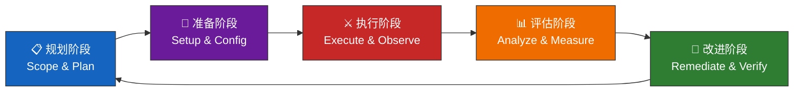
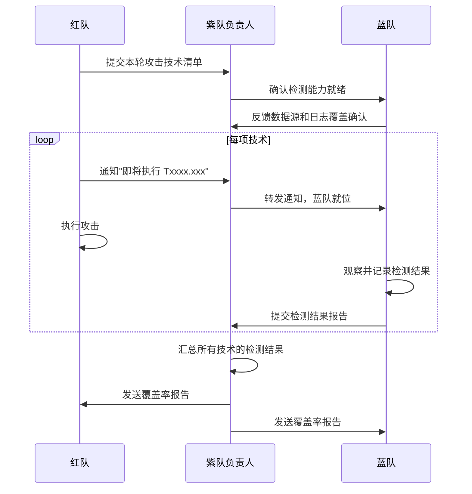
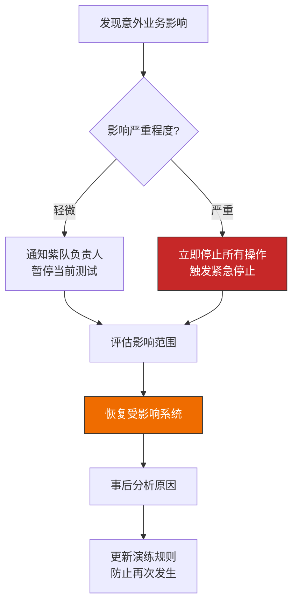
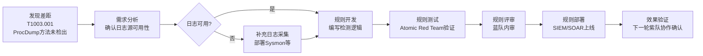
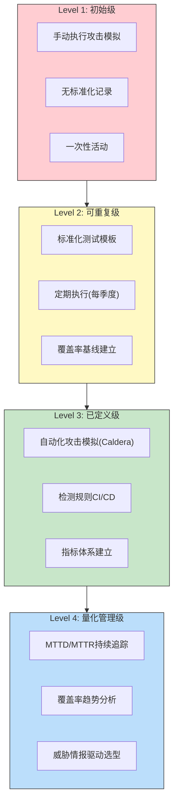

## 26.2.7 紫队协作工作流详解

紫队协作不是一次性的攻防演练，而是一套贯穿全年、持续迭代的工程化工作流。与26.2.3节讨论的紫队协作方法论（解决"为什么做"和"做什么"）不同，本节聚焦于**怎么做的具体步骤**——从规划、执行、评估到改进的完整闭环。每个工作流都包含输入、步骤、产出和工具四个维度，确保团队可以即学即用。

### 紫队协作的全生命周期



每个阶段都有明确的进入条件和退出标准。典型的紫队协作周期为**4-6周一轮**，一年执行4-6轮，每轮覆盖不同的ATT&CK战术阶段或威胁场景。

---

### 工作流一：演练规划

规划阶段决定了整轮协作的质量上限。草率的规划会导致执行偏题、数据不可比、产出无法落地。

#### 1.1 威胁建模与场景选择

**目标**：基于组织面临的真实威胁，选择本轮协作要测试的技术和场景。

**步骤：**

```yaml
# 威胁建模输入清单
threat_intel_sources:
  - source: "内部SOC告警"
    period: "最近90天"
    purpose: "识别高频告警和已知威胁模式"
  - source: "行业威胁报告"
    examples: ["Mandiant M-Trends", "CrowdStrike Global Threat Report"]
    purpose: "了解本行业的最新攻击趋势"
  - source: "MITRE ATT&CK Navigator"
    purpose: "对比当前检测覆盖率，识别薄弱区域"
  - source: "Red Canary Threat Detection Report"
    purpose: "了解常见但难检测的攻击技术"
```

**技术选择的优先级矩阵：**

| 优先级 | 选择依据 | 示例 |
|--------|---------|------|
| P0-紧急 | 近期真实攻击中出现且当前未覆盖的技术 | T1059.001 PowerShell远程执行 |
| P1-高 | 高频出现且检测规则存在但未经验证 | T1003.001 LSASS内存转储 |
| P2-中 | 威胁情报中预测可能成为趋势的技术 | T1053.005 计划任务持久化 |
| P3-低 | 覆盖率较低但利用难度较高的技术 | T1558.003 KRB_AS_REQ Roasting |

**输出物**：本轮协作的技术清单（ATT&CK Technique ID列表）和威胁场景描述文档。

#### 1.2 范围界定与规则制定

**范围定义模板：**

```yaml
exercise_scope:
  name: "Q2-2026 Purple Team Exercise"
  duration: "2026-07-01 ~ 2026-07-20"
  
  in_scope:
    - "Active Directory 域环境 (corp.example.com)"
    - "办公终端 (Windows 10/11, 200台)"
    - "邮件系统 (Exchange Online)"
    - "VPN接入点 (FortiGate SSL VPN)"
  
  out_of_scope:
    - "生产交易数据库"
    - "支付网关系统"
    - "第三方SaaS应用 (Salesforce, Workday)"
  
  allowed_techniques:
    - "凭证窃取 (Mimikatz, Rubeus)"
    - "横向移动 (PsExec, WMI, WinRM)"
    - "权限提升 (Token impersonation, UAC bypass)"
    - "C2通信 (Cobalt Strike, Sliver)"
  
  prohibited_actions:
    - "删除或加密任何数据"
    - "对生产系统执行DoS攻击"
    - "利用漏洞导致系统崩溃"
    - "攻击out_of_scope中的任何系统"
  
  emergency_stop:
    trigger: "任何人发现对业务的意外影响"
    procedure: "立即联系紫队负责人 → 停止所有攻击操作 → 评估影响"
    contact: "purple-team-lead@example.com / +86-138-xxxx-xxxx"
```

#### 1.3 人员与工具准备

**人员编组：**

```text
紫队负责人 (1人)
├── 红队组 (2-3人)
│   ├── 攻击执行员：负责实施具体攻击技术
│   ├── 工具操作员：负责C2基础设施搭建和维护
│   └── 情报分析员：负责技术选型和攻击方案设计
├── 蓝队组 (2-3人)
│   ├── 检测分析员：负责监控告警、验证检测效果
│   ├── 事件响应员：负责记录响应流程、评估响应时效
│   └── 日志审计员：负责确保日志完整性和可用性
└── 记录员 (1人)
    └── 负责全程记录演练过程、标记时间戳、维护共享文档
```

**工具检查清单：**

```markdown
## 演练前工具验证

### 红队侧
- [ ] C2框架已部署且通信正常
- [ ] 攻击工具已拷贝到测试环境
- [ ] OPSEC检查：攻击基础设施IP未被情报标记
- [ ] 备用C2通道已准备

### 蓝队侧
- [ ] SIEM已接入所有目标系统的日志源
- [ ] EDR已部署且策略为检测模式（非阻止模式）
- [ ] NTA传感器已覆盖关键网段
- [ ] 检测规则已更新至最新版本
- [ ] 告警通知渠道已测试（邮件/Slack/钉钉）

### 通用
- [ ] 演练专用通信频道已建立
- [ ] 共享文档平台已就绪（Wiki/Notion）
- [ ] 时间同步（NTP）已验证
- [ ] 录屏工具已启动（关键操作截图/录屏）
```

---

### 工作流二：ATT&CK覆盖率评估

覆盖率评估是紫队协作最核心的产出。它将抽象的"安全能力"转化为可量化的数据。

#### 2.1 评估方法论

**评估公式：**

```text
检测覆盖率 = 已检测技术数 / 已执行技术数 × 100%
检测深度   = 已检测子技术数 / 已执行子技术数 × 100%
检测质量   = (高置信度检测数 + 中置信度检测数 × 0.7) / 已检测技术数 × 100%
```

三个维度各有侧重：
- **覆盖率**衡量"能发现多少种攻击"，是广度指标
- **检测深度**衡量"对每种攻击的识别精度"，是粒度指标
- **检测质量**衡量"检测结果的可信度"，是可靠性指标

#### 2.2 完整评估流程



#### 2.3 测试记录模板

每项技术的测试都需要标准化记录，确保数据可追溯、可对比：

```yaml
# 测试记录模板 (完整版)
exercise:
  technique_id: T1003.001
  technique_name: "OS Credential Dumping: LSASS Memory"
  tactic: "Credential Access"
  test_cases:
    - name: "Mimikatz - sekurlsa::logonpasswords"
      tool: "mimikatz.exe v2.2.0"
      command: 'mimikatz.exe "privilege::debug" "sekurlsa::logonpasswords"'
      execution_method: "直接执行"
      elevated_privilege: true
      
      # 蓝队检测记录
      detection:
        detected: true
        detection_source: "Sysmon Event ID 10"
        detection_rule: "LSASS Access by Non-System Process"
        detection_time_seconds: 120
        detection_confidence: "high"  # high/medium/low
        analyst_notes: "Sysmon规则触发，ProcessAccess事件关联lsass.exe"
      
      # 攻击效果
      impact:
        credentials_extracted: true
        credential_types: ["NTLM hash", "Kerberos tickets"]
        scope: "当前用户 + 缓存的服务账户"

    - name: "ProcDump - LSASS dump"
      tool: "procdump.exe (Sysinternals)"
      command: "procdump.exe -ma lsass.exe lsass.dmp"
      execution_method: "LOLBins利用"
      elevated_privilege: true
      
      detection:
        detected: false
        detection_source: "N/A"
        detection_rule: "N/A"
        detection_time_seconds: null
        detection_confidence: "N/A"
        analyst_notes: "无针对ProcDump访问LSASS的检测规则，需新增"
      
      impact:
        credentials_extracted: true
        credential_types: ["NTLM hash", "Kerberos tickets", "DPAPI keys"]
        scope: "所有登录用户"

    - name: "rundll32 comsvcs.dll Minidump"
      tool: "rundll32.exe (系统内置)"
      command: "rundll32.exe C:\\Windows\\System32\\comsvcs.dll, MiniDump <lsass_pid> C:\\temp\\lsass.dmp full"
      execution_method: "Living off the Land"
      elevated_privilege: true
      
      detection:
        detected: false
        detection_source: "N/A"
        detection_rule: "N/A"
        detection_time_seconds: null
        detection_confidence: "N/A"
        analyst_notes: "合法系统工具调用，无异常行为特征，检测难度高"
      
      impact:
        credentials_extracted: true
        credential_types: ["NTLM hash", "Kerberos tickets"]
        scope: "所有登录用户"
```

**关键设计原则**：同一种ATT&CK技术（如T1003.001）用多种工具和方法分别测试。这能发现检测规则的覆盖面——可能检测到了Mimikatz但漏掉了ProcDump和rundll32方法。

#### 2.4 覆盖率矩阵生成

汇总所有测试结果后，生成ATT&CK覆盖率矩阵：

| 战术 (Tactic) | 测试技术数 | 检出数 | 覆盖率 | 关键缺口 |
|--------------|-----------|-------|--------|---------|
| Initial Access | 8 | 6 | 75.0% | 供应链攻击(0/2) |
| Execution | 6 | 5 | 83.3% | WMI远程执行未检测 |
| Persistence | 10 | 7 | 70.0% | 计划任务持久化(1/3) |
| Privilege Escalation | 8 | 6 | 75.0% | Token模拟未检测 |
| Defense Evasion | 12 | 5 | 41.7% | 进程注入(1/4)、AMSI绕过(0/2) |
| Credential Access | 9 | 6 | 66.7% | DCSync(0/1)、Kerberoasting(1/2) |
| Lateral Movement | 7 | 5 | 71.4% | WMI横向(0/1) |
| Discovery | 5 | 4 | 80.0% | AD枚举(1/2) |
| C2 | 6 | 3 | 50.0% | DNS隧道(0/1)、域前置(0/1) |
| Exfiltration | 4 | 2 | 50.0% | 加密通道渗出(0/1) |
| **合计** | **75** | **49** | **65.3%** | — |

**热力图可视化（ATT&CK Navigator导入格式）：**

```json
{
  "name": "Q2-2026 Purple Team Assessment",
  "versions": { "attack": "14.0", "navigator": "4.8.1" },
  "domain": "enterprise-attack",
  "techniques": [
    {
      "technique": "T1003.001",
      "tactic": "credential-access",
      "color": "#ff0000",
      "comment": "3/3子技术测试，仅1个检出"
    },
    {
      "technique": "T1059.001",
      "tactic": "execution",
      "color": "#00ff00",
      "comment": "已检测，规则有效"
    }
  ]
}
```

---

### 工作流三：攻击模拟执行

攻击模拟执行是紫队协作中最需要精细配合的环节。红队执行攻击，蓝队同步观察检测效果，紫队负责人协调双方节奏。

#### 3.1 执行日程模板

```yaml
daily_schedule:
  date: "2026-07-03"
  day: 3
  
  sessions:
    - time: "09:30 - 10:30"
      technique: "T1059.001 PowerShell远程执行"
      red_team_action: "通过WinRM在远程主机执行PowerShell脚本"
      blue_team_focus: "监控PowerShell脚块日志(Event ID 4104)和网络连接"
      observer: "张工(蓝队)"
      
    - time: "10:45 - 11:45"
      technique: "T1003.001 LSASS内存转储"
      red_team_action: "使用Mimikatz和ProcDump两种方法"
      blue_team_focus: "监控Sysmon Event ID 10和EDR告警"
      observer: "李工(蓝队)"
      
    - time: "14:00 - 15:00"
      technique: "T1558.003 Kerberoasting"
      red_team_action: "请求所有SPN关联的服务票据"
      blue_team_focus: "监控Kerberos事件日志和异常TGS请求"
      observer: "王工(蓝队)"
      
    - time: "15:30 - 16:00"
      technique: "当日复盘"
      red_team_action: "分享攻击细节和使用的工具版本"
      blue_team_focus: "汇报检测结果和发现的时间线"
      observer: "全体"
```

#### 3.2 实时协作协议

紫队负责人在执行阶段承担**交通管制**角色，确保红蓝双方的信息同步：

```markdown
## 实时协作消息格式

### 红队通知（攻击前）
[TIMESTAMP] 🔴 ATTACK-START
技术: T1003.001
方法: Mimikatz sekurlsa::logonpasswords
目标: CORP-WEB-01 (192.168.1.101)
预计执行时间: 2分钟
请蓝队就位观察。

### 蓝队反馈（检测后）
[TIMESTAMP] 🔵 DETECTION-RESULT
技术: T1003.001
是否检出: ✅ 是 / ❌ 否
检测来源: Sysmon Event ID 10
检测规则: "LSASS Process Access Alert"
检测延迟: 2分15秒
告警优先级: High
分析师: 李工
备注: 触发了EDR和SIEM双告警

### 紫队负责人确认
[TIMESTAMP] 🟣 CONFIRMED
记录已归档。技术T1003.001 Mimikatz方法: 检出。
进入下一项测试。
```

#### 3.3 紧急停止流程



---

### 工作流四：检测差距分析

检测差距分析将覆盖率评估数据转化为可执行的改进计划。

#### 4.1 差距分类框架

```yaml
gap_classification:
  # 按检测能力分层
  layers:
    - name: "Layer 1 - 日志采集缺失"
      description: "目标系统未产生必要的日志或日志未被收集"
      example: "测试服务器未启用Sysmon，无法获取进程访问事件"
      remediation: "部署日志采集代理，配置日志转发"
      effort: "low"
      timeline: "1-2周"
      
    - name: "Layer 2 - 日志存在但无规则"
      description: "日志已采集但缺少对应的检测规则"
      example: "Sysmon日志已采集，但没有LSASS访问告警规则"
      remediation: "开发并部署检测规则"
      effort: "medium"
      timeline: "2-4周"
      
    - name: "Layer 3 - 规则存在但未触发"
      description: "检测规则存在但条件不满足或优先级过低"
      example: "规则要求进程路径匹配，但攻击使用了LOLBins绕过"
      remediation: "优化规则逻辑，扩展匹配条件"
      effort: "high"
      timeline: "4-8周"
      
    - name: "Layer 4 - 规则触发但被忽略"
      description: "告警已触发但被分析师忽略或误判为误报"
      example: "Mimikatz告警被标记为已知测试活动"
      remediation: "调整告警分级，培训分析师识别"
      effort: "medium"
      timeline: "2-4周"
```

#### 4.2 差距优先级评估

使用**威胁影响×检测难度**二维矩阵确定修复优先级：

| 优先级 | 威胁影响 | 检测难度 | 修复策略 | 示例 |
|--------|---------|---------|---------|------|
| S1-紧急 | 高 | 低 | 一周内完成 | LSASS访问检测规则缺失 |
| S2-高 | 高 | 中 | 两周内完成 | Kerberos异常请求检测优化 |
| S3-中 | 中 | 低 | 一个月内完成 | WMI远程执行检测规则 |
| S4-低 | 低 | 高 | 下轮协作前完成 | DNS隧道隐蔽C2检测 |
| S5-待定 | 未知 | 高 | 需进一步研究 | 高级内存执行检测 |

#### 4.3 检测规则开发工作流

从差距发现到规则上线的标准化流程：



**检测规则开发示例（Sysmon + Sigma）：**

```yaml
# Sigma规则：ProcDump访问LSASS
title: LSASS Memory Dump via ProcDump
id: a1234567-89ab-cdef-0123-456789abcdef
status: experimental
description: Detects ProcDump attempting to dump LSASS process memory
references:
  - https://attack.mitre.org/techniques/T1003/001/
author: Purple Team
date: 2026/07/03
tags:
  - attack.credential_access
  - attack.t1003.001
logsource:
  product: windows
  service: sysmon
detection:
  selection:
    EventID: 1  # Process Create
    Image|endswith:
      - '\procdump.exe'
      - '\procdump64.exe'
    CommandLine|contains:
      - 'lsass'
  condition: selection
falsepositives:
  - Legitimate memory dump by IT support (should be whitelisted by hostname)
level: high
```

---

### 工作流五：演练报告与知识沉淀

每轮紫队协作必须产出标准化报告，作为组织安全知识库的核心输入。

#### 5.1 报告结构模板

```markdown
# 紫队协作报告 - Q2-2026

## 1. 执行摘要
- 演练时间：2026-07-01 ~ 2026-07-20
- 测试技术数：75项ATT&CK技术
- 整体检出率：65.3%
- 关键发现数：12项（S1: 3项, S2: 5项, S3: 4项）

## 2. ATT&CK覆盖率
[热力图/矩阵/柱状图]

## 3. 关键发现
### 3.1 高优先级发现 (S1)
| 编号 | 技术 | 发现描述 | 影响 | 修复建议 | 截止日期 |
|------|------|---------|------|---------|---------|
| F-001 | T1003.001 | ProcDump/rundll32转储LSASS未检出 | 凭证可被窃取 | 新增Sysmon检测规则 | 2026-07-18 |
| F-002 | T1003.002 | DCSync攻击未检出 | 域凭证可被批量获取 | 部署DCSync检测规则 | 2026-07-18 |

### 3.2 中优先级发现 (S2-S3)
[逐项列出]

## 4. 检测能力评估
### 4.1 按战术阶段的覆盖率
[柱状图]

### 4.2 检测深度分析
[子技术级别的覆盖详情]

## 5. 改进路线图
### 短期（本轮修复）
- [ ] 新增检测规则：5项
- [ ] 补充日志采集：3个系统
- [ ] 优化现有规则：4项

### 中期（下轮验证）
- [ ] 建立自动化检测验证流水线
- [ ] 完善事件响应手册

## 6. 演练过程回顾
[时间线、参与者、异常事件记录]
```

#### 5.2 知识库积累机制

```yaml
knowledge_base:
  structure:
    - category: "检测规则库"
      format: "Sigma规则 + 测试用例"
      location: "内网GitLab: security-detection-rules"
      maintenance: "蓝队每月review一次"
      
    - category: "攻击技术库"
      format: "ATT&CK技术ID + 攻击方法 + 工具版本"
      location: "内网Wiki: Red Team Playbook"
      maintenance: "红队每轮更新"
      
    - category: "差距跟踪"
      format: "差距编号 + 状态 + 修复进展"
      location: "Jira/飞书多维表"
      maintenance: "紫队负责人持续更新"
      
    - category: "演练报告存档"
      format: "按季度归档的完整报告"
      location: "内网文件服务器: /purple-team/reports/"
      maintenance: "每轮演练后归档"
```

---

### 工作流六：持续改进闭环

紫队协作的终极目标不是一份报告，而是安全能力的持续提升。这需要建立从发现到修复再到验证的完整闭环。

#### 6.1 改进跟踪机制

```yaml
# 改进项跟踪模板
improvement_item:
  id: "IMP-2026-Q2-001"
  source_finding: "F-001"
  title: "ProcDump访问LSASS检测规则缺失"
  category: "检测规则"
  priority: "S1"
  
  status_history:
    - date: "2026-07-18"
      status: "new"
      action: "创建改进工单，分配给蓝队李工"
    - date: "2026-07-22"
      status: "in_progress"
      action: "规则初稿完成，开始测试"
    - date: "2026-07-28"
      status: "staging"
      action: "规则部署到测试SIEM，开始验证"
    - date: "2026-08-05"
      status: "verified"
      action: "通过Atomic Red Team验证，规则有效"
    - date: "2026-08-07"
      status: "closed"
      action: "规则部署到生产环境，等待下轮紫队协作确认"
  
  verification:
    method: "下一轮紫队协作中重新测试T1003.001 ProcDump方法"
    expected_result: "检出 = true"
    actual_result: null  # 等待下轮验证
```

#### 6.2 成熟度演进模型

紫队协作不是一蹴而就的，组织通常经历以下成熟度阶段：



| 等级 | 特征 | 关键能力 | 预期达标时间 |
|------|------|---------|------------|
| Level 1 | 手动、无序 | 基本攻击模拟、纸质记录 | 起步阶段 |
| Level 2 | 标准化、定期 | 模板化测试、覆盖率基线 | 6-12个月 |
| Level 3 | 自动化、流程化 | 工具自动化、CI/CD集成 | 12-24个月 |
| Level 4 | 量化、数据驱动 | MTTD/MTTR指标、趋势分析 | 24-36个月 |

#### 6.3 关键绩效指标（KPI）

紫队协作需要量化的指标来衡量进展：

```yaml
purple_team_kpis:
  # 安全能力指标
  coverage_metrics:
    - name: "ATT&CK技术覆盖率"
      formula: "已检出技术数 / 已测试技术数 × 100%"
      target: ">80%"
      trend: "每轮提升5-10%"
      
    - name: "检测深度"
      formula: "已检出子技术数 / 已测试子技术数 × 100%"
      target: ">70%"
      
    - name: "检测质量"
      formula: "(高置信+中置信×0.7) / 总检出数 × 100%"
      target: ">85%"
  
  # 响应能力指标
  response_metrics:
    - name: "MTTD (平均检测时间)"
      definition: "从攻击执行到蓝队检测到的平均时间"
      target: "<5分钟"
      
    - name: "MTTR (平均响应时间)"
      definition: "从检测到到蓝队完成初步响应的平均时间"
      target: "<30分钟"
      
    - name: "告警准确率"
      formula: "真实告警数 / 总告警数 × 100%"
      target: ">90%"
  
  # 改进效率指标
  improvement_metrics:
    - name: "差距修复率"
      formula: "已修复差距数 / 上轮发现差距数 × 100%"
      target: ">90%"
      
    - name: "差距修复周期"
      definition: "从发现到修复验证的平均天数"
      target: "S1 <7天, S2 <14天, S3 <30天"
      
    - name: "规则有效性"
      formula: "通过紫队验证的规则数 / 上线规则总数 × 100%"
      target: ">95%"
```

---

### 工作流七：自动化与工具链

手动紫队协作效率低下且不可持续。成熟的紫队应当建立自动化工具链。

#### 7.1 自动化攻击模拟

```yaml
# MITRE Caldera自动化配置示例
caldera_config:
  agent: "sandcat"
  operations:
    - name: "T1003 Credential Dumping"
      adversary: "credential-dumping-profile"
      jitter: "30/70"
      run_time: 3600
      
  ability_sources:
    - name: "Atomic Red Team"
      type: "atomic"
      path: "/opt/atomic-red-team"
    - name: "Custom abilities"
      type: "custom"
      path: "/opt/purple-team/abilities"
```

#### 7.2 检测验证自动化

```yaml
# Detection-as-Code 工作流
detection_as_code:
  step1: "编写Sigma规则 → 提交Git"
  step2: "CI自动运行: sigma-cli validate + test"
  step3: "自动部署到测试SIEM环境"
  step4: "Atomic Red Team自动触发对应技术"
  step5: "自动验证告警是否触发"
  step6: "通过后合并到生产规则库"
  step7: "下一轮紫队协作人工确认"
```

#### 7.3 报告自动化

```python
# 覆盖率报告自动生成脚本框架
# 输入: ATT&CK Navigator JSON + 检测规则库
# 输出: Markdown报告 + 热力图 + 趋势对比图

report_sections = {
    "executive_summary": {
        "total_techniques_tested": "从测试记录中统计",
        "total_detected": "检出数统计",
        "coverage_rate": "计算公式",
        "top_gaps": "覆盖率最低的5个战术"
    },
    "coverage_heatmap": {
        "format": "ATT&CK Navigator兼容JSON",
        "color_scheme": "红(未检出) → 黄(部分检出) → 绿(已检出)"
    },
    "gap_analysis": {
        "by_priority": "S1-S5分级统计",
        "by_layer": "Layer 1-4分布",
        "by_tactic": "按战术阶段汇总"
    },
    "trend_comparison": {
        "vs_previous_round": "与上一轮对比",
        "cumulative_improvement": "累计改进趋势"
    }
}
```

---

### 常见工作流陷阱与规避

| 陷阱 | 表现 | 规避方法 |
|------|------|---------|
| 覆盖率虚高 | 只测试容易检出的技术，回避高难度技术 | 采用威胁驱动选型，确保每轮覆盖高难度技术 |
| 差距不闭环 | 发现了问题但无人跟踪修复 | 建立Jira工单跟踪，紫队负责人定期review |
| 报告无人看 | 生成了报告但无人阅读和行动 | 管理层汇报制度，将修复纳入安全团队KPI |
| 重复劳动 | 每轮手动配置相同环境 | 建立基础设施即代码（IaC），环境可复现 |
| 检测规则退化 | 新规则引入导致旧规则失效 | 检测规则回归测试，CI自动验证 |
| 只攻不防 | 红队执行了攻击但蓝队未就位 | 严格按日程执行，蓝队必须确认就位后红队才开始 |
| 时间失控 | 单项技术测试超出预期时间 | 每项技术设定时间上限，超时自动跳过并记录 |

---

### 本节小结

紫队协作工作流的核心是**闭环**——从规划到执行到评估到改进，每个环节的产出都是下一个环节的输入。关键要点包括：

1. **规划先行**：威胁驱动的技术选型和明确的范围界定是成功的基础
2. **标准化记录**：统一的测试记录模板确保数据可追溯、可对比
3. **量化评估**：覆盖率、检测深度、检测质量三维度衡量安全能力
4. **差距闭环**：发现→分级→修复→验证的完整跟踪机制
5. **自动化赋能**：自动化攻击模拟和检测验证提升效率和可持续性
6. **持续演进**：从Level 1手动到Level 4量化的成熟度提升路径

紫队协作不是终点，而是安全能力持续进化的引擎。每一轮协作都在缩小"理论安全能力"和"实际安全能力"之间的差距。
