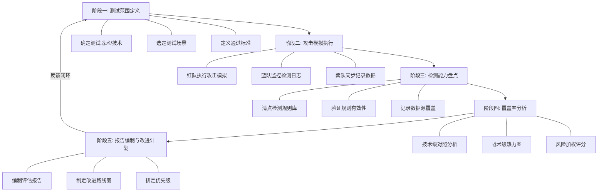
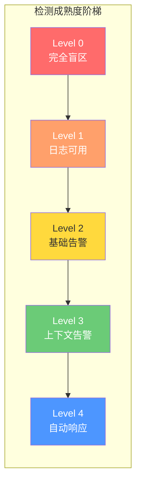
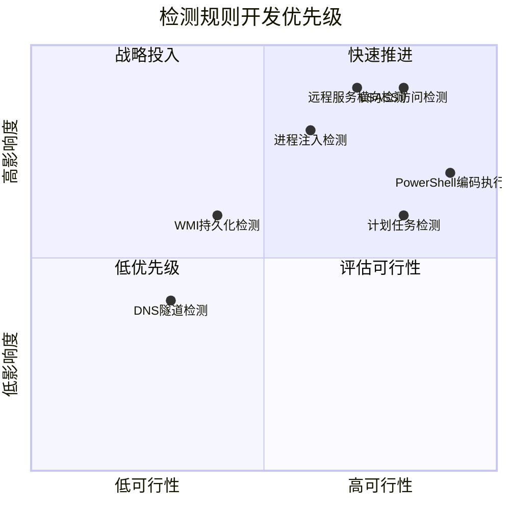
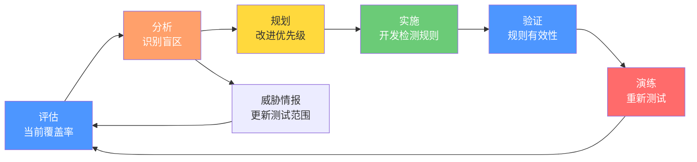

## ATT&CK覆盖率评估报告

在紫队协作演练中，**ATT&CK覆盖率评估报告**是最终的核心交付物——它将红队的攻击模拟结果与蓝队的检测能力进行系统化对照，量化安全防御体系的真实水平，并为后续的检测工程优化提供明确的行动指南。一份高质量的覆盖率评估报告，不仅是演练的总结，更是组织安全能力建设的路线图。

本节详细讲解如何构建、分析和呈现一份出版级的ATT&CK覆盖率评估报告，涵盖指标体系、分析方法、报告模板、检测规则开发和持续改进闭环。

---

### ATT&CK覆盖率评估的核心价值

很多组织做红蓝对抗，打得很热闹、报告写得很长，但最终落在纸面上的只有一个结论："我们发现了X个漏洞"。这种报告对安全运营几乎没有指导意义。

ATT&CK覆盖率评估的核心价值在于回答三个关键问题：

1. **我们能检测到什么？** —— 明确已有的检测能力边界
2. **我们检测不到什么？** —— 精确定位盲区和薄弱环节
3. **如何系统性地缩小盲区？** —— 提供可执行的改进路线图

从成熟度模型的角度看，覆盖率评估推动组织从"被动响应"（Security Maturity Level 1-2）向"主动检测"（Level 3-4）甚至"预测性防御"（Level 5）演进。

---

### 覆盖率指标体系

覆盖率不是单一数字，而是一个多维度的指标体系。仅用一个百分比来衡量安全检测能力，就像只用GDP来衡量国家发展水平一样片面。

#### 基础覆盖率指标

| 指标名称 | 计算公式 | 含义 | 适用场景 |
|---------|---------|------|---------|
| 技术覆盖率 | 已检测技术数 / 测试技术数 × 100% | 能检测到的ATT&CK技术占比 | 初步评估 |
| 战术覆盖率 | 已覆盖战术数 / 测试战术数 × 100% | 攻击链各阶段的检测覆盖情况 | 战略级评估 |
| 检测率 | 正确告警数 / 总测试数 × 100% | 检测规则的有效性 | 检测工程优化 |
| 误报率 | 误报告警数 / 总告警数 × 100% | 检测精度 | SOC运营效率 |
| 响应时间 | 从攻击发生到告警触发的平均时间 | 检测的时效性 | SOC响应能力 |
| MTTR | 从告警到完全响应的平均时间 | 端到端响应效率 | 运营成熟度 |

#### 进阶覆盖率指标

| 指标名称 | 计算公式 | 含义 |
|---------|---------|------|
| 技术多样性覆盖率 | 覆盖技术的实现变体数 / 该技术已知变体总数 | 单一技术的检测深度 |
| 环境覆盖率 | 覆盖环境数 / 总测试环境数 | 跨平台检测能力 |
| 检测层次分布 | 各OSI/ATT&CK数据源层次的检测占比 | 检测架构的纵深 |
| 漏检严重度加权覆盖率 | Σ(漏检技术权重×风险值) / Σ(总技术权重×风险值) | 以风险为导向的覆盖率 |

#### 覆盖率的"陷阱"

一个常见的误区是过度追求覆盖率数字本身。例如，如果一个组织测试了100个技术，覆盖了80个，看起来覆盖率不错。但如果未覆盖的20个恰好包括T1059（命令解释器）、T1053（计划任务）等高频攻击技术，那80%的覆盖率毫无意义。

正确的做法是将覆盖率与**风险加权**结合：

```text
风险加权覆盖率 = 已检测技术的风险分值总和 / 所有测试技术的风险分值总和 × 100%
```

风险分值可参考CVSS或组织内部的威胁评估矩阵，综合考虑：
- 该技术在真实攻击中的使用频率（来自威胁情报）
- 该技术在本行业被利用的概率
- 被利用后的业务影响程度

---

### ATT&CK覆盖率评估流程

完整的覆盖率评估分为五个阶段，每个阶段都有明确的输入、输出和质量标准。



#### 阶段一：测试范围定义

测试范围的选择直接决定评估报告的价值。一个常见的错误是"什么都测"——看似全面，实则浅尝辄止，无法得出有效的结论。

**范围定义原则：**

1. **聚焦高价值战术**：优先覆盖横向移动（TA0008）、凭证访问（TA0006）、权限提升（TA0004）等高风险战术
2. **结合威胁情报**：参考近期活跃的APT组织（如APT29、Lazarus Group）常用技术
3. **覆盖检测盲区**：上一轮评估中未检测到的技术优先复测
4. **环境适配**：确保测试技术适用于目标环境（Windows/Linux/Cloud）

**范围定义模板：**

```yaml
exercise_scope:
  name: "2026-Q2 ATT&CK覆盖率评估"
  tactics_tested:
    - TA0001_initial_access:       # 初始访问
        techniques: 5
        priority: high
        rationale: "近期钓鱼攻击事件频发"
    - TA0002_execution:            # 执行
        techniques: 6
        priority: high
        rationale: "命令执行类检测是基础"
    - TA0003_persistence:          # 持久化
        techniques: 4
        priority: medium
        rationale: "已覆盖大部分常见技术"
    - TA0005_defense_evasion:      # 防御规避
        techniques: 8
        priority: high
        rationale: "规避技术迭代快，需要持续验证"
    - TA0006_credential_access:    # 凭证访问
        techniques: 5
        priority: high
        rationale: "凭证是横向移动的关键"
    - TA0008_lateral_movement:     # 横向移动
        techniques: 4
        priority: critical
        rationale: "内网横向移动是关键防线"
  total_techniques: 32
  environment: "Windows域环境 + Linux跳板机"
  duration: "5个工作日"
  excluded:
    - reason: "仅覆盖端点检测，不含网络层检测"
      impact: "网络侧技术(T1040等)不在测试范围"
```

#### 阶段二：攻击模拟执行

紫队协作的核心在于**同步执行**——红队执行攻击的同时，蓝队实时监控检测日志，紫队负责协调和记录。

**执行记录要求：**

每个技术测试必须记录以下信息：

| 记录项 | 说明 | 示例 |
|-------|------|------|
| 技术ID | ATT&CK技术编号 | T1003.001 |
| 技术名称 | 完整技术名称 | OS Credential Dumping: LSASS Memory |
| 测试用例 | 具体的工具和命令 | `procdump.exe -ma lsass.exe` |
| 执行结果 | 攻击是否成功 | 成功/失败/部分成功 |
| 检测结果 | 蓝队是否检测到 | 已检测/未检测/延迟检测 |
| 检测来源 | 哪条规则触发告警 | Sysmon Event ID 10 |
| 检测时间 | 从执行到告警的时间 | 2分钟 |
| 数据源 | 告警依赖的日志数据源 | Sysmon、Windows Security Log |
| 环境变量 | 特殊的环境配置 | 需要管理员权限执行 |

**检测分级标准：**

不是所有"检测到"都一样。紫队应对检测结果进行分级：

| 检测级别 | 定义 | 分值 | 说明 |
|---------|------|------|------|
| Level 0 - 无检测 | 完全没有检测到 | 0 | 盲区，需优先补建 |
| Level 1 - 日志记录 | 数据源有相关日志，但无自动化告警 | 1 | 有数据但缺规则 |
| Level 2 - 基础告警 | 触发了告警但缺乏上下文 | 2 | 有告警但缺深度分析 |
| Level 3 - 上下文告警 | 告警包含丰富的上下文信息 | 3 | 可用于快速研判 |
| Level 4 - 自动响应 | 不仅检测到，还自动触发了响应动作 | 4 | 完整闭环 |



#### 阶段三：检测能力盘点

在分析覆盖率之前，需要全面清点组织当前的检测能力。这一步常被忽略，导致覆盖率评估变成"红队测试了什么"的记录，而非"检测体系整体能力"的评估。

**检测能力盘点清单：**

1. **检测规则库清单**：列出所有已部署的检测规则（SIEM规则、EDR规则、Sigma规则等）
2. **数据源清单**：确认哪些数据源已接入SIEM，数据质量如何
3. **数据源覆盖矩阵**：哪些数据源覆盖了哪些端点/网络段
4. **规则有效性验证**：通过回放已知攻击日志，验证规则是否能正确触发
5. **规则维护状态**：哪些规则是活跃的，哪些已过期或被禁用

**数据源覆盖矩阵示例：**

| 数据源 | 端点覆盖 | 战术覆盖 | 数据质量 | 状态 |
|-------|---------|---------|---------|------|
| Sysmon | 95% 端点 | TA0001-TA0009 | 高（结构化事件） | 活跃 |
| Windows Security Log | 100% 端点 | TA0002, TA0007 | 中（需配置审计策略） | 活跃 |
| EDR遥测 | 80% 端点 | TA0001-TA0010 | 高（行为数据） | 活跃 |
| DNS日志 | 100% 端点 | TA0001, TA0011 | 中 | 部分采集 |
| 网络流量（NDR） | 核心交换区 | TA0001, TA0006, TA0008 | 高（加密流量除外） | 活跃 |
| CloudTrail | 100% 云资源 | TA0001-TA0010 | 高 | 活跃 |
| PowerShell日志 | 70% 端点 | TA0002, TA0005 | 中 | 部分启用 |
| 脚本块日志 | 70% 端点 | TA0002 | 高 | 部分启用 |

#### 阶段四：覆盖率分析

这是评估报告的核心环节。分析分为三个维度：技术维度、战术维度和风险维度。

**技术维度分析：**

逐个技术进行对照，生成完整的检测矩阵：

```yaml
# ATT&CK技术覆盖率评估矩阵
coverage_matrix:
  - technique_id: T1003.001
    technique_name: "OS Credential Dumping: LSASS Memory"
    tactics: [TA0006]
    test_cases:
      - name: "Mimikatz sekurlsa"
        detected: true
        detection_level: 3
        detection_source: "Sysmon Event ID 10"
        detection_time: "45s"
        rule_name: "LSASS Access by Non-System Process"
      - name: "ProcDump LSASS dump"
        detected: false
        detection_level: 0
        notes: "未针对ProcDump创建检测规则"
      - name: "comsvcs.dll MiniDump"
        detected: true
        detection_level: 2
        detection_source: "Sysmon Event ID 10"
        detection_time: "120s"
        rule_name: "LSASS Access by Non-System Process"
      - name: "nanodump"
        detected: false
        detection_level: 0
        notes: "新型工具，现有规则未覆盖"
    overall_detection_rate: 50%   # 2/4变体被检测
    risk_priority: critical        # 高频攻击技术
    recommendation: "扩展LSASS访问检测规则，增加工具特征指纹"
```

**战术维度热力图：**

将评估结果映射到战术层面，生成热力图，直观展示检测体系的纵深：

| 战术 | 测试技术数 | 检测数 | 漏检数 | 覆盖率 | 风险等级 |
|------|-----------|-------|-------|--------|---------|
| TA0001 初始访问 | 5 | 4 | 1 | 80% | 中 |
| TA0002 执行 | 6 | 5 | 1 | 83% | 中 |
| TA0003 持久化 | 4 | 3 | 1 | 75% | 中 |
| TA0004 权限提升 | 5 | 4 | 1 | 80% | 中 |
| TA0005 防御规避 | 8 | 4 | 4 | 50% | **高** |
| TA0006 凭证访问 | 5 | 3 | 2 | 60% | **高** |
| TA0007 发现 | 3 | 2 | 1 | 67% | 中 |
| TA0008 横向移动 | 4 | 2 | 2 | 50% | **高** |
| TA0009 收集 | 2 | 2 | 0 | 100% | 低 |
| TA0010 数据外传 | 2 | 2 | 0 | 100% | 低 |
| TA0011 C2通信 | 3 | 2 | 1 | 67% | 中 |
| **合计** | **47** | **33** | **14** | **70%** | — |

从上表可以清晰看出：防御规避（TA0005）、凭证访问（TA0006）和横向移动（TA0008）是检测体系最薄弱的环节，覆盖率仅50%-60%。这三个战术恰恰是攻击者突破防线后最常使用的阶段，需要优先改进。

**风险维度分析：**

结合威胁情报，评估未检测技术的风险等级：

| 未检测技术 | ATT&CK ID | APT组织使用频率 | 实际攻击频率 | 业务影响 | 风险等级 |
|-----------|-----------|---------------|------------|---------|---------|
| LSASS Memory Dump（ProcDump方式） | T1003.001 | 高（几乎所有APT都用） | 极高 | 凭证泄露导致全面沦陷 | **严重** |
| DLL注入（Process Hollowing） | T1055.001 | 高 | 高 | 绕过EDR检测 | **高** |
| WMI事件订阅持久化 | T1546.003 | 中 | 中 | 隐蔽持久化 | **高** |
| 利用远程服务横向移动 | T1021.002 | 高 | 高 | 内网扩散 | **严重** |
| PowerShell编码执行 | T1059.001 | 极高 | 极高 | 常规攻击载体 | **高** |
| DNS隧道外传 | T1071.004 | 中 | 低 | 数据泄露 | **中** |
| 计划任务创建 | T1053.005 | 高 | 高 | 持久化和横向移动 | **高** |

---

### 检测规则开发计划

覆盖率评估报告的最终目的是指导检测能力提升。一份好的改进计划需要回答：**先做什么、怎么做、做到什么程度。**

#### 优先级矩阵

采用**影响度×可行性**二维矩阵来确定检测规则开发的优先级：



| 优先级 | 技术 | 影响度 | 可行性 | 预计工时 | 目标检测级别 |
|-------|------|-------|-------|---------|------------|
| P0 紧急 | T1003.001 LSASS内存转储 | 极高 | 高 | 2天 | Level 3 |
| P0 紧急 | T1021.002 远程服务横向移动 | 极高 | 高 | 2天 | Level 3 |
| P1 高 | T1055.001 进程注入 | 高 | 中 | 3天 | Level 3 |
| P1 高 | T1059.001 PowerShell编码执行 | 高 | 高 | 1天 | Level 3 |
| P1 高 | T1053.005 计划任务 | 高 | 高 | 1天 | Level 3 |
| P2 中 | T1546.003 WMI事件订阅 | 中 | 中 | 3天 | Level 2 |
| P3 低 | T1071.004 DNS隧道 | 中 | 低 | 5天 | Level 2 |

#### 检测规则开发示例

以下展示从覆盖评估发现到具体检测规则的完整转化过程：

**发现：** ProcDump转储LSASS内存未被检测（T1003.001，检测级别0）

**根因分析：** 现有规则仅基于工具名称（`procdump`）做过滤，ProcDump可通过重命名绕过。规则缺乏对LSASS进程的通用访问行为检测。

**解决方案：** 基于Sysmon Event ID 10（ProcessAccess）构建通用LSASS访问检测规则。

**Splunk检测规则：**

```spl
// 检测任何进程对LSASS的非正常访问
// 数据源：Sysmon Event ID 10 (ProcessAccess)
// 覆盖技术：T1003.001 - OS Credential Dumping: LSASS Memory
// 版本：v2.1 | 更新日期：2026-06

index=sysmon EventCode=10 TargetImage="*\\lsass.exe"
| where NOT match(SourceImage, "(?i)(csrss|wininit|services|smss|lsm|svchost|SearchIndexer|WmiPrvSE)\\.exe$")
| where GrantedAccess IN ("0x1010", "0x1410", "0x1fffff", "0x1438", "0x143a", "0x1F0FFF", "0x1000")
| eval risk_score = case(
    match(SourceImage, "(?i)(procdump|dumpit|rundll32|comsvcs|dbghelp)"), "Critical",
    match(SourceImage, "(?i)(powershell|cmd|wscript|cscript|mshta)"), "High",
    match(SourceImage, "(?i)(python|perl|ruby)"), "Medium",
    true(), "Low"
  )
| eval detection_context = "GrantedAccess权限值: ".GrantedAccess.", 来源进程: ".SourceImage
| stats count as access_count,
        values(SourceImage) as source_processes,
        values(GrantedAccess) as access_rights,
        values(risk_score) as max_risk,
        dc(SourceImage) as unique_sources,
        earliest(_time) as first_seen,
        latest(_time) as last_seen
  by Computer, TargetImage
| where access_count > 1 OR max_risk IN ("Critical", "High")
| eval first_seen = strftime(first_seen, "%Y-%m-%d %H:%M:%S"),
        last_seen = strftime(last_seen, "%Y-%m-%d %H:%M:%S")
| sort - max_risk, - access_count
```

**Sigma检测规则（跨平台版本）：**

```yaml
title: LSASS Memory Access Detection - Credential Dumping
id: 8f3a1b2c-4d5e-6f78-9abc-def012345678
status: stable
description: |
  检测非系统进程对LSASS内存的异常访问行为。
  覆盖多种凭证转储工具变体，包括Mimikatz、ProcDump、
  comsvcs.dll、nanodump等。
references:
  - https://attack.mitre.org/techniques/T1003/001/
  - https://www.elastic.co/guide/en/security/current/process-access-to-lsass.html
author: Security Operations Team
date: 2026/06/26
tags:
  - attack.credential_access
  - attack.t1003.001
logsource:
  category: process_access
  product: windows
detection:
  selection_target:
    TargetImage|endswith: '\lsass.exe'
  filter_legitimate:
    SourceImage|endswith:
      - '\csrss.exe'
      - '\wininit.exe'
      - '\services.exe'
      - '\smss.exe'
      - '\lsm.exe'
      - '\svchost.exe'
      - '\MsMpEng.exe'    # Windows Defender
      - '\SenseCncProxy.exe'  # Defender ATP
  filter_access:
    GrantedAccess:
      - '0x0'              # 无访问权限
      - '0x1000'           # PROCESS_QUERY_LIMITED_INFORMATION
  condition: selection_target and not filter_legitimate and not filter_access
falsepositives:
  - 合法的性能监控工具（需在白名单中登记）
  - 安全产品自身的LSASS扫描
level: high
```

**ELK/Sigma转换后的查询（ElasticSearch）：**

```json
{
  "query": {
    "bool": {
      "must": [
        { "match": { "event.code": "10" }},
        { "wildcard": { "winlog.event_data.TargetImage": "*\\lsass.exe" }}
      ],
      "must_not": [
        { "terms": { "winlog.event_data.SourceImage": [
            "C:\\Windows\\System32\\csrss.exe",
            "C:\\Windows\\System32\\wininit.exe",
            "C:\\Windows\\System32\\services.exe"
        ]}},
        { "terms": { "winlog.event_data.GrantedAccess": ["0x0", "0x1000"] }}
      ]
    }
  }
}
```

**检测效果验证：**

规则开发完成后，必须进行验证。验证方法包括：

1. **已知攻击回放**：将演练中录制的攻击日志回放，确认规则能正确触发
2. **误报压力测试**：在正常业务环境中运行24-72小时，确认误报率在可接受范围内
3. **规避测试**：尝试使用常见的规避手段（重命名工具、修改参数等），确认检测不会失效

```yaml
# 规则验证结果记录
rule_validation:
  rule_id: "LSASS_ACCESS_DETECTION_V2.1"
  rule_name: "LSASS Memory Access Detection"
  validation_date: "2026-06-26"
  tests:
    - scenario: "Mimikatz sekurlsa::logonpasswords"
      expected: true
      actual: true
      status: "PASS"
    - scenario: "ProcDump -ma lsass.exe"
      expected: true
      actual: true
      status: "PASS"
    - scenario: "ProcDump重命名为svc.exe -ma lsass.exe"
      expected: true
      actual: true  # 基于TargetImage检测，不依赖工具名
      status: "PASS"
    - scenario: "comsvcs.dll MiniDump via rundll32"
      expected: true
      actual: true
      status: "PASS"
    - scenario: "正常svchost.exe访问lsass.exe"
      expected: false
      actual: false  # 已被filter过滤
      status: "PASS"
    - scenario: "Windows Defender扫描lsass.exe"
      expected: false
      actual: false  # MsMpEng.exe已在白名单中
      status: "PASS"
  false_positive_rate: 0.3%  # 运行72小时后统计
  detection_latency:
    avg: "8s"
    p95: "25s"
    p99: "45s"
  status: "VALIDATED - 已部署生产环境"
```

---

### 完整的覆盖率评估报告模板

以下是一份可以直接使用的报告模板，涵盖所有必要组成部分：

```markdown
# ATT&CK覆盖率评估报告

## 文档信息
| 项目 | 内容 |
|------|------|
| 报告编号 | ATTCK-COVERAGE-2026-Q2-001 |
| 评估日期 | 2026-06-20 至 2026-06-26 |
| 评估范围 | Windows域环境 + Linux跳板机 |
| 参与人员 | 红队(3人)、蓝队(3人)、紫队(2人) |
| 报告版本 | v1.0 |
| 机密等级 | 内部机密 |

## 一、执行摘要

### 1.1 评估概述
本次覆盖率评估基于MITRE ATT&CK v15框架，针对组织核心IT基础设施
开展红蓝对抗演练，共测试XX个ATT&CK技术（覆盖XX个战术），评估安全
检测体系的覆盖能力和成熟度。

### 1.2 核心发现
- **技术覆盖率：72%**（25个技术中检测到18个）
- **风险加权覆盖率：68%**（高风险技术覆盖偏低）
- **平均检测时间（MTTD）：4.2分钟**
- **检测成熟度：Level 2-3**（基础告警到上下文告警之间）
- **最关键盲区：防御规避（TA0005）和横向移动（TA0008）**

### 1.3 改进建议（Top 5）
1. [P0] 建立LSASS通用访问检测规则（预计提升覆盖率+4%）
2. [P0] 开发远程服务横向移动检测规则（预计提升覆盖率+4%）
3. [P1] 扩展进程注入检测覆盖变体（预计提升覆盖率+4%）
4. [P1] PowerShell脚本块日志全量启用（预计提升覆盖率+2%）
5. [P2] 构建WMI事件订阅监控能力（预计提升覆盖率+2%）

## 二、测试范围与方法

### 2.1 测试技术清单
[此处插入完整的技术测试清单，按战术分组]

### 2.2 测试环境
- 操作系统：Windows Server 2022, Windows 11, Ubuntu 22.04
- 安全产品：Microsoft Defender for Endpoint, Splunk Enterprise
- 网络环境：模拟企业内网（域控、文件服务器、工作站）
- 测试工具：MITRE Caldera, Cobalt Strike, 自定义脚本

### 2.3 测试方法
- 红队执行攻击模拟（使用多种工具变体）
- 蓝队同步监控SIEM/EDR告警
- 紫队记录完整的时间线和检测状态

## 三、覆盖率分析

### 3.1 技术覆盖率矩阵
[此处插入完整的技术级覆盖率矩阵]

### 3.2 战术覆盖率热力图
[此处插入战术级热力图]

### 3.3 检测成熟度分布
| 成熟度级别 | 技术数量 | 占比 |
|-----------|---------|------|
| Level 0 - 无检测 | 7 | 28% |
| Level 1 - 日志记录 | 3 | 12% |
| Level 2 - 基础告警 | 6 | 24% |
| Level 3 - 上下文告警 | 7 | 28% |
| Level 4 - 自动响应 | 2 | 8% |

### 3.4 未检测技术详细分析
[此处逐个分析未检测技术，包含风险评估和改进建议]

## 四、检测规则开发计划

### 4.1 优先级排序
[此处插入优先级矩阵和详细开发计划]

### 4.2 规则开发详情
[此处列出每个待开发规则的技术方案]

## 五、改进路线图

### 5.1 短期改进（1-2周）
- 开发P0级检测规则
- 部署紧急数据源配置

### 5.2 中期改进（1-3个月）
- 完成P1级规则开发
- 提升检测成熟度到Level 3

### 5.3 长期改进（3-6个月）
- 构建威胁驱动的检测框架
- 建立自动化规则验证流程

## 六、附件
- 附件A：完整测试用例清单
- 附件B：检测规则源码
- 附件C：原始日志数据
- 附件D：下次演练计划
```

---

### 覆盖率分析的常见误区

在实际操作中，覆盖率评估报告容易出现以下问题，需要特别注意：

**误区一：只报数字不报含义**

❌ "本次覆盖率72%" —— 这个数字本身没有决策价值

✅ "本次覆盖率72%，其中高风险技术覆盖率仅58%，主要盲区集中在防御规避（TA0005，50%）和横向移动（TA0008，50%）两个战术。根据威胁情报，APT29在最近的攻击活动中频繁使用这两个战术的未检测技术，建议优先补建相关检测规则。"

**误区二：把"规则存在"等同于"检测有效"**

很多组织在盘点时发现"我们有LSASS访问检测规则"，就认为覆盖了T1003.001。但规则可能只检测了Mimikatz一种变体，对ProcDump、nanodump等工具完全无效。覆盖率评估必须基于**实际测试结果**，而非规则清单。

**误区三：忽视检测层级差异**

一条规则能触发告警（Level 2），和另一条规则能自动阻断并通知SOC（Level 4），虽然都算"已检测"，但价值完全不同。报告中必须区分检测层级，否则无法反映检测体系的真实成熟度。

**误区四：覆盖率提升后不验证**

开发了新规则就认为问题解决了。正确的做法是：下次演练中重新测试该技术，用**实际检测结果**验证改进效果。这也是覆盖率评估必须形成闭环的原因。

**误区五：忽略误报率对覆盖率的反噬**

高覆盖率但误报率也很高，会导致SOC分析师对告警产生"狼来了"效应，最终选择性忽略告警——这比没有检测更危险。覆盖率报告中必须同时报告误报率，以及告警疲劳的缓解措施。

---

### 覆盖率评估工具与平台

| 工具/平台 | 类型 | 核心能力 | 适用场景 | 成本 |
|----------|------|---------|---------|------|
| MITRE ATT&CK Navigator | 开源 | ATT&CK矩阵可视化、覆盖率热力图 | 手动覆盖率映射 | 免费 |
| MITRE Caldera | 开源 | 自动化攻击模拟、计划管理 | 自动化技术测试 | 免费 |
| Atomic Red Team | 开源 | 轻量级攻击测试用例库 | 快速技术验证 | 免费 |
| Security Damentals | 开源 | ATT&CK覆盖率仪表板 | 持续监控覆盖率趋势 | 免费 |
| PlexTrac | 商业 | 红队报告管理、覆盖率追踪 | 专业红队运营 | 付费 |
| SafeBreach | 商业 | 自动化攻击模拟、覆盖分析 | 大规模企业 | 付费 |
| AttackIQ | 商业 | 持续安全验证、覆盖分析 | 持续安全验证 | 付费 |
| Splunk ES | 商业 | SIEM+检测规则管理+仪表板 | 检测规则全生命周期管理 | 付费 |

**MITRE ATT&CK Navigator 使用示例：**

Navigator是覆盖率可视化的标准工具。将评估结果导入Navigator后，可以生成直观的覆盖热力图：

```json
{
  "name": "2026-Q2 Coverage Assessment",
  "versions": {
    "attack": "15",
    "navigator": "4.9.1"
  },
  "domain": "enterprise-attack",
  "techniques": [
    {
      "techniqueID": "T1003.001",
      "tactic": "credential-access",
      "score": 3,
      "color": "#ff9900",
      "comment": "检测级别3，4个变体中检测到2个"
    },
    {
      "techniqueID": "T1055.001",
      "tactic": "defense-evasion",
      "score": 0,
      "color": "#ff0000",
      "comment": "完全未检测，高优先级改进"
    },
    {
      "techniqueID": "T1021.002",
      "tactic": "lateral-movement",
      "score": 1,
      "color": "#ff3333",
      "comment": "仅日志级别，缺乏自动化告警"
    }
  ]
}
```

---

### 持续改进闭环

覆盖率评估不是一次性项目，而是持续改进的循环过程。每次评估发现的问题，必须在下一次评估中验证改进效果。



**推荐的评估节奏：**

| 评估类型 | 频率 | 范围 | 目的 |
|---------|------|------|------|
| 完整覆盖率评估 | 每季度1次 | 全战术覆盖 | 全面评估检测体系 |
| 针对性复测 | 每月1次 | 上次未检测的技术 | 验证改进效果 |
| 威胁驱动评估 | 事件驱动 | 新威胁相关的技术 | 响应新威胁 |
| 快速冒烟测试 | 每周1次 | 关键技术抽样 | 确认检测体系持续有效 |

**覆盖率趋势追踪：**

建立覆盖率趋势仪表板，追踪以下指标的变化：

| 指标 | Q1 | Q2 | 趋势 | 目标 |
|------|-----|-----|------|------|
| 技术覆盖率 | 65% | 72% | ↑ | Q4达到85% |
| 风险加权覆盖率 | 60% | 68% | ↑ | Q4达到80% |
| 高风险技术覆盖率 | 55% | 58% | ↑ | Q4达到75% |
| 平均检测级别 | 1.8 | 2.3 | ↑ | Q4达到3.0 |
| MTTD | 8.5min | 4.2min | ↓ | Q4达到2min |
| 误报率 | 12% | 7% | ↓ | Q4达到3% |

---

### 本节要点回顾

1. ATT&CK覆盖率评估报告是紫队协作的核心交付物，它回答"能检测什么、检测不到什么、如何改进"三个关键问题
2. 覆盖率是多维指标体系，不能仅用单一百分比衡量——需要结合风险加权、检测层级、误报率等维度
3. 完整评估流程包括五个阶段：范围定义、攻击模拟、能力盘点、覆盖率分析、报告编制
4. 检测规则开发需要明确的优先级排序，采用影响度×可行性矩阵指导资源分配
5. 评估报告必须形成闭环：每次改进的效果在下一次评估中验证，驱动检测能力持续提升
6. 覆盖率提升必须与误报率控制同步推进，避免告警疲劳反噬检测价值
