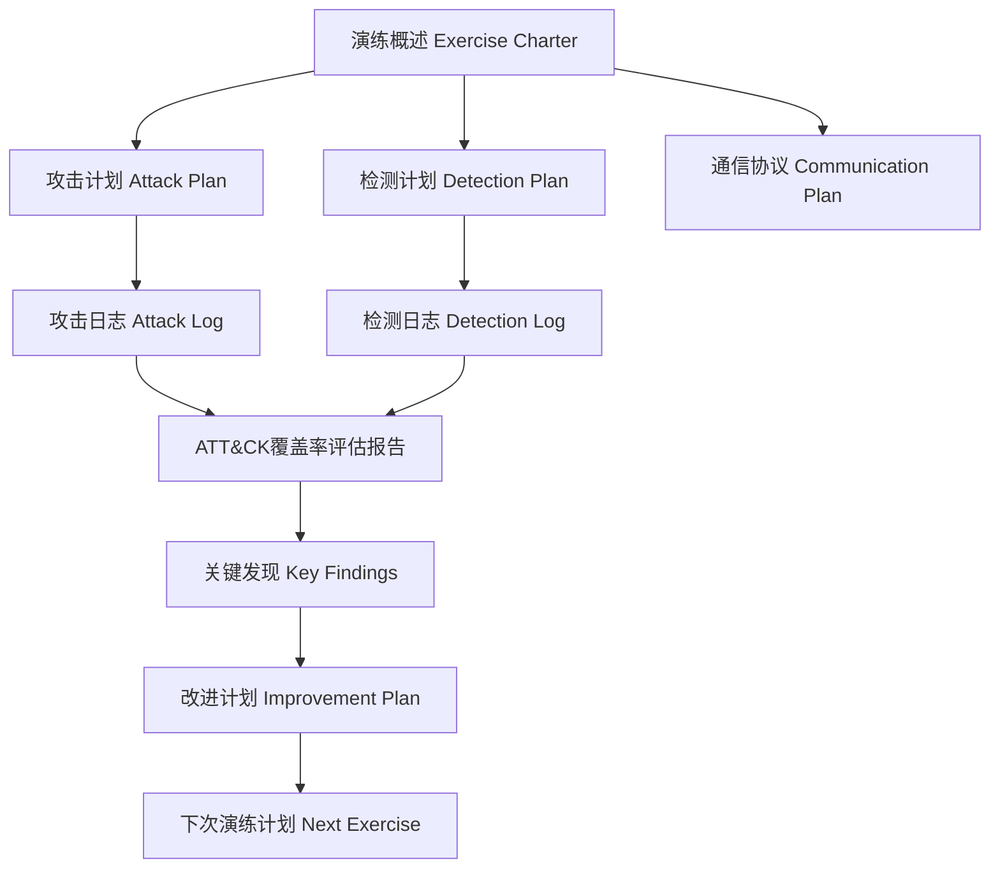
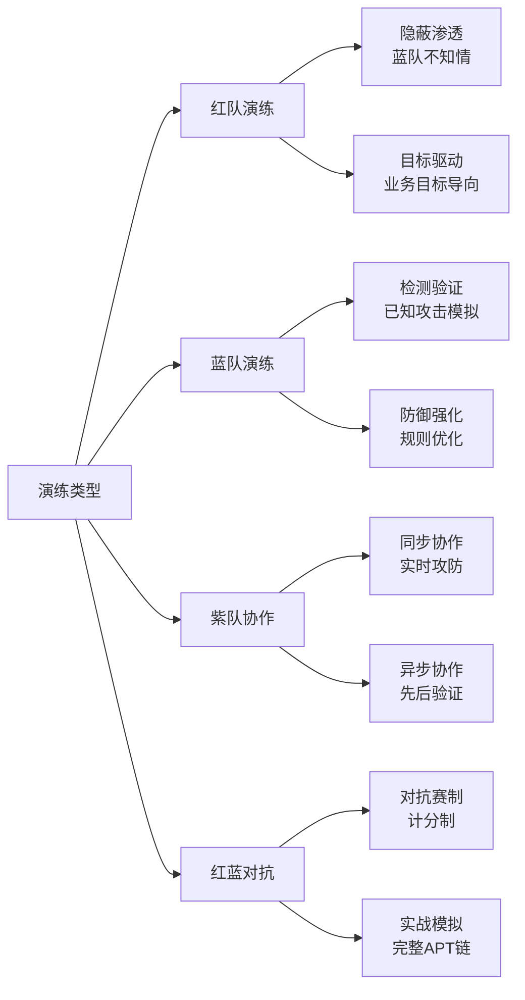
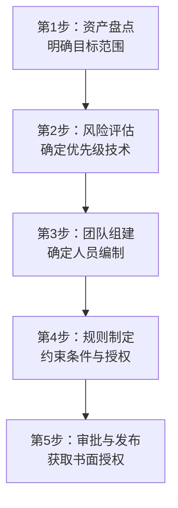

## 演练概述

演练概述（Exercise Overview / Exercise Charter）是红队/蓝队/紫队攻防演练的"宪法文档"——它定义了整场演练的边界、规则、参与者和预期目标。一份高质量的演练概述不仅仅是信息登记表，更是保障演练合法合规、高效有序、结果可复用的基石。没有演练概述的攻防活动，就像没有剧本的即兴表演——看似灵活，实则混乱。

---

## 一、为什么需要演练概述

### 1.1 演练概述的核心价值

在实际安全评估中，以下问题屡见不鲜：

- 红队以为可以在生产数据库上执行 DELETE 操作，结果触发了业务中断
- 蓝队不知道今天是演练日，将红队的攻击视为真实入侵并启动了全面应急响应
- 演练结束后发现某个关键系统从未在范围内，导致评估结论不完整
- 高管事后追问"这次演练到底测了什么"，团队无法给出清晰回答

演练概述正是为了解决这些问题而存在。它在演练开始前就明确回答以下核心问题：

| 问题 | 对应内容 | 为什么重要 |
|------|---------|-----------|
| 谁参与？ | 团队编制与角色分工 | 避免权责不清、沟通断层 |
| 测什么？ | 测试范围与技术选择 | 确保覆盖关键风险、避免遗漏 |
| 怎么测？ | 演练类型与执行方式 | 红蓝双方需要提前对齐预期 |
| 不能做什么？ | 规则与约束条件 | 防止越界导致业务损失或法律风险 |
| 出了问题怎么办？ | 紧急停止机制 | 保障演练期间业务连续性 |
| 什么时候开始/结束？ | 时间线与里程碑 | 控制节奏，确保按时交付 |

### 1.2 与其他文档的关系



演练概述是整个演练文档体系的顶层文件，它派生出攻击计划、检测计划、通信协议等下级文档。同时，ATT&CK覆盖率评估报告、关键发现、改进计划等后续文档都以演练概述为前提——它们回答的是"这次演练结果如何"，而演练概述回答的是"这次演练到底是什么"。

---

## 二、演练概述的完整结构

一份完整的演练概述文档应包含以下八个核心模块。下面逐一讲解每个模块的内容要求、写作要点和参考模板。

### 2.1 基本信息

**作用：** 快速定位这场演练的身份信息，方便日后检索和归档。

```yaml
exercise_info:
  # 演练标识
  exercise_id: "RT-2025-003"           # 演练编号（建议用 Red/Blue/Purple + 年份 + 序号）
  exercise_name: "2025年Q3核心交易系统攻防演练"  # 有意义的名称
  exercise_type: "紫队协作"              # 红队演练 / 蓝队演练 / 紫队协作 / 红蓝对抗
  classification: "内部-机密"            # 演练本身的信息密级

  # 时间信息
  planning_start: "2025-07-01"          # 筹划开始日期
  exercise_start: "2025-07-15"          # 演练正式开始
  exercise_end: "2025-07-29"            # 演练正式结束
  report_deadline: "2025-08-12"         # 最终报告交付截止

  # 组织信息
  sponsor: "CISO - 张三"                # 演练发起人/赞助人
  exercise_lead: "安全团队 - 李四"       # 演练总负责人
  red_team_lead: "渗透组 - 王五"         # 红队负责人
  blue_team_lead: "SOC组 - 赵六"         # 蓝队负责人
  purple_coordinator: "安全部 - 孙七"    # 紫队协调人（如果适用）
```

**命名规范建议：**

| 编号格式 | 含义 | 示例 |
|---------|------|------|
| RT-YYYY-NNN | 红队演练 | RT-2025-001 |
| BT-YYYY-NNN | 蓝队演练 | BT-2025-002 |
| PT-YYYY-NNN | 紫队协作 | PT-2025-003 |
| CR-YYYY-NNN | 红蓝对抗 | CR-2025-004 |

### 2.2 演练目标

**作用：** 明确本次演练要回答的核心安全问题。目标不清晰的演练等于没有目标。

**目标的三种层次：**

**层次一：验证型目标（Verification）**
> 验证现有安全控制是否有效

```yaml
verification_goals:
  - "验证EDR对凭证转储攻击（T1003）的检测能力"
  - "验证网络分段是否能阻止横向移动"
  - "验证SOC对钓鱼攻击的响应时间是否满足SLA（<30分钟）"
```

**层次二：发现型目标（Discovery）**
> 发现未知的安全风险和盲点

```yaml
discovery_goals:
  - "发现核心交易区的未知攻击路径"
  - "识别供应链攻击的检测盲区"
  - "评估零信任架构实施后的残余风险"
```

**层次三：度量型目标（Measurement）**
> 量化安全能力的基线水平

```yaml
measurement_goals:
  - "建立ATT&CK覆盖率基线（目标：≥60%）"
  - "测量MTTD（平均检测时间）和MTTR（平均响应时间）"
  - "评估安全团队在无预警情况下的应急响应能力"
```

**目标设定的SMART原则：**

| 原则 | 说明 | 反例 | 正例 |
|------|------|------|------|
| Specific（具体） | 目标明确、无歧义 | "测试安全能力" | "测试SOC对APT TTPs的检测覆盖率" |
| Measurable（可衡量） | 有量化指标 | "提升检测能力" | "ATT&CK覆盖率从65%提升到80%" |
| Achievable（可实现） | 在资源和时间约束内可完成 | "覆盖全部200+ ATT&CK技术" | "覆盖14个战术中各选3-5个关键技术" |
| Relevant（相关性） | 与组织面临的真实威胁相关 | "测试不常用的物联网协议" | "测试攻击者实际使用的横向移动技术" |
| Time-bound（有时限） | 有明确的时间节点 | "尽快完成" | "演练周期30天，报告14天内交付" |

### 2.3 测试范围

**作用：** 划定演练的"靶区"——哪些系统、网络、应用在范围内，哪些不在。

测试范围是演练概述中**最容易引发争议**的部分。红队希望范围越大越好，业务部门希望范围越小越好。因此，范围定义必须精确到IP段、域名、应用名称，避免模糊表述。

```yaml
scope:
  # === 在范围内（In-Scope） ===
  in_scope:
    networks:
      - "10.10.0.0/16 - 办公网" 
      - "10.20.0.0/24 - DMZ区"
      - "172.16.50.0/24 - 核心交易区（仅限检测验证，不执行破坏性操作）"
    
    applications:
      - "https://portal.example.com - 员工门户"
      - "https://api.example.com - 核心API网关"
      - "内部OA系统（oa.internal.example.com）"
    
    identities:
      - "普通域用户账户 x5（由蓝队提供）"
      - "管理员账户不作为攻击目标"
    
    cloud_services:
      - "AWS us-east-1 区域资源"
      - "Office 365 租户"

  # === 不在范围内（Out-of-Scope） ===
  out_of_scope:
    networks:
      - "10.30.0.0/16 - 生产数据中心核心DB集群"
      - "第三方供应商托管环境"
    
    systems:
      - "SCADA/ICS 工控系统（绝对禁止）"
      - "客户数据生产库（仅允许读取，禁止修改/删除）"
    
    techniques:
      - "物理入侵（本次演练不涉及）"
      - "对生产环境执行拒绝服务攻击"
      - "利用0-day漏洞（仅限已知漏洞利用）"

  # === 特殊限制（Special Constraints） ===
  constraints:
    - "核心交易区操作仅允许在交易闭市后（15:00-06:00 CST）"
    - "不得向外部发送任何从目标环境中获取的数据"
    - "社会工程仅限电话钓鱼，不包含物理渗透"
    - "红队所有操作必须使用预定义的工具清单"
```

**范围定义的常见陷阱：**

| 陷阱 | 问题描述 | 解决方案 |
|------|---------|---------|
| 范围模糊 | "包括办公网络"——具体哪些网段？ | 精确到CIDR块 |
| 遗漏影子IT | 未覆盖SaaS应用、云存储 | 资产盘点后再定范围 |
| 忽略第三方 | 供应商系统是否在范围内 | 单独声明并获取授权 |
| 版本漂移 | 演练期间系统变更导致范围失效 | 演练前冻结变更，版本锁定 |

### 2.4 演练类型与执行方式

根据演练的目标和协作模式，选择合适的演练类型：



| 演练类型 | 蓝队是否知情 | 红队是否实时共享 | 典型场景 | 优势 | 劣势 |
|---------|-------------|----------------|---------|------|------|
| 红队演练 | ❌ 不知情 | ❌ | 评估真实检测能力 | 最接近实战 | 蓝队无法学习 |
| 蓝队演练 | ✅ 自己组织 | — | 检测规则调优 | 安全可控 | 缺乏真实攻击视角 |
| 紫队同步协作 | ✅ 知情 | ✅ 实时共享 | ATT&CK覆盖评估 | 双方即时学习 | 需要高度协调 |
| 紫队异步协作 | ✅ 知情 | ❌ 事后共享 | 检测差距分析 | 时间灵活 | 缺乏实时互动 |
| 红蓝对抗 | ✅ 知情 | 取决于赛制 | 安全团队竞技评估 | 激发积极性 | 可能过度关注得分 |

**执行方式选择决策树：**

```text
是否需要评估真实检测能力？
├── 是 → 蓝队是否知情？
│   ├── 不知情 → 红队演练（最严格）
│   └── 知情 → 是否需要实时协作？
│       ├── 是 → 紫队同步协作
│       └── 否 → 紫队异步协作
└── 否 → 仅验证检测规则？
    ├── 是 → 蓝队演练
    └── 否 → 红蓝对抗（竞技模式）
```

### 2.5 参与团队与角色分工

```yaml
teams:
  red_team:
    role: "攻击模拟方"
    members:
      - name: "王五"
        role: "红队负责人"
        specialty: "渗透测试、攻击规划"
        contact: "wangwu@example.com"
      - name: "钱八"
        role: "社会工程专家"
        specialty: "钓鱼攻击、电话社工"
      - name: "周九"
        role: "漏洞利用专家"
        specialty: "Web渗透、二进制漏洞"
      - name: "吴十"
        role: "基础设施搭建"
        specialty: "C2框架、隐蔽通道"
    responsibilities:
      - "制定攻击计划并报紫队协调人审批"
      - "在规则范围内执行攻击行动"
      - "详细记录每个攻击步骤和使用的技术"
      - "发现紧急情况立即上报并暂停行动"
    team_size: 4

  blue_team:
    role: "防御检测方"
    members:
      - name: "赵六"
        role: "蓝队负责人"
        specialty: "SOC运营、事件响应"
        contact: "zhaoliu@example.com"
      - name: "冯十一"
        role: "监控分析师"
        specialty: "SIEM规则、告警分析"
      - name: "陈十二"
        role: "威胁狩猎专家"
        specialty: "主动威胁搜索、日志分析"
      - name: "褚十三"
        role: "应急响应工程师"
        specialty: "事件遏制、取证分析"
    responsibilities:
      - "在同步协作中实时验证检测能力"
      - "记录每个攻击行为的检测情况（检出/漏检）"
      - "及时响应紧急停止指令"
      - "提供必要的日志和监控数据"
    team_size: 4

  purple_team:
    role: "协调与评估方"
    members:
      - name: "孙七"
        role: "紫队协调人"
        specialty: "攻防协调、ATT&CK映射"
        contact: "sunqi@example.com"
    responsibilities:
      - "协调红蓝双方的沟通和信息同步"
      - "维护ATT&CK技术映射表"
      - "主持每日/每周复盘会议"
      - "确保演练按计划推进"
    team_size: 1

  stakeholders:
    role: "利益相关方"
    members:
      - name: "张三"
        role: "CISO/演练赞助人"
        contact: "zhangsan@example.com"
      - name: "李四"
        role: "业务系统负责人"
        contact: "lisi@example.com"
    responsibilities:
      - "审批演练概述和攻击计划"
      - "紧急情况下有权叫停演练"
      - "审阅最终演练报告"
```

**人员数量参考基准：**

| 演练规模 | 红队人数 | 蓝队人数 | 紫队协调人 | 演练周期 |
|---------|---------|---------|-----------|---------|
| 小型（单系统） | 2-3人 | 3-5人 | 1人 | 1-2周 |
| 中型（多系统/内网） | 4-6人 | 6-10人 | 1-2人 | 2-4周 |
| 大型（全组织/多站点） | 8-15人 | 15-30人 | 2-3人 | 1-3月 |
| 超大型（国家级/行业级） | 20+人 | 50+人 | 5+人 | 3-6月 |

### 2.6 时间线与里程碑

```yaml
timeline:
  phase_1_planning:
    name: "筹划阶段"
    start: "2025-07-01"
    end: "2025-07-14"
    milestones:
      - date: "2025-07-03"
        task: "演练概述审批通过"
        owner: "CISO"
      - date: "2025-07-07"
        task: "攻击计划定稿"
        owner: "红队负责人"
      - date: "2025-07-10"
        task: "检测计划定稿"
        owner: "蓝队负责人"
      - date: "2025-07-12"
        task: "通信测试完成"
        owner: "紫队协调人"
      - date: "2025-07-14"
        task: "攻击基础设施就绪验证"
        owner: "红队基础设施组"

  phase_2_execution:
    name: "执行阶段"
    start: "2025-07-15"
    end: "2025-07-29"
    milestones:
      - date: "2025-07-15"
        task: "演练正式启动（Kickoff会议）"
        owner: "紫队协调人"
      - date: "2025-07-18"
        task: "第一轮攻击完成，中期复盘"
        owner: "紫队协调人"
      - date: "2025-07-22"
        task: "检测规则迭代验证"
        owner: "蓝队负责人"
      - date: "2025-07-29"
        task: "演练正式结束，系统恢复确认"
        owner: "紫队协调人"

  phase_3_reporting:
    name: "报告阶段"
    start: "2025-07-30"
    end: "2025-08-12"
    milestones:
      - date: "2025-08-01"
        task: "红队提交攻击日志和发现"
        owner: "红队负责人"
      - date: "2025-08-05"
        task: "蓝队提交检测日志"
        owner: "蓝队负责人"
      - date: "2025-08-08"
        task: "紫队完成ATT&CK覆盖率评估"
        owner: "紫队协调人"
      - date: "2025-08-12"
        task: "最终报告交付 + Readout会议"
        owner: "紫队协调人"
```

**各阶段的工作重心：**

| 阶段 | 红队工作 | 蓝队工作 | 紫队协调 |
|------|---------|---------|---------|
| 筹划 | 制定攻击计划、搭建基础设施 | 制定检测计划、确认日志完整性 | 协调会议、审批文档 |
| 执行 | 按计划执行攻击、记录日志 | 实时检测、记录检测结果 | 维护技术映射表、主持复盘 |
| 报告 | 提交攻击日志和发现 | 提交检测日志和差距分析 | 汇总评估报告、组织Readout |

### 2.7 规则与约束条件（Rules of Engagement）

规则与约束是演练概述中**最具法律意义**的部分。它明确了什么可以做、什么不可以做、出了问题怎么处理。缺乏规则的演练等同于未授权攻击——可能触犯《网络安全法》《刑法》第285/286条。

```yaml
rules_of_engagement:
  # === 授权与合法性 ===
  authorization:
    approval_document: "CEO签署的演练授权书（编号：AUTH-2025-007）"
    legal_review: "法务部已审核，符合《网络安全法》第26条要求"
    data_protection: "所有涉及个人信息的操作已通过DPO审批"
    third_party: "第三方供应商系统不在本次演练范围内"

  # === 操作规则 ===
  permitted:
    - "使用预定义的漏洞利用工具和攻击技术"
    - "在授权范围内执行凭证收集和横向移动"
    - "模拟钓鱼攻击（仅限内部员工，不包含客户）"
    - "对测试环境执行破坏性操作"
    - "使用C2框架建立隐蔽通信通道"

  prohibited:
    - "对生产环境执行拒绝服务攻击（DoS/DDoS）"
    - "修改或删除生产数据库中的任何数据"
    - "利用0-day漏洞或未知漏洞（仅限已有公开PoC的漏洞）"
    - "对客户数据执行任何操作"
    - "向外部网络传输从目标环境中获取的任何数据"
    - "对工控系统（ICS/SCADA）发起任何攻击"
    - "物理入侵或设备接触"
    - "使用社会工程获取高管的个人敏感信息"

  # === 数据处理规则 ===
  data_handling:
    - "演练中获取的所有凭证和敏感数据存储在加密容器中"
    - "演练结束后30天内销毁所有攻击数据副本"
    - "攻击日志和报告的密级为'内部-机密'"
    - "不得将演练数据用于演练目的以外的任何用途"

  # === 紧急停止机制 ===
  emergency_stop:
    trigger_conditions:
      - "业务系统出现非预期的性能下降或宕机"
      - "检测到真实外部攻击（非演练）"
      - "演练操作导致数据丢失或损坏"
      - "任何参与者发现可能违法或违规的行为"
      - "演练赞助人主动叫停"
    
    procedure:
      - "任何参与者均可通过专用频道发出'STOP STOP STOP'指令"
      - "红队立即停止所有攻击活动"
      - "蓝队确认系统状态正常"
      - "紫队协调人在15分钟内召开紧急会议"
      - "评估影响后决定恢复/终止/修改演练"

    stop_channels:
      - "专用Signal群组：'#exercise-stop'"
      - "紧急电话：紫队协调人 138-xxxx-xxxx"
      - "邮件：exercise-stop@example.com"
```

**规则与约束的法律依据（中国场景）：**

| 法规 | 相关条款 | 对演练的影响 |
|------|---------|------------|
| 《网络安全法》第26条 | 网络安全事件应急演练 | 企业应定期组织演练，但需获得系统所有者授权 |
| 《数据安全法》第27条 | 数据安全保护义务 | 演练中不得泄露或滥用真实业务数据 |
| 《个人信息保护法》第51条 | 个人信息处理安全措施 | 涉及PII的操作需要专门的安全评估 |
| 《刑法》第285条 | 非法侵入计算机信息系统 | 未经授权的攻击模拟可能构成犯罪 |
| 《刑法》第286条 | 破坏计算机信息系统 | 演练中不得执行破坏性操作 |

> **重要提醒：** 即使是在企业内部授权的演练中，如果操作超出了授权范围（例如红队攻击了未在范围内声明的系统），相关责任人仍可能承担法律责任。因此，演练概述必须在演练开始前由法务部门审核，并获取书面授权。

### 2.8 通信协议

```yaml
communication:
  # === 演练期间的通信渠道 ===
  channels:
    primary:
      name: "Signal加密群组"
      purpose: "红队-紫队日常沟通"
      members: ["红队全员", "紫队协调人"]
    
    secondary:
      name: "专用邮件组"
      purpose: "正式通知、里程碑更新"
      address: "exercise-team@example.com"
    
    emergency:
      name: "紧急停止频道"
      purpose: "紧急停止指令"
      protocol: "发送'STOP STOP STOP'后等待确认"

    reporting:
      name: "日志提交系统"
      purpose: "攻击日志/检测日志的结构化提交"
      tool: "Jira/Confluence"

  # === 信息共享规则 ===
  information_sharing:
    sync_mode: "同步协作时，红队向紫队实时通报攻击进展"
    async_mode: "异步协作时，红队在阶段结束后向紫队提交完整日志"
    blue_visibility: "蓝队仅在同步模式下实时看到攻击行为"
    stakeholder_updates: "每周五向CISO提交进度简报"

  # === 会议安排 ===
  meetings:
    kickoff:
      frequency: "演练开始前1天"
      participants: "全员"
      agenda: "确认规则、通信测试、最终Q&A"
    
    daily_standup:
      frequency: "每日 09:00"
      participants: "红队负责人 + 蓝队负责人 + 紫队协调人"
      duration: "15分钟"
      agenda: "昨日进展、今日计划、问题协调"
    
    weekly_review:
      frequency: "每周五 14:00"
      participants: "全员"
      duration: "60分钟"
      agenda: "周度回顾、技术映射更新、风险评估"
    
    readout:
      frequency: "演练结束后"
      participants: "全员 + 高管"
      duration: "90分钟"
      agenda: "关键发现演示、总体评估、改进建议"
```

---

## 三、演练类型选择指南

### 3.1 不同场景的推荐方案

| 组织成熟度 | 首次演练建议 | 后续演练建议 |
|-----------|------------|------------|
| 初级（无SOC/安全团队<3人） | 蓝队演练（验证基本检测能力） | 紫队异步协作 |
| 中级（有SOC但无红队经验） | 紫队同步协作 | 红队演练（不告知蓝队） |
| 高级（成熟SOC+红队经验） | 红队演练 | 红蓝对抗+紫队协作交替 |
| 特定场景（合规要求） | 按合规标准选择 | 逐步升级到实战化 |

### 3.2 自动化攻击模拟在演练中的角色

现代紫队协作越来越多地使用自动化攻击模拟工具来提升效率：

| 工具 | 类型 | 适用场景 | 局限性 |
|------|------|---------|-------|
| MITRE Caldera | 对抗仿真平台 | 多战术自动化攻击链 | 配置复杂度高 |
| Atomic Red Team | ATT&CK原子测试 | 单个技术的快速验证 | 不模拟完整攻击链 |
| Infection Monkey | 内网横向传播 | 网络分段验证 | 仅覆盖横向移动 |
| SafeBreach | SaaS平台 | 全面攻击面验证 | 需要商业授权 |
| Breach & Attack Simulation | 持续化验证 | 生产环境持续监控 | 需要持续运营 |

> **使用建议：** 自动化工具适合用于ATT&CK覆盖率的快速基线评估和持续验证，但不应完全替代人工红队行动。人工红队能发现自动化工具无法覆盖的复杂逻辑漏洞、业务逻辑缺陷和社会工程攻击路径。

---

## 四、演练概述的撰写流程

### 4.1 五步撰写法



**第1步：资产盘点**

在定义演练范围之前，必须先完成资产盘点：

```bash
# 网络资产发现（示例）
nmap -sn 10.10.0.0/16 --open -oG assets.txt
# DNS枚举
subfinder -d example.com -o subdomains.txt
# 云资产扫描（AWS场景）
aws ec2 describe-instances --query 'Reservations[].Instances[].{IP:PrivateIpAddress,Name:Tags[?Key==`Name`].Value|[0]}' --output table
```

**第2步：风险评估**

基于资产盘点结果，选择需要测试的ATT&CK技术：

| 评估维度 | 评估方法 | 输出 |
|---------|---------|------|
| 威胁情报匹配 | 分析近期威胁情报中针对本行业的TTPs | 高频威胁技术列表 |
| 资产暴露面 | 评估互联网暴露资产的攻击面 | 暴露面攻击向量 |
| 历史事件 | 回顾过去12个月的安全事件 | 重点防御薄弱点 |
| 合规要求 | 对照等保/ISO27001要求 | 必测项目清单 |

**第3步：团队组建**

根据演练规模选择合适的团队配置（参见2.5节人员数量参考基准）。

**第4步：规则制定**

与法务、业务、IT运维共同制定规则与约束条件。

**第5步：审批与发布**

演练概述必须获得以下人员的书面签字：

- 演练赞助人（通常是CISO或CTO）
- 涉及业务系统的负责人
- 法务/合规部门
- IT运维负责人

---

## 五、演练概述的常见误区

| 误区 | 后果 | 正确做法 |
|------|------|---------|
| 演练概述过于简略，只写"测试安全能力" | 无法衡量结果，红蓝双方预期不对齐 | 每个目标都要有具体的成功标准 |
| 范围定义模糊 | 红队攻击了范围外的系统，引发业务投诉 | 精确到IP段、域名、应用名 |
| 忽略紧急停止机制 | 演练引发生产事故时无法及时止损 | 提前建立多通道停止机制 |
| 不做法律审查 | 演练操作可能触犯法律法规 | 演练前必须经法务审核 |
| 演练概述写了但没人看 | 所有人按自己的理解行事 | Kickoff会议逐条确认并签字 |
| 只关注技术，忽略人员和流程 | 评估结论片面，遗漏管理层面的薄弱环节 | 在目标中加入人员意识和流程响应的评估 |
| 蓝队完全不知情（非红队演练） | 蓝队将演练当作真实入侵，触发全面应急 | 紫队协作场景必须提前告知 |
| 不设置演练结束后的数据清理 | 攻击数据泄露风险 | 明确数据销毁时间和方式 |

---

## 六、演练概述模板（完整版）

以下是一份可直接使用的演练概述模板，根据实际情况填写即可：

```markdown
# 演练概述 - [演练名称]

## 1. 基本信息
| 项目 | 内容 |
|------|------|
| 演练编号 | |
| 演练名称 | |
| 演练类型 | [红队演练/蓝队演练/紫队协作/红蓝对抗] |
| 信息密级 | [公开/内部/机密] |
| 演练赞助人 | |
| 演练负责人 | |
| 演练周期 | YYYY-MM-DD 至 YYYY-MM-DD |
| 报告截止日期 | YYYY-MM-DD |

## 2. 演练目标
### 2.1 验证型目标
- 
### 2.2 发现型目标
- 
### 2.3 度量型目标
- 

## 3. 测试范围
### 3.1 在范围内
| 类型 | 资产 | 备注 |
|------|------|------|
| 网络 | | |
| 应用 | | |
| 身份 | | |
| 云服务 | | |

### 3.2 不在范围内
| 类型 | 资产 | 原因 |
|------|------|------|
| | | |

## 4. 参与团队
### 4.1 红队
| 姓名 | 角色 | 专长 | 联系方式 |
|------|------|------|---------|
| | | | |

### 4.2 蓝队
| 姓名 | 角色 | 专长 | 联系方式 |
|------|------|------|---------|
| | | | |

### 4.3 紫队协调
| 姓名 | 角色 | 联系方式 |
|------|------|---------|
| | | |

## 5. 规则与约束
### 5.1 允许的操作
-

### 5.2 禁止的操作
-

### 5.3 特殊限制
-

## 6. 紧急停止
- 触发条件：
- 停止指令：发送 "STOP STOP STOP"
- 确认机制：
- 恢复/终止决策：

## 7. 通信协议
| 渠道 | 用途 | 参与者 |
|------|------|-------|
| | | |

## 8. 时间线
| 阶段 | 开始 | 结束 | 关键里程碑 |
|------|------|------|-----------|
| 筹划 | | | |
| 执行 | | | |
| 报告 | | | |

## 9. 签字确认
| 角色 | 姓名 | 签字 | 日期 |
|------|------|------|------|
| 演练赞助人 | | | |
| 红队负责人 | | | |
| 蓝队负责人 | | | |
| 紫队协调人 | | | |
| 法务审核 | | | |
```

---

## 七、总结

演练概述不是一份走过场的文书工作，而是攻防演练成功的关键基石。它回答了"我们在做什么、谁来做、怎么做、什么不能做"这四个根本问题。一份好的演练概述应该具备以下特征：

1. **范围精确**——精确到IP段和应用名，不留模糊空间
2. **规则明确**——每条规则都有法律依据或业务理由
3. **目标可衡量**——用ATT&CK覆盖率、MTTD/MTTR等量化指标
4. **流程闭环**——从筹划到报告，每个阶段都有明确的负责人和截止时间
5. **安全兜底**——紧急停止机制和数据处理规则确保演练本身不会成为新的风险源

> **实战建议：** 第一次组织攻防演练的团队，建议从紫队同步协作开始，而非直接进行蓝队不知情的红队演练。紫队协作模式允许双方实时沟通、即时学习，风险可控且教育价值最大化。待团队积累2-3次紫队协作经验后，再升级为正式红队演练。
