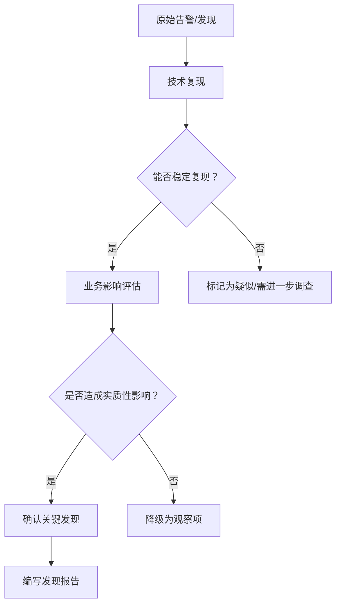
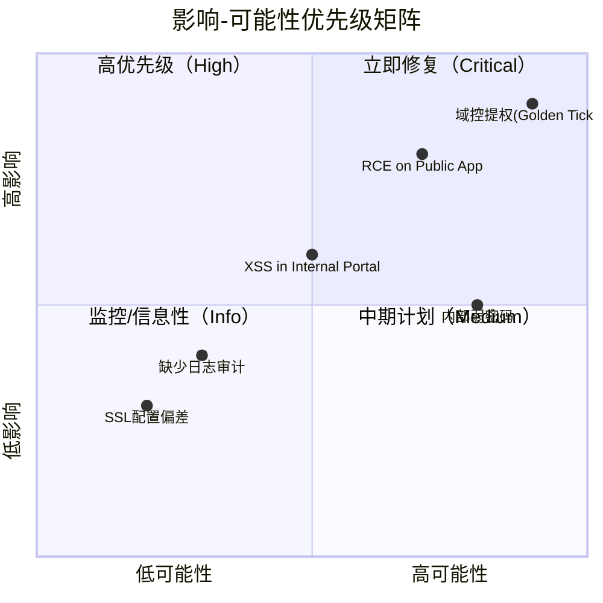
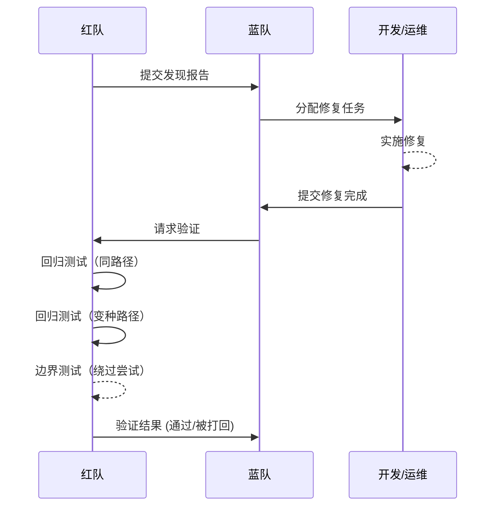
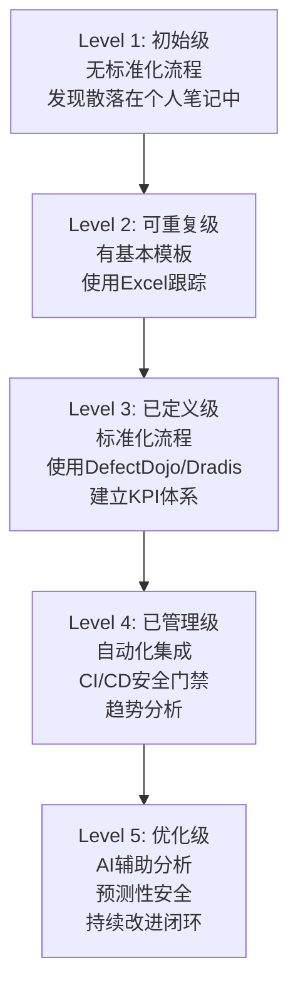

## 关键发现

在红队/紫队演习中，**关键发现**是整场评估的核心交付物。一次成功的渗透测试或对抗演习，如果不能将技术发现转化为可理解、可行动的安全缺陷报告，其价值将大打折扣。据 Verizon《2024年数据泄露调查报告（DBIR）》统计，**68%的数据泄露涉及人为因素**，而其中大量本可通过修复已知安全发现来预防。本章系统讲解如何识别、分类、评分、撰写和追踪关键发现，涵盖从原始告警到终版报告的全流程，并提供真实案例和企业级实践指导。

---

## 一、什么是关键发现

### 1.1 定义

关键发现（Key Finding）是指在安全评估中识别出的、具有实际安全风险的漏洞、配置缺陷、流程问题或架构弱点。它不仅仅是某个技术问题（如一个未打补丁的软件），而是**能够被攻击者利用并导致实质性损害**的安全缺口。

理解这个定义的三个核心要素：

- **实际风险**：不是理论上的可能性，而是经过验证的、可复现的安全缺陷
- **可被利用**：攻击者有明确的路径可以触发此问题
- **实质性损害**：可导致数据泄露、服务中断、权限提升、财务损失或合规违规

与普通发现（Observation）的区别：

| 维度 | 关键发现（Key Finding） | 普通发现（Observation） |
|------|----------------------|----------------------|
| 影响 | 可直接导致权限提升、数据泄露或横向移动 | 单独存在时影响有限，或属于最佳实践建议 |
| 利用难度 | 低至中，有现成工具或PoC | 高，需多种条件配合 |
| 修复优先级 | 高/紧急 | 低/信息性 |
| 证据强度 | 有完整的攻击链还原 | 仅有理论风险或扫描结果 |
| 业务影响 | 可量化的数据泄露、服务中断或合规违规 | 难以量化的潜在风险 |
| 报告要求 | 必须包含在终版报告中 | 可作为附录或建议项 |

> **实践中的灰色地带**：并非所有发现都能清晰地归入"关键"或"普通"。例如，一个内网的XSS漏洞，单独看是中等风险，但如果目标环境中存在CSRF token缺失 + HttpOnly Cookie未设置的组合，它就可能升级为关键发现。判断的关键在于**上下文**——这个发现在当前环境中能走多远。

### 1.2 关键发现的来源

| 来源 | 典型发现类型 | 优先级 | 常见工具/方法 |
|------|------------|-------|-------------|
| 红队渗透测试 | 域管理员权限获取、SQL注入、RCE | 高 | Cobalt Strike、Metasploit、BloodHound |
| 紫队联合演练 | 检测规则绕过、告警响应延迟、SOC误判 | 高 | 攻击模拟 + SIEM监控对比 |
| 漏洞扫描 | 高危CVE（如Log4Shell、ProxyShell） | 中-高 | Nessus、Qualys、OpenVAS |
| 配置审计 | 默认凭据、过度权限、暴露的服务 | 中 | Lynis、CIS Benchmark工具 |
| 架构评审 | 网络分段缺失、信任关系不合理 | 中-高 | 网络拓扑分析、流量审计 |
| 代码审计 | 硬编码密钥、命令注入、认证绕过 | 高 | Semgrep、CodeQL、SonarQube |
| 人员测试 | 钓鱼成功率、物理入侵可能性 | 中 | GoPhish、物理渗透工具 |
| 云环境审计 | 过度IAM权限、公开存储桶、无加密 | 中-高 | ScoutSuite、Prowler、CloudSploit |

### 1.3 关键发现的生命周期


**各阶段关键交付物：**

| 阶段 | 交付物 | 负责人 |
|------|--------|--------|
| 发现与确认 | 原始证据包（截图、日志、PoC） | 红队成员 |
| 分类与优先级 | 评分表（CVSS + 上下文修正） | 红队技术负责人 |
| 撰写报告 | 结构化发现报告 | 报告撰写人 |
| 沟通与演示 | Readout演示材料 | 红队负责人 |
| 修复与验证 | 修复确认报告 | 蓝队/开发团队 |
| 回归测试 | 回归测试结果 | 红队 |
| 归档 | 漏洞知识库条目 | 安全运营团队 |

---

## 二、发现的识别与确认

### 2.1 从原始数据到结构化发现

红队/紫队在演练过程中会产生大量原始数据，包括但不限于：

- **扫描结果**：Nmap、Nessus、Burp Suite、Dirb等工具的输出
- **抓包数据**：Wireshark、tcpdump记录的网络流量
- **日志条目**：Windows Event Log、Syslog、CloudTrail等
- **命令行历史**：攻击路径中的关键命令及其输出
- **代码片段**：SQL注入payload、反序列化利用代码、webshell内容
- **截图**：关键步骤的屏幕截图，作为视觉证据
- **内存取证数据**：Volatility分析结果、进程转储
- **网络流量特征**：C2通信模式、数据外泄流量特征

识别关键发现的核心原则是**问三个问题**：

1. **所以呢？**（So What？）—— 这个发现能导致什么后果？
2. **然后呢？**（What Next？）—— 攻击者利用它能走多远？
3. **怎么修？**（How to Fix？）—— 修复方案是否明确且可行？

> **实战经验**：很多红队新手会陷入"发现数量陷阱"——列出20个发现，但其中15个其实只是同一个根本问题的不同表现。优秀的红队分析师会花30%的时间做发现，70%的时间做**关联分析和优先级排序**。

### 2.2 发现确认的三重验证

在将任何发现加入最终报告之前，必须经过以下验证流程：



**验证方法详解：**

**方法一：手动复现**

对于每个声称的漏洞，至少手动复现一次，排除工具误报：

```bash
# 示例：手动验证SQL注入（非自动化扫描结果）
curl -X POST "https://target.com/api/login" \
  -d "username=admin' OR '1'='1'--&password=test"

# 验证命令注入
# 先确认是否存在注入点
curl "https://target.com/api/ping?host=127.0.0.1"
# 再尝试执行命令
curl "https://target.com/api/ping?host=127.0.0.1%0aid"
# 确认输出中包含命令执行结果
```

**方法二：利用链构建**

将一个孤立发现置于完整的攻击链中验证其实际价值：

| 起始发现 | 攻击链推理 | 最终影响 |
|---------|-----------|---------|
| 单个XSS | 能窃取到Cookie吗？→ Cookie能模拟登录吗？→ 登录后能访问敏感数据吗？ | 客户数据泄露 |
| 单个弱密码 | 能登录什么系统？→ 能从该系统横向移动到关键资产吗？ | 域管理员权限获取 |
| 配置暴露 | 能访问管理接口吗？→ 管理接口有已知漏洞吗？ | 服务器完全控制 |
| SSRF | 能访问内部元数据服务吗？→ 能获取IAM角色凭据吗？ | 云环境完全接管 |

**方法三：环境交叉验证**

在不同环境（DEV/STAGING/PROD）或不同时段验证发现是否一致，排除临时配置变动的影响。

**关键原则**：一个发现如果只能在极其特殊的条件下触发一次（如特定时间窗口、特定用户行为），它可能不是"关键发现"而更适合作为"观察项"记录。

### 2.3 常见的误判场景

| 误判类型 | 描述 | 纠正方法 |
|---------|------|---------|
| **过度升级** | 将理论风险当作实际风险报告 | 要求完整利用链证据 |
| **工具误报** | 扫描器标记但实际不可利用 | 手动复现验证 |
| **脱离上下文** | 忽略了前置条件（如需要内网访问） | 明确标注前提条件 |
| **忽略补偿控制** | 未考虑现有安全控制的缓解作用 | 评估控制有效性 |
| **环境差异** | DEV环境发现但PROD已修复 | 确认目标环境状态 |

---

## 三、发现分类体系

### 3.1 按技术类型分类

这是最通用的分类方式，直接对应CWE（Common Weakness Enumeration）标准：

| 大类 | 子类 | CWE编号示例 | 典型发现 |
|------|------|------------|---------|
| 注入类 | SQL注入、命令注入、LDAP注入、NoSQL注入 | CWE-77, CWE-89, CWE-90 | `' OR 1=1--`绕过登录 |
| 认证与授权 | 弱密码、未授权访问、权限提升、JWT伪造 | CWE-287, CWE-269, CWE-862 | 未授权访问/admin接口 |
| 跨站脚本 | 存储型XSS、反射型XSS、DOM型XSS | CWE-79 | 评论框XSS窃取管理员Cookie |
| 配置缺陷 | 默认凭据、目录遍历、错误信息泄露 | CWE-16, CWE-200, CWE-22 | Tomcat默认管理后台 |
| 加密缺陷 | 弱SSL/TLS、明文传输、硬编码密钥 | CWE-326, CWE-311, CWE-321 | 使用自签名证书且不验证 |
| 逻辑缺陷 | 业务逻辑绕过、竞争条件、越权操作 | CWE-840 | 修改订单金额参数 |
| 网络架构 | 端口暴露、网络分段缺失、防火墙规则过松 | CWE-1429 | 数据库直接暴露在公网 |
| 云安全 | 过度IAM权限、公开存储桶、无加密 | CWE-284, CWE-311 | S3存储桶公开可读 |
| 供应链 | 第三方组件漏洞、恶意依赖注入 | CWE-1395, CWE-829 | 使用含后门的npm包 |

### 3.2 按安全域分类

与技术分类正交，按安全运营的不同维度划分：

1. **检测类发现**：安全设备/规则未能检测到攻击行为
   - 例如：EDR未检测到Mimikatz的执行、WAF绕过SQL注入
   - **严重性判断标准**：如果该攻击在生产环境中发生，SOC能否在数据泄露前检测到？

2. **响应类发现**：应急响应流程、时效、质量不足
   - 例如：SOC从告警到响应超过4小时、误报率过高导致告警疲劳
   - **严重性判断标准**：响应延迟会导致攻击者获得多少额外的横向移动窗口？

3. **防护类发现**：安全控制措施的缺失或薄弱
   - 例如：缺少多因素认证、DMZ与内网之间无防火墙隔离
   - **严重性判断标准**：该控制的缺失是否直接导致了攻击路径的打通？

4. **流程类发现**：管理流程和制度层面的缺陷
   - 例如：员工离职后账号未及时注销、补丁管理流程缺失
   - **严重性判断标准**：该流程缺陷是否已在本次演练中被攻击者利用？

### 3.3 按MITRE ATT&CK阶段分类

将发现映射到MITRE ATT&CK框架的具体战术阶段，帮助安全团队理解攻击者在哪个环节取得了突破：

| ATT&CK战术阶段 | 对应的关键发现类型 | 检测难度 |
|---------------|-----------------|---------|
| TA0001 初始访问 | 钓鱼成功、漏洞利用、对外暴露服务 | 中 |
| TA0002 执行 | 任意命令执行、Webshell上传 | 低-中 |
| TA0003 持久化 | 创建隐藏用户、计划任务、注册表Run键 | 中-高 |
| TA0004 权限提升 | 本地提权漏洞、UAC绕过 | 中 |
| TA0005 防御绕过 | AMSI绕过、日志清除、进程注入 | 高 |
| TA0006 凭据访问 | 明文凭据转储、哈希传递、Kerberoasting | 中-高 |
| TA0007 发现 | 内网扫描、域信息收集、共享资源枚举 | 高 |
| TA0008 横向移动 | PsExec使用、WMI远程执行、Pass-the-Hash | 中 |
| TA0009 收集 | 敏感文件打包、数据库导出、剪贴板窃取 | 中-高 |
| TA0010 渗出 | DNS隧道、HTTPS反向代理、Telegram Bot C2 | 高 |
| TA0040 影响 | 数据销毁、勒索加密、服务拒绝 | 低 |

> **实战提示**：在报告中使用ATT&CK编号（如TA0001、T1566）比使用中文名称更精确，也方便安全团队与MITRE官方知识库交叉参考。

---

## 四、风险评分与优先级

### 4.1 CVSS评分系统

**通用脆弱性评分系统（CVSS v3.1）** 是业界最广泛使用的标准量化方法，包含三个度量组：

**基础指标（Base Metrics）：**
- AV（攻击向量）：网络/相邻/本地/物理
- AC（攻击复杂度）：低/高
- PR（权限要求）：无/低/高
- UI（用户交互）：无/需要
- S（影响范围）：未变化/已变化
- C/I/A（机密性/完整性/可用性影响）：高/低/无

**CVSS评分等级：**

| 等级 | 分值范围 | 含义 | 修复时间要求 |
|------|---------|------|------------|
| 无（None） | 0.0 | 无风险 | 不需要 |
| 低（Low） | 0.1 - 3.9 | 需特殊条件 | 下个迭代 |
| 中（Medium） | 4.0 - 6.9 | 有一定风险 | 1个月内 |
| 高（High） | 7.0 - 8.9 | 严重风险 | 1周内 |
| 严重（Critical） | 9.0 - 10.0 | 极其严重 | 24-72小时内 |

> **注意**：CVSS在红队场景中的局限性——它不考虑攻击链上下文的实际可达性（一个CVSS 10.0的漏洞如果处于不暴露的微服务中，实际风险可能低于一个CVSS 7.5但已在DMZ中确认可利用的漏洞）。因此建议将CVSS作为基础分，再结合上下文进行修正。

### 4.2 CVSS v4.0 的改进

CVSS v4.0（2023年10月发布）引入了几个对红队场景特别有用的改进：

- **威胁指标（Threat Metrics）**：将可利用性从基础指标中分离，支持动态评估（如EXPLOIT_ADDED、EXPLOIT_ATTACKED）
- **补充指标（Supplementary Metrics）**：允许组织自定义评估维度（如自动化程度、报告信心度）
- **安全评级（Security Ratings）**：直接映射到 SSVC（Stakeholder-Specific Vulnerability Categorization），方便非技术人员理解

### 4.3 红队场景下的优先级矩阵

单一的CVSS评分不足以反映紫队演习中的实际风险优先级。推荐使用**影响-可能性矩阵**：



**最终优先级判定原则：**

1. **攻击路径可达性**：该漏洞是否在攻击者的实际可达范围内？
   - 公网可触达 → 加一级优先级
   - 需内网初始访问 → 评估初始访问难度
2. **数据资产价值**：受影响的资产存储什么数据？
   - PII/PCI数据 → 最高优先级
   - 公开信息 → 低优先级
3. **利用复杂度**：是否需要多重条件、定制工具？
4. **检测难度**：现有安全控制能否检测到此攻击？
5. **业务连续性影响**：修复是否需要停机？对业务的影响窗口有多大？

### 4.4 自定义评分模板

以下是一个适用于红队/紫队场景的自定义评分模板，结合了技术和运营维度：

```text
评分 = (技术严重性 × 0.4) + (业务影响 × 0.3) + (利用易用性 × 0.2) + (检测难度 × 0.1)

技术严重性：1-5 (CVSS转换)
业务影响：1-5 (数据泄露等级 × 受影响的系统数量)
利用易用性：1-5 (有没有公开PoC？是否需要定制工具？)
检测难度：1-5 (当前SOC能否检测到？需要哪种级别告警？)

最终优先级：
  4.0-5.0 → P0 紧急（24小时内修复）
  3.0-3.9 → P1 高（1周内修复）
  2.0-2.9 → P2 中（1个月内修复）
  1.0-1.9 → P3 低（下个迭代修复）
  <1.0    → 观察项
```

### 4.5 实战评分案例

以下是一个完整的评分示例，展示如何将上述框架应用于实际发现：

**发现：Web应用SQL注入导致全量用户数据泄露**

| 评分维度 | 评分 | 说明 |
|---------|------|------|
| CVSS基础分 | 9.8 (AV:N/AC:L/PR:N/UI:N/S:U/C:H/I:H/A:H) | 网络可达、无需认证、完全影响 |
| 上下文修正 | -0.5 | 该应用位于DMZ，但有WAF（可绕过） |
| 业务影响 | 5 | 50万用户PII数据（含身份证号、手机号） |
| 合规影响 | 5 | 违反《个人信息保护法》，可能面临营业额5%罚款 |
| 利用易用性 | 4 | 有公开PoC，但需要绕过WAF |
| 检测难度 | 3 | WAF日志可检测，但需人工分析 |
| **最终评分** | **4.5** | **P0 紧急** |

---

## 五、发现报告撰写

### 5.1 标准发现报告模板

每个关键发现应包含以下字段：

```yaml
# 发现基本信息
ID: F-2025-001
标题: [简明扼要的问题描述]
类型: [注入/认证/配置/逻辑/架构/...]
严重等级: [Critical/High/Medium/Low/Info]
CVSS: [v3.1评分，如 8.5 (AV:N/AC:L/PR:N/UI:R/S:C/C:H/I:H/A:N)]

# 技术细节
攻击路径: [描述攻击者的完整利用链]
受影响的系统: [IP、服务名、应用名]
前提条件: [利用此漏洞需要的前置条件]
PoC: [概念验证代码或命令]

# 证据
截图: [关键步骤截图路径]
日志: [相关日志条目]
流量: [pcap文件路径或关键请求/响应]

# 修复建议
短期修复: [快速缓解措施，如WAF规则、配置变更]
长期修复: [根本解决方案，如代码重构、架构调整]
修复责任人: [团队/个人]
预计修复时间: [日期]

# 参考
CWE: [CWE编号]
CVE: [CVE编号（如果适用）]
参考链接: [外部参考文档]
```

### 5.2 高质量发现报告的编写技巧

**技巧一：用"攻击者故事"代替"技术罗列"**

- ❌ 错误示例：
  > 发现Burp Suite扫描显示login.php存在SQL注入，参数id未过滤。

- ✅ 正确示例：
  > 攻击者仅需在浏览器中访问 `https://target.com/user?id=1 UNION SELECT username,password FROM users--`，即可将数据库中所有用户的用户名和密码明文显示在页面上。这意味着攻击者可以在**无需认证**的情况下，获取到包括管理员在内的所有用户凭据。

**技巧二：每个风险都要有业务影响描述**

- ❌ 错误示例：
  > 该漏洞风险等级为高，建议修复。

- ✅ 正确示例：
  > 通过此漏洞，攻击者可以读取数据库中所有客户订单记录（约50万条），包括姓名、电话、地址、信用卡后四位。根据《个人信息保护法》第54条，数据泄露可能面临上一年度营业额5%以下的罚款。此外，已泄露的客户数据将被用于精准钓鱼攻击，导致品牌信任度严重下降。

**技巧三：修复建议必须可执行**

- ❌ 错误示例：
  > 加强输入验证。

- ✅ 正确示例：
  > 使用参数化查询（Prepared Statement）替代字符串拼接。以下是修复后的代码示例：
  > ```php
  > // ❌ 漏洞代码
  > $sql = "SELECT * FROM users WHERE id = " . $_GET['id'];
  > 
  > // ✅ 修复代码
  > $stmt = $pdo->prepare("SELECT * FROM users WHERE id = ?");
  > $stmt->execute([$_GET['id']]);
  > ```

**技巧四：提供检测规则**

除了修复建议，还应提供该发现对应的检测规则，帮助安全运营团队识别类似攻击：

```yaml
# Sigma规则示例 - 检测SQL注入尝试
title: SQL Injection Attempt via URL Parameters
id: 5b8e6f8a-1c2d-4e3f-9a0b-8c7d6e5f4a3b
status: experimental
description: Detects common SQL injection patterns in URL parameters
logsource:
  category: webserver
  product: iis
detection:
  selection:
    cs-uri-query|contains:
      - "' OR '1'='1"
      - " UNION SELECT"
      - " WAITFOR DELAY"
      - " SLEEP("
      - "/*!50000"
  condition: selection
level: high
```

**技巧五：提供前后对比的修复效果**

```text
修复前风险状态：[描述攻击路径和潜在影响]
修复后安全状态：[描述修复后的防护能力]
验证方法：[如何确认修复有效]
```

### 5.3 按读者角色定制报告

不同角色关注的信息不同，同一份发现报告应有不同阅读视角：

| 读者角色 | 关注点 | 报告侧重点 | 沟通方式 |
|---------|-------|-----------|---------|
| CISO/安全总监 | 业务影响、合规风险、修复资源投入 | 执行摘要、风险等级、ROI分析 | 1页PPT + 口头汇报 |
| 安全工程师 | 技术细节、复现步骤、检测规则 | PoC、日志证据、Sigma规则 | 完整技术报告 |
| 开发团队 | 代码级修复方案、影响范围 | 代码修复示例、调用栈、影响模块 | Jira工单 + 代码审查 |
| 运维团队 | 配置变更、补丁安装、重启需求 | 操作步骤、回滚计划、影响窗口 | Runbook + 变更工单 |
| 法务/合规团队 | 监管要求、披露义务、合同条款 | 合规映射、时间线、责任划分 | 正式书面报告 |

---

## 六、发现的演示与沟通

### 6.1 发现演示会议（Readout Meeting）

在紫队演练结束时，通常会召开发现演示会议（Readout Meeting）。这是将技术发现有效传达给非技术受众的关键场合。

**会议结构建议：**

1. **开场（5分钟）**：演练目标、范围、时间线回顾
2. **执行摘要（10分钟）**：几个关键数据点
   - 总发现数（按等级分布）
   - 最关键的3-5个发现
   - 总体安全态势评估
3. **关键发现演示（30-40分钟）**：每个发现按以下结构展示
   - 30秒执行摘要
   - 2分钟技术展示（含演示）
   - 30秒业务影响
   - 30秒修复建议
4. **Q&A（10-15分钟）**

**演示中的常见错误：**

| 错误 | 后果 | 改进方法 |
|------|------|---------|
| 在CISO面前现场演示攻击 | 可能触发应急响应、显得不专业 | 使用录屏视频或截图 |
| 使用过多技术术语 | 非技术听众无法理解 | 每条发现附带"一句话摘要" |
| 只讲问题不讲方案 | 显得在"嘲弄"而非"帮助" | 每条发现搭配明确的修复建议 |
| 不分主次、面面俱到 | 听众淹没在信息中 | 聚焦Top 5发现 |
| 在会议室中指责具体负责人 | 引起防御心理、阻碍后续修复 | 客观描述问题，避免人名 |
| 使用恐吓性语言 | 导致恐慌而非行动 | 用"风险"而非"灾难"等词汇 |

### 6.2 当发现被质疑时的应对策略

在实际项目中，业务方或技术团队可能会对发现提出质疑。以下是常见质疑场景及应对方法：

| 质疑类型 | 示例 | 应对策略 |
|---------|------|---------|
| "这个不可能被利用" | "我们有防火墙，攻击者进不来" | 展示完整利用链，包括防火墙绕过步骤 |
| "这个影响没那么大" | "我们的数据不值钱" | 提供具体数据：泄露量 × 单条数据价值 × 合规罚款 |
| "修复成本太高" | "重写整个模块需要3个月" | 提供短期缓解方案 + 长期修复路线图 |
| "之前扫过没发现" | "Nessus没报这个" | 说明扫描器局限性，展示手动验证过程 |
| "这是设计如此" | "这个接口就是给内部用的" | 验证"内部"边界是否真的隔离（网络分段验证） |
| "我们已经习惯了" | "这个告警一直有，是误报" | 展示攻击者如何利用该"误报"完成攻击链 |

**应对原则**：

1. **用证据说话**：每个质疑都用实际的PoC和日志来回应
2. **承认局限性**：如果某些假设确实无法完全验证，坦诚说明
3. **提供选择**：给出不同修复方案的成本-效益对比
4. **建立共同目标**：强调"我们都在为同一个目标努力——保护业务"

### 6.3 利用AI辅助编写发现报告

在2025年的红队实践中，可以利用大语言模型辅助撰写发现报告，但需注意：

**适用场景：**
- 将原始技术笔记扩展为结构化报告
- 将技术描述翻译为业务语言的版本
- 自动生成推荐的检测规则（Sigma、YARA）
- 生成修复建议的代码示例

**不适用场景：**
- 自动生成PoC代码（需要人工验证其安全性和准确性）
- 替代人工的严重等级判定（需要结合业务上下文）
- 生成最终报告（人工审查和签字是必须的）

**最佳实践示例：**
```markdown
## 提示词模板

作为资深安全渗透测试报告撰写专家，请根据以下原始笔记，将发现扩展为完整的报告条目。
包含：攻击描述、复现步骤、业务影响、修复建议（含代码示例）。
原始笔记：{paste raw notes here}
上下文：目标系统为{系统描述}，涉及{pii/金融数据/医疗信息}。
```

---

## 七、修复验证与回归测试

### 7.1 修复验证流程

发现报告提交后，应建立闭环的修复验证流程：



### 7.2 回归测试方法

**同路径复现**：使用完全相同的PoC验证漏洞是否仍存在。

**变种测试**：验证修复是否只是"堵了一个洞"，尝试利用变种绕过：

```bash
# 原始漏洞：id参数SQL注入
# 原始PoC: ?id=1 UNION SELECT 1,2,3

# 变种1：使用编码
# ?id=1%20UNION%20SELECT%201,2,3

# 变种2：使用注释绕过
# ?id=1/*!UNION*/SELECT 1,2,3

# 变种3：使用不同注入点
# POST data: id=1 UNION SELECT 1,2,3

# 变种4：大小写混合
# ?id=1 uNiOn SeLeCt 1,2,3

# 变种5：使用等价函数
# ?id=1 UNION SELECT CONCAT(username,0x3a,password) FROM users
```

**边界测试**：测试修复方案的完整性边界：
- 全量过滤 vs 黑名单过滤
- 服务端验证 vs 客户端验证
- WAF规则绕过（大小写、双重编码、截断）

### 7.3 常见修复不完整案例

**案例一：只过滤部分特殊字符**
```php
// ❌ 不完整的修复：只过滤单引号
$input = str_replace("'", "", $_GET['id']);
// 攻击者可使用数字型注入：1 UNION SELECT 1,2,3（无需引号）

// ✅ 完整的修复：使用参数化查询
$stmt = $pdo->prepare("SELECT * FROM users WHERE id = ?");
$stmt->execute([$_GET['id']]);
```

**案例二：WAF规则只覆盖常见payload**
```python
# ❌ 不完整的WAF规则（只匹配已知payload）
SENSITIVE_STRINGS = ["' OR '1'='1", " UNION SELECT "]

# ✅ 更好的WAF策略（多层防护）
# 1. 检测SQL关键字在异常位置出现
# 2. 检测参数中的特殊字符比例
# 3. 检测请求体大小异常
# 4. 结合速率限制
```

**案例三：修复了A系统但忽略了B系统**

同一套代码库可能存在多个部署实例，修复时需要确保所有实例都同步更新。

**案例四：修复引入了新漏洞**

修复SQL注入时使用了ORM框架的`raw()`方法，虽然避免了直接字符串拼接，但又引入了ORM注入风险。每次修复后必须进行回归测试，而不仅仅是验证原漏洞是否被修复。

---

## 八、发现管理的企业级实践

### 8.1 发现去重与关联分析

大型评估中，不同攻击路径可能指向同一个根本原因。有效去重可以：

- 减少"告警疲劳"——让读者关注根本问题而非表面现象
- 防止修复资源分散
- 揭示系统性的安全缺陷

**去重方法：**
1. **根因聚合**：将根因相同的发现合并为一条
   - 例如：多个Web应用的SQL注入 → 根因是同一套ORM框架存在通用漏洞
2. **攻击链关联**：将攻击链中连续步骤合并为一条复合发现
   - 例如：钓鱼邮件→RCE→权限提升→横向移动→域控接管 → 合并为"完整的域控接管攻击链"
3. **模板聚合**：相同漏洞模式在不同端点的发现合并
   - 例如：10个端点都存在相同的Spring Boot Actuator暴露

### 8.2 零日发现的特殊处理

在红队演练中可能发现真正的零日漏洞（无已知CVE、无公开补丁）。处理零日发现需要特别注意：

**处理流程：**

1. **立即记录**：完整记录漏洞细节，包括不受信任的外部存储
2. **内部通知**：仅在必要范围内通知（红队负责人 + 客户技术对接人）
3. **协调披露**：遵循负责任的漏洞披露流程
   - 通知供应商（通常给予90天修复窗口）
   - 协商CVE编号分配
   - 在补丁发布前不公开技术细节
4. **临时缓解**：为客户设计不依赖补丁的临时防护方案
   - 网络层隔离规则
   - WAF自定义规则
   - 功能降级或禁用

**法律注意事项**：
- 未经授权测试第三方系统可能违反《网络安全法》
- 零日漏洞的发现和披露需符合《网络安全漏洞管理规定》
- 不同国家/地区对漏洞披露的法律要求不同

### 8.3 发现管理的度量指标

建立发现管理的KPI体系，用于持续改进：

| 指标 | 计算方式 | 健康基线 | 说明 |
|------|---------|---------|------|
| MTTR（平均修复时间） | 从报告到验证关闭的平均天数 | P0: <72h, P1: <7d | 反映修复效率 |
| 修复率 | 已修复发现数 / 总发现数 × 100% | >90% | 反映修复意愿 |
| 复现率 | 上轮未修复发现数 / 上轮总发现数 × 100% | <20% | 反映修复有效性 |
| 发现密度 | 关键发现数 / 资产数量 | 趋势下降 | 反映整体安全态势 |
| 误报率 | 需降级的发现数 / 总发现数 × 100% | <10% | 反映发现质量 |
| 攻击链完整度 | 成功完成完整攻击链的比例 | 趋势下降 | 反映防御纵深 |

### 8.4 发现管理成熟度模型



---

## 九、模板与工具箱

### 9.1 完整发现报告模板

```markdown
---
## 发现 #[ID]: [标题]

**类型**: [技术分类]
**严重等级**: [Critical/High/Medium/Low]
**CVSS**: [v3.1评分]
**受影响系统**: [IP:端口/URL]
**发现时间**: [日期]
**状态**: [已确认/修复中/已验证关闭]

### 描述
[用2-3句话描述问题，面向非技术读者]

### 攻击路径
1. [步骤1]
2. [步骤2]
3. [步骤3]
...

### 概念验证
```bash
# 复现命令
```text

### 业务影响
[具体数据：影响多少用户、什么类型的数据、潜在损失]

### 修复建议
**短期缓解措施**：
1. [可快速实施的临时方案]

**长期修复方案**：
1. [根本性修复]

**检测规则**：
```
Sigma/YARA规则内容
```text

### 证据附件
- 截图：[文件名]
- 日志：[日志摘录]
- 流量：[pcap文件]

### 参考资源
- CWE-[编号]: [链接]
- CVE-[编号]: [链接]
- 内部知识库：[链接]
```

### 9.2 常用工具清单

在发现管理和报告编写过程中，以下工具可以提升效率：

| 工具 | 用途 | 推荐场景 | 开源/商业 |
|------|------|---------|----------|
| Dradis | 协同发现管理和报告生成 | 团队协作、大型演练 | 开源/商业 |
| Faraday | 集成扫描结果和手动发现 | 渗透测试全流程 | 开源/商业 |
| Serpico | 安全报告生成框架 | 标准化的客户报告 | 开源 |
| Defect Dojo | 漏洞生命周期管理 | DevSecOps集成 | 开源 |
| Jira + 安全插件 | 工单流转和跟踪 | 企业已有Jira环境 | 商业 |
| Archery | 漏洞评估和管理 | 中小团队 | 开源 |
| Pwndoc | 渗透测试报告生成 | 标准化报告模板 | 开源 |

### 9.3 检查清单

撰写每个发现报告后，使用以下清单进行自查：

- [ ] 标题是否指向明确、不模糊？
- [ ] CVSS评分是否合理，是否考虑了业务上下文？
- [ ] 攻击路径是否可复现、有步骤？
- [ ] PoC是否已验证过可以在目标环境运行？
- [ ] 证据是否充分（截图+日志+流量）？
- [ ] 业务影响是否量化（数据量、用户数、财务影响）？
- [ ] 修复建议是否具体到可执行级别？
- [ ] 是否提供了检测规则（Sigma/YARA等）？
- [ ] 参考链接是否有效、权威？
- [ ] 是否有同名或类似的发现去重检查？
- [ ] 语言是否中性、客观，不包含情绪化表述？
- [ ] 是否可以面向CISO层阅读（有执行摘要）？
- [ ] 是否考虑了合规影响（GDPR、等保、PCI DSS）？
- [ ] 修复建议是否考虑了短期缓解和长期修复两个层面？

---

## 十、合规映射与法律考量

### 10.1 常见合规框架映射

| 发现类型 | ISO 27001 | PCI DSS | 等级保护 | GDPR |
|---------|-----------|---------|---------|------|
| 未授权访问 | A.9.2.1 | Req.7 | 三级_网络安全 | Art.32 |
| 日志不足 | A.12.4.1 | Req.10 | 三级_安全审计 | Art.5(1)(f) |
| 弱密码 | A.9.4.3 | Req.8 | 三级_身份鉴别 | Art.32 |
| SQL注入 | A.14.2.1 | Req.6 | 三级_应用安全 | Art.32 |
| 网络分段缺失 | A.13.1.1 | Req.1 | 三级_网络安全 | Art.32 |
| 加密缺陷 | A.10.1.1 | Req.4 | 三级_通信安全 | Art.32 |
| 缺乏备份 | A.12.3.1 | Req.9 | 三级_数据安全 | Art.32(1)(c) |

### 10.2 数据泄露通知义务

发现可能导致数据泄露时，必须在报告中明确说明法律通知义务：

| 法规 | 通知时限 | 通知对象 | 罚则 |
|------|---------|---------|------|
| 《个人信息保护法》 | 立即 | 监管部门 + 个人 | 营业额5%以下罚款 |
| GDPR | 72小时内 | 监管机构 + 数据主体 | 全球营业额4%或2000万欧元 |
| 《网络安全法》 | 立即 | 公安机关 + 主管部门 | 最高100万元罚款 |
| 美国各州数据泄露法 | 因州而异（30-90天） | 受影响个人 + 州检察长 | 因州而异 |

> **重要提示**：在红队演练报告中，如果发现的数据泄露风险涉及上述法规，必须在报告的"合规影响"部分明确列出通知义务和时限，帮助客户及时履行法律要求。

---

## 十一、将发现转化为防御改进

最终目标不是找到漏洞，而是**帮助组织变得更好**。每个关键发现都应转化为至少一项防御改进措施：

```text
发现 → 修复 → 检测规则部署 → 安全配置基线更新 → 团队培训案例库
```

例如：
- SQL注入发现 → 修复代码 → 部署WAF规则 → 更新安全编码规范 → 加入新人安全培训课程
- 钓鱼成功发现 → 加强邮件过滤 → 部署DMARC/DKIM → 更新钓鱼演练计划 → 纳入季度安全考核
- 横向移动发现 → 修复凭证管理 → 部署网络分段 → 更新Zero Trust架构规划 → 红蓝对抗演练案例

**改进闭环的关键步骤：**

| 步骤 | 内容 | 负责团队 | 时间窗口 |
|------|------|---------|---------|
| 1. 修复 | 消除漏洞本身 | 开发/运维 | 按优先级 |
| 2. 检测 | 部署检测规则 | SOC | 修复后1周内 |
| 3. 基线 | 更新安全配置标准 | 安全架构 | 修复后2周内 |
| 4. 培训 | 将案例纳入培训 | 安全培训 | 下个培训周期 |
| 5. 审计 | 验证同类问题不再出现 | 安全审计 | 下次审计时 |

---

## 十二、总结

关键发现是安全评估的灵魂。一个优秀的发现报告不仅准确描述技术问题，更能驱动实际的安全改进。

**记住三个核心原则：**

1. **精准**：每个发现都经过手动验证，不夸大、不缩小
2. **可行动**：每条修复建议都能被工程师直接执行
3. **有影响**：写的每句话都要服务于"推动安全改善"这一终极目标

**关键能力清单：**

| 能力 | 描述 | 提升方法 |
|------|------|---------|
| 发现识别 | 从海量数据中识别真正的关键发现 | 积累经验，建立检查清单 |
| 风险评估 | 准确量化发现的实际风险 | 学习CVSS，结合业务上下文 |
| 报告撰写 | 将技术发现转化为可理解的报告 | 多读优秀报告，练习非技术写作 |
| 沟通演示 | 在Readout会议中有效传达发现 | 演讲练习，了解受众 |
| 修复验证 | 确认修复的有效性和完整性 | 变种测试，回归测试 |
| 趋势分析 | 从宏观角度评估安全态势 | 建立KPI体系，持续跟踪 |

一个关键发现，可能改变一个组织的安全命运——认真对待每一个发现。
