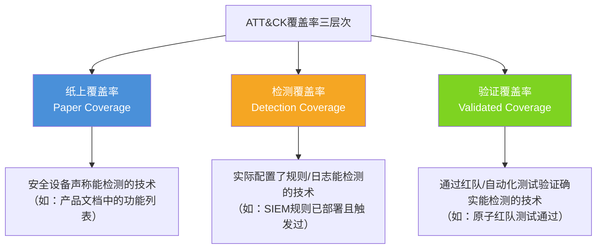
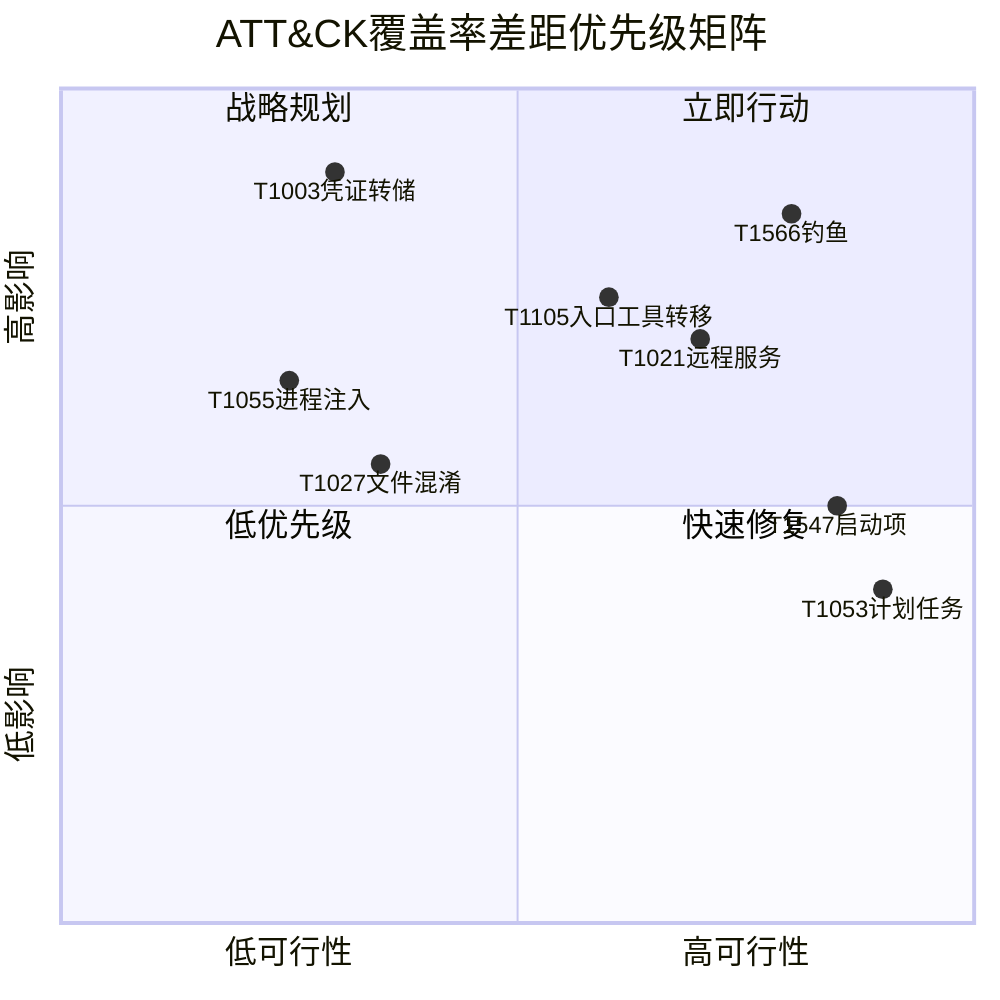
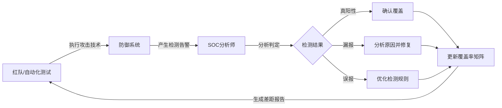

# ATT&CK覆盖率：度量、分析与持续提升

## 一、为什么ATT&CK覆盖率是安全团队的核心KPI

### 1.1 从"感觉安全"到"数据驱动安全"

传统安全运营中，团队往往依赖主观判断评估防御水平——"我们的防火墙很强大""我们装了EDR应该没问题"。这种模糊认知是安全事件频发的根源之一。MITRE ATT&CK框架将攻击者的战术（Tactics）、技术（Techniques）和子技术（Sub-techniques）标准化编号，使得安全团队可以用统一语言回答一个关键问题：**在已知的攻击路径中，我们能检测和防御多少？**

ATT&CK覆盖率（Coverage Rate）就是这个答案的量化表达：

```text
覆盖率 = 已验证覆盖的ATT&CK技术数 / 框架中适用的技术总数 × 100%
```

### 1.2 覆盖率的实际价值

| 价值维度 | 具体体现 |
|---------|---------|
| **风险量化** | 将模糊的安全感转化为可量化的风险指标，便于向管理层汇报 |
| **差距发现** | 明确识别防御盲区，知道哪些攻击路径完全不受监控 |
| **资源分配** | 优先将安全预算和技术投入到覆盖率最低的关键领域 |
| **红蓝对抗基准** | 为红队演练提供明确的"靶向清单"，避免重复验证已覆盖项 |
| **合规支撑** | NIST CSF、等保2.0等合规框架越来越要求基于ATT&CK的能力映射 |
| **进化追踪** | 持续衡量安全能力提升幅度，证明安全投入的ROI |

### 1.3 覆盖率的三个层次

ATT&CK覆盖率不是一个单一数字，而是分层递进的概念：



**纸上覆盖率**通常最高（60-80%），但水分最大；**检测覆盖率**是实际能力的真实反映（通常30-50%）；**验证覆盖率**是最严格的（通常15-35%），也是最值得信赖的指标。安全团队应该以验证覆盖率作为核心度量标准。

## 二、ATT&CK矩阵结构深度解析

### 2.1 框架全貌

截至2025年，MITRE ATT&CK框架覆盖以下规模：

| 类别 | 数量 | 说明 |
|------|------|------|
| **战术（Tactics）** | 14个 | 攻击者的"为什么"——攻击目的阶段 |
| **技术（Techniques）** | 200+ | 攻击者的"怎么做"——具体手段 |
| **子技术（Sub-techniques）** | 400+ | 技术的细分变体 |
| **总计数据点** | 750+ | 用于覆盖率计算的基础单元 |

### 2.2 14个战术阶段与典型技术数

| 阶段 | 战术名称 | 适用技术数 | 覆盖难度 |
|------|---------|-----------|---------|
| TA0043 | 侦察（Reconnaissance） | ~10 | 中等 |
| TA0042 | 资源开发（Resource Development） | ~8 | 较难 |
| TA0001 | 初始访问（Initial Access） | ~10 | 中等 |
| TA0002 | 执行（Execution） | ~14 | 较易 |
| TA0003 | 持久化（Persistence） | ~20 | 中等 |
| TA0004 | 权限提升（Privilege Escalation） | ~14 | 较难 |
| TA0005 | 防御规避（Defense Evasion） | ~42 | 最难 |
| TA0006 | 凭证访问（Credential Access） | ~17 | 中等 |
| TA0007 | 发现（Discovery） | ~31 | 较难 |
| TA0008 | 横向移动（Lateral Movement） | ~9 | 中等 |
| TA0009 | 收集（Collection） | ~17 | 中等 |
| TA0011 | 命令与控制（Command and Control） | ~16 | 较难 |
| TA0010 | 数据渗出（Exfiltration） | ~9 | 较易 |
| TA0040 | 影响（Impact） | ~14 | 较易 |

**关键洞察**：防御规避（Defense Evasion）拥有最多的子技术（42+），也是最难覆盖的阶段。攻击者在这个阶段投入了大量精力绕过检测，因此防御方需要投入不成比例的资源来建立有效覆盖。

## 三、覆盖率计算方法论

### 3.1 基础计算模型

#### 方法一：技术计数法（最直观）

```text
覆盖率 = 已覆盖技术数 / 适用技术总数 × 100%
```

**示例计算**：
- 适用技术总数：201（排除不适用的云专属技术、IoT专属技术等）
- 已验证覆盖技术数：67
- 基础覆盖率 = 67 / 201 × 100% = 33.3%

#### 方法二：加权评分法（更精确）

不同技术对业务的影响不同。核心业务系统遭受攻击与边缘系统遭受攻击的后果天差地别。加权模型引入了业务影响因子：

```text
加权覆盖率 = Σ(已覆盖技术 × 权重) / Σ(所有适用技术 × 权重) × 100%
```

权重维度参考：

| 权重维度 | 评分标准 | 影响范围 |
|---------|---------|---------|
| **业务关键性** | 1-5分（5=核心业务系统） | 该技术攻击目标的业务重要程度 |
| **威胁频率** | 1-5分（5=极高频出现） | 该技术在实际攻击中的使用频率 |
| **检测难度** | 1-5分（5=极难检测） | 该技术的隐蔽性和检测挑战 |
| **补救成本** | 1-5分（5=补救成本极高） | 被利用后恢复的难度和代价 |

**加权覆盖率计算示例**：

| 技术ID | 技术名称 | 权重 | 已覆盖 | 加权得分 |
|--------|---------|------|--------|---------|
| T1566 | 钓鱼攻击 | 5 | ✓ | 5 |
| T1059 | 命令行执行 | 4 | ✓ | 4 |
| T1003 | 凭证转储 | 5 | ✗ | 0 |
| T1053 | 计划任务 | 3 | ✓ | 3 |
| T1071 | Web协议C2 | 4 | ✗ | 0 |

- 加权覆盖率 = (5+4+3) / (5+4+5+3+4) × 100% = 12/21 × 100% = **57.1%**
- 简单计数覆盖率 = 3/5 × 100% = **60.0%**

两种方法得出不同结论——加权法揭示了：虽然技术层面覆盖了60%，但高权重技术的覆盖不足（T1003和T1071都是高权重但未覆盖），实际防御有效性更低。

#### 方法三：战术阶段覆盖率（宏观视角）

按14个战术阶段分别计算覆盖率，形成"雷达图"式的防御全景：

```text
战术覆盖率 = 该阶段已覆盖技术数 / 该阶段适用技术总数 × 100%
```

这种方式能直观展示防御能力在攻击链各阶段的分布是否均衡。典型的问题模式：

- **"头重脚轻"**：初始访问和执行阶段覆盖率高，但发现和横向移动阶段覆盖率低
- **"中间塌陷"**：权限提升和防御规避阶段覆盖率极低，因为这些阶段的技术最为隐蔽

### 3.2 覆盖率矩阵的构建步骤

**步骤一：确定适用范围**

并非所有ATT&CK技术都适用于每个组织。需要根据以下因素筛选适用技术：

1. **环境因素**：本地部署 vs 云环境 vs 混合环境
2. **技术栈因素**：Windows环境排除Linux专属技术，反之亦然
3. **业务因素**：无面向公众Web应用的排除相关技术
4. **行业因素**：金融行业特别关注某些特定技术

**步骤二：逐技术评估覆盖状态**

为每个适用技术标记覆盖状态：

| 状态 | 含义 | 判定标准 |
|------|------|---------|
| **已验证覆盖** | 检测能力已通过测试验证 | 红队测试/原子红队测试确认可检出 |
| **已部署检测** | 检测规则已上线但未验证 | SIEM规则/EDR策略已配置，日志源已接入 |
| **计划中** | 已识别差距并排入计划 | 有明确的实施时间表和负责人 |
| **不覆盖** | 经评估决定不投入资源 | 风险可接受或超出组织安全策略范围 |
| **未覆盖** | 尚未建立任何检测能力 | 无规则、无日志、无监控 |

**步骤三：生成覆盖率仪表板**

## 四、覆盖率测量工具与自动化

### 4.1 主流覆盖率测量平台

| 工具名称 | 类型 | 核心能力 | 适用场景 |
|---------|------|---------|---------|
| **ATT&CK Navigator** | 官方免费工具 | 热力图可视化、技术标注、多层对比 | 快速可视化、团队协作展示 |
| **MITRE D3FEND** | 官方知识库 | 防御技术与ATT&CK的映射关系 | 理解"用什么防御什么" |
| **Atomic Red Team** | 开源框架 | 500+原子测试用例覆盖ATT&CK技术 | 自动化验证覆盖率 |
| **MITRE Caldera** | 开源平台 | 自动化红队模拟+覆盖率追踪 | 持续性对抗验证 |
| **AttackIQ** | 商业平台 | 无损攻击模拟+合规报告 | 企业级持续验证 |
| **SafeBreach** | 商业平台 | 攻击模拟+数据流分析 | 大型企业、云环境 |
| **Picus Security** | 商业平台 | 虚拟补丁验证+控制有效性度量 | 安全控制有效性评估 |
| **Vectr** | 商业平台 | 安全运营成熟度追踪+基线对比 | 长期安全能力进化追踪 |

### 4.2 使用ATT&CK Navigator构建覆盖率矩阵

ATT&CK Navigator是最基础也是最常用的可视化工具。以下是实操步骤：

**步骤一：准备覆盖率数据文件（JSON格式）**

```json
{
  "name": "2025-Q2 Coverage Assessment",
  "versions": {
    "attack": "15",
    "navigator": "4.9.1"
  },
  "domain": "enterprise-attack",
  "techniques": [
    {
      "techniqueID": "T1566",
      "tactic": "initial-access",
      "color": "#7ed321",
      "comment": "已验证覆盖：邮件网关+EDR+安全意识培训",
      "enabled": true,
      "metadata": [
        { "key": "coverage_level", "value": "validated" },
        { "key": "last_test_date", "value": "2025-05-15" },
        { "key": "detection_sources", "value": "Exchange日志, EDR遥测" }
      ],
      "links": [],
      "showSubtechniques": true
    },
    {
      "techniqueID": "T1003",
      "tactic": "credential-access",
      "color": "#d0021b",
      "comment": "未覆盖：缺少LSASS内存保护和凭证转储检测规则",
      "enabled": true,
      "metadata": [
        { "key": "coverage_level", "value": "none" },
        { "key": "priority", "value": "critical" },
        { "key": "remediation_plan", "value": "Q3-2025: 部署LSASS保护+Sigma规则" }
      ]
    }
  ]
}
```

**步骤二：导入Navigator并创建多层视图**

推荐创建以下视图层级：

1. **基础层**：当前覆盖率状态（红/黄/绿三色标记）
2. **目标层**：12个月后的目标覆盖率
3. **差距层**：两层叠加对比，红色区域=优先改善项
4. **历史层**：与上季度覆盖率对比，展示变化趋势

**步骤三：定期更新与团队评审**

建议每季度执行一次完整的覆盖率评估，每月执行一次增量评估。

### 4.3 使用Atomic Red Team自动化验证

Atomic Red Team将ATT&CK技术转化为可执行的测试用例，是验证覆盖率的黄金标准：

**安装与基础使用**：

```powershell
# Windows环境
Install-Module -Name invoke-atomicredteam
Import-Module invoke-atomicredteam

# 安装所有测试用例
Install-AtomicRedTeam

# 执行单个技术的测试（以T1566钓鱼为例）
Invoke-AtomicTest T1566

# 执行测试并显示详细输出
Invoke-AtomicTest T1566 -ShowDetailsBrief

# 执行整个战术阶段的所有测试（如初始访问）
# 先列出该战术的所有技术
Invoke-AtomicTest T1566,T1059,T1053,T1021 -ShowDetailsBrief
```

```bash
# Linux环境使用Sliver框架集成
# 安装Atomic Red Team
sudo apt install -y atomic-red-team

# 使用MITRE Caldera自动化编排
# Caldera可以在C2框架中自动执行ATT&CK技术
# 并根据检测响应自动标记覆盖率
```

**构建自动化覆盖率验证流水线**：

```yaml
# .github/workflows/attack-coverage.yml
name: ATT&CK Coverage Verification
on:
  schedule:
    - cron: '0 2 * * 1'  # 每周一凌晨2点
  workflow_dispatch:

jobs:
  coverage-test:
    runs-on: ubuntu-latest
    strategy:
      matrix:
        tactic:
          - initial-access
          - execution
          - persistence
          - privilege-escalation
          - credential-access
    steps:
      - name: Checkout
        uses: actions/checkout@v4

      - name: Setup Atomic Red Team
        run: |
          sudo apt-get update
          sudo apt-get install -y docker.io
          git clone https://github.com/redcanaryco/atomic-red-team.git

      - name: Run Tests for Tactic
        run: |
          cd atomic-red-team
          ruby bin/execute-atomic-test.rb \
            --tactic ${{ matrix.tactic }} \
            --output json \
            --results-dir /tmp/results

      - name: Detect Results via SIEM
        run: |
          # 查询SIEM获取对应时间段的检测命中情况
          python scripts/check-detections.py \
            --results /tmp/results \
            --siem-url ${{ secrets.SIEM_URL }} \
            --output coverage-report.json

      - name: Upload Coverage Report
        uses: actions/upload-artifact@v4
        with:
          name: coverage-${{ matrix.tactic }}
          path: coverage-report.json
```

## 五、覆盖率分析框架

### 5.1 覆盖率差距分析模型

收集完覆盖率数据后，需要用结构化方法分析差距。推荐使用**"影响-可行性"四象限模型**：



**象限解读**：

| 象限 | 特征 | 策略 | 示例 |
|------|------|------|------|
| **立即行动** | 高影响+高可行性 | 下个冲刺周期立即实施 | T1566钓鱼检测、T1021远程服务检测 |
| **快速修复** | 低影响+高可行性 | 顺手解决，不投入专项资源 | T1053计划任务日志审计 |
| **战略规划** | 高影响+低可行性 | 纳入年度安全建设计划 | T1003凭证转储的全面防护 |
| **低优先级** | 低影响+低可行性 | 监控即可，不主动投入 | T1027文件混淆的部分变体 |

### 5.2 战术阶段热力分析

对14个战术阶段的覆盖率进行热力分析，识别防御薄弱环节：

```text
侦察(Reconnaissance):        ████████░░░░░░ 57% (8/14)  - 中等
资源开发(Resource Dev):       ████░░░░░░░░░░ 33% (4/12)  - 薄弱
初始访问(Initial Access):    ██████████░░░░ 71% (10/14) - 良好
执行(Execution):              ████████░░░░░░ 53% (8/15)  - 中等
持久化(Persistence):         ██████░░░░░░░░ 40% (8/20)  - 薄弱
权限提升(Priv. Escalation):  █████░░░░░░░░░ 36% (5/14)  - 薄弱
防御规避(Defense Evasion):    ███░░░░░░░░░░░ 20% (8/40)  - 严重不足
凭证访问(Cred. Access):      ██████░░░░░░░░ 41% (7/17)  - 薄弱
发现(Discovery):              ████████░░░░░░ 48% (15/31) - 中等
横向移动(Lateral Movement):  █████████░░░░░ 60% (6/10)  - 良好
收集(Collection):            ██████████░░░░ 65% (11/17) - 良好
命令与控制(C2):              ██████░░░░░░░░ 44% (7/16)  - 薄弱
数据渗出(Exfiltration):      █████████████░ 89% (8/9)   - 优秀
影响(Impact):                ████████████░░ 86% (12/14) - 优秀
```

**分析结论**：

1. **严重不足**：防御规避（20%）——这是最需要投入的领域。攻击者大量使用混淆、签名免杀、进程注入等技术，而检测能力严重不足
2. **需要关注**：权限提升（36%）、持久化（40%）、凭证访问（41%）、C2通信（44%）
3. **表现良好**：数据渗出（89%）、影响（86%）、初始访问（71%）
4. **关键洞察**：防御方在攻击链的"入口"和"出口"检测较好，但对攻击者在"内部"的活动检测严重不足——这意味着一旦攻击者突破初始防线，内部几乎没有有效监控

### 5.3 覆盖率趋势分析

覆盖率不是一次性快照，而是需要持续追踪的指标。建议建立以下趋势追踪机制：

```python
# coverage_tracker.py - 覆盖率趋势追踪脚本
import json
from datetime import datetime
from pathlib import Path

class CoverageTracker:
    def __init__(self, baseline_file="coverage_history.json"):
        self.baseline_file = Path(baseline_file)
        self.history = self._load_history()
    
    def _load_history(self):
        if self.baseline_file.exists():
            return json.loads(self.baseline_file.read_text())
        return {"assessments": []}
    
    def record_assessment(self, assessment_data):
        """记录一次覆盖率评估结果"""
        record = {
            "date": datetime.now().isoformat(),
            "total_applicable": assessment_data["total_applicable"],
            "validated_covered": assessment_data["validated_covered"],
            "deployed_covered": assessment_data["deployed_covered"],
            "coverage_rate_validated": round(
                assessment_data["validated_covered"] / 
                assessment_data["total_applicable"] * 100, 1
            ),
            "coverage_rate_deployed": round(
                assessment_data["deployed_covered"] / 
                assessment_data["total_applicable"] * 100, 1
            ),
            "tactic_breakdown": assessment_data.get("tactic_breakdown", {}),
            "newly_covered": assessment_data.get("newly_covered", []),
            "regressions": assessment_data.get("regressions", [])
        }
        self.history["assessments"].append(record)
        self._save_history()
        return record
    
    def generate_trend_report(self):
        """生成趋势报告"""
        if len(self.history["assessments"]) < 2:
            return "需要至少2次评估数据才能生成趋势报告"
        
        current = self.history["assessments"][-1]
        previous = self.history["assessments"][-2]
        
        delta_validated = (
            current["coverage_rate_validated"] - 
            previous["coverage_rate_validated"]
        )
        delta_deployed = (
            current["coverage_rate_deployed"] - 
            previous["coverage_rate_deployed"]
        )
        
        report = f"""
=== ATT&CK覆盖率趋势报告 ===
评估日期: {current['date']}
上次评估: {previous['date']}

【验证覆盖率】
  上次: {previous['coverage_rate_validated']}%
  本次: {current['coverage_rate_validated']}%
  变化: {'+'if delta_validated>=0 else ''}{delta_validated}%

【部署覆盖率】
  上次: {previous['coverage_rate_deployed']}%
  本次: {current['coverage_rate_deployed']}%
  变化: {'+'if delta_deployed>=0 else ''}{delta_deployed}%

【新增覆盖技术】 {len(current.get('newly_covered', []))} 项
"""
        for tech in current.get("newly_covered", []):
            report += f"  + {tech}\n"
        
        report += f"\n【覆盖回退技术】 {len(current.get('regressions', []))} 项\n"
        for tech in current.get("regressions", []):
            report += f"  - {tech}\n"
        
        return report
    
    def _save_history(self):
        self.baseline_file.write_text(
            json.dumps(self.history, indent=2, ensure_ascii=False)
        )
```

## 六、提升覆盖率的实战策略

### 6.1 分阶段提升路线图

根据组织的安全成熟度，推荐以下阶段性提升路径：

**第一阶段：基线建设（0-30%）——"先有再好"**

目标：实现对高频攻击技术的基本检测能力。

优先覆盖的技术（按实际攻击频率排序）：

| 优先级 | 技术ID | 技术名称 | 检测方法 | 预计耗时 |
|--------|--------|---------|---------|---------|
| P0 | T1566 | 钓鱼攻击 | 邮件安全网关+SPF/DKIM/DMARC | 1-2周 |
| P0 | T1059 | 命令行执行 | EDR进程监控+命令行日志 | 1周 |
| P0 | T1053 | 计划任务 | Windows安全日志TaskScheduler | 1周 |
| P1 | T1078 | 有效账户 | 登录审计+异常行为分析 | 2周 |
| P1 | T1021 | 远程服务 | 远程桌面日志+网络流量监控 | 2周 |
| P1 | T1048 | 非标准协议渗出 | 出站流量分析+DNS日志 | 2-3周 |
| P2 | T1055 | 进程注入 | EDR进程树监控+内存保护 | 2周 |
| P2 | T1547 | 启动项持久化 | 注册表监控+启动项审计 | 1-2周 |
| P2 | T1003 | 凭证转储 | LSASS保护+Sysmon事件10 | 2-3周 |

**第二阶段：深度检测（30-50%）——"检测质量提升"**

目标：对已覆盖技术提升检测质量（降低误报率、提高检测精度），同时扩展覆盖范围。

关键举措：

1. **Sigma规则批量部署**：Sigma社区维护了2000+开源检测规则，可以直接转换为Splunk/ELK/Sentinel等SIEM的查询语句
2. **日志源全面接入**：确保关键系统日志（Windows事件日志、Linux auditd、网络流量、DNS、代理日志）全部接入SIEM
3. **关联分析能力建设**：从单技术检测升级为多技术关联检测（如：发现+横向移动+凭证转储的关联告警）

```yaml
# Sigma规则批量转换示例
# 将Sigma规则转换为Splunk查询
sigma convert \
  --target splunk \
  --pipeline splunk_windows \
  --config sigma-cli/config.yml \
  --output splunk_rules/ \
  rules/

# 将Sigma规则转换为Elastic SIEM规则
sigma convert \
  --target elasticsearch \
  --pipeline elasticsearch_windows \
  --config sigma-cli/config.yml \
  --output elastic_rules/ \
  rules/
```

**第三阶段：验证驱动（50-70%）——"红蓝闭环"**

目标：通过持续性红蓝对抗验证检测能力，建立"检测→验证→优化"的闭环。

核心机制：



**第四阶段：领先覆盖（70%+）——"攻防前沿"**

目标：覆盖高级持续性威胁（APT）使用的冷门技术，实现近乎全面的攻击检测。

此阶段重点：

- 覆盖防御规避技术中的高级变体（如：进程空洞、间接系统调用、用户态钩子）
- 部署行为分析（UEBA）捕获纯特征码无法检测的异常行为
- 建立威胁狩猎（Threat Hunting）机制主动发现潜在威胁
- 实现攻击链级别的端到端检测（而非单点技术检测）

### 6.2 各战术阶段的关键检测技术

#### 初始访问阶段（TA0001）覆盖率提升

| 技术 | 检测方法 | 日志源 | Sigma规则参考 |
|------|---------|--------|--------------|
| T1566.001 附件钓鱼 | 邮件内容分析+沙箱 | 邮件网关日志 | win_susp_phishing_attachment.yml |
| T1566.002 链接钓鱼 | URL信誉+点击追踪 | 邮件网关+DNS | win_suspicious_url_click.yml |
| T1133 外部远程服务 | VPN/SSH登录审计 | VPN日志+auth.log | linux_suspicious_ssh_login.yml |
| T1078 有效账户 | 登录行为异常分析 | AD日志+Azure AD | win_suspicious_logon.yml |

#### 防御规避阶段（TA0005）覆盖率提升

| 技术 | 检测方法 | 日志源 | 难度评级 |
|------|---------|--------|---------|
| T1027 文件混淆 | 文件熵分析+特征码 | 文件监控 | ★★★★ |
| T1055 进程注入 | Sysmon进程树+内存事件 | Sysmon Event 8/10 | ★★★★ |
| T1056.001 键盘记录 | 输入设备监控 | EDR+驱动级监控 | ★★★★★ |
| T1070 清除日志 | 日志完整性监控 | 多源日志互校 | ★★★ |
| T1562.001 禁用/修改工具 | 安全工具进程监控 | EDR健康监控 | ★★★ |

**防御规避阶段的核心检测思路**：

1. **"不要相信终端"**：攻击者可能禁用或篡改终端检测工具，因此需要独立的日志校验机制（如：日志转发到远程SIEM后再分析）
2. **"监控监控者"**：监控安全工具本身的运行状态——如果某个EDR传感器突然停止上报，这本身就是严重的安全事件
3. **"关注异常而非特征"**：防御规避技术变体极多，与其穷举特征码，不如关注行为异常——比如一个普通用户突然执行了PowerShell并且使用了编码参数

#### 凭证访问阶段（TA0006）覆盖率提升

```text
凭证攻击检测能力矩阵：

技术              检测方法                    检测率目标   当前水平
─────────────────────────────────────────────────────────────
T1003.001 LSASS   Sysmon Event 10             95%         待评估
T1003.002 SAM     注册表访问监控              90%         待评估  
T1003.003 NTDS    DC日志+复制监控             85%         待评估
T1110 暴力破解    登录失败阈值+频率分析       98%         待评估
T1558 票据攻击    Kerberos服务票据监控       80%         待评估
T1555 凭证存储    密码管理器进程监控          70%         待评估
```

## 七、常见误区与最佳实践

### 7.1 五大常见误区

**误区一：覆盖率数字等于安全水平**

```text
❌ 错误认知：覆盖率达到60%就意味着60%的攻击能被检测到
✅ 正确认知：覆盖率只衡量"检测点的数量"，不衡量"检测的质量"
   - 一个覆盖率60%但误报率极低、响应时间<5分钟的系统，
     远比覆盖率80%但误报率>50%、响应时间>1小时的系统更安全
```

**误区二：只关注技术级覆盖，忽视战术级覆盖**

```text
❌ 错误认知：覆盖了50个技术就是50个技术的防护
✅ 正确认知：如果这50个技术都集中在执行和持久化阶段，
   而发现、横向移动、C2阶段几乎为零覆盖，
   攻击者突破防线后仍可畅通无阻
```

**误区三：把"部署了安全工具"等同于"建立了检测能力"**

```text
❌ 错误认知：部署了EDR就覆盖了EDR能检测的所有技术
✅ 正确认知：部署≠启用≠配置正确≠有效运行
   - EDR可能只启用了默认策略，未配置针对特定技术的规则
   - 日志源可能未正确接入
   - 告警可能被淹没在海量噪音中无人处理
```

**误区四：一次性评估后不再更新**

```text
❌ 错误认知：年初做了一次覆盖率评估就够了
✅ 正确认知：ATT&CK框架持续更新（每年新增10-20个技术/子技术），
   新攻击手法不断涌现，组织环境也在变化
   - 建议：季度全面评估 + 月度增量评估 + 实时技术更新监控
```

**误区五：忽略"覆盖率回退"现象**

```text
❌ 错误认知：覆盖率只会上升不会下降
✅ 正确认知：系统升级、规则迁移、人员变动都可能导致覆盖率回退
   - 某个检测规则因系统升级而失效
   - 安全人员离职导致无人维护的规则逐渐荒废
   - 需要建立覆盖率基线，每次评估时对比发现回退项
```

### 7.2 最佳实践清单

| 实践 | 具体做法 | 频率 |
|------|---------|------|
| **建立覆盖率基线** | 用ATT&CK Navigator建立初始覆盖率矩阵 | 年度 |
| **分层验证** | 纸面→部署→验证三层逐级确认 | 月度 |
| **自动化测试** | 使用Atomic Red Team/Caldera定期执行 | 周度 |
| **Sigma规则同步** | 定期拉取社区最新Sigma规则并部署 | 双周 |
| **威胁情报联动** | 根据最新威胁情报更新优先级 | 实时 |
| **覆盖率评审会** | 跨团队（SOC+红队+管理层）评审覆盖率报告 | 季度 |
| **差距根因分析** | 对每个"未覆盖"技术分析原因（技术难度/日志缺失/优先级） | 月度 |
| **覆盖率与KRI联动** | 将覆盖率指标纳入关键风险指标（KRI）体系 | 持续 |

## 八、覆盖率报告模板

### 8.1 执行摘要模板

```text
==========================================================
       ATT&CK覆盖率季度报告 - 2025年Q2
==========================================================

【总体覆盖率】
  验证覆盖率: 38.5% (78/203)  [↑3.2% vs Q1]
  部署覆盖率: 52.7% (107/203) [↑5.1% vs Q1]
  纸面覆盖率: 71.4% (145/203) [↑2.0% vs Q1]

【战术阶段覆盖率】
  最高覆盖率: 数据渗出 (92%) — 优秀
  最低覆盖率: 防御规避 (22%) — 需紧急提升
  提升最快:   权限提升 (+12.3% vs Q1)
  出现回退:   凭证访问 (-4.1% vs Q1, 原因: EDR升级导致规则失效)

【本季度新增覆盖】 +18项技术
  已验证: T1566.001, T1059.001, T1053.005, ...
  
【本季度回退】 -4项技术
  T1003.001, T1003.002, T1555.001, T1558.003
  原因: EDR版本升级后部分自定义规则需要重新适配

【下季度优先事项】
  1. [紧急] 修复凭证访问阶段的覆盖回退
  2. [高]    提升防御规避阶段覆盖率至35%
  3. [中]    部署Sigma规则库中47条新增规则
  4. [低]    完成云环境ATT&CK技术适用性评估

【风险评估】
  当前覆盖率对应的等效安全等级: C级
  目标安全等级: B级 (验证覆盖率≥50%)
  预计达成时间: 2025年Q4
==========================================================
```

### 8.2 技术级详细报告格式

| 技术ID | 技术名称 | 战术阶段 | 覆盖状态 | 检测源 | 最后验证日期 | 验证方式 | 备注 |
|--------|---------|---------|---------|--------|-------------|---------|------|
| T1566.001 | 附件钓鱼 | 初始访问 | 已验证 | 邮件网关+EDR | 2025-05-20 | Atomic测试 | — |
| T1003.001 | LSASS转储 | 凭证访问 | 未覆盖 | — | — | — | Q3计划部署 |
| T1059.001 | PowerShell | 执行 | 已部署 | Sysmon+SIEM | 2025-04-15 | 红队测试 | 误报率偏高需优化 |
| T1021.001 | RDP | 横向移动 | 已验证 | 网络流量+日志 | 2025-05-10 | 原子测试 | — |

## 九、进阶：覆盖率与安全运营成熟度

### 9.1 覆盖率与安全能力成熟度模型的映射

| 成熟度等级 | ATT&CK覆盖率特征 | 安全能力特征 |
|-----------|-----------------|-------------|
| **Level 1 初始级** | 覆盖率<15%，无系统化评估 | 依赖安全厂商默认配置，被动响应 |
| **Level 2 可重复级** | 覆盖率15-30%，有基础评估 | 已建立日志收集和基本告警机制 |
| **Level 3 已定义级** | 覆盖率30-50%，定期评估 | 有SIEM+EDR，Sigma规则库，定期红蓝对抗 |
| **Level 4 已管理级** | 覆盖率50-70%，自动化验证 | 自动化攻击模拟，持续改进闭环 |
| **Level 5 优化级** | 覆盖率>70%，威胁狩猎驱动 | 主动威胁狩猎，APT级检测，AI辅助分析 |

### 9.2 从覆盖率到检测工程

覆盖率的最终目标不是追求一个高数字，而是推动**检测工程（Detection Engineering）**能力的建设。检测工程是将安全检测从"拍脑袋写规则"提升为"系统化、可度量、可迭代"的工程学科。

检测工程的核心原则：

1. **一切检测皆代码**：Sigma规则版本化管理，检测逻辑可复现、可审计
2. **持续验证**：每个检测规则都有对应的测试用例和验证记录
3. **数据驱动优化**：根据检测效果数据（命中率、误报率、MTTD）持续调优
4. **知识共享**：检测规则跨团队共享，避免重复造轮子
5. **威胁情报驱动**：新的威胁情报自动触发检测规则更新

## 十、总结与行动清单

### 核心要点回顾

1. **覆盖率是安全团队最核心的KPI之一**，它将模糊的安全感转化为可量化的指标
2. **三层覆盖率**：纸上→部署→验证，验证覆盖率才是可信赖的指标
3. **加权评估**比简单计数更准确，因为不同技术对业务的影响不同
4. **防御规避阶段**是覆盖率提升的最大挑战，需要投入最多的资源
5. **"头重脚轻"是常见问题**——入口检测好但内部活动检测差
6. **覆盖率必须持续追踪**，季度评估+月度增量+实时更新
7. **覆盖率只是手段不是目的**——最终目标是建设系统化的检测工程能力

### 立即行动清单

| 行动 | 负责人 | 截止日期 | 优先级 |
|------|--------|---------|--------|
| 使用ATT&CK Navigator建立当前覆盖率基线 | 安全架构师 | 2周内 | P0 |
| 部署Atomic Red Team执行首轮自动化验证 | 安全工程师 | 3周内 | P0 |
| 识别覆盖率<30%的战术阶段并制定提升计划 | SOC负责人 | 1个月内 | P0 |
| 建立Sigma规则库并完成初步部署 | 检测工程师 | 2个月内 | P1 |
| 首次跨团队覆盖率评审会 | CISO | 1个月内 | P1 |
| 建立自动化覆盖率追踪流水线 | DevSecOps | 2个月内 | P2 |
