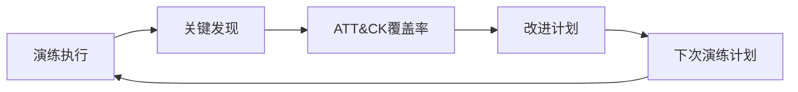
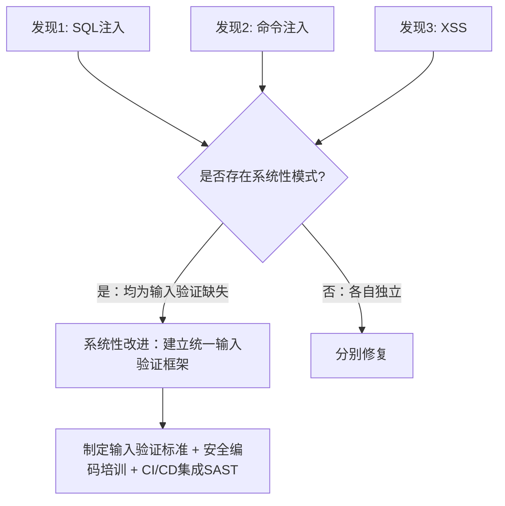
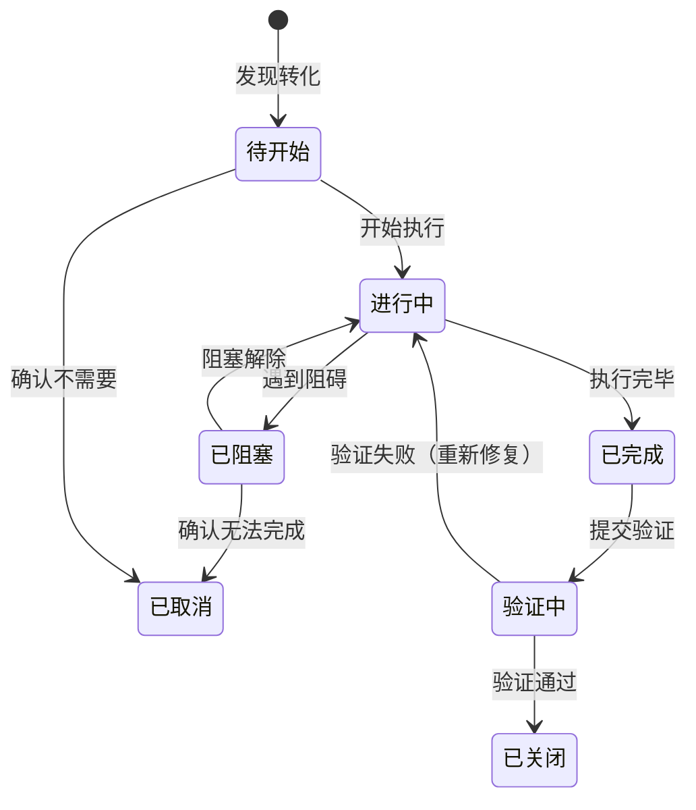
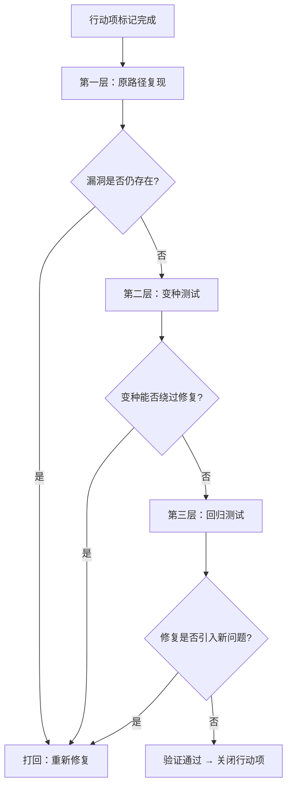

## 改进计划

在红队/紫队演练中，发现问题是起点，解决问题才是终点。**改进计划（Improvement Plan）** 是将演练中识别的关键发现转化为可追踪、可执行、可验证的安全提升行动的系统化框架。没有改进计划的演练，就像医生写了诊断报告却不开处方——检查做了，病还在。

本章从改进计划的定位与价值出发，系统讲解如何将发现转化为行动项、如何确定优先级、如何分配资源和责任、如何追踪进度直至闭环验证，涵盖从原始发现到最终验证的全流程方法论和实操模板。

---

## 一、改进计划的定位与价值

### 1.1 改进计划在演练生命周期中的位置



改进计划处于整个演练闭环的核心枢纽位置：

| 上游输入 | 改进计划的角色 | 下游输出 |
|----------|--------------|----------|
| 关键发现（第10章） | 将发现转化为可执行的行动项 | 分配给各团队的具体任务 |
| ATT&CK覆盖率（第11章） | 基于覆盖率缺口确定优先改进区域 | 下次演练的验证目标 |
| 复盘报告 | 从根因分析中提取系统性改进建议 | 组织层面的安全能力建设方向 |

### 1.2 为什么需要专门的改进计划

许多安全团队在演练后会口头讨论"下次要注意"，但缺乏系统化的改进机制。这种做法存在以下致命缺陷：

| 无改进计划的后果 | 有改进计划的效果 |
|-----------------|----------------|
| 发现项散落在邮件/聊天记录中，无人跟踪 | 所有行动项集中在统一平台，状态透明 |
| 优先级靠"谁嗓门大"决定 | 基于量化评分的客观优先级排序 |
| 修复责任不明确，互相推诿 | 每项行动有明确的负责人和截止日期 |
| 三个月后同一个问题再次出现 | 修复经过回归测试，闭环验证 |
| 管理层无法衡量安全投入的ROI | 用数据展示安全能力的持续提升 |

### 1.3 改进计划的核心原则

**原则一：从发现到行动的转化必须具体**
- ❌ "加强输入验证" — 太模糊，无法执行
- ✅ "在 login.php 中将字符串拼接替换为参数化查询，使用 PDO::prepare()，预计修改代码行数约 15 行，由开发团队张三负责，7月15日前完成" — 具体到可直接开工

**原则二：每项改进必须可验证**
- 改进完成后，必须有明确的验证标准和验证方式
- 验证标准可以是：漏洞无法复现、检测规则告警成功、配置审计通过

**原则三：优先级由风险驱动，不由便利性驱动**
- 容易修的不代表应该先修
- 风险最高的应该最先修，哪怕修复难度大

**原则四：改进计划是活文档，不是一次性交付物**
- 随着新发现、环境变化、优先级调整，计划需要持续更新
- 建议至少每两周回顾一次改进计划的状态

---

## 二、从发现到行动项的转化

### 2.1 发现分类与行动类型映射

不同类型的安全发现需要不同类型的改进行动：

| 发现类型 | 典型改进行动 | 负责方 | 时效要求 |
|----------|------------|--------|---------|
| 漏洞类发现（RCE、SQL注入、权限提升） | 代码修复 + 补丁部署 | 开发/运维 | P0: 24-72小时 |
| 配置缺陷（默认凭据、过度权限） | 配置基线修正 + 自动化合规检查 | 运维 | P0-P1: 1-7天 |
| 检测盲区（未知攻击无告警） | 新增检测规则（Sigma/SIEM） | 安全运营 | P1: 1-2周 |
| 响应延迟（MTTD/MTTR过长） | 优化告警分级 + 自动化响应流程 | 安全运营 + SOC | P1-P2: 2-4周 |
| 流程缺陷（无补丁管理、无账号审查） | 流程制度建设 + 工具化固化 | 安全管理 | P2: 1-3个月 |
| 架构弱点（网络分段缺失、信任域过大） | 架构重构方案 + 分阶段实施 | 架构 + 运维 | P2-P3: 1-6个月 |
| 人员能力不足（SOC分析员技能缺口） | 培训计划 + CTF/演练提升 | 安全管理 + HR | 持续 |

### 2.2 发现转化的 SMART 化处理

将每个发现转化为行动项时，必须经过 SMART 化处理。以一个具体例子说明：

**原始发现**：
> 红队通过 Mimikatz 成功转储了域控制器上的凭据，蓝队未检测到该行为。

**转化过程**：

| SMART 维度 | 处理 | 结果 |
|------------|------|------|
| **S - Specific** | 具体要做什么？ | 部署检测 Mimikatz 执行的 Sigma 规则到 SIEM，并在 EDR 中启用 Credential Dumping 检测策略 |
| **M - Measurable** | 怎么衡量完成？ | 规则部署后，使用 Atomic Red Team（T1003.001）验证能产生告警，且告警级别为 High |
| **A - Achievable** | 现有资源能做到吗？ | 需要：1名安全工程师 + SIEM编辑权限 + EDR策略管理权限。资源可满足 |
| **R - Relevant** | 与风险相关吗？ | 是。凭据转储是攻击链中关键一步，域管凭据泄露可导致全域沦陷 |
| **T - Time-bound** | 什么时候完成？ | 7月20日前完成规则部署和验证 |

**最终行动项**：

| 字段 | 内容 |
|------|------|
| 行动项 ID | IMP-2025-001 |
| 来源发现 | F-2025-003（Mimikatz凭据转储未检测） |
| 行动描述 | 部署 Mimikatz 检测规则至 SIEM + EDR 策略更新 |
| 负责人 | 安全工程师 李四 |
| 资源需求 | SIEM编辑权限、EDR策略管理权限、Atomic Red Team测试环境 |
| 优先级 | P0（24-72小时） |
| 截止日期 | 2025-07-20 |
| 验证方式 | Atomic Red Team T1003.001 测试，确认产生 High 级别告警 |
| 验证负责人 | 红队成员 王五 |
| 状态 | 待开始 |

### 2.3 从单点发现到系统性改进

有些发现反映的不是单点问题，而是系统性缺陷。识别系统性问题的方法是**模式分析**：



**系统性改进的识别信号**：

| 信号 | 举例 | 系统性改进方向 |
|------|------|--------------|
| 同类漏洞跨多个系统出现 | 3个不同系统都有SQL注入 | 建立安全编码标准 + SAST集成 |
| 多个发现指向同一根因 | 所有检测盲区都与日志不完整有关 | 实施日志标准化项目 |
| 多个发现与同一团队相关 | 所有配置缺陷都来自A运维团队 | 针对该团队的安全培训 + 自动化合规 |
| 漏洞修复后再次出现 | 补丁打了又出新变种 | 建立补丁管理流程 + 持续监控 |

---

## 三、优先级排序方法论

### 3.1 优先级排序的必要性

安全团队资源有限，不可能同时修复所有问题。科学的优先级排序确保有限资源投入到风险最高的地方。

**常见错误**：按发现的CVSS分数从高到低排序 → 忽略了上下文因素（可达性、资产价值、修复成本）。

### 3.2 加权优先级评分模型

推荐使用多维度加权评分模型，综合考虑技术风险和运营因素：

```text
优先级得分 = (技术严重性 × W1) + (业务影响 × W2) + (利用可能性 × W3)
           + (检测差距 × W4) + (修复可行性 × W5)

各维度评分：1-5 分
权重参考值：W1=0.30, W2=0.25, W3=0.20, W4=0.15, W5=0.10
```

| 维度 | 1分 | 2分 | 3分 | 4分 | 5分 |
|------|-----|-----|-----|-----|-----|
| 技术严重性 | 信息性/最佳实践 | 低危 | 中危 | 高危 | 严重（RCE/全域沦陷） |
| 业务影响 | 无直接影响 | 影响非核心功能 | 影响部分用户 | 影响核心业务 | 影响全部用户/合规违规 |
| 利用可能性 | 需极端条件 | 需特定配置 | 内网可达 | 公网可达 | 已有公开PoC/正在被利用 |
| 检测差距 | 已有完善检测 | 有检测但不精确 | 有部分检测 | 无检测但可实现 | 完全无法检测 |
| 修复可行性 | 需架构重构（>3月） | 需较大改动（1-3月） | 需中等改动（2-4周） | 需小改动（1周内） | 配置变更即可（1天内） |

**评分结果映射**：

| 加权得分 | 优先级 | 修复时限 | 典型行动 |
|----------|--------|---------|----------|
| 4.0 - 5.0 | P0 紧急 | 24-72小时 | 立即启动，暂停非关键工作 |
| 3.0 - 3.9 | P1 高 | 1-2周 | 列入本迭代必做项 |
| 2.0 - 2.9 | P2 中 | 1个月 | 列入下个迭代计划 |
| 1.0 - 1.9 | P3 低 | 3个月 | 列入季度规划 |
| < 1.0 | P4 观察 | 下次演练前 | 持续监控，视情况升级 |

### 3.3 优先级排序实操示例

以下是一次真实演练后发现的优先级排序：

| 发现 | 技术严重性(×0.30) | 业务影响(×0.25) | 利用可能性(×0.20) | 检测差距(×0.15) | 修复可行性(×0.10) | 加权得分 | 优先级 |
|------|-------------------|-----------------|-------------------|----------------|-------------------|----------|--------|
| 域控Golden Ticket攻击 | 5(1.50) | 5(1.25) | 4(0.80) | 5(0.75) | 2(0.20) | **4.50** | **P0** |
| 对公网RCE漏洞 | 5(1.50) | 4(1.00) | 5(1.00) | 4(0.60) | 3(0.30) | **4.40** | **P0** |
| 内网弱密码（admin/admin） | 3(0.90) | 3(0.75) | 4(0.80) | 3(0.45) | 5(0.50) | **3.40** | **P1** |
| 钓鱼邮件绕过网关 | 4(1.20) | 3(0.75) | 3(0.60) | 3(0.45) | 3(0.30) | **3.30** | **P1** |
| 内部Portal反射型XSS | 2(0.60) | 2(0.50) | 3(0.60) | 2(0.30) | 4(0.40) | **2.40** | **P2** |
| SSL配置不合规 | 2(0.60) | 1(0.25) | 2(0.40) | 1(0.15) | 5(0.50) | **1.90** | **P3** |

---

## 四、改进计划模板

### 4.1 完整改进计划模板

以下模板可直接复制使用：

```markdown
# 改进计划 - [演练名称/编号]

## 基本信息
- 演练日期：YYYY-MM-DD
- 计划制定人：[姓名]
- 制定日期：YYYY-MM-DD
- 上次计划回顾日期：YYYY-MM-DD
- 计划状态：[草稿/已批准/执行中/已完成]

## 执行摘要
| 指标 | 数值 |
|------|------|
| 总发现数 | XX |
| 转化为行动项数 | XX |
| P0 行动项 | XX 项 |
| P1 行动项 | XX 项 |
| P2 行动项 | XX 项 |
| P3 行动项 | XX 项 |
| 预计完成率 | XX% |

## 行动项清单

### P0 - 紧急（24-72小时）

| ID | 行动项 | 来源发现 | 负责人 | 截止日期 | 状态 | 验证方式 |
|----|--------|---------|--------|----------|------|----------|
| IMP-001 | [具体行动描述] | F-XXX | [姓名] | YYYY-MM-DD | 待开始 | [验证标准] |

### P1 - 高（1-2周）

| ID | 行动项 | 来源发现 | 负责人 | 截止日期 | 状态 | 验证方式 |
|----|--------|---------|--------|----------|------|----------|
| IMP-005 | [具体行动描述] | F-XXX | [姓名] | YYYY-MM-DD | 待开始 | [验证标准] |

### P2 - 中（1个月）

| ID | 行动项 | 来源发现 | 负责人 | 截止日期 | 状态 | 验证方式 |
|----|--------|---------|--------|----------|------|----------|
| IMP-010 | [具体行动描述] | F-XXX | [姓名] | YYYY-MM-DD | 待开始 | [验证标准] |

### P3 - 低（3个月）

| ID | 行动项 | 来源发现 | 负责人 | 截止日期 | 状态 | 验证方式 |
|----|--------|---------|--------|----------|------|----------|
| IMP-015 | [具体行动描述] | F-XXX | [姓名] | YYYY-MM-DD | 待开始 | [验证标准] |

## 系统性改进项

| ID | 改进项 | 涉及发现 | 负责团队 | 预计周期 | 状态 |
|----|--------|---------|---------|---------|------|
| SYS-001 | [系统性改进描述] | F-XXX, F-XXX, F-XXX | [团队] | X个月 | 待开始 |

## 进度追踪

### 本周进度更新
- 日期：YYYY-MM-DD
- 新增完成项：[列出]
- 新增启动项：[列出]
- 延期项及原因：[列出]
- 阻塞项：[列出]

### 里程碑
| 里程碑 | 目标日期 | 实际日期 | 状态 |
|--------|---------|---------|------|
| 所有 P0 项完成 | YYYY-MM-DD | - | 待开始 |
| 所有 P1 项完成 | YYYY-MM-DD | - | 待开始 |
| P0/P1 回归验证完成 | YYYY-MM-DD | - | 待开始 |
| 全部行动项关闭 | YYYY-MM-DD | - | 待开始 |

## 签批
- 安全负责人：____  日期：____
- CISO：____  日期：____
```

### 4.2 行动项状态定义

标准化的状态流转确保所有利益相关方对进度有一致理解：



| 状态 | 含义 | 责任人动作 |
|------|------|-----------|
| 待开始 | 行动项已分配，尚未启动 | 负责人确认资源和计划 |
| 进行中 | 正在执行修复/改进 | 定期更新进度 |
| 已阻塞 | 遇到外部依赖或资源不足 | 主动上报阻塞原因和需要的支持 |
| 已完成 | 修复/改进已实施完毕 | 提交验证请求 |
| 验证中 | 等待验证（通常由红队或QA执行） | 验证人安排测试 |
| 已关闭 | 验证通过，确认问题已解决 | 无需操作 |
| 已取消 | 经评估确认不需要修复 | 记录取消原因 |

---

## 五、改进计划的执行管理

### 5.1 例会机制

改进计划的执行需要制度化的跟进机制：

| 会议类型 | 频率 | 参与者 | 时长 | 核心议题 |
|----------|------|--------|------|----------|
| P0跟踪会 | 每日 | P0负责人 + 安全负责人 | 15分钟 | 进度、阻塞、资源需求 |
| 周进度会 | 每周 | 全部行动项负责人 + 安全团队 | 30-45分钟 | 整体进度、延期分析、优先级调整 |
| 月度回顾 | 每月 | 安全团队 + 管理层 | 1小时 | 里程碑达成、趋势分析、资源申请 |

**周进度会模板**：

```markdown
# 改进计划周进度会 - YYYY-MM-DD

## 本周完成
- IMP-001: Mimikatz检测规则已部署，Atomic Red Team验证通过 ✅
- IMP-003: 弱密码已强制重置 ✅

## 进行中
- IMP-002: SQL注入修复（进度60%，预计下周完成）
- IMP-005: 钓鱼网关规则优化（进度30%）

## 延期
- IMP-004: 网络分段重构 → 原因：需要架构团队配合，排期冲突
  - 行动：安全负责人已与架构团队主管沟通，下周一启动

## 阻塞
- IMP-007: EDR策略更新 → 原因：EDR厂商需协助定制规则
  - 行动：已提交厂商工单，等待响应

## 新增/调整
- IMP-020: 新增（来源：本周漏洞扫描发现的新问题）
- IMP-008 优先级调整：P2 → P1（原因：相关漏洞在野外被利用）

## 数据看板
| 指标 | 本周 | 上周 | 趋势 |
|------|------|------|------|
| 总行动项 | 25 | 25 | - |
| 已关闭 | 12 (48%) | 8 (32%) | ↑ |
| 进行中 | 8 (32%) | 10 (40%) | ↑ |
| 已延期 | 3 (12%) | 4 (16%) | ↑ |
| 已阻塞 | 2 (8%) | 3 (12%) | ↑ |
```

### 5.2 阻塞项处理机制

阻塞是改进计划执行中的最大风险。建立快速响应机制：

| 阻塞类型 | 典型场景 | 升级路径 |
|----------|---------|----------|
| 资源不足 | 修复需要开发团队支持，但开发已满负荷 | 安全负责人 → CTO 协调资源 |
| 技术依赖 | 需要厂商提供补丁或规则 | 安全团队 → 采购/合同团队催促 |
| 跨团队协调 | 架构重构需要多团队配合 | 安全负责人 → 联合会议 + 管理层背书 |
| 权限不足 | 修复操作需要更高权限 | 直接向权限管理员申请 |

**阻塞项跟踪表**：

| 阻塞ID | 关联行动项 | 阻塞原因 | 阻塞开始日期 | 升级动作 | 预计解除日期 |
|--------|-----------|---------|-------------|----------|-------------|
| BLK-001 | IMP-004 | 架构团队排期冲突 | 07-10 | 管理层协调 | 07-22 |
| BLK-002 | IMP-007 | 厂商工单响应慢 | 07-12 | 合同升级 | 07-25 |

### 5.3 优先级动态调整

改进计划不是刻在石头上的，需要根据情况变化动态调整：

**触发优先级上调的因素**：
- 相关漏洞在公网/暗网被公开利用（从P2调为P0/P1）
- 相关系统资产价值提升（如即将上线核心业务）
- 新威胁情报表明攻击手法正在活跃

**触发优先级下调的因素**：
- 系统即将下线/退役
- 可通过网络层控制有效缓解（如临时ACL规则）
- 经评估实际可达性低于初始判断

**调整流程**：任何优先级调整都需要记录调整原因、审批人和生效日期，避免随意变更。

---

## 六、验证与闭环

### 6.1 验证的三层体系

改进完成后必须经过严格验证，确认问题确实被解决且未引入新问题：



| 验证层级 | 目的 | 方法 | 执行人 |
|----------|------|------|--------|
| 原路径复现 | 确认原始漏洞已修复 | 使用完全相同的PoC重新执行 | 红队/QA |
| 变种测试 | 确认修复不是"只堵了一个洞" | 使用编码变体、不同注入点、绕过技巧 | 红队 |
| 回归测试 | 确认修复未引入新问题 | 对受影响系统的功能测试 + 安全扫描 | 开发/QA |

### 6.2 验证报告模板

```markdown
# 验证报告

## 行动项信息
- 行动项 ID：IMP-XXX
- 行动项描述：[简述]
- 验证日期：YYYY-MM-DD
- 验证人：[姓名]

## 第一层：原路径复现
- 测试方法：[具体PoC或测试步骤]
- 预期结果：[漏洞不再存在]
- 实际结果：[通过/未通过]
- 证据：[截图/日志/命令输出]

## 第二层：变种测试
| 变种编号 | 变种描述 | 测试结果 |
|----------|---------|----------|
| V1 | [编码绕过] | 通过 |
| V2 | [不同注入点] | 通过 |
| V3 | [参数变形] | 通过 |

## 第三层：回归测试
- 功能回归：[受影响功能是否正常]
- 安全扫描：[是否引入新漏洞]
- 性能影响：[修复是否影响系统性能]

## 验证结论
- [ ] 通过 — 问题已解决，无副作用
- [ ] 部分通过 — 主问题已解决，但存在变种绕过（需补充修复）
- [ ] 未通过 — 问题仍然存在（需重新修复）

## 备注
[如有特殊情况需说明]
```

### 6.3 验证失败的处理

当验证失败时，不应简单地"再修一次"，而应分析失败原因：

| 失败原因 | 处理方式 | 是否需要重新评估优先级 |
|----------|---------|---------------------|
| 修复不完整（只修了表面） | 返回根因分析，重新制定修复方案 | 否，保持原优先级 |
| 修复引入新问题 | 回滚修复，重新设计方案 | 是，新问题单独评估 |
| 修复被绕过 | 研究绕过方式，补充加固 | 可能上调（绕过方式是否更易利用） |
| 环境差异导致修复不生效 | 确认所有环境已同步修复 | 否 |

---

## 七、系统性改进的推进

### 7.1 识别系统性问题

系统性问题不是单个漏洞，而是导致多个漏洞反复出现的根本原因。识别系统性问题的方法：

| 识别维度 | 问什么 | 系统性问题信号 |
|----------|--------|--------------|
| 跨时间 | 同类问题是否反复出现？ | 是 → 流程或培训缺失 |
| 跨系统 | 同类问题是否跨多个系统出现？ | 是 → 缺乏统一标准或框架 |
| 跨团队 | 同类问题是否集中在某个团队？ | 是 → 该团队安全意识或技能不足 |
| 跨类型 | 不同类型问题是否有共同根因？ | 是 → 架构或治理层面有缺陷 |

### 7.2 常见系统性改进项目

| 系统性问题 | 改进项目 | 预期效果 | 典型周期 |
|-----------|---------|----------|---------|
| 输入验证不统一 | 建立安全编码标准 + 输入验证框架 | 从源头减少注入类漏洞 | 2-3个月 |
| 日志不完整 | 实施日志标准化项目（覆盖所有关键系统） | 提升检测覆盖率和取证能力 | 1-2个月 |
| 补丁管理混乱 | 建立补丁管理流程 + 自动化部署管线 | 减少已知漏洞的暴露时间 | 2-3个月 |
| 权限管理混乱 | 实施最小权限原则 + 权限审查自动化 | 降低横向移动和权限提升风险 | 3-6个月 |
| 安全意识薄弱 | 建立全员安全培训体系 + 钓鱼演练常态化 | 降低社会工程攻击成功率 | 持续 |
| 安全检测碎片化 | 统一SIEM平台 + 标准化检测规则库 | 提升检测效率和覆盖率 | 3-6个月 |

### 7.3 系统性改进的推进策略

系统性改进往往涉及跨部门协作，推进难度远高于单点修复。以下策略可帮助成功推进：

**策略一：用数据说服管理层**
- 用演练数据展示：过去N次演练中，同类问题出现了M次，累计修复成本为X人天
- 对比行业数据：同类问题导致的平均数据泄露成本为Y万元
- 展示ROI：投入Z人天建立框架，可预期减少N次修复，节省N×Z人天

**策略二：分阶段实施**
```text
阶段1（1个月）：调研现状 + 制定方案
阶段2（2个月）：核心系统试点
阶段3（3个月）：全量推广
阶段4（持续）：监控和持续优化
```

**策略三：与现有流程集成**
- 不要创建独立的"安全项目"，而是嵌入现有的开发流程（如CI/CD集成SAST）
- 利用现有的运维工具（如Ansible）实现配置基线自动化

---

## 八、改进计划的度量与汇报

### 8.1 核心度量指标

| 指标 | 定义 | 计算方式 | 目标值 |
|------|------|----------|--------|
| 行动项完成率 | 已关闭行动项占总数的比例 | 已关闭数 / 总数 × 100% | ≥ 90% |
| 按时完成率 | 在截止日期前完成的行动项比例 | 按时完成数 / 已完成数 × 100% | ≥ 80% |
| 平均修复周期 | 从发现确认到验证关闭的平均天数 | Σ(关闭日期 - 确认日期) / 已关闭数 | P0≤3天, P1≤14天 |
| 阻塞率 | 被阻塞的行动项比例 | 阻塞数 / 总进行中数 × 100% | ≤ 10% |
| 验证通过率 | 一次验证通过的行动项比例 | 一次通过数 / 已验证数 × 100% | ≥ 85% |
| 重复发现率 | 上次已修复的问题再次出现的比例 | 重复发现数 / 上次总发现数 × 100% | ≤ 5% |

### 8.2 管理层汇报模板

向管理层汇报改进计划进展时，应聚焦业务视角而非技术细节：

```markdown
# 安全改进计划进展汇报 - YYYY年MM月

## 一、总体进展
- 演练发现总数：30项
- 已完成改进：22项（73%）
- 进行中：6项（20%）
- 延期/阻塞：2项（7%）
- 预计全部完成时间：YYYY-MM-DD

## 二、关键成果
1. 公网RCE漏洞已在48小时内修复 ✅
2. 域控凭据防护已加固，检测规则覆盖率达到85% ✅
3. 强制密码策略已实施，弱密码问题减少90% ✅

## 三、风险状态
- 🔴 高风险遗留：0项（已全部关闭）
- 🟡 中风险遗留：2项（网络分段重构，预计8月完成）
- 🟢 低风险遗留：6项（已制定计划，按期推进）

## 四、投入与产出
- 安全团队投入：约XX人天
- 开发团队投入：约XX人天
- 预期效果：下次演练检测覆盖率预计从65%提升至85%

## 五、需要的支持
1. 架构团队支持网络分段重构（已与CTO沟通）
2. 下季度安全培训预算审批（¥XX万）
```

### 8.3 趋势分析

持续追踪改进指标的变化趋势，用以评估安全能力建设效果：

| 指标 | Q1 | Q2 | Q3 | Q4 | 趋势 |
|------|----|----|----|----|------|
| 发现总数 | 45 | 30 | 22 | 18 | 持续下降 ↓ |
| P0发现数 | 8 | 5 | 3 | 1 | 持续下降 ↓ |
| 平均修复周期(天) | 14 | 8 | 5 | 3 | 持续缩短 ↓ |
| 重复发现率 | 35% | 20% | 10% | 5% | 持续下降 ↓ |
| 检测覆盖率 | 55% | 65% | 78% | 85% | 持续提升 ↑ |

---

## 九、常见误区与纠正

| 误区 | 问题 | 正确做法 |
|------|------|---------|
| 发现越多越好 | 为了"发现数量"刻意放大问题，把最佳实践建议包装成漏洞 | 聚焦真正的安全风险，区分"必须修"和"建议优化" |
| 改进计划=修复清单 | 只关注技术修复，忽视流程和人员层面的改进 | 技术、流程、人员三个维度同步推进 |
| 一次性改进 | 演练后集中修复，之后无人跟进 | 建立持续的跟踪机制，定期回顾和更新 |
| 只修不验 | 开发说修了就信，不做回归验证 | 红队/独立验证人必须复核，使用自动化工具辅助验证 |
| 闭门造车 | 安全团队独自制定改进计划，不与开发/运维沟通 | 所有相关方参与改进计划的制定和评审 |
| 只看短期 | 只修复当前发现的漏洞，不做系统性改进 | 70%资源用于短期修复，30%用于系统性建设 |
| 重修复轻预防 | 反复修同样的问题，不投入预防措施 | 对重复出现的问题必须启动系统性改进项目 |
| 忽视已完成项 | 改进计划只追踪未完成项，已完成项缺乏归档 | 已关闭项保留完整记录（发现→修复→验证全流程），供后续演练参考 |

---

## 十、工具与平台推荐

### 10.1 改进计划管理工具

| 工具类型 | 推荐工具 | 适用场景 | 优劣势 |
|----------|---------|----------|--------|
| 通用项目管理 | Jira、Azure DevOps | 已有企业许可证，与现有ITSM集成 | 灵活但需定制工作流 |
| 轻量级看板 | Trello、飞书多维表格 | 小团队、快速上手 | 简单但功能有限 |
| 专用安全平台 | DefectDojo、Archery | 安全发现全生命周期管理 | 安全专用但学习成本高 |
| 开源方案 | DefectDojo（开源版）、Faraday | 预算有限的团队 | 免费但需自行维护 |

### 10.2 推荐的工作流配置

以 Jira 为例的安全改进计划工作流：

```text
发现导入 → 评审排期 → 待开始 → 进行中 → 已完成 → 验证中 → 已关闭
                                          ↓
                                      已阻塞（备注原因）
                                          ↓
                                    回到"进行中"或"已取消"
```

自定义字段配置：
- **发现等级**（下拉）：Critical / High / Medium / Low / Info
- **来源演练**（文本）：关联到具体的演练编号
- **验证方式**（下拉）：原路径复现 / 变种测试 / 自动化扫描 / 配置审计
- **验证人**（用户）：指定验证责任人
- **CVSS评分**（数字）：基础评分参考

### 10.3 自动化辅助

| 自动化能力 | 实现方式 | 价值 |
|-----------|---------|------|
| 发现自动导入 | 从扫描工具（Nessus/Burp）API批量导入发现 | 减少手工录入 |
| 截止日期提醒 | Jira自动化规则 / 定时脚本 | 防止遗忘 |
| 进度自动汇总 | 脚本统计各状态行动项数量 | 减少手工统计 |
| 验证自动化 | Atomic Red Team脚本自动验证修复 | 提升验证效率和一致性 |
| 周报自动生成 | 脚本读取Jira数据生成报告 | 减少手工汇报 |

---

## 总结

一份高质量的改进计划需要做到**五个闭环**：

1. **发现→行动闭环** — 每个发现都有对应的、SMART化的行动项，不遗漏
2. **行动→验证闭环** — 每个行动项完成后都经过独立验证，不盲信
3. **验证→归档闭环** — 验证结果完整记录，供后续演练和审计参考
4. **短期→长期闭环** — 70%资源修当下问题，30%投入系统性改进，防止问题复发
5. **执行→度量闭环** — 用数据追踪改进效果，用趋势证明安全投入的价值

改进计划的本质是**将安全从被动响应转变为主动建设**。当你的改进计划从"灭火式修复"进化为"系统性能力提升"时，组织的安全成熟度就已经迈上了一个新台阶。记住：演练发现的价值不在于发现了多少问题，而在于解决了多少问题。
