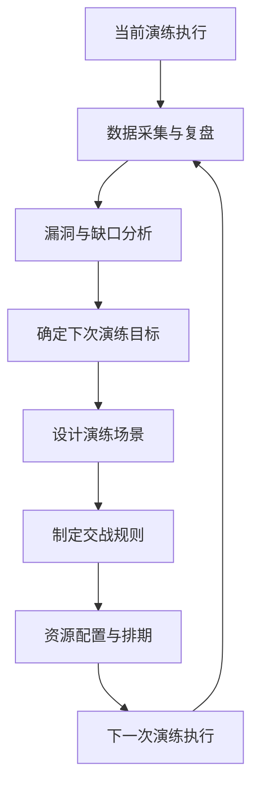
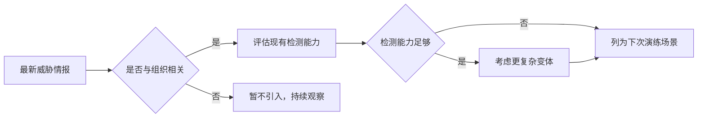

## 下次演练计划

网络安全演练（Drill / Exercise）是检验防守体系、锤炼应急能力、发现隐蔽漏洞的最高效手段。然而，许多团队做完一次演练后就陷入"演练完就忘、下次重来"的怪圈。**真正有价值的是基于本次演练的复盘结论，系统性地规划下一次演练**，让每一次对抗都比上一次更深入、更全面、更具实战价值。

本章提供从复盘分析到计划落地的完整方法论，包含可直接使用的模板、评分体系和决策框架。

---

## 一、演练生命周期概览

一次完整的网络安全演练并非孤立事件，而是持续改进循环中的一个环节。



**核心思想**：每一次演练的输出就是下一次演练的输入。计划不是从零开始，而是在已有基础上迭代升级。

---

## 二、复盘分析 —— 计划的第一输入

在下一次演练计划动笔之前，必须完成对**当前（或最近一次）演练的全面复盘**。没有复盘的计划是盲目的。

### 2.1 数据采集清单

| 数据类型 | 来源 | 用途 |
|---|---|---|
| 红队攻击路径日志 | C2服务器、渗透测试报告 | 分析攻击手法有效性，识别蓝队漏检节点 |
| 蓝队检测时间线 | SIEM、EDR告警日志 | 计算检测延迟（Detection Latency） |
| 响应动作记录 | SOAR、工单系统、聊天记录 | 评估响应流程效率、沟通质量 |
| 误报/漏报统计 | SOC分析员手动标记 | 量化检测规则的精度和召回率 |
| 资产覆盖清单 | CMDB、资产扫描结果 | 识别未被测试的资产范围 |
| 人员参与记录 | 排班表、演练签到 | 确认关键角色是否到位，轮值覆盖是否充分 |

### 2.2 定量评估指标

建议使用以下核心指标量化演练成效：

| 指标 | 定义 | 目标值参考 |
|---|---|---|
| **检测覆盖率** | 红队攻击步骤中被蓝队发现的比例 | ≥ 80% |
| **平均检测时间 (MTTD)** | 从攻击发生到首次告警的平均时长 | ≤ 30 分钟 |
| **平均响应时间 (MTTR)** | 从告警到阻断/缓解的平均时长 | ≤ 60 分钟 |
| **误报率** | 被人工标记为误报的告警占比 | ≤ 15% |
| **资产覆盖率** | 被演练覆盖的资产占全部关键资产的比例 | ≥ 90% |
| **场景完成率** | 实际执行的演练场景占计划场景的比例 | ≥ 95% |

### 2.3 定性复盘方法

**5 Whys 根因分析法**：对每个关键失败点追问五次"为什么"。

> **示例**：蓝队未检测到横向移动
> 1. 为什么未检测到？→ 没有针对性告警规则
> 2. 为什么没有规则？→ 该攻击手法未被纳入检测范围
> 3. 为什么未被纳入？→ 威胁情报更新滞后
> 4. 为什么滞后？→ 威胁情报订阅周期为季度，已过时3个月
> 5. 为什么周期这么长？→ 采购流程限制，需改为月度自动更新

**STAR 回顾法**（Situation-Task-Action-Result）：对每个关键事件记录背景→任务→行动→结果，形成结构化复盘日志。

### 2.4 复盘输出文档模板

每次复盘后生成一份标准化文档，包含以下五部分：

1. **演练概要**：日期、时长、参与角色、范围
2. **关键数据**：MTTD/MTTR/覆盖率的汇总表
3. **发现总结**：Top 5 漏洞 + Top 5 流程缺口
4. **成功经验**：本次演练中做得好的方面（值得保持）
5. **改进清单**：按优先级排列的下次需改进事项

---

## 三、确定下次演练目标

基于复盘结论，从以下三个维度确定目标：

### 3.1 弥补覆盖缺口

如果本次演练暴露出某些资产、攻击面或场景未被覆盖，下次应优先补齐。

**常见缺口类型**：

| 缺口类型 | 示例 | 下次目标 |
|---|---|---|
| 资产缺口 | 云环境容器集群未被测试 | 新增容器逃逸攻击场景 |
| 手法缺口 | 所有攻击均基于已知漏洞，未测试零日场景 | 引入模拟零日攻击 |
| 阶段缺口 | 仅测试了初始入侵，未测试横向移动 | 扩展至整个攻击链 |
| 人员缺口 | 仅测试了日班SOC团队 | 增加夜班/周末演练轮次 |

### 3.2 提升检测深度

如果本次演练中蓝队已能检测到大部分攻击，但响应速度和精度不足，下次应聚焦于**加速和精准化**。

**进阶路径**：

```text
基础检测（能否发现）→ 精准检测（是否误报少）
→ 快速检测（多快发现）→ 自动化响应（多快阻断）
```

每完成一级，下次向下一级推进。

### 3.3 引入新威胁场景

威胁态势不断演变，演练场景必须与时俱进。以下是为下次演练引入新场景的决策框架：



### 3.4 SMART 目标设定

每个目标必须符合 SMART 原则：

| 维度 | 要求 | 示例 |
|---|---|---|
| S - Specific（具体） | 明确场景、手法、资产 | 在云环境执行一次容器逃逸攻击 |
| M - Measurable（可衡量） | 有量化指标 | MTTD ≤ 20 分钟 |
| A - Achievable（可实现） | 在现有资源范围内 | 使用已有C2框架，不采购新工具 |
| R - Relevant（相关） | 与业务风险对齐 | 针对核心支付系统的攻击路径 |
| T - Time-bound（有时限） | 有明确的截止日期 | 在下次季度演练中完成 |

---

## 四、设计演练场景

场景设计是演练计划的核心环节。一个好的场景应该具备**真实性、渐进性、可控性**。

### 4.1 场景设计框架

使用 **Kill Chain 映射法**：将攻击场景映射到 Cyber Kill Chain 的各个阶段，确保覆盖完整的攻击生命周期。

| 阶段 | 关键问题 | 每个阶段至少设计1-2个TTP |
|---|---|---|
| 侦察 | 攻击者如何收集目标信息？ | OSINT、端口扫描、目录爆破 |
| 武器化 | 使用什么载荷？ | 文档宏、钓鱼链接、恶意软件 |
| 投递 | 如何将载荷送达？ | 钓鱼邮件、U盘丢弃、水坑攻击 |
| 利用 | 利用什么漏洞执行？ | CVE漏洞、配置缺陷、弱口令 |
| 安装 | 如何持久化？ | 计划任务、注册表、服务安装 |
| C2 | 如何控制失陷主机？ | HTTPS隧道、DNS隧道、域名轮换 |
| 目标达成 | 最终目标是什么？ | 数据窃取、勒索部署、权限维持 |

### 4.2 场景难度分级

| 难度级别 | 适合阶段 | 特点 | 红队限制条件 |
|---|---|---|---|
| L1 - 基础 | 新团队/首次演练 | 单一步骤，预设路径，提前告知蓝队 | 使用常见手法，不加混淆 |
| L2 - 中等 | 常规季度演练 | 多步骤攻击链，允许有限混淆 | 限制在指定目标范围内 |
| L3 - 进阶 | 成熟团队/年度大型演练 | 真实APT手法，完全混淆，不预先通知 | 无限制，但不影响生产 |
| L4 - 极限 | 高级红队对抗蓝队精英 | 0day/1day武器化，社会工程组合 | 需单独签署免责协议 |

### 4.3 场景模板

```text
场景名称：[填写]
难度级别：[L1/L2/L3/L4]
对应威胁类型：[APTxx / 勒索软件 / 内部威胁 / ...]
攻击链覆盖：侦察 → 投递 → 利用 → 安装 → C2 → 目标达成
具体TTP（每阶段一个）：
  - T1592：收集目标硬件信息
  - T1566：鱼叉式钓鱼附件
  - T1203：Office漏洞利用
  - T1053：创建计划任务持久化
  - T1071：HTTPS协议的C2通信
  - T1485：数据销毁（模拟）
成功判定标准：
  - 红队：完成全部6个阶段且蓝队未在阶段3之前拦截
  - 蓝队：在阶段3之前至少触发一次有效告警
```

### 4.4 场景数量建议

| 演练类型 | 建议场景数量 | 说明 |
|---|---|---|
| 月度小规模 | 1-2个 | 聚焦单一攻击面 |
| 季度常规 | 3-5个 | 覆盖主要威胁路径 |
| 年度大型 | 8-12个 | 全场景、全团队、全资产覆盖 |

---

## 五、制定交战规则（Rules of Engagement）

交战规则是红队行动的法律边界和操作规范，必须在演练开始前形成书面文件并由双方签字确认。

### 5.1 交战规则核心内容

| 项目 | 内容要求 | 示例 |
|---|---|---|
| 允许目标 | 明确允许测试的IP范围、域名、系统 | 10.0.0.0/8, *.test.example.com |
| 禁止目标 | 明确禁止触碰的生产系统 | 生产数据库服务器、PII存储系统 |
| 允许手法 | 列出允许的攻击技术 | Web漏洞利用、钓鱼（白名单批准） |
| 禁止手法 | 明确禁止的破坏性操作 | SQL注入删除数据、DDOS、暴力破解SSH |
| 时间窗口 | 演练的起止时间 | 2026-07-15 09:00 ~ 2026-07-16 18:00 |
| 白名单IP | 红队需要加入白名单的IP/C2地址 | 203.0.113.0/24 |
| 停止条件 | 触发立即停止演练的条件 | 误伤生产系统、检测到真实攻击者 |
| 沟通渠道 | 演练期间的应急联系人和通道 | 红队负责人：+86-XXX, 蓝队负责人：+86-XXX |

### 5.2 安全阀机制

设计三层安全阀：

1. **黄牌警告**：红队轻微违规（如超出时间5分钟），蓝队记录但不停止
2. **橙牌暂停**：红队中度违规或发现疑似真实攻击，暂停演练并调查
3. **红牌终止**：误伤生产系统、数据泄露风险、有人身安全风险，立即终止演练

### 5.3 交战规则模板（简化版）

```text
===== 演练交战规则 =====
1. 范围
   - 允许：10.0.0.0/8 中的所有非生产服务器
   - 禁止：10.0.0.0/8 中标记为 "prod-*" 的任何系统
2. 手法
   - 允许：所有MITRE ATT&CK Enterprise v14 中的技术（除禁止项）
   - 禁止：T1485（数据销毁）、T1490（备份删除）、T1499（资源耗尽）
3. 时间
   - 窗口：2026-07-15 09:00 CST ~ 2026-07-16 18:00 CST
4. 停止条件
   - 误伤生产系统、造成实际业务中断、发现环境外真实攻击者
5. 批准人
   - 红队负责人签名：____  蓝队负责人签名：____  CISO签名：____
```

---

## 六、资源配置与排期

### 6.1 人员配置

| 角色 | 数量建议 | 职责 |
|---|---|---|
| 红队负责人 | 1人 | 场景设计、攻击执行统筹 |
| 红队成员 | 2-4人 | 执行攻击操作（可分组并行） |
| 蓝队负责人 | 1人 | 防御组织、响应急调 |
| SOC值班 | 按正常排班 | 日常监控和告警处理（可在演练前被告知或不告知） |
| 紫队观察员 | 1-2人 | 实时记录双方动作、协调争议 |
| 演练总指挥 | 1人 | 整体掌控、决定是否触发停止条件 |
| 业务观察员 | 按需 | 来自被测试系统的业务方代表 |

### 6.2 时间排期模板

| 时间节点 | 事项 | 负责人 |
|---|---|---|
| 演练前4周 | 确定目标和场景 | 红队负责人 + 蓝队负责人 |
| 演练前2周 | 完成交战规则并签署 | 双方负责人 + CISO |
| 演练前1周 | 确认环境准备、工具验证 | 红队 |
| 演练前1天 | 最终通知（如未盲测） | 演练总指挥 |
| D日 T+0 | 红队开始攻击 | 红队 |
| D日 T+4h | 中期check-in（检查进度和异常） | 总指挥 + 双队 |
| D日 T+8h | 演练结束，进入复盘 | 全体 |
| D+1日 | 初步复盘会议 | 全体 |
| D+7日 | 详细复盘报告完成 | 红队负责人 |
| D+14日 | 改进项任务分配完成 | CISO |

### 6.3 工具和环境准备清单

| 类别 | 项目 | 确认人 |
|---|---|---|
| 红队工具 | C2服务器（Cobalt Strike / Sliver / Havoc） | 红队 |
| 红队工具 | 钓鱼平台（GoPhish / EvilGinx） | 红队 |
| 红队工具 | 漏洞利用框架（Metasploit / 自定义EXP） | 红队 |
| 蓝队工具 | SIEM规则更新（覆盖新TTP） | 蓝队 |
| 蓝队工具 | EDR策略验证（确认不在维护窗口） | 蓝队 |
| 环境 | 测试账号权限确认 | 蓝队 |
| 环境 | 白名单规则配置 | 运维 |
| 环境 | 日志采集完整性检查 | 蓝队 |
| 环境 | 回滚/恢复方案就绪 | 运维 |

---

## 七、演练文档与沟通计划

### 7.1 演练前需分发的文档

| 文档 | 接收方 | 说明 |
|---|---|---|
| 演练概要通知 | 全体参与者 | 时间、范围、注意事项（盲测则不发） |
| 交战规则（签署版） | 红队 + 蓝队负责人 | 双方和CISO签字 |
| 应急联系人表 | 全体参与者 | 演练期间24h联系方式 |
| 环境拓扑图（脱敏） | 红队 | 仅标注允许目标 |

### 7.2 演练期间沟通规范

| 沟通渠道 | 用途 | 参与者 |
|---|---|---|
| 主群组（即时通讯） | 双方通告关键发现和事件 | 全体 |
| 红队内部频道 | 攻击策略讨论 | 红队内部 |
| 蓝队内部频道 | 防御分析和响应决策 | 蓝队内部 |
| 紫队观察频道 | 观察员记录和协调 | 紫队观察员 |
| 紧急电话线 | 触发停止条件的紧急联系 | 双方负责人 + 总指挥 |

**沟通纪律**：
- 红队每次成功突破一个阶段后，在主群组发送简短通知（格式：`[阶段名] 完成 - T+XXmin`），帮助后续复盘时确定时间轴
- 蓝队发现告警后，在主群组发送告警编号（格式：`[告警] #12345 - T+XXmin`）
- 禁止在演练期间讨论与本次演练无关的议题
- 所有沟通记录在演练结束后归档，作为复盘原始材料

---

## 八、成功标准与评分方法

### 8.1 红队评分卡

| 评价维度 | 权重 | 评分标准（1-5分） |
|---|---|---|
| 攻击成功率 | 30% | 1=全部失败, 3=50%成功, 5=全部成功 |
| 隐蔽性 | 25% | 1=第一步就被发现, 3=中期被发现, 5=全程未被发现 |
| 攻击链完整度 | 20% | 1=仅完成2阶段, 3=完成6阶段的4个, 5=全部6阶段完成 |
| 创新性 | 15% | 1=复用上次场景, 3=有部分新手法, 5=完全新场景 |
| 遵守交战规则 | 10% | 1=严重违规, 3=轻微违规, 5=无违规 |

**红队总分** = Σ(各维度得分 × 权重)

### 8.2 蓝队评分卡

| 评价维度 | 权重 | 评分标准（1-5分） |
|---|---|---|
| 检测覆盖率 | 30% | 1=检测<20%, 3=检测50-70%, 5=检测>90% |
| MTTD | 25% | 1=平均>120min, 3=平均30-60min, 5=平均<10min |
| MTTR | 20% | 1=平均>240min, 3=平均30-60min, 5=平均<15min |
| 误报控制 | 15% | 1=误报率>50%, 3=误报率15-30%, 5=误报率<5% |
| 团队协作 | 10% | 1=沟通混乱, 3=基本顺畅, 5=高效协同 |

**蓝队总分** = Σ(各维度得分 × 权重)

### 8.3 演练总分评定

| 总分范围 | 评定等级 | 含义 |
|---|---|---|
| 4.0 - 5.0 | A - 优秀 | 防守/攻击体系运作良好，仅需微调 |
| 3.0 - 3.9 | B - 良好 | 基本能力具备，存在需要针对性改进的领域 |
| 2.0 - 2.9 | C - 及格 | 基础能力薄弱，需要系统性改进 |
| 1.0 - 1.9 | D - 不及格 | 防守/攻击体系失效，需要重塑整体策略 |

---

## 九、演练计划完整模板

以下是一个可直接使用的模板，将上述所有要素整合为一份文档框架。

```markdown
# 第X次网络安全演练计划

## 一、基本信息
- 演练编号：DW-2026-Q3
- 日期：2026-09-15 09:00 ~ 2026-09-16 18:00
- 类型：紫队演练（红蓝对抗+实时复盘）
- 总指挥：[姓名]
- 红队负责人：[姓名]
- 蓝队负责人：[姓名]

## 二、本次演练目标
1. [目标1] 覆盖容器环境的攻击路径检测（MTTD ≤ 20min）
2. [目标2] 响应自动化率从50%提升至70%
3. [目标3] 测试新部署的EDR对横向移动的检测能力

## 三、上次演练结果回顾
（粘贴上次复盘中的关键数据和改进清单）

### 上次遗留问题清单
| 问题 | 严重程度 | 整改状态 | 本次是否验证 |
|---|---|---|---|
| 容器环境无检测规则 | 高 | 已部署新规则 | 是（场景1） |
| SOC夜班响应延迟高 | 中 | 已调整排班 | 是（场景2安排夜班段） |

## 四、场景列表
| 编号 | 场景名称 | 难度 | 对应目标 | 预计时长 |
|---|---|---|---|---|
| SC-01 | 容器逃逸+横向移动 | L2 | 目标1 | 3h |
| SC-02 | 社会工程+钓鱼获取凭据 | L2 | 目标3 | 2h |
| SC-03 | 无文件攻击+内存马 | L3 | 目标2 | 3h |

## 五、交战规则摘要
（签署版全文见附件A）
- 允许IP范围：10.0.0.0/8, 192.168.0.0/16
- 禁止：所有 prod-* 开头的服务器
- 禁止手法：数据销毁、服务拒绝、备份删除
- 停止条件：误伤生产系统或发现真实攻击者

## 六、排期
| 时间 | 事项 |
|---|---|
| 09:00 - 09:30 | 启动会议（分发规则、确认白名单） |
| 09:30 - 12:30 | SC-01 执行 |
| 12:30 - 13:30 | 休息 |
| 13:30 - 16:30 | SC-02 + SC-03 并行执行 |
| 16:30 - 18:00 | 初步复盘会议 |
| D+7 | 详细复盘报告交付 |

## 七、资源配置
- 红队：3人（负责人+2执行）
- 蓝队：按正常排班（2人值班）+ 1名应急响应后备
- 紫队：2名观察员
- 环境：预配测试集群 + 日志采集确认

## 八、成功标准
- 蓝队检测覆盖率 ≥ 75%
- 容器场景 MTTD ≤ 20min
- 无违反交战规则事件
```

---

## 十、常见误区与纠正

| 误区 | 问题 | 正确做法 |
|---|---|---|
| 目标过于宏大 | "下次要覆盖所有攻击面"导致计划无法执行 | 每次聚焦2-3个关键目标，逐步扩大 |
| 场景设计脱离现实 | 使用与组织业务无关的攻击手法 | 以最新威胁情报为输入，结合组织自身攻击面 |
| 忽视上次遗留问题 | 每次演练都是独立的，没有迭代改进 | 必须将上次的改进清单作为本次的输入 |
| 交战规则过于宽松 | "除了生产系统什么都能测"→ 实际造成影响 | 细化到IP/技术/时间/数据级别 |
| 缺乏评分标准 | 演练结束后凭感觉评价"好"或"不好" | 使用量化评分卡，数据驱动评价 |
| 只演练不验证 | 演练后不做整改验证，下次同一个问题还在 | 对每个High/Medium问题制定验证计划并在下下次演练中验证 |
| 全盲测一刀切 | 首次演练或新团队直接全盲测，造成混乱 | 首次告知，逐步过渡到半盲测、全盲测 |

---

## 十一、进阶建议

### 11.1 持续性对抗（Continuous Engagement）

传统的按时段演练正在被持续性对抗模式所补充甚至取代：

| 维度 | 传统演练 | 持续性对抗 |
|---|---|---|
| 频率 | 季度/年度 | 持续进行 |
| 红队 | 外部团队或内部分队 | 常驻嵌入式红队 |
| 蓝队 | 通知后准备 | 全天候备战 |
| 场景 | 预设场景 | 根据实时威胁动态调整 |
| 成本 | 每次高额 | 均摊后更可控 |
| 效果 | 某个时间点的快照 | 持续的改进循环 |

### 11.2 自动化演练编排

引入自动化平台可以大幅降低演练编排成本：

推荐工具：
- **CALDERA** (MITRE) — 开源自动化攻击模拟平台，支持ATT&CK映射
- **Atomic Red Team** — 可编程的原子测试库，集成到CI/CD
- **AttackIQ** / **SafeBreach** — 商业级的持续安全验证平台
- **Infection Monkey** — 开源安全测试工具，自动横向移动模拟

### 11.3 跨团队联合演练

在成熟后，考虑将演练范围扩展到：

- **供应链演练**：联合关键供应商/合作伙伴进行跨组织演练
- **业务连续性演练**：将网络安全演练与业务连续性/灾难恢复演练结合
- **红-蓝-紫-绿-黄**：扩展到包含开发团队（绿队）、管理层（黄队SP）的全面演练

### 11.4 演练成熟度模型

| 级别 | 特征 | 典型频率 |
|---|---|---|
| 级别1 - 初始 | 无计划演练，依赖偶然测试 | 无固定频率 |
| 级别2 - 反应 | 有基本演练，但无标准化流程 | 年度 |
| 级别3 - 定义 | 标准化流程和模板，有基本复盘 | 季度 |
| 级别4 - 量化 | 有量化指标，数据驱动改进 | 月度+ |
| 级别5 - 优化 | 持续性对抗，自动化编排，跨团队联合 | 持续 |

**行动计划**：识别当前所在级别，为下一次演练设定提升一个级别的目标。

---

## 总结

一份高质量的下次演练计划需要做到**四个对齐**：

1. **对齐复盘结论** — 基于数据而不是猜测来确定改进方向
2. **对齐业务风险** — 场景设计反映实际威胁，而不是空想的手法
3. **对齐团队能力** — 难度循序渐进，既不过于简单也不一上来就上极限
4. **对齐组织资源** — 在现有人员、工具、时间约束下制定可执行的计划

写计划本身就是一次思考过程。当你能清晰地回答"为什么这次选这个场景"、"为什么蓝队需要在这个时间窗口内做到这个检测率"时，你的演练计划就已经成功了一半。