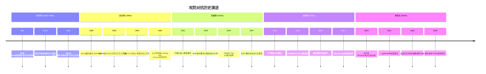
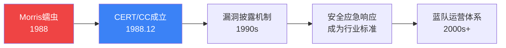
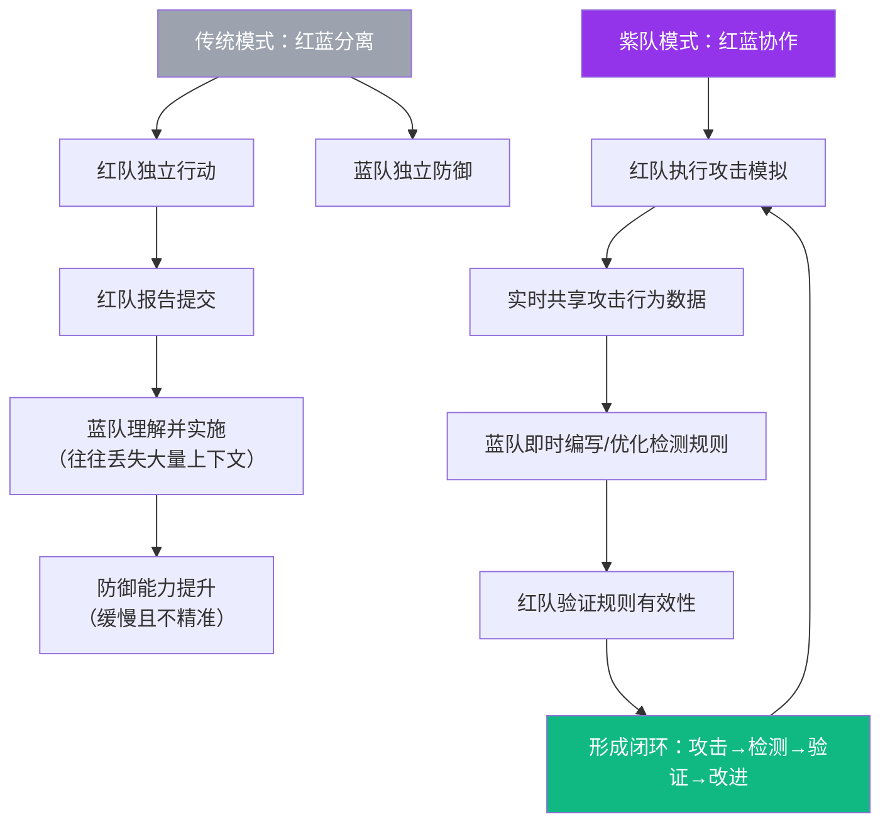

## 26.1.1 攻防对抗的历史演进

攻防对抗不是一种技术，而是一种**思维范式**。理解它的历史演进，不只是回顾"过去发生了什么"，更是理解"为什么今天的安全体系长成这个样子"。每一次攻防范式的转变，背后都是真实的安全事件、组织的惨痛教训和安全社区的集体反思。

本节将从军事领域的红队起源出发，沿时间线梳理攻防对抗从萌芽到成熟的完整演进路径，帮助读者建立对红队、蓝队、紫队体系的历史纵深认知。

---

### 一、攻防对抗的完整演进时间线



| 时代 | 驱动力量 | 核心特征 | 安全范式 |
|------|---------|---------|---------|
| 萌芽期 (1960s-1980s) | 军事需求、学术研究 | 安全评估思想萌发，以文档和规范为主 | 安全 = 打补丁 |
| 起步期 (1990s) | 互联网商业化、病毒爆发 | 从被动防御转向主动检测，红队概念引入 | 安全 = 主动检测 |
| 发展期 (2000s) | APT出现、合规驱动 | 攻防对抗制度化、标准化 | 安全 = 漏洞管理 |
| 成熟期 (2010s) | 高级威胁、数据泄露 | 红蓝对抗体系化，紫队协作萌芽 | 安全 = 体系对抗 |
| 体系化 (2020s) | 供应链攻击、云原生、AI | 自动化+持续化+平台化 | 安全 = 持续验证 |

---

### 二、萌芽期：军事红队的起源（1960s-1980s）

#### 2.1 军事红队的思想根基

"红队"（Red Team）的概念起源于美国军方的对抗性演习体系。在冷战时期的军事推演中，为了检验作战计划的可靠性，美军将参演部队分为"红方"（模拟敌军/苏军）和"蓝方"（己方），通过红方的攻击来暴露蓝方的防御漏洞。

这一机制的核心原则是**"以对手的视角审视自己"**——不是自我感觉良好地认为防御充分，而是让一支专门的团队站在敌人的立场上，用尽可能接近真实的方式发起攻击。

#### 2.2 Willis Ware 报告与安全评估思想

1967年，美国兰德公司发布了由 Willis Ware 主持编写的《计算机安全保密问题的最终报告》（即"Ware报告"）。这份报告首次系统性地阐述了计算机系统面临的安全威胁，并提出了安全评估的基本原则。虽然当时还没有"红队"的术语，但报告的核心理念——**系统性地评估计算机安全态势**——为后来的安全评估方法论奠定了理论基础。

#### 2.3 军事红队的实践

1970年代至1980年代，美军开始在多个维度实践红队机制：

- **电子战红队**：模拟敌方电子干扰和信号情报截获能力
- **情报红队**：模拟敌方情报机构的侦察和渗透活动
- **特种作战红队**：模拟敌方特种部队的渗透和破坏行动

这些军事红队的核心实践原则——**独立性**（红队不受蓝队指挥）、**真实性**（尽可能模拟真实威胁）、**全面性**（覆盖技术、战术、人员等多个维度）——后来被完全继承到了网络安全领域的红队实践中。

> 💡 **关键洞察**：军事红队的核心价值不在于"攻破防线"，而在于**通过对抗暴露防御体系的盲区和薄弱环节**。这个理念是贯穿整个攻防对抗演进史的主线。

---

### 三、起步期：从军事到民用的跨越（1990s）

#### 3.1 Morris蠕虫与CERT/CC的诞生

1988年11月2日，康奈尔大学研究生Robert Tappan Morris发布了互联网史上第一个大规模传播的蠕虫——Morris蠕虫。该蠕虫利用了Unix系统的多个漏洞（fingerd缓冲区溢出、rsh信任关系、sendmail调试后门），在短短数小时内感染了约6000台计算机——当时互联网主机总数的约10%。

这一事件直接催生了**计算机应急响应小组协调中心（CERT/CC）**于1988年12月在卡内基梅隆大学成立。CERT/CC的建立标志着安全社区从"被动修补"转向**"组织化响应"**的开端，也为后来蓝队制度化运营提供了雏形。



#### 3.2 互联网商业化催生安全需求

1990年代中期，随着万维网的普及和电子商务的兴起，企业开始将核心业务系统连接到互联网。这一转变带来了全新的攻击面：

- **1994年**：首次公开记录的信用卡盗刷事件，攻击者入侵了某大型零售系统的POS终端
- **1995年**：Netscape的SSL协议被发现存在严重设计缺陷，引发对加密通信安全性的广泛讨论
- **1996年**：DEFCON黑客大会成立，黑客社区从地下走向公开化

#### 3.3 渗透测试的商业化起步

1990年代后期，第一批商业渗透测试公司开始出现。这个时期的渗透测试有几个显著特征：

- **工具驱动**：主要使用Nessus、ISS Internet Scanner等自动化扫描工具
- **漏洞清单导向**：测试目标是找出尽可能多的已知漏洞
- **技术层面为主**：不涉及社会工程、物理安全等非技术攻击面
- **一次性评估**：测试完成后给出报告，缺乏持续性

| 维度 | 1990年代渗透测试 | 当代红队行动 |
|------|----------------|-------------|
| 工具 | Nessus扫描 + 手动验证 | 定制化攻击载荷 + 全栈攻击链 |
| 目标 | 发现已知漏洞 | 达成预设业务目标 |
| 范围 | 指定IP段/应用 | 组织全攻击面（含物理、社会工程） |
| 时间 | 数天 | 数周至数月 |
| 产出 | 漏洞清单 | 攻击叙事 + 防御差距分析 |
| 隐蔽性 | 不要求 | 高度隐蔽 |

#### 3.4 "认识你的敌人"——Mudge与L0pht的贡献

1999年，知名黑客组织L0pht的成员（包括Mudge、Dildog等人）在黑帽大会上发表了一系列名为**"Know Your Enemy"**的技术演示，系统性地展示了攻击者从侦察到完全控制目标系统的全过程。这些演示首次向安全社区清晰地展示了：**攻击者不是随意扫描和利用漏洞的，他们有组织、有方法、有策略**。

这一认识深刻影响了安全社区对攻防对抗的理解，也为后来ATT&CK框架中将攻击者行为结构化的思路埋下了种子。

---

### 四、发展期：制度化与标准化（2000s）

#### 4.1 APT概念的萌芽与确立

2000年代初期，几起具有里程碑意义的安全事件让安全社区认识到，传统渗透测试无法应对真正的高级威胁：

**Moonlight Maze（1998-2000）**：一场针对美国国防部、NASA、能源部等政府机构长达两年多的网络间谍攻击。攻击者利用系统管理员的弱口令和已知漏洞持续渗透，窃取了大量敏感数据。这是首次被广泛记录的**长期潜伏型网络攻击**，也是后来"高级持续性威胁（APT）"概念的实践原型。

**Titan Rain（2003-2006）**：美国军方和情报机构发现的一系列针对国防承包商和军事网络的大规模网络间谍活动。攻击者展现了高度的组织性和技术能力，包括使用零日漏洞和定制化攻击工具。

这些事件促使安全社区提出了一个关键问题：**面对有组织、有耐心、有资源的攻击者，传统的漏洞扫描和渗透测试是否足够？**

答案显然是"不够"。安全社区需要一种更接近真实攻击的评估方式——这正是红队行动的核心动机。

#### 4.2 美国国防部的制度化红队实践

2003年，美国国防部发布正式指令，要求对关键军事信息系统进行**红队安全评估**。这不是可选的最佳实践，而是强制性的合规要求。美国国防部的红队实践具有以下特征：

- **独立组织**：红队直接向高级指挥官汇报，不受目标系统管理者的管辖
- **全维度评估**：不仅测试技术漏洞，还评估人员安全意识、物理安全、流程漏洞
- **真实威胁模拟**：基于威胁情报中活跃的APT组织的TTPs设计攻击方案
- **持续性行动**：红队评估不是一天的扫描测试，而是持续数周甚至数月的完整行动

美国国防部的红队实践为整个安全行业树立了标杆，证明了**系统化的对抗性评估比被动的安全检查更有效**。

#### 4.3 OWASP与应用安全评估的标准化

2004年，OWASP（Open Web Application Security Project）发布了**OWASP Top 10**，首次将最常见的Web应用安全风险进行了系统化排列和描述。OWASP Top 10的意义不仅在于提供了一份漏洞清单，更在于它推动了**安全评估方法论的标准化**——让不同组织的渗透测试有了可比较的基准。

#### 4.4 中国攻防实践的发展

2001年4月，中美撞机事件引发了一场大规模的网络攻防战。中国黑客群体对美国政府网站发起了一系列攻击（"中国红客"行动），同时也遭到美国黑客的反击。这一事件：

- 首次将网络攻防从技术领域推向了公众视野
- 推动了中国网络安全意识的觉醒
- 促使中国开始重视网络空间的攻防能力建设

2000年代后期，中国的安全行业开始快速发展，渗透测试和漏洞评估服务逐渐商业化。等保1.0体系的建立也为安全评估的标准化提供了政策框架。

---

### 五、成熟期：红蓝对抗体系化（2010s）

#### 5.1 APT时代：从"找漏洞"到"模拟对手"

2010年，RSA安全公司正式在其白皮书中使用了**"高级持续性威胁（Advanced Persistent Threat, APT）"**这一术语，描述了当时多起针对企业和政府的复杂网络攻击的共同特征：

- **高级（Advanced）**：使用零日漏洞、定制化工具和复杂的攻击技术
- **持续性（Persistent）**：长期潜伏，持续数月甚至数年
- **威胁（Threat）**：具有明确的攻击目标和动机，而非随机攻击

APT概念的确立对攻防对抗产生了深远影响。它迫使安全社区重新审视安全评估的范式：

> 传统的渗透测试问的是"这个系统有哪些漏洞？"
> APT时代的安全评估问的是"如果一个有组织的对手要窃取我们的核心数据，他能成功吗？"

这个范式转变直接推动了红队行动从军事领域向民用安全行业的全面扩散。

#### 5.2 MITRE ATT&CK框架的诞生

2013年，MITRE公司开始开发一个名为**"Pre-ATT&CK"**的项目，旨在系统化地记录和分类攻击者在实际环境中使用的行为模式。2015年，**MITRE ATT&CK**（Adversarial Tactics, Techniques, and Common Knowledge）框架正式发布。

ATT&CK框架的革命性在于，它第一次将攻击者的行为从零散的"漏洞利用"提升到了**结构化的战术和战术矩阵**：

| 里程碑 | 时间 | 意义 |
|-------|------|------|
| Pre-ATT&CK | 2013 | MITRE开始系统化记录攻击者行为 |
| ATT&CK v1 | 2015 | 12个战术阶段的完整攻击矩阵 |
| ATT&CK v7 | 2019 | 引入云平台和移动设备相关技术 |
| ATT&CK v13 | 2022 | 覆盖14个战术、数百种技术、上千种子技术 |
| ATT&CK v15 | 2024 | 引入AI/ML相关攻击技术 |

ATT&CK框架对攻防对抗的影响是全方位的：

- **红队**：获得了标准化的攻击技术目录，可以更有针对性地设计攻击方案
- **蓝队**：建立了基于攻击者行为的检测基准，可以系统化地评估检测覆盖率
- **紫队**：提供了一个共同的语言和框架，让红蓝双方可以有效地协作

> 💡 **核心价值**：ATT&CK框架将攻防双方从"各说各话"带入了**"使用共同语言对话"**的时代。这是紫队协作能够实现的技术基础。

#### 5.3 红队工具链的成熟

2010年代，红队工具生态经历了爆发式发展：

| 工具 | 类别 | 核心功能 | 影响力 |
|------|------|---------|-------|
| Cobalt Strike | 渗透测试平台 | 商业C2框架、红队模拟 | 企业红队标配，但也被攻击者大量滥用 |
| Metasploit | 漏洞利用框架 | 开源攻击框架 | 降低了红队的技术门槛 |
| Empire/Starkiller | 后渗透框架 | PowerShell/Python C2 | 免杀技术的重要平台 |
| BloodHound | 信息收集 | AD域环境攻击路径分析 | 域渗透的必备工具 |
| Responder | 网络攻击 | LLMNR/NBT-NS投毒 | 内网横向移动的关键工具 |
| Mythic | C2框架 | 开源模块化C2平台 | 为红队提供了Cobalt Strike的替代方案 |

这些工具的成熟让红队行动的技术门槛显著降低，同时也推动了**蓝队检测能力的同步提升**——因为每个新工具都意味着新的检测点和响应需求。

#### 5.4 蓝队从被动防御到主动检测

2010年代，蓝队经历了从**"被动防御者"到"主动威胁猎手"**的深刻转变：

**传统蓝队（2000s）**：
- 依赖防火墙规则和签名检测
- 被动等待安全告警
- 以阻止所有攻击为目标
- 关注"有没有被入侵"

**现代蓝队（2010s+）**：
- 假设已被入侵（Assume Breach）
- 主动搜索潜伏威胁（Threat Hunting）
- 关注"如何快速发现和有效响应"
- 使用EDR、NDR、XDR等高级检测技术

这一转变的核心驱动力是**"假设已被入侵"（Assume Breach）**理念的确立。Google在2011年遭受Operation Aurora攻击后，率先提出了BeyondCorp零信任架构，其核心假设就是：**网络边界不可信，攻击者可能已经在内部网络中**。

---

### 六、紫队的诞生：从对抗到协作（2015-至今）

#### 6.1 传统红蓝对抗的痛点

在红队和蓝队各自发展到一定成熟度后，一个关键问题浮出水面：**红蓝双方存在严重的信息不对称和能力脱节**。

典型的困境场景：

- **红队发现了攻击路径**，但蓝队的检测规则没有覆盖，攻击者可以重复使用
- **蓝队投入大量资源建设防御**，但不知道攻击者最可能使用哪些技术，防御优先级错误
- **红队行动结束后出具报告**，但蓝队无法有效地将报告转化为可执行的检测改进
- **攻防双方使用不同的术语和框架**，沟通效率极低

这种"各自为战"的模式导致了一个严重的后果：**攻防双方的投入都没有得到最大的回报**。红队的发现没有转化为防御能力的提升，蓝队的防御建设没有瞄准最真实的威胁。

#### 6.2 紫队概念的提出与定义

2015年前后，安全社区开始探索将红蓝双方从对抗模式转变为协作模式，**"紫队"（Purple Team）**的概念应运而生。

紫队的准确含义需要特别澄清：

> **紫队不是一个独立的团队编制，而是一种协作模式和组织理念。**

紫队的核心原则是：红队和蓝队在同一个框架下（通常基于ATT&CK）协同工作，通过实时的信息共享和能力验证，持续提升组织的整体安全水平。



#### 6.3 紫队协作的三种模式

| 模式 | 特征 | 适用场景 | 信息流动方向 |
|------|------|---------|-------------|
| **被动紫队** | 红队行动结束后，蓝队基于报告进行检测改进 | 初级组织、预算有限 | 红→蓝（单向） |
| **主动紫队** | 红队实时展示攻击技术，蓝队现场编写检测规则 | 中级组织、已有基础能力 | 红⇄蓝（双向实时） |
| **自动化紫队** | 通过自动化平台（如Atomic Red Team）持续进行攻击模拟和检测验证 | 成熟组织、大规模环境 | 红⇄蓝（自动化闭环） |

#### 6.4 紫队协作的技术基础

紫队协作的实现依赖几个关键技术组件：

**1. ATT&CK矩阵作为共同语言**
红队在ATT&CK框架中选择攻击技术，蓝队在同一框架下评估检测覆盖率。这种结构化的对应关系让双方的协作有了精确的衡量标准。

**2. 原子化攻击模拟工具**
- **Atomic Red Team**：基于MITRE ATT&CK的原子化攻击测试库，每个测试对应一个ATT&CK技术
- **MITRE Caldera**：自动化的对手模拟平台，可以基于ATT&CK矩阵进行端到端的攻击模拟
- **Infection Monkey**：开源的攻防模拟工具，专注于网络分段和横向移动的验证

**3. 检测工程平台**
- **Sigma规则格式**：跨SIEM平台的通用检测规则格式
- **Detection-as-Code**：将检测规则纳入版本控制和CI/CD流程
- **检测覆盖率仪表板**：基于ATT&CK矩阵的可视化检测覆盖评估

---

### 七、体系化阶段：自动化与持续化（2020s-至今）

#### 7.1 供应链攻击的常态化

2020年底的SolarWinds供应链攻击和2021年底的Log4Shell漏洞事件，彻底改变了攻防对抗的格局。供应链攻击迫使攻防双方将注意力从传统的"边界突破"转向更深层的信任链验证：

- **攻击视角**：供应链提供了绕过传统防御的完美路径
- **防御视角**：传统的网络边界防御对供应链攻击几乎无效
- **紫队视角**：需要建立覆盖软件供应链全生命周期的安全验证能力

#### 7.2 云原生环境的攻防挑战

云原生架构的普及引入了全新的攻击面和防御维度：

| 攻击维度 | 传统环境 | 云环境 | 防御变化 |
|---------|---------|-------|---------|
| 身份 | AD域控 | IAM + OIDC + 混合身份 | 身份成为新的安全边界 |
| 网络 | 物理网络分段 | VPC + 安全组 + 微服务网络策略 | 网络分段从物理转向逻辑 |
| 数据 | 本地存储 + 备份 | 对象存储 + 数据库服务 | 数据安全需要云原生方案 |
| 运维 | SSH + 远程桌面 | API + 容器编排 | API安全成为新的攻防焦点 |
| 代码 | 部署包 | 容器镜像 + 基础设施即代码 | 代码安全扫描前移至CI/CD |

#### 7.3 自动化红队与AI辅助攻防

2020年代后期，几个趋势正在重塑攻防对抗的格局：

**自动化攻击模拟的成熟**：MITRE Caldera、Atomic Red Team等工具已经能够自动化执行大量ATT&CK技术测试。红队分析师的角色从"手动执行攻击"转向"设计攻击方案和分析结果"。

**AI辅助攻防**：
- **攻击侧**：大语言模型被用于自动生成钓鱼邮件、分析代码漏洞、优化攻击路径
- **防御侧**：AI被用于异常行为检测、日志分析、自动化威胁狩猎
- **紫队侧**：AI辅助检测规则生成和ATT&CK覆盖评估

**持续性红队评估（Continuous Red Teaming）**：从"年度一次的红队演练"转向"持续性的攻击模拟"。这意味着组织可以实时了解自己的安全态势变化，而不是每年只在一个时间点看到安全评估结果。

#### 7.4 中国特色的攻防实践

中国的网络安全攻防实践也经历了快速的发展：

- **等保2.0（2019）**：将安全测评从"合规检查"提升到"持续性安全评估"，要求组织定期进行安全测试
- **护网行动**：国家层面组织的攻防演练，覆盖金融、能源、通信等关键基础设施行业。护网行动是中国特有的大规模攻防演练形式，对企业安全能力的提升起到了显著的推动作用
- **红蓝对抗实战化**：越来越多的中国企业从"购买渗透测试服务"转向"建立内部红队能力"，攻防对抗成为安全运营的常态化实践

---

### 八、攻防对抗演进的核心规律

纵观攻防对抗数十年的演进，可以提炼出几条核心规律：

#### 规律一：威胁驱动范式转变

每一次攻防范式的转变，背后都是新的威胁类型出现：

```text
 Morris蠕虫 → CERT/CC成立 → 组织化响应能力
     ↓
  APT威胁   → 红队行动   → 模拟真实对手
     ↓
 供应链攻击 → 紫队协作   → 全攻击面覆盖
     ↓
 AI赋能攻击 → 持续攻防   → 自动化验证
```

#### 规律二：攻防同步螺旋上升

攻防双方的能力始终在同步提升，形成螺旋上升的竞争格局：

- 红队使用新攻击技术 → 蓝队开发新检测方法 → 红队迭代新绕过技术 → 蓝队优化检测精度
- 这个循环不会终止，因为**攻防不对称性**（攻击者只需找到一个突破点，防御者需要守住所有入口）决定了攻防对抗永远是"矛与盾"的永恒博弈

#### 规律三：从工具到体系的跃迁

攻防能力的发展经历了三个层次的跃迁：

| 层次 | 核心能力 | 代表阶段 | 关键指标 |
|------|---------|---------|---------|
| **工具层** | 熟练使用安全工具 | 1990s-2000s | 能扫描和利用已知漏洞 |
| **方法层** | 建立攻防方法论 | 2010s | 能设计完整的攻击方案或防御体系 |
| **体系层** | 构建持续演进的攻防体系 | 2020s+ | 攻防能力可持续提升并保持领先 |

#### 规律四：标准化推动规模化

ATT&CK框架的成功证明了一个关键事实：**安全社区需要共同的语言才能有效协作**。没有ATT&CK，红蓝紫队的协作就缺乏精确的衡量标准；没有Sigma规则格式，检测知识就无法在组织间共享；没有标准化的攻防度量指标，安全投入的ROI就无法量化。

---

### 九、对本章后续内容的衔接

理解了攻防对抗的历史演进后，读者就具备了学习后续内容的背景基础：

- **26.1.2 MITRE ATT&CK框架**：这是现代攻防对抗的"共同语言"，是紫队协作的技术基础
- **26.1.3 攻击链模型**：描述攻击者从侦察到目标达成的完整生命周期
- **26.1.4 钻石模型**：从四个核心要素分析对手的战术和能力
- **26.1.5 OODA循环**：攻防对抗中的决策循环理论
- **26.1.6 假设驱动的安全模型**：现代蓝队的核心理念，"假设已被入侵"
- **26.1.7-9**：威胁情报、度量指标、SOC架构等支撑体系

这些理论工具共同构成了理解红蓝紫队体系的知识框架，而它们的根基都植根于本节所述的历史演进过程。

---

### 本节核心要点

1. **红队起源于军事领域**，核心原则是"以对手的视角审视自己"，这一原则贯穿了攻防对抗的整个演进史
2. **从渗透测试到红队行动的范式转变**是由APT等高级威胁驱动的，核心差异在于从"找漏洞"到"模拟真实对手"
3. **紫队不是独立团队，而是协作模式**，通过ATT&CK框架等共同语言实现红蓝双方的实时协同
4. **攻防对抗经历了从工具层→方法层→体系层的跃迁**，现代攻防需要的是持续演进的体系能力
5. **自动化和AI正在重塑攻防对抗**，但核心的"矛与盾"博弈逻辑不会改变

> 💡 **学习建议**：阅读本节后，建议读者结合26.1.2节的ATT&CK框架来理解"攻击者行为如何被结构化描述"，这是后续所有攻防讨论的技术基础。
