## 26.1.2 MITRE ATT&CK 框架

```mermaid
graph TD
    A["🎯 MITRE ATT&CK 框架"]
    
    A --> B["🔴 红队应用"]
    A --> C["🔵 蓝队应用"]
    A --> E["🟣 紫队/协调应用"]
    
    B --> B1["攻击技术标准化参考"]
    B --> B2["攻击计划结构化规划"]
    B --> B3["与真实威胁组织对标"]
    B --> B4["ATT&CK评估矩阵"]
    
    C --> C1["检测覆盖范围评估"]
    C --> C2["安全监控规则开发"]
    C --> C3["安全能力差距分析"]
    C --> C4["威胁情报驱动防御"]
    
    E --> E1["共同语言与沟通桥梁"]
    E --> E2["攻防能力差距量化"]
    E --> E3["安全成熟度评估"]
    
    A --> D["14个战术阶段"]
    D --> D1["侦察 → 资源开发"]
    D --> D2["初始访问 → 执行"]
    D --> D3["持久化 → 提权"]
    D --> D4["防御绕过 → 凭证访问"]
    D --> D5["发现 → 横向移动"]
    D --> D6["收集 → C2"]
    D --> D7["数据渗出 → 影响"]

    style A fill:#E91E63,stroke:#333,color:#fff
    style B fill:#FF5722,stroke:#333,color:#fff
    style C fill:#2196F3,stroke:#333,color:#fff
    style E fill:#9C27B0,stroke:#333,color:#fff
```



### 框架概述

MITRE ATT&CK（Adversarial Tactics, Techniques, and Common Knowledge）是当前攻防对抗领域最核心的知识框架。它由MITRE公司（美国非营利研究机构）于2013年启动，基于其早期的FMX（Fort Meade eXperiment）项目演化而来，通过对真实攻击行为的系统化归纳，构建了一个涵盖攻击全生命周期的技术知识库。

ATT&CK的核心价值在于**将"攻击"从模糊的概念转化为可量化、可比较、可重复的技术语言**。在ATT&CK出现之前，安全团队描述攻击行为时往往各说各话——同一个后门植入行为，有人叫"持久化"，有人叫"驻留"，有人叫"后门"。ATT&CK统一了这套语言，使得红队、蓝队、管理层、威胁情报分析师能够在同一个框架下对话。

#### 核心概念：分层知识体系

ATT&CK采用**四层递进结构**，从抽象到具体：

| 层级 | 英文 | 含义 | 类比 |
|------|------|------|------|
| 战术（Tactics） | TA | 攻击者要达成的**阶段目标** | 战役目标（"占领某城"） |
| 技术（Techniques） | T | 达成战术目标的**方法** | 作战方式（"围城"或"强攻"） |
| 子技术（Sub-techniques） | T.xxx | 技术的**细粒度分类** | 具体战法（"断水围城"） |
| 过程（Procedures） | — | 攻击者的**实际实施步骤** | 具体执行（"在哪断水、断多久"） |

截至目前，ATT&CK企业矩阵已收录约**200+技术**和**400+子技术**，覆盖了从侦察到影响的完整攻击链。每个技术条目都包含：描述、检测难度、缓解措施、以及来自真实攻击案例的**过程引用**。

#### ATT&CK的三个矩阵

ATT&CK针对不同的环境维护了三个独立矩阵：

- **企业矩阵（Enterprise ATT&CK）**：覆盖Windows、macOS、Linux、网络、云平台（Azure、AWS、GCP等），是最广泛使用的矩阵，包含14个战术阶段
- **移动矩阵（Mobile ATT&CK）**：针对Android和iOS平台的攻击技术，包含14个战术阶段（与企业矩阵战术有所差异）
- **ICS矩阵（ICS ATT&CK）**：针对工业控制系统（SCADA/ICS）的攻击技术，包含12个战术阶段，覆盖PLC、RTU、HMI等工控设备

### 企业矩阵的14个战术阶段详解

ATT&CK企业矩阵的14个战术阶段构成了完整的攻击生命周期。下面从红蓝对抗的角度逐一解析每个战术的核心技术、常见手法和检测要点。

#### 阶段1：侦察（Reconnaissance, TA0043）

**目标**：收集目标组织的信息，为后续攻击做准备。

**关键子技术**：
- **主动扫描（T1595）**：端口扫描、漏洞扫描、网络探测
- **收集受害者信息（T1593）**：社交媒体分析、搜索引擎挖掘、DNS枚举
- **钓鱼获取信息（T1598）**：向目标发送钓鱼邮件获取凭证或信息
- **搜索开放网站/域（T1594）**：通过公开资源了解目标IT架构
- **搜索受害者主机（T1596）**：利用Shodan、Censys等搜索引擎发现暴露资产

**实际案例**：APT29（Cozy Bear）在对SolarWinds供应链攻击前，进行了长达数月的侦察，通过LinkedIn、GitHub等平台收集目标组织架构和IT人员信息。

**蓝队检测要点**：监控外部扫描行为，设置蜜罐（Honeypot）诱捕侦察活动，监控域名/IP的异常查询频率。

#### 阶段2：资源开发（Resource Development, TA0042）

**目标**：建立攻击基础设施、获取工具、准备攻击资源。

**关键子技术**：
- **获取基础设施（T1583）**：注册域名、租赁VPS、搭建C2服务器
- **获取能力（T1588）**：购买漏洞利用工具、开发恶意软件、获取代码签名证书
- **开发能力（T1587）**：自行开发恶意软件、编写漏洞利用代码
- **建立账户（T1585）**：创建虚假社交媒体账号、邮箱、云服务账户
- **妥协账户（T1586）**：入侵第三方服务账户用于后续攻击

**实际案例**：FIN7组织通常在攻击前准备大量看起来合法的域名和SSL证书，用于伪装C2通信。

#### 阶段3：初始访问（Initial Access, TA0001）

**目标**：获取目标网络的入口点。这是大多数红蓝对抗的起点。

**关键子技术**：
- **钓鱼攻击（T1566）**：鱼叉式钓鱼邮件、钓鱼附件、钓鱼链接
- **利用公开应用（T1190）**：利用Web应用漏洞（SQL注入、RCE等）
- **供应链攻击（T1195）**：污染软件更新包、硬件后门
- **可信关系利用（T1199）**：通过已信任的供应商或合作伙伴网络进入
- **外部远程服务（T1133）**：利用暴露的VPN、RDP、SSH等服务
- **硬件添加（T1200）**：物理植入恶意硬件设备
- **有效账户（T1078）**：使用窃取或购买的有效凭证登录

**红队常用手法**：在红队演练中，钓鱼邮件和利用公开Web应用漏洞是最常见的初始访问入口。红队通常会结合侦察阶段收集的信息制作高度定制化的钓鱼内容。

**蓝队防御优先级**：邮件安全网关、Web应用防火墙（WAF）、多因素认证（MFA）、网络边界访问控制。

#### 阶段4：执行（Execution, TA0002）

**目标**：在目标系统上运行恶意代码或命令。

**关键子技术**：
- **命令行脚本执行（T1059）**：PowerShell、cmd.exe、bash、Python等解释器执行
- **利用客户端漏洞（T1203）**：通过文档漏洞（如Office宏、PDF漏洞）触发执行
- **计划任务/作业（T1053）**：利用cron、Windows Task Scheduler执行
- **用户执行（T1204）**：诱导用户打开恶意文件
- **原生API调用（T1106）**：通过系统API直接执行代码

**红队工具链**：Cobalt Strike的`execute-assembly`、Metasploit的`execute`模块、Impacket的远程执行工具。

#### 阶段5：持久化（Persistence, TA0003）

**目标**：在系统重启、凭证变更后仍能维持访问。

**关键子技术**：
- **启动/登录自动执行（T1547）**：注册表Run Key、启动文件夹、服务
- **计划任务/作业（T1053）**：周期性执行恶意代码
- **账户创建/修改（T1136/T1098）**：创建后门账户、修改权限
- **植入Web Shell（T1505）**：在Web服务器上部署后门
- **DLL搜索顺序劫持（T1574）**：利用DLL加载机制植入恶意DLL
- **引导或登录初始化执行（T1543）**：systemd服务、launchd守护进程

**实际案例**：Cobalt Strike的Beacon默认使用注册表Run键和WMI事件订阅进行持久化。高级攻击者会使用更隐蔽的方式如BCD修改引导加载程序。

#### 阶段6：提权（Privilege Escalation, TA0004）

**目标**：从普通用户权限提升到管理员或系统级权限。

**关键子技术**：
- **利用漏洞提权（T1068）**：内核漏洞（Dirty Pipe、PrintNightmare等）
- **滥用高程控制机制（T1548）**：UAC绕过、sudo配置滥用
- **访问令牌操纵（T1134）**：令牌窃取和模拟
- **进程注入（T1055）**：将代码注入高权限进程
- **域提权（T1484）**：通过域配置漏洞获取域管理员权限

**关键概念**：提权通常分为**垂直提权**（权限等级提升，如从user到admin）和**水平提权**（在同一权限等级下获取更多资源访问权，如访问其他用户的邮箱）。

#### 阶段7：防御绕过（Defense Evasion, TA0005）

**目标**：规避安全检测机制，是ATT&CK中技术数量最多的战术阶段（约40+技术）。

**关键子技术**：
- **混淆文件或信息（T1027）**：Base64编码、XOR加密、字符串拼接
- **进程注入（T1055）**：将恶意代码注入合法进程
- **禁用安全工具（T1562）**：关闭防病毒软件、禁用EDR agent
- **伪造/删除日志（T1070）**：清除Windows事件日志、删除Linux日志
- **应用层协议伪装（T1071）**：将C2流量伪装成HTTPS/DNS流量
- **签名伪装（T1553）**：使用窃取的代码签名证书签署恶意软件
- **混淆载荷（T1027.002）**：使用加密、压缩、打包混淆恶意载荷

**为什么Defense Evasion是最复杂的阶段**：攻击者需要同时对抗端点检测（EDR/AV）、网络检测（IDS/NPS）、日志分析（SIEM）、沙箱分析等多种防御机制，每个环节都需要相应的绕过技术。

#### 阶段8：凭证访问（Credential Access, TA0006）

**目标**：获取账户凭证，为横向移动和持久化奠定基础。

**关键子技术**：
- **OS凭证转储（T1003）**：LSASS内存提取、SAM数据库、/etc/shadow
- **暴力破解（T1110）**：密码喷洒、凭证填充
- **密码猜测（T1110.001）**：针对弱口令的自动猜测
- **窃取Web会话Cookie（T1539）**：浏览器Cookie窃取
- **网络嗅探（T1040）**：捕获网络中的明文凭证
- **多因素认证绕过（T1621）**：通过API滥用绕过MFA

**核心工具**：Mimikatz（LSASS提取）、LaZagne（多平台凭证恢复）、Rubeus（Kerberos攻击）、Responder（LLMNR/NBT-NS投毒）。

#### 阶段9：发现（Discovery, TA0007）

**目标**：了解目标环境的网络拓扑、系统配置、用户信息和安全防护情况。

**关键子技术**：
- **账户发现（T1087）**：列举本地和域账户
- **网络扫描（T1046）**：端口扫描、服务发现
- **系统信息发现（T1082）**：获取OS版本、补丁级别
- **进程发现（T1057）**：列出运行进程寻找安全工具
- **权限账户发现（T1069）**：寻找管理员和高权限账户
- **远程系统发现（T1018）**：网络内主机枚举

**红队最佳实践**：发现阶段是"了解你在哪"的关键步骤。成熟的红队会在渗透的每个阶段都重复执行发现，以确保对目标环境有持续的、准确的理解。

#### 阶段10：横向移动（Lateral Movement, TA0008）

**目标**：利用已获取的凭证和信任关系，在网络内部扩展访问范围。

**关键子技术**：
- **远程服务利用（T1021）**：RDP、SSH、SMB、WMI远程连接
- **远程服务会话劫持（T1563）**：SSH劫持、RDP会话劫持
- **利用远程服务（T1210）**：利用内网服务漏洞（如EternalBlue）
- **Windows管理共享（T1021.002）**：利用ADMIN$、C$进行文件投递
- **Kerberoasting（T1558.003）**：获取Kerberos服务票据离线破解
- **横向工具传输（T1570）**：将攻击工具传输到其他系统

**关键概念**：横向移动的效率取决于初始凭证的权限范围和内网的信任关系配置。在域环境中，一旦获取域管理员凭证，理论上可以访问域内任意系统。

#### 阶段11：收集（Collection, TA0009）

**目标**：收集目标数据，为后续渗出做准备。

**关键子技术**：
- **数据暂存（T1074）**：将分散的数据集中到临时位置
- **本地系统数据（T1005）**：从本地文件系统收集数据
- **网络共享数据（T1039）**：从SMB/NFS共享收集数据
- **屏幕截图（T1113）**：捕获屏幕内容
- **键盘记录（T1056）**：记录键盘输入
- **剪贴板数据（T1115）**：获取剪贴板内容

#### 阶段12：命令与控制（Command and Control, TA0011）

**目标**：建立与被控系统之间的通信通道，维持远程控制能力。

**关键子技术**：
- **加密通道（T1573）**：HTTPS、TLS加密C2通信
- **DNS隧道（T1071.004）**：通过DNS查询编码传输数据
- **协议隧道（T1572）**：在合法协议中嵌套C2通道
- **动态DNS（T1568）**：使用DDNS服务快速切换C2地址
- **多跳代理（T1090）**：通过多层代理隐藏真实C2
- **资源劫持（T1496）**：利用被控系统进行加密货币挖矿

**C2通信的黄金法则**：成功的C2必须同时满足三个条件——**隐蔽性**（不被检测）、**稳定性**（不会被防火墙切断）、**低延迟**（响应速度可接受）。

#### 阶段13：数据渗出（Exfiltration, TA0010）

**目标**：将数据从目标网络转移到攻击者控制的位置。

**关键子技术**：
- **通过C2渗出（T1041）**：通过已建立的C2通道传输数据
- **通过其他网络介质（T1048）**：利用云存储、邮件、DNS等渠道
- **Web服务渗出（T1567）**：利用合法云服务（如Google Drive、Paste Site）
- **自动渗出（T1020）**：设置自动定期渗出机制
- **传输大小限制（T1030）**：分块传输避免触发流量告警

#### 阶段14：影响（Impact, TA0040）

**目标**：破坏、操纵或中断系统和数据，达成最终攻击目的。

**关键子技术**：
- **数据加密/勒索（T1486）**：勒索软件加密数据
- **数据销毁（T1485）**：删除关键数据
- **服务拒绝（T1499）**：DDoS攻击
- **磁盘擦除（T1561）**：覆写磁盘MBR/GPT
- **固件损坏（T1542）**：修改BIOS/UEFI固件
- **账户访问删除（T1531）**：删除所有管理员账户破坏恢复能力

### ATT&CK在红蓝对抗中的深度应用

#### 红队视角：ATT&CK作为攻击方法论

对于红队，ATT&CK不仅仅是一张技术清单，更是**结构化的攻击规划框架**：

**1. 攻击计划制定**
红队在规划攻击行动时，通常按战术阶段绘制攻击路线图：

```text
攻击路线示例：
侦察(TA0043) → 钓鱼(TA0001) → PowerShell执行(TA0002)
→ 注册表持久化(TA0003) → UAC绕过提权(TA0004)
→ Mimikatz凭证转储(TA0006) → 横向移动到域控(TA0008)
→ 域控数据收集(TA0009) → 通过HTTPS渗出(TA0010)
```

**2. 威胁组织模拟**
ATT&CK维护了一个详细的**威胁组织知识库**，包含每个已知APT组织使用的技术。红队可以模拟特定组织的TTP（战术、技术和过程），使演练更贴近真实威胁：

| 威胁组织 | 专注领域 | 典型技术 |
|----------|---------|---------|
| APT29 (Cozy Bear) | 供应链、云环境 | T1195（供应链）, T1078（有效账户） |
| APT41 (Double Dragon) | 双重间谍+犯罪 | T1560（加密归档）, T1059.001（PowerShell） |
| Lazarus Group | 金融犯罪、破坏 | T1566（钓鱼）, T1486（勒索加密） |
| FIN7 | 金融欺诈 | T1566.001（恶意附件）, T1059（脚本执行） |
| Sandworm | 基础设施破坏 | T1485（数据销毁）, T1561（磁盘擦除） |

**3. 攻击记录与报告**
ATT&CK为红队报告提供了标准化的输出格式，使蓝队能够精确理解攻击者使用了哪些技术，从而针对性地加强防御。

#### 蓝队视角：ATT&CK作为防御基线

对于蓝队，ATT&CK框架提供了**从被动防御转向主动防御**的方法论基础：

**1. 检测覆盖范围评估**
使用ATT&CK的**热力图工具**（ATT&CK Navigator）绘制组织的检测覆盖范围：

- 绿色：已具备检测能力
- 黄色：部分检测能力
- 红色：无检测能力
- 灰色：不适用

这能直观暴露防御盲区，指导安全投入的优先级。

**2. 安全监控规则开发**
针对每个技术开发对应的检测规则：

```text
技术：T1003.001 (LSASS内存访问)
检测方案：
  - Sysmon Event ID 10：监控LSASS进程的异常访问
  - Windows Event ID 4688：进程创建审计
  - YARA规则：扫描内存转储文件
  - EDR行为检测：批量凭证提取行为
```

**3. 安全能力差距分析**
通过映射ATT&CK技术与现有安全工具的检测能力，量化评估：

- 工具A能覆盖：T1003、T1059、T1055（3个技术）
- 工具B能覆盖：T1190、T1566（2个技术）
- 未覆盖：T1195、T1200（供应链、硬件植入）
- 需要补充：工控环境检测能力

**4. 威胁情报驱动防御**
将外部威胁情报（IOC和TTP）映射到ATT&CK技术，快速转化为检测规则和防御措施。

#### 紫队视角：ATT&CK作为沟通桥梁

紫队（Purple Team）是红队和蓝队的协调层，ATT&CK在紫队中的核心价值是**提供共同语言**：

- 红队说："我使用了T1059.001 PowerShell执行"
- 蓝队立刻知道："需要检查PowerShell日志记录是否开启，AMSI是否有效"
- 紫队记录："检测覆盖率：中等；改进建议：启用ScriptBlock日志"

### ATT&CK Navigator与可视化评估

ATT&CK Navigator是MITRE提供的免费Web工具，用于可视化展示检测覆盖率、威胁组织技术分布和防御差距。

**核心功能**：

| 功能 | 用途 | 操作 |
|------|------|------|
| 热力图（Heatmap） | 可视化检测覆盖范围 | 按颜色深浅表示检测能力 |
| 技术叠加（Technique Overlay） | 叠加多个威胁组织的技术 | 识别多组织共用的技术 |
| 自定义评分 | 按组织需求评分 | 0-100分量化检测能力 |
| 分层对比 | 对比不同时间段的覆盖变化 | 评估安全改进效果 |

**评估流程**：

1. **基线评估**：导入当前安全工具集，标注每个技术的检测能力（0=无检测，1=告警，2=阻止）
2. **威胁对标**：叠加目标行业威胁组织的技术分布，识别高风险技术
3. **差距分析**：对比基线与威胁分布，找出"高威胁×低检测"的优先改进点
4. **改进计划**：制定分阶段的技术检测能力提升路线
5. **复评验证**：实施改进后重新评估，验证效果

### ATT&CK与其他框架的对比与互补

ATT&CK并非唯一的安全框架，理解其定位需要与其他框架对比：

| 框架 | 定位 | 与ATT&CK的关系 |
|------|------|----------------|
| **MITRE D3FEND** | 防御技术知识图谱 | ATT&CK的"镜像"——ATT&CK描述攻击，D3FEND描述防御 |
| **Cyber Kill Chain（Lockheed Martin）** | 攻击链模型 | 线性7阶段模型，ATT&CK是其扩展和细化 |
| **NIST CSF** | 安全管理框架 | 宏观框架，ATT&CK是其技术层实现参考 |
| **ISO 27001** | 信息安全管理标准 | 合规框架，ATT&CK可辅助满足检测和响应要求 |
| **OWASP Top 10** | Web安全风险清单 | 聚焦Web应用，ATT&CK覆盖面更广 |
| **ATT&CK评估** | 安全产品效果评估 | 基于ATT&CK评估安全工具的检测能力 |

**关键区别**：Cyber Kill Chain是线性的（攻击必须经过每个阶段），而ATT&CK是**非线性的**——攻击者可以在任何阶段跳跃、回溯或并行执行多个战术。这更符合真实攻击行为的复杂性。

### ATT&CK的持续演进与社区贡献

ATT&CK是一个**活文档**，每年发布3-4个版本更新。每次更新通常包括：

- **新增技术**：基于新发现的攻击手法添加
- **技术修订**：根据新研究细化或调整技术描述
- **威胁组织更新**：新增或更新APT组织的技术映射
- **过程引用**：补充新的公开攻击案例

**社区贡献渠道**：

- **ATT&CK Sponsors**：企业资助MITRE进行特定领域的研究
- **Working Groups**：针对云安全、移动安全等领域的专项工作组
- **Threat Intelligence Sharing**：通过CTID（Cyber Threat Intelligence Integration Center）共享威胁情报
- **开源工具生态**：Atomic Red Team、MITRE Caldera、Attack Navigator等开源项目

**Atomic Red Team**是特别值得关注的项目——它提供了针对每个ATT&CK技术的**原子化测试用例**，红队可以用于验证攻击技术的可行性，蓝队可以用于验证检测规则的有效性。

### 常见误区与最佳实践

#### 常见误区

| 误区 | 正确理解 |
|------|---------|
| "覆盖了所有技术就安全了" | 攻击者只需成功一个技术，防御需要覆盖所有可能路径 |
| "ATT&CK等同于威胁情报" | ATT&CK是框架，威胁情报是数据，两者互补而非替代 |
| "只关注高危技术" | 攻击者经常使用"低技术含量"的手法（如密码喷洒）因为它们往往被忽视 |
| "ATT&CK仅适用于红队" | 蓝队、紫队、安全架构师、CISO都应深入理解ATT&CK |
| "检测率100%就足够" | 还需要评估误报率、检测延迟、响应时间等指标 |

#### 最佳实践

1. **从小处着手**：不必一次覆盖所有技术，优先覆盖本行业威胁组织最常使用的技术
2. **持续迭代**：ATT&CK评估不是一次性项目，应纳入持续安全运营流程
3. **结合自动化**：使用MITRE Caldera进行自动化攻防演练，提升评估效率
4. **量化驱动**：用ATT&CK Navigator的评分机制量化安全能力，以数据驱动安全投资决策
5. **关注防御盲区**：定期审查"无检测"技术，评估其威胁可能性和检测可行性

### 本节小结

MITRE ATT&CK框架为红蓝对抗提供了统一的技术语言、结构化的攻击方法论和可量化的防御评估基准。无论是红队的攻击规划、蓝队的检测开发，还是紫队的协调沟通，ATT&CK都是不可或缺的核心工具。掌握ATT&CK不仅是理解攻防技术的捷径，更是从业务视角量化安全能力、指导安全投资的科学方法。在后续章节中，我们将深入探讨如何将ATT&CK框架应用于具体的红队行动和蓝队防御策略中。
