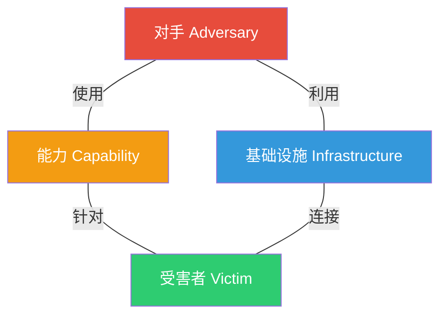
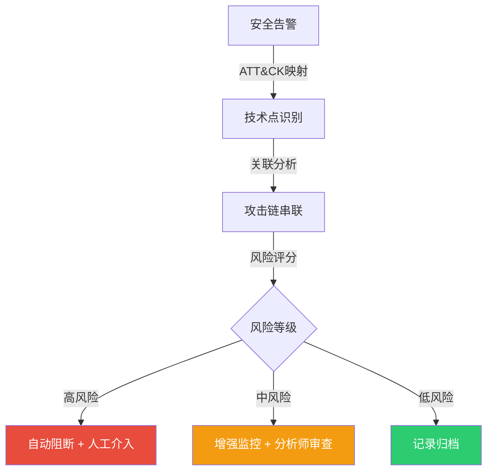

## 26.1.3 攻击链模型

攻击链模型（Attack Chain Model）是网络安全领域描述攻击者从初始侦察到达成最终目标全过程的结构化框架。理解攻击链不仅是红队行动的理论基础，更是蓝队构建纵深防御、紫队协调攻防演练的核心参照系。本节将系统讲解经典网络杀伤链、主流扩展模型、攻击链在现代环境中的演进，以及如何将攻击链模型落地为可操作的防御策略。

---

### 一、经典网络杀伤链（Cyber Kill Chain）

#### 1.1 提出背景

2011年，洛克希德·马丁公司（Lockheed Martin）的安全研究员 Eric Hutchins、Michael Cloppert 和 Rohan Amin 在论文《Intelligence-Driven Computer Network Defense Informed by Analysis of Adversary Campaigns and Intrusion Kill Chains》中首次提出了网络杀伤链模型。该模型借鉴了军事领域的"杀伤链"（Kill Chain）概念——从发现目标到摧毁目标的线性作战流程——将其移植到网络攻防场景中。

杀伤链的核心思想是：**任何成功的网络攻击都可以分解为一系列有序阶段，防御者只要在任意一个阶段成功阻断，就能瓦解整个攻击。**

#### 1.2 七个阶段详解

| 阶段 | 英文名称 | 攻击者行为 | 防御者对应措施 | 典型工具/技术 |
|------|---------|-----------|--------------|-------------|
| 1. 侦察 | Reconnaissance | 收集目标信息：域名、IP范围、员工邮箱、技术栈、社交媒体 | 监控异常扫描流量、最小化公开信息暴露 | whois、theHarvester、Shodan、Maltego、LinkedIn |
| 2. 武器化 | Weaponization | 开发或定制攻击载荷：生成恶意文档、编写exploit、配置C2服务器 | 应用白名单、禁用宏、部署沙箱 | Metasploit、Cobalt Strike、 msfvenom、自定义脚本 |
| 3. 投递 | Delivery | 将载荷送达目标：鱼叉邮件、水坑攻击、USB投递、供应链污染 | 邮件网关过滤、URL声誉检查、用户安全意识培训 | 钓鱼邮件、恶意链接、受感染的USB设备 |
| 4. 利用 | Exploitation | 触发漏洞执行代码：利用CVE漏洞、逻辑缺陷、配置错误 | 补丁管理、虚拟补丁、IPS规则更新 | CVE-2023系列、浏览器exploit、Office漏洞 |
| 5. 安装 | Installation | 植入持久化后门：写入注册表、创建计划任务、修改启动项 | EDR检测异常进程、文件完整性监控 | 后门程序、WebShell、DLL劫持、Rootkit |
| 6. 命令与控制 | Command & Control | 建立远程通信通道：反弹shell、DNS隧道、HTTPS加密通道 | 网络流量分析、DNS异常检测、出站流量审计 | Cobalt Strike Beacon、Empire、DNS over HTTPS |
| 7. 目标达成 | Actions on Objectives | 执行最终目的：数据窃取、勒索加密、横向移动、破坏 | 数据分类分级、DLP、网络微分段 | 数据渗出、横向移动工具、擦除器 |

#### 1.3 防御中的"破坏杀伤链"

洛克希德·马丁的论文强调了"破坏杀伤链"（Breaking the Kill Chain）的防御理念：

- **侦察阶段阻断**：通过OSINT监控发现攻击者的情报收集行为，例如监控Shodan上自家资产的暴露情况
- **武器化阶段阻断**：利用沙箱和文件类型控制，在攻击载荷到达用户之前进行检测
- **投递阶段阻断**：邮件网关的多层过滤（SPF/DKIM/DMARC + 内容扫描 + 沙箱分析）
- **利用阶段阻断**：及时打补丁、部署虚拟补丁、禁用不必要的功能（如Office宏）
- **安装阶段阻断**：EDR的行为检测、文件完整性监控、白名单机制
- **C2阶段阻断**：网络流量异常检测、DNS审计、出站流量白名单
- **目标达成阶段阻断**：数据加密、访问控制、网络微分段限制横向移动

关键原则：**防御者不需要在每个阶段都成功，只需在一个阶段成功即可；攻击者则需要在每个阶段都成功。** 这就是杀伤链给防御者带来的结构性优势。

---

### 二、攻击链的局限与扩展

#### 2.1 经典杀伤链的局限性

经典网络杀伤链模型虽然直观且被广泛采用，但在面对现代攻击场景时暴露出明显的局限：

**（1）线性假设问题**

杀伤链假设攻击按严格线性顺序推进，但实际攻击路径往往是非线性的。攻击者会根据防御反应动态调整策略——例如在利用阶段受阻后，可能回退到投递阶段更换载荷，或直接跳过安装阶段利用合法远程访问工具（如RDP、VPN）。

**（2）内部威胁覆盖不足**

模型主要针对外部攻击者的行为，对内部威胁（Insider Threat）的描述不够。内部人员已经拥有合法访问权限，不需要经历侦察、武器化、投递、利用等前期阶段，可以直接从命令控制或目标达成阶段切入。

**（3）云环境适应性差**

在云原生环境下，攻击面发生了根本变化。传统的"网络边界"概念被打破，攻击链需要扩展到身份管理、API安全、容器安全、Serverless安全等新领域。例如，在AWS环境中，攻击者可能通过一个配置错误的S3桶直接达成数据窃取目标，整个攻击链被大幅压缩。

**（4）单一视角局限**

杀伤链从攻击者视角描述攻击过程，缺乏对防御者视角和攻击基础设施视角的系统描述。这导致在构建防御体系时，难以全面理解攻击生态。

**（5）忽略攻击者的动机和意图**

杀伤链关注"如何攻击"，但较少关注"为什么攻击"。不同动机（经济利益、间谍活动、破坏、 hacktivism）的攻击者会选择完全不同的攻击路径和工具集。

#### 2.2 Diamond Model（钻石模型）

2013年，Sergio Caltagirone、Andrew Pendergast 和 Christopher Betz 在论文《The Diamond Model of Intrusion Analysis》中提出了钻石模型。该模型将攻击分析的基本单元定义为四个核心要素的钻石形关系：

| 要素 | 说明 | 示例 |
|------|------|------|
| **对手（Adversary）** | 发起攻击的个人或组织 | APT28（Fancy Bear）、Lazarus Group |
| **基础设施（Infrastructure）** | 攻击者使用的网络资源 | C2服务器、钓鱼域名、VPN出口节点 |
| **能力（Capability）** | 攻击者使用的技术和工具 | 自研exploit、定制木马、开源工具修改版 |
| **受害者（Victim）** | 被攻击的目标实体 | 具体组织、系统、网络、个人 |

钻石模型的核心优势：

- **攻击-事件对（Activity Pair）**：将一个攻击事件拆分为攻击链（Adversary→Capability→Infrastructure→Victim）和防御链（Victim→Infrastructure→Capability→Adversary）两条分析路径
- **元特征（Meta-Features）**：可扩展添加社会工程、恶意软件、受害者、签名、资源、关联等元特征
- **事件-时间轴分析**：通过关联多个攻击事件，构建对手的行为模式和攻击活动的时间线
- **支持情报驱动防御**：将攻击情报直接映射到防御措施

#### 2.3 MITRE ATT&CK 框架

MITRE ATT&CK（Adversarial Tactics, Techniques, and Common Knowledge）是目前最全面、最权威的攻击技术知识库。它将攻击者的行为分解为：

- **14个战术（Tactics）**：攻击者的高层目标（如侦察、初始访问、持久化等）
- **200+个技术（Techniques）**：达成战术目标的具体方法
- **400+个子技术（Sub-techniques）**：技术的更细粒度分解
- **具体案例映射**：将已知APT组织的行为映射到对应的技术点

ATT&CK与杀伤链的关系：

| 维度 | Cyber Kill Chain | MITRE ATT&CK |
|------|-----------------|--------------|
| 粒度 | 7个阶段（粗粒度） | 14个战术 + 200+技术（细粒度） |
| 覆盖范围 | 侧重外部网络攻击 | 涵盖企业、移动、云、工控等全场景 |
| 数据模型 | 线性阶段 | 矩阵式交叉引用 |
| 实用性 | 高层框架 | 可直接映射到检测规则和防御措施 |
| 更新频率 | 基本固定 | 持续更新（每年2-3次） |

ATT&CK矩阵的14个战术阶段（Enterprise版）：

1. **侦察（Reconnaissance）**：收集目标信息
2. **资源开发（Resource Development）**：建立攻击基础设施
3. **初始访问（Initial Access）**：获取网络立足点
4. **执行（Execution）**：运行恶意代码
5. **持久化（Persistence）**：维持系统访问权限
6. **权限提升（Privilege Escalation）**：获取更高权限
7. **防御规避（Defense Evasion）**：逃避安全检测
8. **凭证访问（Credential Access）**：窃取账户凭证
9. **发现（Discovery）**：了解环境信息
10. **横向移动（Lateral Movement）**：在网络中扩展访问
11. **收集（Collection）**：收集目标数据
12. **命令与控制（Command and Control）**：与被控系统通信
13. **数据渗出（Exfiltration）**：将数据移出网络
14. **影响（Impact）**：破坏、中断或操纵系统和数据

#### 2.4 Unified Kill Chain（统一杀伤链）

2017年，Paul Pols 提出了统一杀伤链模型，将Lockheed Martin的7阶段模型和MITRE ATT&CK的细粒度技术融合为18个阶段：

| 阶段编号 | 阶段名称 | 说明 |
|---------|---------|------|
| 1 | 侦察 | 信息收集 |
| 2 | 资源开发 | 建立攻击基础设施 |
| 3 | 初始访问 | 获取立足点 |
| 4 | 执行 | 运行恶意代码 |
| 5 | 持久化 | 维持访问 |
| 6 | 权限提升 | 获取更高权限 |
| 7 | 防御规避 | 逃避检测 |
| 8 | 凭证访问 | 窃取凭证 |
| 9 | 发现 | 了解环境 |
| 10 | 横向移动 | 扩展访问 |
| 11 | 集合 | 收集数据 |
| 12 | 命令控制 | 远程控制 |
| 13 | 数据渗出 | 数据外传 |
| 14 | 影响 | 造成损害 |
| 15 | 受益（Objectives） | 达成目标 |
| 16 | 检测 | 被防御者发现 |
| 17 | 响应 | 防御者的应对 |
| 18 | 削弱 | 防御者的清除和恢复 |

统一杀伤链的独特之处在于加入了阶段15-18，将**防御者的行为**也纳入了模型，形成了攻防一体的完整视角。

---

### 三、攻击链在现代环境中的演进

#### 3.1 云环境攻击链

云原生环境的攻击链与传统环境有显著差异：

云环境攻击链的关键特点：

- **身份即新边界**：攻击者通过窃取云API密钥、OAuth令牌或IAM角色凭证来获取访问权限，不需要传统的网络漏洞利用
- **横向移动方式改变**：在云环境中，横向移动不再是网络层面的主机跳转，而是利用云平台的权限提升机制（如AWS的AssumeRole、GCP的Service Account Impersonation）
- **数据暴露面扩大**：云存储桶（S3、Blob Storage、GCS）的错误配置是常见攻击入口
- **无服务器攻击链**：Serverless环境中，攻击链可能压缩为：触发函数→利用环境变量中的密钥→调用其他云服务

#### 3.2 供应链攻击链

供应链攻击（Supply Chain Attack）是近年增长最快的攻击类型之一。其攻击链具有独特的隐蔽性和破坏力：

**典型供应链攻击链（以SolarWinds为例）：**

1. **侦察**：确定目标软件供应链关系
2. **资源开发**：搭建开发环境，准备注入代码
3. **初始访问**：入侵软件开发环境或构建系统
4. **武器化**：在合法软件更新包中注入后门（SUNBURST）
5. **投递**：通过软件自动更新机制分发恶意版本
6. **利用**：目标用户自动安装恶意更新
7. **持久化**：后门随软件运行，建立C2通信
8. **目标达成**：窃取目标数据或进一步渗透

供应链攻击链的特殊性：

- **信任链利用**：攻击者利用了用户对软件供应商的信任
- **检测困难**：恶意代码嵌入在合法软件中，传统签名检测无效
- **影响面极广**：一个被污染的软件更新可能影响数万个组织
- **攻击窗口长**：SolarWinds攻击在被发现前持续了约9个月

#### 3.3 身份攻击链

随着零信任架构的普及，身份成为新的攻击焦点：

1. **凭证收集**：钓鱼、凭证填充、暴力破解、暗网购买
2. **身份验证绕过**：利用MFA疲劳攻击、会话劫持、令牌窃取
3. **权限发现**：枚举用户可访问的资源和服务
4. **权限提升**：利用配置错误的权限策略、角色继承漏洞
5. **数据访问**：利用合法身份访问敏感数据
6. **持久化**：创建服务账户、注册新认证方式
7. **横向扩展**：利用SSO信任关系访问其他系统

---

### 四、攻击链的实战应用

#### 4.1 红队视角：利用攻击链设计行动

红队在规划行动时，应基于攻击链模型进行系统性设计：

**阶段规划模板：**

| 阶段 | 目标 | 所需资源 | 预期耗时 | 风险评估 | 备选方案 |
|------|------|---------|---------|---------|---------|
| 侦察 | 获取目标组织结构和暴露面 | OSINT工具、搜索引擎 | 1-2天 | 低 | N/A |
| 武器化 | 定制钓鱼载荷和C2基础设施 | Cobalt Strike、域名注册 | 1-3天 | 中 | 开源替代工具 |
| 投递 | 向目标发送钓鱼邮件 | 邮件服务器、域名 | 半天 | 中-高 | 水坑攻击 |
| 利用 | 获取初始访问权限 | exploit开发能力 | 视漏洞而定 | 高 | 鱼叉式钓鱼 |
| 后渗透 | 横向移动、数据收集 | 各类后渗透工具 | 1-2周 | 高 | 逐步扩大访问 |

**攻击链优化原则：**

- **最短路径原则**：选择达到目标所需最少阶段的攻击路径
- **隐蔽优先原则**：优先使用合法工具和行为（Living off the Land），减少自定义恶意软件的使用
- **容错设计原则**：每个阶段准备至少一个备选方案（Plan B）
- **时间窗口管理**：控制每个阶段的活动时间，避免触发基于时间的检测规则

#### 4.2 蓝队视角：利用攻击链构建防御

蓝队利用攻击链模型构建纵深防御体系：

**防御覆盖度评估矩阵：**

| 攻击阶段 | 检测能力 | 防御措施 | 覆盖工具 | 覆盖率评估 |
|---------|---------|---------|---------|-----------|
| 侦察 | OSINT监控 | 信息最小化 | Shodan监控、Google Dork检测 | ⚠️ 低 |
| 武器化 | 沙箱检测 | 文件类型控制 | Cuckoo Sandbox、Any.Run | ✅ 中 |
| 投递 | 邮件过滤 | 安全意识培训 | Proofpoint、Mimecast | ✅ 高 |
| 利用 | IPS/IDS | 补丁管理 | Snort、Suricata | ✅ 中-高 |
| 安装 | EDR行为检测 | 白名单 | CrowdStrike、Carbon Black | ✅ 中 |
| C2 | 流量分析 | 出站控制 | Zeek、Suricata | ⚠️ 中-低 |
| 目标达成 | DLP | 数据加密 | Symantec DLP、Network DLP | ⚠️ 中-低 |

**关键防御提升方向：**

- 侦察阶段的防御是最薄弱的环节，应加强OSINT监控和攻击面管理
- C2通信检测是当前检测能力的最大盲区，需要投入流量分析和DNS监控
- 数据渗出防护需要与数据分类分级体系联动

#### 4.3 紫队视角：利用攻击链协调攻防

紫队将攻击链作为攻防协作的共同语言：

**攻击链驱动的紫队演练流程：**

1. **规划阶段**：基于ATT&CK矩阵选择演练的技术点，映射到攻击链的相应阶段
2. **执行阶段**：红队按攻击链阶段推进攻击，蓝队在对应阶段尝试检测和响应
3. **评估阶段**：记录每个阶段的检测时间（MTTD）和响应时间（MTTR）
4. **改进阶段**：针对未检测到或响应慢的阶段制定改进计划
5. **验证阶段**：通过后续演练验证改进效果

**攻击链指标追踪：**

| 指标 | 计算方式 | 目标值 | 说明 |
|------|---------|-------|------|
| 检测覆盖率 | 被检测阶段数 / 总攻击阶段数 | >70% | 整体检测能力评估 |
| 平均检测时间（MTTD） | 各阶段检测时间之和 / 检测到的阶段数 | <24小时 | 从攻击进入到被发现的时间 |
| 平均响应时间（MTTR） | 各阶段响应时间之和 / 响应的阶段数 | <4小时 | 从发现到处置的时间 |
| 攻击链破坏率 | 被成功阻断的阶段数 / 总攻击阶段数 | >50% | 纵深防御有效性 |
| 误报率 | 误报数 / 总告警数 | <5% | 检测精度 |

---

### 五、攻击链模型的选择与应用建议

#### 5.1 不同场景的模型选择

| 使用场景 | 推荐模型 | 理由 |
|---------|---------|------|
| 初学者入门教育 | Cyber Kill Chain | 简单直观，7个阶段易于理解 |
| 威胁情报分析 | Diamond Model | 适合关联分析多个攻击事件 |
| 检测规则开发 | MITRE ATT&CK | 技术粒度最细，可直接映射到检测逻辑 |
| 综合防御规划 | Unified Kill Chain | 融合攻防双视角，覆盖最全面 |
| 云安全架构设计 | 云原生攻击链扩展 | 适应云环境的特殊攻击面 |
| 红蓝对抗演练 | ATT&CK + Kill Chain | Kill Chain定框架，ATT&CK填细节 |

#### 5.2 常见误区与纠正

**误区一："知道了攻击链就能防住攻击"**

纠正：攻击链只是描述框架，关键在于将每个阶段映射到具体的检测能力和防御措施，并通过持续演练验证有效性。知道攻击链≠拥有检测能力。

**误区二："杀伤链是线性的，必须按顺序防御"**

纠正：真实攻击往往是跳跃式、非线性的。防御策略应基于风险评估而非线性假设，优先投入资源到威胁情报揭示的高概率攻击路径。

**误区三："ATT&CK覆盖了所有攻击技术"**

纠正：ATT&CK虽然全面，但它是一个事后总结型框架，新的攻击技术可能在被收录前就已被使用。应将ATT&CK作为基线而非上限。

**误区四："部署了EDR就覆盖了安装和C2阶段"**

纠正：EDR的能力取决于规则配置和更新频率。未配置自定义规则的EDR可能无法检测到新型攻击工具和Living off the Land技术。

**误区五："攻击链模型适用于所有类型的攻击"**

纠正：攻击链模型主要描述定向攻击和APT活动，对于自动化大规模攻击（如蠕虫、勒索软件批量传播）、DDoS攻击等场景，需要结合其他模型进行分析。

---

### 六、进阶：攻击链的自动化与情报驱动

#### 6.1 基于攻击链的威胁情报消费

将威胁情报与攻击链模型关联，实现情报驱动的防御：

- **IOC情报**：对应攻击链的基础设施阶段（IP、域名、文件哈希）
- **TTP情报**：对应攻击链的技术阶段（MITRE ATT&CK技术编号）
- **战略情报**：对应攻击链的对手和动机分析

**情报消费优先级矩阵：**

| 情报类型 | 更新频率 | 消费者 | 对应防御措施 |
|---------|---------|-------|------------|
| IOC（失陷指标） | 实时/小时级 | SOC分析师 | SIEM规则、防火墙阻断 |
| TTP（战术技术流程） | 周级 | 检测工程师 | EDR规则、行为检测 |
| 战略情报 | 月级 | 安全管理层 | 安全策略调整、资源分配 |

#### 6.2 攻击链自动化检测

利用SOAR平台实现攻击链阶段的自动化关联检测：

1. **单一告警阶段识别**：将每个安全告警映射到ATT&CK技术
2. **攻击链自动关联**：基于同一攻击者（相同IP/用户代理/时间窗口）的多个告警自动串联为攻击链
3. **风险评分**：根据攻击链完成阶段数和目标敏感度计算风险评分
4. **自动响应**：针对高风险攻击链自动触发响应剧本

---

### 本节小结

攻击链模型是理解网络攻防对抗的基础理论框架。从Lockheed Martin的经典七阶段杀伤链，到MITRE ATT&CK的细粒度技术矩阵，再到Unified Kill Chain的攻防一体化视角，攻击链模型不断演进以适应新的威胁环境。

掌握攻击链模型的关键不在于背诵阶段名称，而在于：

1. **理解每个阶段的本质**：攻击者在每个阶段的目标、手段和可选路径
2. **映射到具体防御措施**：将每个阶段与组织的安全能力对齐，识别防御缺口
3. **持续验证和改进**：通过红蓝对抗和紫队演练，验证攻击链覆盖的有效性
4. **适应新环境**：将传统攻击链思维扩展到云原生、供应链、身份等新兴攻击面

攻击链模型为红队、蓝队和紫队提供了共同的语言和分析框架，是协调攻防行动、提升组织整体安全能力的重要工具。
