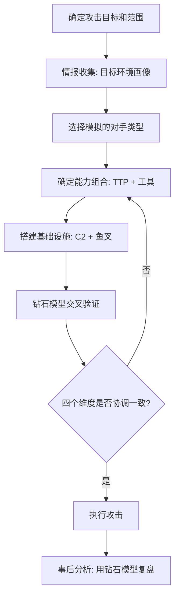

## 26.1.4 钻石模型（Diamond Model）

### 引言：为什么需要钻石模型

在网络安全分析中，分析师每天面对海量的告警、日志和威胁情报。一个核心挑战是：如何将零散的安全事件组织成有意义的威胁图谱？2011年 Lockheed Martin 提出的网络杀伤链（Kill Chain）给出了攻击阶段的线性描述，但它无法回答"谁在用什么工具攻击谁"这个关键问题。2013年，Sergio Caltagirone、Andrew Pendergast 和 Christopher Betz 在论文《Introducing the Diamond Model of Intrusion Analysis》中提出了一种全新的分析范式——钻石模型（Diamond Model of Intrusion Analysis），将每个安全事件抽象为四个核心实体及其相互关系，为威胁分析提供了结构化的、可扩展的分析框架。

钻石模型的价值在于它不是一种"防御清单"，而是一种**分析思维工具**。它帮助红队规划攻击、蓝队检测威胁、情报分析师关联事件，三者共享同一个分析语言。

### 四大核心实体

钻石模型将每个安全事件（Event）分解为四个核心实体。理解每个实体的含义和边界是使用该模型的基础。

#### 对手（Adversary）

对手是发起攻击行为的个人或组织。在实际分析中，对手可以被标识为：

| 标识层级 | 示例 | 粒度 |
|---------|------|------|
| 国家级 APT 组织 | APT28（Fancy Bear）、APT41（Double Dragon） | 高度特征化，有完整 TTP 画像 |
| 犁头蛛（Crime Group） | FIN7、Carbanak | 金融犯罪驱动，工具链相对固定 |
| 黑客行动主义（Hacktivist） | Anonymous、Lizard Squad | 政治或意识形态驱动 |
| 个人攻击者 | "脚本小子"、bug bounty 猎手 | 技术水平参差，工具复用度高 |

**关键原则**：对手不等于个人。一个 APT 组织可能由数十名成员组成，分布在不同国家，各有分工。在钻石模型中，"对手"指的是整个组织实体，而非某个具体的攻击者个体。分析时应尽量将对手标识到组织级别（如 APT28），而非仅标记"某俄罗斯 IP"。

**对手画像构建**：成熟的威胁情报团队会为每个已知对手建立画像文档（Actor Profile），包含：
- 组织背景、动机（间谍、经济利益、破坏性）
- 常用基础设施特征（域名注册模式、IP 段偏好）
- 能力特征（漏洞利用偏好、恶意软件家族）
- 历史活动时间线

#### 能力（Capability）

能力是攻击者使用的工具、技术和恶意软件。能力实体可以细分为三个子维度：

- **恶意软件（Malware）**：具体的恶意程序，如 Cobalt Strike Beacon、Mimikatz、PlugX、ShadowPad
- **攻击技术（Technique）**：利用漏洞或操作系统机制的方法，如 PowerShell 文件less 执行、Pass-the-Hash、DLL 侧加载（DLL Side-Loading）
- **攻击工具（Tool）**：辅助性工具，如 Nmap 扫描器、Metasploit 框架、Bloodhound

**能力的特征标记**：

| 特征维度 | 描述 | 分析价值 |
|---------|------|---------|
| 复杂度 | 开发成本和技术门槛 | 低（脚本小子）vs 高（0day 开发） |
| 可移植性 | 跨平台/跨系统能力 | 是否需要针对特定环境定制 |
| 可重用性 | 能否在多个攻击中复用 | 重用度高→更容易关联分析 |
| 规模化 | 是否可批量部署 | 木马批量投递 vs 定向渗透 |

**能力与 ATT&CK 的映射**：在实际工作中，能力实体通常直接映射到 MITRE ATT&CK 矩阵中的技术编号（如 T1059.001 = PowerShell）。这种映射使得钻石模型与 ATT&CK 框架可以无缝配合使用——钻石模型负责结构化事件，ATT&CK 负责标准化描述。

#### 基础设施（Infrastructure）

基础设施是攻击者在攻击过程中使用的通信渠道和资源。与能力不同，基础设施是可观察的——它通常会留下网络痕迹，是检测和追踪攻击者的关键线索。

**基础设施的分类**：

```text
基础设施
├── 硬件层
│   ├── 被入侵的合法服务器（水坑攻击）
│   ├── 攻击者自建 C2 服务器
│   └── VPS/云主机
├── 软件层
│   ├── 域名（C2 域名、钓鱼域名）
│   ├── IP 地址
│   ├── CDN 和反向代理
│   └── 云服务（AWS、Azure、腾讯云）
├── 社交层
│   ├── 鱼叉式钓鱼邮箱
│   ├── 虚假社交账号
│   └── 水坑网站
└── 第三方服务
    ├── 公网文件托管（Pastebin、GitHub）
    ├── DNS over HTTPS（DoH）
    └── 合法 SaaS 平台滥用
```

**基础设施的生命周期**：攻击者会不断轮换基础设施。以 C2 基础设施为例，一个成熟的 APT 组织通常遵循以下模式：

1. **注册期**：购买域名、搭建 VPS，设置 C2 服务端
2. **激活期**：通过钓鱼或漏洞利用建立初始连接
3. **驻留期**：维持 C2 通道，执行横向移动
4. **废弃期**：检测到暴露后弃用，注册新基础设施

**关键分析原则**：不要将基础设施等同于攻击者。IP 地址可能被 VPN 掩盖、域名可能被劫持、基础设施可能是租用的。分析时需要区分"攻击者控制的"和"攻击者使用的"——前者是持久的（如注册的域名），后者是临时的（如租用的 VPS）。

#### 受害者（Victim）

受害者是被攻击的目标，可以是个人、组织、系统或网络。受害者实体的分析维度包括：

- **组织类型**：政府机构、金融机构、科技企业、医疗单位等
- **地理分布**：受害者所在的国家或地区，关联攻击者的地理定向
- **行业特征**：是否属于特定行业的定向攻击
- **技术环境**：操作系统版本、网络架构、安全防护能力
- **业务价值**：攻击者针对的数据类型（知识产权、金融数据、个人隐私）

**受害者分析的关键洞察**：受害者不只是被动的承受者。通过分析受害者的共性（如共同使用某个软件供应商、共同的地理位置），可以推断攻击者的定向策略和能力边界。

### 六种关系与攻击事件的完整结构

钻石模型的四个实体之间存在六种关系，每种关系都对应着攻击链条中的一个环节：

```text
         对手（Adversary）
        / |  \
       /  |   \
      ↕   ↕    ↕
基础设施 —— 能力 —— 受害者
（六种关系：对手↔基础设施、对手↔能力、对手↔受害者、
  能力↔基础设施、能力↔受害者、基础设施↔受害者）
```

**关系映射到攻击活动的具体解释**：

| 关系 | 含义 | 攻击活动中的体现 | 检测线索 |
|------|------|-----------------|---------|
| 对手 → 基础设施 | 对手选择和控制基础设施 | 注册域名、购买 VPS、租用服务器 | WHOIS 记录、IP 注册信息 |
| 对手 → 能力 | 对手开发和使用攻击工具 | 开发恶意软件、购买 0day | 恶意软件代码特征、编译环境 |
| 对手 → 受害者 | 对手选择和针对目标 | APT 定向攻击特定行业 | 攻击目标的共性分析 |
| 能力 ↔ 基础设施 | 工具通过基础设施投递和控制 | 恶意软件从 C2 下载、钓鱼附件投递 | 网络流量特征、DNS 查询 |
| 能力 ↔ 受害者 | 工具对受害者系统产生影响 | 利用漏洞、提权、数据窃取 | EDR 告警、系统日志异常 |
| 基础设施 ↔ 受害者 | 基础设施与受害者系统建立通信 | C2 回连、数据外传 | 出站流量、DNS 解析异常 |

### 核心概念：事件、活动与钻石模型的层级结构

钻石模型区分了三个关键概念，这对正确使用模型至关重要：

**事件（Event）**：最小的分析单元。一个事件是发生在特定时间点的、由四个实体共同参与的安全活动。例如："2024年3月15日，APT28 使用 Cobalt Strike 通过邮件投递攻击了某能源公司"。

**活动（Activity）**：一组相关事件的聚合。同一对手在不同时间、针对不同目标使用相似 TTP 的行为构成一个活动。例如：APT28 在2024年上半年针对欧洲政府的系列钓鱼攻击。

**事件链（Event Chain）**：通过钻石模型的四个实体进行"锚点分析"（Pivot Analysis），将多个事件关联成完整的攻击活动图谱。这是钻石模型最强大的分析能力——从一条线索出发，顺藤摸瓜，还原攻击者的完整操作。

**锚点分析的工作流程**：

```mermaid
graph LR
    A[已知事件] --> B{识别四个实体}
    B --> C[对手: APT28]
    B --> D[能力: Cobalt Strike]
    B --> E[基础设施: evil-c2[.]com]
    B --> F[受害者: 某能源公司]
    D --> G[搜索: 使用 Cobalt Strike 的其他事件]
    E --> H[搜索: 使用该域名的其他事件]
    G --> I[发现: 关联事件1, 2, 3...]
    H --> I
    I --> J[构建完整活动图谱]
```

**具体操作示例**：

假设蓝队在一次事件中检测到：
- 恶意 PowerShell 脚本（能力）
- 通过 C2 域名 `cdn-update[.]top` 回连（基础设施）
- 受害者是某政府部门

蓝队可以执行以下锚点分析：

1. **以能力为锚点**：在全局日志中搜索相同 PowerShell 脚本的特征（如特定的 Base64 编码模式），发现另外3台主机执行了类似脚本
2. **以基础设施为锚点**：查询 DNS 日志，发现 `cdn-update[.]top` 在过去30天内与12台主机通信过
3. **交叉验证**：将两组结果取交集，识别出完整的受害范围
4. **以受害组织为锚点**：将发现的 TTP 提交给威胁情报平台，检索是否有其他组织也受到相同对手的攻击

这就是钻石模型在实战中的核心价值——**从单点发现推断全局态势**。

### 钻石模型 vs 其他分析框架

钻石模型并非孤立使用，它与 Kill Chain、MITRE ATT&CK 等框架各有侧重，可以互补使用：

| 对比维度 | 钻石模型 | Kill Chain | MITRE ATT&CK |
|---------|---------|-----------|--------------|
| 核心视角 | 事件分析（谁-用什么-对谁-通过什么） | 攻击阶段（线性流程） | 战术-技术-过程（矩阵） |
| 分析焦点 | 事件关联和情报推断 | 攻击进度和防御缺口 | 技术检测和防护能力 |
| 实体模型 | 4实体+6关系 | 7个线性阶段 | 14个战术×数百个技术 |
| 情报价值 | 高（直接支撑对手画像） | 中（偏描述性） | 高（标准化语义） |
| 适用场景 | 威胁情报分析、事件调查 | 攻防演练规划、防御评估 | SOC 检测规则编写、红队 TTP 选择 |
| 数据要求 | 最低（只需要四要素信息） | 中等（需要完整攻击流程） | 高（需要技术级别的细节） |

**最佳实践**：在实际工作中，三者配合使用效果最佳：
- 用 **钻石模型** 结构化安全事件，识别对手特征
- 用 **Kill Chain** 评估攻击所处阶段，判断剩余风险
- 用 **ATT&CK** 标准化 TTP 描述，编写检测规则

### 红队视角：用钻石模型规划攻击

钻石模型不仅是一种防御分析工具，对红队的攻击规划同样有价值。

**攻击规划矩阵**：

红队在规划行动时，可以系统化地填充钻石模型的四个维度，确保攻击方案的完整性和隐蔽性：

| 规划维度 | 红队决策 | 示例 |
|---------|---------|------|
| 对手模拟 | 模拟哪个 APT 组织的 TTP | 模拟 APT29 的供应链攻击模式 |
| 能力选择 | 选择合适的攻击工具链 | Cobalt Strike + Mimikatz + Rubeus |
| 基础设施 | 搭建隐蔽的 C2 和投递基础设施 | 基于云 CDN 的域前置（Domain Fronting） |
| 受害者画像 | 了解目标的防护能力和环境特征 | 目标使用 EDR、有网络分段 |

**攻击规划的系统化流程**：



**隐蔽性设计原则**：成熟的红队会刻意模仿真实对手的能力和基础设施特征，以避免被防御方识别为"已知对手"。例如，如果模拟 APT28，应使用与 APT28 相似的技术特征（如相似的 C2 通信模式、代码混淆方式），同时避免使用红队独有的工具特征（如未加混淆的默认 Cobalt Strike 配置）。

### 蓝队视角：用钻石模型进行检测和响应

蓝队使用钻石模型的核心思路是：**在任何一个维度上发现线索后，通过锚点分析扩展到其他维度，实现全面检测**。

**检测策略框架**：

| 检测层级 | 检测维度 | 具体手段 | 检测优先级 |
|---------|---------|---------|-----------|
| 网络层 | 基础设施 ↔ 受害者 | DNS 异常检测、C2 通信识别 | 高（最早可检测） |
| 主机层 | 能力 ↔ 受害者 | EDR 行为检测、内存扫描 | 高（最直接影响） |
| 身份层 | 对手 → 受害者 | 异常登录、权限滥用检测 | 中 |
| 情报层 | 对手 ↔ 能力 | TTP 匹配、IOCs 对比 | 中 |
| 基础设施层 | 对手 → 基础设施 | 域名/IP 信誉查询 | 高（被动检测） |

**事件响应中的钻石模型应用**：

在事件响应中，钻石模型提供了一种结构化的分析方法：

1. **初步分类**：将初始告警映射到四个实体，确认是否为真实安全事件
2. **锚点扩展**：选择最强的实体线索作为锚点，向外扩展搜索
3. **关联分析**：将新发现的事件与已知威胁情报对比，尝试识别对手
4. **范围确认**：通过多维度锚点分析确认攻击范围
5. **情报输出**：将分析结果格式化为标准威胁情报报告（STIX/TAXII 格式）

### 实战案例：用钻石模型分析 SolarWinds 供应链攻击

SolarWinds 事件（2020年12月披露）是钻石模型分析的经典案例。以下是用钻石模型对这一事件的结构化拆解：

**事件概述**：攻击者（APT29/Cozy Bear）通过入侵 SolarWinds 的软件构建环境，在 Orion 平台的更新包中植入后门（SUNBURST），影响了约18,000个组织。

| 实体 | 分析结果 |
|------|---------|
| **对手** | APT29（Cozy Bear），关联俄罗斯对外情报局（SVR）。该组织在 SolarWinds 事件前已有多次攻击西方政府的记录，使用供应链攻击手法 |
| **能力** | SUNBURST 后门（嵌入在合法 SolarWinds Orion 补丁中）、Teardrop 加载器、Raindrop 第二阶段恶意软件。使用高隐蔽性技术：DNS 隐写通信、合法代码签名、内存驻留 |
| **基础设施** | avsvmcloud[.]com（SUNBURST 的 C2 域名），通过 DNS 生成算法（DGA）与受害主机通信。C2 通信伪装为合法 Orion 流量 |
| **受害者** | 约18,000个组织安装了恶意更新，其中约100个被实际渗透，包括美国财政部、国土安全部、微软、FireEye 等 |

**锚点分析过程**：

```mermaid
graph TD
    A[FireEye 检测到 Red Team 工具被盗] --> B[追踪到 SUNBURST 后门]
    B --> C[以能力为锚点: SUNBURST 代码特征]
    C --> D[全局搜索: 所有安装受感染 SolarWinds 的主机]
    B --> E[以基础设施为锚点: avsvmcloud[.]com DNS 日志]
    E --> F[识别所有 C2 回连的受害主机]
    D --> G[确认攻击范围: ~100个被实际渗透的组织]
    F --> G
    G --> H[以对手为锚点: 关联 APT29 历史活动]
    H --> I[发现: APT29 之前使用过类似的供应链攻击手法]
    I --> J[输出: 完整威胁情报报告]
```

**从这一案例中提取的关键洞察**：

1. **能力维度的隐蔽性**：SUNBURST 嵌入在合法更新中，签名有效，常规检测手段几乎无法识别
2. **基础设施维度的合法性**：C2 域名伪装为云服务，通信流量混入正常业务流量
3. **受害者维度的广泛性**：供应链攻击的特点是"一对多"，一个能力影响数千个受害者
4. **对手维度的高级性**：APT29 展示了入侵软件构建环境的能力，这是最高级别的技术门槛

### 钻石模型的扩展与演进

随着威胁态势的变化，钻石模型也在不断演进：

**活动-事件-关系三层模型**：

原始钻石模型关注单个事件，但在实际分析中，分析师需要在多个层级上工作。扩展后的模型区分了三个层级：

- **活动层级（Activity）**：对手的长期战略目标和操作模式
- **事件层级（Event）**：具体的攻击操作实例
- **关系层级（Relationship）**：实体之间的具体连接方式

**钻石模型与 ATT&CK 的整合**：

越来越多的组织将钻石模型与 ATT&CK 矩阵整合使用：

```text
钻石模型（结构化事件）
  ├── 对手 → ATT&CK Groups（G0016, G0007...）
  ├── 能力 → ATT&CK Techniques（T1566, T1059...）
  ├── 基础设施 → ATT&CK Data Sources
  └── 受害者 → 资产清单 + 风险评估
```

**STIX/TAXII 标准化输出**：

钻石模型的分析结果可以用 STIX（Structured Threat Information Expression）标准格式输出，实现自动化的情报共享：

- 对手 → `threat-actor` 对象
- 能力 → `malware` + `attack-pattern` 对象
- 基础设施 → `infrastructure` 对象
- 受害者 → `victim` 对象（STIX 2.1 新增）

### 常见误区与纠正

| 误区 | 正确理解 |
|------|---------|
| "钻石模型是一种防御框架" | 钻石模型是**分析框架**，红蓝双方都可使用，不只是防御工具 |
| "每个实体只能对应一个" | 一次事件可能涉及多个能力（如 Metasploit + Mimikatz + Cobalt Strike） |
| "基础设施等于 IP 地址" | 基础设施包括域名、社交账号、云服务等多种类型，远不止 IP |
| "受害者只是被动承受" | 分析受害者的共性可以揭示攻击者的定向策略 |
| "四个实体是独立分析的" | 钻石模型的核心价值在于实体间的**关系**，而非实体本身 |
| "钻石模型可以替代 ATT&CK" | 两者是互补关系：钻石模型负责事件结构化，ATT&CK 负责技术标准化 |
| "分析完四个实体就够了" | 实际操作中需要深入每个实体的子维度，否则分析会流于表面 |

### 工具与平台支持

以下是支持钻石模型分析的工具和平台：

| 工具/平台 | 类型 | 钻石模型支持方式 |
|----------|------|-----------------|
| MISP（Malware Information Sharing Platform） | 开源威胁情报平台 | 支持 STIX 对象，可存储钻石模型四要素 |
| OpenCTI | 开源威胁情报平台 | 原生支持钻石模型关系图谱 |
| Analyst Workbench（Microsoft） | 商业平台 | 与 Sentinel 集成，支持事件关联分析 |
| CRITs | 开源威胁情报数据库 | 早期支持钻石模型，社区维护 |
| ThreatConnect | 商业平台 | 提供钻石模型可视化和锚点分析功能 |
| 自定义脚本 | Python + Neo4j | 构建自定义的钻石模型关系图谱 |

**最小可行方案**：即使没有专业工具，也可以用 Excel 表格组织钻石模型四要素。关键是建立系统化的记录习惯，将每个安全事件的四要素结构化记录，为后续的锚点分析积累数据。

### 高级应用：钻石模型的链式分析

对于复杂的多阶段攻击，单次钻石模型分析不足以还原完整图谱。此时需要使用**钻石模型链式分析**：

**分析步骤**：

1. **识别每个攻击阶段的独立钻石模型**：侦察阶段、初始入侵阶段、横向移动阶段、数据窃取阶段，每个阶段都是一个独立的钻石
2. **通过共享实体链接多个钻石**：如果两个阶段共享相同的对手或基础设施，说明它们属于同一活动
3. **构建活动级钻石模型**：将多个阶段的钻石聚合为一个活动级模型，描述完整的攻击操作

**链式分析的价值**：

- 识别攻击者的**真实能力边界**：通过多个阶段的分析，判断攻击者是"一招鲜"还是"全面手"
- 发现**隐藏的基础设施**：通过链式追踪，找到攻击者未主动使用的备用基础设施
- 预测**下一步行动**：基于已知的活动模式，推断攻击者可能的后续操作

### 小结

钻石模型的核心贡献在于它将安全事件从"线性描述"提升为"结构化分析"。四实体六关系的框架看似简单，但在实际应用中提供了强大的分析能力：

- **红队**：用钻石模型系统化规划攻击，确保能力、基础设施、目标的协调性
- **蓝队**：用锚点分析从单点发现扩展到全面检测，提升威胁发现的覆盖面
- **情报分析师**：用钻石模型结构化事件信息，通过锚点关联构建完整的对手画像

掌握钻石模型不仅是理解一个分析框架，更是培养一种**结构化思维**——面对复杂的网络威胁，先拆解为实体和关系，再通过关系推断未知。这种思维方式是高级威胁分析的基石。
