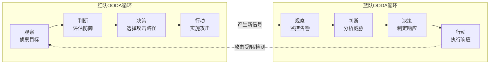

## 26.1.5 OODA 循环：攻防对抗的速度引擎

### 概述

在红蓝对抗的瞬息万变中，有一条铁律：**谁的决策循环更快，谁就掌握战场主动权**。这条铁律的理论根基，正是美国空军战略家 John Boyd 上校于 20 世纪 60 年代提出的 OODA 循环（Observe-Orient-Decide-Act）。

OODA 循环最初用于空战格斗——Boyd 发现，能够在"观察-判断-决策-行动"循环中比对手更快完成一轮迭代的飞行员，几乎总能占据优势。这一理论后来被军事战略、商业竞争、危机管理等领域广泛借用，而在网络安全攻防对抗中，它的解释力和实用价值尤为突出：红蓝双方本质上就是在进行一场OODA 速度竞赛。

---

### John Boyd 与 OODA 循环的起源

#### 历史背景

John Boyd（1927-1997）是美国空军战斗机飞行员和军事战略家，绰号"40 秒 Boyd"——他曾在朝鲜战争后的空战模拟中创下 40 秒内击败所有对手的记录。Boyd 通过研究朝鲜战争中美军 F-86 与苏联 MiG-15 的空战数据，发现了一个关键现象：

- F-86 在技术参数上并不全面优于 MiG-15
- 但 F-86 拥有更好的座舱视野和更快的液压操控系统
- 这使得 F-86 飞行员能更快地完成"观察-判断-决策-行动"循环
- 更快的循环意味着飞行员能更早发现态势变化并做出反应

基于此观察，Boyd 发展出完整的 OODA 理论，并在 1976 年的论文"Patterns of Conflict"中正式阐述。该理论后来成为美国海军陆战队作战哲学的基石之一。

#### 从空战到网络安全

OODA 循环被引入网络安全领域并非偶然。网络攻防与空战有惊人的结构相似性：

| 空战 | 网络攻防 |
|------|----------|
| 飞行员观察雷达/视觉信息 | 防御方监控网络流量、日志、告警 |
| 判断敌机意图和态势 | 分析攻击行为的性质、来源、影响 |
| 决定机动方案 | 制定响应策略（隔离、阻断、溯源） |
| 执行机动动作 | 部署防火墙规则、隔离主机、恢复系统 |
| 敌方同时执行 OODA | 攻击者同步进行侦察、渗透、提权、横移 |

这种结构性对应使得 OODA 循环成为理解攻防动态的天然框架。

---

### OODA 循环的四个阶段深度解析

#### 1. 观察（Observe）：信息收集与感知

观察是 OODA 循环的起点，对应网络安全中的态势感知（Situational Awareness）。在攻防对抗中，观察的质量直接决定了后续决策的基础。

**蓝队的观察内容：**

- **网络流量**：NetFlow/sFlow 数据、全流量分析、DNS 查询日志、HTTP 访问日志
- **终端行为**：EDR 遥测数据（进程创建、文件修改、注册表变更、网络连接）
- **用户活动**：认证日志（成功/失败）、权限变更、异常登录时间/地点
- **威胁情报**：IOC（失陷指标）、TTP（战术/技术/过程）、漏洞情报
- **外部信号**：暗网情报、行业共享告警、供应商安全公告

**红队的观察内容：**

- **目标网络结构**：端口扫描结果、服务指纹、网络拓扑
- **防御机制**：IDS/IPS 签名、WAF 规则、EDR 部署范围
- **用户行为模式**：管理员登录习惯、邮件网关行为、VPN 使用规律
- **内部信息泄露**：GitHub 代码泄露、LinkedIn 员工信息、Paste 站敏感数据

**观察阶段的关键挑战：**

- **信息过载**：安全运营中心（SOC）日均告警量可达数万条，其中 90%+ 为误报
- **信息不足**：高级威胁（如 APT）刻意规避检测，留给防御方的可见信号极少
- **信号延迟**：从攻击发生到被观察到可能存在数小时甚至数天的滞后（dwell time）

**提升观察能力的实践方法：**

- 部署 SIEM 并建立高质量的关联规则（如 Sigma 规则）
- 实施 NDR（网络检测与响应）以获得网络层可见性
- 建立威胁情报订阅和共享机制（如 STIX/TAXII）
- 定期进行 Purple Team 演练以校准检测盲区

---

#### 2. 判断（Orient）：分析与态势理解

判断是 OODA 循环中最复杂也最关键的阶段。Boyd 强调，判断是"整个循环的重心"（the Schwerpunkt），因为它决定了观察到的信息如何被解读。

Boyd 将判断阶段进一步分解为四个子过程：

- **遗传继承**（Genetic Heritage）：预设的思维模式和反应倾向
- **文化传统**（Cultural Traditions）：组织的安全文化和惯例
- **先前经验**（Previous Experiences）：历史事件的处理经验
- **新信息的分析与合成**（Analysis and Synthesis）：将新信息与已有认知融合

**在网络安全中，判断阶段的具体任务：**

- **攻击识别**：将观察到的指标映射到已知攻击模式（MITRE ATT&CK 矩阵）
- **影响评估**：判断被攻击资产的业务重要性、数据敏感性、横向扩散风险
- **归因分析**：区分脚本小子的随机扫描与 APT 组织的定向攻击
- **优先级排序**：在多个告警中确定最需要立即响应的事件

**判断阶段的常见陷阱：**

- **确认偏误**（Confirmation Bias）：只关注支持自己假设的证据，忽略矛盾信号
- **锚定效应**（Anchoring）：过度依赖首次获取的信息，难以修正初始判断
- **分析瘫痪**（Analysis Paralysis）：面对复杂态势迟迟无法形成判断，错过响应窗口
- **情境正常化**（Normalcy Bias）：倾向于将异常解读为正常波动

**案例：SolarWinds 供应链攻击中的判断失误**

2020 年 SolarWinds 攻击事件中，攻击者（APT29/Cozy Bear）通过供应链注入后门进入多个美国政府机构和企业网络。在判断阶段，防御方犯了关键错误：

- 多个组织的 SOC 将 SolarWinds 更新进程的异常网络连接归类为"合法软件更新"
- FireEye（最先发现攻击的安全公司）的 MDR 团队将早期告警误判为红队内部测试活动
- 直到 FireEye 红队工具被盗这一明显异常出现，才触发了深入调查

教训：判断阶段不能仅依赖预设规则，必须保持对"意料之外"的开放性。

**提升判断能力的实践方法：**

- 建立基于 MITRE ATT&CK 的威胁知识库，形成系统化的攻击模式认知
- 定期进行 TTP 分析训练（如分析真实攻击案例的 Kill Chain）
- 引入机器学习辅助异常检测，减少人工判断的主观偏差
- 建立"红队思维"——主动质疑自己的假设，考虑替代解释

---

#### 3. 决策（Decide）：方案制定与选择

决策是将判断结果转化为具体行动计划的过程。在网络安全中，决策的质量取决于三个要素：**速度、准确性和可执行性**。

**蓝队的决策场景：**

| 场景 | 决策选项 | 速度要求 |
|------|----------|----------|
| 检测到活跃入侵 | 隔离受影响主机 / 跟踪监控 / 全网扫描 | 分钟级 |
| 发现 0day 漏洞利用 | 紧急补丁 / 虚拟补丁 / 网络隔离 | 小时级 |
| 确认数据泄露 | 通知受影响方 / 上报监管 / 启动取证 | 天级 |
| 疑似内部威胁 | 锁定账户 / 取证调查 / 法律介入 | 小时-天级 |

**红队的决策场景：**

| 场景 | 决策选项 | 速度要求 |
|------|----------|----------|
| 初始访问被检测 | 切换攻击路径 / 暂停撤退 / 继续推进 | 秒级 |
| 获得域管权限 | 立即利用 / 横向扩展 / 隐蔽持久化 | 分钟级 |
| 目标主机离线 | 等待恢复 / 切换备用 / 放弃该目标 | 分钟级 |
| 发现蜜罐痕迹 | 撤离 / 欺骗检测 / 伪装正常行为 | 秒级 |

**决策质量的影响因素：**

- **信息完备性**：判断阶段提供的信息越完整，决策质量越高
- **预案成熟度**：事先制定的应急响应预案（IR Plan）能显著加速决策
- **权限集中度**：决策者是否有足够的权限快速执行所需动作
- **组织协调**：跨部门（IT、安全、法务、公关）的协调机制

**提升决策能力的实践方法：**

- 制定并维护详细的安全事件应急响应预案（Playbook）
- 建立分级决策机制：明确不同级别事件的决策权限和流程
- 进行桌面推演（Tabletop Exercise）和实战演练以检验决策流程
- 使用 SOAR 平台将常见决策场景自动化（如自动隔离受感染主机）

---

#### 4. 行动（Act）：执行与反馈

行动是将决策付诸实施的阶段，同时行动的结果会产生新的观察信号，驱动下一轮 OODA 循环。

**蓝队的典型行动：**

- **阻断**：更新防火墙规则、封锁恶意 IP/域名、禁用受攻陷账户
- **隔离**：将受感染主机从网络隔离、禁用受影响的服务账户
- **取证**：保存内存快照、磁盘镜像、网络流量捕获
- **恢复**：从备份还原系统、重置凭据、修补漏洞
- **通报**：向监管机构报告、通知受影响用户、协调行业共享

**红队的典型行动：**

- **利用**：执行漏洞利用代码、部署后门、建立 C2 通道
- **横移**：传递哈希/票据、利用横向移动工具（如 Rubeus、Impacket）
- **持久化**：写入计划任务、注册服务、植入启动项
- **数据收集**：定位敏感文件、抓取凭据、截取屏幕
- **清除痕迹**：删除日志、修改时间戳、清理工具残留

**行动阶段的反馈循环：**

行动不仅是 OODA 的终点，更是下一轮循环的起点。例如：

```text
蓝队阻断恶意IP → 观察攻击者是否切换IP
                 → 判断新的攻击来源
                 → 决定是否需要更广泛的阻断
                 → 执行新的阻断策略
```

---

### 攻防双方的 OODA 竞争模型

在红蓝对抗中，攻防双方实际上在进行一场 OODA 循环速度竞赛。理解这一竞争模型是制定攻防策略的基础。



#### 不对称性：红队的天然优势

攻击方在 OODA 竞争中具有结构性优势，原因如下：

- **主动性**：攻击方可以选择何时、何地发动攻击，掌握"时间窗口"的选择权
- **信息优势**：攻击方在渗透前已通过侦察获取了目标环境信息，O 阶段可大幅压缩
- **隐蔽性**：攻击方可以控制行动的可见度，延迟蓝队的观察触发
- **计划性**：攻击方事先规划了多条攻击路径，D 阶段可预置决策

用公式表达：

```text
红队 OODA ≈ O(小) + O(小) + D(预置) + A(选择性)
蓝队 OODA ≈ O(被动触发) + O(全量分析) + D(紧急) + A(紧急)
```

#### 蓝队的反制策略：打破红队的 OODA

蓝队打破劣势的核心策略是**增加红队 OODA 循环的成本和时间**：

1. **干扰红队的观察（O）**
   - 部署欺骗技术（Deception）：蜜罐、蜜令牌、蜜文件
   - 实施最小信息暴露原则：减少公开面、混淆服务指纹
   - 部署反侦察检测：识别扫描行为并主动告警

2. **混淆红队的判断（O）**
   - 部署主动防御：动态变更网络拓扑、定期轮换凭据
   - 实施网络分段：限制攻击者的信息获取范围
   - 使用多因素认证：增加凭据利用的判断复杂度

3. **迫使红队频繁重新决策（D）**
   - 部署 EDR 的行为检测：使静态攻击路径失效
   - 实施网络微分段：每次横向移动都需要新的攻击决策
   - 定期更换服务配置：使攻击者的预设方案过时

4. **延长红队的行动（A）**
   - 实施零信任架构：即使获得初始访问也难以推进
   - 部署用户行为分析（UEBA）：增加内部移动的检测概率
   - 建立快速响应机制：在攻击完成前阻断攻击链

---

### 速度是关键：OODA 竞争的时间维度

#### OODA 速度的量化指标

| 指标 | 定义 | 行业基准 | 优秀水平 |
|------|------|----------|----------|
| MTTD（平均检测时间） | 从攻击发生到被发现的时间 | 数月至一年 | 数小时以内 |
| MTTR（平均响应时间） | 从发现到开始响应的时间 | 数小时至数天 | 数分钟以内 |
| MTTC（平均遏制时间） | 从响应到成功遏制的时间 | 数天 | 数小时以内 |
| 攻击者 dwell time | 攻击者在网络中的停留时间 | 200+ 天 | <7 天 |

2023 年 IBM 数据泄露成本报告指出， dwell time 低于 200 天的事件平均损失为 393 万美元，而超过 200 天的事件平均损失为 495 万美元——**每缩短一天的检测时间，都在直接降低损失**。

#### 加速蓝队 OODA 的关键工具

| OODA 阶段 | 加速工具/技术 | 效果 |
|-----------|---------------|------|
| 观察（O） | SIEM + NDR + EDR + XDR | 提升检测覆盖度和速度 |
| 观察（O） | 威胁情报平台（TIP） | 预置已知攻击信号的检测规则 |
| 判断（O） | MITRE ATT&CK 映射 | 结构化理解攻击意图 |
| 判断（O） | ML 异常检测 | 自动化识别未知威胁模式 |
| 决策（D） | 应急响应 Playbook | 减少人工决策延迟 |
| 决策（D） | SOAR 平台 | 自动化常见响应决策 |
| 行动（A） | 自动化隔离/阻断 | 从分钟级降至秒级 |
| 行动（A） | 网络自动化编排 | 实时动态调整防御策略 |

#### SOAR：蓝队 OODA 的加速器

安全编排、自动化与响应（SOAR）平台是加速蓝队 OODA 循环的核心工具：

- **观察阶段**：自动从多个数据源汇聚告警，去重关联
- **判断阶段**：基于预定义规则自动评估告警严重性，调用威胁情报验证 IOC
- **决策阶段**：匹配 Playbook，自动选择响应策略（无需人工审批）
- **行动阶段**：自动执行隔离、阻断、通知等动作

典型 SOAR 加速效果：将一个需要 4 小时人工处理的安全事件，压缩到 15 分钟内自动完成初始响应。

---

### 高级应用：OODA 在攻防演练中的实战运用

#### 红队如何利用 OODA 设计攻击

成熟的红队在设计攻击行动时，会系统性地考虑如何压缩己方 OODA 并拉长蓝队 OODA：

**压缩红队 OODA 的方法：**

- **预先侦察**：在攻击窗口前完成目标环境的完整画像，O 和 O 阶段前置化
- **自动化工具链**：使用 Cobalt Strike、Sliver 等框架内置的自动化工作流
- **预置决策树**：针对"如果被检测到则..."场景事先编写脚本
- **团队分工**：不同成员分别负责侦察、利用、C2 管理、数据提取

**拉长蓝队 OODA 的方法：**

- **利用合法工具**（Living off the Land）：使用 PowerShell、WMI 等系统工具，减少恶意软件检测
- **低速慢速攻击**：降低活动频率以避免触发阈值告警
- **混淆与伪装**：将攻击流量伪装为合法业务流量
- **多方向同时行动**：迫使蓝队分散注意力，无法集中资源处理单一攻击链

#### 蓝队如何利用 OODA 构建纵深防御

**构建"提前观察"能力：**

- 在攻击者侦察阶段就部署检测（如蜜罐检测到扫描行为）
- 利用主动防御技术获取攻击者意图的早期信号
- 建立行业情报共享网络，获取其他组织已观测到的攻击前兆

**加速"快速判断"能力：**

- 建立 MITRE ATT&CK 知识库并与 SIEM 规则自动关联
- 部署 UEBA 建立用户行为基线，异常自动标记
- 定期进行威胁情报更新，确保判断知识库不过时

**实现"即时决策"能力：**

- 制定分级 Playbook，明确各级别事件的标准响应流程
- 建立自动化审批机制（如 SOAR 预授权常见响应动作）
- 实施"默认隔离"策略：疑似攻击自动进入隔离流程，事后验证

**达到"精准行动"能力：**

- 部署微分段隔离：限制单点失陷的影响范围
- 建立自动化取证能力：在响应的同时自动保留证据
- 实施"热备份 + 冷备份"双重保障，确保系统可快速恢复

---

### 紫队视角：OODA 循环的协同优化

紫队（Purple Team）的核心价值在于通过攻防协同，同时优化双方的 OODA 循环：

- **校准观察能力**：红队攻击暴露蓝队的检测盲区 → 蓝队调整检测规则 → 提升观察阶段的覆盖率
- **训练判断能力**：红队提供真实攻击场景 → 蓝队分析和映射到 ATT&CK → 提升判断的准确性和速度
- **验证决策流程**：红队模拟不同攻击场景 → 蓝队执行 Playbook → 识别决策瓶颈并优化
- **评估行动效果**：红队评估蓝队响应措施的实际效果 → 双方共同改进防御策略

定期的 Purple Team 演练是优化整体 OODA 竞争能力的最有效手段——它让蓝队在受控环境中"练习"更快的循环，同时让红队发现更有效的攻击路径。

---

### 常见误区与纠正

**误区一：OODA 循环是线性的**

纠正：OODA 循环并非严格的顺序流程，而是可以并行、嵌套、回溯的动态过程。例如，判断阶段发现新信息后可能需要补充观察；行动阶段的反馈可能立即触发新的判断。在实际运营中，多个 OODA 循环可能同时运行在不同层级。

**误区二：速度是唯一追求**

纠正：速度重要，但准确性同样关键。在安全响应中，错误的快速行动（如误隔离核心业务系统）可能造成比攻击本身更大的损失。目标应是"在可接受的准确性约束下最大化速度"。

**误区三：OODA 只适用于事件响应**

纠正：OODA 循环适用于网络安全的各个层面——从日常安全运营、漏洞管理、威胁狩猎到战略安全规划，都可以用 OODA 框架来分析和优化。

**误区四：自动化能完全取代人工OODA**

纠正：自动化能加速特定场景的 OODA 循环，但复杂事件（如零日攻击、高级持续威胁）仍需人工深度分析。最佳实践是"人在回路"（Human-in-the-Loop）模式：自动化处理常见场景，人工专注于复杂判断。

---

### 实战检验清单

在你的安全团队中，可以用以下问题检验 OODA 循环的健康度：

| 检验项 | 健康指标 | 警告信号 |
|--------|----------|----------|
| 观察能力 | 关键资产告警覆盖率 > 90% | 核心资产无监控覆盖 |
| 判断能力 | 告警 → 确认威胁的转化率 > 10% | 大量告警无人分析 |
| 决策能力 | 从确认到启动响应 < 30 分钟 | 决策需要多级审批超过 4 小时 |
| 行动能力 | 从启动到完成遏制 < 2 小时 | 手动操作依赖单人执行 |
| 反馈闭环 | 每次事件后有复盘和 Playbook 更新 | 事后无分析、无改进 |
| 整体速度 | MTTD < 24 小时，MTTR < 4 小时 | MTTD 超过 30 天 |

---

### 总结

OODA 循环为网络安全攻防提供了一个简洁而深刻的分析框架。它的核心洞见是：**攻防对抗的本质是决策速度的竞争**。

对蓝队而言，构建高效 OODA 循环的关键路径是：

1. **投资可见性**（观察）：确保能看到攻击者的行为
2. **建设知识库**（判断）：确保能快速理解攻击的含义
3. **预置决策流程**（决策）：确保能在压力下做出正确选择
4. **自动化响应**（行动）：确保能快速执行响应动作

对红队而言，利用 OODA 框架的关键在于：系统性地压缩己方循环时间，同时通过隐蔽、混淆和多点并行行动来拉长蓝队的循环时间。

对紫队而言，定期的联合演练是同步提升双方 OODA 能力的最有效方式，最终目标是构建一个"比攻击者更快发现、更快理解、更快响应"的防御体系。
