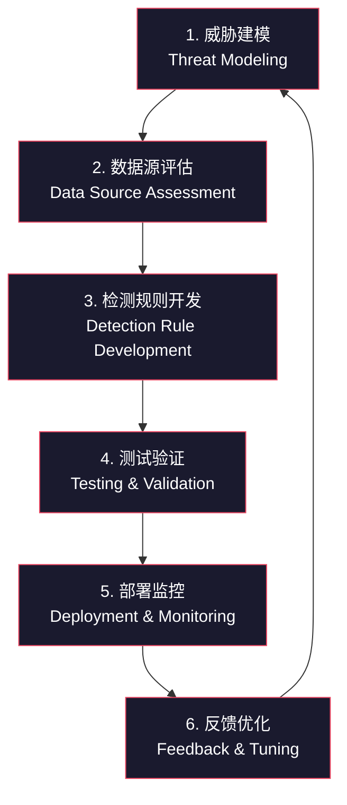
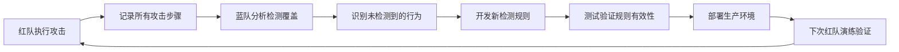

## 26.1.6 假设驱动的安全模型

### 引言：为什么传统安全模型正在失效

长期以来，网络安全的主流思路是"筑墙防御"——部署防火墙、入侵检测系统、防病毒软件，把攻击者挡在外面。这种模型隐含一个核心假设：**攻击者会被防线阻止**。然而，现实一次又一次地证明这个假设是错误的。

根据 IBM《2024 数据泄露成本报告》，全球数据泄露的平均成本已达到 488 万美元，而企业发现并遏制一次入侵的平均时间仍然超过 200 天。这意味着攻击者一旦突破外围，就能在内部潜伏数月之久。传统的"城堡护城河"模型面对这种现实已经力不从心。

假设驱动的安全模型（Assumption-Driven Security Model）正是为应对这一困境而生。它的核心哲学用一句话概括就是：**不要假设你能阻止所有攻击，而要假设攻击者已经进来了，然后在此前提下构建你的安全能力**。

本节将深入讲解这一模型的理论基础、核心理念、实施框架以及它与红队/蓝队/紫队协作的深度关系。

---

### 一、Assume Breach 理念

#### 1.1 从"阻止"到"容忍"的范式转变

Assume Breach（假设已被入侵）最早由微软在 2012 年前后系统性地提出，并在其内部安全转型中大规模实践。该理念的诞生源于一个深刻的反思：

> 微软在过去十年间投入了数十亿美元加固 Windows 和 Office 的安全性，但攻击者仍然能够通过钓鱼邮件、零日漏洞或供应链攻击进入企业网络。**如果我们从一开始就假设攻击者必然会进入，我们的安全架构会是什么样子？**

这个问题催生了微软信任计算（Trustworthy Computing）的第二阶段——从"安全开发生命周期（SDL）"扩展到"全生命周期的入侵响应能力"。

Assume Breach 不是一个具体的工具或技术，而是一种**安全架构设计原则**。它的核心要求包括：

| 传统防御模型 | Assume Breach 模型 |
|---|---|
| 安全投入集中在边界防御（防火墙、WAF） | 安全投入均衡分布在预防、检测、响应、恢复四个阶段 |
| 以"阻止所有攻击"为目标 | 以"缩短攻击者驻留时间和影响范围"为目标 |
| 安全验证依赖渗透测试（年度一次） | 安全验证通过持续的红队演练和攻击模拟 |
| 内网默认可信 | 内网零信任，所有访问都需要验证 |
| 事后被动响应 | 事前主动假设并提前布防 |

#### 1.2 零信任：Assume Breach 的架构实现

Assume Breach 理念最直接的架构映射就是零信任架构（Zero Trust Architecture, ZTA）。Gartner 预测到 2025 年，超过 60% 的企业将采用零信任作为安全架构的基础。其核心原则如下：

**（1）永不信任，始终验证（Never Trust, Always Verify）**

不再区分"内网"和"外网"。每一次资源访问请求，无论来源 IP 是办公网络还是家庭 Wi-Fi，都需要经过身份认证、设备合规检查和授权评估。Google 在 2011 年遭受极光行动（Operation Aurora）攻击后，内部开发了自己的零信任方案 BeyondCorp，将所有应用从内网 VPN 中剥离出来，通过身份代理（Identity-Aware Proxy）实现访问控制。

**（2）最小权限原则（Least Privilege）**

每个用户、每个服务、每个设备只获得完成当前任务所需的最小权限。这直接限制了攻击者在横向移动时能够利用的权限范围。实践中通常采用 Just-In-Time（JIT）权限提升——临时授予高权限，用完即回收。

**（3）微分段（Micro-Segmentation）**

将网络切分为极细粒度的安全域，每个工作负载、每个容器、甚至每个进程都处于独立的安全策略保护之下。即使攻击者突破了一个段，也无法直接跳转到另一个段。VMware NSX、Illumio、Akamai Guardicore 是这一领域的代表产品。

**（4）持续监控与分析（Continuous Monitoring）**

所有流量、日志、行为数据都实时收集和分析，以检测异常。这直接引出了本节的第二个核心主题——检测工程。

#### 1.3 Assume Breach 的经济逻辑

从投入产出比角度看，Assume Breach 也具有明确的经济优势。安全预算分配存在一个最佳比例：

- **传统模式**：80% 预防 + 10% 检测 + 10% 响应/恢复
- **Assume Breach 模式**：30% 预防 + 30% 检测 + 25% 响应 + 15% 恢复

为什么要降低预防投入？因为在漏洞数量无限而资源有限的现实中，试图阻止所有攻击的边际收益递减极快。NIST 网络安全框架（CSF 2.0）明确将安全功能分为"识别-保护-检测-响应-恢复"五大功能域，正是体现了这种均衡思路。

---

### 二、检测工程（Detection Engineering）

如果说 Assume Breach 是理念层的回答，那么检测工程（Detection Engineering）就是执行层的答案——它是将安全检测能力的开发、测试、部署和维护过程系统化工程化的学科。

#### 2.1 为什么需要检测工程

传统的安全检测高度依赖安全分析师的手工操作：手动编写 SIEM 规则、人工分析告警、凭经验判断威胁严重性。这种模式存在三个致命问题：

1. **不可扩展**：企业日志数据量以每年 50%+ 的速度增长，分析师人数不可能同步增长
2. **不可复现**：不同分析师的规则质量参差不齐，缺乏统一标准
3. **不可验证**：无法系统性地确认"这条检测规则是否真的能捕获目标威胁"

检测工程的核心思想是借鉴软件工程的成熟实践——版本控制、自动化测试、CI/CD 管线——来解决上述问题。正如 DevOps 革命改变了软件交付方式，Detection-as-Code 正在改变安全检测的交付方式。

#### 2.2 检测工程的核心循环（DCRM）

检测工程遵循一个持续迭代的生命周期，通常被称为检测工程成熟度模型（Detection Engineering Maturity Model）。其核心循环如下：



下面逐阶段详细拆解：

**阶段一：威胁建模（Threat Modeling）**

目标：明确"要检测什么"。通常借助 MITRE ATT&CK 框架来结构化地识别威胁场景。

具体做法：
- 从 ATT&CK 矩阵中选取与本组织相关的战术（Tactics）和技术（Techniques）
- 结合威胁情报（如 APT 组织的 TTPs）确定优先级
- 使用 STRIDE 或 PASTA 方法论对关键资产进行威胁建模
- 输出：威胁场景清单，每个场景标注对应的 ATT&CK 技术 ID

示例：一个金融机构可能优先关注以下 ATT&CK 技术：

| ATT&CK ID | 技术名称 | 优先级 | 理由 |
|---|---|---|---|
| T1566 | 钓鱼攻击 | P0 | 头部入口，90% 攻击从这里开始 |
| T1059 | 命令行解释器 | P0 | 几乎所有攻击都涉及命令执行 |
| T1053 | 计划任务 | P1 | 常见的持久化手段 |
| T1071 | 应用层协议 | P1 | C2 通信常见载体 |
| T1003 | OS 凭证转储 | P0 | 横向移动的关键步骤 |

**阶段二：数据源评估（Data Source Assessment）**

目标：确定"能用什么数据来检测"。

检测规则的有效性完全取决于底层数据源的质量。没有好的数据，再精妙的检测逻辑也是空中楼阁。这个阶段的核心工作是：

- **清点现有数据源**：SIEM 中已接入了哪些日志？覆盖了哪些 ATT&CK 技术？
- **识别数据缺口**：哪些关键技术缺乏对应的数据源？
- **评估数据质量**：每种日志的完整性、时效性、信噪比如何？
- **规划数据采集**：对缺口数据源，制定部署和接入计划

数据源评估可以使用 MITRE 的 Data Sources 框架，它将数据源与 ATT&CK 技术进行了映射：

| 数据源 | 覆盖的 ATT&CK 技术 | 典型来源 | 采集成本 |
|---|---|---|---|
| 进程创建日志 | T1059, T1053, T1055 | Windows Sysmon, Linux auditd | 低 |
| DNS 查询日志 | T1071, T1048 | DNS 服务器, Pi-hole | 低 |
| 网络流数据 | T1048, T1090 | NetFlow, Zeek, VPC Flow Logs | 中 |
| PowerShell 脚本块日志 | T1059.001 | PowerShell ScriptBlock Logging | 低 |
| 内存取证数据 | T1003, T1055 | Volatility, Rekall | 高 |

**阶段三：检测规则开发（Detection Rule Development）**

目标：编写具体的检测逻辑。

这是检测工程的核心产出环节。检测规则通常使用以下格式编写：

- **Sigma 规则**：厂商中立的检测规则格式，可转换为 Splunk、Elastic、Sentinel 等平台的原生查询
- **YARA 规则**：基于模式匹配的恶意文件/内存检测规则
- **SNORT/Suricata 规则**：网络层面的检测规则
- **KQL 查询**：Microsoft Sentinel/KQL 生态的原生检测语言

一个 Sigma 规则的完整示例——检测 LSASS 内存转储：

```yaml
title: 可疑 LSASS 内存访问 - Credential Dumping
id: a]f12345-6789-4abc-def0-123456789012
status: experimental
description: |
  检测对 LSASS 进程内存的异常访问行为，这是 Mimikatz 等凭证
  转储工具的典型特征。ATT&CK 技术: T1003.001 (LSASS Memory)
references:
  - https://attack.mitre.org/techniques/T1003/001/
author: Security Engineering Team
date: 2024/01/15
modified: 2024/06/20
tags:
  - attack.credential_access
  - attack.t1003.001
logsource:
  product: windows
  service: sysmon
detection:
  selection:
    EventID: 10  # ProcessAccess
    TargetImage|endswith:
      - '\lsass.exe'
    GrantedAccess|contains:
      - '0x1010'   # PROCESS_QUERY_LIMITED_INFORMATION + PROCESS_VM_READ
      - '0x1410'   # + PROCESS_DUP_HANDLE
      - '0x1FFFFF' # PROCESS_ALL_ACCESS
  filter:
    SourceImage|startswith:
      - 'C:\Program Files\'
      - 'C:\Program Files (x86)\'
      - 'C:\Windows\System32\'
      - 'C:\Windows\SysWOW64\'
  condition: selection and not filter
falsepositives:
  - 合法的系统监控工具（如 ProcDump、Process Explorer）
  - 防病毒软件的定期扫描
level: high
```

**阶段四：测试验证（Testing & Validation）**

目标：确认"这条规则是否真的有效"。

这是检测工程区别于传统安全运营的关键环节。检测规则如果没有经过系统测试，就和没有写测试的代码一样——你不知道它什么时候会失效。

测试方法包括：

1. **原子化测试（Atomic Testing）**：使用 MITRE Atomic Red Team 提供的标准化攻击脚本，逐一模拟 ATT&CK 技术。例如：
   ```bash
   # 执行 Atomic Test T1003.001-1: Mimikatz via PowerShell
   Invoke-AtomicRedTeam -TestNumbers 1 -TestTechniques T1003.001
   ```

2. **红队验证**：由红队在演练中使用真实攻击手法，验证检测规则是否触发告警。这是最接近实战的测试方式。

3. **变异测试**：在原始攻击基础上修改参数、编码方式、执行路径，测试规则的鲁棒性。例如修改 Mimikatz 的命令行参数，或使用混淆的 PowerShell 脚本。

4. **误报测试**：在正常业务操作中验证规则是否误触发。例如 IT 管理员使用 Process Monitor 查看 LSASS 是否会触发规则。

检测验证的结果应形成结构化的测试报告：

| 测试项 | 攻击模拟方式 | 预期告警 | 实际结果 | 通过 |
|---|---|---|---|---|
| T1003.001-1 | Mimikatz sekurlsa::logonpasswords | Sysmon EventID 10 告警 | 告警触发 | ✅ |
| T1003.001-2 | ProcDump -ma lsass.exe | Sysmon EventID 10 告警 | 未触发（误放行） | ❌ |
| T1003.001-3 | PowerShell MiniDump | Sysmon EventID 10 告警 | 告警触发 | ✅ |

**阶段五：部署监控（Deployment & Monitoring）**

目标：将经过测试的检测规则投入生产环境，并建立监控体系。

部署流程：
- 规则纳入版本控制（Git）
- 通过 CI/CD 管线自动部署到 SIEM/EDR 平台
- 部署后观察告警量和误报率
- 建立规则健康度仪表盘

生产环境中的关键指标：
- **检测覆盖率**：已覆盖的 ATT&CK 技术占目标的比例
- **告警准确率（Precision）**：真阳性 / (真阳性 + 假阳性)
- **检测召回率（Recall）**：真阳性 / (真阳性 + 假阴性)
- **平均检测时间（MTTD）**：从攻击发生到触发告警的时间
- **规则失效比例**：因日志变更、环境变化而失效的规则占比

**阶段六：反馈优化（Feedback & Tuning）**

目标：根据实战数据持续改进检测能力。

这是闭环的关键环节，也是最容易被忽视的环节。反馈来源包括：

- **误报分析**：每周分析 Top 误报规则，调整过滤条件或提高检测精度
- **漏报复盘**：红队演练或实际事件后，分析哪些行为未被检测到，补充规则
- **威胁情报更新**：新 APT 组织出现、新攻击手法曝光时，及时补充对应检测能力
- **环境变更响应**：操作系统升级、应用架构变更后，验证现有规则是否仍然有效

#### 2.3 检测工程成熟度模型

检测工程的能力可以分为五个成熟度等级（参考 Olaf Hartong 和 Roberto Rodriguez 的工作）：

| 等级 | 名称 | 特征 | 典型实践 |
|---|---|---|---|
| L0 | 无 | 没有结构化的检测能力 | 仅依赖安全设备的默认规则 |
| L1 | 基础 | 有基本的检测规则，但无版本控制和测试 | 手动编写 SIEM 规则，无自动化测试 |
| L2 | 标准化 | 检测规则有统一格式，开始使用 Sigma | Sigma 规则库，Git 版本控制 |
| L3 | 工程化 | Detection-as-Code，CI/CD 管线，自动化测试 | GitHub 管理规则 + Atomic Red Team 自动测试 |
| L4 | 优化 | 持续改进，与威胁情报和红队深度集成 | 自动化威胁情报消费，红蓝联合检测验证 |

大多数企业处于 L1-L2 水平。达到 L3 需要投入显著的工程资源，但从 L3 到 L4 的跃升更多依赖组织文化和流程的成熟。

---

### 三、假设驱动安全模型与红蓝紫队的深度融合

#### 3.1 红队在假设驱动模型中的角色

在 Assume Breach 框架下，红队的价值不再局限于"发现漏洞"，而是扩展为整个安全体系的**验证引擎**：

- **验证预防能力**：红队模拟真实攻击，测试现有防御措施是否有效
- **验证检测能力**：红队在行动中记录所有攻击步骤，事后与蓝队比对，确认哪些行为被检测到、哪些遗漏了
- **验证响应能力**：红队行动触发安全运营中心（SOC）的真实响应流程，检验响应团队的检测时间、遏制速度和恢复效率
- **发现盲区**：红队发现的每一个成功入侵路径，都意味着检测工程的一个改进机会

具体实践中，红队应为每次行动产出以下交付物：

1. **攻击路径报告**：从初始访问到最终目标的完整攻击链
2. **检测覆盖评估**：哪些攻击步骤触发了告警、哪些未被检测
3. **检测规则改进建议**：针对未检测到的步骤，给出具体的检测方案
4. **ATT&CK 映射**：所有攻击行为对应的 ATT&CK 技术 ID，便于蓝队对齐检测矩阵

#### 3.2 蓝队在假设驱动模型中的角色

蓝队是检测工程的主要执行者。在假设驱动模型中，蓝队的核心职责是：

- **维护和扩展检测规则库**：持续将新的威胁场景转化为可执行的检测规则
- **运营 SOC**：7×24 小时监控告警、分析事件、协调响应
- **开发自动化响应剧本（Playbook）**：对于已确认的威胁，自动执行遏制措施
- **管理检测基础设施**：确保 SIEM、EDR、NDR 等工具正常运行和数据完整性

蓝队与红队的协作关键是建立**检测缺口闭环**：



#### 3.3 紫队在假设驱动模型中的桥梁作用

紫队不是红队或蓝队的替代，而是确保两者高效协作的**催化剂**。在检测工程循环中，紫队的核心价值包括：

**（1）建立统一的威胁语言**

红队和蓝队往往使用不同的术语体系。红队关注"攻击手法"，蓝队关注"检测规则"。紫队通过将两者统一到 ATT&CK 框架下，消除沟通壁垒：

- 红队报告："我们使用了 T1059.001 执行了 PowerShell 下载 Cradle"
- 蓝队报告："我们在 Sysmon Event ID 1 中检测到 PowerShell 异常启动参数"
- 紫队翻译："对于 T1059.001，当前检测覆盖率为 75%，缺口在于编码 PowerShell 的变体"

**（2）组织联合演练（Purple Teaming）**

紫队组织红蓝双方在同一个时间段内进行实时协作演练：

1. 红队执行一个特定攻击技术（如 T1053 计划任务创建）
2. 蓝队实时观察 SIEM/EDR 是否产生告警
3. 如果未触发告警，双方当场讨论改进方案
4. 紫队记录结果并跟踪改进项

与传统红队行动（红队独立执行、事后复盘）不同，紫色团队演练是**实时协作的**，效率高得多。

**（3）度量检测覆盖率**

紫队负责维护组织的 ATT&CK 覆盖率矩阵，定期追踪：

- 总共关注了多少个 ATT&CK 技术
- 每个技术有多少条对应的检测规则
- 每条规则经过了多少次测试验证
- 哪些技术仍然没有任何检测覆盖

---

### 四、实施假设驱动安全模型的实践框架

#### 4.1 五步实施路径

对于希望引入假设驱动安全模型的组织，推荐以下五步实施路径：

**第一步：评估现状（第 1-2 个月）**

- 绘制当前的 ATT&CK 覆盖率矩阵
- 评估现有数据源的完整性和质量
- 评估 SOC 团队的检测工程能力
- 识别最关键的资产和最可能的攻击路径

**第二步：建立基础（第 3-6 个月）**

- 部署关键数据源（Sysmon、DNS 日志、PowerShell 日志等）
- 建立 Sigma 规则库和 Git 版本控制
- 引入 Atomic Red Team 用于检测验证
- 培训安全团队掌握检测工程基础技能

**第三步：流程化运营（第 6-12 个月）**

- 建立 Detection-as-Code 的 CI/CD 管线
- 组织定期的紫色团队演练
- 建立检测规则的生命周期管理流程
- 引入 MITRE ATT&CK Navigator 可视化覆盖率

**第四步：自动化与集成（第 12-18 个月）**

- 自动化威胁情报消费（TAXII/STIX）
- 集成 SOAR 平台实现自动化响应
- 建立检测规则的自动化回归测试
- 将红队交付物自动导入检测缺口数据库

**第五步：持续优化（持续进行）**

- 定期组织全链路红蓝对抗演练
- 基于实战数据持续调优检测规则
- 跟踪 ATT&CK 框架更新，及时补充新技术的检测能力
- 与行业组织共享检测规则和威胁情报

#### 4.2 常见误区与纠正

| 误区 | 纠正 |
|---|---|
| "假设已被入侵就是放弃预防" | 预防仍然重要，但要将资源均衡分配到检测和响应 |
| "检测工程就是写 SIEM 规则" | 检测工程包含规则开发、测试、部署、监控、优化的完整生命周期 |
| "部署了 EDR 就不需要检测工程" | EDR 提供的是数据和基础检测，高级威胁需要定制化检测规则 |
| "红队演练一年一次就够了" | 检测能力需要持续验证，建议至少每季度一次 |
| "紫队需要单独的团队" | 紫队是角色而非团队，可以由红蓝队成员兼任 |
| "检测规则越多越好" | 低质量规则会产生告警疲劳，应优先保证规则的准确率和可维护性 |

#### 4.3 工具生态

实施假设驱动安全模型需要的工具栈：

| 功能层 | 代表工具 | 用途 |
|---|---|---|
| 数据采集 | Sysmon, Wazuh, auditd, Zeek | 收集端点和网络遥测数据 |
| SIEM 平台 | Splunk, Elastic SIEM, Microsoft Sentinel | 日志聚合、关联分析、告警生成 |
| EDR/XDR | CrowdStrike, Microsoft Defender, SentinelOne | 端点检测与响应 |
| 检测规则 | Sigma, YARA, SNORT/Suricata | 跨平台检测逻辑 |
| 攻击模拟 | Atomic Red Team, CALDERA, Infection Monkey | 验证检测规则有效性 |
| ATT&CK 管理 | ATT&CK Navigator, MITRE CTID | 威胁建模与覆盖率追踪 |
| 自动化编排 | Shuffle, SOAR, Demisto | 自动化响应剧本执行 |
| 版本控制 | Git/GitHub/GitLab | Detection-as-Code 管理 |

---

### 五、总结

假设驱动的安全模型代表了网络安全从被动防御向主动验证的范式转变。它不是一种具体的技术方案，而是一整套设计理念和实践框架：

- **Assume Breach** 提供了底层哲学——假设攻击者已经进入，在此基础上设计纵深防御
- **零信任架构** 提供了实现这一理念的架构蓝图
- **检测工程** 提供了将安全检测能力系统化、工程化的方法论
- **红蓝紫队协作** 提供了持续验证和改进安全能力的组织机制

这四个要素相互支撑，构成了假设驱动安全模型的完整体系。在这个体系中，红队验证"攻击能否成功"，蓝队确保"攻击能否被发现"，紫队保证"验证过程本身是高效和持续的"。三者的协同不是一次性的活动，而是一个永不停止的闭环——因为威胁在进化，防御也必须持续进化。
