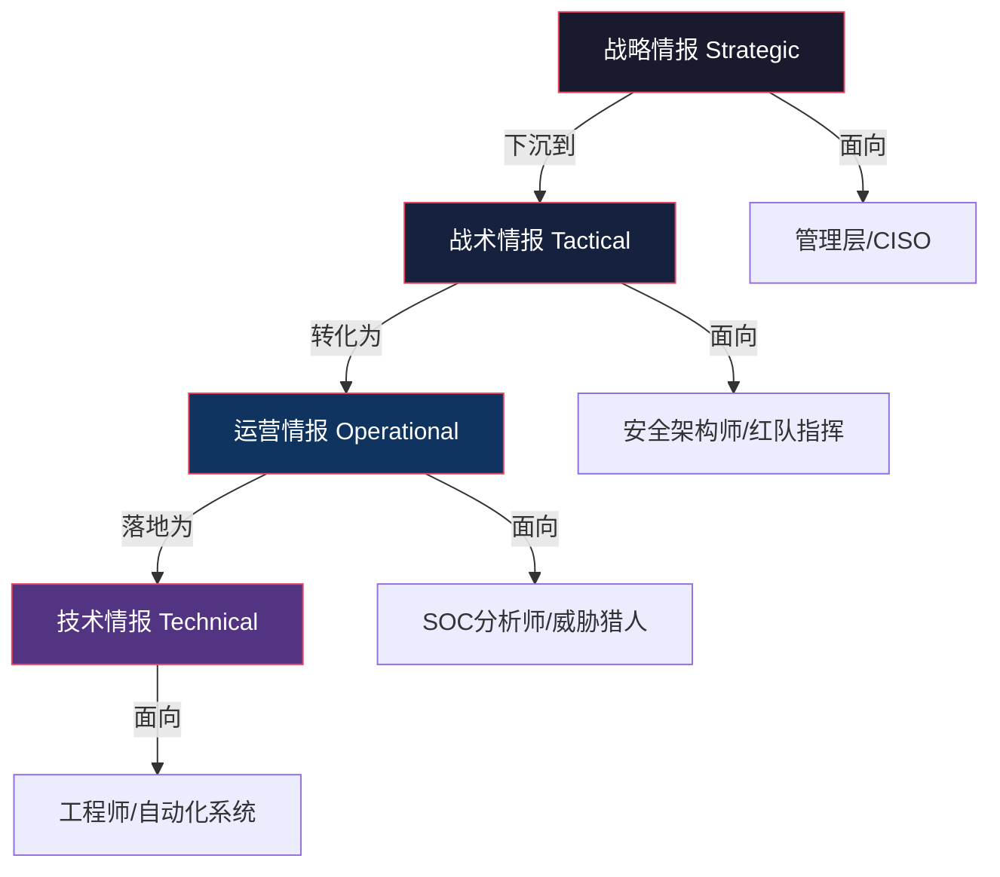
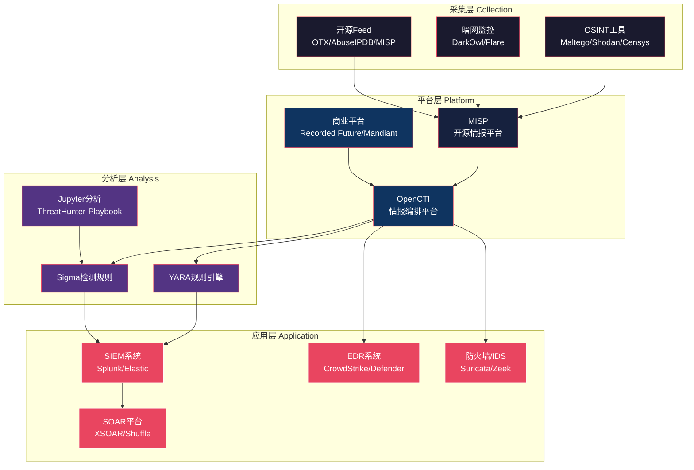
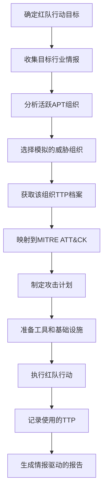

## 26.1.7 威胁情报与攻防对抗

威胁情报（Threat Intelligence, TI）是红蓝对抗的"眼睛"和"耳朵"——没有情报支撑的攻防对抗如同蒙眼格斗。本节系统讲解威胁情报的完整知识体系，包括情报层次模型、情报生命周期、核心标准协议、关键工具平台，以及情报在红队和蓝队实战中的具体应用方法。

---

### 威胁情报的本质与价值

威胁情报的本质是**经过加工处理的、具有决策价值的安全信息**。原始数据（raw data）本身不是情报，只有经过收集、处理、分析、提炼后形成可指导行动的知识，才能称为威胁情报。

理解这个区别至关重要：

| 层次 | 定义 | 示例 |
|------|------|------|
| 数据（Data） | 未经处理的原始记录 | 某IP在14:03:22发起了443端口连接 |
| 信息（Information） | 经过初步整理的数据 | 该IP在24小时内连接了157个不同主机 |
| 情报（Intelligence） | 经过深度分析、可指导行动的知识 | 该IP属于APT29基础设施，正在对金融行业进行C2通信，建议立即封禁并排查内部横向移动痕迹 |

威胁情报的核心价值体现在三个维度：

1. **缩短检测时间**：从平均207天（IBM 2023数据泄露报告）缩短到数小时甚至实时
2. **提高响应精度**：用真实威胁指标指导响应，减少误报导致的资源浪费
3. **驱动主动防御**：从被动救火转变为主动预见，提前部署防御措施

---

### 威胁情报的层次模型

威胁情报按受众、抽象层次和决策场景分为四个层次，形成一个从宏观到微观的完整体系：



#### 战略情报（Strategic Intelligence）

**面向对象**：CISO、安全总监、管理层

**核心内容**：
- 行业整体威胁态势演变趋势（如2024年供应链攻击同比增长40%）
- APT组织活动趋势与地缘政治关联（如APT41受中国国家安全部资助，主攻半导体行业）
- 新兴攻击技术发展趋势（如AI驱动的深度伪造钓鱼攻击兴起）
- 合规与监管环境变化（如《数据安全法》对数据处理的要求）

**应用场景**：
- 年度安全战略规划与预算分配
- 风险评估与董事会汇报
- 安全投资决策（如"今年应重点投入零信任建设"）

**关键来源**：Gartner安全报告、Verizon DBIR、MITRE年度威胁报告、国家级CERT通报

#### 战术情报（Tactical Intelligence）

**面向对象**：安全团队负责人、红队指挥官、安全架构师

**核心内容**：
- 攻击者的战术、技术和过程（TTP）分析
- MITRE ATT&CK框架映射（如APT29常用T1566.001鱼叉附件+T1059.001 PowerShell）
- 攻击链（Kill Chain）阶段划分与突破点分析
- 防御措施有效性评估

**应用场景**：
- 红队模拟计划制定（基于真实APT组织TTP设计攻击场景）
- 检测规则开发优先级排列
- 安全架构优化设计
- 紫队协作的战术对齐

**关键来源**：MITRE ATT&CK、Lockheed Martin Kill Chain、各安全厂商APT研究报告

#### 运营情报（Operational Intelligence）

**面向对象**：SOC分析师、威胁猎人、事件响应团队

**核心内容**：
- 正在进行的攻击活动细节（攻击时间窗口、目标行业、手法特征）
- 攻击基础设施的动态变化（新注册的C2域名、被劫持的合法站点）
- 受害组织信息与攻击影响范围评估
- 攻击者的行为模式与偏好

**应用场景**：
- 实时威胁监控与预警
- 主动威胁狩猎（Threat Hunting）
- 事件响应中的攻击溯源
- 应急预案的触发与执行

**关键来源**：US-CERT/NCSC通报、行业ISAC情报共享、内部SOC日志分析

#### 技术情报（Technical Intelligence）

**面向对象**：安全工程师、自动化安全系统

**核心内容**：
- 具体的威胁指标（IOC）：IP地址、域名、文件哈希、URL、邮件地址、JA3/JA3S指纹
- 检测规则：YARA规则、Snort/Suricata规则、Sigma规则、IOC查询规则
- 攻击工具特征：特定恶意软件家族的静态/动态特征
- 漏洞利用代码与补丁信息

**应用场景**：
- 防火墙/IDS/IPS规则配置
- EDR检测策略部署
- SIEM关联规则编写
- 自动化威胁情报平台对接

**关键来源**：VirusTotal、AlienVault OTX、各厂商威胁情报Feed、CISA KEV目录

---

### 威胁情报生命周期

威胁情报不是一个静态产物，而是一个持续迭代的闭环过程。理解这个生命周期对于有效利用情报至关重要：


#### 第一步：计划与指导（Planning & Direction）

确定情报需求——"我们需要知道什么？为什么需要知道？"这是整个生命周期的起点。

**关键动作**：
- 明确情报消费者（管理层需要战略情报，SOC需要技术IOC）
- 定义情报需求指标（PIR, Priority Intelligence Requirements）
- 确定情报来源和收集方法
- 评估情报时效性要求

**示例PIR**：
```text
PIR-1: 针对我司所在行业的APT组织有哪些？他们的TTP是什么？
PIR-2: 过去30天内，是否有针对我司域名的钓鱼攻击活动？
PIR-3: 我们使用的第三方软件是否存在已被野外利用的漏洞？
PIR-4: 竞争对手是否遭遇过攻击？攻击手法能否帮助我们预判威胁？
```

#### 第二步：收集（Collection）

从多种来源获取原始数据和信息。

| 收集来源 | 具体渠道 | 适用情报层次 |
|----------|----------|------------|
| 开源情报(OSINT) | 社交媒体、新闻、论坛、Pastebin、GitHub | 全部层次 |
| 付费订阅 | 商业威胁情报平台（Recorded Future、Mandiant） | 战略/战术 |
| 暗网监控 | 暗网市场、地下论坛、Telegram群组 | 运营/技术 |
| 内部遥测 | SIEM日志、EDR数据、网络流量 | 运营/技术 |
| 行业共享 | ISAC/ISAO成员情报 | 战术/运营 |
| 恶意软件样本 | 蜜罐捕获、样本分析平台 | 技术 |

#### 第三步：处理（Processing）

将原始数据转化为可用格式。

**典型处理操作**：
- IP/域名去重、地理定位、ASN归属分析
- 恶意软件样本的沙箱分析与分类
- 暗网信息的翻译（多语言情报）
- 多源IOC的标准化聚合（统一为STIX格式）
- 日志数据的关联与富化（添加资产标签、风险等级）

#### 第四步：分析（Analysis）

将处理后的信息转化为可行动的洞察。

**分析方法**：
- **关联分析**：将多个孤立IOC关联到同一攻击活动（如多个IP指向同一C2基础设施）
- **模式识别**：识别攻击者的行为规律（如特定时间窗口发起攻击、偏好的初始入侵向量）
- **归因分析**：通过TTP匹配、基础设施重叠、代码相似性等进行攻击者归因
- **影响评估**：评估威胁对本组织的实际影响程度
- **趋势预测**：基于历史数据预测未来威胁演变方向

#### 第五步：分发（Dissemination）

将情报以适当格式传递给需要的人或系统。

**分发策略**：
- 管理层：简短的态势报告（Executive Brief），重点说风险和建议
- 安全团队：详细的技术分析报告，含IOC、TTP、检测建议
- 自动化系统：STIX/TAXII格式的机器可读情报，直接对接SIEM/SOAR/EDR
- 事件响应：按需的即时情报推送，聚焦当前事件相关情报

#### 第六步：反馈与改进（Feedback）

评估情报质量并持续改进。

**评估维度**：
- 情报的及时性（Timeliness）：是否在需要之前就已提供？
- 相关性（Relevance）：是否与本组织的实际威胁场景匹配？
- 准确性（Accuracy）：IOC是否准确？误报率如何？
- 可操作性（Actionability）：收到情报后能否立即采取行动？

---

### 核心标准与协议：STIX/TAXII

STIX和TAXII是威胁情报共享的两大国际标准，构成了情报自动交换的基础。

#### STIX（Structured Threat Information eXpression）

STIX定义了威胁情报的**结构化表示格式**。当前主流版本为STIX 2.1（RFC 9499）。

**STIX 2.1核心对象类型**：

| 对象类型 | 说明 | 示例 |
|----------|------|------|
| Attack Pattern | 攻击模式 | 鱼叉式钓鱼附件（T1566.001） |
| Threat Actor | 威胁行为者 | APT29 (Cozy Bear) |
| Campaign | 攻击活动 | "Operation ShadowVault" |
| Tool | 攻击工具 | Cobalt Strike |
| Malware | 恶意软件 | SUNBURST后门 |
| Vulnerability | 漏洞 | CVE-2021-44228 (Log4Shell) |
| Indicator | 威胁指标 | IP: 185.x.x.x / Hash: abc123... |
| Infrastructure | 攻击基础设施 | C2域名、VPS服务器 |
| Report | 情报报告 | APT29针对政府机构的攻击分析 |

**STIX 2.1示例——完整的攻击活动描述**：

```json
{
  "type": "campaign",
  "spec_version": "2.1",
  "id": "campaign--f431fa80-5b25-4cb3-8a6e-d0b5b3d2b84e",
  "created": "2024-01-15T10:00:00.000Z",
  "modified": "2024-01-20T14:30:00.000Z",
  "name": "Operation ShadowVault",
  "description": "针对金融行业的供应链攻击活动",
  "first_seen": "2023-11-01T00:00:00.000Z",
  "last_seen": "2024-01-20T00:00:00.000Z",
  "objective": "窃取金融交易数据和客户PII信息",
  "threat_actor_refs": ["threat-actor--7a238429-1889-4fb3-a76f-0d2b8a0b4e12"],
  "kill_chain_phases": [
    {
      "kill_chain_name": "lockheed-martin-cyber-kill-chain",
      "phase_name": "delivery"
    },
    {
      "kill_chain_name": "mitre-attack",
      "phase_name": "initial-access"
    }
  ],
  "labels": ["apt", "supply-chain", "finance"]
}
```

#### TAXII（Trusted Automated eXchange of Intelligence Information）

TAXII定义了威胁情报的**传输协议**，解决了"情报如何交换"的问题。

**TAXII 2.1支持两种交互模式**：

| 模式 | 说明 | 适用场景 |
|------|------|----------|
| Collection（集合） | 服务器维护一个情报集合，客户端拉取或推送 | 传统的共享模式，如行业ISAC |
| Channel（频道） | 发布-订阅模式，实时推送 | 高时效性情报分发，如紧急漏洞预警 |

**TAXII API核心端点**：

```text
GET  /collections/                    # 获取可用集合列表
GET  /collections/{id}/objects/       # 获取集合中的对象
POST /collections/{id}/objects/       # 向集合添加对象
GET  /collections/{id}/manifest/      # 获取对象清单（用于增量同步）
```

**实际部署示例——通过TAXII获取情报**：

```python
import taxii2client.v21 as tc

# 连接TAXII服务器
server = tc.Server("https://taxii.example.com/taxii2/")
api_root = tc.ApiRoot("https://taxii.example.com/taxii2/cti-stix-2.1/")

# 获取可用集合
collections = tc.Collections(api_root)
for c in collections:
    print(f"集合: {c.title} | 描述: {c.description}")

# 拉取最新情报对象
collection = tc.Collection(f"{api_root.url}collections/{collection_id}/")
objects = tc.GetObjects(collection, added_after="2024-01-01T00:00:00Z")

for obj in objects:
    if obj.type == "indicator":
        print(f"IOC类型: {obj.pattern_type} | 指标: {obj.pattern}")
```

#### STIX/TAXII与其他标准的关系

| 标准 | 作用 | 与STIX/TAXII的关系 |
|------|------|-------------------|
| MITRE ATT&CK | 攻击战术/技术知识库 | STIX 2.1通过`attack-pattern`对象引用ATT&CK技术编号 |
| OVAL | 漏洞评估与补丁描述 | 技术情报层的补充，描述系统配置和漏洞状态 |
| CybOX | 网络可观测对象（已被STIX 2.1吸收） | 早期独立标准，现功能已合并入STIX |
| MITRE D3FEND | 防御技术知识库 | 与ATT&CK对应，为蓝队提供防御技术映射 |
| OpenIOC | Mandiant的IOC描述格式 | 竞争格式，功能已被STIX覆盖 |

---

### 关键工具与平台

威胁情报生态系统的工具链可以分为四个层级：采集层、平台层、分析层、应用层。



#### MISP——开源威胁情报平台

MISP（Malware Information Sharing Platform）是最广泛使用的开源威胁情报平台，由欧洲刑警组织支持开发。

**核心功能**：
- 多源IOC聚合与去重
- STIX/TAXII 2.1原生支持
- 基于属性的自动关联（自动发现IP、域名、哈希之间的关系）
- 细粒度的访问控制（基于组织和用户角色）
- 丰富的插件生态（模块化扩展）

**部署命令**：

```bash
# Docker一键部署MISP
docker run -d --name misp \
  -p 443:443 \
  -p 80:80 \
  -e HOSTNAME=misp.example.com \
  -e INIT=true \
  -e DISIPV6=true \
  -v /data/misp:/var/www/MISP/app/files \
  mispzteam/misp-docker
```

**典型工作流**：
1. 导入外部情报源（OTX AlienVault、CIRCL Feed）
2. 自动关联和富化（GeoIP、WHOIS、ASN信息）
3. 通过事件（Event）组织相关IOC
4. 分享给社区成员或消费SIEM推送的Feed
5. 利用Sightings功能验证IOC的时效性和准确性

#### OpenCTI——开源威胁情报编排平台

OpenCTI是新一代开源威胁情报平台，相比MISP更侧重于**情报分析与知识图谱**。

**与MISP的对比**：

| 特性 | MISP | OpenCTI |
|------|------|---------|
| 定位 | IOC管理和共享平台 | 情报分析与编排平台 |
| 数据模型 | 属性+事件 | 实体+关系（知识图谱） |
| 可视化 | 基础关系图 | 强大的知识图谱可视化 |
| ATT&CK集成 | 插件支持 | 原生深度集成 |
| 情报报告 | 不支持 | 原生支持STIX Report对象 |
| 学习曲线 | 中等 | 较陡 |

#### 检测规则编写实战

威胁情报最终需要转化为可执行的检测规则。以下是两种主流规则格式的编写方法：

**YARA规则——恶意软件检测**：

```yara
rule APT29_SUNBURST_Dropper {
    meta:
        description = "检测APT29 SUNBURST后门投放器"
        author = "SOC Team"
        date = "2024-01-15"
        reference = "Mandiant M-Trends 2024"
        severity = "critical"
        mitre_attack = "T1059.001, T1195.002"
    
    strings:
        $pdb1 = "\\SolarFlare\\" ascii
        $pdb2 = "\\SolarWinds\\" ascii
        $magic = { 4D 5A }  // MZ header
        $encoded = { 3C 73 76 63 }  // <svc
        
    condition:
        $magic at 0 and
        filesize < 5MB and
        (1 of ($pdb*) or $encoded) and
        // 检查特定PE特征
        uint16(uint32(0x3C) + 0x18) == 0x020B
}
```

**Sigma规则——通用检测规则**：

```yaml
title: Suspicious PowerShell Execution via WMI
id: 7f2e3a4b-5c6d-7e8f-9a0b-1c2d3e4f5a6b
status: experimental
description: |
  检测通过WMI启动的PowerShell进程，常用于远程代码执行。
  关联APT组织：APT29, APT41, APT38
  MITRE ATT&CK: T1047, T1059.001
references:
  - https://attack.mitre.org/techniques/T1047/
author: SOC Team
date: 2024-01-15
tags:
  - attack.execution
  - attack.t1047
  - attack.t1059.001
logsource:
  category: process_creation
  product: windows
detection:
  selection_wmi_powershell:
    ParentImage|endswith:
      - '\WmiPrvSE.exe'
      - '\WmiApSrv.exe'
    Image|endswith:
      - '\powershell.exe'
      - '\pwsh.exe'
  selection_powershell_suspicious:
    Image|endswith:
      - '\powershell.exe'
      - '\pwsh.exe'
    CommandLine|contains:
      - 'Invoke-WebRequest'
      - 'DownloadString'
      - 'EncodedCommand'
      - '-enc '
      - 'IEX'
      - 'Invoke-Expression'
  condition: selection_wmi_powershell or
    (selection_powershell_suspicious and selection_wmi_powershell)
falsepositives:
  - Legitimate IT automation scripts
level: high
```

---

### 情报驱动的红队攻防

威胁情报是红队行动的"剧本来源"，让模拟攻击更贴近真实威胁。

#### 红队情报应用工作流



**具体步骤**：

**1. 目标行业情报收集**
```bash
# 使用Shodan搜索目标暴露面
shodan search org:"TargetCorp" port:443 --fields ip_str,port,org,os

# 使用Censys搜索特定服务
censys search services.software.product:"Apache" AND services.port:443

# 通过OSINT收集人员信息
# LinkedIn、GitHub、社交媒体等渠道收集关键人员信息
# 用于后续钓鱼攻击的目标选择
```

**2. APT组织选择与TTP匹配**

| 目标行业 | 常见APT组织 | 典型初始入侵向量 | 常用TTP |
|----------|------------|----------------|---------|
| 金融 | APT38/Lazarus | 鱼叉钓鱼+供应链 | T1566, T1195, T1059 |
| 政府 | APT29/Cozy Bear | 水坑攻击+合法工具滥用 | T1189, T1218, T1021 |
| 能源 | Sandworm | VPN漏洞利用 | T1190, T1078, T1053 |
| 半导体 | APT41 | Web应用漏洞+合法云服务 | T1190, T1078.004, T1567 |
| 医疗 | FIN12/Conti | RDP暴力破解+钓鱼 | T1110, T1566, T1486 |

**3. 攻击计划模板**

```text
红队行动情报驱动计划
====================

模拟威胁组织: APT29 (Cozy Bear)
情报来源: Mandiant APT29报告(2024), MITRE ATT&CK APT29 Profile

阶段1: 初始访问
├── T1566.001 - 鱼叉钓鱼附件
│   └── 工具: 宏文档 + PowerShell下载器
├── T1195.002 - 供应链攻击（备选）
│   └── 前提: 发现可信供应商的软件更新机制

阶段2: 执行
├── T1059.001 - PowerShell
│   └── 使用混淆的PowerShell脚本，避免已知签名检测
├── T1204.002 - 用户执行恶意文件
│   └── 社会工程学诱导执行

阶段3: 持久化
├── T1547.001 - 注册表Run键
├── T1053.005 - 计划任务
└── T1546.003 - WMI事件订阅

阶段4: C2通信
├── T1071.001 - HTTP/HTTPS C2
├── T1573.002 - 加密通道
└── 优先使用合法云服务(Google Drive, OneDrive)作为C2

防御方注意:
- 重点检测: PowerShell异常执行、WMI持久化、合法云服务滥用
- 蓝队准备: SOAR剧本预配置，确保快速隔离
```

#### 蓝队情报应用工作流

蓝队使用威胁情报的方式与红队互补——红队利用情报"进攻"，蓝队利用情报"防守"。

**1. 情报驱动的检测规则开发**

```text
威胁情报 → TTP提取 → MITRE ATT&CK映射 → Sigma/YARA规则 → SIEM/EDR部署 → 验证
```

**具体操作**：
- 订阅CISA KEV（Known Exploited Vulnerabilities）目录，优先修复被活跃利用的漏洞
- 从MISP获取最新IOC，自动推送到防火墙和SIEM
- 基于行业威胁报告，为高风险TTP预置检测规则

**2. 威胁狩猎（Threat Hunting）**

威胁狩猎是蓝队的主动防御手段，基于情报假设进行主动排查。

**威胁狩猎模板**：
```text
狩猎假设: 攻击者可能通过合法云服务进行C2通信
情报来源: MITRE ATT&CK T1071.004, APT29报告

狩猎指标:
- 大量HTTPS流量发往云存储服务(Google Drive, Dropbox, OneDrive)
- 非工作时间的云存储访问
- PowerShell进程的网络连接
- DNS查询中包含新注册的域名(< 30天)

工具:
- ELK/Kibana查询
- Zeek网络日志分析
- Sigma规则批量扫描

预期发现:
- 异常的云服务使用模式
- 隐藏的后门C2通信
- 内部凭证泄露
```

**3. 漏洞优先级排列**

使用威胁情报中的漏洞利用信息来决定修复优先级：

| 优先级 | 条件 | 响应时间 |
|--------|------|----------|
| P0-紧急 | CISA KEV中已有在野利用 + 资产暴露在互联网 | 24小时内 |
| P1-高 | 有公开PoC + 资产在内网核心区域 | 72小时内 |
| P2-中 | CVSS≥9.0 + 有理论利用可能 | 1周内 |
| P3-低 | CVSS<9.0 + 无在野利用证据 | 常规补丁周期 |

---

### 情报共享生态

威胁情报的价值随着共享范围扩大而指数增长。以下是主要的情报共享机制：

#### 行业共享组织

| 共享组织类型 | 说明 | 示例 |
|------------|------|------|
| ISAC | 行业信息共享与分析中心 | FS-ISAC（金融）、Health ISAC（医疗） |
| ISAO | 信息共享与分析组织 | 按地域或特定威胁领域组织 |
| CERT/CSIRT | 计算机应急响应团队 | 国家CERT（如CNCERT）、企业CERT |
| 蜜罐网络 | 联合部署蜜罐的协作网络 | T-Pot、Honeypot-as-a-Service |

#### 情报共享的法律与合规考量

共享威胁情报时需要注意法律合规问题：

1. **数据隐私**：IOC中可能包含受害者信息，需脱敏处理后共享
2. **反垄断**：竞争对手间的情报共享需确保不涉及商业敏感信息
3. **跨境传输**：跨境共享需遵守当地数据保护法规（如GDPR）
4. **责任限制**：明确情报共享协议中的免责条款（如"情报按原样提供，不保证准确性"）
5. **许可协议**：注意情报来源的使用限制（如部分情报仅限内部使用）

---

### 常见误区与最佳实践

#### 误区一：IOC越多越好

**问题**：盲目订阅大量情报源，导致IOC库膨胀但有效率极低。

**正确做法**：优先选择与本组织行业和威胁场景相关的2-3个高质量情报源，而非追求覆盖所有公开Feed。定期清理过期IOC，保持情报库的"鲜度"。

#### 误区二：只收集不分析

**问题**：花费大量资源收集情报，但缺乏分析能力，情报停留在数据层面。

**正确做法**：投入等量甚至更多的资源在分析环节。使用MISP/OpenCTI的关联分析功能，培养或招聘具备威胁分析能力的安全分析师。

#### 误区三：情报与行动脱节

**问题**：情报报告写得很详细，但没有转化为检测规则或红队行动计划。

**正确做法**：建立情报→行动的转化流程。每份战术/技术情报都应产出至少一条Sigma规则或一个红队场景。定期检查情报与行动的映射关系。

#### 误区四：忽略反馈闭环

**问题**：情报分发后就结束了，不收集使用者的反馈。

**正确做法**：定期与情报消费者（SOC、红队、管理层）沟通，了解情报的实际使用情况和不足，持续优化情报收集策略和分析方法。

#### 误区五：过度依赖单一情报源

**问题**：完全依赖某个商业平台或单一社区的情报。

**正确做法**：建立多源情报架构——开源情报（MISP/OTX）作为基础，商业情报作为补充，行业共享作为验证。交叉验证可以大幅提高情报的可信度。

---

### 情报驱动的紫队协作模型

紫队（Purple Team）是红队和蓝队的协同作战模式，威胁情报在紫队协作中发挥核心作用：

```mermaid
graph LR
    A[威胁情报源] --> B[情报分析]
    B --> C{紫队协调]
    C -->|模拟计划| D[红队]
    C -->|检测准备| E[蓝队]
    D -->|攻击结果| F[效果评估]
    E -->|检测结果| F
    F -->|改进建议| B
    F -->|TTP更新| G[ATT&CK矩阵更新]
    G --> C
    
    style A fill:#1a1a2e,stroke:#e94560,color:#fff
    style B fill:#16213e,stroke:#e94560,color:#fff
    style C fill:#0f3460,stroke:#e94560,color:#fff
    style D fill:#e94560,stroke:#fff,color:#fff
    style E fill:#533483,stroke:#fff,color:#fff
    style F fill:#e94560,stroke:#fff,color:#fff
```

**紫队协作流程**：

1. **情报对齐**：红蓝双方共享最新的威胁情报，确认共同关注的威胁场景
2. **能力差距分析**：基于情报中的TTP，评估蓝队当前的检测覆盖率
3. **联合行动**：红队模拟特定APT组织的攻击手法，蓝队实时检测和响应
4. **即时反馈**：蓝队实时反馈检测结果，红队即时调整攻击手法
5. **结果复盘**：基于行动结果更新检测规则、优化防御策略、完善情报需求
6. **情报更新**：将行动中发现的新TTP或检测盲区反馈到情报体系

---

### 实战案例：基于情报的红蓝对抗

**场景**：某金融机构委托红队进行渗透测试，目标是模拟APT38（朝鲜关联的金融攻击组织）的真实攻击手法。

**阶段一：情报收集与分析**

```text
情报来源:
1. Mandiant APT38研究报告 (2024)
2. MITRE ATT&CK APT38 Profile
3. FS-ISAC行业威胁通报
4. CISA KEV目录

关键情报发现:
- APT38近期活跃，目标为东南亚和中东金融机构
- 主要初始入侵向量: 鱼叉钓鱼(T1566) + 供应链攻击(T1195)
- 常用合法工具: PuTTY、Mimikatz、Cobalt Strike
- C2通信: HTTPS + DNS-over-HTTPS + 云服务
- 攻击链典型路径: 钓鱼→后门→凭证窃取→银行系统横向移动→资金转移
```

**阶段二：攻击模拟（红队执行）**

```text
攻击计划:
1. 信息收集: 通过LinkedIn识别财务部门人员，收集邮箱地址
2. 钓鱼投递: 发送伪造的财务报告文档，内含PowerShell下载器
3. 后门部署: 通过Cobalt Strike建立初始C2通道
4. 凭证收集: Mimikatz提取本地凭证 + Kerberoasting
5. 横向移动: 利用窃取的凭证访问核心银行系统
6. 数据提取: 模拟资金转移操作(仅验证可行性，不实际操作)

使用的TTP映射:
T1566.001 → T1059.001 → T1055 → T1003.001 → T1558.003 → T1021.002
```

**阶段三：防御验证（蓝队实时监控）**

```text
检测覆盖情况:
✅ T1566.001 - 邮件网关已拦截(置信度:85%)但绕过了沙箱
✅ T1059.001 - EDR检测到异常PowerShell(触发告警)
❌ T1055 - 进程注入未被检测(检测规则缺失)
✅ T1003.001 - LSASS访问已触发高优先级告警
⚠️ T1558.003 - Kerberoasting检测到但响应延迟(15分钟)
✅ T1021.002 - 横向移动到银行系统时触发隔离

检测率: 66.7% (4/6)
平均响应时间: 8.3分钟
```

**阶段四：复盘与改进**

```text
改进措施:
1. [高优先] 新增T1055进程注入检测Sigma规则
2. [高优先] 优化Kerberoasting检测响应流程(目标: <5分钟)
3. [中优先] 加强钓鱼邮件沙箱检测能力
4. [中优先] 增加PowerShell日志采集粒度
5. [低优先] 部署蜜罐系统监控内部横向移动

情报需求更新:
- 新增PIR: 监控APT38的新C2基础设施变更
- 调整情报源: 增加FS-ISAC的APT38专题通报订阅
```

---

### 本节小结

威胁情报是红蓝对抗的信息基础设施，其价值体现在三个核心环节：

1. **情报采集与分析**：建立多源情报体系，通过STIX/TAXII标准实现自动化共享
2. **情报转化与应用**：将情报转化为检测规则（蓝队）、攻击计划（红队）和防御策略（紫队）
3. **情报反馈与迭代**：通过攻防实践验证情报质量，持续优化情报体系

掌握威胁情报的运用，意味着从"被动挨打"转变为"知己知彼"——这正是攻防对抗中最大的不对称优势。下一节将讨论红蓝紫队的组织架构与运营模式。
