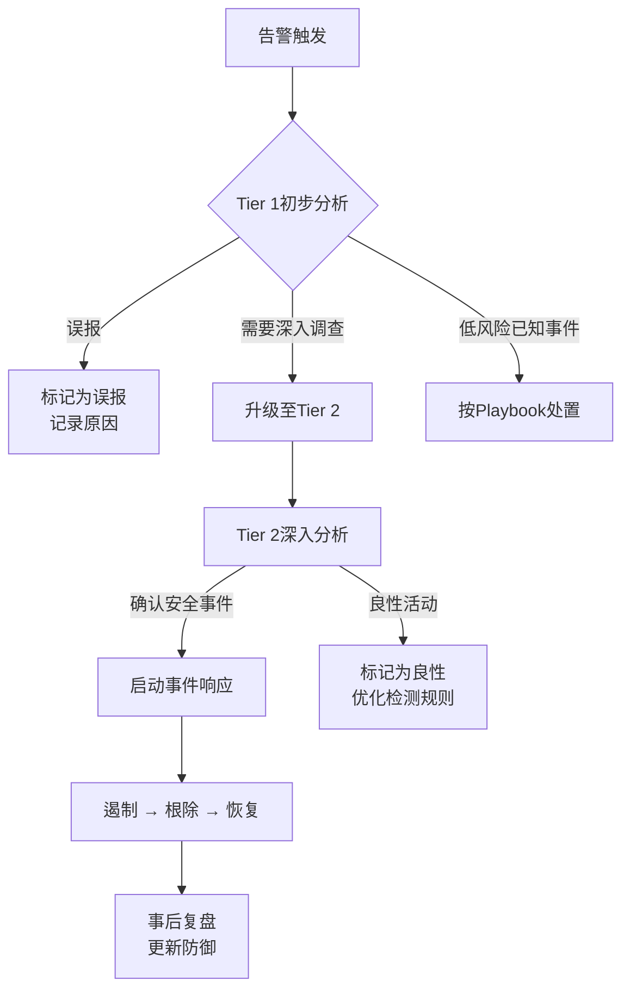

## 26.1.9 安全运营中心（SOC）架构

安全运营中心（Security Operations Center，SOC）是组织安全防御体系的核心枢纽，负责持续监控、检测、分析和响应安全事件。一个设计良好的SOC能够将分散的安全能力整合为统一的作战体系，使安全团队从被动救火转向主动防御。理解SOC架构不仅是蓝队建设的基础，也是红队评估安全防御有效性的关键参照。

### SOC的定义与核心使命

SOC并非单纯的一间办公室或一套工具，而是一个融合了**人员（People）、流程（Process）、技术（Technology）** 三位一体的安全运营体系。其核心使命可归纳为四个维度：

| 维度 | 目标 | 关键活动 |
|------|------|----------|
| **可见性** | 全面感知组织资产的安全状态 | 日志收集、资产发现、流量监控 |
| **检测** | 识别已知和未知的安全威胁 | 规则匹配、行为分析、威胁狩猎 |
| **响应** | 快速遏制和消除安全事件 | 事件分类、应急处置、根因分析 |
| **改进** | 持续提升防御能力 | 检测规则优化、流程改进、人员培训 |

这四个维度形成闭环：可见性为检测提供数据基础，检测为响应提供触发条件，响应过程中发现的防御缺口反哺改进，改进后又增强可见性。缺少任何一个环节，SOC的效能都会大幅下降。

### SOC的演进阶段

SOC的发展与网络安全威胁的演变紧密相关，经历了从简单日志管理到智能安全运营的四个主要阶段：

#### SOC 1.0 — 基于签名的检测（2000年代初期）

这一阶段的SOC本质上是一个日志监控中心：

- **核心工具**：防火墙、IDS/IPS（Snort、Suricata）、基本SIEM（如早期ArcSight）
- **检测方式**：依赖已知攻击签名和规则，本质是黑名单匹配
- **响应模式**：被动响应，告警后由人工手动处理
- **主要局限**：
  - 只能检测已知威胁，对变种攻击和零日无能为力
  - 告警噪音巨大，分析师大量时间浪费在误报处理上
  - 缺乏跨系统的关联分析能力
  - 无法追踪攻击链，只能看到孤立的安全事件

这一时期的典型场景：分析师每天面对成千上万条告警，逐一检查日志，在海量数据中寻找真正有意义的安全事件——如同大海捞针。

#### SOC 2.0 — 基于情报的检测（2000年代末至2010年代初）

威胁情报的引入标志着SOC从被动监控向主动防御的转变：

- **核心变化**：引入威胁情报源（IOC），将外部情报与内部日志关联
- **流程建设**：建立事件响应（IR）流程和Playbook
- **工具升级**：SIEM开始支持更复杂的关联规则，引入TIP（威胁情报平台）
- **关注重点**：开始关注APT（高级持续性威胁）和定向攻击
- **典型工具**：Splunk、QRadar、Mandiant TIP、OpenIOC标准

这一阶段的关键进步是认识到"签名匹配"不足以应对高级威胁，需要外部情报来提升检测的覆盖面和准确性。但威胁情报的应用仍以IOCs（IP、域名、哈希值）为主，对TTPs（战术、技术、过程）的利用有限。

#### SOC 3.0 — 基于行为的检测（2010年代中期至2020年代初）

行为分析将SOC的检测能力提升到全新维度：

- **UEBA（用户和实体行为分析）**：建立行为基线，检测偏离正常模式的异常行为
- **SOAR（安全编排、自动化与响应）**：实现自动化剧本执行，大幅提升响应效率
- **威胁狩猎（Threat Hunting）**：从被动等告警转为主动在环境中搜索威胁迹象
- **关注重点**：未知威胁、内部威胁、零日攻击
- **检测逻辑**：从"这个攻击长什么样"转向"攻击者会怎么做"（基于MITRE ATT&CK框架）

这一阶段的核心理念转变：不再假设可以阻止所有入侵，而是假设攻击者已经进入网络，重点是快速检测和响应。MITRE ATT&CK框架的普及为行为检测提供了系统化的知识体系。

#### SOC 4.0 — 智能安全运营（2020年代至今）

AI和自动化技术正在重塑SOC的运作模式：

- **AI/ML辅助检测**：利用机器学习模型识别复杂攻击模式，降低误报率
- **自动化威胁狩猎**：AI驱动的假设生成和验证，减少对人工经验的依赖
- **预测性安全分析**：基于历史数据和威胁趋势预测潜在攻击
- **业务深度融合**：安全运营与业务风险量化挂钩，用业务语言衡量安全投入的价值
- **安全数据湖**：统一存储海量安全数据，支持跨域关联分析
- **XDR（扩展检测与响应）**：整合端点、网络、云端、身份等多维度数据

SOC 4.0的愿景是实现"自适应安全运营"——系统能够根据威胁环境变化自动调整检测策略和响应力度，人类分析师更多承担策略制定和复杂决策的角色。

### SOC人员架构

SOC的人员结构直接决定了其运营效能。成熟的SOC通常采用分层（Tier）架构，确保不同复杂度的安全事件由相应能力的人员处理：

#### 三级分析体系

| 层级 | 角色名称 | 核心职责 | 所需技能 | 典型背景 |
|------|----------|----------|----------|----------|
| **Tier 1** | 监控分析师 | 告警监控、初步分类、基本调查、工单创建 | SIEM操作、安全基础知识、告警分级标准 | 0-2年安全经验，CISSP/Security+认证 |
| **Tier 2** | 事件响应分析师 | 深入调查、攻击范围确定、遏制措施制定 | 高级分析、取证知识、攻击技术理解、脚本编写 | 2-5年经验，GCIH/GCIA认证，有CTF或实战背景 |
| **Tier 3** | 高级威胁分析师/威胁猎手 | 高级威胁分析、恶意软件逆向、攻击链重建、新检测方法开发 | 逆向工程、高级持久威胁分析、漏洞研究、编程能力 | 5年+经验，具备红队能力，能独立研究0day |

#### 专项角色

除分层体系外，成熟的SOC还需要以下专项角色：

**威胁情报分析师**：负责收集、处理和分发威胁情报，维护组织的威胁情报能力。日常工作包括监控暗网和地下论坛、分析威胁组织的TTPs、维护情报源质量评估。关键技能包括OSINT（开源情报）收集、MITRE ATT&CK映射、情报分析框架（如Diamond Model）应用。

**安全工程师**：负责SOC技术基础设施的建设和维护，包括SIEM平台管理、安全设备部署与优化、检测规则开发与调优、自动化脚本和工具开发。这是连接安全策略与技术实现的桥梁角色。

**SOC经理**：负责整体运营管理和战略方向，包括团队建设、流程优化、预算管理、向管理层汇报安全态势。需要兼具技术深度和管理广度。

**合规与报告专员**：负责安全事件的合规报告、审计支持、安全度量指标的收集和分析。在受到严格监管的行业（金融、医疗、政府）尤为重要。

#### 人员配比参考

根据Gartner的建议，一个运行良好的SOC团队最小规模约为8-12人，其中：

- Tier 1分析师：3-4人（支撑7×24小时轮班，每班1-2人）
- Tier 2分析师：2-3人
- Tier 3分析师/威胁猎手：1-2人
- 威胁情报分析师：1人
- 安全工程师：1-2人
- SOC经理：1人

实际配比应根据组织规模、安全成熟度和合规要求调整。中小型企业可考虑"一人多能"或SOCaaS（SOC即服务）模式。

### SOC技术架构

SOC的技术栈是其能力的物质基础。一个完整的SOC技术架构通常包含以下核心组件：

#### 数据采集层

数据采集是SOC运作的起点，决定了安全团队能"看到"什么。

| 数据源类别 | 具体内容 | 采集方式 | 数据量级（参考） |
|------------|----------|----------|------------------|
| **网络流量** | 全流量包、NetFlow、DNS日志、HTTP日志 | 旁路镜像/TAP、NDR传感器 | 10GB-1TB/天 |
| **端点日志** | Windows事件日志、Sysmon、进程创建、文件变更 | EDR代理、日志转发器 | 5GB-50GB/天 |
| **身份系统** | AD认证日志、VPN登录、SSO事件、权限变更 | 日志收集代理、API集成 | 1GB-10GB/天 |
| **云平台** | CloudTrail、Azure Activity Log、GCP审计日志 | API拉取/事件推送 | 1GB-20GB/天 |
| **应用层** | Web应用日志、API访问日志、数据库审计日志 | 专用Agent、日志文件采集 | 变化大 |
| **安全设备** | 防火墙、IDS/IPS、WAF、邮件安全网关告警 | Syslog、API、日志文件 | 1GB-20GB/天 |
| **身份与访问管理** | LDAP/AD变更、特权账户操作、MFA事件 | Syslog、API | 变化大 |

**关键原则**：宁多勿少。数据采集不足会导致检测盲区，数据采集过多会增加存储和分析成本。应基于资产价值和威胁模型确定优先级。

#### 检测分析层

检测分析是SOC的核心能力，通常包含多个互补的检测引擎：

**SIEM（安全信息与事件管理）**：SOC的中枢神经系统，负责日志聚合、关联分析和告警生成。

主流SIEM平台对比：

| 平台 | 部署方式 | 优势 | 适用场景 |
|------|----------|------|----------|
| **Splunk Enterprise Security** | 商业 | 生态丰富、灵活性高、可视化强 | 大型企业、复杂环境 |
| **IBM QRadar** | 商业 | 内置威胁情报库、合规报告强 | 合规要求高的行业 |
| **Elastic Security（ELK）** | 开源 | 成本低、可定制性强、社区活跃 | 技术能力强的团队、成本敏感 |
| **Microsoft Sentinel** | SaaS | 与Azure/M365深度集成、云原生 | Azure重度用户 |
| **Wazuh** | 开源 | 免费、轻量、HIDS+SIEM合一 | 中小型企业、入门级 |
| **Apache Metron** | 开源 | 高度可定制、大数据架构 | 大规模数据环境 |

SIEM检测规则的编写是SOC的核心技术能力。好的检测规则应基于攻击行为的逻辑而非简单的IOC匹配。例如，检测"横向移动"不应只匹配已知恶意IP，而应关注"短时间内多台主机使用同一账户登录"这类行为模式。

**UEBA（用户和实体行为分析）**：通过机器学习建立用户和设备的行为基线，检测偏离正常模式的异常行为。UEBA的典型应用场景包括：

- 内部威胁检测（员工异常数据访问、权限滥用）
- 账户妥协检测（登录地点异常、时间异常、行为模式突变）
- 特权账户监控（异常的管理员操作、提权行为）

**EDR/NDR（端点检测与响应/网络检测与响应）**：

- EDR（如CrowdStrike Falcon、Microsoft Defender for Endpoint、Velociraptor）提供端点级别的实时监控、威胁检测和事件响应能力
- NDR（如Darktrace、Vectra AI、Zeek）在网络层面检测异常流量、横向移动和数据外泄

两者互补：EDR关注主机层面的行为，NDR关注网络层面的模式，结合使用可以大幅提升检测覆盖面。

**TIP（威胁情报平台）**：管理和分发威胁情报的中枢，支持IOC聚合、情报共享（STIX/TAXII标准）、情报与检测系统的自动联动。

#### 自动化编排层

**SOAR（安全编排、自动化与响应）**是提升SOC运营效率的关键：

**核心能力**：
- **剧本编排（Playbook Orchestration）**：预定义的自动化响应流程，如"收到钓鱼邮件告警 → 提取附件沙箱分析 → 检查收件人是否已点击 → 如已点击则隔离终端 → 通知用户 → 更新检测规则"
- **案例管理**：统一管理安全事件的调查过程、证据链和处置记录
- **指标管理**：自动化IOC的采集、验证和分发
- **协作工作流**：跨团队的安全事件协作（如与IT运维、法务、公关的协同）

**主流SOAR平台**：Palo Alto XSOAR、Splunk SOAR、IBM Resilient、OpenSOAR（开源）。

**自动化的价值量化**：根据Ponemon Institute的调研，引入SOAR后，事件响应时间平均缩短60%，分析师处理事件数量提升3倍，误报处理效率提升80%。

#### 数据存储与分析层

随着安全数据量的爆发式增长，传统SIEM的存储和查询能力面临瓶颈，安全数据湖架构应运而生：

**安全数据湖的组成**：
- **热数据层**（近7天）：SSD存储，支持实时查询和告警，如Elasticsearch、ClickHouse
- **温数据层**（7天-90天）：HDD存储，支持近线分析，如HDFS、S3 Standard
- **冷数据层**（90天-1年+）：对象存储，用于合规留存和历史回溯，如S3 Glacier

**数据湖相比传统SIEM的优势**：
- 存储成本降低10-50倍（将原始日志存储在廉价对象存储中，而非昂贵的SIEM存储）
- 保留完整的原始数据，支持回溯分析（当新检测规则上线时，可以回溯历史数据验证）
- 支持跨域关联分析（将网络、端点、身份等不同数据源统一查询）

### SOC运营模型

SOC的运营模式决定了其成本结构、响应能力和可持续性。

#### 运营模式对比

| 模式 | 描述 | 优势 | 劣势 | 适用场景 |
|------|------|------|------|----------|
| **自建SOC** | 组织内部建设和运营完整SOC | 完全掌控、响应速度快、数据不出境 | 成本高、招聘困难、能力积累慢 | 大型企业、金融/政府等敏感行业 |
| **外包SOC（SOCaaS）** | 将SOC能力外包给专业服务商 | 低成本、快速获得专业能力、7×24覆盖 | 响应可能延迟、数据隐私风险、对业务理解不足 | 中小型企业、缺乏安全人才的组织 |
| **混合模式** | 核心能力自建，非核心能力外包 | 平衡成本与能力、灵活可扩展 | 管理复杂度高、需明确职责边界 | 多数中大型企业的务实选择 |
| **虚拟SOC** | 无固定物理场所，团队分布式协作 | 成本低、灵活、不受地域限制 | 协作效率可能降低、需要强工具支撑 | 远程办公环境、初创企业 |

#### 7×24运营的实现方案

持续运营是SOC的基本要求，但也是最大的运营挑战。常见方案：

**方案一：三班轮换**：将24小时分为三班（08:00-16:00、16:00-00:00、00:00-08:00），每班配备完整的Tier 1团队。优点是覆盖全面，缺点是人力成本高（至少需要4倍Tier 1人力才能覆盖7×24加上轮休）。

**方案二：值班+随叫随到（On-call）**：正常工作时间全职覆盖，非工作时间由值班人员远程监控，紧急情况电话叫回办公室。优点是成本可控，缺点是夜间响应速度可能下降。

**方案三：L1外包+L2/L3自建**：将Tier 1监控外包给SOCaaS提供商（如Arctic Wolf、Red Canary），Tier 2/3的核心分析能力保留在内部。这是目前最流行的混合模式。

### SOC核心流程

#### 告警全生命周期管理

告警管理是SOC日常运营的核心工作流，直接决定了分析师的效率和安全事件的响应质量。

**告警分级标准**（示例）：

| 级别 | 描述 | 响应时间 | 处理人 | 示例 |
|------|------|----------|--------|------|
| P1-紧急 | 正在进行的数据泄露或勒索攻击 | 15分钟 | Tier 3 + SOC经理 | 检测到C2通信、勒索软件执行 |
| P2-高危 | 确认的安全事件，可能造成重大影响 | 1小时 | Tier 2 | 确认的钓鱼攻击、可疑提权操作 |
| P3-中危 | 需要调查的安全异常 | 4小时 | Tier 1→升级至Tier 2 | 异常登录行为、可疑DNS查询 |
| P4-低危 | 轻微违规或已知风险 | 24小时 | Tier 1 | 策略违规、已知漏洞扫描探测 |
| P5-信息 | 仅供参考的安全事件 | 无需即时响应 | 自动归档 | 信息性日志、常规扫描 |

**告警处置流程**：



**误报管理**：误报是SOC运营的最大效率杀手。研究显示，典型的SOC中约有40%-70%的告警为误报。有效的误报管理策略包括：

- **定期告警调优**：每月分析告警分布，对高频误报规则进行调整
- **白名单管理**：维护已知良性活动的白名单（需严格审批流程，避免攻击者利用）
- **检测规则质量评估**：跟踪每条规则的精确率（Precision）和召回率（Recall），持续优化
- **用户反馈闭环**：收集分析师对告警质量的反馈，作为规则优化的输入

#### 事件响应流程

SOC的事件响应遵循标准化的流程框架。NIST SP 800-61是业界广泛采用的事件响应指南：

**四阶段流程**：

1. **准备（Preparation）**：建立响应团队、编写Playbook、准备工具和环境、进行演练培训
2. **检测与分析（Detection & Analysis）**：确认事件真实性、确定攻击范围和影响、收集证据、评估严重等级
3. **遏制、根除与恢复（Containment, Eradication & Recovery）**：
   - 短期遏制：隔离受感染系统、阻断恶意通信
   - 长期遏制：修补漏洞、加固配置
   - 根除：清除恶意代码、重置凭证
   - 恢复：恢复正常运营、验证系统完整性
4. **事后活动（Post-Incident Activity）**：撰写事件报告、进行经验教训总结（Post-Mortem）、更新检测规则和Playbook

**关键指标**：

| 指标 | 定义 | 行业基准 |
|------|------|----------|
| **MTTD（平均检测时间）** | 从攻击发生到被检测到的时间 | 中位数：197天（IBM 2023），优秀：<24小时 |
| **MTTR（平均响应时间）** | 从检测到到事件被遏制的时间 | 中位数：69天（IBM 2023），优秀：<4小时 |
| **MTTC（平均遏制时间）** | 从检测到到攻击者被阻断的时间 | 优秀：<1小时 |
| **告警处理率** | 已处理告警数/总告警数 | 目标：>95% |
| **误报率** | 误报告警数/总告警数 | 目标：<30% |
| **事件升级率** | 需升级到Tier 2/3的事件比例 | 参考：15%-25% |

#### 威胁狩猎流程

威胁狩猎（Threat Hunting）是SOC从被动检测向主动防御转变的标志。与传统的告警驱动分析不同，威胁狩猎是基于假设驱动的主动搜索：

**威胁狩猎三步循环**：

1. **假设生成**：基于威胁情报、MITRE ATT&CK框架、行业威胁趋势或分析师直觉，形成"攻击者可能在我们的环境中做了X"的假设
2. **数据探索与分析**：使用搜索查询、分析脚本或可视化工具，在安全数据中验证假设。常用数据源包括Sysmon日志、DNS日志、进程创建记录、网络连接日志
3. **洞察与改进**：如果发现威胁，转入事件响应流程；如果未发现，则将假设验证的过程和结果沉淀为新的检测规则，提升自动化检测能力

**威胁狩猎的典型场景**：

- **横向移动狩猎**：搜索"Pass the Hash""Pass the Ticket"等横向移动技术的痕迹，如异常的SMB连接、异常的服务账户使用、异常的Kerberos票据请求
- **持久化机制狩猎**：检查注册表自启动项、计划任务、WMI订阅、DLL搜索顺序劫持等常见持久化位置
- **数据外泄狩猎**：搜索异常的大数据量传输、非工作时间的外部连接、DNS隧道特征（超长子域名、高频率TXT查询）
- **内部威胁狩猎**：搜索员工异常的文件访问模式、USB使用记录、非授权的云存储上传

### SOC成熟度模型

SOC的成熟度评估有助于明确当前能力水平和发展方向。基于CMMI框架和行业实践，SOC成熟度通常分为五个等级：

#### 等级1：初始级（Initial）

- **特征**：安全运营依赖个别英雄人物，流程不规范
- **检测**：主要依赖商业安全产品的默认规则
- **响应**：被动响应，缺乏标准化流程
- **工具**：基础的防火墙和IDS，可能有SIEM但利用率低
- **团队**：1-3人兼职处理安全事务
- **度量**：缺乏系统化的安全度量指标

#### 等级2：可重复级（Repeatable）

- **特征**：建立了基本的安全运营流程和Playbook
- **检测**：开始自定义检测规则，但覆盖率有限
- **响应**：有标准化的事件响应流程，但执行依赖人工
- **工具**：SIEM + 基础EDR，开始引入威胁情报
- **团队**：3-5人的专职安全团队
- **度量**：开始跟踪MTTD和MTTR等核心指标

#### 等级3：已定义级（Defined）

- **特征**：完整的SOC运营体系，流程文档化
- **检测**：基于MITRE ATT&CK框架的系统化检测覆盖
- **响应**：自动化Playbook处理常规事件，Tier 1-3分级响应
- **工具**：SIEM + EDR + NDR + SOAR + TIP 完整技术栈
- **团队**：8-15人的专职SOC团队，有明确的角色分工
- **度量**：完善的度量体系，定期review和优化

#### 等级4：量化管理级（Quantitatively Managed）

- **特征**：数据驱动的安全运营，持续量化优化
- **检测**：UEBA + ML辅助检测，威胁狩猎常态化
- **响应**：大部分常规事件自动化处理，分析师聚焦复杂事件
- **工具**：完整技术栈 + 安全数据湖 + AI/ML辅助分析
- **团队**：15+人的成熟SOC团队，有专项威胁猎手和情报分析师
- **度量**：全面的安全ROI分析，与业务风险指标挂钩

#### 等级5：优化级（Optimizing）

- **特征**：自适应安全运营，持续创新
- **检测**：AI驱动的自适应检测策略，主动预测威胁
- **响应**：近乎全自动的事件处理，人类专注策略和创新
- **工具**：前沿技术实验和应用，自研检测和分析工具
- **团队**：行业领先的安全团队，参与安全社区贡献
- **度量**：安全能力的持续对标和提升，与行业最佳实践对标

### SOC设计与实施

#### SOC设计的关键决策

在建设SOC之前，需要回答以下关键问题：

**1. 自建还是外包？**

决策框架：

```text
如果以下条件满足≥3项，建议自建SOC：
□ 年安全预算 > 200万美元
□ 员工规模 > 1000人
□ 处于受监管行业（金融、医疗、政府）
□ 有敏感数据（客户PII、知识产权）
□ 已有安全团队基础（≥3人）
□ 对响应时间要求极高（<1小时）
□ 有明确的合规要求需要本地SOC

否则，建议考虑SOCaaS或混合模式
```

**2. 需要覆盖什么时间？**

- 仅工作日：适合低风险行业、初创企业
- 工作日+工作时间值班：适合多数中型企业
- 7×24×365：适合金融、电信、关键基础设施

**3. 覆盖哪些技术域？**

优先级排序：端点 → 网络 → 身份 → 云 → 应用。建议从最高价值资产和最常见攻击路径开始，逐步扩展覆盖范围。

#### SOC物理布局

对于需要物理SOC的组织，空间设计应考虑：

- **主监控区**：大型显示屏墙展示关键安全指标（SOC Dashboard），开放式工位便于团队协作
- **指挥中心**：P1/P2事件的集中指挥空间，配备隔音设施和专用通信系统
- **隔离分析室**：处理恶意软件样本和敏感取证数据的隔离工作区，物理隔离以防止交叉感染
- **会议区**：用于事件复盘、情报分享和培训

#### SOC建设的常见误区

| 误区 | 事实 | 建议 |
|------|------|------|
| "买了最好的工具就能建好SOC" | 工具只是基础，流程和人员才是核心 | 60%预算投入人员培训和流程建设 |
| "SOC越大越好" | 规模不等于能力，低效的大型SOC不如精干的小型SOC | 先建立核心能力，再逐步扩展 |
| "告警越多越安全" | 过多告警导致疲劳，真正的威胁反而被淹没 | 聚焦高保真度告警，持续调优规则 |
| "SOC是万能的" | SOC有其边界，不是所有安全问题都能通过运营解决 | 明确SOC职责边界，与安全架构、GRC等协同 |
| "上线就能用" | SOC需要3-6个月的磨合期才能达到设计效能 | 设定合理的成熟度预期，分阶段验收 |
| "7×24必须全部自建" | 外包Tier 1是成熟的、被广泛接受的实践 | 合理利用外部资源，聚焦核心能力建设 |

### SOC与其他安全职能的协同

SOC不是孤岛，需要与组织内的其他安全职能紧密协同：

**与红队的协同**：红队的攻击演练结果应反馈给SOC，用于验证检测能力的有效性。红队发现的检测盲区应转化为SOC的检测规则开发优先级。建议每季度至少进行一次红队演练，SOC全程参与监控和响应。

**与安全架构团队的协同**：SOC在运营中发现的安全配置问题和架构缺陷应反馈给安全架构团队，推动设计层面的改进。安全架构团队在新系统上线前应征求SOC的意见，确保新资产纳入监控范围。

**与IT运维的协同**：SOC和IT运维是事件响应中最紧密的协作关系。IT运维负责系统管理和变更操作，SOC负责安全监控和事件响应。需要建立清晰的升级路径和协作流程。

**与合规/GRC团队的协同**：SOC提供合规所需的日志留存、审计证据和安全事件报告。合规要求（如GDPR的72小时通知要求）直接影响SOC的响应流程设计。

### 建设建议：从零开始的SOC演进路线

对于尚未建立SOC的组织，建议采用渐进式建设策略：

**第一阶段（0-6个月）—— 可见性基础**：

- 部署SIEM（推荐从开源的Wazuh或ELK Stack起步）
- 集成最关键的日志源（AD认证日志、防火墙日志、端点日志）
- 建立基本的告警规则（暴力破解、异常登录、恶意文件检测）
- 编写3-5个核心事件响应Playbook
- 配置基本的安全度量指标

**第二阶段（6-12个月）—— 检测能力提升**：

- 引入EDR/NDR扩展检测覆盖面
- 部署SOAR实现常规事件自动化处理
- 建立威胁情报接入和应用流程
- 启动威胁狩猎计划（每月至少一次狩猎活动）
- 扩展日志源覆盖至云环境和应用层

**第三阶段（12-24个月）—— 成熟运营**：

- 引入UEBA进行行为分析
- 建立安全数据湖架构
- 完善MITRE ATT&CK映射和检测覆盖分析
- 建立SOC成熟度评估和持续改进机制
- 探索AI/ML在检测和分析中的应用

**第四阶段（24个月+）—— 优化创新**：

- 实现自适应检测策略
- 建立安全度量和ROI分析体系
- 参与行业情报共享（如ISAC）
- 探索前沿技术（如AI辅助威胁狩猎、自动化取证）

### 小结

安全运营中心是组织网络安全防御的神经中枢。从早期的简单日志监控，到今天的智能安全运营，SOC的演进反映了网络安全攻防对抗的持续升级。建设一个有效的SOC，需要在人员能力、流程规范和技术工具三个维度均衡投入，避免"重工具轻流程"或"重技术轻人员"的常见陷阱。更重要的是，SOC不是一个静态的系统，而是一个需要持续运营、不断进化的有机体——只有通过持续的检测验证、流程优化和能力建设，SOC才能在与攻击者的赛跑中保持领先。
