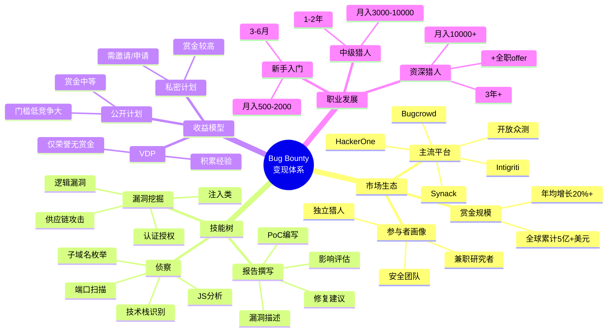
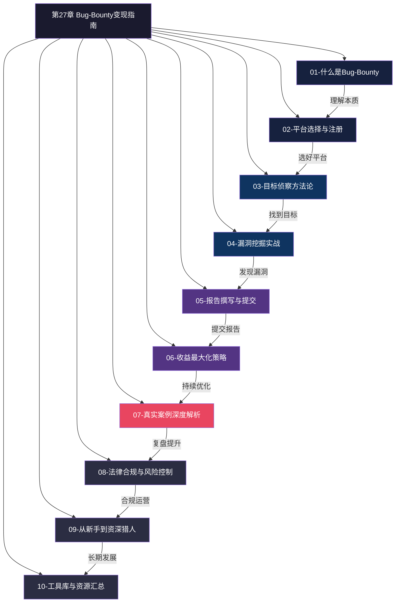
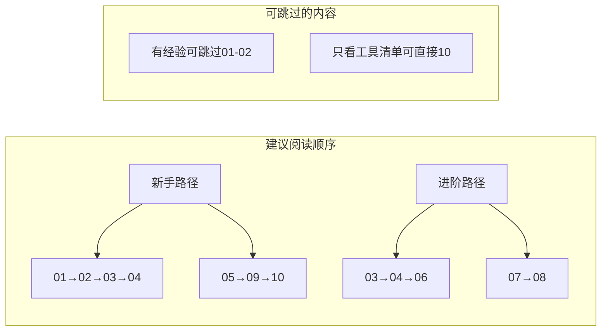

# 第27章 Bug-Bounty变现指南

## 章节概述

漏洞赏金计划（Bug Bounty Program）是当今网络安全领域最成功的众包安全模式之一。自2010年前后由HackerOne、Bugcrowd等平台推动商业化以来，它已从少数科技公司的实验性项目，演变为覆盖全球数千家企业、年产值超过数亿美元的成熟生态。

截至2025年，全球主要Bug Bounty平台累计支付赏金已超过**5亿美元**，仅HackerOne一家平台在2024年就向黑客支付了超过**1.54亿美元**。这意味着平均每个有效漏洞报告的赏金约为**500-2000美元**，而高危漏洞（如RCE、认证绕过）的单次赏金可达**1万-50万美元**。

对于安全研究者而言，Bug Bounty的核心价值在于：

- **合法变现**：在法律框架内将安全技能转化为收入，无需雇佣关系
- **实战淬炼**：面对真实系统的复杂攻击面，远超CTF和靶场的学习效果
- **声誉积累**：排行榜排名和漏洞记录成为进入顶级安全团队的敲门砖
- **灵活自由**：可全职投入，也可作为副业，时间和地点完全自主

## 为什么学习Bug Bounty变现

### 市场需求持续增长

根据Cybersecurity Ventures的预测，到2025年全球网络安全人才缺口将达到**350万人**。企业在自建安全团队成本高昂的同时，Bug Bounty提供了一种按效果付费的弹性安全补充机制。HackerOne的2024年度报告显示，平台上注册的企业客户同比增长了35%，覆盖金融、科技、医疗、电商、政府等多个行业。

### 收入潜力可观

Bug Bounty的收入并非固定薪资，而是与投入时间和技能水平直接相关：

| 级别 | 投入时间 | 月收入范围 | 典型目标 | 核心能力 |
|------|---------|-----------|---------|---------|
| 新手 | 每周5-10小时 | ¥500-3000 | 公开计划低竞争目标 | 基础Web漏洞、自动化工具 |
| 中级 | 每周15-25小时 | ¥3000-15000 | 中型公司公开+私密计划 | 深度逻辑漏洞、API安全 |
| 高级 | 全职投入 | ¥15000-50000 | 大型企业私密计划 | 0day、供应链、云安全 |
| 顶级 | 全职+策略化 | ¥50000+ | 多平台顶级计划 | 全栈攻防、自动化武器库 |

需要注意的是，上述收入范围是基于全球猎人的统计。中国猎人在海外平台上因时差和竞争格局不同，实际收入可能有所偏差，但随着国内开放众测平台的崛起，本土机会正在快速增长。

### 技能成长的加速器

Bug Bounty是少数能让你在真实环境中磨练技能的合法途径。与CTF不同，真实目标的防御更复杂、攻击面更广、约束条件更真实。许多在HackerOne排行榜前列的猎人表示，他们的技术成长速度远快于在传统安全岗位上的积累。

### 职业跳板效应

大量科技公司（Google、Apple、Microsoft、Meta等）设有自己的Bug Bounty计划，优秀的赏金猎人经常被直接招募。HackerOne的数据显示，平台上约**20%**的活跃黑客最终获得了全职安全岗位的offer。

## 本章内容架构

本章按照**道法术器**的递进逻辑组织，从理念到实操层层深入。以下是完整的内容导航：

### 第一部分：道——理解本质（第01-02节）

| 小节 | 核心内容 | 关键知识点 |
|------|---------|-----------|
| 01-什么是Bug-Bounty | 赏金计划的起源、运作机制、生态系统全貌 | 白帽vs黑帽、 responsible disclosure、赏金经济学 |
| 02-平台选择与注册 | 主流平台对比、账号体系、认证流程、个人品牌建设 | HackerOne/Bugcrowd/Synack/Intigriti对比、profile优化 |

### 第二部分：法——掌握方法（第03-04节）

| 小节 | 核心内容 | 关键知识点 |
|------|---------|-----------|
| 03-目标侦察方法论 | 系统化的信息收集与攻击面分析 | 子域名枚举、端口扫描、技术栈指纹、JS端点提取、WAF识别 |
| 04-漏洞挖掘实战 | 高价值漏洞类型的挖掘技巧与方法论 | IDOR、SSRF、认证绕过、RCE、逻辑漏洞、API安全 |

### 第三部分：术——精通技能（第05-07节）

| 小节 | 核心内容 | 关键知识点 |
|------|---------|-----------|
| 05-报告撰写与提交 | 专业级漏洞报告的结构与写作技巧 | 报告模板、PoC编写、影响量化、修复建议、沟通话术 |
| 06-收益最大化策略 | 平台算法、赏金谈判、目标选择策略 | 私密计划申请、重复报告规避、赏金翻倍技巧 |
| 07-真实案例深度解析 | 多个真实漏洞发现的完整复盘 | Web/API/移动端/云环境全场景覆盖 |

### 第四部分：器——善用工具（第08-10节）

| 小节 | 核心内容 | 关键知识点 |
|------|---------|-----------|
| 08-法律合规与风险控制 | 法律边界、合同条款、个人保护 | 各国法律差异、NDAs、免责策略 |
| 09-从新手到资深猎人 | 职业发展路线图与持续成长策略 | 技能树规划、时间管理、社区参与 |
| 10-工具库与资源汇总 | 本书推荐的全部工具与学习资源 | 工具清单、靶场平台、学习路径 |

## 学习目标

完成本章学习后，你将能够：

1. **理解生态系统**：清晰描述Bug Bounty的运作机制，区分不同平台和计划类型的优劣，选择最适合自己的起步路径
2. **系统化侦察**：独立完成目标侦察全流程，从子域名枚举到攻击面映射，建立高效的信息收集工作流
3. **深度漏洞挖掘**：掌握至少5种高价值漏洞类型的挖掘方法，在真实目标上发现并报告有效漏洞
4. **专业报告撰写**：编写被接受率>80%的漏洞报告，掌握让赏金最大化的报告技巧
5. **合规运营**：了解关键法律条款和风险控制措施，确保所有研究活动在合法框架内进行
6. **职业规划**：制定从入门到资深的个人发展路线图，建立可持续的Bug Bounty实践策略

## 适合人群

本章面向以下读者群体，按优先级排列：

| 读者类型 | 核心需求 | 本章价值点 |
|---------|---------|-----------|
| 有基础的安全爱好者 | 将技术能力转化为收入 | 完整的变现路径、平台选择、收入策略 |
| 在职安全工程师 | 拓展收入来源、提升实战能力 | 兼职策略、时间管理、技能深化 |
| 安全专业学生 | 积累实战经验、建立职业起点 | 入门路径、靶场推荐、简历加分 |
| 渗透测试从业者 | 从被动服务转向主动猎洞 | 思维转换、高级技巧、目标选择 |
| 自由职业安全顾问 | 建立稳定的研究收入流 | 多平台策略、私密计划、长期规划 |

**需要的前置技能：**

- **HTTP协议基础**：理解请求方法（GET/POST/PUT/DELETE）、状态码、Cookie/Session机制、请求头与响应头的含义。这是所有Web安全研究的基石。
- **OWASP Top 10**：熟悉常见的Web安全漏洞类型及其原理，至少包括SQL注入、XSS、CSRF、SSRF、IDOR等。
- **命令行操作**：能够使用Linux终端，掌握基本的网络工具（curl、dig、nmap、whois）。
- **代理工具使用**：至少掌握Burp Suite或类似代理工具的基本操作，能够拦截和修改HTTP请求。

如果你对上述内容还不熟悉，建议先阅读本书前面的章节进行补充学习。特别是第X章（Web安全基础）和第X章（渗透测试入门）将为你打下必要的基础。

## 章节阅读建议

- **新手读者**：建议按顺序完整阅读，不要跳过任何小节
- **有经验的安全从业者**：可快速浏览01-02节后，重点阅读04、06、07节
- **只想了解工具的读者**：可直接跳到第10节查看完整的工具库与资源汇总
- **时间有限的读者**：优先阅读04（漏洞挖掘实战）和07（案例解析），这是投入产出比最高的两节

---

> ⚠️ **安全警告与免责声明**
>
> 本章内容仅供**合法的安全测试与教育目的**使用。所有技术、工具和方法的讨论均旨在帮助安全从业者在**获得明确授权**的前提下进行防御性安全研究。
>
> - 🚫 **未经授权**对任何系统、网络或应用进行安全测试是**违法行为**，可能面临刑事追诉
> - ✅ 所有实践活动应在**隔离的实验环境**中进行（如虚拟机、专用靶场、CTF平台）
> - ✅ 严格遵守所在国家和地区的**网络安全法律法规**（如《中华人民共和国网络安全法》《数据安全法》《个人信息保护法》）
> - ✅ 遵循**负责任的漏洞披露**原则：发现漏洞后首先通知厂商，给予合理的修复时间窗口
> - ✅ 不要在未授权的情况下访问、修改或泄露任何用户数据
> - ✅ 保留所有研究过程的完整日志，以备法律审查
>
> 作者不对因滥用本章内容造成的任何后果承担责任。请始终将法律合规作为Bug Bounty实践的第一原则。
