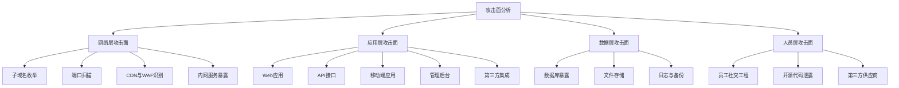

# 第27章 Bug-Bounty变现指南 - 常见误区

> 在Bug Bounty领域，知道什么不该做，往往比知道该做什么更重要。据统计，超过60%的新手研究者在头三个月内因各种误区而放弃——其中大部分误区完全可以避免。本章将系统性地剖析Bug Bounty实践中最常见的错误，从技术、报告、策略、心理到法律道德五个维度，帮助你绕过这些陷阱，建立正确的实践路径。

## 误区全景图

在深入分析之前，先通过一张全景图理解Bug Bounty误区的完整版图：

```mermaid
graph TD
    A[Bug Bounty 常见误区] --> B[技术误区]
    A --> C[报告误区]
    A --> D[策略误区]
    A --> E[心理误区]
    A --> F[法律与道德误区]

    B --> B1[过度依赖自动化]
    B --> B2[只关注常见漏洞]
    B --> B3[测试深度不足]
    B --> B4[忽视攻击面分析]
    B --> B5[工具使用不当]

    C --> C1[报告质量低下]
    C --> C2[夸大漏洞影响]
    C --> C3[重复提交]
    C --> C4[与评审沟通不当]
    C --> C5[忽视报告时效性]

    D --> D1[目标选择不当]
    D --> D2[时间管理不当]
    D --> D3[忽视社区学习]
    D --> D4[忽视私密计划]
    D --> D5[忽视漏洞链]

    E --> E1[不切实际的期望]
    E --> E2[害怕失败]
    E --> E3[比较心理]
    E --> E4[倦怠与过度投入]
    E --> E5[隧道视野]

    F --> F1[超出授权范围]
    F --> F2[数据处理不当]
    F --> F3[忽视安全港条款]
    F --> F4[税务与合规]
```



## 27.1 技术误区

技术误区是Bug Bounty新手最容易陷入的第一道陷阱。这些错误往往源于对漏洞挖掘本质的误解——认为漏洞发现是一个"扫描-提交-收钱"的线性过程，而非需要深度思考、持续学习和系统性方法的复杂活动。

### 27.1.1 过度依赖自动化扫描

**误区描述**：许多新手认为使用Nessus、Burp Suite Professional、Nuclei等自动化工具对目标进行全面扫描，就能发现大量漏洞并快速获得赏金。他们花费大量时间配置扫描器、等待扫描完成，然后批量提交扫描结果。

**现实情况**：自动化扫描器的工作机制决定了其局限性。扫描器本质上是在执行预定义的规则库——它检查的是已知的漏洞模式（如特定的SQL注入payload、常见的XSS向量、已知的CVE指纹）。这意味着：

- **只能发现已知类型漏洞**：扫描器无法发现需要理解业务逻辑才能触发的漏洞（如越权访问、业务逻辑绕过、权限提升链）。根据HackerOne的公开数据，在2023年所有已解决的报告中，纯逻辑类漏洞占比超过35%，而这类漏洞几乎无法通过自动化工具发现。
- **误报率极高**：Nessus的默认配置下误报率可达50%-80%，Nuclei的社区模板中也有大量低质量规则。批量提交未经验证的扫描结果会导致评审团队将你标记为"低质量贡献者"，后续报告会被优先跳过。
- **竞争劣势明显**：几乎所有活跃的研究者都会使用自动化工具。如果只依赖扫描器，你面对的是与数百名同样使用扫描器的人竞争同一批已知漏洞——而大部分已知漏洞早已被发现。

**正确做法**：

将自动化工具定位为"侦察兵"而非"主力军"。具体策略如下：

1. **扫描器的正确角色**：用于信息收集阶段（子域名发现、端口扫描、技术栈识别）和初步筛选（已知CVE检测、默认配置检查），而非漏洞发现的核心手段。
2. **建立手动测试优先原则**：将70%以上的时间投入手动测试。手动测试的核心是"理解目标"——阅读源代码（如果有）、分析API文档、理解业务流程、模拟真实用户行为。
3. **人工验证所有发现**：在提交任何自动化扫描结果之前，必须手动验证漏洞是否真实存在、是否有实际影响。一个简单的验证流程：复现漏洞 → 确认影响范围 → 评估业务影响 → 记录完整证据链。
4. **构建自定义扫描规则**：基于对特定目标的深入理解，编写针对性的Nuclei模板或Burp插件。例如，在测试某个电商平台时，可以编写专门检测订单ID越权的自定义规则。

> **案例参考**：知名研究者"Stok"在HackerOne上获得最高单次奖金$100,000+的漏洞，是一个复杂的业务逻辑漏洞——通过精心构造的API请求序列绕过支付验证。这个漏洞无法被任何自动化扫描器发现，需要研究者深入理解该平台的支付流程、订单状态机和API权限模型。

### 27.1.2 只关注常见漏洞类型

**误区描述**：许多研究者将全部精力投入到XSS、SQL注入、CSRF等传统Web漏洞的挖掘中，认为这些是"最经典、最可靠"的漏洞类型。

**现实情况**：这种策略在2020年代已严重过时。原因有三：

1. **防护已非常成熟**：现代Web框架（React、Vue、Angular等）默认启用CSP、输入过滤、参数化查询等防护机制。OWASP Top 10中的大部分漏洞在新建应用中已大幅减少。
2. **竞争极度激烈**：XSS和SQL注入是Bug Bounty领域竞争最激烈的漏洞类型。热门目标上，一个XSS漏洞可能在被发现后几分钟内就有多个研究者提交报告。
3. **奖金天花板低**：在大多数赏金计划中，低危XSS的奖金通常仅为$50-$200，而一个高影响业务逻辑漏洞的奖金可达$5,000-$50,000。

**高价值漏洞类型优先级**：

| 漏洞类型 | 平均奖金范围 | 竞争激烈度 | 发现难度 | 推荐指数 |
|---------|------------|-----------|---------|---------|
| SSRF（服务端请求伪造） | $2,000-$20,000 | 中等 | 中等 | ★★★★★ |
| IDOR（不安全的直接对象引用） | $1,000-$15,000 | 中等 | 低-中等 | ★★★★★ |
| 认证/授权绕过 | $3,000-$30,000 | 低 | 高 | ★★★★★ |
| 业务逻辑漏洞 | $2,000-$50,000 | 低 | 高 | ★★★★★ |
| 竞态条件 | $1,000-$10,000 | 低 | 高 | ★★★★ |
| 供应链攻击 | $5,000-$50,000 | 极低 | 极高 | ★★★★ |
| 云安全配置错误 | $1,000-$10,000 | 中等 | 中等 | ★★★★ |
| XSS（反射型/存储型） | $50-$1,000 | 极高 | 低 | ★★ |
| SQL注入 | $500-$5,000 | 极高 | 低-中等 | ★★★ |
| CSRF | $50-$500 | 极高 | 低 | ★ |

**正确做法**：

1. **建立漏洞类型知识图谱**：系统性地学习每一类高价值漏洞的原理、触发条件、检测方法和绕过技巧。不要只停留在"知道有这个漏洞"的层面，而要能独立在真实目标上发现并利用它。
2. **深入理解业务逻辑**：这是发现高价值漏洞的核心能力。方法包括：注册多个账户测试不同角色间的权限边界、逆向分析移动端应用、阅读API文档理解数据流、模拟真实业务流程寻找逻辑缺陷。
3. **关注新兴领域**：云原生安全（Kubernetes配置错误、容器逃逸）、API安全（GraphQL注入、OAuth实现缺陷）、移动安全（签名绕过、本地存储泄露）、IoT安全等新兴领域竞争相对较小，但需要持续学习。
4. **研究目标技术栈**：不同技术栈有不同的漏洞模式。例如，使用Spring Boot的应用容易出现SpEL注入和Actuator端点泄露；使用Django的应用可能存在SQL注入和中间件配置问题；使用Node.js的应用需要关注原型链污染和事件循环竞争。

### 27.1.3 测试深度不足

**误区描述**：在目标上进行1-2小时的简单测试后，就得出结论"这个目标没有漏洞"，然后转向下一个目标。这种"广撒网、浅测试"的策略看似高效，实则效率极低。

**现实情况**：Bug Bounty领域存在一个反直觉的现象——**发现一个高质量漏洞所需的时间往往呈指数级增长**。前30%的漏洞可能在几小时内发现，但后70%的漏洞可能需要数天甚至数周的深入测试。原因如下：

- **浅层漏洞已被收割**：任何公开的目标，其表面层的漏洞（如默认的配置文件泄露、明显的XSS等）早已被无数研究者发现。
- **深层漏洞需要组合条件**：一个完整的漏洞利用链可能需要：先发现一个信息泄露端点 → 从中获取内部服务信息 → 利用SSRF访问内部服务 → 通过特定参数触发逻辑缺陷 → 最终实现权限提升。这种多层利用链无法通过浅层测试发现。
- **业务理解需要时间**：要发现业务逻辑漏洞，必须先理解业务。理解一个电商平台的订单流程、支付流程、退款流程、优惠券系统，可能需要数小时的探索。

**正确做法**：

1. **建立深度测试方法论**：
   - **第一层（快速扫描）**：30分钟-1小时，使用自动化工具进行基础扫描，了解目标概况。
   - **第二层（功能探索）**：2-4小时，手动探索所有主要功能模块，理解业务流程。
   - **第三层（边界测试）**：4-8小时，针对每个功能模块进行边界条件测试、参数注入、权限测试。
   - **第四层（深度利用）**：8小时+，对发现的潜在问题进行深入利用，构建完整的攻击链。

2. **设定合理的时间预算**：为每个目标设定一个"深度测试时间预算"（例如20-40小时），在预算内不轻易放弃。如果预算用尽仍无发现，可以暂时放下，过一段时间再回来——有时新的视角会带来新的发现。

3. **记录所有测试过程**：使用笔记工具（如Obsidian、Notion）记录每个测试步骤、每个发现（无论大小）、每个思路。这些记录在后续分析中可能成为关键线索。

4. **采用"回归测试"策略**：在发现一个漏洞后，不要立即转向新目标。同一个目标上往往存在相关漏洞——修复一个漏洞可能暴露另一个，或者相似的逻辑缺陷可能存在于其他模块。

### 27.1.4 忽视攻击面分析

**误区描述**：拿到目标域名后，直接开始对主站进行漏洞测试，没有系统地梳理目标的所有攻击面。

**现实情况**：一个典型的互联网企业可能拥有数十甚至数百个子域名，每个子域名可能对应不同的服务（主站、API、管理后台、CDN、备份站点、开发环境、测试环境等）。每个服务都可能使用不同的技术栈、不同的安全策略、不同的开发团队——这意味着每个服务都是一个独立的攻击面。

**攻击面分析的完整框架**：



**正确做法**：

1. **子域名枚举**：使用多种工具和方法进行穷举式子域名发现。工具组合推荐：Subfinder + Amass + Assetfinder + OneForAll。数据来源包括：DNS记录、搜索引擎、证书透明度日志、代码仓库、API响应、第三方数据源（如SecurityTrails、Shodan）。
2. **端口与服务扫描**：对发现的每个IP进行端口扫描，识别运行中的服务。使用nmap进行基础扫描，使用nuclei进行服务指纹识别。
3. **技术栈识别**：使用Wappalyzer、BuiltWith等工具识别每个子域名的技术栈，针对性地选择测试方法。
4. **历史版本分析**：使用Wayback Machine查看目标的历史版本，可能发现已下线但仍有残留的服务、旧版本的API端点、泄露的敏感信息。
5. **第三方依赖分析**：检查目标使用的第三方服务（CDN、支付网关、分析工具、客服系统等），这些第三方集成可能引入额外的攻击面。

### 27.1.5 工具使用不当

**误区描述**：盲目使用各种工具，不了解工具的适用场景、局限性和正确配置方法。

**常见工具使用误区**：

| 工具 | 常见误用 | 正确用法 |
|------|---------|---------|
| Burp Suite | 只使用默认配置，不调整扫描策略 | 根据目标特点自定义扫描策略，调整线程数和请求间隔 |
| Nmap | 只使用默认扫描脚本 | 编写自定义NSE脚本，结合服务指纹进行深度探测 |
| Nuclei | 使用全部社区模板进行暴力扫描 | 筛选高质量模板，编写自定义模板，控制扫描速率 |
| SQLMap | 对所有参数进行自动化注入 | 先手动确认注入点，使用SQLMap进行自动化利用和权限提升 |
| OWASP ZAP | 依赖自动扫描结果 | 将自动扫描作为辅助，重点进行手动探索 |

**正确做法**：

1. **理解工具原理**：在使用任何工具之前，先理解其工作原理。例如，了解Burp Suite的扫描器是如何生成payload的、SQLMap的检测算法是什么、Nuclei的模板引擎如何工作。
2. **定制化配置**：根据目标特点调整工具配置。例如，对敏感目标降低扫描速率以避免触发WAF；对API目标调整请求格式和认证方式。
3. **工具链整合**：将多个工具串联成自动化工作流。例如：Subfinder（子域名发现）→ HTTPX（存活检测）→ Nuclei（漏洞扫描）→ 手动验证。
4. **持续更新**：保持工具和规则库的更新。漏洞利用技术和防护技术都在快速演进，过时的工具可能无法发现新型漏洞。

## 27.2 报告误区

报告是Bug Bounty研究者与厂商之间的桥梁。一份高质量的报告不仅能提高漏洞被接受的概率，还能直接影响赏金金额。然而，许多研究者在报告撰写上投入的时间和精力远远不够。

### 27.2.1 报告质量低下

**误区描述**：提交简略的漏洞报告，缺乏详细的复现步骤和影响分析。典型的低质量报告可能只有几句话："发现XSS漏洞，URL是xxx，payload是yyy。"

**现实情况**：低质量报告会导致一系列负面后果：

- **评审无法复现**：评审人员需要按照你的步骤精确复现漏洞才能确认其存在。如果步骤不完整或环境描述不清，评审可能无法复现，直接关闭报告。
- **漏洞被低估**：没有充分的影响分析，评审可能无法理解漏洞的真实危害，导致奖金被低估。
- **信誉受损**：频繁提交低质量报告会让评审团队对你的专业度产生怀疑，后续报告可能被更严格地审查。

**高质量报告的标准结构**：

```text
标题：[漏洞类型] - [受影响组件] - [简要影响描述]
摘要：2-3句话概括漏洞的核心问题和影响
详细描述：
  - 漏洞原理：解释漏洞产生的技术原因
  - 受影响版本/环境：明确漏洞适用的版本和条件
  - 复现步骤：编号列表，每一步包含完整的请求和响应
  - 证据：截图、视频、原始数据
影响分析：
  - 业务影响：对业务的实际危害
  - 技术影响：可被利用的程度和方式
  - CVSS评分：提供客观的评分依据
修复建议：
  - 短期缓解措施
  - 长期修复方案
  - 参考资源
```

**正确做法**：

1. **投入与发现时间相当的时间撰写报告**：如果你花8小时发现一个漏洞，至少花2-4小时撰写报告。报告质量直接影响赏金金额——一份优秀的报告可能让奖金翻倍。
2. **提供完整的请求/响应**：使用Burp Suite的"Copy as curl command"功能导出完整请求，确保评审可以一键复现。
3. **用截图和视频辅助说明**：对于复杂的漏洞利用链，截图和视频比文字描述更直观。录制完整的复现过程，标注关键步骤。
4. **量化影响**：不要只说"可以获取敏感信息"，而要具体说明"可以获取所有用户的邮箱、手机号、收货地址，涉及约50万用户数据"。

> **对比案例**：
>
> **低质量报告**：
> "发现SQL注入漏洞。URL: /search?q=xxx。可以获取数据库信息。"
>
> **高质量报告**：
> "发现/search端点存在SQL注入漏洞。通过构造payload ' OR 1=1-- 可以绕过WHERE子句，获取所有用户记录。具体影响：攻击者可以读取所有用户的用户名、邮箱、密码哈希、注册时间等信息，涉及约100万用户账户。复现步骤：1) 发送GET请求到/search?q=' OR 1=1-- 2) 服务器返回所有用户记录... 修复建议：使用参数化查询替代字符串拼接..."

### 27.2.2 夸大漏洞影响

**误区描述**：为了获得更高奖金，故意夸大漏洞的影响程度。例如，将一个低危的信息泄露漏洞描述为"可以完全控制服务器"。

**现实情况**：夸大影响会导致严重的信誉损失。Bug Bounty社区的评审团队通常由经验丰富的安全专家组成，他们能轻易识别夸大其词的报告。一旦被发现，后果包括：

- **被标记为不可靠研究者**：在HackerOne上，信誉评分低的报告者会被标记，后续报告被优先跳过或自动拒绝。
- **奖金被降低**：即使漏洞被接受，奖金也会根据实际影响重新评估。
- **被列入黑名单**：严重的夸大行为可能导致账户被暂停或封禁。

**正确做法**：

1. **客观、准确地描述漏洞影响**：基于实际测试的证据来评估影响，而不是基于想象。
2. **使用CVSS评分框架**：CVSS（Common Vulnerability Scoring System）提供了标准化的漏洞评分方法。使用CVSS v3.1或v4.0计算评分，并附上评分依据。
3. **如果不确定影响程度，可以询问评审**：在报告中注明"影响程度可能需要进一步评估"，邀请评审提供更多反馈。
4. **建立诚实、专业的声誉**：长期来看，诚实的声誉比单次的高额奖金更有价值。

### 27.2.3 报告重复提交

**误区描述**：将同一漏洞稍作修改后在多个计划中提交，或在同一计划中多次提交相似漏洞。

**现实情况**：Bug Bounty平台有严格的重复报告检测机制。HackerOne使用基于漏洞特征、受影响组件、利用方法等多维度匹配来检测重复报告。Bugcrowd也有类似的检测系统。重复提交的后果包括：

- **违反平台规则**：可能导致账户被警告、暂停或封禁。
- **浪费资源**：厂商和平台需要投入人力处理重复报告，这会降低整个生态的效率。
- **损害声誉**：频繁重复提交会让评审团队认为你缺乏专业素养。

**正确做法**：

1. **仔细阅读计划的规则**：每个计划对"重复报告"的定义可能不同。有些计划将同一类漏洞的不同实例视为重复，有些则允许。
2. **确保每个报告都是独立的发现**：在提交之前，检查是否已有类似报告被提交（可以通过平台的公开报告库搜索）。
3. **如果发现相似漏洞，合并为一个报告**：将多个相关漏洞整合为一个综合报告，展示完整的攻击链，这通常比多个独立报告获得更高的奖金。
4. **保持诚实和专业**：如果不确定是否重复，可以在报告中说明，让评审团队判断。

### 27.2.4 与评审沟通不当

**误区描述**：在报告提交后，与评审人员的沟通方式不当，导致关系恶化或报告被拒。

**常见沟通误区**：

- **催促回复**：频繁发送消息催促评审回复，给评审团队造成压力。
- **争论评分**：对奖金金额不满时，用不礼貌的方式与评审争论。
- **提供不完整信息**：在评审要求补充信息时，回复模糊或不完整。
- **情绪化表达**：在报告被拒后，发表负面情绪的评论或威胁。

**正确做法**：

1. **保持专业和礼貌**：将评审视为合作伙伴而非对手。评审团队的目标是帮助厂商修复漏洞，与你的目标一致。
2. **及时响应评审请求**：当评审要求补充信息或复现步骤时，在24-48小时内响应。
3. **理性讨论评分**：如果对奖金金额有异议，可以礼貌地提供补充证据来说明漏洞的实际影响，但不要情绪化地争论。
4. **接受反馈并改进**：将每次评审反馈视为学习机会，改进自己的测试方法和报告质量。

### 27.2.5 忽视报告时效性

**误区描述**：发现漏洞后不立即提交报告，而是等待"更好的时机"或试图"最大化利用"。

**现实情况**：延迟提交报告可能导致：

- **漏洞被他人抢先提交**：Bug Bounty是先到先得的竞争，延迟提交可能让你失去奖金。
- **厂商已自行发现并修复**：厂商可能有自己的安全团队或监控机制，漏洞可能在你提交之前已被发现。
- **违反平台规则**：某些平台要求在规定时间内提交报告，延迟可能被视为违规。

**正确做法**：

1. **发现漏洞后立即提交**：不要等待"更好的时机"。一个完整的报告比一个"完美"但延迟的报告更有价值。
2. **先提交初步报告，后续补充**：如果漏洞复杂，可以先提交一个初步报告确认发现，然后在后续沟通中补充详细分析。
3. **了解平台的时效要求**：不同平台对报告提交时间有不同的要求，确保在规定的时间内提交。

## 27.3 策略误区

策略误区涉及目标选择、时间管理、学习路径等宏观层面的决策。这些误区往往不会立即导致失败，但会严重影响长期效率和收益。

### 27.3.1 目标选择不当

**误区描述**：只关注大公司（如Google、Facebook、Apple）的公开计划，认为这些计划的奖金最高、最可靠。

**现实情况**：这种策略存在显著问题：

- **竞争极度激烈**：大公司的公开计划吸引了全球最优秀的研究者。热门目标上，一个漏洞可能在被发现后几分钟内就有多个报告提交。
- **安全防护成熟**：大公司有成熟的安全团队和防护体系，漏洞数量相对较少。
- **中小公司机会被忽视**：许多中小型公司的安全投入较少，漏洞数量更多，竞争也相对较小。

**目标选择策略矩阵**：

| 目标类型 | 竞争程度 | 漏洞数量 | 平均奖金 | 推荐策略 |
|---------|---------|---------|---------|---------|
| 大型科技公司公开计划 | 极高 | 低 | 高 | 作为长期目标，积累信誉 |
| 中型公司公开计划 | 中等 | 中等 | 中等 | 作为主要目标，平衡竞争与收益 |
| 小型公司公开计划 | 低 | 高 | 低-中等 | 作为入门目标，快速积累经验 |
| 私密计划 | 低 | 中等 | 高 | 积累信誉后优先选择 |
| VDP（漏洞披露计划） | 低 | 高 | 无奖金 | 作为练习目标，积累报告数量 |

**正确做法**：

1. **建立目标分级体系**：将目标分为"主攻目标"（2-3个，深度测试）、"辅助目标"（5-10个，定期测试）、"观察目标"（持续关注，等待机会）。
2. **关注新发布的计划**：新计划发布的前几周是黄金窗口期——竞争最少，漏洞最多。关注HackerOne和Bugcrowd的"New Programs"页面。
3. **选择与自身技术专长匹配的目标**：如果你擅长移动安全，优先选择有移动应用的计划；如果你擅长云安全，优先选择有云基础设施的计划。
4. **考虑私密计划的机会**：私密计划的竞争通常比公开计划小很多，但需要积累一定信誉才能加入。可以通过在公开计划上积累高质量报告来提升信誉。

### 27.3.2 时间管理不当

**误区描述**：在单一目标上花费过多时间（陷入"沉没成本"陷阱），或频繁切换目标导致每次都需要重新了解目标。

**现实情况**：时间管理是Bug Bounty成功的关键因素。研究表明，成功的Bug Bounty研究者平均每天投入4-8小时进行测试，而新手往往在时间分配上存在极端倾向——要么在一个目标上"死磕"数周无果，要么每天切换3-5个目标浅尝辄止。

**时间管理框架**：

```mermaid
gantt
    title Bug Bounty 时间分配建议
    dateFormat X
    axisFormat %H:%M

    section 侦察阶段
    子域名枚举           :a1, 0, 30m
    端口扫描             :a2, after a1, 30m
    技术栈识别           :a3, after a2, 30m

    section 测试阶段
    功能探索             :b1, after a3, 2h
    边界测试             :b2, after b1, 4h
    深度利用             :b3, after b2, 8h

    section 报告阶段
    撰写报告             :c1, after b3, 2h
    补充证据             :c2, after c1, 1h
```



**正确做法**：

1. **设定目标时间预算**：为每个目标设定一个"深度测试时间预算"（例如20-40小时）。在预算内不轻易放弃，预算用尽后评估是否继续。
2. **使用"时间盒"方法**：将测试时间划分为固定长度的时间盒（如2小时），每个时间盒专注于一个特定任务（如"测试API权限"、"测试文件上传"）。
3. **定期评估进展**：每完成一个时间盒后，评估是否有发现、是否值得继续投入。如果没有发现且没有新的线索，可以考虑暂时放下。
4. **记录测试笔记**：使用笔记工具记录每个测试步骤、每个发现、每个思路。这些记录在后续分析中可能成为关键线索，也能减少切换目标时的重新了解成本。
5. **建立测试模板**：为不同类型的目标建立标准化的测试模板（如"Web应用测试清单"、"API测试清单"、"移动应用测试清单"），减少每次测试的准备工作。

### 27.3.3 忽视社区和学习

**误区描述**：闭门造车，不参与社区交流和学习，认为"自己摸索就够了"。

**现实情况**：Bug Bounty领域技术更新迅速，新的漏洞类型、新的利用技巧、新的防护绕过方法不断涌现。社区是获取最新信息、学习他人经验、拓宽思路的重要渠道。

**Bug Bounty社区资源**：

| 资源类型 | 推荐资源 | 价值 |
|---------|---------|------|
| 平台官方博客 | HackerOne Hacker101、Bugcrowd University | 系统化学习，官方权威 |
| 研究者博客 | NahamSec、Stök、D0nut、TomNomNom | 实战经验分享，技巧深入 |
| 安全会议 | DEF CON、Black Hat、BSides | 前沿技术，行业趋势 |
| 在线社区 | Reddit r/bugbounty、Discord社区 | 实时讨论，问题解答 |
| 漏洞报告库 | HackerOne Hacktivity、Bugcrowd Disclosures | 学习他人报告，了解趋势 |
| CTF平台 | HackTheBox、TryHackMe、PortSwigger Web Academy | 技能练习，知识巩固 |

**正确做法**：

1. **定期阅读优秀报告**：每周至少阅读2-3份高质量漏洞报告，分析作者的测试思路、利用方法和报告撰写技巧。
2. **参与社区讨论**：在Discord、Reddit等社区积极参与讨论，提出问题、分享经验、学习他人见解。
3. **关注安全研究者的社交媒体**：在Twitter、LinkedIn上关注活跃的安全研究者，获取最新的技术分享和行业动态。
4. **参加安全会议和活动**：即使无法现场参加，也可以通过线上直播、会议录像、slideshare等方式学习。
5. **分享自己的经验**：在保密义务范围内，分享自己的测试方法和发现。教学相长——教别人的过程也是加深自己理解的过程。

### 27.3.4 忽视私密计划

**误区描述**：只关注公开计划，认为私密计划"门槛高、难加入"，不值得投入精力。

**现实情况**：私密计划是Bug Bounty领域的高价值机会。私密计划的竞争通常比公开计划小很多，奖金也往往更高。然而，加入私密计划需要积累一定的信誉——这本身就是一个长期目标。

**如何获得私密计划邀请**：

1. **在公开计划上积累高质量报告**：提交至少5-10份被接受的高质量报告，建立可靠的信誉记录。
2. **获得"Triager"或"Top Hacker"标签**：在HackerOne上，获得Triager标签或进入Top Hacker排名可以增加被邀请的概率。
3. **参与平台的认证项目**：如HackerOne的"HackerRank"认证、Bugcrowd的"BCR"认证。
4. **建立个人品牌**：通过博客、社交媒体、安全会议等方式建立个人品牌，让厂商主动邀请你。

**正确做法**：

1. **将加入私密计划作为长期目标**：制定一个3-6个月的计划，在公开计划上积累足够的高质量报告。
2. **关注私密计划的发布动态**：即使暂时没有资格，也要关注私密计划的发布，了解哪些厂商有私密计划、计划的特点是什么。
3. **提升报告质量**：私密计划的评审通常更严格，需要更高标准的报告质量。

### 27.3.5 忽视漏洞链

**误区描述**：发现一个漏洞后就立即提交，没有尝试将多个漏洞组合成更完整的攻击链。

**现实情况**：单个漏洞的奖金通常有限，但将多个漏洞组合成完整的攻击链可以显著提升奖金。例如：

- **信息泄露 + SSRF + 云元数据访问**：先通过信息泄露获取内部服务信息，再利用SSRF访问内部服务，最终通过云元数据服务获取敏感凭证。
- **XSS + CSRF + 权限提升**：先通过XSS获取用户会话，再利用CSRF执行权限提升操作。
- **IDOR + 业务逻辑漏洞 + 数据批量导出**：先通过IDOR访问他人数据，再利用业务逻辑漏洞绕过限制，最终批量导出数据。

**正确做法**：

1. **建立"漏洞链思维"**：在发现一个漏洞后，不要立即提交，而是思考"这个漏洞可以被用来做什么？"、"还有哪些相关的漏洞可以组合？"。
2. **绘制攻击链图**：使用Mermaid或手绘方式绘制攻击链图，清晰地展示每个漏洞在攻击链中的作用。
3. **在报告中展示完整的攻击链**：即使只发现了一个漏洞，也可以在报告中描述可能的攻击链，展示漏洞的潜在危害。
4. **合并相关漏洞为一个报告**：如果发现多个相关漏洞，可以将它们合并为一个综合报告，展示完整的攻击链，这通常比多个独立报告获得更高的奖金。

## 27.4 心理误区

心理误区是影响Bug Bounty长期成功的关键因素。许多技术能力很强的研究者在心理层面遇到了瓶颈，导致无法持续产出。

### 27.4.1 不切实际的期望

**误区描述**：期望通过Bug Bounty快速致富，或认为每个漏洞都能获得高额奖金。许多新手受到社交媒体上"月入百万"故事的影响，对Bug Bounty的收入期望严重脱离现实。

**现实情况**：Bug Bounty的收入分布极度不均。根据HackerOne的公开数据：

- **收入分布**：约50%的研究者年收入低于$1,000，约10%的研究者年收入超过$50,000，只有约1%的研究者年收入超过$100,000。
- **奖金中位数**：大多数漏洞的奖金在$100-$5,000之间，中位数约为$500-$1,000。
- **时间投入**：从开始到获得第一份奖金，平均需要3-6个月；从开始到获得稳定收入，平均需要1-2年。

**收入预期阶梯**：

| 阶段 | 时间 | 月收入预期 | 主要活动 |
|------|------|-----------|---------|
| 入门期 | 0-6个月 | $0-$500 | 学习基础知识，在VDP和简单计划上练习 |
| 成长期 | 6-18个月 | $500-$3,000 | 在公开计划上积累报告，建立信誉 |
| 成熟期 | 18-36个月 | $3,000-$10,000 | 在私密计划上测试，建立个人品牌 |
| 专家期 | 36个月+ | $10,000+ | 成为顶级研究者，获得高价值漏洞 |

**正确做法**：

1. **设定合理的收入预期**：将Bug Bounty视为长期投资，而非快速致富途径。设定阶段性目标（如"6个月内获得第一份奖金"、"1年内年收入达到$5,000"）。
2. **将Bug Bounty作为副业开始**：在建立稳定收入之前，不要将Bug Bounty作为唯一收入来源。保持稳定的工作或学习，将Bug Bounty作为技能提升和额外收入的途径。
3. **享受发现漏洞的过程**：将Bug Bounty视为学习和成长的机会，而不仅仅是赚钱的手段。享受解决技术挑战的成就感。
4. **持续学习和提升技能**：Bug Bounty的成功需要持续的技术投入。将时间分配给学习新技术、新漏洞类型、新工具。

### 27.4.2 害怕失败

**误区描述**：害怕报告被拒绝或被标记为重复，不敢提交报告。许多新手在发现漏洞后犹豫不决，担心"这个漏洞会不会太简单？"、"评审会不会觉得我没能力？"。

**现实情况**：被拒绝是Bug Bounty的常态，而非例外。即使是经验丰富的研究者，也有相当比例的报告被拒绝。原因包括：

- **漏洞已被修复**：在你发现之前，厂商可能已经修复了该漏洞。
- **漏洞影响有限**：漏洞虽然存在，但实际影响较小。
- **报告质量不足**：报告不够详细，评审无法复现或评估影响。
- **超出范围**：测试的目标不在授权范围内。

**正确做法**：

1. **将失败视为学习机会**：每次被拒绝后，分析拒绝的原因，从中学习改进。
2. **从被拒绝的报告中总结经验**：记录每次被拒绝的原因，定期回顾，找出模式。
3. **逐步提升报告质量**：每次提交报告前，对照高质量报告的标准检查自己的报告。
4. **建立自信，但也要保持谦逊**：相信自己的能力，但也要接受"不是每个漏洞都能被接受"的现实。

### 27.4.3 比较心理

**误区描述**：与其他研究者比较收入和成就，产生挫败感。看到社交媒体上"月入百万"的故事，怀疑自己的能力。

**现实情况**：社交媒体上的成功故事往往具有幸存者偏差——只有成功者会分享他们的成就，而失败者通常保持沉默。此外，每个人的起点、时间投入、技术背景都不同，直接比较没有意义。

**正确做法**：

1. **专注于自己的成长和进步**：设定个人目标，关注自己的进步轨迹，而不是与他人的绝对成就比较。
2. **庆祝自己的每一个成就**：无论是发现第一个漏洞、获得第一份奖金，还是提交第一份高质量报告，都值得庆祝。
3. **从他人的成功中学习**：将他人的成功视为学习机会，分析他们的测试方法、报告技巧、时间管理策略。
4. **建立支持网络**：与其他研究者建立联系，互相鼓励、分享经验、共同学习。

### 27.4.4 倦怠与过度投入

**误区描述**：将Bug Bounty视为唯一的生活重心，每天投入10+小时进行测试，导致身心疲惫、效率下降。

**现实情况**：Bug Bounty是一个需要长期投入的领域，但过度投入会导致倦怠（Burnout）。倦怠的症状包括：

- **兴趣丧失**：对漏洞发现不再感到兴奋，测试变成机械性的重复。
- **效率下降**：即使投入大量时间，发现漏洞的能力也在下降。
- **情绪波动**：对报告被拒绝、奖金较低等事件产生强烈的情绪反应。
- **身体健康问题**：长期久坐、熬夜、饮食不规律导致健康问题。

**正确做法**：

1. **设定合理的时间边界**：每天投入4-8小时进行测试，留出时间给休息、运动、社交。
2. **定期休息和放松**：每周至少休息一天，完全脱离Bug Bounty相关工作。
3. **多样化活动**：不要将所有时间都投入漏洞测试，也要花时间学习新技术、阅读安全研究、参与社区活动。
4. **关注身体健康**：保持规律的作息、适量的运动、健康的饮食。
5. **寻求支持**：如果出现倦怠症状，及时寻求家人、朋友或专业人士的支持。

### 27.4.5 隧道视野

**误区描述**：过度专注于某一类漏洞或某一个目标，忽视其他可能性。

**现实情况**：隧道视野会导致机会的丧失。例如：

- **只关注Web漏洞**：忽视移动安全、云安全、IoT安全等其他领域。
- **只关注某个目标**：忽视其他可能有更多机会的目标。
- **只关注某种技术栈**：忽视其他技术栈的漏洞模式。

**正确做法**：

1. **保持技术视野的广度**：定期学习新的技术领域，了解不同领域的漏洞模式。
2. **定期评估目标组合**：每季度评估一次目标组合，确保没有过度集中在某个目标或某类漏洞上。
3. **尝试新的测试方法**：定期尝试新的测试方法、新的工具、新的漏洞类型，保持技术的多样性。
4. **从不同角度思考问题**：在测试某个功能时，尝试从多个角度思考——攻击者会怎么利用？用户会怎么操作？开发者会怎么实现？

## 27.5 法律与道德误区

法律与道德误区是最危险的误区，可能导致严重的法律后果和职业声誉损失。

### 27.5.1 超出授权范围

**误区描述**：为了发现更多漏洞，超出计划明确授权的测试范围。例如，测试计划中未包含的子域名、测试生产环境以外的系统、对非授权的目标进行测试。

**现实情况**：超出授权范围可能构成违法行为，即使你的意图是善意的。根据美国《计算机欺诈和滥用法》（CFAA）和各国类似的计算机犯罪法律，未经授权访问计算机系统可能面临：

- **民事赔偿**：厂商可以起诉你要求赔偿损失。
- **刑事责任**：可能面临罚款和监禁。
- **职业声誉损失**：即使没有法律后果，超出授权范围的行为也会严重损害你的职业声誉。

**真实案例**：2019年，一名研究者在测试某公司的公开计划时，发现了一个指向内部系统的链接，并继续测试了该系统。虽然发现了严重漏洞，但因为超出了授权范围，厂商不仅拒绝支付奖金，还威胁采取法律行动。

**正确做法**：

1. **严格遵守计划的范围说明**：仔细阅读计划的Scope（范围）部分，明确哪些目标可以测试、哪些不可以。
2. **如有疑问，先向计划管理员确认**：如果不确定某个目标是否在范围内，先通过平台的沟通渠道向计划管理员确认。
3. **记录所有测试活动**：保留测试日志、请求记录、时间戳等，作为合规的证据。
4. **了解法律边界**：学习相关的计算机犯罪法律，了解什么行为是合法的、什么行为可能违法。

### 27.5.2 数据处理不当

**误区描述**：发现敏感数据后，下载、存储或传播这些数据。例如，将泄露的用户数据保存到本地、在社交媒体上分享截图、将数据用于其他目的。

**现实情况**：处理敏感数据不当可能违反数据保护法规，如欧盟的GDPR、中国的《个人信息保护法》（PIPL）、美国的CCPA等。后果包括：

- **民事赔偿**：数据主体可以起诉你要求赔偿。
- **刑事责任**：在某些司法管辖区，非法获取或传播个人数据可能构成犯罪。
- **职业声誉损失**：数据泄露事件会严重损害你的职业声誉。

**正确做法**：

1. **发现敏感数据后立即报告**：不要下载或存储敏感数据，立即通过平台提交报告。
2. **使用截图等方式记录发现**：如果需要记录证据，使用截图或录屏的方式，避免下载原始数据。
3. **遵守数据保护相关法规**：了解并遵守相关司法管辖区的数据保护法规。
4. **如有需要，咨询法律专业人士**：如果不确定如何处理发现的敏感数据，咨询法律专业人士。

### 27.5.3 忽视安全港条款

**误区描述**：不了解或不遵守平台的安全港（Safe Harbor）条款，导致法律保护缺失。

**现实情况**：安全港条款是Bug Bounty平台为保护合规研究者而设立的条款，承诺不会对在授权范围内进行善意的安全测试的研究者采取法律行动。然而，安全港条款通常有严格的条件：

- **必须在授权范围内**：超出范围的测试不受安全港保护。
- **必须遵守平台规则**：违反平台规则（如重复提交、攻击性行为）可能导致安全港保护失效。
- **必须及时报告**：发现漏洞后必须及时报告，不能延迟或隐瞒。

**正确做法**：

1. **仔细阅读安全港条款**：在参与任何计划之前，仔细阅读平台的安全港条款，了解保护条件和限制。
2. **严格遵守条款**：确保所有测试活动都在安全港条款的保护范围内。
3. **保留证据**：保留所有测试活动的记录，以便在需要时证明自己的合规性。

### 27.5.4 税务与合规

**误区描述**：忽视Bug Bounty收入的税务义务，不申报收入、不缴纳相关税费。

**现实情况**：Bug Bounty收入属于合法收入，需要依法申报和纳税。不同国家/地区的税务规定不同：

- **美国**：Bug Bounty收入属于"自雇收入"，需要缴纳所得税和自雇税。平台通常会发放1099表格。
- **中国**：Bug Bounty收入属于"劳务报酬"或"偶然所得"，需要依法申报纳税。
- **欧盟**：各国税务规定不同，但通常需要申报收入并缴纳相关税费。

**正确做法**：

1. **了解所在国家/地区的税务规定**：咨询税务专业人士，了解Bug Bounty收入的税务处理方式。
2. **保留收入记录**：记录所有Bug Bounty收入，包括奖金金额、支付时间、平台信息。
3. **依法申报和纳税**：按时申报收入，缴纳相关税费。
4. **考虑注册企业实体**：如果Bug Bounty收入较高，可以考虑注册企业实体（如LLC、个体户），优化税务结构。

## 27.6 误区自检清单

为了帮助你系统地识别和避免这些误区，以下是一份自检清单。建议每月进行一次自我评估：

### 技术层面

- [ ] 我是否过度依赖自动化工具？手动测试时间是否占总测试时间的70%以上？
- [ ] 我是否只关注常见漏洞类型？是否定期学习新漏洞类型？
- [ ] 我是否在单一目标上投入了足够的时间？是否有"深度测试时间预算"？
- [ ] 我是否系统地进行了攻击面分析？是否覆盖了所有子域名和服务？
- [ ] 我是否正确使用了各种工具？是否定期更新工具和规则库？

### 报告层面

- [ ] 我的报告是否包含完整的复现步骤？评审是否可以一键复现？
- [ ] 我是否客观地评估了漏洞影响？是否使用了CVSS评分？
- [ ] 我是否避免了重复提交？是否仔细阅读了计划的规则？
- [ ] 我是否与评审保持了良好的沟通？是否及时响应评审请求？
- [ ] 我是否在发现漏洞后及时提交了报告？

### 策略层面

- [ ] 我的目标选择是否合理？是否平衡了大中小公司？
- [ ] 我的时间管理是否有效？是否使用了"时间盒"方法？
- [ ] 我是否积极参与社区和学习？是否定期阅读优秀报告？
- [ ] 我是否在积累加入私密计划的信誉？
- [ ] 我是否尝试将多个漏洞组合成攻击链？

### 心理层面

- [ ] 我的收入预期是否合理？是否将Bug Bounty视为长期投资？
- [ ] 我是否将失败视为学习机会？是否从被拒绝的报告中总结经验？
- [ ] 我是否专注于自己的成长？是否避免与他人比较？
- [ ] 我是否保持了健康的工作生活平衡？是否定期休息？
- [ ] 我是否保持了技术视野的广度？是否定期尝试新的测试方法？

### 法律与道德层面

- [ ] 我是否严格遵守了计划的范围说明？
- [ ] 我是否正确处理了发现的敏感数据？
- [ ] 我是否了解了平台的安全港条款？
- [ ] 我是否依法申报和缴纳了Bug Bounty收入的相关税费？

## 27.7 总结

Bug Bounty是一个充满机遇但也充满陷阱的领域。本章从技术、报告、策略、心理、法律道德五个维度，系统地剖析了最常见的误区。避免这些误区的关键在于：

1. **建立正确的认知**：Bug Bounty不是"扫描-提交-收钱"的简单过程，而是需要深度思考、持续学习和系统性方法的复杂活动。
2. **注重质量而非数量**：一份高质量报告的价值远超十份低质量报告。
3. **保持长期视角**：Bug Bounty的成功需要长期积累，不是一蹴而就的。
4. **遵守法律与道德**：合法合规是参与Bug Bounty的基本前提。
5. **持续学习和改进**：Bug Bounty领域技术更新迅速，需要持续学习新技术、新方法。

记住：在Bug Bounty领域，知道什么不该做，往往比知道该做什么更重要。避免这些误区，你将能够更高效、更可持续地在这个领域取得成功。