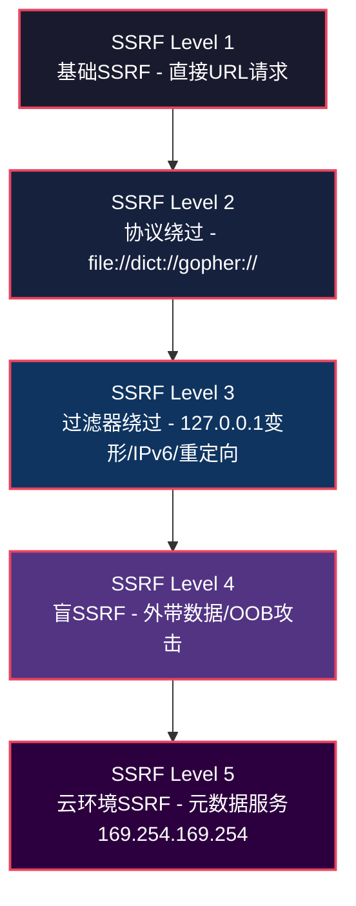
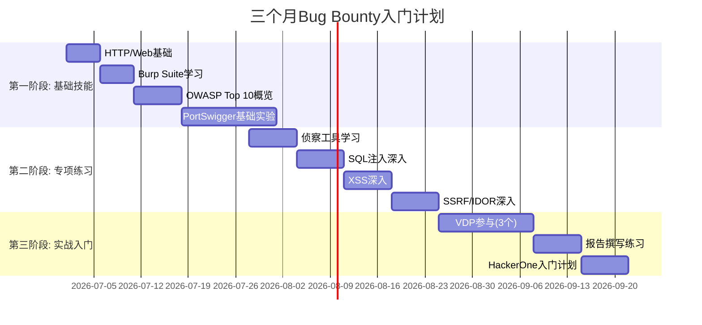

# 第27章 Bug-Bounty变现指南 - 练习方法

## 27.1 练习方法论：从刻意练习到肌肉记忆

Bug Bounty不是"多看教程就能学会"的技能——它是一门需要大量动手练习的实践学科。正如格斗选手需要反复练习组合拳，安全研究员也需要通过系统化的练习将知识转化为直觉反应。

### 27.1.1 刻意练习四原则

心理学家安德斯·艾利克森提出的"刻意练习"理论适用于Bug Bounty训练的每个阶段：

| 原则 | 在Bug Bounty中的应用 | 常见误区 |
|------|----------------------|----------|
| **明确目标** | 每次练习聚焦一个具体漏洞类型，而非泛泛地"挖洞" | 同时练习SQL注入和SSRF，哪样都不精 |
| **专注投入** | 练习时关闭社交媒体，全神贯注分析目标 | 一边看直播一边做题，效率极低 |
| **即时反馈** | 每次练习后立即核对答案，分析差距 | 做完CTF不看writeup，不知道自己哪里做对了 |
| **走出舒适区** | 当前难度不够时主动升级，而不是重复已经掌握的内容 | 反复做低难度DVWA，从不挑战真实环境 |

### 27.1.2 练习的三个阶段


**阶段一：知识习得（1-2周）**
- 阅读漏洞原理文档，理解攻击向量
- 学习工具的基本使用方法
- 目标：能向别人解释清楚这个漏洞是什么、为什么存在

**阶段二：技能形成（1-3个月）**
- 在CTF和靶场中反复练习
- 每种漏洞至少完成20次成功利用
- 目标：看到提示就知道该用什么工具、什么方法

**阶段三：直觉反应（3个月+）**
- 在真实环境中快速识别潜在漏洞
- 能够组合多种技术构造复杂攻击链
- 目标：扫描器还没报出来，你已经凭直觉发现了问题

### 27.1.3 练习记录与复盘

每次练习后填写以下记录，持续积累经验：

```text
日期：2026-06-26
目标：HackTheBox - 机器名xxx
耗时：2小时30分钟
漏洞类型：SQL注入 + 权限提升

发现的关键点：
1. 登录页存在布尔盲注，但WAF过滤了UNION
2. 用注释符/**/绕过了空格过滤
3. 提权用了内核漏洞 CVE-xxxxx

做错的地方：
1. 前30分钟在找子域名浪费了时间，其实入口点在登录页
2. 忘记检查/etc/crontab，漏掉了定时任务提权

下次改进：
- 先做服务枚举再做子域名枚举
- 提权前系统检查：SUID/cron/writable/sudo -l/kernel版本
```

## 27.2 入门阶段：搭建坚实基础

### 27.2.1 CTF平台分级练习

CTF（Capture The Flag）是培养Bug Bounty技能的理想起点，提供安全、合法的练习环境。不同平台各有侧重，建议按难度分级使用。

**第一梯队：零基础友好**

| 平台 | 核心优势 | 推荐指数 | 费用 |
|------|---------|---------|------|
| **PortSwigger Web Security Academy** | 每道题配有原理讲解+互动实验，覆盖所有OWASP Top 10 | ★★★★★ | 免费 |
| **TryHackMe** | 引导式学习路径，像上课一样带你从零开始 | ★★★★☆ | 免费+付费 |
| **PicoCTF** | 面向学生的CTF，题目设计循序渐进 | ★★★★☆ | 免费 |

**第二梯队：进阶提升**

| 平台 | 核心优势 | 推荐指数 | 费用 |
|------|---------|---------|------|
| **Hack The Box** | 真实渗透测试模拟，定期更新高难度靶机 | ★★★★★ | 免费+订阅 |
| **VulnHub** | 可下载的虚拟机靶场，适合离线练习 | ★★★★☆ | 免费 |
| **OverTheWire (Bandit/Natas)** | 经典Linux/Web安全挑战，培养命令行思维 | ★★★★☆ | 免费 |

**第三梯队：专项突破**

| 平台 | 核心优势 | 推荐指数 | 费用 |
|------|---------|---------|------|
| **CryptoHack** | 密码学专项，从古典密码到现代加密 | ★★★★☆ | 免费 |
| **Root-Me** | 多领域覆盖，含取证/逆向/Web/密码学 | ★★★★☆ | 免费+付费 |
| **BugBountyHunter.com** | 专门为Bug Bounty设计的练习平台 | ★★★★★ | 部分免费 |

**PortSwigger重点实验室（必做清单）：**

以下实验室直接对应真实Bug Bounty中的高频漏洞，建议按顺序逐一完成：

1. SQL注入系列：SQL injection (vulnerability lab) → SQL injection UNION attack → Blind SQL injection
2. 认证系列：Authentication bypass via flawed state machine → Brute-force attacks → Password reset poisoning
3. SSRF系列：Basic SSRF against the local server → SSRF with filter bypass → Blind SSRF via out-of-band data exfiltration
4. 访问控制系列：IDOR → Privilege escalation → Multi-step process

### 27.2.2 搭建本地靶场

本地靶场让你可以自由尝试、反复操练，不用担心触犯规则。使用Docker可以在5分钟内搭建完整的练习环境。

**核心靶场及Docker部署：**

```bash
# === DVWA (Damn Vulnerable Web Application) ===
# 最经典的Web安全靶场，覆盖SQL注入/XSS/CSRF/文件上传等
# 默认密码: admin/password
docker run -d --name dvwa -p 8080:80 vulnerables/web-dvwa

# === OWASP Juice Shop ===
# 现代化电商应用靶场，包含100+个难度不等的挑战
docker run -d --name juice-shop -p 3000:3000 bkimminich/juice-shop

# === WebGoat ===
# OWASP官方出品，包含详细的课程式学习路径
docker run -d --name webgoat -p 8080:8080 -p 9090:9090 webgoat/webgoat

# === Metasploitable 2 ===
# 经典的易受攻击Linux系统，适合练习系统渗透
# 需要先下载VM镜像: https://information.rapid7.com/download-metasploitable-2.html

# === bWAPP ===
# 包含100+个Web漏洞，特别适合系统性练习
docker run -d --name bwapp -p 80:80 raesene/bwapp
```

**靶场练习方法——不要只做一遍：**

```text
第一遍：独立尝试，不看任何提示，记录卡住的时间点
第二遍：看官方提示（但不看完整答案），理解解题思路
第三遍：看writeup，学习最优解法和工具使用
第四遍：用不同方法重新解题（比如第一遍手工注入，第二遍用sqlmap）
```

### 27.2.3 VDP（漏洞披露计划）入门实战

当你在靶场完成至少30个挑战后，可以开始参与VDP（不提供奖金的漏洞披露计划），积累真实环境的测试经验。

**推荐的VDP目标：**

- **开源项目**：GitHub上star数超过1000的项目，通常有明确的安全策略
  - 例如：WordPress、GitLab、Mattermost等都有专门的安全页面
- **非营利组织**：EFF、Mozilla、Wikimedia等均有VDP
- **政府机构**：许多国家的政府网站接受漏洞报告
  - 美国：https://hackerone.com/deptofdefense
  - 中国：CNNVD（国家信息安全漏洞共享平台）

**参与VDP的正确姿势：**

1. **仔细阅读授权范围**——只测试明确授权的目标，超范围测试可能违法
2. **控制测试强度**——不要发送大规模扫描请求，避免影响目标正常运行
3. **记录所有发现**——即使判断为低危或信息泄露，也写下来作为经验积累
4. **学习报告格式**——VDP没有奖金压力，是练习报告撰写的最佳场景

## 27.3 进阶阶段：专项技能突破

### 27.3.1 系统化侦察练习

侦察是Bug Bounty的核心技能。顶级猎手和普通猎手的区别，往往在侦察阶段就拉开了差距。侦察做得越彻底，发现高价值漏洞的概率就越大。

**练习1：子域名枚举——多工具交叉验证**

选择一个合法目标（如`example.com`或`testfire.net`），使用多种工具进行子域名枚举并对比结果：

```bash
#!/bin/bash
# multi_subenum.sh - 多工具子域名枚举对比
DOMAIN=$1
TIMESTAMP=$(date +%Y%m%d_%H%M%S)
OUTPUT_DIR="subenum_${DOMAIN}_${TIMESTAMP}"
mkdir -p "$OUTPUT_DIR"

echo "[*] 目标: $DOMAIN"
echo "[*] 输出目录: $OUTPUT_DIR"

# 工具1: subfinder (被动枚举，速度快)
echo "[*] 运行 subfinder..."
subfinder -d "$DOMAIN" -silent -all | tee "$OUTPUT_DIR/subfinder.txt" | wc -l

# 工具2: amass enum (被动+部分主动，覆盖面广)
echo "[*] 运行 amass..."
amass enum -passive -d "$DOMAIN" -o "$OUTPUT_DIR/amass.txt" 2>/dev/null
wc -l "$OUTPUT_DIR/amass.txt"

# 工具3: crt.sh (证书透明度日志，免费且覆盖广)
echo "[*] 查询 crt.sh..."
curl -s "https://crt.sh/?q=%25.${DOMAIN}&output=json" 2>/dev/null | \
  jq -r '.[].name_value' 2>/dev/null | \
  sort -u | tee "$OUTPUT_DIR/crtsh.txt" | wc -l

# 工具4: DNS暴力枚举 (主动发现)
echo "[*] 运行 dnsx..."
cat "$OUTPUT_DIR/subfinder.txt" | dnsx -silent -retry 2 | \
  tee "$OUTPUT_DIR/dnsx_confirmed.txt" | wc -l

# 合并去重，生成最终列表
echo "[*] 合并结果..."
cat "$OUTPUT_DIR"/*.txt | sort -u > "$OUTPUT_DIR/all_subdomains.txt"
TOTAL=$(wc -l < "$OUTPUT_DIR/all_subdomains.txt")
echo "[✓] 发现 $TOTAL 个唯一子域名"

# 交叉验证分析
echo ""
echo "=== 各工具覆盖率分析 ==="
for f in "$OUTPUT_DIR"/subfinder.txt "$OUTPUT_DIR"/amass.txt "$OUTPUT_DIR"/crtsh.txt; do
  TOOL=$(basename "$f" .txt)
  UNIQUE=$(comm -23 "$f" "$OUTPUT_DIR/all_subdomains.txt" | wc -l)
  echo "$TOOL: $(wc -l < "$f") 条，独有 $UNIQUE 条"
done
```

**练习目标与评估标准：**

| 级别 | 目标 | 评估标准 |
|------|------|---------|
| 初级 | 使用1-2种工具完成基本枚举 | 能正确安装和运行工具 |
| 中级 | 交叉验证至少4种工具的结果 | 枚举数量比单一工具多30%以上 |
| 高级 | 结合证书日志、DNS历史、JS文件分析 | 能发现常规扫描遗漏的子域名 |

**练习2：端口扫描与服务识别——从扫描到攻击路径**

```bash
#!/bin/bash
# port_service_audit.sh - 端口扫描与服务分析
TARGET=$1
OUTPUT_DIR="portscan_${TARGET}"
mkdir -p "$OUTPUT_DIR"

# Phase 1: 快速全端口扫描 (masscan)
echo "[*] Phase 1: masscan 全端口扫描..."
masscan -p1-65535 --rate=5000 -oL "$OUTPUT_DIR/masscan_raw.txt" \
  --open "$TARGET" 2>/dev/null

# 提取开放端口列表
cat "$OUTPUT_DIR/masscan_raw.txt" | grep "^open" | \
  awk -F' ' '{print $4}' | sort -n | uniq > "$OUTPUT_DIR/open_ports.txt"
echo "[✓] 发现 $(wc -l < "$OUTPUT_DIR/open_ports.txt") 个开放端口"

# Phase 2: 服务版本识别 (nmap)
echo "[*] Phase 2: nmap 服务识别..."
PORTS=$(paste -sd, "$OUTPUT_DIR/open_ports.txt")
nmap -sV -sC -p"$PORTS" -oN "$OUTPUT_DIR/nmap_detail.txt" \
  -oX "$OUTPUT_DIR/nmap_xml.xml" "$TARGET" 2>/dev/null

# Phase 3: 识别高价值目标
echo "[*] Phase 3: 分析高价值服务..."
echo "=== 可能的攻击面 ==="

# 检查常见高价值端口
declare -A INTERESTING_PORTS=(
  [21]="FTP" [22]="SSH" [23]="Telnet" [25]="SMTP"
  [80]="HTTP" [443]="HTTPS" [3306]="MySQL" [3389]="RDP"
  [5432]="PostgreSQL" [6379]="Redis" [8080]="HTTP-Proxy"
  [8443]="HTTPS-Alt" [9200]="Elasticsearch" [27017]="MongoDB"
)

while read -r port; do
  if [[ -n "${INTERESTING_PORTS[$port]}" ]]; then
    echo "  端口 $port (${INTERESTING_PORTS[$port]}) - 需要深入测试"
  fi
done < "$OUTPUT_DIR/open_ports.txt"
```

**练习3：URL收集与参数发现——从海量数据中找金矿**

```bash
#!/bin/bash
# url_harvest.sh - 多源URL收集与分析
DOMAIN=$1
OUTPUT_DIR="urlharvest_${DOMAIN}"
mkdir -p "$OUTPUT_DIR"

# 收集历史URL (Wayback Machine)
echo "[*] 收集 Wayback Machine 历史URL..."
echo "$DOMAIN" | waybackurls 2>/dev/null | \
  grep -v "\.css\|\.js\|\.png\|\.jpg\|\.gif\|\.svg\|\.woff" | \
  sort -u > "$OUTPUT_DIR/wayback.txt"
echo "[✓] Wayback: $(wc -l < "$OUTPUT_DIR/wayback.txt") 条"

# 收集已知URL (gau - Get All URLs)
echo "[*] 收集 gau URL..."
echo "$DOMAIN" | gau --threads 5 2>/dev/null | \
  grep -v "\.css\|\.js\|\.png\|\.jpg\|\.gif\|\.svg" | \
  sort -u > "$OUTPUT_DIR/gau.txt"
echo "[✓] gau: $(wc -l < "$OUTPUT_DIR/gau.txt") 条"

# 使用kat收集JS文件中的端点
echo "[*] 提取 JavaScript 端点..."
cat "$OUTPUT_DIR/wayback.txt" "$OUTPUT_DIR/gau.txt" | \
  grep "\.js$" | sort -u > "$OUTPUT_DIR/js_files.txt"

# 参数提取
echo "[*] 提取 URL 参数..."
cat "$OUTPUT_DIR/wayback.txt" "$OUTPUT_DIR/gau.txt" | \
  grep "?" | unfurl keys 2>/dev/null | sort | uniq -c | sort -rn > "$OUTPUT_DIR/params.txt"
echo "[✓] 发现 $(wc -l < "$OUTPUT_DIR/params.txt") 个唯一参数名"

# 筛选高价值URL
echo "[*] 筛选高价值URL..."
cat "$OUTPUT_DIR/wayback.txt" "$OUTPUT_DIR/gau.txt" | sort -u | \
  grep -iE "admin|panel|dashboard|upload|api|graphql|debug|trace|config|backup|\.env" | \
  tee "$OUTPUT_DIR/high_value_urls.txt" | wc -l

# 合并去重
cat "$OUTPUT_DIR/wayback.txt" "$OUTPUT_DIR/gau.txt" | sort -u > "$OUTPUT_DIR/all_urls.txt"
echo ""
echo "=== 收集统计 ==="
echo "总URL数: $(wc -l < "$OUTPUT_DIR/all_urls.txt")"
echo "含参数URL: $(grep -c "?" "$OUTPUT_DIR/all_urls.txt")"
echo "高价值URL: $(wc -l < "$OUTPUT_DIR/high_value_urls.txt")"
```

### 27.3.2 漏洞挖掘专项练习

按漏洞类型进行集中训练，每种类型至少完成20次成功利用后，再进入下一个类型。

#### SSRF漏洞练习路线



**Level 1 - 基础SSRF：**

在Juice Shop的Search功能中，找到一个图片URL参数，将其修改为`http://127.0.0.1:18080`查看本地服务。

**Level 2 - 协议绕过：**

当HTTP被过滤时，尝试其他协议：
```text
file:///etc/passwd          # 读取本地文件
dict://127.0.0.1:6379/info  # 探测Redis
gopher://127.0.0.1:6379/_*2%0d%0a$3%0d%0aget%0d%0a$1%0d%0a*  # Gopher协议攻击
```

**Level 3 - 过滤器绕过：**

常见绕过技术与对应Payload：

| 过滤规则 | 绕过方法 | Payload示例 |
|---------|---------|------------|
| 禁止`127.0.0.1` | 使用替代IP表示 | `0x7f000001`、`2130706433`、`0177.0.0.1` |
| 禁止`localhost` | 使用别名 | `localtest.me`、`127.0.0.1.nip.io` |
| 禁止内网IP | 使用重定向 | 在你的服务器上设置302重定向到内网地址 |
| 禁止`http://` | 协议切换 | `file:///etc/passwd`、`gopher://...` |
| 禁止特定端口 | 双写/编码 | `http://127.0.0.1:80@127.0.0.1:目标端口/` |

**Level 4 - 盲SSRF数据外带：**

```python
#!/usr/bin/env python3
"""
blind_ssrf_exfil.py - 盲SSRF数据外带演示
在你的VPS上运行此脚本，接收外带数据
"""
from http.server import HTTPServer, BaseHTTPRequestHandler
import urllib.parse
import base64

class SSRFReceiver(BaseHTTPRequestHandler):
    def do_GET(self):
        # 从URL参数中提取数据
        query = urllib.parse.urlparse(self.path).query
        params = urllib.parse.parse_qs(query)
        
        if 'data' in params:
            exfiltrated = base64.b64decode(params['data'][0]).decode()
            print(f"\n[!] 收到外带数据:\n{exfiltrated}\n")
        
        self.send_response(200)
        self.send_header('Content-Type', 'text/html')
        self.end_headers()
        self.wfile.write(b'')  # 返回一个无害的响应

if __name__ == '__main__':
    server = HTTPServer(('0.0.0.0', 8888), SSRFReceiver)
    print("[*] SSRF接收器运行在 0.0.0.0:8888")
    server.serve_forever()
```

#### IDOR漏洞练习路线

IDOR（不安全的直接对象引用）是Bug Bounty中奖金最高的漏洞类型之一。

**系统化测试步骤：**

```text
1. 识别所有使用数字/可预测ID的端点
   - URL参数: /api/users/12345/profile
   - 请求体: {"user_id": 12345}
   - Cookie: session=abc123 (尝试修改)

2. 建立基线
   - 使用自己的账号A，记录正常请求和响应
   - 记录所有可观察的ID：用户ID、订单号、文件ID等

3. 水平越权测试
   - 用账号A的请求，替换为账号B的ID
   - 关注：状态码变化、响应体差异、功能差异

4. 纵向越权测试
   - 普通用户尝试使用管理员功能的端点
   - 低权限用户尝试访问高权限操作

5. 批量验证
   - 编写脚本遍历ID范围，统计不同响应的分布
   - 特别关注：200与403的比例异常
```

```python
#!/usr/bin/env python3
"""
idor_test.py - IDOR批量测试脚本模板
"""
import requests
import sys

BASE_URL = "https://target.example.com"
AUTH_TOKEN = "your_token_here"  # 替换为你的认证token
HEADERS = {"Authorization": f"Bearer {AUTH_TOKEN}"}

def test_idor(base_url, id_range=(1, 100)):
    """测试ID范围内的IDOR漏洞"""
    results = {"200": 0, "403": 0, "404": 0, "other": 0}
    interesting = []
    
    for uid in range(id_range[0], id_range[1] + 1):
        url = f"{base_url}/api/users/{uid}/profile"
        try:
            resp = requests.get(url, headers=HEADERS, timeout=5)
            status = str(resp.status_code)
            results[status[:2] + "x" if status != "404" else "404"] = \
                results.get(status[:2] + "x", 0) + 1
            
            if resp.status_code == 200:
                interesting.append(uid)
                print(f"  [!] ID {uid}: 200 OK - 可能存在IDOR!")
        except requests.RequestException as e:
            print(f"  [x] ID {uid}: 请求失败 - {e}")
    
    print(f"\n=== 结果统计 ===")
    for code, count in results.items():
        print(f"  {code}: {count}")
    print(f"  可访问的ID: {interesting}")

if __name__ == "__main__":
    base = sys.argv[1] if len(sys.argv) > 1 else f"{BASE_URL}/api/users/{{}}/profile"
    test_idor(base)
```

#### 认证与会话管理练习

JWT（JSON Web Token）攻击是认证绕过中最重要的技能之一：

```bash
# === JWT攻击练习清单 ===

# 1. 算法混淆攻击 (alg: none)
# 将JWT的alg字段改为"none"，移除签名
# 工具: jwt_tool
python3 jwt_tool.py <JWT_TOKEN> -X a  # 查看所有攻击选项

# 2. 密钥爆破 (弱密钥)
# 使用hashcat或john爆破JWT签名密钥
hashcat -m 16500 jwt_hash.txt wordlist.txt

# 3. 密钥混淆 (RS256 → HS256)
# 用公钥作为HMAC密钥签名
python3 jwt_tool.py <JWT_TOKEN> -X k -pk public.pem

# 4. JKU/JWK注入
# 如果JWT信任外部JWK密钥库，注入自己的密钥
```

### 27.3.3 报告撰写练习

一份优秀的漏洞报告是获得赏金的关键。HackerOne的研究表明，报告质量直接影响审核速度和赏金等级。

**优秀报告的五个要素：**

| 要素 | 要求 | 示例 |
|------|------|------|
| **标题** | 简洁精准，包含漏洞类型和关键参数 | "SQL Injection in /api/users via `search` parameter" |
| **摘要** | 一段话说清楚：什么漏洞、在哪里、能做什么 | "An unauthenticated SQL injection in the user search API allows..." |
| **复现步骤** | 每步都有截图，任何人照做都能复现 | Step 1: 发送请求 → Step 2: 查看响应 → Step 3: 分析结果 |
| **影响分析** | 量化影响范围，说明业务风险 | "可获取所有用户的PII数据（约50万条记录），包括邮箱和手机号" |
| **修复建议** | 具体可行的修复方案，不是空话 | "使用参数化查询替代字符串拼接，示例代码如下..." |

**报告质量自检清单：**

- [ ] 标题是否包含了漏洞类型和关键参数名？
- [ ] 复现步骤是否足够详细，新手也能照做？
- [ ] 每一步是否都有截图或HTTP请求/响应原文？
- [ ] 影响分析是否量化了数据范围和业务风险？
- [ ] 修复建议是否提供了具体代码而非泛泛建议？
- [ ] 是否说明了测试环境（浏览器、操作系统）？
- [ ] 是否排除了误报的可能性？

## 27.4 高级阶段：真实环境实战

### 27.4.1 从靶场到真实目标的过渡标准

不要急于跳入真实环境。满足以下标准后再开始：

```text
入门达标清单（至少全部完成）：
□ PortSwigger完成至少20个实验室
□ DVWA/Juice Shop所有漏洞类型至少各练一次
□ 能独立搭建任意靶场环境
□ 理解OWASP Top 10每种漏洞的原理和利用方法

进阶达标清单（至少完成80%）：
□ 至少1个平台（HTB/THM）完成10台以上靶机
□ 掌握至少3种漏洞类型的深入利用技术
□ 能独立撰写完整的漏洞报告
□ 完成5个以上VDP并收到确认回复
□ 熟练使用Burp Suite进行手动测试
```

### 27.4.2 新手友好计划与入门策略

**HackerOne公开计划（标记为"Good for New Hackers"）：**

这些计划对新手更宽容，接受较低严重性的漏洞：

| 平台 | 计划类型 | 特点 | 建议策略 |
|------|---------|------|---------|
| HackerOne | 公开VDP | 不给奖金，但给认可 | 用来练习报告格式 |
| HackerOne | 公开Bug Bounty | 有奖金，范围清晰 | 从低危漏洞开始积累 |
| Bugcrowd | 公开程序 | 有积分系统 | 先拿积分，再升级 |
| Intigriti | 公开程序 | 月度挑战 | 参加月度挑战，有额外奖金 |

**第一批真实目标的选择标准：**

1. **范围明确**——明确列出了哪些域名/子域名在测试范围内
2. **规则清晰**——详细说明了什么能做什么不能做
3. **响应及时**——过去30天内有审核和回复
4. **赏金合理**——低危漏洞至少$100，中危$500+
5. **竞争适中**——已有50+份报告（太热门的难找到新漏洞）

### 27.4.3 建立个人工具链

高效的Bug Bounty猎手都有自己的自动化工具链，将重复性工作交给脚本，把精力集中在创造性思考上。

**基础侦察工具链：**

```bash
#!/bin/bash
# recon_pipeline.sh - 标准化侦察流水线
# 用法: ./recon_pipeline.sh <target.com>

set -euo pipefail
DOMAIN="${1:?用法: $0 <domain>}"
WORKDIR="recon_$(date +%Y%m%d_%H%M%S)_${DOMAIN}"
mkdir -p "$WORKDIR"/{subdomains,alive,ports,urls,vulns}

echo "========================================"
echo "  侦察流水线 - ${DOMAIN}"
echo "  输出目录: ${WORKDIR}"
echo "========================================"

# Step 1: 子域名枚举
echo ""
echo "[Phase 1] 子域名枚举..."
{
  subfinder -d "$DOMAIN" -silent -all
  echo "$DOMAIN" | amass enum -passive -silent 2>/dev/null
  curl -s "https://crt.sh/?q=%25.${DOMAIN}&output=json" 2>/dev/null | \
    jq -r '.[].name_value' 2>/dev/null
} | sort -u | tee "$WORKDIR/subdomains/all.txt"
echo "[✓] 发现 $(wc -l < "$WORKDIR/subdomains/all.txt") 个子域名"

# Step 2: 存活检测
echo ""
echo "[Phase 2] 存活检测..."
cat "$WORKDIR/subdomains/all.txt" | \
  httpx -silent -status-code -title -tech-detect -follow-redirects | \
  tee "$WORKDIR/alive/detected.txt"
echo "[✓] $(wc -l < "$WORKDIR/alive/detected.txt") 个存活主机"

# Step 3: 端口扫描
echo ""
echo "[Phase 3] 端口扫描..."
cat "$WORKDIR/alive/detected.txt" | \
  awk -F' ' '{print $1}' | naabu -silent -top-ports 1000 | \
  tee "$WORKDIR/ports/discovered.txt"
echo "[✓] $(wc -l < "$WORKDIR/ports/discovered.txt") 个开放端口"

# Step 4: URL收集
echo ""
echo "[Phase 4] URL收集..."
{
  cat "$WORKDIR/subdomains/all.txt" | waybackurls 2>/dev/null
  cat "$WORKDIR/subdomains/all.txt" | gau --threads 3 2>/dev/null
} | sort -u | \
  grep -v "\.css\|\.js\|\.png\|\.jpg\|\.gif\|\.svg\|\.woff\|\.ttf" | \
  tee "$WORKDIR/urls/all.txt"
echo "[✓] $(wc -l < "$WORKDIR/urls/all.txt") 个唯一URL"

# Step 5: 参数分析
echo ""
echo "[Phase 5] 参数分析..."
cat "$WORKDIR/urls/all.txt" | \
  grep "?" | unfurl keys 2>/dev/null | \
  sort | uniq -c | sort -rn | head -30 | tee "$WORKDIR/urls/top_params.txt"

# Step 6: Nuclei漏洞扫描
echo ""
echo "[Phase 6] Nuclei漏洞扫描..."
cat "$WORKDIR/alive/detected.txt" | \
  awk -F' ' '{print $1}' | \
  nuclei -t ~/nuclei-templates/ -severity low,medium,high,critical \
  -silent -o "$WORKDIR/vulns/nuclei_results.txt" 2>/dev/null
echo "[✓] $(wc -l < "$WORKDIR/vulns/nuclei_results.txt") 个潜在漏洞"

echo ""
echo "========================================"
echo "  侦察完成!"
echo "  结果目录: ${WORKDIR}"
echo "========================================"
```

### 27.4.4 深度研究特定领域

选择一个专精方向，深入钻研成为该领域的专家。广度让你入门，深度让你出头。

**云安全方向：**

| 学习内容 | 实践平台 | 目标成果 |
|---------|---------|---------|
| AWS IAM策略分析 | AWS Free Tier | 能识别过于宽松的IAM策略 |
| S3 Bucket安全 | 本地搭建MinIO | 能发现未授权访问和配置错误 |
| EC2元数据SSRF | Juice Shop + 本地环境 | 能利用SSRF获取实例凭证 |
| Lambda函数安全 | AWS Free Tier | 能发现环境变量泄露和权限提升 |

**API安全方向：**

| 学习内容 | 练习目标 | 常见漏洞 |
|---------|---------|---------|
| REST API测试 | 系统测试CRUD操作的权限控制 | IDOR、批量赋值、BOLA |
| GraphQL安全 | 识别和利用GraphQL特有漏洞 | 内省泄露、深度限制绕过、批量查询DoS |
| gRPC安全 | 测试Protocol Buffer序列化漏洞 | 参数篡改、拒绝服务 |
| WebSocket安全 | 测试全双工通信安全 | 会话劫持、CSWSH、输入验证绕过 |

**移动安全方向：**

```bash
# Android应用安全测试基础流程
# 1. 获取APK
adb shell pm path com.target.app
adb pull /data/app/com.target.app/base.apk

# 2. 静态分析
apktool d base.apk                    # 反编译
jadx base.apk -d jadx_output/         # 反编译为Java源码
grep -r "password\|secret\|api_key\|token" jadx_output/  # 搜索硬编码密钥

# 3. 动态分析
frida -U -f com.target.app -l hook_script.js  # Frida动态hook
objection -g com.target.app explore             # objection运行时探索

# 4. 流量分析
# 配置代理: Burp Suite → 手机设置HTTP代理
# 导入Burp CA证书 → 测试API端点
```

## 27.5 持续学习路径

### 27.5.1 学习社区与资源

**必关注的社区和信息源：**

| 平台 | 推荐频道/账号 | 价值 |
|------|-------------|------|
| Twitter/X | @aborusin, @haborusin, @NahamSec, @rez0__ | 实时漏洞发现分享 |
| YouTube | NahamSec, InsiderPhD, Stok | 视频教程和真实挖洞过程 |
| Discord | Bug Bounty Worldwide, NahamSec | 社区交流和实时求助 |
| Reddit | r/bugbounty, r/netsec | 经验分享和讨论 |
| HackerOne Hacktivity | 公开的已修复报告 | 学习真实漏洞报告格式 |

**深度学习资源推荐：**

| 类型 | 资源 | 适用阶段 |
|------|------|---------|
| 书籍 | 《Web Application Hacker's Handbook》(2nd Ed) | 进阶 |
| 书籍 | 《Real-World Bug Hunting》by Peter Yaworski | 入门-进阶 |
| 书籍 | 《Bug Bounty Bootcamp》by Vickie Li | 入门 |
| 在线课程 | PortSwigger Web Security Academy | 入门-进阶 |
| 在线课程 | TCM Security - Practical Ethical Hacking | 入门 |
| 研究报告 | HackerOne Top 10 Vulnerability Reports | 全阶段 |
| CTF | Google CTF / DEF CON CTF | 进阶-高级 |

### 27.5.2 建立学习社区

孤军奋战容易放弃。建立或加入一个学习小组：

1. **找到3-5个水平相近的学习伙伴**
2. **每周固定时间做CTF/靶机挑战**
3. **互相评审漏洞报告，提出改进建议**
4. **共享工具配置和自动化脚本**
5. **遇到卡住的问题一起讨论**

> 经验表明，有学习伙伴的Bug Bounty新手，坚持3个月以上的概率比独自学习高出3倍以上。

## 27.6 练习计划示例

### 27.6.1 三个月入门计划



**第1个月：基础技能建设**

| 周次 | 学习内容 | 每日投入 | 里程碑 |
|------|---------|---------|--------|
| Week 1-2 | HTTP协议基础 + Burp Suite安装配置 | 2-3小时 | 能用Burp拦截和修改HTTP请求 |
| Week 3-4 | PortSwigger基础实验室（SQL注入/XSS） | 2-3小时 | 完成15个以上实验室 |

**第2个月：专项漏洞深入**

| 周次 | 学习内容 | 每日投入 | 里程碑 |
|------|---------|---------|--------|
| Week 5-6 | 侦察工具（subfinder/httpx/nuclei） | 3-4小时 | 能独立完成完整侦察流程 |
| Week 7-8 | SSRF/IDOR/认证绕过专项 | 3-4小时 | 每种漏洞至少5次成功利用 |

**第3个月：实战起步**

| 周次 | 学习内容 | 每日投入 | 里程碑 |
|------|---------|---------|--------|
| Week 9-10 | 参与3个VDP计划 | 3-4小时 | 提交至少2份有效报告 |
| Week 11-12 | HackerOne入门计划 + 报告优化 | 3-4小时 | 获得第一份确认回复 |

### 27.6.2 六个月进阶计划

**前两个月**：在入门计划基础上，深入2-3个漏洞类型的高级利用技术。每种漏洞完成20次以上成功利用。

**中间两个月**：将注意力从靶场转向真实目标。目标是提交10份以上有效报告，建立起稳定的工作流程。

**最后两个月**：建立个人品牌——在Twitter/X上分享发现（脱敏后），在HackerOne上积累Kudo积分，开始被邀请参加私人计划。

### 27.6.3 练习效率最大化技巧

1. **番茄工作法**——每25分钟专注练习，休息5分钟。连续4个番茄后休息15-30分钟
2. **最小可行产出（MVP）**——每次练习设定一个具体的小目标，比如"今天只练SQL注入的盲注技术"
3. **避免完美主义**——遇到卡住超过1小时的题目，看提示或writeup，不要死磕
4. **交替练习**——不要连续一周只练SQL注入，交替不同类型保持新鲜感
5. **定期回顾**——每周日花30分钟回顾本周的练习记录，总结学到的新技术

> Bug Bounty是一项需要长期投入的技能。根据HackerOne的数据，成功的猎手平均需要6-12个月才能开始稳定获得赏金。保持耐心、持续学习、不断实践，你一定能够在这个领域取得成功。
