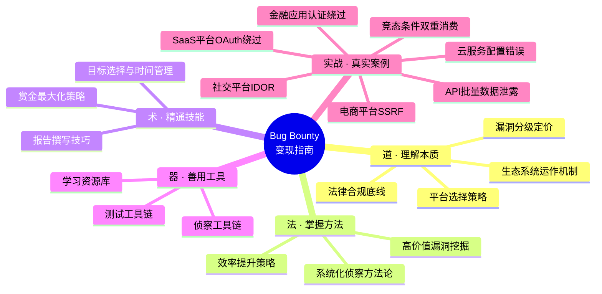
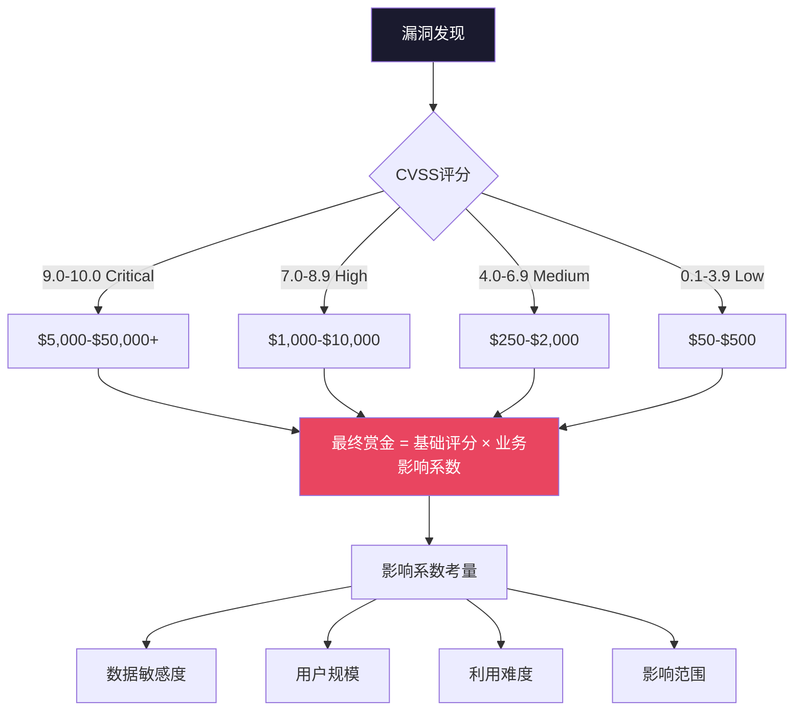
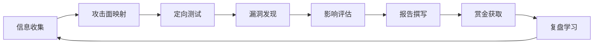

# 第27章 Bug-Bounty变现指南 - 本章小结

## 全章知识体系总览

本章从"道法术器"四个维度，构建了Bug Bounty变现的完整知识框架。你已经系统性地学习了从生态认知到实战变现的全链路知识，涵盖了理论基础、核心技巧、实战案例、常见误区、练习方法和职业发展六大模块。



下文将逐节回顾每部分的核心要点，提炼关键认知，并指出最容易被忽视的实战细节。

---

## 一、理论基础：道——理解Bug Bounty的本质

### 1.1 Bug Bounty生态系统全景

Bug Bounty不是简单的"找漏洞换钱"，而是一个由**企业、平台、安全研究者**三方构成的成熟安全生态。

| 参与方 | 核心诉求 | 价值交换 |
|--------|---------|---------|
| 企业 | 以可控成本获得真实环境的安全测试 | 提供赏金、致谢、私密计划入口 |
| 平台 | 连接供需、标准化流程、质量把控 | 抽取佣金（通常10-20%） |
| 研究者 | 合法变现技能、积累声誉、拓展人脉 | 提供漏洞发现、PoC、修复建议 |

**关键认知**：截至2025年，全球主要Bug Bounty平台累计支付赏金已超**5亿美元**。HackerOne一家在2024年就向研究者支付了超过**1.54亿美元**。这意味着平均每个有效漏洞报告的赏金约500-2000美元，而高危漏洞（RCE、认证绕过）单次赏金可达**1万-50万美元**。

### 1.2 主流平台选择策略

选择平台不是选"最大的"，而是选"最适合当前阶段的"。

| 平台 | 定位 | 准入门槛 | 赏金水平 | 适合人群 |
|------|------|---------|---------|---------|
| HackerOne | 全球最大，覆盖面最广 | 公开计划开放，私密计划需申请 | 中高 | 各阶段研究者 |
| Bugcrowd | 技术导向，质量严格 | 公开+VDP，Crowdstream有门槛 | 中高 | 技术扎实的猎人 |
| Synack | 邀请制，高端市场 | 严格技术审核 | 高 | 资深研究者 |
| Intigriti | 欧洲最大，增长迅速 | 公开计划开放 | 中 | 欧洲目标偏好者 |
| 国内SRC（补天/漏洞盒子/厂商SRC） | 本土化，合规优先 | 注册即可 | 低-中 | 国内目标、合规优先者 |

**选择原则**：

1. **新手起步**：从HackerOne或Bugcrowd的公开计划入手，门槛低、目标多
2. **建立声誉**：在1-2个平台集中提交，避免分散精力
3. **进阶跃迁**：当公开计划连续命中后，申请私密计划（通常赏金提升30-100%）
4. **国内市场**：阿里、腾讯、字节等厂商SRC是合规安全研究的优质选择

### 1.3 漏洞分级与定价体系

赏金不是拍脑袋决定的，而是基于**CVSS评分体系**和**业务影响评估**的综合定价。



**关键认知**：CVSS评分只是定价的起点，**业务影响**才是决定实际赏金的核心因素。一个CVSS 7.0但能获取百万用户数据的IDOR漏洞，实际赏金可能远超CVSS 9.0但影响有限的XSS。

### 1.4 法律合规与道德底线

这是整个Bug Bounty实践中**最不容妥协**的底线。

**安全港条款**是你的法律保护伞——它规定在遵循负责任披露原则的前提下，安全研究行为不被视为违法行为。但安全港有严格前提：

- 研究范围在计划明确授权的范围内
- 不访问、修改或泄露非授权数据
- 发现漏洞后立即报告给厂商
- 在厂商修复前不公开漏洞细节
- 保留完整的研究日志作为合规证据

**绝对禁区**：
- 未经授权访问任何非目标系统
- 对用户数据进行非授权操作（删除、修改、下载）
- 利用漏洞进行非授权的资金转移
- 超过厂商设定的测试时间窗口
- 与他人共享未修复的漏洞详情

---

## 二、核心技巧：法——掌握高效的方法论

### 2.1 系统化侦察方法论

侦察是Bug Bounty的**第一步**，也是决定收益效率的关键环节。高效的侦察不是"信息收集越多越好"，而是"在有限时间内找到最多攻击面"。

**侦察全流程**：

| 阶段 | 核心任务 | 推荐工具 | 产出物 |
|------|---------|---------|--------|
| 子域名枚举 | 发现所有可达的子域名 | subfinder、amass、crt.sh | 子域名列表 |
| 存活检测 | 验证子域名是否可达 | httpx、httprobe | 活跃子域名列表 |
| 端口扫描 | 发现隐藏服务 | naabu、nmap | 端口+服务映射 |
| 技术栈识别 | 识别Web框架、中间件 | wappalyzer、whatweb | 技术栈报告 |
| URL收集 | 收集历史和活跃URL | waybackurls、gau | URL列表 |
| 端点发现 | 发现API端点和参数 | ffuf、Arjun、JS分析 | 端点+参数清单 |
| WAF识别 | 判断WAF类型和绕过策略 | wafw00f | WAF报告 |

**侦察效率的关键**：

1. **脚本化自动化**：将侦察步骤串联为Pipeline，一次执行产出完整攻击面
2. **去重与筛选**：对子域名和URL做去重，排除无关目标
3. **JS分析**：前端JavaScript中常包含隐藏的API端点和参数，这是容易被忽视的高价值信息源
4. **历史信息利用**：Wayback Machine、GitHub敏感信息泄露、Pastebin等历史数据源

### 2.2 高价值漏洞挖掘技巧

不是所有漏洞都值得投入时间。本章深入探讨了**奖金回报最高**的漏洞类型：

| 漏洞类型 | 典型奖金 | 挖掘难度 | 核心技巧 |
|---------|---------|---------|---------|
| SSRF（服务端请求伪造） | $1,000-$15,000 | 中 | URL重定向绕过、云元数据访问、DNS Rebinding |
| IDOR（不安全的直接对象引用） | $500-$10,000 | 低-中 | 参数遍历、权限边界测试、批量数据泄露验证 |
| 认证绕过 | $2,000-$50,000 | 中-高 | JWT密钥爆破、OAuth流程缺陷、会话管理问题 |
| 业务逻辑漏洞 | $1,000-$25,000 | 高 | 竞态条件、价格操纵、权限提升、工作流绕过 |
| RCE（远程代码执行） | $5,000-$100,000+ | 高 | SSTI、反序列化、命令注入、文件上传 |
| 供应链漏洞 | $2,000-$30,000 | 高 | 依赖项审计、CI/CD管道安全、第三方服务信任 |

**关键认知**：业务逻辑漏洞的奖金通常高于技术漏洞，因为自动化扫描器几乎无法发现它们，需要深入理解业务流程才能挖掘。

### 2.3 报告撰写与赏金最大化

一份优秀的漏洞报告是将技术发现转化为真金白银的关键环节。

**报告核心要素**：

```text
1. 标题：简洁准确，包含漏洞类型和影响
2. 摘要：一句话说明漏洞本质和最大影响
3. 环境信息：目标URL、测试时间、使用的工具
4. 漏洞详情：技术原理、影响范围、利用条件
5. 复现步骤：逐步可复现的操作流程
6. 预期结果 vs 实际结果：对比说明
7. 影响分析：业务影响、数据影响、用户影响
8. 修复建议：具体可执行的修复方案
9. 参考资料：CWE编号、相关CVE、技术文档
10. 附件：PoC代码、截图、视频（如适用）
```

**赏金最大化技巧**：

1. **影响力量化**：用数据说明影响范围（"影响约50万用户"比"影响很多用户"更有说服力）
2. **完整利用链**：如果能展示从漏洞发现到完全利用的完整链路，赏金通常翻倍
3. **专业态度**：及时回复厂商的询问，主动提供补充信息，展现专业素养
4. **重复报告规避**：提交前在Hacktivity搜索类似报告，避免无效提交损害信誉
5. **时机选择**：在厂商发布新功能或新上线系统时测试，发现漏洞概率更高

### 2.4 效率提升策略

时间是Bug Bounty最稀缺的资源。效率提升不是"做得更快"，而是"在正确的事情上投入时间"。

**效率提升框架**：

| 维度 | 低效做法 | 高效做法 | 效果对比 |
|------|---------|---------|---------|
| 目标选择 | 随机选择目标 | 基于自身专长选择目标 | 命中率提升3-5倍 |
| 测试方法 | 盲目Fuzzing | 基于信息收集定向测试 | 节省60%时间 |
| 工具使用 | 手动操作每个工具 | 自动化Pipeline | 效率提升10倍 |
| 报告撰写 | 从零开始写报告 | 使用模板+批量提交 | 节省70%时间 |
| 学习方式 | 只看CTF | 分析真实漏洞报告 | 实战能力提升更快 |

**自动化与手动测试的平衡**：

- **自动化擅长**：子域名枚举、端口扫描、已知漏洞扫描、信息收集
- **手动擅长**：业务逻辑漏洞、认证绕过、竞态条件、复杂利用链
- **黄金比例**：20%时间用于自动化扫描和信息收集，80%时间用于手动深度测试

---

## 三、实战案例：术——从理论到实战的跨越

本章通过多个真实案例，展示了不同类型漏洞的发现全过程：

### 案例一：电商平台SSRF漏洞（$15,000）

| 维度 | 详情 |
|------|------|
| 漏洞类型 | SSRF（服务端请求伪造） |
| 利用方式 | 通过URL重定向绕过安全过滤，访问云元数据服务 |
| 关键技巧 | 绕过URL白名单限制（302重定向技巧） |
| 影响 | 可访问AWS实例元数据，获取IAM凭证 |
| 赏金 | $15,000 |

**核心启发**：URL重定向是绕过SSRF防护的经典手段。当目标有URL白名单时，尝试302重定向到非白名单地址。

### 案例二：社交平台IDOR漏洞（$10,000）

| 维度 | 详情 |
|------|------|
| 漏洞类型 | IDOR（不安全的直接对象引用） |
| 利用方式 | API中用户ID参数可遍历，获取任意用户信息 |
| 关键技巧 | 参数遍历+批量验证+敏感信息确认 |
| 影响 | 可获取数百万用户的个人信息 |
| 赏金 | $10,000 |

**核心启发**：IDOR是最常见的高价值漏洞之一。对每个涉及用户标识的API端点，都要尝试替换为其他用户的ID。

### 案例三：金融应用认证绕过（$25,000）

| 维度 | 详情 |
|------|------|
| 漏洞类型 | 认证绕过（JWT密钥爆破） |
| 利用方式 | 爆破JWT密钥获取管理员权限 |
| 关键技巧 | 弱密钥字典+JWT结构分析+权限验证 |
| 影响 | 可获取管理员权限，访问所有用户账户 |
| 赏金 | $25,000 |

**核心启发**：JWT安全是认证绕过的重灾区。弱密钥、算法混淆、过期时间缺失都是常见问题。

### 案例四：云服务配置错误（$8,000）

| 维度 | 详情 |
|------|------|
| 漏洞类型 | 安全配置错误（S3存储桶） |
| 利用方式 | 多个S3存储桶配置不当，泄露敏感信息 |
| 关键技巧 | 服务端枚举+权限验证+敏感信息识别 |
| 影响 | 泄露大量敏感配置信息和凭证 |
| 赏金 | $8,000 |

**核心启发**：云服务配置错误是当前增长最快的漏洞类型。AWS S3、Azure Blob、GCP Storage的权限配置是重点检查对象。

### 案例五至七：进阶实战

此外，本章还深入分析了SaaS平台OAuth认证绕过、API接口批量数据泄露、竞态条件导致的双重消费漏洞等进阶案例，展示了从Web到API到业务逻辑的全场景漏洞挖掘思路。

**案例共性总结**：



每个成功案例都遵循相同的流程：**信息收集→攻击面映射→定向测试→漏洞发现→影响评估→报告撰写→赏金获取→复盘学习**。关键区别在于每个环节的深度和技巧。

---

## 四、常见误区：避坑指南

本章详细剖析了新手最容易犯的错误，避免这些误区可以让你的成长速度提升数倍：

### 4.1 技术误区

| 误区 | 后果 | 正确做法 |
|------|------|---------|
| 过度依赖自动化扫描 | 只能发现已知漏洞，错过高价值逻辑漏洞 | 80%手动+20%自动化 |
| 只关注常见漏洞类型 | 竞争激烈，奖金被压缩 | 拓展到业务逻辑、竞态条件、供应链等 |
| 测试深度不足 | 假设"没有漏洞"，实际是测试不够深入 | 对重要功能持续深入测试 |
| 忽视业务逻辑 | 业务逻辑漏洞奖金最高但最难发现 | 深入理解目标业务流程 |

### 4.2 报告误区

| 误区 | 后果 | 正确做法 |
|------|------|---------|
| 报告质量低下 | 被拒绝或降级 | 参考优秀报告模板，确保要素完整 |
| 夸大漏洞影响 | 损害信誉，未来报告被降权 | 如实评估，用数据说话 |
| 重复提交 | 被标记为低质量研究者 | 提交前在Hacktivity搜索类似报告 |
| 缺少PoC | 报告可信度低 | 提供可复现的PoC代码或详细步骤 |

### 4.3 策略误区

| 误区 | 后果 | 正确做法 |
|------|------|---------|
| 目标选择不当 | 投入大量时间无产出 | 基于自身专长选择竞争适中的目标 |
| 时间管理不当 | 效率低下，无法持续 | 制定明确的时间预算，定期复盘 |
| 忽视社区学习 | 闭门造车，错失经验分享 | 加入社区，分析他人报告 |

### 4.4 心理误区

| 误区 | 后果 | 正确做法 |
|------|------|---------|
| 不切实际的期望 | 受挫后放弃 | 合理预期，前3个月重在学习而非赚钱 |
| 害怕失败 | 不敢提交报告 | 接受拒绝是常态，从中学习改进 |
| 比较心理 | 焦虑、动力丧失 | 专注自身成长，比较对象应该是昨天的自己 |

### 4.5 法律误区

| 误区 | 后果 | 正确做法 |
|------|------|---------|
| 超出授权范围 | 法律风险、平台封号 | 严格遵守计划范围，不确定时先确认 |
| 数据处理不当 | 违反隐私法规 | 不下载非必要数据，发现后立即删除 |

---

## 五、练习方法：从入门到精通的路径

Bug Bounty技能需要**刻意练习**，本章提供了循序渐进的练习路径：

### 5.1 分阶段练习计划

| 阶段 | 时间 | 核心目标 | 推荐平台 | 产出物 |
|------|------|---------|---------|--------|
| 入门 | 1-3个月 | 掌握基础工具和漏洞原理 | PortSwigger Academy、Hacker101、DVWA、Juice Shop | 完成所有入门课程 |
| 进阶 | 3-6个月 | 系统化侦察和漏洞挖掘 | Bugcrowd University、HackerOne Hacktivity分析 | 首个有效漏洞报告 |
| 实战 | 6-12个月 | 在真实目标上发现漏洞 | HackerOne/Bugcrowd公开计划 | 3-5个有效报告+赏金 |
| 精通 | 12个月+ | 深入特定领域，建立专长 | 私密计划+国内SRC | 稳定收入+声誉积累 |

### 5.2 入门阶段：打基础

**目标**：理解Web安全基础原理，掌握核心工具使用

- **PortSwigger Web Security Academy**：最系统的Web安全学习平台，免费且有实操Lab
- **HackerOne Hacker101**：CTF风格学习，直接体验Bug Bounty环境
- **本地靶场**：DVWA（经典Web漏洞练习）、Juice Shop（OWASP官方，覆盖Top 10）
- **Hack The Box**：综合渗透测试练习，提升整体攻防能力

### 5.3 进阶阶段：建体系

**目标**：建立系统化的侦察和测试流程

- **侦察Pipeline**：将subfinder→httpx→naabu→nuclei串联为自动化流程
- **报告撰写**：分析Hacktivity上的优秀报告，建立自己的报告模板库
- **漏洞分类**：按漏洞类型建立知识库，记录每种漏洞的发现技巧和利用方法
- **时间管理**：制定每周测试计划，记录每个目标的投入时间和产出

### 5.4 高级阶段：出成果

**目标**：在真实目标上稳定发现漏洞

- **目标专长**：选择1-2个领域深入（如API安全、云安全、移动安全）
- **工具链**：建立自己的自动化武器库，覆盖侦察→扫描→测试全流程
- **社区参与**：在Bug Bounty论坛分享经验，建立专业声誉
- **持续学习**：关注CVE、安全会议、漏洞研究报告，保持技术敏感度

---

## 六、关键建议：长期成功的秘诀

### 6.1 保持耐心

Bug Bounty是一项需要长期积累的技能。**前3个月是学习期**，不要期望立即获得高额赏金。行业数据显示，大多数成功的赏金猎人在持续投入6个月后才开始获得稳定收入。将重心放在技能提升和经验积累上，收入会随之增长。

### 6.2 持续学习

网络安全领域技术更新迅速，新的漏洞类型和利用技术不断涌现。保持学习的热情，关注社区动态，不断更新自己的知识体系。建议每周投入至少2小时用于学习新知识（阅读CVE报告、安全会议视频、技术博客）。

### 6.3 遵守规则

严格遵守计划规则和法律法规是职业操守的基本要求。超出授权范围的行为不仅可能导致法律问题，还会损害你的职业声誉。**合规是Bug Bounty的第一原则**，没有之一。

### 6.4 享受过程

Bug Bounty不仅是赚钱的途径，更是挑战自我、提升技能的平台。享受发现漏洞的过程，而不仅仅关注奖金。这种心态会让你走得更远，也更容易在遇到挫折时坚持下去。

---

## 七、下一步行动：从今天开始

完成本章学习后，建议按以下顺序行动：

| 步骤 | 行动 | 时间投入 | 预期产出 |
|------|------|---------|---------|
| 1 | 注册PortSwigger Academy，完成前5个Lab | 1-2天 | 掌握基础拦截和测试 |
| 2 | 注册HackerOne账户，完成Hacker101课程 | 3-5天 | 理解Bug Bounty工作流程 |
| 3 | 搭建本地靶场（Juice Shop），完成所有挑战 | 1-2周 | 掌握OWASP Top 10 |
| 4 | 分析Hacktivity上的10个优秀报告 | 2-3天 | 建立报告撰写直觉 |
| 5 | 选择1-2个公开计划，开始系统化测试 | 持续 | 首个有效漏洞发现 |
| 6 | 加入Bug Bounty社区（Reddit/论坛） | 持续 | 获取经验分享和同伴支持 |
| 7 | 建立个人工具链和知识库 | 持续 | 提升测试效率 |

记住，每个成功的赏金猎人都是从新手开始的。**关键不是天赋，而是持续投入和刻意练习**。

---

## 八、推荐资源

### 8.1 工具清单

**侦察工具链**：

| 工具 | 用途 | 安装方式 |
|------|------|---------|
| subfinder | 子域名枚举 | `go install -v github.com/projectdiscovery/subfinder/v2/cmd/subfinder@latest` |
| httpx | 存活检测与技术识别 | `go install -v github.com/projectdiscovery/httpx/cmd/httpx@latest` |
| naabu | 端口扫描 | `go install -v github.com/projectdiscovery/naabu/v2/cmd/naabu@latest` |
| waybackurls | 历史URL收集 | `go install github.com/tomnomnom/waybackurls@latest` |
| nuclei | 模板化漏洞扫描 | `go install -v github.com/projectdiscovery/nuclei/v3/cmd/nuclei@latest` |
| ffuf | Web模糊测试 | `go install github.com/ffuf/ffuf/v2@latest` |
| Arjun | HTTP参数发现 | `pip install arjun` |
| amass | 深度子域名枚举 | `go install -v github.com/owasp-amass/amass/v4/...@master` |

**测试工具链**：

| 工具 | 用途 | 获取方式 |
|------|------|---------|
| Burp Suite | Web应用安全测试套件 | https://portswigger.net/burp（Community版免费） |
| OWASP ZAP | 开源Web安全扫描器 | https://www.zaproxy.org/ |
| Nmap | 网络扫描与服务发现 | https://nmap.org/ |
| sqlmap | 自动化SQL注入检测 | https://sqlmap.org/ |
| jwt_tool | JWT安全测试 | https://github.com/ticarpi/jwt_tool |

**移动端工具**：

| 工具 | 用途 |
|------|------|
| Frida | 动态插桩框架，运行时Hook |
| Objection | 基于Frida的移动应用安全测试 |
| MobSF | 移动应用静态+动态分析 |
| apktool | APK反编译与资源提取 |

### 8.2 学习平台

| 平台 | 类型 | 链接 | 适合阶段 |
|------|------|------|---------|
| PortSwigger Web Security Academy | Web安全课程+Lab | https://portswigger.net/web-security | 入门-进阶 |
| HackerOne Hacker101 | Bug Bounty入门 | https://www.hacker101.com/ | 入门 |
| Bugcrowd University | Bug Bounty系统培训 | https://www.bugcrowd.com/hackers/bugcrowd-university/ | 入门-进阶 |
| Hack The Box | 综合渗透测试 | https://www.hackthebox.com/ | 进阶-高级 |
| TryHackMe | 引导式安全学习 | https://tryhackme.com/ | 入门-进阶 |
| HackerOne Hacktivity | 真实漏洞报告库 | https://hackerone.com/hacktivity | 全阶段 |

### 8.3 推荐书籍

| 书名 | 作者 | 适合阶段 | 核心价值 |
|------|------|---------|---------|
| 《Web Hacking 101》 | Peter Yaworski | 入门 | Bug Bounty入门最佳读物 |
| 《Real-World Bug Hunting》 | Peter Yaworski | 进阶 | 真实漏洞案例深度分析 |
| 《The Web Application Hacker's Handbook》 | Stuttard & Pinto | 进阶-高级 | Web安全测试权威指南 |
| 《Hacking APIs》 | Corey Ball | 进阶 | API安全测试专项指南 |
| 《Bug Bounty Hunting Essentials》 | Lozano & Amir | 入门-进阶 | Bug Bounty实战技巧 |

### 8.4 参考资料与标准

| 资源 | 用途 |
|------|------|
| OWASP Testing Guide | Web安全测试标准方法论 |
| OWASP API Security Top 10 | API安全风险清单 |
| CWE/SANS Top 25 | 最危险的软件缺陷列表 |
| HackerOne 2024 Hacker Report | 行业趋势与数据 |
| Bugcrowd State of Bug Bounty | 行业状态报告 |
| NIST NVD | 国家漏洞数据库 |

### 8.5 社区资源

| 社区 | 平台 | 价值 |
|------|------|------|
| r/bugbounty | Reddit | Bug Bounty讨论与经验分享 |
| Bug Bounty Forum | 独立论坛 | 技术交流与问答 |
| HackerOne社区 | HackerOne内置 | 平台动态与研究者交流 |
| 安全客/先知社区 | 国内平台 | 国内安全研究者交流 |

---

## 九、全章核心公式速查

最后，将本章最核心的知识点浓缩为速查公式，方便日后快速回顾：

**侦察效率公式**：
> 攻击面 = 子域名 × 活跃端点 × 未发现的参数 × 历史遗留功能

**赏金决定公式**：
> 实际赏金 = CVSS基础分 × 业务影响系数 × 数据敏感度 × 利用链完整性

**时间投入公式**：
> 投入产出比 = 赏金收入 / (侦察时间 + 测试时间 + 报告时间)

**成长路径公式**：
> 新手(3月) → 能出报告(6月) → 稳定命中(12月) → 专长领域(18月+) → 资深猎人(3年+)

---

> **本章结语**：Bug Bounty是网络安全领域最直接、最公平的技能变现途径。它不需要学历、不需要证书、不需要人脉——只需要你的技术能力和持续投入。从今天开始，选择一个平台、注册一个账户、完成第一个Lab，你就已经踏上了赏金猎人的道路。记住：**每个$10,000的赏金，都从第一个免费的Lab开始**。
