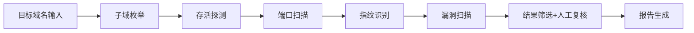
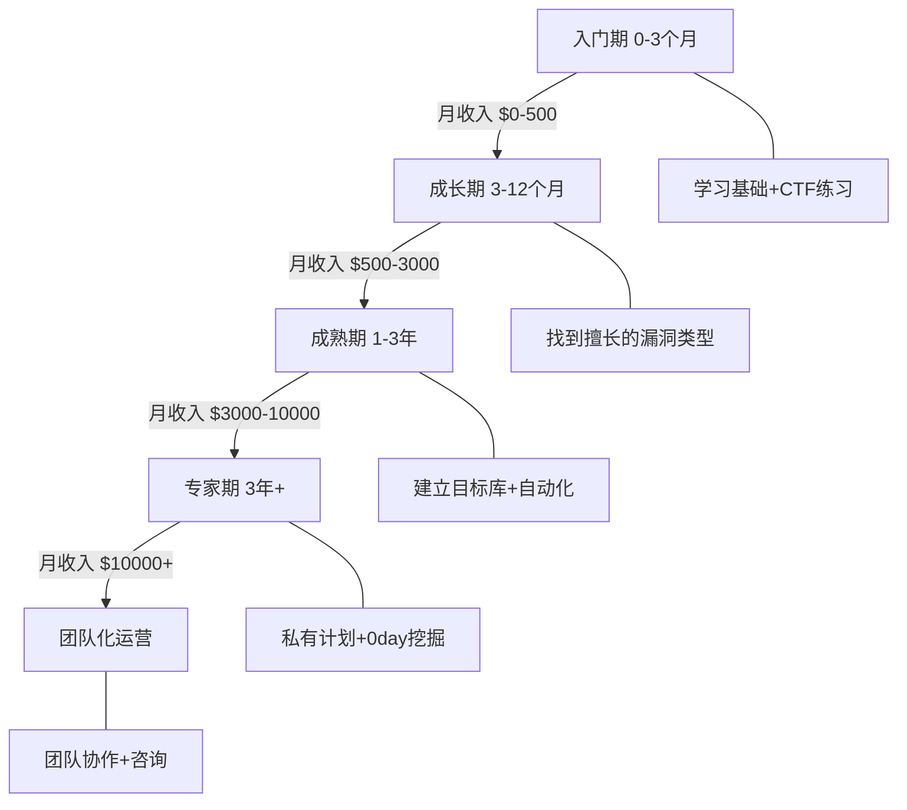
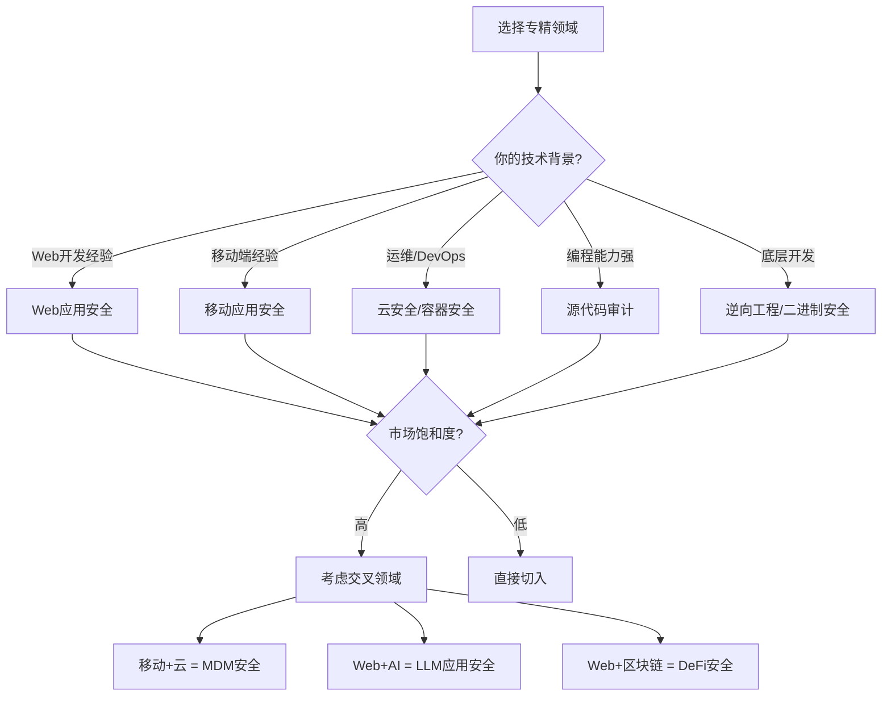

# 第27章 Bug-Bounty变现指南 - 深度拓展

> 本节是全章的收官延伸，聚焦于**其他小节未涉及的进阶话题**——自动化流水线构建、新兴攻击面、收入规模化策略、AI时代的适应性变革，以及从个体猎人到团队化运营的完整路径。如果你已经掌握了前面章节的基础知识和实战案例，本节将帮助你从"能挖洞"跨越到"可持续盈利"。

---

## 一、自动化侦察流水线：从手动到系统化

### 1.1 为什么需要自动化流水线

在实战中，一名成熟猎人每周需要扫描数十个甚至上百个子域和端点。纯手工操作不仅效率低下，而且容易遗漏关键信息。自动化流水线的核心价值在于：

- **覆盖率提升**：自动枚举所有子域、端口、Web 路径，减少人工遗漏
- **可复现性**：同一套流程可反复执行，确保每次侦察结果一致
- **时间释放**：将机械性工作交给脚本，把精力留给深度漏洞分析

### 1.2 流水线架构设计

一个成熟的 Bug Bounty 自动化流水线通常分为四个阶段：



### 1.3 核心工具链配置

| 阶段 | 推荐工具 | 功能 | 关键参数 |
|------|---------|------|---------|
| 子域枚举 | subfinder + amass + assetfinder | 被动+主动枚举 | `-all` 启用所有数据源 |
| 存活探测 | httpx | HTTP/HTTPS 可达性验证 | `-fc 404,403` 过滤无意义状态码 |
| 端口扫描 | naabu | 快速端口扫描 | `-top-ports 1000` 扫描高频端口 |
| 指纹识别 | wappalyzer / whatweb | 技术栈识别 | `-all` 启用全部检测规则 |
| 漏洞扫描 | nuclei | 模板化漏洞扫描 | `-severity critical,high` 聚焦高危 |
| 目录发现 | ffuf / feroxbuster | 路径枚举 | 用常见 Web 目录字典 |
| 参数发现 | Arjun / x8 | 隐藏参数枚举 | `-m GET,POST` 多方法探测 |

### 1.4 一键化脚本示例

以下是可在 Kali/Parrot 上直接运行的自动化侦察脚本模板：

```bash
#!/bin/bash
# Bug Bounty Automated Recon Pipeline v2
# 用法: ./recon.sh <target.com>

TARGET=$1
OUTPUT_DIR="$HOME/bounty/$TARGET/$(date +%Y%m%d)"
mkdir -p "$OUTPUT_DIR"/{subdomains,alive,ports,scan,vulns}

echo "[+] Phase 1: Subdomain Enumeration"
subfinder -d "$TARGET" -all -silent > "$OUTPUT_DIR/subdomains/passive.txt"
amass enum -passive -d "$TARGET" >> "$OUTPUT_DIR/subdomains/passive.txt"
cat "$OUTPUT_DIR/subdomains/passive.txt" | sort -u > "$OUTPUT_DIR/subdomains/all.txt"

echo "[+] Phase 2: Active Enumeration"
# 如果目标允许暴力枚举
# amass enum -active -d "$TARGET" -brute -o "$OUTPUT_DIR/subdomains/active.txt"

echo "[+] Phase 3: Alive Hosts"
cat "$OUTPUT_DIR/subdomains/all.txt" | httpx -silent -fc 404,403,502 \
  -title -tech-detect -follow-redirects > "$OUTPUT_DIR/alive/httpx.txt"

echo "[+] Phase 4: Port Scanning"
cat "$OUTPUT_DIR/alive/httpx.txt" | naabu -top-ports 1000 -silent \
  > "$OUTPUT_DIR/ports/open_ports.txt"

echo "[+] Phase 5: Vulnerability Scanning"
nuclei -l "$OUTPUT_DIR/alive/httpx.txt" \
  -severity critical,high,medium \
  -rate-limit 100 \
  -o "$OUTPUT_DIR/vulns/nuclei_results.txt" \
  -json > "$OUTPUT_DIR/vulns/nuclei_json.json"

echo "[+] Recon Complete: $OUTPUT_DIR"
echo "[+] High/Critical findings:"
grep -E "^\[critical\]|\[high\]" "$OUTPUT_DIR/vulns/nuclei_results.txt" 2>/dev/null || echo "  No high/critical findings"
```

### 1.5 流水线进阶优化

**定时任务自动化**：使用 cron 定期对已注册的目标进行增量扫描，捕捉新增资产和新上线的服务：

```bash
# 每天凌晨2点执行全量扫描
0 2 * * * /opt/bounty/recon.sh target1.com >> /var/log/bounty/recon.log 2>&1
# 每6小时增量扫描存活资产
*/6 * * * * /opt/bounty/quick-check.sh target1.com >> /var/log/bounty/quick.log 2>&1
```

**结果增量对比**：对比两次扫描结果的差异，快速发现新增子域或端点：

```python
import json
from datetime import datetime

def diff_results(prev_file, curr_file):
    """对比两次扫描的差异"""
    with open(prev_file) as f:
        prev = set(json.loads(f.read()))
    with open(curr_file) as f:
        curr = set(json.loads(f.read()))
    
    new_assets = curr - prev
    removed_assets = prev - curr
    
    print(f"[{datetime.now()}] 新增: {len(new_assets)}, 移除: {len(removed_assets)}")
    if new_assets:
        print("  新增资产:")
        for asset in new_assets:
            print(f"    + {asset}")
    return new_assets
```

**Nuclei 模板管理**：根据目标类型加载不同的扫描模板集，避免无意义的探测浪费时间：

```bash
# Web 应用使用通用模板
nuclei -t nuclei-templates/http/ -l alive.txt -severity high,critical

# 云环境使用云安全模板
nuclei -t nuclei-templates/cloud/ -l alive.txt

# CMS 特定模板（如检测到 WordPress）
nuclei -t nuclei-templates/http/technologies/wordpress/ -l wp_targets.txt

# GraphQL 端点使用专用模板
nuclei -t nuclei-templates/http/vulnerabilities/graphql/ -l graphql_endpoints.txt
```

---

## 二、新兴攻击面：云计算、CI/CD 与供应链

### 2.1 云原生攻击面

随着企业大规模上云，传统 Web 漏洞之外的云基础设施漏洞已成为高价值猎杀方向。以下攻击面在传统安全教程中极少提及，但在实际赏金计划中频出高危漏洞：

**Kubernetes 集群攻击面：**

| 攻击向量 | 危害等级 | 赏金参考 | 测试方法 |
|---------|---------|---------|---------|
| API Server 未授权访问 | Critical | $5K–$25K | 直接访问 6443 端口 |
| etcd 数据库泄露 | Critical | $10K–$50K | 从 API Server 或 SSRF 触达 |
| Dashboard 暴露 | High | $2K–$10K | 检查 30000 端口暴露 |
| RBAC 权限提升 | Critical | $5K–$30K | 利用过度宽松的 ClusterRole |
| 容器逃逸 | Critical | $10K–$50K+ | 通过 pod 宿主目录挂载 |
| Helm Chart 私钥泄露 | High | $3K–$15K | 检查 Chart 仓库和 ConfigMap |
| Ingress 配置错误 | High | $2K–$8K | 未限制的路径遍历 |

**Serverless 攻击面：**

Serverless 函数（AWS Lambda、Azure Functions、Cloudflare Workers）的攻击面与传统服务器截然不同：

1. **环境变量泄露**：函数的环境变量可能包含 API 密钥、数据库密码。通过错误触发或日志注入可以提取这些敏感信息
2. **函数间权限过大**：Lambda 函数之间的调用链可能存在权限传递问题，一个低权限函数可能通过调用链间接访问高权限资源
3. **事件注入**：精心构造的事件数据（S3 事件、SQS 消息、API Gateway 请求）可以导致函数执行非预期逻辑
4. **冷启动信息泄露**：冷启动日志中可能包含调试信息、内部 URL 和依赖版本

**IaC（Infrastructure as Code）安全：**

Terraform、CloudFormation、Pulumi 等 IaC 工具的配置错误是新兴的高价值漏洞类别：

```hcl
# 高危配置示例 - Terraform 中的常见错误
resource "aws_s3_bucket" "data" {
  bucket = "company-data-backup"
  # 错误：未启用加密，任何人都可以读取
}

resource "aws_iam_policy" "admin" {
  name   = "wildcard-admin"
  policy = data.aws_iam_policy_document.admin.json
  # 错误：使用了过于宽泛的权限（"Action": "*"）
}
```

**检测方法**：许多赏金计划会将 IaC 配置文件公开在代码仓库中。通过检查公开仓库中的 Terraform/CloudFormation 模板，可以发现：
- S3 存储桶缺少加密和访问控制
- IAM 策略使用通配符权限
- 安全组规则过于宽松（允许 0.0.0.0/0 访问内部端口）
- 数据库实例未启用加密传输

### 2.2 CI/CD 供应链攻击

企业 CI/CD 管道的脆弱性是近年来赏金计划中的新兴高价值目标：

**GitLab CI/CD 管道漏洞：**

1. **变量泄露**：`.gitlab-ci.yml` 中定义的 Secret Variables 可能通过构建日志泄露
2. **Runner 滥用**：共享 Runner 可能执行恶意 `.gitlab-ci.yml`
3. **制品篡改**：构建制品（Artifacts）未签名，可被中间人替换

**GitHub Actions 漏洞：**

```yaml
# 危险配置：使用未固定的第三方 Action
steps:
  - uses: actions/checkout@v3
  # 危险：使用未固定的 Action，可能被供应链攻击
  - uses: vulnerable-org/suspicious-action@main  # ← 引用 main 分支
    with:
      # secrets.GITHUB_TOKEN 会被传递
```

**赏金参考**：CI/CD 供应链漏洞通常被评为 Critical 级别，赏金在 $5K–$30K 范围，特别是能实现 RCE 或泄露部署凭证的场景。

### 2.3 软件供应链攻击

**依赖混淆（Dependency Confusion）：**

当企业使用私有 npm/pip/PyPI 包时，如果内部包名未在公共注册表上占位，攻击者可以发布同名但包含恶意代码的公共包，触发供应链攻击：

```bash
# 1. 从公开信息推断企业内部包名
# 方法：检查 npm search、GitHub 仓库引用、Stack Overflow 帖子

# 2. 发布同名的公共包（版本号必须高于内部版本）
npm publish --access public

# 3. 企业执行 npm install 时会拉取攻击者发布的公共包
```

**赏金参考**：能证明可利用的依赖混淆漏洞在 HackerOne 上赏金通常为 $10K–$50K。

**Typosquatting（拼写错误劫持）：**

发布常见包名的变体（如 `request` → `reqeust`、`lodash` → `lodahs`），当开发者误安装时执行恶意代码。这种攻击方式虽然主要针对开发者个人，但在企业环境中可能导致严重的安全后果。

### 2.4 GraphQL 高级攻击

GraphQL 接口相比 REST API 具有更丰富的攻击面，以下高级技术在基础教程中很少覆盖：

**批量查询攻击（Batching Attack）：**

```graphql
# 通过批量查询绕过速率限制
query {
  user1: user(id: "1") { email, phone, ssn }
  user2: user(id: "2") { email, phone, ssn }
  user3: user(id: "3") { email, phone, ssn }
  # ... 一次请求可以查询成千上万条记录
}
```

**深度嵌套攻击（Depth Attack）：**

```graphql
# 构造深度嵌套查询，可能导致服务端资源耗尽
query {
  users {
    posts {
      comments {
        author {
          posts {
            comments {
              author {
                # ... 无限嵌套，可能触发 DoS
              }
            }
          }
        }
      }
    }
  }
}
```

**Introspection 信息泄露利用：**

即使禁用了 `__schema` 内省查询，以下方式仍可能获取 Schema 信息：
- 检查 GraphQL 错误消息中的字段提示
- 利用 GraphQL 的自动补全机制
- 通过变异操作（Mutation）的错误响应推断字段结构
- 分析 JavaScript 前端代码中的 GraphQL 查询片段

---

## 三、收入规模化：从零到职业猎人

### 3.1 收入增长模型

Bug Bounty 收入不是线性增长的，而是遵循"指数阶梯"模型。理解这个模型有助于制定合理的收入预期和策略：



### 3.2 各阶段收入与时间投入分析

| 阶段 | 典型月收入 | 周投入时间 | 核心策略 | 关键里程碑 |
|------|-----------|-----------|---------|-----------|
| 入门期（0-3月） | $0–$500 | 20-30h | 学习基础，参加 Hacker101 CTF | 完成第一个有效提交 |
| 成长期（3-12月） | $500–$3,000 | 25-40h | 专注特定漏洞类型，建立方法论 | 连续3个月有稳定提交 |
| 成熟期（1-3年） | $3,000–$10,000 | 30-50h | 多平台+私有计划，自动化流水线 | 获得 HackerOne Top 100 排名 |
| 专家期（3年+） | $10,000+ | 40-60h | 0day挖掘+团队协作+咨询 | 年收入超过$100K |

### 3.3 收入最大化的核心策略

**策略一：目标选择矩阵**

不是所有目标都值得投入时间。使用以下矩阵评估目标优先级：

| 维度 | 高优先级 | 低优先级 |
|------|---------|---------|
| 赏金水平 | Critical ≥$5K | Critical <$1K |
| 竞争程度 | 新上线计划 / 小众平台 | HackerOne 大厂公开计划 |
| 技术栈 | 复杂/自研系统 | WordPress/常见CMS |
| 攻击面 | 新功能/大面积改版 | 成熟稳定的核心模块 |
| 响应速度 | 48h内回复 | 30天+无响应 |

**高回报目标特征**：
- 新上线的赏金计划（竞争少，研究者尚未覆盖）
- 企业刚发布的新产品线（安全审查不足）
- 复杂的 SaaS 平台（业务逻辑漏洞多）
- 跨国企业的区域性子公司（安全预算差异）

**策略二：深度优先 vs 广度优先**

| 方法 | 适用阶段 | 优势 | 劣势 |
|------|---------|------|------|
| 广度优先 | 入门期 | 快速建立经验，找到兴趣方向 | 每个目标研究浅，难以发现深层漏洞 |
| 深度优先 | 成熟期 | 更可能发现高价值漏洞，建立专长 | 需要大量时间，风险集中 |
| 混合策略 | 成长期 | 兼顾覆盖和深度 | 需要良好的时间管理 |

**推荐路径**：入门期用广度优先探索3-5个不同方向，成长期锁定1-2个领域深度挖掘，成熟期在核心领域保持深度的同时扩展到相邻领域。

**策略三：时间分配黄金比例**

成熟猎人的最佳时间分配比例：

- **20% 侦察与目标选择**：自动化流水线+人工筛选，确定每日重点目标
- **15% 工具维护**：更新扫描模板、维护自定义脚本、升级工具版本
- **40% 核心测试**：手动+半自动漏洞挖掘，这是产出最高的环节
- **15% 报告撰写**：高质量的报告直接决定赏金金额
- **10% 学习与社区**：阅读新的漏洞披露报告、参加安全会议、维护人脉

### 3.4 赏金谈判与申诉策略

当报告被降级处理或赏金低于预期时，你可以采取以下策略：

**1. 报告升级（Appeal）**

如果 triage 团队将漏洞降级，你可以：
- 补充影响范围数据（如受影响的用户数量、可造成的具体损失）
- 提供更完整的利用链（从入口点到最终影响的完整路径）
- 引用类似案例的赏金标准（通过 HackerOne Hacktivity 搜索同类型漏洞的已付赏金）
- 说明修复的复杂度和所需时间

**2. 赏金谈判要点**

- 提供量化的业务影响（如"可泄露100万用户的个人信息，按 GDPR 每用户罚款计算总损失为$XXX"）
- 强调攻击的可利用性和可扩展性
- 展示完整的攻击场景和 PoC，而不仅仅是理论分析
- 保持专业和尊重的态度，避免情绪化沟通

**3. 防止重复提交**

- 提交前务必搜索 Hacktivity 和 Issue Tracker
- 使用精确搜索（如搜索特定端点或参数组合）
- 如果发现类似但不完全相同的漏洞，报告中要明确说明与已有漏洞的差异

---

## 四、AI 时代的 Bug Bounty：工具革新与能力升级

### 4.1 AI 辅助漏洞挖掘的当前状态

2024-2026年，AI 工具在安全测试领域的应用已经从概念验证进入实际生产力阶段：

| AI 应用场景 | 工具/模型 | 实际效果 | 适用阶段 |
|-----------|----------|---------|---------|
| 代码审计 | GPT-4/Claude + 代码插件 | 发现常见编码错误、硬编码凭证、不安全函数调用 | 初筛阶段 |
| 自动化 PoC 生成 | AI 辅助编写 | 加速从漏洞发现到 PoC 的过程 | 验证阶段 |
| 报告撰写 | AI 辅助润色 | 提升报告的清晰度和专业性 | 报告阶段 |
| 模糊测试输入生成 | AI + ffuf/Burp | 生成更智能的测试用例 | 测试阶段 |
| 漏洞模式识别 | 自定义微调模型 | 识别代码中的已知漏洞模式 | 审计阶段 |

### 4.2 利用 AI 提升工作效率的具体方法

**方法一：AI 辅助代码审计**

当目标暴露源代码（开源项目、GitHub 仓库泄露）时，使用 AI 进行快速审计：

```bash
# 1. 克隆目标仓库
git clone https://github.com/target/repo.git

# 2. 提取可能包含敏感信息的文件
find repo/ -type f \( -name "*.yml" -o -name "*.yaml" -o -name "*.json" \
  -o -name "*.env*" -o -name "*.conf" -o -name "*.config" \) | head -50

# 3. 使用 AI 分析关键文件
# 将配置文件内容发送给 AI，询问：
# "分析这个配置文件是否存在安全隐患，包括：
#  硬编码凭证、不安全的默认值、过于宽松的权限设置、
#  潜在的注入点、不安全的依赖版本"

# 4. 重点关注 AI 无法完全覆盖的领域
# 业务逻辑漏洞、竞态条件、权限提升路径等需要人工深度分析
```

**方法二：AI 加速报告撰写**

高质量报告是获得高赏金的关键。使用 AI 辅助的报告撰写流程：

```text
输入：漏洞发现笔记（粗略的复现步骤+截图）
↓
AI 辅助：
  1. 结构化整理复现步骤
  2. 补充影响范围分析
  3. 建议 CVSS 评分
  4. 润色专业术语
  5. 生成修复建议
↓
输出：专业级漏洞报告草稿
↓
人工审核：确保技术准确性，补充业务上下文
```

**方法三：AI 辅助模糊测试**

利用 AI 生成更智能的测试输入，替代传统的固定字典：

```python
def generate_fuzz_inputs(vuln_type, context=""):
    """使用 AI 生成针对性的模糊测试输入"""
    prompt = f"""
    基于以下漏洞类型生成20个高级测试用例：
    漏洞类型: {vuln_type}
    上下文: {context}
    
    要求：
    1. 包含编码绕过变体（URL编码、HTML实体、Unicode）
    2. 包含 WAF 绕过技巧（分块传输、参数污染）
    3. 包含边界值和异常输入
    4. 输出格式：每行一个测试用例
    """
    # 调用 AI API 获取测试用例
    return call_ai_api(prompt)
```

### 4.3 AI 无法替代的能力

尽管 AI 工具在多个环节提供了效率提升，以下能力仍然高度依赖人类研究者：

1. **业务逻辑理解**：AI 难以理解复杂业务流程中的逻辑缺陷（如电商的库存管理逻辑、金融产品的计费规则）
2. **攻击链构建**：将多个低危漏洞串联成高危攻击路径需要全局视野和创造力
3. **0-day 漏洞发现**：全新的漏洞类型和利用方式仍需人类的创造性思维
4. **信任建立**：与厂商的沟通、社区声誉的积累无法由 AI 代劳
5. **伦理判断**：在漏洞发现和披露过程中需要人类的伦理判断力

### 4.4 应对 AI 竞争的策略

随着 AI 工具的普及，低价值漏洞的发现将越来越"商品化"。猎人的应对策略：

1. **向上迁移**：专注于业务逻辑、权限提升、0-day 等 AI 难以自动化的漏洞类型
2. **深度挖掘**：从单个漏洞发现转向攻击链构建和复杂利用
3. **领域专精**：在特定技术领域（如密码学实现、区块链智能合约、移动逆向）建立深度专长
4. **工具创造**：开发自己的 AI 辅助工具，形成独特的竞争优势

---

## 五、专业化路径：选择你的狩猎领域

### 5.1 领域选择决策框架

选择专精领域时，需要综合考虑以下因素：



### 5.2 高价值细分领域详解

以下是当前竞争相对较少、但赏金水平较高的细分领域：

**LLM/AI 应用安全（新兴蓝海）：**

| 攻击类型 | 描述 | 赏金参考 |
|---------|------|---------|
| Prompt 注入 | 通过精心构造的输入操控 LLM 行为 | $2K–$15K |
| 数据泄露 | 利用 LLM 提取训练数据或上下文数据 | $5K–$25K |
| 越狱攻击 | 绕过 LLM 的安全限制生成有害内容 | $2K–$10K |
| 工具链滥用 | 通过 LLM 的工具调用功能执行非预期操作 | $5K–$20K |
| RAG 污染 | 向检索增强生成系统注入恶意知识 | $3K–$15K |

**区块链/DeFi 安全：**

区块链安全赏金通常远高于传统 Web 安全（Immunefi 平台平均赏金 $50K+），但技术门槛也更高：

- **智能合约逻辑漏洞**：重入攻击、整数溢出、访问控制缺陷
- **预言机操纵**：价格预言机操纵导致清算攻击
- **闪电贷攻击**：利用无抵押借贷进行套利攻击
- **跨链桥漏洞**：跨链消息验证缺陷导致资金窃取

**IoT 安全：**

随着智能设备的普及，IoT 安全已成为新兴的赏金领域：

- 固件漏洞分析（硬编码凭证、未加密通信）
- 设备间通信安全（MQTT、CoAP 协议漏洞）
- 物理接口安全（UART、JTAG、SPI 调试接口）
- 网络隔离逃逸（IoT 设备突破网络分段）

### 5.3 建立领域专长的学习路径

选定领域后，按以下路径系统性地建立专长：

**阶段一：知识储备（1-2个月）**
- 阅读该领域的权威书籍和技术论文
- 完成相关的 CTF 挑战和在线实验室
- 关注该领域顶级研究者的博客和演讲

**阶段二：工具熟练（1个月）**
- 掌握该领域必备工具（如 Web 安全的 Burp Suite、移动安全的 Frida/Objection、逆向的 IDA Pro/Ghidra）
- 编写自定义脚本和扩展
- 建立个人工具链

**阶段三：实战积累（持续）**
- 在对应的赏金计划上投入实践
- 建立该领域专属的目标库
- 积累漏洞模式库和 PoC 模板库

**阶段四：社区贡献（6个月后）**
- 撰写技术博客分享经验
- 在安全会议（HITB、Black Hat、DEF CON）上做分享
- 贡献开源安全工具

---

## 六、团队化运营：从个体猎人到安全团队

### 6.1 为什么需要团队化

当个人收入达到一定水平后，团队化运营可以带来显著的效率提升：

- **分工协作**：不同成员负责不同漏洞类型或目标，覆盖更广
- **知识共享**：团队内部的技术交流加速学习曲线
- **资源互补**：不同技术背景的成员可以构建更复杂的攻击链
- **风险分散**：单一目标的失败不会影响整体收入

### 6.2 团队组织模式

**松散联盟型：**

```text
成员A（Web安全）──┐
成员B（移动安全）──┼── 共享目标信息，独立挖掘，各自提交
成员C（API安全）──┘
```

- 优点：灵活性高，成员保持独立性
- 缺点：协调成本低但协作深度有限

**紧密协作型：**

```text
队长（目标管理+策略）
├── 侦察组（信息收集+资产发现）
├── 测试组（漏洞挖掘+PoC开发）
└── 报告组（报告撰写+沟通协调）
```

- 优点：分工明确，效率高
- 缺点：需要稳定的团队关系和收入分配机制

### 6.3 收入分配机制

团队内部的赏金分配需要考虑多个因素：

| 分配模型 | 描述 | 适用场景 |
|---------|------|---------|
| 均分制 | 所有成员平分赏金 | 小型松散团队 |
| 贡献加权 | 按实际贡献比例分配 | 紧密协作型团队 |
| 固定底薪+提成 | 基础收入+漏洞提成 | 成熟的商业化团队 |
| 项目制 | 每个漏洞项目独立核算 | 混合型团队 |

**推荐的贡献评估维度**：
- 资产发现（子域/端点枚举）
- 漏洞发现（核心发现者）
- PoC 开发（利用链构建）
- 报告撰写（文档质量和影响力）
- 沟通协调（与厂商的沟通）

### 6.4 从赏金猎人到安全顾问

团队化运营是通向安全咨询的桥梁。当团队积累了足够的经验后，可以拓展以下商业模式：

1. **渗透测试服务**：基于 Bug Bounty 方法论提供企业级渗透测试
2. **安全审计服务**：为中小企业提供安全评估和合规咨询
3. **安全培训**：面向企业员工的安全意识培训
4. **安全产品研发**：将日常使用的工具产品化，面向市场销售

---

## 七、法律与合规的进阶考量

### 7.1 跨境法律风险应对

当你从不同国家的赏金计划中获得收入时，需要考虑以下法律问题：

| 地区 | 关键法律 | 核心风险 | 应对策略 |
|------|---------|---------|---------|
| 美国 | CFAA（计算机欺诈与滥用法） | 超出授权范围测试可能面临刑事指控 | 严格遵守项目规则，保留所有授权文件 |
| 欧盟 | GDPR + 各国计算机犯罪法 | 数据处理合规 + 跨境测试的法律冲突 | 避免在测试中存储个人数据 |
| 中国 | 网络安全法 + 刑法相关条款 | 未授权测试可能构成"非法侵入计算机信息系统" | 仅在授权范围内测试，保留授权证据 |
| 其他地区 | 各国法律差异较大 | 法律保护不足 | 优先选择有明确规则的赏金计划 |

### 7.2 税务处理

Bug Bounty 收入的税务处理因国家而异：

**中国大陆：**
- Bug Bounty 收入通常按"劳务报酬所得"或"经营所得"纳税
- 平台付款可能涉及外汇管制问题
- 建议：咨询专业税务顾问，保留所有收入凭证和平台交易记录

**美国：**
- Bug Bounty 收入按"自雇收入"纳税
- 可以申报相关支出（工具、设备、培训）作为抵扣
- 需要预缴季度税款

**欧洲：**
- 各国税率差异较大
- 跨境收入可能涉及双重征税协定

### 7.3 NDA 与保密协议处理

在参与私有赏金计划时，通常需要签署保密协议（NDA）。关键注意事项：

1. **范围确认**：NDA 覆盖的信息范围是否合理，是否影响你在其他目标上的工作
2. **时间限制**：保密义务的期限（通常为2-5年）
3. **披露限制**：是否可以在安全会议或博客中以脱敏方式分享经验
4. **责任条款**：是否对漏洞利用造成的意外损害有免责条款
5. **竞业限制**：是否限制你在特定时间内为竞争对手工作

---

## 八、推荐学习资源

### 8.1 深度学习书籍

以下书籍在前面的基础推荐之外，提供更深层次的知识：

| 书名 | 作者 | 出版信息 | 适合阶段 | 核心价值 |
|------|------|---------|---------|---------|
| **《Hacking: The Art of Exploitation》** | Jon Erickson | No Starch Press, 2008 | 中级-高级 | 底层漏洞利用原理，理解缓冲区溢出、堆利用等核心技术 |
| **《The Browser Hacker's Handbook》** | Wade Alcorn, Chris Clark | Wiley, 2014 | 中级 | 深入浏览器安全，理解 DOM XSS、CSP 绕过、浏览器扩展安全 |
| **《Gray Hat Hacking》** | Allen Harper et al. | McGraw-Hill, 6th Ed. 2023 | 中级-高级 | 覆盖渗透测试、漏洞利用开发、逆向工程的综合指南 |
| **《The Art of Software Security Assessment》** | John Viega, Matt Messier | Addison-Wesley, 2007 | 高级 | 源代码审计的权威参考，理解各类编码安全缺陷 |
| **《Attacking Network Protocols》** | James Forshaw | No Starch Press, 2018 | 中级-高级 | 协议层安全分析，理解网络协议漏洞的挖掘方法 |
| **《Practical Binary Analysis》** | Dennis Andriesse | No Starch Press, 2019 | 高级 | 二进制安全分析，适合希望拓展到二进制领域的研究者 |

### 8.2 在线学习平台（进阶）

除了前面章节提到的基础平台外，以下是进阶学习资源：

- **Offensive Security Proving Grounds**（https://www.offsec.com/practice/）：高质量的付费靶场，模拟真实企业环境
- **Hack The Box Pro Labs**（https://www.hackthebox.com/pro-labs）：面向专业渗透测试者的高难度靶场
- **PentesterLab**（https://pentesterlab.com/）：专注于 Web 安全的进阶练习平台
- **VulnHub**（https://www.vulnhub.com/）：免费的虚拟机靶场，适合本地搭建练习

### 8.3 安全社区与信息源

持续跟踪行业动态是保持竞争力的关键：

- **Twitter/X 安全社区**：关注 @haboroneer、@albinowax、@jaboroneer 等顶级猎人
- **安全会议录像**：Black Hat、DEF CON、HITB、BSides 的 YouTube 频道
- **漏洞研究博客**：PortSwigger Research、Orange Cyberdefense、Assetnote Research
- **RSS 订阅**：维护一个包含 20-30 个安全博客的 RSS 阅读器

### 8.4 Bug Bounty 赏金猎人工具箱（完整版）

| 类别 | 工具名称 | 功能描述 | 获取方式 |
|------|---------|---------|---------|
| **代理与拦截** | Burp Suite Pro | Web 安全测试的行业标准工具 | 商业许可（$449/年） |
| | mitmproxy | 开源的交互式 HTTP/HTTPS 代理 | `pip install mitmproxy` |
| | Charles Proxy | 跨平台 HTTP 代理，支持移动设备 | 商业许可 |
| **子域发现** | subfinder | 被动子域枚举 | `go install -v github.com/projectdiscovery/subfinder/v2/cmd/subfinder@latest` |
| | amass | 综合子域发现工具（含暴力枚举） | `apt install amass` 或 `go install` |
| | Sublist3r | 快速子域枚举 | `pip install sublist3r` |
| **存活探测** | httpx | HTTP 探测+指纹识别 | `go install -v github.com/projectdiscovery/httpx/cmd/httpx@latest` |
| **端口扫描** | naabu | 快速端口扫描器 | `go install -v github.com/projectdiscovery/naabu/v2/cmd/naabu@latest` |
| | masscan | 极速端口扫描（互联网级别） | `apt install masscan` |
| **漏洞扫描** | nuclei | 基于模板的漏洞扫描器 | `go install -v github.com/projectdiscovery/nuclei/v3/cmd/nuclei@latest` |
| | Nuclei Templates | 官方漏洞模板库 | `git clone https://github.com/projectdiscovery/nuclei-templates` |
| **目录与参数** | ffuf | 高速 Web 模糊器 | `go install github.com/ffuf/ffuf/v2@latest` |
| | feroxbuster | 递归目录爆破 | `cargo install feroxbuster` |
| | Arjun | HTTP 参数发现 | `pip install arjun` |
| | x8 | 高级 URL 参数发现 | `go install github.com/shenwei356/x8@latest` |
| **SQL注入** | SQLMap | 自动化 SQL 注入检测与利用 | `git clone --depth 1 https://github.com/sqlmapproject/sqlmap` |
| **XSS** | Dalfox | 专注于 XSS 的扫描器 | `go install github.com/hahwul/dalfox/v2@latest` |
| | XSStrike | 高级 XSS 扫描器 | `git clone https://github.com/s0md3v/Striker` |
| **移动安全** | Frida | 动态插桩框架 | `pip install frida-tools` |
| | Objection | Frida 的移动安全自动化 | `pip install objection` |
| | jadx | Android APK 反编译 | `apt install jadx` 或 `brew install jadx` |
| | MobSF | 移动安全静态分析框架 | `git clone https://github.com/MobSF/Mobile-Security-Framework-MobSF` |
| **信息泄露** | TruffleHog | 搜索 Git 仓库中的密钥 | `go install github.com/trufflesecurity/trufflehog/v3@latest` |
| | Gitleaks | Git 仓库密钥检测 | `go install github.com/gitleaks/gitleaks/v8@latest` |
| | theHarvester | 邮箱/子域/IP 收集 | `pip install theHarvester` |
| **云安全** | ScoutSuite | 云环境安全审计 | `pip install scoutsuite` |
| | Prowler | AWS 安全评估 | `pip install prowler` |
| | Checkov | IaC 安全扫描 | `pip install checkov` |
| **报告工具** | Dradis | 漏洞报告协作平台 | 开源（需自建） |
| | Faraday | 集中式渗透测试管理 | 开源（需自建） |
| | CherryTree | 分层笔记工具，适合整理测试记录 | `apt install cherrytree` |

---

## 九、实战速查表

### 9.1 SSRF 高级利用清单

```text
基础测试:
  □ 检查所有接收 URL 参数的端点
  □ 测试 http://127.0.0.1, http://localhost, http://[::1]
  □ 测试 file:///etc/passwd

绕过 WAF:
  □ 十六进制编码: http://0x7f000001
  □ 十进制编码: http://2130706433
  □ 八进制编码: http://0177.0.0.1
  □ DNS 重绑定: 使用 rbndr.us 生成重绑定域名
  □ IPv6: http://[::ffff:127.0.0.1]
  □ URL 解析差异: http://evil.com\@127.0.0.1

云环境测试:
  □ AWS: http://169.254.169.254/latest/meta-data/
  □ Azure: http://169.254.169.254/metadata/instance?api-version=2021-02-01
  □ GCP: http://metadata.google.internal/computeMetadata/v1/
  □ 测试 IMDSv2: 需要 PUT 请求获取 token

内部服务探测:
  □ Redis: gopher://127.0.0.1:6379/_*1%0d%0a$8%0d%0aflushall
  □ MySQL: gopher://127.0.0.1:3306/
  □ Docker API: http://127.0.0.1:2375/containers/json
  □ Kubernetes API: https://127.0.0.1:6443/api/v1/namespaces
  □ Consul: http://127.0.0.1:8500/v1/catalog/nodes
  □ etcd: http://127.0.0.1:2379/v2/keys/
```

### 9.2 业务逻辑漏洞测试清单

```text
身份与访问:
  □ 水平越权: 修改用户ID访问他人数据
  □ 垂直越权: 低权限用户访问管理员功能
  □ 功能级别授权: 越权调用未授权的API端点

商业逻辑:
  □ 价格篡改: 修改请求中的价格参数
  □ 数量操纵: 购买数量为负数或小数
  □ 优惠叠加: 多重优惠券/折扣组合使用
  □ 退款漏洞: 先退款后利用，或重复退款
  □ 会员绕过: 跳过付费墙直接访问高级内容

流程绕过:
  □ 步骤跳过: 跳过注册/认证步骤直接访问
  □ 重复使用: 重放已完成的操作请求
  □ 并发攻击: 利用竞态条件执行双重操作
  □ 状态回退: 修改订单/交易状态

数据验证:
  □ 输入边界: 超长输入、特殊字符、Unicode
  □ 类型混淆: 字符串代替数字、数组代替对象
  □ 缺失字段: 删除必填参数
  □ 格式异常: 修改日期格式、货币单位
```

### 9.3 收入最大化速查

```text
目标选择:
  □ 优先选择新上线的赏金计划（竞争少）
  □ 关注企业新发布的产品线（安全审查不足）
  □ 利用 HackerOne Signal 评估目标复杂度
  □ 跟踪赏金计划变更公告（范围扩大=新机会）

效率优化:
  □ 维护个人目标库（按优先级排序）
  □ 建立常用 PoC 模板库
  □ 自动化重复性测试（cron+脚本）
  □ 使用 Bug Bounty 平台的 Hackerone API 批量获取信息

报告提升:
  □ 标题格式: [漏洞类型] 一句话影响描述
  □ 影响量化: 用数据说话（受影响用户数、潜在损失金额）
  □ PoC 选择: 代码PoC > 截图 > 文字描述
  □ 提交前检查: 已搜索 Hacktivity 确认非重复

时间管理:
  □ 每日设定明确目标（今日测试目标X，预计产出Y）
  □ 遵守20/15/40/15/10时间分配比例
  □ 设定止损线: 单目标超过4小时无发现则切换
  □ 定期回顾: 每周复盘收入和效率数据
```

---

## 十、思考题与讨论

### 深度思考

1. **自动化悖论**：当所有猎人都使用相同的自动化工具时，发现率是否会趋近于零？如何在自动化和手工测试之间找到最佳平衡点？

2. **AI 冲击预判**：如果 GPT-6 能够自动发现并报告 SSRF/XSS 等常见漏洞，猎人应该提前储备哪些不可替代的能力？

3. **收入天花板**：个人猎人的年收入天花板大约在 $150K-$200K。要突破这个天花板，应该走团队化路线还是转向安全咨询？两种路径各有什么风险？

4. **专业化取舍**：选择一个极度细分的领域（如 Kubernetes 安全）可能面临目标数量有限的问题，而广撒网又缺乏深度。如何在"专"与"广"之间找到动态平衡？

5. **伦理困境**：在发现一个可影响百万用户的严重漏洞后，如果厂商拒绝修复或回应缓慢，你是否应该考虑完全公开披露？如何权衡公共安全与法律风险？

### 实践挑战

以下挑战帮助你将本节知识转化为实战能力：

**挑战一：建立个人自动化流水线**
用一周时间搭建并调试你的自动化侦察流水线（参照 1.4 节的脚本模板）。目标：实现从输入域名到输出扫描报告的全自动流程。

**挑战二：探索新兴攻击面**
选择一个包含 LLM 功能的 SaaS 产品，研究其 AI 功能的安全性。尝试以下攻击：Prompt 注入、数据泄露、越狱攻击。目标：至少发现一个安全问题。

**挑战三：收入复盘与策略调整**
分析你过去3个月的赏金数据，按照本节的"时间分配黄金比例"重新调整你的工作方式。目标：下一月的单位时间产出提升30%。

**挑战四：法律合规检查清单**
根据本节的法律考量，为你的 Bug Bounty 活动创建一份个人合规检查清单。确保覆盖：目标授权确认、数据处理规范、税务申报、NDA 审查。

---

> **全章寄语**：Bug Bounty 的终极价值不在于赏金本身，而在于它构建的"以攻促防"安全思维。技术会迭代，工具会过时，但发现脆弱性、理解攻击者思维的能力将始终稀缺。在追求经济收益的同时，不要忘记——每一次负责任的漏洞披露，都是在让互联网变得更安全一点。从今天开始，注册平台、选定方向、动手实践，你的第一笔赏金正在等待被发现。
