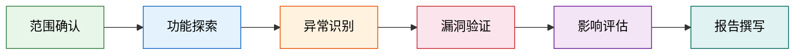
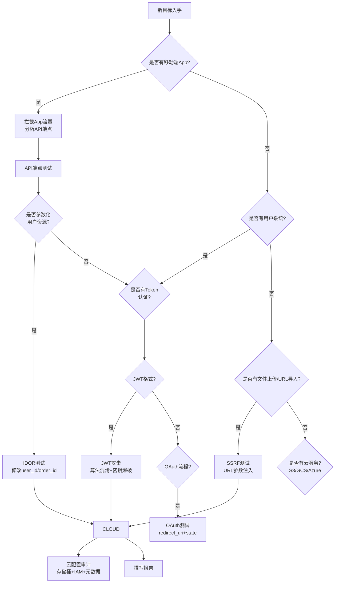

## 27.5 案例总结与经验提炼

### 27.5.1 章节定位与阅读指引

前面四个案例分别覆盖了Bug Bounty实战中最常见的四类漏洞场景：**SSRF服务端请求伪造**（案例一）、**IDOR越权访问**（案例二）、**JWT认证绕过**（案例三）和**云服务配置错误**（案例四）。这四个案例从不同维度揭示了Web安全的核心攻击面——服务端请求、对象级权限、身份认证机制和基础设施配置。

本节不是简单的"要点复述"，而是对前四个案例进行**系统化的经验提炼**，帮助读者建立从"看到单个漏洞"到"掌握漏洞挖掘方法论"的认知跃迁。具体来说，本节将：

- 对比四类漏洞的发现路径和关键转折点
- 构建通用的成功要素模型和失败原因分析框架
- 提炼可复用的侦察策略、测试方法和报告写作模板
- 总结从案例中应建立的个人知识库结构

后续案例五至案例七将涉及更复杂的OAuth认证链、批量数据泄露和竞态条件利用，本节的经验提炼为理解那些高级场景奠定了基础。

---

### 27.5.2 四大案例对比分析

#### 漏洞类型全景对比

| 维度 | 案例一：SSRF | 案例二：IDOR | 案例三：JWT绕过 | 案例四：云配置 |
|------|-------------|-------------|----------------|--------------|
| **漏洞类别** | 服务端请求伪造 | 不安全的直接对象引用 | 身份认证绕过 | 基础设施配置错误 |
| **CVSS评分范围** | 8.6-9.8 | 7.5-8.1 | 7.0-9.1 | 5.3-8.5 |
| **奖金范围** | $2,500-$60,000 | $5,000-$10,000 | $3,000-$15,000 | $800-$8,000 |
| **发现难度** | 中等 | 较低 | 中高 | 低至中等 |
| **利用复杂度** | 中等 | 低 | 中等 | 低 |
| **影响范围** | 内网穿透、云凭证泄露 | 用户隐私批量泄露 | 账户接管、权限提升 | 敏感数据泄露 |
| **主要侦察手段** | 子域名枚举、端点映射 | API流量分析 | 认证流程逆向 | 子域名+存储桶探测 |
| **关键绕过技术** | DNS重绑定、IP表示变换 | 参数篡改、UUID预测 | 算法混淆、密钥弱口令 | 权限配置审计 |

#### 发现路径的共同模式

尽管四类漏洞的技术细节截然不同，但它们的发现过程遵循一个高度一致的模式：



**第一阶段：范围确认**（所有案例共有）
- 每个案例都从仔细阅读Bug Bounty计划开始
- 确认测试目标、禁止行为、报告格式要求
- 这一步看似简单，却是避免法律风险和报告被拒的第一道防线

**第二阶段：功能探索**（侦察与映射）
- 案例一：通过子域名枚举发现API端点，通过图片上传功能触发SSRF
- 案例二：通过Burp Suite拦截移动应用流量，发现RESTful API模式
- 案例三：分析登录接口，识别JWT Token结构
- 案例四：从子域名枚举到S3存储桶探测，逐步缩小目标

**第三阶段：异常识别**（关键转折点）
- 这是区分"工具使用者"和"漏洞猎人"的核心能力
- 案例一的关键转折：发现图片导入功能接受任意URL
- 案例二的关键转折：修改user_id后成功获取他人数据
- 案例三的关键转折：发现JWT使用HS256算法且密钥可预测
- 案例四的关键转折：存储桶配置为公开可读且包含敏感信息

**第四阶段：验证与放大**
- 每个案例都进行了影响范围的扩大测试
- 这一步对奖金等级的影响极大：证明"可批量利用"远比"理论存在"更有说服力

---

### 27.5.3 成功要素的深层解析

从四个案例中提炼出的五个成功要素，不是空洞的口号，而是每个要素都有具体的案例佐证和可操作的方法论。

#### 要素一：系统化的侦察

**为什么重要**：侦察决定了你能在多大范围内发现攻击面。漏掉一个子域名，可能就漏掉一个$10,000的漏洞。

**具体实践**：

| 侦察阶段 | 工具/方法 | 产出物 | 案例对应 |
|----------|----------|--------|---------|
| 子域名枚举 | Subfinder, Amass, crt.sh | 子域名列表 | 案例一、四均以此起步 |
| 端口扫描 | Nmap, Masscan | 开放端口和服务 | 案例一发现内网服务入口 |
| API端点映射 | Burp Suite, Postman | API端点目录 | 案例二、三的核心侦察手段 |
| 敏感文件探测 | Dirsearch, ffuf | 敏感文件路径 | 案例四发现配置文件 |
| 技术栈识别 | Wappalyzer, BuiltWith | 技术栈信息 | 案例三推断JWT库版本 |
| 云环境探测 | cloud_enum, ScoutSuite | 云资源配置 | 案例四的S3存储桶发现 |

**侦察策略的差异化**：

不同漏洞类型的侦察重心截然不同——

- **SSRF侦察**：重点关注"服务器会向哪里发起请求"的功能点，如图片导入、URL预览、Webhook配置、PDF生成等。案例一中，正是通过分析平台的"商品图片预览"功能才发现了SSRF入口
- **IDOR侦察**：重点分析API的访问控制模式，关注`user_id`、`order_id`等参数化端点。案例二通过拦截移动端流量，发现了以数字ID为参数的用户资料接口
- **认证漏洞侦察**：重点分析登录、注册、密码重置等认证流程的每一步，记录Token格式、签名算法、过期策略等。案例三通过分析JWT Token的Header结构，推断出可攻击方向
- **配置错误侦察**：重点探测子域名关联的云服务资源，检查权限配置。案例四通过子域名`s3.example-saas.com`直接定位到了公开存储桶

#### 要素二：深入的技术理解

**为什么重要**：工具只能告诉你"有东西"，技术理解才能告诉你"怎么用"。

**具体实践**：

在案例一（SSRF）中，仅仅知道"目标接受URL参数"是不够的。研究员需要理解：

1. **SSRF的底层原理**：服务端为什么会发起请求？因为应用需要从外部URL获取资源（图片预览、PDF生成等）。理解这一点，才能系统性地识别所有潜在SSRF入口
2. **协议层面的利用**：除了HTTP/HTTPS，还可以尝试`file:///etc/passwd`、`gopher://`、`dict://`等协议。案例一中正是通过`gopher://`协议与内网Redis服务交互，扩大了影响范围
3. **绕过机制的原理**：为什么DNS重绑定能绕过白名单？因为域名解析结果可能变化——第一次解析到白名单IP，第二次解析到内网IP。理解这个原理，才能设计出有效的绕过策略

在案例三（JWT绕过）中，技术理解更为关键：

1. **JWT结构解析**：Header（算法声明）、Payload（声明数据）、Signature（签名验证）三部分各自的功能和攻击面
2. **算法混淆原理**：为什么将算法改为`none`或`HS256→RSA`的混淆能绕过验证？因为服务端的验证逻辑存在缺陷——只检查"算法声明"而不验证"签名与密钥的匹配关系"
3. **密钥强度评估**：为什么弱口令字典攻击有效？因为很多开发者使用`secret`、`password123`等弱密钥

#### 要素三：创造性思维

**为什么重要**：标准测试方法只能发现标准漏洞。真正高价值的漏洞往往来自"如果……会怎样"的创造性假设。

**案例佐证**：

- **案例一的创造性绕过**：当直接SSRF测试被WAF拦截后，研究员尝试了URL编码变换（`%68%74%74%70`）、IP地址的八进制表示（`0177.0.0.1`）、IPv6映射（`[::ffff:127.0.0.1]`）等多种绕过策略。最终通过DNS重绑定技术成功绕过了IP白名单验证
- **案例三的多层尝试**：JWT攻击不是一次成功的。研究员依次尝试了`none`算法攻击（失败）→密钥爆破（发现弱密钥）→角色篡改→Token过期绕过，形成了一个完整的攻击链。这种"不行就换思路"的韧性是成功的关键
- **案例四的纵深探测**：从一个公开存储桶出发，研究员没有停下，而是继续枚举关联存储桶，发现了多个配置错误的桶——这就是"一个漏洞背后往往藏着一串漏洞"的典型体现

**创造性思维的训练方法**：

1. **假设-验证循环**：每发现一个异常现象，提出至少3个假设，逐一验证
2. **功能逆向**：不要只思考"这个功能怎么正常使用"，而是思考"这个功能怎么被滥用"
3. **边界探索**：测试输入的边界条件——空值、极大值、特殊字符、Unicode编码、控制字符
4. **组合攻击**：将多个低危发现串联，看能否形成高危攻击链

#### 要素四：专业的报告

**为什么重要**：同样的漏洞，不同的报告质量可以导致奖金差2-5倍。评审可能同时审查数百份报告，你的报告需要在30秒内抓住他们的注意力。

**高质量报告的结构框架**：

```text
# 报告标题（一句话说明漏洞类型+影响）
## 摘要（3-5句话概述漏洞、影响、修复建议）
## 漏洞详情
### 复现步骤（编号步骤，含具体URL/参数/截图）
### 影响分析（哪些数据受影响、影响多少用户、攻击场景）
### 修复建议（具体的代码级/配置级修复方案）
## 附加信息
- 严重性评级及理由
- 测试环境说明
```

**四个案例的报告策略差异**：

| 案例 | 报告重点 | 说服力策略 |
|------|---------|-----------|
| 案例一（SSRF） | 强调云元数据访问能力 | 证明可获取IAM凭证→服务器接管 |
| 案例二（IDOR） | 强调隐私泄露规模 | 演示批量获取100+用户敏感信息 |
| 案例三（JWT） | 强调认证绕过的全面性 | 展示从普通用户到管理员的权限提升 |
| 案例四（云配置） | 强调敏感数据暴露 | 列出泄露的API密钥和数据库凭证 |

#### 要素五：持续学习

**为什么重要**：安全领域的攻击技术每6个月就有显著变化。昨天的有效技术可能今天就被WAF厂商加入了规则库。

**持续学习的实践路径**：

1. **跟踪漏洞披露平台**：HackerOne Hacktivity、Bugcrowd disclosures、CVE数据库每周至少浏览一次
2. **复现公开漏洞**：在本地搭建靶场（DVWA、HackTheBox、TryHackMe），亲手复现每个新类型的漏洞
3. **阅读研究员博客**：如PortSwigger Research、Orange Tsai的SSRF系列、Aaron Costello的IDOR研究
4. **参与社区讨论**：Reddit r/netsec、Twitter安全圈、HackerOne社区的讨论
5. **建立个人知识库**：将每次测试中的发现整理为可复用的方法文档（详见27.5.5节）

---

### 27.5.4 常见失败原因的深度分析

失败原因不是"知道就好"的提醒清单，每一个背后都有具体的教训和避免策略。

#### 失败原因一：侦察不充分

**典型表现**：只测试了主域名，没有枚举子域名；只关注了Web端，忽略了移动端API。

**案例教训**：
- 案例四（云配置错误）之所以能发现公开存储桶，正是因为研究员从子域名枚举开始。如果只测试`example-saas.com`主站，根本不会发现`s3.example-saas.com`这个入口
- 案例二（IDOR）的发现源自移动端API流量分析。如果只在浏览器中测试Web页面，可能根本看不到`/api/v2/users/{user_id}/profile`这个端点

**避免策略**：

| 侦察盲区 | 常见遗漏 | 补救方法 |
|----------|---------|---------|
| 子域名 | 只测主域名 | Subfinder + crt.sh + DNS暴力枚举 |
| API端点 | 只测Web页面 | 拦截移动应用流量、分析JS文件 |
| 目录结构 | 只访问已知路径 | 目录爆破（ffuf/Dirsearch） |
| 云资源 | 忽略云基础设施 | cloud_enum、S3BucketFinder |
| 第三方服务 | 忽略CDN/托管服务 | 分析DNS记录中的CNAME |

#### 失败原因二：测试停留在表面

**典型表现**：运行了自动化扫描器，没有手动验证；发现了异常但没有深入挖掘。

**具体场景**：

```text
# 自动化工具报告："未发现漏洞"
# 实际情况：
- 工具只测试了GET请求，忽略了POST/PUT/DELETE
- 工具没有处理认证状态，所有请求都返回401
- 工具的Payload字典不包含该框架特有的绕过技巧
```

**避免策略**：
1. **自动化只作为侦察手段，手动测试才是验证核心**。案例一中，自动化工具发现了图片上传端点，但SSRF的绕过策略（DNS重绑定、编码变换）完全依赖手动测试
2. **理解目标的技术栈**。案例三中，识别出JWT库版本后，研究员才能针对性地尝试该版本已知的算法混淆漏洞
3. **测试业务逻辑，不仅仅是技术漏洞**。案例二中，IDOR的发现源于对"用户资料访问"这一业务逻辑的思考，而不是对某个参数的模糊测试

#### 失败原因三：报告质量差

**典型表现**：只说"发现了X漏洞"，没有提供完整的复现步骤；缺乏影响分析；修复建议不具体。

**反面案例**：

```text
❌ 差的报告：
"我发现了一个IDOR漏洞，可以访问其他用户的数据。请修复。"

✅ 好的报告（案例二的报告风格）：
"通过修改API请求中的user_id参数（GET /api/v2/users/{user_id}/profile），
可以未授权访问任意用户的个人资料，包括：姓名、邮箱、电话号码、出生日期、
好友列表和私信内容。使用测试账户（ID: 12345）的Bearer Token，将user_id
修改为其他数值（如12346-12445），成功获取了100个用户的完整资料。
影响范围：平台所有500万注册用户均受影响。
修复建议：1) 在API层实现基于会话的访问控制；2) 使用UUID替代数字ID；
3) 对每个端点实施资源级授权检查。"
```

**报告质量的量化标准**：

| 评估维度 | 低质量（可能被拒） | 中等质量（可能降级） | 高质量（满分奖金） |
|----------|-------------------|---------------------|-------------------|
| 复现步骤 | "访问某URL" | 分步骤但缺少参数 | 完整的请求/响应示例 |
| 影响分析 | "可能导致数据泄露" | 列出受影响数据类型 | 量化影响范围+攻击场景 |
| 修复建议 | "请修复" | 通用建议 | 代码级/配置级具体方案 |
| 截图/证据 | 无 | 有但不清晰 | 清晰标注的关键步骤截图 |

#### 失败原因四：违反计划规则

**典型表现**：测试了范围外的域名；进行了破坏性操作（删除数据、修改其他用户数据）；在公开场合讨论漏洞。

**严重后果**：
- 报告直接被拒，不给予奖金
- 可能被平台加入黑名单
- 严重的可能面临法律追究

**避免策略**：
1. **将范围声明截图保存**。测试前再次确认目标域名/IP范围
2. **区分"读取"和"修改"操作**。所有案例中，研究员都只进行了数据读取，没有进行修改或删除操作
3. **不下载大规模敏感数据**。案例二和案例六中，研究员只获取了有限数量的数据用于证明漏洞存在
4. **不在报告外讨论漏洞细节**。在漏洞修复前不公开披露

#### 失败原因五：过度依赖自动化工具

**典型表现**：用Nmap扫完端口就认为侦察结束；用SQLMap跑完注入点就认为测试完成。

**自动化工具的局限性**：

| 工具类型 | 能做的 | 不能做的 |
|----------|--------|---------|
| 子域名枚举 | 发现已知子域名 | 发现需要特定条件触发的子域名 |
| 漏洞扫描器 | 发现已知模式的漏洞 | 发现业务逻辑漏洞、组合攻击 |
| FUZZ工具 | 高速路径/参数发现 | 判断发现内容的业务含义 |
| JWT工具 | 自动测试常见JWT攻击 | 理解特定应用的Token生命周期逻辑 |

**正确的自动化使用方式**：
- 用自动化工具**发现入口**，用手动测试**验证和利用**
- 案例一：自动化扫描发现了图片上传端点，但SSRF绕过完全依赖手动DNS重绑定
- 案例三：jwt_tool完成了密钥爆破，但后续的权限提升和攻击链构造完全依赖手动分析

---

### 27.5.5 可复用的知识框架

#### 个人漏洞挖掘知识库结构

完成每个案例学习后，建议按照以下结构整理个人知识库：

```text
bug-bounty-kb/
├── recon-methods/
│   ├── subdomain-enumeration.md      # 子域名枚举方法集
│   ├── api-discovery.md              # API端点发现技巧
│   ├── tech-stack-fingerprint.md     # 技术栈指纹识别
│   └── cloud-resource-discovery.md   # 云资源探测方法
├── vuln-types/
│   ├── ssrf/
│   │   ├── theory.md                 # SSRF原理
│   │   ├── detection.md              # 检测方法
│   │   ├── bypass-techniques.md      # WAF绕过技巧
│   │   └── cloud-exploitation.md     # 云环境利用
│   ├── idor/
│   │   ├── patterns.md               # IDOR常见模式
│   │   ├── mass-assignment.md        # 批量赋值关联
│   │   └── access-control.md         # 访问控制审计
│   ├── auth-bypass/
│   │   ├── jwt-attacks.md            # JWT攻击手册
│   │   ├── oauth-misconfig.md        # OAuth配置错误
│   │   └── session-management.md     # 会话管理漏洞
│   └── misconfig/
│       ├── s3-buckets.md             # S3存储桶安全
│       ├── cloud-iam.md              # 云IAM配置
│       └── default-credentials.md    # 默认凭证
├── tools/
│   ├── burp-suite-tips.md            # Burp Suite使用技巧
│   ├── recon-tools.md                # 侦察工具集
│   └── exploit-tools.md              # 利用工具集
├── report-templates/
│   ├── ssrf-report-template.md       # SSRF报告模板
│   ├── idor-report-template.md       # IDOR报告模板
│   └── general-template.md           # 通用报告模板
└── lessons-learned/
    ├── case-01-ssrf.md               # 案例一复盘
    ├── case-02-idor.md               # 案例二复盘
    ├── case-03-jwt.md                # 案例三复盘
    └── case-04-cloud.md              # 案例四复盘
```

#### 漏洞分类决策树

当面对一个新目标时，以下决策树帮助你快速确定测试方向：



#### 奖金最大化策略

从四个案例的奖金数据中可以提炼出提高奖金的关键策略：

**策略一：证明批量影响**

| 做法 | 奖金影响 | 案例依据 |
|------|---------|---------|
| "可以访问1个用户数据" | 基础奖金 | — |
| "可以批量获取100+用户数据" | 奖金 ×3-5 | 案例二演示批量获取 |
| "可以获取全部用户数据" | 奖金 ×5-10 | 案例六证明万级影响 |

**策略二：证明业务影响**

| 做法 | 奖金影响 | 案例依据 |
|------|---------|---------|
| "发现X漏洞" | 基础奖金 | — |
| "可以访问内网服务" | 奖金 ×2-3 | 案例一的SSRF内网穿透 |
| "可以获取云凭证→接管服务器" | 奖金 ×5-10 | 案例一的AWS元数据利用 |
| "可以绕过认证→管理员权限" | 奖金 ×3-5 | 案例三的JWT角色提升 |

**策略三：提供修复方案**

提供具体、可执行的修复建议不仅能提高报告被接受的概率，还可能被平台标记为"优秀报告"，带来额外奖金或声誉加分。

---

### 27.5.6 从案例到实战的行动清单

将本节的经验提炼转化为可执行的行动清单，帮助你在下一次Bug Bounty中系统化地应用这些经验：

#### 测试前准备

- [ ] 仔细阅读Bug Bounty计划，确认范围、禁止行为和报告格式
- [ ] 将范围声明截图保存，标记测试目标域名/IP
- [ ] 注册测试账户，充值必要的测试余额（如需要）
- [ ] 配置Burp Suite代理，设置过滤规则排除无关流量
- [ ] 准备侦察工具集（Subfinder、Amass、ffuf等）

#### 侦察阶段

- [ ] 子域名枚举：至少使用2种工具交叉验证
- [ ] 端口扫描：识别Web服务之外的开放端口（Redis、MongoDB等）
- [ ] API端点映射：拦截Web和移动端流量，建立API目录
- [ ] 技术栈识别：确定框架、语言、第三方服务
- [ ] 云资源探测：检查S3/GCS存储桶、云元数据端点

#### 测试阶段

- [ ] 按漏洞类型决策树逐项测试
- [ ] 对每个发现的异常，至少提出3个假设并验证
- [ ] 记录完整的请求/响应日志（Burp Suite保存项目）
- [ ] 测试边界条件：空值、极大值、特殊字符、编码变换
- [ ] 尝试绕过WAF：编码变换、大小写混淆、分块传输

#### 报告阶段

- [ ] 按照报告模板填写，确保每个步骤可复现
- [ ] 量化影响范围（受影响用户数、数据量、攻击场景）
- [ ] 提供代码级/配置级修复建议
- [ ] 清理测试数据，不保留敏感信息
- [ ] 检查是否违反了任何计划规则

---

### 27.5.7 本节小结

四个案例的核心教训可以浓缩为三句话：

1. **侦察决定上限**：你能看到多少攻击面，决定了你能找到多少漏洞。系统化、多维度的侦察是所有成功案例的共同起点
2. **理解决定深度**：工具帮你发现问题，但只有技术理解才能帮你利用问题、评估影响、证明价值。从"会用工具"到"理解原理"的跃迁，是收入从$500到$10,000的分水岭
3. **表达决定价值**：同样的漏洞，清晰的复现步骤、量化的攻击场景和具体的修复建议，可以让你的报告奖金翻倍

从下一个案例开始，我们将面对更复杂的攻击链——OAuth认证绕过、API批量数据泄露、竞态条件利用——这些案例将运用本节提炼的所有经验，并将其推向更高的复杂度和影响力。
