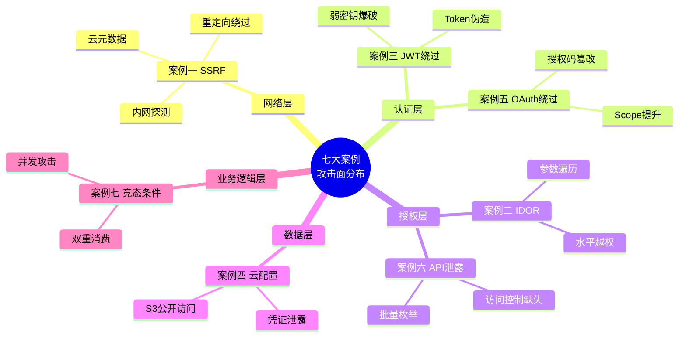
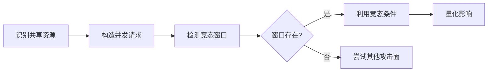
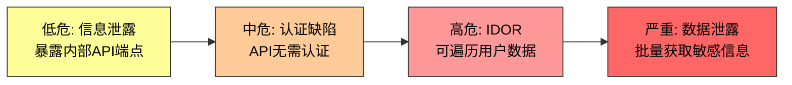
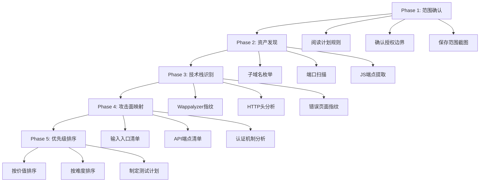
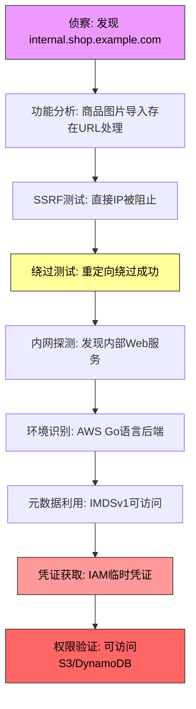
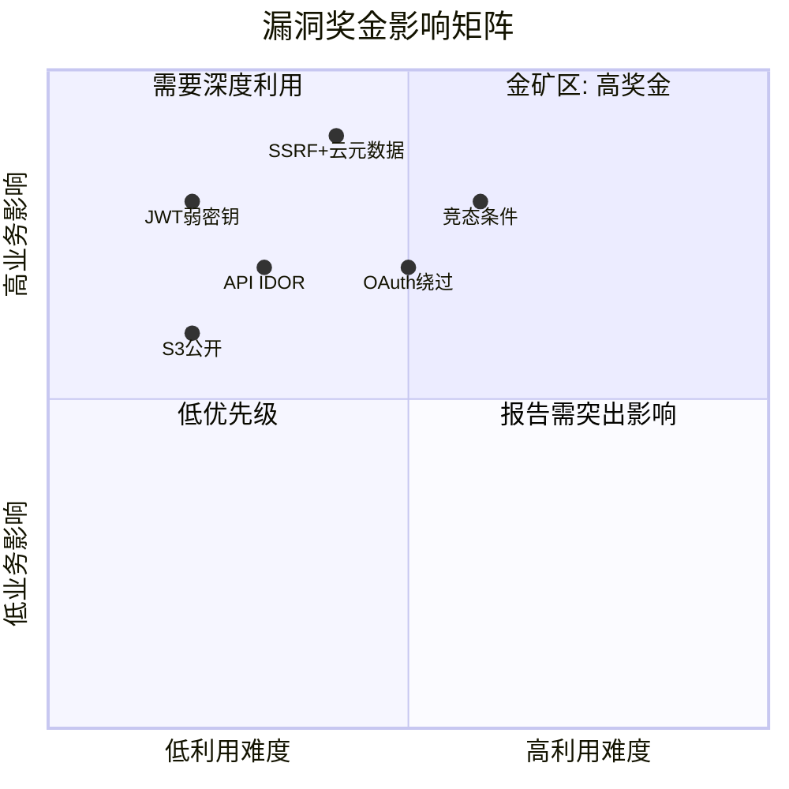
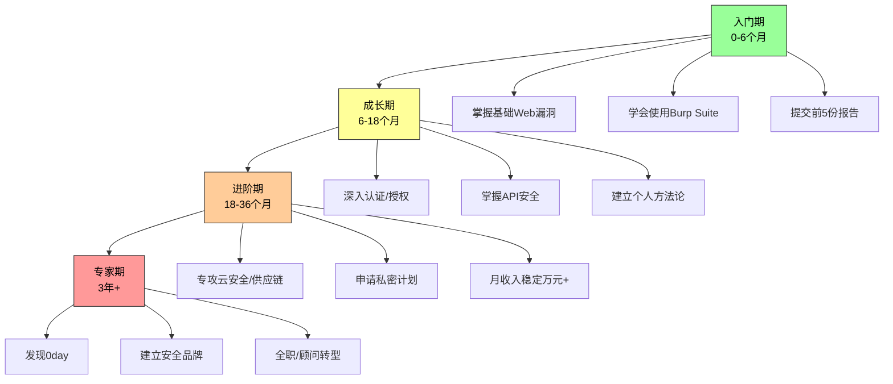
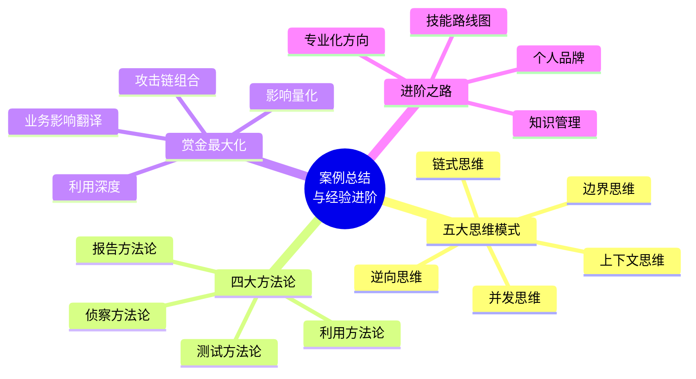

## 27.9 案例总结与经验进阶

本节是实战案例部分的终章总结。前面七个案例分别覆盖了SSRF、IDOR、认证绕过、云配置错误、OAuth绕过、API数据泄露、竞态条件等核心漏洞类型，涉及电商、社交、金融、SaaS、教育等多个行业场景。本节将这些分散的实战经验提炼为系统化的方法论，帮助读者从"会做单个案例"升级为"具备独立猎洞能力"。

---

### 27.9.1 七大案例全景回顾

在深入方法论之前，先用一张表回顾所有案例的核心要素，建立全局视角：

| 案例 | 漏洞类型 | 目标行业 | 核心攻击技术 | 严重级别 | 奖金 | 关键教训 |
|------|----------|----------|-------------|----------|------|----------|
| 案例一 | SSRF | 电商 | 重定向绕过 + 云元数据利用 | 严重 | $30,000 | 单一SSRF通过纵深利用可升级为灾难级 |
| 案例二 | IDOR | 社交平台 | 参数遍历 + 水平越权 | 高危 | $5,000 | 批量数据暴露的影响远超单条记录 |
| 案例三 | JWT认证绕过 | 金融 | 弱密钥爆破 + Token伪造 | 严重 | $25,000 | 认证机制是安全体系的根基 |
| 案例四 | 云配置错误 | SaaS | S3存储桶公开访问 | 高危 | $8,000 | 云安全是新兴高价值攻击面 |
| 案例五 | OAuth绕过 | SaaS平台 | 授权码篡改 + scope提升 | 严重 | $20,000 | 第三方认证流程是逻辑漏洞高发区 |
| 案例六 | API数据泄露 | 在线教育 | IDOR + 批量枚举 | 严重 | $15,000 | API缺乏访问控制 = 数据裸奔 |
| 案例七 | 竞态条件 | 在线商城 | 并发请求 + 双重消费 | 严重 | ¥50,000 | 并发问题在金融场景中最具破坏力 |



**关键发现**：七个案例中，认证/授权类漏洞占了四个（案例二、三、五、六），说明**身份与访问控制**是Bug Bounty中最高产的攻击面。掌握认证授权的攻防技术，就掌握了Bug Bounty的半壁江山。

---

### 27.9.2 漏洞挖掘的五大思维模式

从七个案例中，可以提炼出五种核心思维模式。这些思维模式不是抽象的理论，而是经过实战检验的思考框架，每一种都在具体案例中发挥了决定性作用。

#### 一、逆向思维：从"正常功能"到"滥用场景"

逆向思维的核心是：**不要问"这个功能怎么用"，而要问"这个功能怎么被用坏"**。

每个功能点在设计时都假设了"正常用户"的行为模式，而漏洞挖掘者的工作就是打破这个假设。具体操作步骤：

1. **列举功能点**：列出目标系统的所有输入入口（表单、API端点、URL参数、文件上传等）
2. **反转假设**：对每个入口问——如果输入不是预期类型怎么办？如果调用顺序不是预期的怎么办？如果调用者身份不是预期的怎么办？
3. **构建滥用场景**：将反转后的假设转化为具体的攻击场景

**案例对照**：

| 正常假设 | 逆向思维 | 产生的漏洞 |
|----------|----------|-----------|
| 用户只会访问自己的数据（案例二） | 如果修改user_id会怎样？ | IDOR越权访问 |
| 优惠券只能使用一次（案例七） | 如果同时提交多次会怎样？ | 竞态条件双重消费 |
| URL只指向合法图片（案例一） | 如果URL指向内网服务会怎样？ | SSRF内网探测 |
| JWT密钥是安全的（案例三） | 如果密钥是弱口令会怎样？ | 认证绕过 |

**练习方法**：选择任何一个Web应用，对其注册→登录→核心功能→支付的完整流程，用逆向思维逐点分析，记录所有"如果……会怎样"的假设，形成自己的攻击思路清单。

#### 二、边界思维：在极端条件下寻找裂缝

边界思维关注的是：**当输入参数处于边界值时，系统的行为是否仍然安全**。

常见的边界条件包括：

| 边界类型 | 具体值 | 测试目标 |
|----------|--------|----------|
| 数值边界 | 0、-1、最大整数、最小整数 | 溢出、负数处理、除零 |
| 字符串边界 | 空串、超长字符串、Unicode、特殊字符 | 缓冲区溢出、编码问题、注入 |
| 时间边界 | 同时请求、过期Token、时区差异 | 竞态条件、Token复用 |
| 权限边界 | 无权限用户、过期权限、跨角色访问 | 越权、权限提升 |
| 状态边界 | 未注册用户、已注销用户、被封禁用户 | 状态管理缺陷 |

**案例对照**：案例七的竞态条件就是典型的时间边界漏洞——系统假设请求是串行到达的，但在并发边界下（多个请求同时到达），优惠券校验和使用之间的间隙被利用。

**实操建议**：在Burp Suite的Intruder模块中，对关键参数设置以下Payload类型进行自动化边界测试：

```text
# Burp Intruder Payload配置
- Numbers: 0, 1, -1, 2147483647, 2147483648
- empty, null, undefined
- 特殊字符: ', ", \, %00, %0d%0a, ../, ../../
- 超长字符串: A*10000, A*100000
- Unicode: \u0000, \u200b, RTL override
```

#### 三、并发思维：时间是攻击者的盟友

并发思维的核心是：**在多线程/异步环境中，操作的执行顺序不再是确定的**。

大多数Web应用在设计时假设请求是串行处理的，但现代高并发架构（微服务、消息队列、分布式缓存）打破了这个假设。以下是并发思维在实战中的应用框架：



**高并发攻击场景清单**：

| 场景 | 共享资源 | 竞态窗口 | 潜在影响 |
|------|----------|----------|----------|
| 优惠券使用（案例七） | 优惠券状态 | 校验→标记已使用 | 多次使用同一优惠券 |
| 余额支付 | 账户余额 | 余额检查→扣款 | 重复扣款/超额支付 |
| 积分兑换 | 积分余额 | 积分检查→扣减 | 积分翻倍获取 |
| 库存扣减 | 商品库存 | 库存检查→扣减 | 超卖 |
| 注册/绑定 | 手机号/邮箱 | 唯一性检查→写入 | 重复注册/绑定 |

**测试工具**：除了案例七中使用的Python threading外，还可以使用Turbo Intruder（Burp Suite插件）进行更精确的竞态测试：

```python
# Turbo Intruder竞态测试脚本
def queueRequests(target, wordlists):
    engine = RequestEngine(endpoint=target.endpoint,
                           concurrentConnections=30,
                           requestsPerConnection=100,
                           pipeline=False)

    # 同时发送20个优惠券使用请求
    for i in range(20):
        engine.queue(target.req, target.baseInput)

    # 分析响应差异
    for i in range(20):
        response = engine.readResponse()
        if 'success' in response.text:
            fuzzer_base64(response.request.fuzzing_metadata['seed'])

def handleAnswer(req, interesting):
    table.add(req)
```

#### 四、链式思维：将低危漏洞组合成致命攻击

单个低危漏洞可能只值$100-$500，但通过链式组合，可以将其升级为严重级别，奖金可达$10,000以上。

**攻击链示例**：



**七种常见攻击链模式**：

| 链式组合 | 原始漏洞 | 组合效果 | 案例参考 |
|----------|----------|----------|----------|
| SSRF + 云元数据 | 信息泄露 + 云配置 | AWS凭证窃取 | 案例一 |
| IDOR + 批量枚举 | 逻辑缺陷 + 接口暴露 | 大规模数据泄露 | 案例六 |
| JWT弱密钥 + 权限提升 | 认证缺陷 + 授权缺陷 | 管理员权限获取 | 案例三 |
| OAuth scope + API滥用 | 认证缺陷 + API设计缺陷 | 越权数据访问 | 案例五 |
| 竞态条件 + 金融操作 | 并发缺陷 + 业务逻辑 | 资金盗取 | 案例七 |
| 信息泄露 + 内网探测 | 信息泄露 + 网络隔离绕过 | 内网全面暴露 | 案例一 |
| S3公开 + 凭证存储 | 配置错误 + 密钥管理缺陷 | 全面系统接管 | 案例四 |

**构建攻击链的方法论**：

1. **绘制数据流图**：从用户输入到数据存储，画出完整的数据流转路径
2. **标注每个节点的安全控制**：认证、授权、输入校验、加密等
3. **寻找控制薄弱点**：哪些节点的安全控制可以被绕过或不存在
4. **连接薄弱点**：将多个薄弱点串联，形成从入口到目标的完整攻击路径
5. **评估链的完整性**：每个环节是否可靠，是否有中间断裂的可能

#### 五、上下文思维：理解漏洞在业务场景中的真实影响

同一个技术漏洞在不同业务场景下的影响天差地别。上下文思维要求你**不仅仅发现漏洞的技术原理，更要理解它在特定业务中的实际危害**。

**同一漏洞类型在不同场景下的影响对比**：

| 漏洞类型 | 普通场景 | 金融场景 | 医疗场景 |
|----------|----------|----------|----------|
| IDOR | 查看他人订单 | 转移他人资金 | 篡改他人病历 |
| XSS | 窃取Cookie | 劫持支付操作 | 注入虚假诊断 |
| 信息泄露 | 用户名/邮箱 | 银行卡/身份证 | 病史/处方信息 |
| 竞态条件 | 重复领取积分 | 双重扣款/转账 | 重复开药处方 |

**在报告中体现上下文思维**：

- **案例一（SSRF）**：不是简单地说"可以访问内网"，而是强调"可以获取AWS IAM凭证，进而访问S3中的用户数据和订单信息"——将技术影响翻译为业务影响
- **案例七（竞态条件）**：不是简单地说"优惠券可以多次使用"，而是量化了"一张优惠券被使用12次，平台损失¥550"——用数字说话
- **案例六（API泄露）**：列出了具体泄露的数据类型（姓名、邮箱、电话、身份证号），而非笼统地说"用户数据可被访问"

**练习方法**：拿到一个漏洞后，尝试用以下模板描述其影响：

```text
[漏洞类型] 在 [业务场景] 中可导致 [具体影响1]、[具体影响2]、[具体影响3]。
如果被恶意利用，预计影响 [用户数量/数据量]，
造成 [经济损失/声誉损害/合规风险]。
```

---

### 27.9.3 从案例到可复用方法论

每个成功的Bug Bounty案例都可以提炼为可复用的方法论。以下是四大方法论框架，涵盖从侦察到报告的完整流程。

#### 一、侦察方法论：系统化的信息收集流程



**侦察工具链推荐**：

| 阶段 | 工具 | 用途 | 优先级 |
|------|------|------|--------|
| 子域名枚举 | subfinder, amass, crt.sh | 发现所有子域名 | 必选 |
| 端口扫描 | httpx, nmap | 发现存活服务 | 必选 |
| JS分析 | LinkFinder, JSFinder | 提取隐藏端点 | 推荐 |
| 技术栈识别 | Wappalyzer, whatweb | 识别框架/语言 | 推荐 |
| 敏感信息 | GitLeaks, truffleHog | 发现泄露凭证 | 推荐 |
| WAF识别 | wafw00f | 判断防护级别 | 可选 |

**案例复盘**：案例一的侦察阶段使用了subfinder + amass + crt.sh的三重枚举策略，发现了`internal.shop.example.com`这个关键子域名，直接指向了内网服务暴露——这是一次教科书级的侦察到利用的链路。

#### 二、测试方法论：针对不同漏洞类型的测试清单

以下是一份经过实战验证的漏洞测试清单，覆盖七大案例涉及的所有漏洞类型：

**SSRF测试清单**：

```text
□ 直接内网IP访问（127.0.0.1, 10.x, 172.16-31.x, 192.168.x）
□ IP格式混淆（十进制、十六进制、八进制、IPv6映射）
□ URL解析差异（@符号、重定向、短链接）
□ 协议利用（file://, dict://, gopher://, ftp://）
□ DNS重绑定攻击
□ 云元数据服务（169.254.169.254）
□ 带外确认（Burp Collaborator / interactsh）
```

**IDOR/API安全测试清单**：

```text
□ 水平越权：修改用户ID访问他人数据
□ 垂直越权：普通用户访问管理员接口
□ 批量枚举：遍历ID获取批量数据
□ UUID猜测：如果使用UUID，测试可预测性
□ 批量操作：批量删除/修改的权限检查
□ 多租户隔离：不同租户数据是否隔离
```

**认证/授权测试清单**：

```text
□ JWT算法混淆（none算法、HS256→RS256）
□ JWT弱密钥爆破
□ Token过期/刷新机制
□ OAuth redirect_uri验证
□ OAuth scope提升
□ 密码重置流程
□ 多因素认证绕过
```

**竞态条件测试清单**：

```text
□ 优惠券/折扣码重复使用
□ 余额支付并发请求
□ 积分兑换并发操作
□ 库存扣减竞态
□ 注册/绑定唯一性检查
□ 并发文件上传覆盖
```

#### 三、利用方法论：从发现到利用的完整攻击链

发现漏洞只是第一步，将其发展为完整的利用链才能体现真正的价值。以下是利用深度的五个层级：

| 层级 | 描述 | 案例示例 | 奖金影响 |
|------|------|----------|----------|
| L1: 概念验证 | 证明漏洞存在 | 发现SSRF可访问内网 | 基础奖金 |
| L2: 影响确认 | 量化数据影响 | 获取AWS凭证 | 奖金×2 |
| L3: 纵深利用 | 扩大攻击范围 | 从SSRF到云资源访问 | 奖金×3-5 |
| L4: 横向移动 | 跨系统利用 | 从凭证到S3数据访问 | 奖金×5-10 |
| L5: 全面接管 | 完全控制目标 | 获取管理员权限 | 顶级奖金 |

**案例一的利用深度演进**：

```text
L1: 确认商品图片导入存在SSRF
    ↓
L2: 通过重定向绕过成功访问内网服务
    ↓
L3: 发现服务器运行在AWS环境
    ↓
L4: 访问169.254.169.254获取IAM临时凭证
    ↓
L5: 验证凭证可访问S3/DynamoDB等核心资源
```

**关键原则**：在Bug Bounty中，**利用深度直接决定奖金等级**。同样的SSRF漏洞，L1级别可能只值$1,000，但达到L4级别就可以拿到$30,000+。因此，发现漏洞后不要急着提交报告，先尽可能深地探索利用空间。


**责任边界**：纵深利用的目的是**证明风险**，而非**造成损害**。在Bug Bounty中，获取凭证后验证其有效性即可，不要进行实际的数据下载、删除或修改操作。所有操作应保留完整日志，以备审查。


#### 四、报告方法论：结构化的漏洞报告写作流程

一份被接受率>80%的漏洞报告，需要遵循以下结构：

```text
1. 标题：[严重级别] 简明扼要的漏洞描述（如"[严重] SSRF漏洞导致AWS元数据凭证泄露"）
2. 漏洞类型：明确的CWE分类
3. CVSS评分：使用CVSS 3.1计算器，附完整向量字符串
4. 复现步骤：编号的、可重复的操作步骤
5. 概念验证：请求/响应的完整截图或文本
6. 影响分析：具体的影响范围和数据量
7. 修复建议：可执行的技术方案
8. 参考资料：相关CVE、安全公告、最佳实践链接
```

**报告质量与奖金的关系**：

| 报告质量维度 | 低质量表现 | 高质量表现 | 对奖金的影响 |
|-------------|-----------|-----------|-------------|
| 标题 | "存在安全问题" | "[严重] SSRF导致AWS凭证泄露" | 影响评审第一印象 |
| 复现步骤 | "访问某个URL" | 编号步骤 + 截图 + 请求文本 | 影响接受率 |
| 影响分析 | "可能有风险" | "可获取10万+用户数据" | 直接决定奖金等级 |
| 修复建议 | "请修复" | 具体代码级方案 + 配置建议 | 体现专业度 |

---

### 27.9.4 攻击链构建：从单点发现到纵深利用

单个漏洞的价值是有限的，真正的高手善于将多个发现串联为攻击链。以下是构建攻击链的方法论和实战框架。

#### 攻击链构建的四步法

**第一步：资产清单化**

将侦察阶段发现的所有资产整理为结构化清单：

```text
域名/子域名 → 对应服务 → 使用技术 → 已知漏洞/弱点
```

**第二步：攻击面映射**

对每个资产标注已知的攻击面：

```text
[资产A] → [攻击面1: 未认证API] → [攻击面2: IDOR]
[资产B] → [攻击面1: SSRF入口] → [攻击面2: 信息泄露]
```

**第三步：链路连接**

寻找资产之间的关联点，构建从入口到目标的完整路径：

```text
信息泄露(资产A) → 暴露内部API → 无认证访问 → IDOR获取数据 → 敏感信息泄露
```

**第四步：验证与量化**

对每条链路进行实际验证，确认每个环节的可靠性，量化最终影响。

#### 实战案例：案例一的攻击链分析



**链路中的关键转折点**：

- **转折点1**：`internal.shop.example.com`的发现——这是侦察阶段的"金矿发现"，直接降低了后续利用的难度
- **转折点2**：重定向绕过成功——这是技术层面的突破，将"被阻止的SSRF"转化为"可利用的SSRF"
- **转折点3**：AWS元数据可访问——这是影响升级的关键，将"内网探测"升级为"云凭证窃取"

---

### 27.9.5 赏金最大化策略复盘

七个案例的奖金从$5,000到¥50,000不等，差异背后有清晰的规律。

#### 奖金决定因素模型



#### 奖金提升的五大杠杆

| 杠杆 | 说明 | 实施方法 | 案例参考 |
|------|------|----------|----------|
| 影响量化 | 用具体数字描述影响 | "影响500万用户" > "影响大量用户" | 案例六：10,000+用户数据 |
| 利用深度 | 从L1到L5逐步深入 | 发现漏洞后继续探索纵深利用 | 案例一：SSRF→云凭证 |
| 攻击链组合 | 将多个漏洞串联 | 低危组合为高危/严重 | 案例四→案例一组合 |
| 业务影响翻译 | 技术影响→业务影响 | "可导致资金损失" > "存在并发问题" | 案例七：¥550直接损失 |
| 修复价值 | 提供高质量修复方案 | 代码级建议 > 泛泛而谈 | 所有案例 |

#### 赏金谈判技巧

当平台给出的赏金低于预期时，可以通过以下策略争取更高的赏金：

1. **补充影响分析**：提供更多关于数据量、用户量、业务影响的证据
2. **展示攻击链**：说明漏洞可以如何与其他弱点组合，形成更大的威胁
3. **引用行业标准**：参考同类型漏洞在其他平台的赏金水平
4. **提供修复成本分析**：说明修复该漏洞的工程量，体现漏洞的优先级

---

### 27.9.6 常见误区与避坑指南

根据七个案例的经验总结，以下是新手和中级猎人最常犯的错误。

#### 十大常见误区

| 误区 | 正确做法 | 案例教训 |
|------|----------|----------|
| 1. 只提交L1级漏洞，不深入利用 | 发现漏洞后先探索纵深利用 | 案例一从L1到L5奖金翻30倍 |
| 2. 报告写得像技术日记 | 用结构化模板，突出影响 | 报告质量直接决定接受率 |
| 3. 忽视范围确认就开测 | 先截图保存范围声明 | 超范围测试可能面临法律风险 |
| 4. 过度依赖自动化工具 | 工具初筛 + 手动深度测试 | 七个案例均需要手动分析 |
| 5. 同时测试太多目标 | 专注2-3个目标深度挖掘 | 深度优于广度 |
| 6. 忽视认证/授权测试 | 优先测试认证授权（最高产） | 7个案例中4个涉及认证/授权 |
| 7. 不做影响量化 | 用具体数字描述影响范围 | 量化影响是奖金倍增器 |
| 8. 修复建议只写"请修复" | 提供代码级修复方案 | 专业度影响评审印象 |
| 9. 重复提交已知漏洞 | 提交前先搜索已公开报告 | 重复报告浪费时间且无奖金 |
| 10. 忽视报告提交后的沟通 | 积极与评审沟通，补充信息 | 沟通可以加速评审和提升赏金 |

#### 时间管理陷阱

| 陷阱 | 正确策略 |
|------|----------|
| 在一个目标上花太多时间 | 设置时间上限（如3天），到期切换 |
| 反复测试已排除的攻击面 | 记录测试日志，避免重复 |
| 追踪每一个新发现的子域名 | 优先测试高价值目标 |
| 编写过于复杂的PoC | 用最简单的方式证明漏洞 |

---

### 27.9.7 从猎人到专家：进阶之路

完成案例学习后，如何从Bug Bounty新手成长为资深安全专家？

#### 技能进阶路线图



#### 专业化方向选择

根据七个案例的漏洞分布，以下是五个主要专业化方向：

| 专业化方向 | 核心技能 | 市场需求 | 学习路径 | 预期月收入 |
|-----------|----------|----------|----------|-----------|
| API安全 | REST/GraphQL渗透 | 极高（数字化转型） | 案例六→OWASP API Top 10 | ¥8,000-30,000 |
| 云安全 | AWS/Azure/GCP渗透 | 极高（云原生趋势） | 案例四→AWS/Azure安全认证 | ¥10,000-40,000 |
| 认证授权 | OAuth/JWT/SAML攻防 | 高（零信任架构） | 案例三+五→身份安全深入 | ¥8,000-25,000 |
| 移动安全 | iOS/Android逆向 | 中高（移动优先） | 从App API入手→Native逆向 | ¥6,000-20,000 |
| 供应链安全 | 第三方组件/依赖攻击 | 极高（SolarWinds效应） | SBOM分析→依赖混淆→投毒 | ¥10,000-35,000 |

#### 建立个人品牌

在Bug Bounty社区建立声誉是长期发展的关键：

1. **HackerOne/Bugcrowd排行榜**：持续提交高质量报告，提升排名
2. **安全博客/技术文章**：分享非敏感的漏洞发现经验和方法论
3. **开源工具贡献**：开发或改进安全工具，建立技术影响力
4. **社区参与**：在安全论坛（如Reddit r/netsec、Twitter安全社区）积极交流
5. **演讲分享**：在安全会议（如KCon、补天白帽大会、HackerOne Meetup）分享经验

---

### 27.9.8 持续成长的知识管理体系

Bug Bounty是一个需要持续学习的领域——新框架、新漏洞类型、新攻击技术层出不穷。建立有效的知识管理体系是保持竞争力的关键。

#### 个人漏洞知识库架构

```text
knowledge-base/
├── 01-漏洞类型/
│   ├── SSRF/
│   │   ├── 原理与分类.md
│   │   ├── 测试清单.md
│   │   ├── 绕过技术.md
│   │   └── 案例记录/
│   ├── IDOR/
│   ├── 认证绕过/
│   ├── 竞态条件/
│   └── ...
├── 02-目标研究/
│   ├── company-a/
│   │   ├── 侦察记录.md
│   │   ├── 测试日志.md
│   │   └── 提交记录.md
│   └── ...
├── 03-工具笔记/
│   ├── burp-suite-技巧.md
│   ├── subfinder-配置.md
│   └── ...
├── 04-方法论/
│   ├── 侦察流程.md
│   ├── 测试流程.md
│   └── 报告模板.md
└── 05-学习资源/
    ├── 推荐文章.md
    ├── CTF writeup.md
    └── 漏洞数据库.md
```

#### 学习资源推荐

| 资源类型 | 推荐平台/内容 | 适用阶段 | 更新频率 |
|----------|--------------|----------|----------|
| 漏洞数据库 | CVE、NVD、HackerOne Hacktivity | 所有阶段 | 实时 |
| 在线靶场 | PortSwigger Web Security Academy | 入门-中级 | 持续更新 |
| 技术博客 | Orange Tsai、James Kettle、Corben Leo | 中级-高级 | 每周 |
| 播客 | Darknet Diaries、Security Now | 所有阶段 | 每周 |
| 社区 | BugBounty Discord、Reddit r/bugbounty | 所有阶段 | 实时 |
| 书籍 | 《The Web Application Hacker's Handbook》 | 入门-中级 | 经典 |
| 会议 | DEF CON、Black Hat、KCon、补天白帽大会 | 中级-高级 | 年度 |

#### 保持技术敏感度的习惯

1. **每日**：浏览HackerOne Hacktivity和Bugcrowd公开报告，了解最新漏洞趋势
2. **每周**：阅读1-2篇安全技术文章或研究报告
3. **每月**：在PortSwigger Academy完成一个实验室练习
4. **每季**：参加一次安全会议或线上分享
5. **每年**：更新个人方法论文档，复盘年度成果

---

### 27.9.9 本节核心要点



回顾七大案例，我们可以得出以下核心结论：

1. **认证/授权是最高产的攻击面**——七个案例中四个涉及认证授权，掌握这一领域就能覆盖大部分高价值漏洞
2. **侦察质量决定天花板**——案例一的SSRF发现完全依赖于对`internal.shop.example.com`的发现
3. **利用深度决定奖金**——同一个漏洞从L1到L5，奖金可以翻10-30倍
4. **报告质量影响接受率**——结构化、量化的报告比技术日记更容易被接受
5. **持续学习是唯一壁垒**——安全领域变化极快，停止学习就等于退步

Bug Bounty不仅是一种变现手段，更是一种持续精进安全技能的修炼方式。每一位猎人都在用实际的攻防经验，为整个互联网的安全做出贡献。

> **下一步行动建议**：选择一个公开的Bug Bounty目标，按照本节的方法论，完整走一遍"侦察→测试→利用→报告"的流程。理论只有通过实践才能内化为能力。
