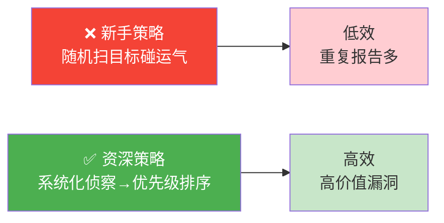
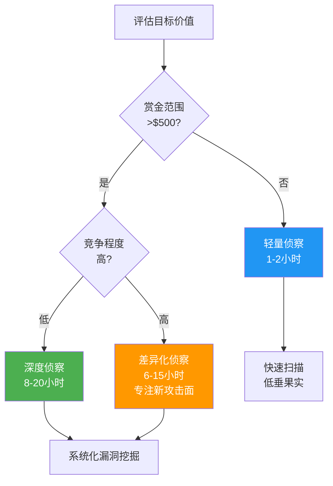
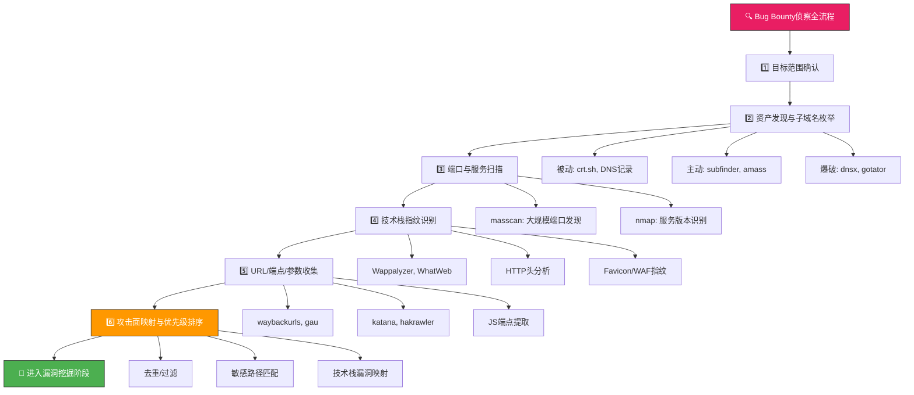

# 27.1 高效侦察方法论

> "侦察决定了一次Bug Bounty研究的上限。漏洞挖掘能力决定你能走多快，但侦察质量决定你能走多远。"

在Bug Bounty实践中，侦察（Reconnaissance）是整个攻击链的起点，也是决定成败的关键环节。根据HackerOne的统计数据，顶级赏金猎人平均将**40%-60%**的时间投入在侦察阶段，而新手往往急于直接寻找漏洞，跳过了系统化的信息收集过程。这种差异直接反映在收入上：资深猎人的单次有效报告率约为**15%-25%**，而新手不足**3%**。

本节将从道、法、术、器四个层面，构建一套完整的侦察方法论体系。

## 侦察的底层逻辑

### 为什么侦察如此重要

Bug Bounty的核心矛盾在于：**有限的时间投入 vs 海量的潜在攻击面**。一个中等规模的目标（如知名SaaS产品）可能拥有数千个子域名、数万个端点、数十种技术组件。如果你不清楚"哪里最可能藏有漏洞"，就只能随机碰运气——这种低效策略在竞争激烈的公开计划中几乎不可能产出成果。

系统化侦察解决的正是这个问题：**将盲目搜索转变为精准定位**。



### 被动侦察 vs 主动侦察

侦察分为两大类，理解它们的区别对于选择策略至关重要：

| 维度 | 被动侦察（Passive Recon） | 主动侦察（Active Recon） |
|------|--------------------------|------------------------|
| **是否接触目标服务器** | 否 — 通过第三方数据源获取信息 | 是 — 直接向目标发送请求 |
| **被检测风险** | 极低 — 目标几乎无法察觉 | 中高 — WAF/IDS可能触发告警 |
| **信息完整度** | 有限 — 只能获取公开可查的信息 | 较全 — 可获取实时的服务信息 |
| **适用阶段** | 初期情报收集 | 详细攻击面探测 |
| **法律风险** | 最低 | 需确保在授权范围内 |
| **典型工具** | crt.sh、Shodan、census、OSINT | nmap、ffuf、nuclei、katana |
| **推荐占比** | 60%-70%的时间 | 30%-40%的时间 |

**核心原则：** 能用被动侦察获取的信息，绝不主动发送请求。这不仅降低被封IP/账号的风险，也让你的侦察活动在法律灰色地带更加安全。

### 侦察投入产出比模型

并非所有目标都值得深度侦察。资深猎人通常使用以下框架评估侦察投入：



## 系统化侦察流程

完整的侦察流程由六个阶段组成，每个阶段都有明确的输入、输出和工具链：



### 第一阶段：目标范围确认

这是最容易被忽视、但一旦出错后果最严重的步骤。超出范围的测试不仅可能导致法律问题，还意味着你所有的时间投入都白费了。

**必须确认的信息：**

| 确认项 | 具体内容 | 常见陷阱 |
|--------|---------|---------|
| In-Scope域名 | 哪些域名/子域名在测试范围内 | `*.example.com` 不一定包含 `example.com` 本身 |
| Out-of-Scope域名 | 明确排除的域名 | 第三方服务（如AWS S3、CloudFlare）通常排除 |
| IP范围 | 是否有IP段在范围内 | CDN IP可能与实际服务器IP混淆 |
| 应用类型 | Web/移动/桌面/硬件 | 同一产品的不同平台可能有独立范围 |
| 禁止行为 | Rate limiting、禁止操作 | 某些计划禁止自动化测试、禁止DoS |
| 数据处理 | 是否允许访问用户数据 | 即使在范围内，访问真实用户数据可能违法 |
| 时效性 | 计划的开始/结束时间 | 过期计划提交的报告通常不被接受 |

**实操建议：**

```bash
# 创建目标范围文件，避免越界
cat > scope.txt << 'EOF'
# In-Scope
example.com
*.example.com
app.example.com

# Out-of-Scope
staging.example.com
*.internal.example.com
third-party-service.com
EOF

# 在scope.txt中添加注释说明每个域名的状态
# 这样即使间隔数周回来，也能快速回忆
```

### 第二阶段：资产发现与子域名枚举

子域名枚举是扩大攻击面的核心步骤。一个域名的子域名数量往往远超预期——知名互联网公司的子域名可能多达数万个。

#### 被动信息收集（不接触目标服务器）

```bash
# 1. 证书透明度日志查询 — 最可靠的被动来源
# crt.sh 基于CT Log，记录所有颁发的SSL证书
curl -s "https://crt.sh/?q=%25.example.com&output=json" | \
  jq -r '.[].name_value' | sort -u > crtsh_results.txt

# 2. DNS记录历史查询
# SecurityTrails API（需要API Key）
curl -s "https://api.securitytrails.com/v1/domain/example.com/subdomains" \
  -H "apikey: YOUR_API_KEY" | jq '.subdomains[] | . + ".example.com"'

# 3. VirusTotal被动DNS
curl -s "https://www.virustotal.com/api/v3/domains/example.com/subdomains" \
  -H "x-apikey: YOUR_API_KEY"

# 4. Shodan搜索已知的子域名IP
curl -s "https://api.shodan.io/dns/domain/example.com?key=YOUR_API_KEY"
```

#### 主动枚举（向目标DNS服务器发送请求）

```bash
# 1. subfinder — 多源聚合，速度快
# 它从30+个数据源（包括crt.sh、VirusTotal、PassiveTotal等）收集子域名
subfinder -d example.com -all -o subfinder_results.txt

# 参数说明：
# -d: 目标域名
# -all: 使用所有数据源（默认只用部分快速源）
# -o: 输出文件
# -silent: 静默模式，只输出结果

# 2. amass — 更深入的枚举，支持暴力破解
# 分为被动模式（不接触目标）和主动模式（会发送DNS查询）
amass enum -passive -d example.com -o amass_passive.txt
amass enum -active -d example.com -brute -o amass_active.txt

# 参数说明：
# -passive: 被动模式，不直接查询目标DNS
# -active: 主动模式，会进行DNS查询和HTTP探测
# -brute: 启用暴力破解子域名

# 3. dnsx — 高速DNS解析 + 状态检测
# 对枚举结果进行批量解析，筛选出活跃的子域名
cat all_subdomains.txt | dnsx -silent -a -resp-only > alive_subdomains.txt

# 参数说明：
# -a: 解析A记录
# -resp-only: 只输出解析到IP的结果
# -retry: 重试次数

# 4. gotator — 智能子域名变体生成
# 基于已有子域名生成可能的变体（前缀/后缀/数字递增）
gotator -sub domains.txt -perm permutations.txt -numbers 1 -silent > variants.txt

# 5. ripgen — 基于规则的子域名变体生成
ripgen -d example.com -w wordlist.txt > ripgen_results.txt
```

#### 字典爆破

当被动和主动枚举都无法发现更多子域名时，字典爆破是最后的手段：

```bash
# 使用 massdns 进行高速DNS爆破
# massdns 是最快的DNS解析器，适合大规模爆破
massdns -r resolvers.txt -t A -o S wordlist.txt > massdns_results.txt

# 推荐字典来源：
# - SecLists (https://github.com/danielmiessler/SecLists)
#   位置：/opt/wordlists/SecLists/Discovery/DNS/
# - 自定义字典：基于已有子域名的命名规律生成
# - subnames.txt（来自onyphe或社区贡献）

# 结合 dnsx 过滤活跃结果
cat massdns_results.txt | dnsx -silent -a -resp-only > alive_from_brute.txt
```

#### 子域名去重与汇总

```bash
# 合并所有来源的结果，去重并验证存活
cat crtsh_results.txt subfinder_results.txt amass_passive.txt \
    amass_active.txt alive_subdomains.txt variants.txt | \
    sort -u > all_subdomains_raw.txt

# 用 httpx 验证哪些子域名有活跃的Web服务
cat all_subdomains_raw.txt | httpx -silent -status-code -title \
    -tech-detect -follow-redirects > httpx_results.txt

# httpx 参数说明：
# -status-code: 显示HTTP状态码
# -title: 显示页面标题
# -tech-detect: 自动检测技术栈
# -follow-redirects: 跟随重定向
```

**工具对比：**

| 工具 | 速度 | 覆盖面 | 深度 | 适用场景 |
|------|------|--------|------|---------|
| subfinder | ⚡⚡⚡ 快 | ⭐⭐ 广 | ⭐⭐ 中 | 快速初筛，日常使用首选 |
| amass | ⚡⚡ 中 | ⭐⭐⭐ 最广 | ⭐⭐⭐ 深 | 深度枚举，竞品分析 |
| assetfinder | ⚡⚡⚡ 快 | ⭐ 较窄 | ⭐ 浅 | 快速辅助验证 |
| dnsx | ⚡⚡⚡⚡ 极快 | N/A | N/A | 批量DNS解析和状态检测 |
| gotator | ⚡⚡⚡ 快 | N/A | N/A | 子域名变体生成 |

### 第三阶段：端口与服务扫描

发现子域名后，需要了解每个资产运行的服务。这一步对于发现非标准端口上的服务（如管理界面、数据库、内部API）至关重要。

#### 大规模端口发现

```bash
# masscan — 大规模端口扫描的首选
# 优势：速度极快（可在6分钟内扫描整个IPv4地址空间）
# 注意：高扫描速率可能导致网络波动或被防火墙封锁

masscan -p1-65535 --rate=5000 --wait 3 \
    -iL alive_ips.txt -oG masscan_results.txt \
    --excludefile excluded_ranges.txt

# 参数说明：
# -p1-65535: 扫描全部TCP端口
# --rate=5000: 每秒发送5000个探测包（根据网络状况调整）
# --wait 3: 等待3秒确认未响应的端口
# -iL: 从文件读取目标IP列表
# -oG: Grepable格式输出
# --excludefile: 排除不需要扫描的IP段

# 常见需要关注的端口：
# 21(FTP), 22(SSH), 25(SMTP), 53(DNS), 80(HTTP),
# 443(HTTPS), 3306(MySQL), 5432(PostgreSQL), 6379(Redis),
# 8080(HTTP-Alt), 8443(HTTPS-Alt), 9200(Elasticsearch),
# 27017(MongoDB), 11211(Memcached), 5000(Flask/Docker)
```

#### 服务版本识别

```bash
# nmap — 精确的服务版本识别和漏洞检测
# 对masscan发现的开放端口进行深入扫描

nmap -sV -sC -T4 --version-intensity 5 \
    -iL open_ports.txt -oX nmap_services.xml

# 参数说明：
# -sV: 探测服务版本
# -sC: 使用默认脚本（NSE）
# -T4: 时序模板（4=积极扫描）
# --version-intensity 5: 版本探测强度（0-9）

# 针对特定端口的精准扫描
nmap -sV -p 80,443,8080,8443,3000,5000 \
    --script=http-title,http-server-header,http-methods \
    -iL alive_subdomains.txt -oX web_services.xml

# 使用nmap脚本引擎（NSE）进行漏洞检测
nmap --script=vuln -iL open_ports.txt -oX nmap_vulns.xml
```

**注意事项：**
- masscan扫描速率过高可能导致目标网络不稳定，一般建议不超过10000 packets/sec
- nmap的 `-sS`（SYN扫描）需要root权限
- 某些Bug Bounty计划明确禁止端口扫描，务必在计划规则中确认
- 对于云服务（AWS、Azure、GCP），CDN和负载均衡器的IP可能不在目标控制范围内

### 第四阶段：技术栈指纹识别

了解目标使用的技术栈是针对性漏洞挖掘的前提。不同的技术栈意味着不同的已知漏洞、不同的攻击向量、不同的配置陷阱。

#### 工具化指纹识别

```bash
# 1. WhatWeb — 命令行网站指纹识别
whatWeb -v -a 3 example.com

# 参数说明：
# -v: 详细输出
# -a 3: 设置 aggressiveness 等级（1-3，3最详细）

# 2. Wappalyzer（命令行版本）
wappalyzer-cli example.com

# 3. httpx 的技术检测功能
echo "example.com" | httpx -tech-detect -status-code -title

# 4. nuclei 的技术指纹模板
echo "example.com" | nuclei -t technologies/ -silent
```

#### HTTP响应头分析

响应头是技术栈信息的金矿，包含大量有价值的情报：

```bash
# 使用 curl 分析响应头
curl -sI https://example.com | head -30

# 重点关注以下头部：
# Server: nginx/1.18.0          → Web服务器及版本
# X-Powered-By: Express         → 后端框架
# X-AspNet-Version: 4.0.30319   → ASP.NET版本
# X-Generator: WordPress        → CMS类型
# X-Runtime: 0.045              → Ruby on Rails
# Set-Cookie: PHPSESSID=...     → PHP后端
# X-Debug-Token: ...            → 调试信息泄露（潜在漏洞）
```

#### Favicon哈希指纹

Favicon的MD5/SHA256哈希可以识别特定的Web框架和应用：

```bash
# Shodan提供了一个强大的Favicon哈希数据库
# https://book.hacktricks.xyz/generic-methodologies-and-resources/external-recon-methodology/favion-hash-shodan

# 计算favicon哈希
curl -s https://example.com/favicon.ico | md5sum

# 在Shodan中搜索该哈希
# http.favicon.hash:<hash_value>
# 例如：http.favicon.hash:-247388890
```

#### WAF识别

识别目标是否部署了WAF（Web Application Firewall）以及WAF类型，直接影响后续的测试策略：

```bash
# 1. wafw00f — 专业的WAF检测工具
wafw00f https://example.com

# 2. nuclei模板检测
echo "https://example.com" | nuclei -t http/technologies/waf-detect*

# 3. 手动检测 — 发送可疑请求观察响应
curl -s -o /dev/null -w "%{http_code}" "https://example.com/?id=1%27"

# 常见WAF及其特征：
# CloudFlare: cf-ray, cf-cache-status头
# AWS WAF: 无明显特征，返回403
# Akamai: x-akamai-transformed
# ModSecurity: Server: ModSecurity
# Sucuri: x-sucuri-id
```

**技术栈 → 漏洞映射速查表：**

| 技术栈 | 常见漏洞类型 | 测试重点 |
|--------|-------------|---------|
| WordPress | 插件漏洞、XML-RPC、用户枚举 | /wp-json/wp/v2/users, /xmlrpc.php |
| Laravel | debug模式泄露、反序列化 | /_ignition/execute-solution |
| Spring Boot | Actuator端点泄露、EL注入 | /actuator/env, /actuator/heapdump |
| Django | DEBUG=True、CSRF绕过 | /admin/, /static/admin/ |
| Express.js | 原型污染、依赖链漏洞 | 检查package.json中的过时依赖 |
| Ruby on Rails | 路由绕过、反序列化 | 检查 Rails版本和已知CVE |
| .NET/IIS | 反序列化、路径遍历 | web.config、TRACE方法 |
| Tomcat | Manager弱口令、反序列化 | /manager/html, /host-manager/ |

### 第五阶段：URL/端点/参数收集

这一步的目标是收集尽可能多的URL和参数，为后续的漏洞挖掘提供弹药。URL的广度直接决定了你的测试覆盖面。

#### 历史URL收集

```bash
# 1. waybackurls — 从Wayback Machine获取历史URL
echo "example.com" | waybackurls > wayback_urls.txt

# 2. gau (GetAllUrls) — 聚合多个历史URL源
# 数据源包括：Wayback Machine、Common Crawl、OTX、URLScan
echo "example.com" | gau --threads 5 > gau_urls.txt

# 3. otxurl — 从AlienVault OTX获取URL
echo "example.com" | otxurl > otx_urls.txt

# 4. gauplus — gau的增强版，支持过滤
echo "example.com" | gauplus -t 5 --blacklist png,jpg,gif > gauplus_urls.txt
```

#### 主动爬取

```bash
# 1. katana — ProjectDiscovery的现代爬虫
# 支持JavaScript渲染、自定义提取器、表单提交
katana -u https://example.com -d 3 -jc -kf -o katana_urls.txt

# 参数说明：
# -d 3: 最大爬取深度
# -jc: 启用JavaScript爬取
# -kf: 已知文件扩展名过滤

# 2. hakrawler — 轻量级Web爬虫
echo "https://example.com" | hakrawler -d 3 -insecure -o hakrawler_urls.txt

# 3. spider.py — 自定义爬虫（适合特殊需求）
# 基于Python requests + BeautifulSoup，可定制爬取逻辑
```

#### JavaScript端点提取（重要！）

现代Web应用大量使用JavaScript，API端点往往隐藏在JS文件中，而非直接暴露在HTML页面里。这是很多新手忽略的高价值侦察方向：

```bash
# 1. 使用katana自动提取JS中的端点
katana -u https://example.com -jc -d 2 -f json | \
  jq -r 'select(.url | endswith(".js")) | .url' > js_files.txt

# 2. 使用LinkFinder从JS文件中提取端点
for js_url in $(cat js_files.txt); do
    python3 LinkFinder.py -i "$js_url" -o cli >> js_endpoints.txt
done

# 3. 使用JSFinder
jsfinder -l urls.txt -s js_urls.txt > js_links.txt

# 4. 使用secretfinder检查JS中的敏感信息
for js_url in $(cat js_files.txt); do
    python3 SecretFinder.py -i "$js_url" -o cli >> js_secrets.txt
done
```

**JS中常见的高价值信息：**

| 信息类型 | 搜索模式 | 潜在风险 |
|---------|---------|---------|
| API端点 | `/api/v1/`, `/graphql`, `/rest/` | IDOR、未授权访问 |
| 硬编码密钥 | `api_key`, `secret`, `token`, `password` | 认证绕过、数据泄露 |
| 内部URL | `staging.`, `internal.`, `dev.` | 未授权访问内部系统 |
| 调试参数 | `debug=true`, `test=true`, `verbose` | 调试信息泄露 |
| AWS凭证 | `AKIA`, `aws_access_key` | 云资源未授权访问 |
| JWT/Token | `eyJ`, `Bearer` | 令牌伪造、会话劫持 |

### 第六阶段：攻击面映射与优先级排序

收集到大量信息后，需要进行分析和优先级排序，将有限的时间投入到最可能产出高价值漏洞的目标上。

#### 资产去重与分类

```bash
# 从httpx结果中提取关键信息
cat httpx_results.txt | \
  awk '{print $1, $2, $3}' | \
  sort -u > sorted_assets.txt

# 按技术栈分类资产
grep -i "WordPress" httpx_results.txt > wp_assets.txt
grep -i "nginx" httpx_results.txt > nginx_assets.txt
grep -i "Express" httpx_results.txt > express_assets.txt
```

#### 高优先级目标识别

```bash
# 筛选敏感路径和功能
cat all_urls.txt | grep -iE \
  "admin|login|signup|register|upload|import|export|api|graphql|debug|test|internal|backup|config" \
  > high_value_urls.txt

# 筛选带参数的URL（潜在注入点）
cat all_urls.txt | grep -E "\?" > parameterized_urls.txt

# 筛选特定HTTP方法的端点
cat all_urls.txt | xargs -I {} curl -sI {} | grep -iE "allow:|HTTP/" | sort -u

# 筛选可能包含敏感数据的端点
cat all_urls.txt | grep -iE \
  "user|account|profile|email|phone|address|payment|order|invoice|download|export" \
  > data_endpoints.txt
```

#### 优先级排序框架

基于风险和可发现性对目标进行排序：

| 优先级 | 目标类型 | 典型漏洞 | 赏金范围 |
|--------|---------|---------|---------|
| P0-最高 | 认证/授权系统 | 认证绕过、权限提升 | $1000-$50000 |
| P1-高 | 支付/交易功能 | 业务逻辑漏洞、金额篡改 | $500-$10000 |
| P2-高 | 文件上传/导入 | RCE、路径遍历 | $500-$20000 |
| P2-高 | API端点（GraphQL/REST） | IDOR、批量数据泄露 | $300-$5000 |
| P3-中 | 管理后台 | 未授权访问、弱口令 | $200-$5000 |
| P3-中 | 搜索功能 | 注入、信息泄露 | $100-$2000 |
| P4-低 | 静态页面/文档 | 信息泄露、过时依赖 | $0-$500 |

## 工具链自动化框架

将上述流程串联成可重复执行的自动化工作流，是提升侦察效率的关键：

```bash
#!/bin/bash
# recon.sh — 自动化侦察脚本框架
# 用法: ./recon.sh example.com

TARGET=$1
WORKDIR="recon_$(date +%Y%m%d_%H%M%S)_${TARGET}"
mkdir -p "$WORKDIR"

echo "[*] 开始侦察: $TARGET"
echo "[*] 工作目录: $WORKDIR"

# === 阶段1: 子域名枚举 ===
echo "[1/6] 子域名枚举..."
subfinder -d "$TARGET" -all -silent > "$WORKDIR/subfinder.txt" 2>/dev/null
amass enum -passive -d "$TARGET" > "$WORKDIR/amass_passive.txt" 2>/dev/null
curl -s "https://crt.sh/?q=%25.${TARGET}&output=json" | \
  jq -r '.[].name_value' | sort -u > "$WORKDIR/crtsh.txt" 2>/dev/null

cat "$WORKDIR"/*.txt | sort -u > "$WORKDIR/all_subdomains.txt"
echo "[*] 发现子域名: $(wc -l < "$WORKDIR/all_subdomains.txt") 个"

# === 阶段2: DNS解析 + 存活检测 ===
echo "[2/6] 存活检测..."
cat "$WORKDIR/all_subdomains.txt" | httpx -silent -status-code -title \
  -tech-detect -follow-redirects -o "$WORKDIR/httpx_alive.txt" 2>/dev/null

# 提取存活IP
cat "$WORKDIR/httpx_alive.txt" | awk '{print $2}' | \
  sed 's/\[//g;s/\]//g' | sort -u > "$WORKDIR/alive_ips.txt"

# === 阶段3: 端口扫描 ===
echo "[3/6] 端口扫描..."
masscan -p1-10000 --rate=3000 --wait 3 \
  -iL "$WORKDIR/alive_ips.txt" -oG "$WORKDIR/masscan.txt" 2>/dev/null

# === 阶段4: 技术栈识别 ===
echo "[4/6] 技术栈识别..."
cat "$WORKDIR/httpx_alive.txt" | awk '{print $1}' | \
  wappalyzer-cli > "$WORKDIR/tech_stack.txt" 2>/dev/null

# === 阶段5: URL收集 ===
echo "[5/6] URL收集..."
echo "$TARGET" | gau --threads 5 > "$WORKDIR/gau_urls.txt" 2>/dev/null
echo "$TARGET" | waybackurls > "$WORKDIR/wayback_urls.txt" 2>/dev/null
katana -u "https://$TARGET" -d 2 -jc -silent > "$WORKDIR/katana_urls.txt" 2>/dev/null

cat "$WORKDIR"/*urls*.txt | sort -u > "$WORKDIR/all_urls.txt"
echo "[*] 发现URL: $(wc -l < "$WORKDIR/all_urls.txt") 个"

# === 阶段6: 攻击面分析 ===
echo "[6/6] 攻击面分析..."
grep -iE "admin|login|api|upload|debug|graphql" "$WORKDIR/all_urls.txt" \
  > "$WORKDIR/high_value_urls.txt" 2>/dev/null
grep "?" "$WORKDIR/all_urls.txt" > "$WORKDIR/parameterized_urls.txt" 2>/dev/null

echo "[*] 侦察完成！关键发现："
echo "    - 高价值URL: $(wc -l < "$WORKDIR/high_value_urls.txt") 个"
echo "    - 带参数URL: $(wc -l < "$WORKDIR/parameterized_urls.txt") 个"
echo "[*] 结果保存在: $WORKDIR/"
```

## 高级侦察技巧

### 证书透明度深度利用

证书透明度（Certificate Transparency）日志不仅用于子域名枚举，还能揭示更多信息：

```bash
# 1. 通过CT日志发现组织架构
# 同一证书的SAN（Subject Alternative Names）字段包含多个子域名
# 这些子域名的命名模式可以揭示组织架构

# 示例：一个通配符证书 *.staging.example.com
# 意味着存在独立的staging环境，可能是测试薄弱点

# 2. 使用CertSpotter API获取实时证书通知
# 注册监控关键词，当有新证书颁发时收到通知
# https://api.certspotter.com/v1/issuances?domain=example.com&include_subdomains=true

# 3. 使用censys搜索证书
curl -s "https://search.censys.io/api/v2/search/certificates" \
  -u "API_ID:API_SECRET" \
  -d '{"q": "parsed.subject.common_name: example.com"}' | \
  jq '.result.hits[] | .parsed.subject'
```

### GitHub/GitLab信息泄露侦察

代码仓库是高价值信息的金矿：

```bash
# 1. 搜索目标组织的公开仓库
# GitHub搜索语法
site:github.com "example.com" password
site:github.com "example.com" api_key
site:github.com "example.com" secret
site:github.com "example.com" internal

# 2. 使用GitDorker自动化搜索
python3 GitDorker.py -q example.com -tf dorks.txt -o github_dorks.txt

# 3. 使用trufflehog扫描仓库中的密钥
trufflehog github --org=example --only-verified

# 常见的高价值发现：
# - 硬编码的API密钥/密码
# - .env文件中的敏感配置
# - 内部API文档/URL
# - 数据库连接字符串
# - 私有仓库的公开镜像
```

### 云资产发现

```bash
# 1. AWS S3 Bucket枚举
# AWS bucket命名规则：{name}.s3.amazonaws.com
# 使用S3Scanner
s3scanner scan -f bucket_names.txt

# 2. Google Cloud Storage
# 命名规则：storage.googleapis.com/{bucket-name}

# 3. Azure Blob Storage
# 命名规则：{name}.blob.core.windows.net

# 4. 使用cloud_enum统一扫描
python3 cloud_enum.py -k example.com

# 5. Shodan搜索云服务暴露面
# 搜索特定组织的云资产
shodan search org:"Example Inc" country:US
```

## 常见误区与避坑指南

### 误区一：跳过范围确认直接开始测试

**错误做法：** 看到域名就直接开始扫描，不仔细阅读计划范围。

**后果：** 可能测试了Out-of-Scope资产，导致报告被拒，甚至收到律师函。

**正确做法：** 创建scope.txt，将In-Scope和Out-of-Scope资产分列，测试过程中随时对照。

### 误区二：过度依赖单一工具

**错误做法：** 只用subfinder就认为子域名枚举已完成。

**后果：** 漏掉大量子域名，攻击面覆盖率不足。

**正确做法：** 至少组合3种以上工具（如subfinder + amass + crt.sh），并使用不同的数据源。

### 误区三：不做去重直接开始测试

**错误做法：** 将所有工具的原始输出直接用于测试，产生大量重复。

**后果：** 时间浪费在重复测试相同资产上，效率极低。

**正确做法：** 所有结果必须经过 `sort -u` 去重，并用httpx过滤存活资产。

### 误区四：忽视JS分析

**错误做法：** 只爬取HTML页面，忽略JavaScript文件中的API端点。

**后果：** 丢失60%-70%的可测试端点，尤其是现代SPA应用。

**正确做法：** 必须使用katana + LinkFinder/SecretFinder对JS文件进行深度分析。

### 误区五：不做优先级排序就盲目测试

**错误做法：** 按字母顺序逐个测试子域名。

**后果：** 在低价值资产上浪费大量时间，错过高价值目标。

**正确做法：** 使用优先级排序框架，优先测试认证系统、API端点、管理后台。

## 侦察质量检查清单

在进入漏洞挖掘阶段之前，对照以下清单确认侦察工作的完整性：

| 检查项 | 完成标准 | 状态 |
|--------|---------|------|
| 范围确认 | 已创建scope.txt，In/Out-Scope清晰 | ☐ |
| 子域名枚举 | 至少使用3种工具，结果已去重 | ☐ |
| 存活检测 | httpx验证，所有资产HTTP状态已知 | ☐ |
| 端口扫描 | masscan发现开放端口，nmap识别服务 | ☐ |
| 技术栈识别 | 所有Web资产的框架/CMS已识别 | ☐ |
| URL收集 | 至少使用2种URL收集工具，结果已合并 | ☐ |
| JS分析 | JS文件已提取，API端点已发现 | ☐ |
| WAF检测 | 已确认目标是否有WAF及类型 | ☐ |
| 攻击面映射 | 高价值目标已标记，优先级已排序 | ☐ |
| 文档记录 | 侦察过程和结果已记录，可追溯 | ☐ |

## 进阶：侦察效率的量化提升

资深猎人通过以下策略将侦察效率提升数倍：

1. **建立个人侦察模板库**：针对不同类型的目标（电商、SaaS、银行、政府）建立定制化的侦察模板，避免每次从零开始。

2. **维护目标情报数据库**：使用SQLite或Notion等工具，记录每个目标的侦察结果、发现的漏洞、已知的技术栈变化，形成持续积累的情报资产。

3. **关注目标的变更通知**：通过CT日志监控、Wayback Machine更新通知、GitHub Watch等功能，第一时间发现目标的新资产。

4. **社区情报共享**：参与Bug Bounty社区（如BugBounty Hunter Discord、HackerOne社区），了解其他猎人的侦察方法和发现的新攻击面。

5. **自动化日常重复工作**：将常规侦察流程脚本化，释放时间用于深度分析和创造性思考。

---

> **下一节预告：** 掌握了系统化的侦察方法后，下一节将深入讲解如何利用这些侦察成果，针对高价值目标进行精准的漏洞挖掘——包括认证绕过、IDOR、SSRF、业务逻辑漏洞等高赏金漏洞类型的实战技巧。
