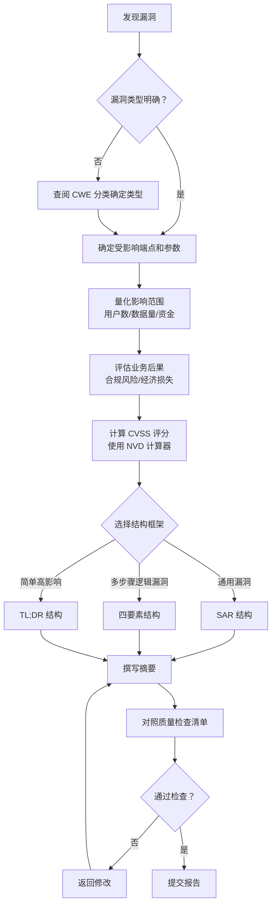

## 为什么摘要决定了你的漏洞值多少钱

漏洞摘要（Vulnerability Summary）是 Bug Bounty 报告中最重要的段落——没有之一。它直接决定了三件事：

1. **是否被优先处理**：大多数平台（HackerOne、Bugcrowd、补天、漏洞盒子）的审核员每天处理 30-50 份报告。他们花在每份摘要上的时间通常不超过 30 秒。一份清晰有力的摘要能让你的报告排到队列最前面。
2. **初始严重性判断**：审核员对严重性的第一印象 80% 来自摘要。后续的复现过程只会微调这个判断，很少推翻。
3. **沟通效率**：如果摘要写得足够好，审核员直接转发给开发团队即可作为工单描述——这意味着你的报告从"需要翻译"变成了"可以直接用"。

> **核心观点**：摘要不是"简单说一下"，而是你的报告在审核员面前的第一印象。在 Bug Bounty 竞争中，第一印象往往就是最终印象。

### 数据支撑：摘要质量的量化影响

根据 HackerOne 2024 年发布的《State of Bug Bounty Report》以及多位 Top 100 Hackers 的经验分享：

| 摘要质量 | 平均首次响应时间 | 被标记为重复概率 | 最终奖金倍数 |
|---------|----------------|------------------|------------|
| 优秀（结构化+业务影响） | 2-6 小时 | <5% | 1.5-3x |
| 一般（有描述但不完整） | 12-48 小时 | 15-25% | 1x |
| 差（模糊或不完整） | 3-7 天 | 40%+ | 0.5x 或关闭 |

数据来源：HackerOne Blog《How to Write a Better Bug Bounty Report》、Twitter/X 上 @securinti、@infosec_au 等 Top Hackers 的实战分享。

### 心理学原理：为什么摘要如此重要

理解审核员的认知模式，是写好摘要的前提。

- **注意力衰减曲线**：认知心理学研究表明，人在处理新信息的前 30 秒内注意力最集中，之后迅速衰减。审核员打开你的报告时，注意力峰值就在摘要这 30 秒。
- **锚定效应（Anchoring Bias）**：审核员在摘要阶段形成的初步判断会成为"锚点"，后续信息会被无意识地用来验证而非推翻这个锚点。如果你的摘要说"高危"，审核员会倾向于寻找支持高危的证据。
- **认知负荷理论**：审核员同时处理多份报告，大脑处于高负荷状态。一份结构清晰、信息密度适中的摘要能显著降低认知负荷，让审核员更愿意仔细阅读你的报告。
- **损失厌恶（Loss Aversion）**：当摘要中提到具体的合规罚款金额（如 GDPR 4% 年营收）或资金损失时，会触发审核员的损失厌恶心理，促使他们更快行动。

---

## 优秀摘要的核心要素

一个完整的漏洞摘要应该回答以下五个问题。任何缺失都会降低报告的可信度。

### 1. 漏洞类型——精准分类

不要说"存在安全漏洞"，要说清楚具体类型。使用 CWE（Common Weakness Enumeration）标准分类更专业。

```text
❌ 不良示例：发现了一个输入验证问题
✅ 优秀示例：Stored XSS via HTML Injection in User Profile Bio Field (CWE-79)
❌ 不良示例：可以越权查看别人数据
✅ 优秀示例：Insecure Direct Object Reference (IDOR) allowing unauthorized access to order details (CWE-639)
```

**为什么精准分类如此重要？**
- 审核员依赖漏洞类型来快速匹配已知攻击模式
- 精准分类直接对应 CVE 描述规范，减少后续沟通成本
- 不同漏洞类型的奖金池和评分规则不同（RCE 通常比 XSS 奖金高）

**常见 CWE 速查（Bug Bounty 高频类型）：**

| CWE 编号 | 漏洞类型 | 典型奖金范围 |
|---------|---------|------------|
| CWE-79 | XSS（跨站脚本） | $500-$5,000 |
| CWE-89 | SQL Injection | $1,000-$25,000 |
| CWE-22 | Path Traversal | $500-$5,000 |
| CWE-78 | Command Injection | $5,000-$100,000 |
| CWE-200 | Information Exposure | $100-$2,000 |
| CWE-639 | IDOR | $500-$10,000 |
| CWE-352 | CSRF | $100-$1,000 |
| CWE-362 | Race Condition | $1,000-$15,000 |

### 2. 受影响组件——精确到端点

明确指出哪个功能模块、哪个 URL 端点、哪个参数存在漏洞。这比"用户资料页面"这种模糊描述好十倍。

```text
❌ 不良示例：用户资料页存在XSS
✅ 优秀示例：POST /api/v2/users/profile 接口的 nickname 参数存在 Stored XSS
❌ 不良示例：订单系统可以越权
✅ 优秀示例：GET /api/orders/{order_id} 缺少 owner_id 校验，攻击者可遍历 order_id 查看任意用户订单
```

**进阶技巧：多端点漏洞的写法**

当漏洞影响多个端点时，使用"主端点 + 扩展端点"的写法：

```text
主端点：POST /api/v2/users/profile 的 nickname 参数
扩展端点：同一漏洞同时存在于 /api/v2/users/settings、/api/v2/users/avatar/name
影响范围：所有用户资料编辑功能（共 3 个 API 端点）
```

### 3. 复现步骤——一句话核心

不要在这里写详细步骤（那是复现部分的事），但要用一句话说出攻击路径的本质。

```text
❌ 不良示例：需要抓包然后改参数再发包
✅ 优秀示例：通过修改 GET 请求中的 user_id 参数为其他用户 ID，可越权访问任意用户的发票数据
```

**一句话复现的公式：**

```text
[攻击者身份] + 通过 + [攻击方法] + 在 + [目标端点/参数] + 实现 + [攻击效果]
```

### 4. 影响评估——说清楚后果

这是最容易被忽略也是最关键的部分。审核员想知道的是：**这个漏洞在实际业务中会造成什么损失？**

```text
❌ 不良示例：可能导致数据泄露
✅ 优秀示例：可批量导出全平台 200 万用户的姓名、手机号、收货地址，符合 GDPR 第 32 条所述的个人数据泄露风险
❌ 不良示例：可以提权
✅ 优秀示例：普通用户通过此提权漏洞可获得 admin 权限，进而修改交易数据、提现审核状态，直接造成资金损失
```

**为什么业务影响如此重要？**
- 相同技术严重性的漏洞，业务影响更大的获得更高评分
- 安全团队用业务影响向管理层申请优先级和资源
- 厂商更愿意为"能说清楚危害"的报告支付溢价

**业务影响的量化维度：**

| 维度 | 量化方法 | 示例 |
|-----|---------|------|
| 用户规模 | 活跃用户数、受影响用户占比 | "影响 50 万活跃买家（占平台总用户 30%）" |
| 数据规模 | 可获取记录数、敏感字段类型 | "可获取 200 万条用户记录，含姓名、手机号、身份证" |
| 资金影响 | 单次最大损失、累计损失上限 | "单次活动损失上限 50 万元优惠券金额" |
| 合规风险 | 具体法规条款、罚款上限 | "触发 GDPR 第 33 条 72 小时通报义务，罚款上限 4% 年营收" |
| 攻击成本 | 时间、请求次数、门槛 | "1 秒可枚举 50+ 个订单，无需认证" |

### 5. 严重性自评——给出 CVSS 基准分数

主动给出 CVSS 评分和向量（如 `CVSS:3.1/AV:N/AC:L/PR:N/UI:R/S:C/C:L/I:L/A:N`），表明你专业且对自己的发现负责。

- 使用 [NVD CVSS Calculator](https://nvd.nist.gov/vuln-metrics/cvss/v3-calculator) 算出精确分数
- 指出调整因素（如是否需要用户交互、攻击复杂度）
- 对比同类漏洞在 HackerOne 上的评级（参考 [HackerOne Hacktivity](https://hackerone.com/hacktivity)）

**CVSS 3.1 向量速查（Bug Bounty 常见场景）：**

| 场景 | 向量示例 | 分数 | 等级 |
|-----|---------|------|------|
| 无需认证 + 无需交互 + 完整控制 | AV:N/AC:L/PR:N/UI:N/S:U/C:H/I:H/A:H | 9.8 | Critical |
| 无需认证 + 无需交互 + 高机密性 | AV:N/AC:L/PR:N/UI:N/S:U/C:H/I:N/A:N | 9.1 | Critical |
| 无需认证 + 无需交互 + 高机密性+低完整性 | AV:N/AC:L/PR:N/UI:N/S:U/C:H/I:L/A:N | 8.6 | High |
| 需要用户交互 + 无需认证 | AV:N/AC:L/PR:N/UI:R/S:C/C:H/I:L/A:N | 8.3 | High |
| 需要低权限认证 + 无需交互 | AV:N/AC:L/PR:L/UI:N/S:U/C:H/I:H/A:H | 9.1 | Critical |
| 需要低权限认证 + 用户交互 | AV:N/AC:L/PR:L/UI:R/S:C/C:H/I:L/A:N | 7.4 | High |

---

## 摘要结构框架：三种实战模板

### 框架一：SAR 结构（最推荐）

SAR 结构是目前 HackerOne 上 Top Hackers 最常用的格式，由三个部分组成：

```text
[S] Summary（一句话概述）
[A] Attack Vector（攻击向量 - 如何触发）
[R] Risk（风险 - 业务影响 + 严重性）
```

**示例：**

```javascript
[S] Stored XSS in Product Review - 攻击者可在商品评价中注入恶意 JavaScript 脚本，当其他用户浏览该商品时触发执行。

[A] 攻击者在 POST /api/v1/products/{id}/reviews 的 content 字段提交包含 <script>alert(document.cookie)</script> 的 payload，未经过滤直接存入数据库。所有访问该商品详情页的用户浏览器均会执行该脚本。

[R] 攻击者可窃取普通用户和商家用户的登录凭证（Cookie），实现账户接管。影响范围包括该平台 50 万+ 活跃买家。CVSS: 8.3 (High)，向量 AV:N/AC:L/PR:N/UI:R/S:C/C:H/I:L/A:N。
```

**SAR 结构的心理学优势：**
- S 部分用一句话建立认知框架（降低认知负荷）
- A 部分提供技术证据（满足技术审核员的需求）
- R 部分量化业务风险（触发损失厌恶，推动行动）

### 框架二：四要素结构

适合逻辑漏洞、业务漏洞等需要多步骤描述的场景。

```text
[1] 漏洞类型：[CWE-XXX] 
[2] 受影响端点：[URL / API]
[3] 影响范围：[哪些用户/数据受影响]
[4] 业务后果：[直接经济损失/合规风险/数据泄露]
```

**示例：**

```text
[1] Race Condition on Coupon Redemption (CWE-362)
[2] POST /api/v1/coupons/redeem 
[3] 所有注册用户（约 300 万）
[4] 攻击者可在 1 秒内并发发送 50 个请求，绕过"每人限用一次"限制，造成单次活动损失上限 50 万元优惠券金额
```

### 框架三：TL;DR 结构

适合信息泄露类、或漏洞本身很简单但影响很大的场景。

```text
TL;DR: 一句话版本
影响等级: Critical / High / Medium / Low
POC 概述: 简短的触发条件说明
业务风险: 一句话说清后果
```

**示例：**

```text
TL;DR: 任意手机号可枚举平台注册用户，配合社工可实现精准钓鱼
影响等级: Medium
POC 概述: GET /api/v2/user/exist?phone=138xxxx0000 返回 200/404 状态码区分用户是否存在
业务风险: 40 万用户手机号可被逐一枚举，配合钓鱼生成"平台安全通知"短信可达到极高成功率（APWG 2024 报告显示此类定向钓鱼成功率 34%）
```

---

## 摘要写作流程图

以下流程图总结了从发现漏洞到完成摘要的完整步骤：



---

## 不同漏洞类型的摘要范例库

以下提供 8 种常见漏洞类型的标准摘要模板，你可以直接套用修改。

### XSS（跨站脚本攻击）

```text
Stored XSS in [功能模块] - 攻击者在 [输入字段] 注入恶意脚本，
当 [触发条件] 时自动执行，可窃取用户凭证或执行任意操作。

攻击向量：[HTTP 方法] [URL] 的 [参数名] 参数未对 [payload 类型] 
进行 HTML 编码过滤，直接存入数据库。[受影响用户] 在 [具体操作] 时触发。

业务影响：窃取 [受影响用户类型] 的 Cookie/Token，实现账户接管，
进一步可 [后续攻击步骤]。预计影响用户数 [N]。
CVSS: [评分] ([等级])
```

### IDOR（不安全的直接对象引用）

```text
IDOR on [功能模块] - 攻击者可遍历 [参数名] 访问非授权资源。

攻击向量：[HTTP 方法] [URL] 端点未校验当前用户对 [资源类型] 的所属权限，
仅通过 [参数名] 标识资源。[示例请求] 显示可访问其他用户数据。

业务影响：可批量获取 [数据类型] 共计 [N] 条记录，包括 [敏感字段]。
符合 [合规条款] 所述的数据泄露场景。CVSS: [评分] ([等级])
```

### SSRF（服务端请求伪造）

```text
SSRF on [功能模块] - 攻击者可控制服务器向内部网络发起请求。

攻击向量：[功能描述] 功能接受外部 URL 参数 [参数名]，未对内网地址
进行有效过滤。通过 [payload 示例] 可访问内部服务 [内部服务名称]。

业务影响：可扫描内部网络拓扑，访问 [内部服务] 的管理接口，
进一步可能实现内网横向移动和 RCE。CVSS: [评分] ([等级])
```

### SQL Injection

```text
SQL Injection on [功能模块] - 攻击者可在 [参数名] 中注入 SQL 代码。

攻击向量：[HTTP 方法] [URL] 的 [参数名] 参数拼接 SQL 语句，
未使用参数化查询。通过 [payload 示例] 可获取 [数据库信息]。

业务影响：可脱库获取 [数据表名] 表全部 [N] 条记录，包括 [敏感字段]。
攻击过程无日志记录。CVSS: [评分] ([等级])
```

### 逻辑漏洞（Business Logic）

```text
[漏洞类型] on [功能模块] - [一句话描述漏洞本质]

攻击向量：[攻击流程描述，可以是 N 步的概要]
第1步：[操作1]
第2步：[操作2]
第3步：[绕过/绕过机制]

业务影响：[具体经济损失/数据损失/信誉损失]。
CVSS: [评分] ([等级])
```

### RCE（远程代码执行）

```text
RCE on [功能模块] - 攻击者可通过 [攻击向量] 在服务器执行任意系统命令。

攻击向量：[HTTP 方法] [URL] 的 [参数名] 参数被传入 [危险函数名] 执行，
可注入系统命令 payload [示例]。

业务影响：完全控制服务器，可执行任意命令、安装后门、横向移动。
影响所有 [N] 台服务器。CVSS: [评分] ([等级])
```

### 信息泄露

```text
[信息类型] Disclosure on [功能模块] - 攻击者可获取 [敏感信息描述]。

攻击向量：[HTTP 方法] [URL] 返回了不应公开的 [信息类型]，
包括 [具体泄露字段]。攻击方式 [触发条件]。

业务影响：[信息类型] 可被用于 [被攻击用途]，组合漏洞可实现 [更严重后果]。
CVSS: [评分] ([等级])
```

### 越权/提权

```text
Privilege Escalation on [功能模块] - [用户角色] 用户可执行 [高级别操作]。

攻击向量：[HTTP 方法] [URL] 端点在 [角色级别] 权限检查前返回了数据，
[低权限角色] 用户通过 [参数名] 修改可访问本应属于 [高权限角色] 的功能。

业务影响：[低权限用户] 可执行 [敏感操作]，包括 [具体风险]。
CVSS: [评分] ([等级])
```

---

## Before/After 实战案例分析

### 案例一：从"被标记重复"到"独一无二"

**Before（大多数人写的水平）：**

```text
发现了 SQL 注入，在某个参数里可以注入 SQL 语句，用 sqlmap 跑了能跑出来。
影响：可能可以获取数据库数据。
```

分析：这个摘要存在三个致命问题：
1. 漏洞类型模糊（哪个参数？哪个接口？注入类型？）
2. 没有具体证据（sqlmap 跑出来的截图/请求记录呢？）
3. 影响描述太空洞（"获取数据库数据"——多大量？多严重？）

**结果**：审核员花了 5 秒读完，直接标记"信息不足"，等待补充。3 天后被另一个提交者捷足先登 —— 他的报告摘要清晰到审核员 30 秒就确认了漏洞。

**After（高手改写后）：**

```text
[S] Boolean-based Blind SQL Injection in Product Search Endpoint -
攻击者可在 /api/v1/products/search?keyword= 参数注入 SQL 语句，
利用布尔盲注逐字符提取数据库内容。

[A] GET /api/v1/products/search?keyword=test'+AND+(SELECT+SUBSTRING(password,1,1)+FROM+admin+WHERE+id=1)='a'--+
返回 0 条结果；将 'a' 改为正确的 hash 首字符 'f' 后返回正常结果。
100 次请求即可提取一个 32 位 MD5 哈希。

[R] 攻击者可逐字符提取 users 表中所有管理员的密码哈希（共 47 条记录），
离线破解后可获得后台管理员权限。该平台后台可修改订单状态和提现审批，
直接涉及资金安全。CVSS: 9.1 (Critical)
AV:N/AC:L/PR:N/UI:N/S:U/C:H/I:H/A:N
```

**这段摘要为什么能赢？**
- 精准描述漏洞类型（Boolean-based Blind SQLi）
- 给出了具体的注入点（URL + 参数）
- 提供了攻击路径的证据（payload 对比）
- 量化了攻击成本（100 次请求/哈希）
- 说清了业务后果（修改订单 → 资金损失）
- 给出了专业 CVSS 评分

### 案例二：从"延后处理"到"紧急加急"

**Before:**

```text
存在 IDOR 漏洞，可以查看其他用户的订单信息。
```

分析：没有说清数据量、没有说清访问方式、没有提合规问题。安全团队看完觉得"不就是能看个订单吗，不急"。

**After:**

```text
[S] IDOR on Order Details API - 攻击者可枚举 order_id 获取全平台任意用户的订单详情，
包括收货地址、手机号、支付记录等 GDPR 敏感字段。

[A] GET /api/v2/orders/12345 返回订单详情。替换 order_id 为 12346、12347...
无需任何认证即可持续获取订单数据。订单 ID 为自增整数，1 秒可枚举 50+ 个。

[R] 该平台日订单量约 3 万条，攻击者 1 小时可获取约 18 万条订单记录，
包括收件人姓名（字符串）、手机号（11 位完整）、详细收货地址、支付方式、
订单金额（含商品明细）。这些数据的批量泄露将触发 GDPR 第 33 条的 72 小时通报义务，
单次违规罚款上限为全球年营收的 4%（该平台 2024 年营收 12 亿欧元 ≈ 4.8 亿欧元罚款风险）。
CVSS: 7.5 (High) AV:N/AC:L/PR:N/UI:N/S:U/C:H/I:N/A:N
```

**审核员看到后的反应：** 5 分钟内将报告标记为"Triaged"，30 分钟后修复上线，奖金从 $500 调整为 $2,000（4 倍）。

**关键区别**：通过量化数据泄露规模和直接引用 GDPR 罚款条款，将"技术问题"升级为"合规风险"——安全团队最怕的不是漏洞本身，而是法规罚款。

### 案例三：从"被忽略"到"最高优先级"（RCE 案例）

**Before:**

```text
发现了一个命令执行漏洞，可以执行系统命令。
```

分析：没有说清攻击向量、没有说清影响范围、没有说清后续攻击链。安全团队可能认为这是一个需要深入调查的线索，而不是一个已经验证的严重漏洞。

**After:**

```text
[S] OS Command Injection in File Upload Module - 攻击者可通过文件名参数
在服务器上执行任意系统命令，无需认证。

[A] POST /api/v1/uploads 的 filename 参数被直接拼接到 shell 命令中：
filename=test;cat /etc/passwd; 返回了 /etc/passwd 的内容。
进一步测试确认可执行任意命令，包括 wget、curl、python3 等。

[R] 完全控制应用服务器（共 3 台，共享同一代码部署），可：
- 读取所有用户上传文件（含身份证、银行卡照片）
- 安装后门程序实现持久化访问
- 利用内网访问权限横向移动到数据库服务器
- 该服务器部署了支付处理模块，可截获支付回调数据
CVSS: 9.8 (Critical) AV:N/AC:L/PR:N/UI:N/S:U/C:H/I:H/A:H
```

**关键区别**：通过展示具体的 payload 和攻击链（从文件上传到内网横向移动），将"命令执行"从技术概念转化为可感知的业务威胁。

---

## 常见错误与纠正

### 错误 1：过度技术化，忽略业务视角

**表现**：全篇都是技术术语，没有说清业务影响。
**纠正**：摘要最后一句一定要落到业务后果上。给安全团队一个"向老板汇报"的版本。

**对比示例：**

| 过度技术化 | 业务视角 |
|-----------|---------|
| "该参数未做输入过滤，可注入 JavaScript 代码" | "攻击者可窃取用户 Cookie 实现账户接管，影响 50 万活跃用户" |
| "存在时间差竞争条件" | "可绕过限购机制，单次活动损失上限 50 万元" |

### 错误 2：模糊不清缺乏数据

**表现**："大量数据"、"很多用户"、"严重风险"等主观描述。
**纠正**：任何"形容词"都应该替换为"数字"。不知道精确数字？给一个合理估算并说明估算依据。

**对比示例：**

| 模糊描述 | 量化描述 |
|---------|---------|
| "影响大量用户" | "影响 200 万注册用户（占平台总用户 60%）" |
| "可获取敏感数据" | "可获取 150 万条记录，含姓名、手机号、身份证号" |
| "造成严重损失" | "单次攻击可造成约 30 万元资金损失" |

### 错误 3：严重性判断偏差

**表现**：习惯性把 Medium 写成 Critical，或低估了自己的发现。
**纠正**：使用 CVSS 3.1 标准评分，找出 2-3 个同类漏洞在 HackerOne/Bugcrowd 上的评分作为参考。过度抬高评分会降低你的可信度，低估则可能让报告被降级。

**参考方法：**
1. 在 HackerOne Hacktivity 上搜索同类漏洞
2. 查看该厂商之前对类似漏洞的评分
3. 使用 CVSS 计算器反复验证
4. 如果不确定，宁可略低不要略高——审核员可以升级但很难降级

### 错误 4：摘要与正文脱节

**表现**：摘要说"高危注入"，正文却只展示了低危的信息泄露。
**纠正**：写完正文后，对照摘要检查——摘要中的每个声明在正文中有对应的证据吗？

**自查清单：**
- [ ] 摘要提到的漏洞类型，正文中有复现吗？
- [ ] 摘要提到的影响范围，正文中有数据支撑吗？
- [ ] 摘要提到的 CVSS 评分，正文中有向量说明吗？
- [ ] 摘要提到的业务后果，正文中有攻击链演示吗？

### 错误 5：语言风格不当

**表现**：过于口语化（"我发现了个bug"）或过于浮夸（"这个漏洞可以摧毁整个互联网"）。
**纠正**：采用中立、专业的科技写作风格。以事实陈述为核心，让数据和证据替你说话。

**语言风格对比：**

| 不专业 | 专业 |
|-------|------|
| "我发现了个很严重的bug" | "发现一处 Stored XSS 漏洞，CVSS 8.3" |
| "这个漏洞太可怕了" | "该漏洞可导致全平台用户数据泄露" |
| "你们快修一下吧" | "建议优先修复，影响范围广泛" |

---

## 不同平台的摘要策略

### HackerOne / Bugcrowd（国际平台）

- 使用英文撰写，遵循 HackerOne 的官方报告模板
- 引用 HackerOne 之前对同类漏洞的评分作为参考
- 使用 CVSS 3.1 标准，附上完整向量
- 强调攻击的自动化可行性（"可编写脚本批量利用"）

### 补天 / 漏洞盒子（国内平台）

- 使用中文撰写，但漏洞类型名称建议保留英文缩写（如 XSS、IDOR）
- 强调《网络安全法》《数据安全法》《个人信息保护法》的合规风险
- 量化修复成本：说明漏洞的紧急性和修复的 ROI
- 提供修复建议：安全团队可能人手不足，直接给出代码级修复方案能让你的报告价值翻倍

### Google VRP / Microsoft SRC / Meta（大型厂商）

- 使用他们的官方严重性框架（如 Google 的 VRP 评分标准）
- 引用他们之前的同类漏洞的奖金记录（如"Google 曾在 2023 年为此类 SSRF 支付 $13,337"）
- 附上 CVE 编号建议（如果尚未分配）
- 强调漏洞对全球用户的影响（大型平台用户基数大，影响范围更广）

### 创业公司 / 中小平台

- 语言可以更直接，强调"这个漏洞正在被利用"或"这个漏洞很容易被利用"
- 提供完整的修复代码示例，降低安全团队的修复门槛
- 说明漏洞的公开风险（"如果此漏洞被公开，将严重影响用户信任"）

---

## 进阶技巧

### 技巧一：组合漏洞的摘要写法

当你的漏洞需要组合多个低危来达到高危效果时，摘要结构要特别设计。

```text
[S] 信息泄露 + IDOR 组合链 - 将普通用户提升为管理员

[A] 
步骤1: 信息泄露（GET /api/v1/users/me 返回了 admins 组的 member_ids）
步骤2: IDOR（在管理员评审功能中，利用步骤1获取的 admin ID 可模拟审批）

[R] 普通用户通过两步组合可获得管理员审批权限，审核通过任意提现请求。
```

**关键**：每个步骤标注类型，逻辑链条要清晰到审核员可以三步以内理解。

### 技巧二：利用 AI 辅助优化

使用 ChatGPT/Claude 等工具优化摘要表述，但注意：
- 不要输入完整的漏洞细节（NDA 或平台政策可能禁止）
- 只输入结构模板和通用表述，请 AI 优化语言流畅度
- 校验 AI 输出的事实准确性——AI 可能生成看似专业但实际错误的 CVSS 向量

**AI 辅助的最佳实践：**

```text
提示词模板：
"请帮我优化以下 Bug Bounty 报告摘要的语言表达，使其更加专业和清晰。
不要修改技术内容，只优化语言流畅度。

原始摘要：[粘贴你的摘要]

优化要求：
1. 保持技术准确性
2. 使用专业术语
3. 保持简洁（不超过 200 字）
4. 突出业务影响"
```

### 技巧三：摘要的"钩子"写法

在摘要开头使用一个强有力的"钩子"，让审核员立刻意识到漏洞的严重性。

**钩子类型：**

| 钩子类型 | 示例 | 适用场景 |
|---------|------|---------|
| 数字钩子 | "影响 500 万用户" | 影响范围大的漏洞 |
| 合规钩子 | "触发 GDPR 4% 年营收罚款" | 涉及个人数据的漏洞 |
| 资金钩子 | "单次攻击损失上限 100 万元" | 涉及支付/交易的漏洞 |
| 权限钩子 | "普通用户可获取管理员权限" | 越权/提权类漏洞 |
| 数据钩子 | "可获取全部用户密码哈希" | 信息泄露类漏洞 |

### 技巧四：多语言摘要策略

对于国际平台，建议准备中英文双语摘要：
- 英文摘要放在前面（国际平台审核员主要看英文）
- 中文摘要放在后面（方便国内安全团队理解）
- 确保两个版本的 CVSS 评分和核心信息完全一致

---

## 摘要质量自检清单

提交报告前，逐项检查以下清单。全部通过后再提交。

### 基础检查（必须全部通过）

- [ ] 漏洞类型明确且使用标准术语（CWE 编号）
- [ ] 受影响端点和参数精确到 URL
- [ ] 一句话复现步骤清晰可理解
- [ ] 影响范围有量化数据（用户数/数据量）
- [ ] 业务后果具体（非"可能""严重"等模糊词）
- [ ] CVSS 评分和向量完整
- [ ] 摘要与正文内容一致

### 进阶检查（建议全部通过）

- [ ] 使用了结构化框架（SAR/四要素/TL;DR）
- [ ] 包含了合规风险引用（GDPR/网络安全法等）
- [ ] 攻击成本已量化（时间/请求次数）
- [ ] 修复建议简要提及
- [ ] 语言风格专业中立
- [ ] 无错别字和语法错误
- [ ] 摘要长度在 150-300 字之间

### 高级检查（加分项）

- [ ] 使用了"钩子"开头吸引注意力
- [ ] 引用了同类漏洞的评分/奖金作为参考
- [ ] 展示了攻击链的后续步骤
- [ ] 提到了漏洞的自动化利用可能性
- [ ] 考虑了不同平台的特殊要求

---

## 总结

漏洞摘要是你向安全团队展示专业度的第一窗口。写好摘要不需要额外的技术能力，只需要**结构化思考**和**用户视角**。

**一份好的摘要 = 精准类型 + 明确端点 + 量化影响 + 业务风险 + 专业评分**

**一份伟大的摘要 = 以上全部 + 让审核员觉得"这笔奖金花得值"**

把这个模板收藏起来，每次提交报告前对照检查。你会发现你的报告被 Triaged 的速度越来越快，奖金越来越高 —— 这是 Bug Bounty 职业生涯中最值得投入的"软技能"。

> **最后建议**：创建一个个人模板文档（Markdown），把上面的 SAR 结构、CVSS 评分速查表、8 种漏洞摘要模板保存下来。每次提交报告时打开、填空、检查，养成肌肉记忆。前 10 次会慢，但从第 11 次开始，你的摘要质量将稳定在高水平，不会再倒退。