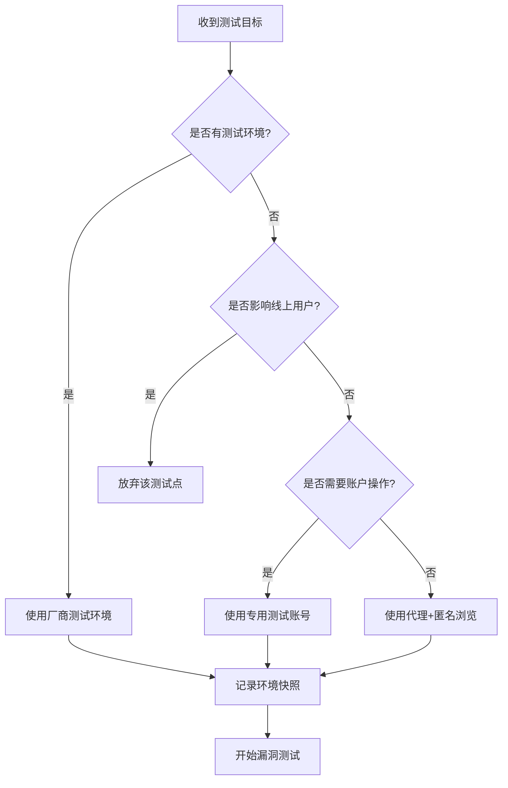
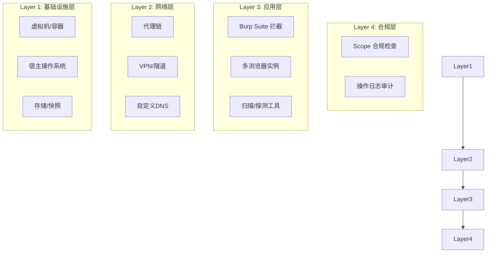

## 概述

环境信息是 Bug Bounty 测试的基础设施层，也是区分业余与专业猎手的分水岭。一个配置不当的环境会导致四类严重后果：**漏报**（因工具配置问题错过真实漏洞）、**误报**（将环境特性当作漏洞提交，浪费评审时间并损害信誉）、**IP/账号被封**（触发目标的反爬或风控机制）、**法律风险**（测试流量泄露到未授权范围）。

本章从道法术器四个层面，系统性地讲解如何搭建一个专业、高效、安全的 Bug Bounty 测试环境。

| 层次 | 对应内容 | 核心目标 |
|------|---------|---------|
| **道** | 合规意识、授权边界、隐私保护原则 | 知道什么能做、什么不能做 |
| **法** | 环境架构设计、隔离策略、分层管理 | 建立系统化的环境管理方法论 |
| **术** | 具体配置步骤、工具操作、排错技巧 | 把每一个环境组件配置到位 |
| **器** | 工具链选型、自动化脚本、容器化部署 | 用对的工具提升效率 |

---

## 一、测试环境的分类与定位

理解不同的测试环境类型及其适用场景，是搭建环境的起点。

### 1.1 测试环境三大类型

| 类型 | 定义 | 适用场景 | 风险等级 |
|---|---|---|---|
| **本地靶场** | 本机或虚拟机运行的可控环境（DVWA、vulhub、WebGoat） | 学习新技术、验证 PoC、练习工具操作 | 无风险 |
| **授权测试环境** | 目标厂商提供的测试/预发布环境，或已授权的生产子域名 | 正式 Bug Bounty 测试 | 中等（需遵守 SOW） |
| **在线训练平台** | HackTheBox、PortSwigger Academy、PentesterLab 等 | 技能训练、CTF、技术验证 | 低 |

**重要原则**：绝不在未授权的目标上使用攻击性工具。Bug Bounty 的第一条铁律是 **先授权，后测试**。

### 1.2 环境定位图

以下流程图展示了一个典型 Bug Bounty 测试工作的环境决策路径：



### 1.3 环境分层架构

一个成熟的 Bug Bounty 环境应包含以下分层，每层职责明确、互不干扰：



---

## 二、浏览器环境配置（核心层）

浏览器是 Bug Bounty 猎手最常用的攻击界面。80% 以上的 Web 漏洞测试直接在浏览器中进行。浏览器环境的配置质量直接决定了测试的效率和安全性。

### 2.1 多浏览器策略

单一浏览器无法满足 Bug Bounty 的多元化需求。推荐至少配置三个独立浏览器：

| 浏览器 | 用途 | 核心配置 |
|---|---|---|
| **Chrome（主力）** | 日常测试、XSS/CSRF 探测 | 配合 Burp Suite 代理 |
| **Firefox（开发版）** | JavaScript 调试、WebSocket 分析 | 开箱即用的开发者工具 |
| **Chromium（隔离）** | Cookie/Session 隔离测试 | 无痕模式 + 独立用户数据目录 |

**关键配置项**：

```bash
# Chrome 专用测试启动命令（Windows CMD）
"C:\Program Files\Google\Chrome\Application\chrome.exe" ^
  --user-data-dir="D:\bounty-profiles\chrome-test" ^
  --proxy-server="127.0.0.1:8080" ^
  --disable-extensions-except="path-to-burp-extension" ^
  --disable-features=PasswordImport,CredentialManager

# Linux/Git Bash 同理
google-chrome \
  --user-data-dir=/opt/bounty-profiles/chrome-test \
  --proxy-server="127.0.0.1:8080"
```

**为什么必须使用单独的 user-data-dir？**

默认的 Chrome 配置加载了个人书签、密码管理器、登录状态、扩展程序等信息。这些信息会：
1. **干扰测试结果**：自动填充的凭据可能导致错误的测试结论
2. **泄露个人账号**：测试中的脚本可能读取到你的个人 Cookie
3. **影响代理配置**：部分扩展会覆盖代理设置
4. **浏览器指纹污染**：你个人的浏览历史、字体列表、扩展列表都会构成独特的指纹特征

### 2.2 必备浏览器扩展

| 扩展名称 | 用途 | 安装来源 |
|---|---|---|
| **Burp Suite CA 证书** | HTTPS 流量解密 | Burp Suite → Proxy → Options → Import/Export CA certificate |
| **Cookie-Editor** | 查看/编辑/删除 Cookie | Chrome Web Store |
| **HackBar** | 请求重放/参数构造 | Firefox 附加组件商店 |
| **Wappalyzer** | 技术栈识别 | Chrome Web Store |
| **FoxyProxy** | 快速切换代理模式 | Chrome Web Store |
| **EditThisCookie** | Cookie 管理（备选） | Chrome Web Store |
| **User-Agent Switcher** | 模拟不同设备/浏览器 | Chrome Web Store |
| **React Developer Tools** | React 应用调试（发现隐藏组件） | Chrome Web Store |

**安装认证流程**（以 Burp Suite CA 为例）：

```text
1. 启动 Burp Suite → Proxy → Options
2. 导出 CA 证书（DER 格式）
3. Chrome 访问 chrome://settings/security → 管理证书
4. 导入 → 选择证书文件 → 勾选"信任此证书颁发机构"
5. 验证：访问 https://burpsuite 应显示 Burp Suite 欢迎页面
```

**注意**：Firefox 使用独立的证书存储，需要在 Firefox 的 证书管理器 → 证书颁发机构 中单独导入。两个浏览器的证书导入是独立操作。

### 2.3 Session 隔离方案

测试中需要模拟多个用户角色（攻击者、受害者、管理员）时，Session 隔离是关键。隔离不到位会导致角色混淆——你以为在测试越权访问，实际是测试者自己的 Cookie 泄露到了另一个会话。

**方案一：多 Chrome 配置文件（推荐）**

```bash
# 创建三个独立配置文件
chrome --user-data-dir="D:\bounty-profiles\attacker"
chrome --user-data-dir="D:\bounty-profiles\victim"
chrome --user-data-dir="D:\bounty-profiles\admin"

# 每个窗口独立 Cookie/Session/LocalStorage
```

**方案二：Firefox 多容器（Container Tab）**

Firefox 的 Multi-Account Containers 扩展支持在同一浏览器窗口内创建隔离的标签页容器。每个容器拥有独立的 Cookie、Storage 和 Service Worker。优点是可以在同一个窗口内快速切换角色，适合需要频繁对比测试的场景。

**方案三：多浏览器实例**

Chrome（攻击者视角）+ Firefox（受害者视角）+ Edge（管理员视角），三个浏览器同时打开，互不干扰。适合需要同时观察多个角色行为的复杂业务逻辑测试（如越权、竞态条件）。

**方案四：虚拟容器（高级）**

使用 Docker + noVNC 为每个角色运行一个完整的浏览器容器，实现操作系统级别的隔离：

```yaml
# docker-compose.yml — 浏览器容器隔离
version: '3.8'
services:
  browser-attacker:
    image: kasmweb/chrome:1.15.0
    ports:
      - "6901:6901"
    environment:
      - VNC_PASSWORD=attacker123
    shm_size: '2g'
  
  browser-victim:
    image: kasmweb/chrome:1.15.0
    ports:
      - "6902:6901"
    environment:
      - VNC_PASSWORD=victim123
    shm_size: '2g'
```

每个容器拥有独立的网络栈、浏览器指纹和存储——这是最彻底的隔离方案。

### 2.4 浏览器指纹防御

浏览器指纹（Browser Fingerprinting）是网站追踪用户的核心技术。即使你使用了代理和 VPN，如果浏览器指纹不变，目标的反欺诈系统仍然可以关联你的多次测试行为。

| 指纹维度 | 暴露信息 | 防御措施 |
|---|---|---|
| **Canvas Fingerprint** | 通过 `<canvas>` 渲染结果生成唯一哈希 | Firefox RFP 自动随机化；Chrome 安装 CanvasBlocker |
| **WebGL Fingerprint** | GPU 型号、驱动版本、渲染结果 | Firefox RFP；或使用 `webgl.disabled=true` |
| **AudioContext Fingerprint** | 音频处理管线的微妙差异 | 安装 AudioContextPoison 或使用 Firefox RFP |
| **Font List** | 系统安装的字体列表 | Firefox RFP 限制返回值；或精简系统字体 |
| **Navigator 属性** | CPU 核心数、内存大小、语言、插件列表 | Firefox RFP 统一为固定值 |
| **TLS 指纹 (JA3/JA4)** | TLS 握手参数暴露浏览器类型 | 使用 curl-impersonate 模拟浏览器 TLS 握手 |
| **HTTP/2 指纹 (JA3H)** | HTTP/2 帧设置模式 | 使用浏览器本身（非代理工具）发送请求 |

**推荐配置**：

```bash
# Firefox 隐私增强配置（about:config）
privacy.resistFingerprinting = true        # 启用 RFP
privacy.resistFingerprinting.pbmode = true  # 隐私模式也生效
media.peerconnection.enabled = false        # 禁用 WebRTC 防 IP 泄露
geo.enabled = false                         # 禁用地理位置
dom.event.clipboardevents.enabled = false   # 禁用剪贴板事件追踪
```

---

## 三、操作系统与虚拟化环境

### 3.1 操作系统选择

| 系统 | 优势 | 劣势 | 推荐指数 |
|---|---|---|---|
| **Kali Linux** | 预装 600+ 安全工具、滚动更新 | 不适合日常使用 | ★★★★★ |
| **Parrot OS** | 轻量级、隐私保护强 | 社区较小 | ★★★★☆ |
| **Ubuntu/Debian** | 稳定、文档丰富 | 需手动安装工具 | ★★★★☆ |
| **Windows 11 + WSL2** | 图形工具支持好、NV 显卡驱动完善 | 增加复杂度 | ★★★☆☆ |
| **macOS** | Unix 底层、稳定性好 | 部分工具不支持 | ★★★☆☆ |

**推荐方案**：Windows 11 作为宿主机（运行 Burp Suite 等带 GUI 的工具）+ Kali Linux VM（运行扫描器、PoC 开发）+ WSL2（轻量级脚本执行）。

**为什么推荐混合架构？**

- Burp Suite Pro 在 Windows/macOS 上体验最佳（GPU 加速渲染、原生 UI）
- 扫描器（Nuclei、ffuf）在 Linux 上性能更好（文件系统更快、内存管理更高效）
- WSL2 提供了介于两者之间的折中方案：Windows 的 GUI + Linux 的命令行生态

### 3.2 虚拟机配置参数

```yaml
# Vagrant 配置示例（Vagrantfile）
Vagrant.configure("2") do |config|
  config.vm.box = "kalilinux/rolling"
  config.vm.hostname = "bounty-kali"
  
  # 内存与 CPU
  config.vm.provider "virtualbox" do |vb|
    vb.memory = "4096"    # 至少 4GB
    vb.cpus = 2            # 至少 2 核
    vb.gui = false         # 无头模式节省资源
  end
  
  # 网络配置：NAT + Host-Only
  config.vm.network "private_network", ip: "192.168.56.101"
  
  # 共享目录（代码/PoC 同步）
  config.vm.synced_folder "D:/bounty/workspace", "/workspace"
end
```

**虚拟机性能调优要点**：
- **NAT + Host-Only 双网卡**：NAT 用于访问外网（扫描目标），Host-Only 用于宿主机与 VM 之间的文件传输和调试
- **内存分配**：Kali VM 至少 4GB（Nuclei 全线程扫描时内存占用可达 2-3GB），如果同时运行 Metasploit 则建议 8GB
- **磁盘格式**：使用 VDI/VMDK 动态分配，避免一次性占用全部磁盘空间

### 3.3 快照管理策略

VM 快照是 Bug Bounty 测试的"后悔药"：

| 快照节点 | 创建时机 | 恢复场景 |
|---|---|---|
| **基线快照** | 系统安装完成 + 基础工具安装后 | 工具被污染、配置损坏 |
| **项目快照** | 针对特定厂商开始测试前 | 需要快速切换到不同项目 |
| **工具链快照** | 安装新工具/更新依赖后 | 新工具导致冲突无法回退 |

**最佳实践**：
- 至少保留 3 个快照层级（基线→项目→工具），并标注创建日期和包含的工具清单
- 定期清理超过 30 天的项目快照，避免磁盘空间膨胀
- 使用快照命名规范：`YYYYMMDD-工具版本-用途描述`，例如 `20260601-nuclei3.2.1-base-tools`

---

## 四、代理与网络配置

### 4.1 代理层级架构

有效的代理配置应该是多层级的，而非单一代理：

```text
┌─────────────────────────────────────────────┐
│              浏览器 / 终端                     │
├─────────────────────────────────────────────┤
│          第一层：Burp Suite（拦截代理）        │
│  监听 127.0.0.1:8080，拦截/修改 HTTP/HTTPS   │
├─────────────────────────────────────────────┤
│          第二层：上游代理（匿名代理）           │
│  监听 127.0.0.1:8888，匿名化真实 IP           │
├─────────────────────────────────────────────┤
│          第三层：VPN / Tor（出口节点）         │
│  出口 IP 变换，规避 IP 封禁                   │
└─────────────────────────────────────────────┘
```

**为什么需要多层代理？**

每一层解决不同的问题：
- **第一层（Burp）**：提供请求拦截和修改能力，但会暴露本地 IP
- **第二层（上游代理）**：将 Burp 的流量转发到匿名代理，隐藏真实 IP
- **第三层（VPN/Tor）**：作为最终出口，提供 IP 变换和加密隧道

### 4.2 Burp Suite 代理配置

```bash
# Burp Suite 启动配置
java -jar burpsuite_pro.jar \
  -Xmx4g \                    # JVM 堆内存 4GB
  -Djavax.net.ssl.trustStore=burp-cacerts \
  --collaborator-server=collaborator.burp.net

# 浏览器代理设置（通过 FoxyProxy 自动切换）
# 模式 A: Burp 拦截（127.0.0.1:8080）→ 正常测试
# 模式 B: 无代理 → 浏览搜索结果/正常访问
# 模式 C: SOCKS5（127.0.0.1:1080）→ 需要匿名时
```

**Burp Suite 配置优化**：
- **Scope 设置**：在 Target → Scope 中精确配置只允许目标域名，避免 Burp 捕获无关请求（如浏览器自动请求的 Google Analytics）
- **Session Handling Rules**：配置自动登录规则，防止测试过程中 Session 过期
- **Project Options → HTTP History**：设置只保留 5000 条历史记录，避免项目文件过大导致卡顿

### 4.3 IP 管理与轮换策略

Bug Bounty 平台（HackerOne、Bugcrowd）和部分厂商会监控请求来源。频繁的 IP 轮换可能导致账号被封。

| 使用场景 | 推荐方案 | 注意事项 |
|---|---|---|
| 日常浏览/侦察 | 家用宽带 IP | 无需代理 |
| 主动扫描 | 住宅代理（Residential Proxy） | 每次扫描使用不同 IP |
| PoC 验证 | 固定代理 IP | 保持测试连续性 |
| 多账号操作 | 每账号独立代理 | 避免账号关联 |
| 高风险测试 | Tor 出口节点 | 可能被 WAF 拦截，需配合降速 |

**代理工具推荐**：

| 工具 | 类型 | 价格 | 适用场景 |
|---|---|---|---|
| **Bright Data** | 住宅代理 | $15/GB | 大规模扫描 |
| **Smartproxy** | 住宅 + 数据中心 | $10/月起步 | 中小规模 |
| **ScrapingBee** | API 代理 | $49/月起 | API 友好 |
| **Proxychains-ng** | 终端代理 | 免费 | Linux 命令行 |
| **proxychains4 + Tor** | 匿名代理 | 免费 | 高匿名需求 |

**IP 轮换的实操建议**：
- 使用 Proxychains-ng 配合 Tor 可以实现自动 IP 轮换：编辑 `/etc/proxychains4.conf`，将 `strict_chain` 改为 `random_chain`，并添加多个 Tor 出口节点
- 住宅代理适合需要维持 session 一致性的测试场景（如 OAuth 流程测试），因为同一 IP 能保持较长时间的连接稳定性
- 避免在同一 IP 上同时运行多个扫描任务——目标的 WAF 会将短时间内大量请求视为攻击行为

### 4.4 VPN 配置要点

VPN 不是匿名的万能方案，但它是基础保护层：

1. **选择无日志 VPN**：Mullvad、ProtonVPN、IVPN
2. **启用 Kill Switch**：VPN 断开时自动切断网络
3. **使用 WireGuard 协议**：比 OpenVPN 更快、更安全
4. **分线路由**：Burp 流量走 VPN，本地流量走直连
5. **不要同时使用 Tor + VPN**：这不是更安全，而是更慢且容易被标记

**分线路由配置**（以 WireGuard 为例）：

```ini
# /etc/wireguard/wg0.conf
[Interface]
PrivateKey = <your-private-key>
Address = 10.0.0.2/32
DNS = 1.1.1.1

[Peer]
PublicKey = <server-public-key>
Endpoint = vpn-server.example.com:51820
AllowedIPs = 0.0.0.0/0         # 全局流量走 VPN
PersistentKeepalive = 25
```

配合策略路由只让 Burp 的流量走 VPN：

```bash
# 创建路由表
echo "100 burp-vpn" >> /etc/iproute2/rt_tables

# 标记 Burp 端口的流量
iptables -t mangle -A OUTPUT -p tcp --dport 8080 -j MARK --set-mark 0x1

# 走 VPN 路由
ip rule add fwmark 0x1 table burp-vpn
ip route add default via 10.0.0.1 dev wg0 table burp-vpn
```

### 4.5 DNS 配置

DNS 泄露会暴露你的真实位置，即使使用了 VPN 也可能被发现。配置安全的 DNS 解析是环境安全的重要一环。

| DNS 协议 | 端口 | 加密方式 | 推荐场景 |
|---|---|---|---|
| **DNS-over-HTTPS (DoH)** | 443 | TLS 加密 | 浏览器环境 |
| **DNS-over-TLS (DoT)** | 853 | TLS 加密 | 系统级配置 |
| **DNSCrypt** | 443 | 加密协议 | 需要更多控制时 |

```bash
# Linux 系统级 DoH 配置（使用 systemd-resolved）
# /etc/systemd/resolved.conf
[Resolve]
DNS=1.1.1.1#cloudflare-dns.com 9.9.9.9#dns.quad9.net
DNSOverTLS=yes
DNSSEC=yes

# 重启生效
sudo systemctl restart systemd-resolved
```

---

## 五、测试账号管理

### 5.1 账号分层体系

```text
第一层：主账号（1个）
  ├── 用于 Bug Bounty 平台注册（HackerOne/Bugcrowd）
  ├── 接收漏洞报告通知
  └── 绑定二次验证（2FA）

第二层：通用测试账号（3-5个）
  ├── 用于常规漏洞测试
  ├── attacker / victim / admin 角色
  └── 每个账号使用不同的邮箱域名

第三层：专项账号（按需创建）
  ├── 针对特定厂商注册
  ├── 使用临时邮箱（如 10minutemail、mail.tm）
  └── 测试完成后可废弃
```

### 5.2 账号创建工具

| 工具/服务 | 用途 | 是否免费 | 推荐指数 |
|---|---|---|---|
| **Temp-Mail API** | 编程化创建临时邮箱 | 部分免费 | ★★★★★ |
| **Mail.tm** | 临时邮箱 API | 免费 | ★★★★☆ |
| **Guerrilla Mail** | 一次性邮箱 | 免费 | ★★★☆☆ |
| **Firefox Relay** | 邮箱别名转发 | 基础免费 | ★★★★☆ |
| **SimpleLogin** | 自定义域名别名 | 自建免费 | ★★★★★ |
| **AnonAddy (addy.io)** | 邮箱别名 + 自定义域名 | 基础免费 | ★★★★☆ |

### 5.3 账号安全最佳实践

1. **密码策略**：使用 Bitwarden / 1Password 生成并管理测试账号密码，每个账号独立密码（12位+大小写+数字+符号）
2. **双因素认证**：优先使用 TOTP（Authenticator App），避免短信验证码被拦截
3. **邮箱分离**：测试账号使用独立的邮箱提供商（ProtonMail / Tutanota），不要使用日常邮箱注册
4. **密码回收**：测试完成的账号修改密码并关闭，防止被后续测试者利用
5. **关联风险**：不要使用同一设备同时登录个人账号和测试账号——浏览器指纹可被用于关联
6. **登录时间**：避免在非工作时间（如凌晨）集中登录多个测试账号，这是风控系统的常见触发条件
7. **User-Agent 一致性**：每个测试账号对应固定的 User-Agent，不要在同一账号下频繁切换

### 5.4 账号管理工具

使用密码管理器统一管理测试账号，避免凭据混乱：

```bash
# 使用 Bitwarden CLI 管理测试账号（安装）
npm install -g @bitwarden/cli

# 登录
bw login

# 创建测试账号条目
bw create item login \
  --name "TestVictim@target.com" \
  --login.username "testvictim@target.com" \
  --login.password "$(bw generate -puln 20)" \
  --login.uris '[{"uri":"https://target.com"}]' \
  --folderId "$(bw list folders | jq -r '.[] | select(.name=="Bug Bounty") | .id')"
```

---

## 六、数据收集与取证环境

### 6.1 屏幕截图配置

高质量的截图是漏洞报告的重要组成部分：

```yaml
截图工具配置清单:
  - 工具: Greenshot（Windows） / Flameshot（Linux） / Snipaste（全平台）
  - 格式: PNG（无损，不上传带 EXIF 的 JPEG）
  - 分辨率: 1920×1080 或更高
  - 标注: 红框标出漏洞位置，箭头指示攻击路径
  - 隐私: 截图前自动模糊个人数据（邮箱、IP、Session ID）
```

**截图铁律**：
- 每张截图必须包含浏览器地址栏（证明 URL 路径）
- 关键截图使用红色矩形标注漏洞发生位置
- 不要在截图中暴露个人身份信息
- 如需标注文字，使用数字编号而非直接写"漏洞在这里"
- 截图时关闭无关的浏览器标签页和通知弹窗
- 对于敏感数据，使用马赛克工具（如 `convert` 命令或 GIMP）进行脱敏处理

**批量截图脱敏脚本**：

```bash
#!/bin/bash
# blur-sensitive.sh — 批量模糊截图中的敏感区域
# 用法: ./blur-sensitive.sh screenshot.png "x,y,w,h"

INPUT="$1"
REGION="$2"  # 格式: x,y,width,height

if [ -z "$INPUT" ] || [ -z "$REGION" ]; then
  echo "用法: $0 <input.png> <x,y,w,h>"
  exit 1
fi

# 使用 ImageMagick 模糊指定区域
convert "$INPUT" \
  -region "$REGION" -blur 0x15 \
  -region "$REGION" -swirl 360 \
  "${INPUT%.png}-redacted.png"

echo "已保存: ${INPUT%.png}-redacted.png"
```

### 6.2 请求日志保存

推荐日志保存结构：

```text
D:/bounty/HackerOne/company-name/
├── 01-recon/
│   ├── subdomains.txt
│   ├── endpoints.json
│   └── screenshot/
├── 02-exploit/
│   ├── burp-session/
│   ├── curl-commands.txt
│   └── poc.py
├── 03-evidence/
│   ├── screenshots/
│   ├── requests/
│   └── responses/
└── 04-report/
    ├── report-draft.md
    ├── timeline.txt
    └── references/
```

**日志记录要点**：
- 每个请求保存完整的请求头和响应体（包括 Set-Cookie 和 Location 头）
- 使用时间戳命名日志文件：`20260626-143052-xss-attempt.txt`
- 对于关键请求，同时保存 Burp 的 HAR 格式导出（用于后续分析和报告附录）

### 6.3 Burp Suite 项目管理

每个厂商创建独立的 Burp Suite 项目文件：

```bash
# 创建项目文件
java -jar burpsuite_pro.jar \
  --project-file="D:/bounty/burp-projects/hackerone-company-2026.burp" \
  --config-file="D:/bounty/burp-config/test-config.json"
```

**项目管理要点**：
- 每个项目使用独立的 Scope 配置
- 定期保存项目文件（每小时自动保存）
- 使用自定义注释标记关键请求（`[XSS]`, `[IDOR]`, `[SQLi]`）
- 项目结束后导出所有标记请求为 HTML 报告
- 项目文件定期备份到外部存储，防止磁盘损坏导致数据丢失

---

## 七、常用工具链速查表

### 7.1 环境搭建工具清单

| 类别 | 工具名称 | 安装方式 | 用途 |
|---|---|---|---|
| **代理拦截** | Burp Suite Pro | 官方下载付费版 | HTTP/HTTPS 拦截与修改 |
| **代理拦截** | Caido | 开源免费 | Burp 替代品，轻量级 |
| **代理拦截** | ZAP | `apt install zaproxy` | 开源 Web 扫描器+代理 |
| **HTTP 客户端** | curl | 系统自带 | 命令行请求发送 |
| **HTTP 客户端** | HTTPie | `pip install httpie` | 更友好的 curl |
| **请求编辑器** | Postman / Insomnia | 官方安装 | API 调用与测试 |
| **JSON 处理** | jq | `apt install jq` | 命令行 JSON 解析 |
| **WebSocket 测试** | wscat | `npm install -g wscat` | WebSocket 交互测试 |
| **DNS 解析** | dig/nslookup | 系统自带 | DNS 信息收集 |
| **子域名枚举** | subfinder | `go install -v github.com/projectdiscovery/subfinder/v2/cmd/subfinder@latest` | 被动子域名收集 |
| **子域名验证** | httpx | `go install -v github.com/projectdiscovery/httpx/cmd/httpx@latest` | 存活检测+技术栈识别 |
| **目录扫描** | ffuf | `go install github.com/ffuf/ffuf/v2@latest` | 高速目录/参数爆破 |
| **终端代理** | proxychains-ng | `apt install proxychains4` | 命令行走代理 |
| **漏洞扫描** | Nuclei | `go install -v github.com/projectdiscovery/nuclei/v3/cmd/nuclei@latest` | 模板化漏洞扫描 |

> **注意**：Sublist3r 已基本停止维护，推荐使用 subfinder + httpx 的组合替代。subfinder 被动收集子域名，httpx 验证存活并提取技术栈信息，两者配合覆盖 Sublist3r 的全部功能。

### 7.2 Docker 化环境搭建

使用 Docker Compose 快速搭建测试服务环境：

```yaml
# docker-compose.yml
version: '3.8'
services:
  # Burp Collaborator（私有实例）
  collaborator:
    image: portswigger/collaborator
    ports:
      - "8081:80"
    environment:
      - DOMAIN=collaborator.local
  
  # 本地靶场
  dvwa:
    image: vulnerables/web-dvwa
    ports:
      - "8090:80"
  
  vulhub:
    image: vulhub/vulhub
    ports:
      - "8091:80"
  
  # 代理管理
  squid:
    image: sameersbn/squid
    ports:
      - "3128:3128"
```

```bash
# 启动命令
docker compose up -d
# 验证所有服务
docker compose ps
```

### 7.3 容器安全注意事项

在容器化环境中测试时，需要注意容器特有的安全风险：

- **容器逃逸风险**：不要在容器内运行 `--privileged` 模式的容器进行测试，除非你明确知道在做什么
- **网络隔离**：使用 Docker 的 `--network` 参数将测试容器与宿主网络隔离
- **镜像来源**：只使用官方或可信的 Docker Hub 镜像，避免使用来路不明的镜像（可能包含后门）
- **数据持久化**：使用 Volume 挂载测试数据目录，避免容器重建后丢失证据

```bash
# 安全的容器运行方式
docker run -d \
  --name bounty-dvwa \
  --network bounty-isolated \    # 隔离网络
  -v $(pwd)/evidence:/evidence \ # 挂载证据目录
  -p 8090:80 \
  --read-only \                  # 只读文件系统
  --cap-drop ALL \               # 移除所有 capabilities
  --cap-add NET_BIND_SERVICE \   # 仅保留端口绑定能力
  vulnerables/web-dvwa
```

---

## 八、常见误区与排查

### 误区 1：使用代理就一定安全

**事实**：代理只隐藏 IP，不隐藏浏览器指纹。Canvas Fingerprinting、WebGL、Font List 等技术可以持续追踪用户，即使 IP 不断变化。建议在代理后使用 Firefox 的 RFP（Resist Fingerprinting）功能或浏览器指纹混淆插件。

**纠正方法**：启用 Firefox RFP + 禁用 WebRTC + 安装 CanvasBlocker，三重防护才能有效降低指纹追踪风险。

### 误区 2：Kali Linux 开箱即用

**事实**：Kali Linux 预装了大量工具，但多数需要额外配置（数据库初始化、工具版本更新）。初次安装后必须执行：

```bash
sudo apt update && sudo apt full-upgrade -y
sudo apt install -y kali-linux-large
gvm-setup       # OpenVAS 初始化
msfdb init      # Metasploit 数据库初始化
```

**常见遗漏配置**：
- Metasploit 的 PostgreSQL 数据库未初始化（`msfdb init`）
- OpenVAS 的 NVT 脚本未更新（`sudo gvm-feed-update`）
- 内核版本落后导致部分工具不兼容

### 误区 3：Burp Suite 默认配置够用

**事实**：Burp Suite 默认配置存在大量漏报：
- 默认不扫描 WebSocket 流量
- Scope 配置不当会捕获大量无关请求
- Session Handling Rules 缺失导致登录状态丢失
- 需要自定义 Scope + Session Rules + 扩展插件

**关键优化配置**：
- 在 Project Options → Sessions → Session Handling Rules 中添加自动登录规则
- 在 Target → Scope 中精确配置 Include/Exclude 规则
- 安装 ActiveScan++ 扩展增强扫描能力
- 安装 Logger++ 扩展记录所有请求/响应（包括 WebSocket）

### 误区 4：VPN 连接不影响测试

**事实**：部分 Bug Bounty 平台禁止通过 VPN 连接：
- HackerOne 允许 VPN 但要求明确说明
- Bugcrowd 建议使用住宅 IP
- 部分厂商的 CDN/WAF 会屏蔽已知 VPN 的 IP 段
- 测试前务必阅读平台的测试政策

**应对策略**：
- 测试前用 `curl -s https://api.ipify.org` 确认当前出口 IP
- 如果被 WAF 拦截，切换到住宅代理或直连
- 记录每次测试使用的 IP 地址，便于报告时说明

### 误区 5：环境配置是一次性的

**事实**：环境需要持续维护。工具版本更新、目标技术栈变化、平台政策调整都可能影响测试效果。建议每周执行一次环境健康检查。

**纠正方法**：使用第七节中的 `environment-health.sh` 脚本进行定期检查，并将检查结果保存到日志中。

### 误区 6：Docker 容器天然安全

**事实**：Docker 容器提供了进程级隔离，但并非完全安全。容器共享宿主机内核，存在容器逃逸风险。在容器中运行扫描器时，应使用最小权限原则，避免使用 `--privileged` 模式。

---

## 九、环境验证清单

每次开始正式测试前，使用以下清单验证环境就绪：

```markdown
## 环境验证清单（每日开机检查）

### 网络层
- [ ] VPN 已连接并正常工作（ipconfig/ifconfig 验证）
- [ ] 代理链条可达（curl -x http://127.0.0.1:8080 https://httpbin.org/ip）
- [ ] Burp Suite 证书已安装（浏览器访问任意 HTTPS 站点无告警）
- [ ] FoxyProxy 代理模式正确切换
- [ ] DNS 无泄露（ipleak.net 验证）

### 工具层
- [ ] Burp Suite 项目文件已加载
- [ ] Scope 配置正确（仅包含目标范围）
- [ ] 必要扩展已启用（ActiveScan++、403 Bypasser 等）
- [ ] 终端工具链可用（curl/jq/nmap/subfinder/httpx 正常响应）

### 账号层
- [ ] 测试账号登录状态正常
- [ ] Cookie/Session 隔离正确
- [ ] 各角色账号（attacker/victim/admin）可切换

### 数据层
- [ ] 截图工具已启动
- [ ] 项目目录已创建
- [ ] 日志记录功能已开启
- [ ] 备份方案已就绪

### 合规层
- [ ] 已阅读并理解目标厂商的测试政策
- [ ] 确认测试范围（Scope）无变更
- [ ] 确认不涉及社会工程学测试（若未授权）
- [ ] 确认当前出口 IP 不在目标的封禁列表中
```

---

## 十、进阶：自动化环境管理

对于高级猎手，可以将环境配置代码化，实现一键部署和快速恢复。

### 10.1 Ansible Playbook 一键部署

```yaml
---
- name: Deploy Bounty Environment
  hosts: localhost
  tasks:
    - name: Install essential tools
      apt:
        name:
          - nmap
          - curl
          - jq
          - docker.io
          - docker-compose
          - python3-pip
          - proxychains4
        state: latest

    - name: Install Go-based tools
      shell: |
        go install -v github.com/projectdiscovery/subfinder/v2/cmd/subfinder@latest
        go install -v github.com/projectdiscovery/httpx/cmd/httpx@latest
        go install -v github.com/projectdiscovery/nuclei/v3/cmd/nuclei@latest
        go install github.com/ffuf/ffuf/v2@latest
      environment:
        GOPATH: /opt/go
        PATH: "{{ ansible_env.PATH }}:/opt/go/bin"

    - name: Configure Burp CA
      copy:
        src: ./certs/burp-ca.der
        dest: /usr/local/share/ca-certificates/burp-ca.crt
      notify: update-ca-certificates

    - name: Start Docker services
      docker_compose:
        project_src: /opt/bounty/docker/
        state: present

    - name: Create bounty directory structure
      file:
        path: "{{ item }}"
        state: directory
      loop:
        - /opt/bounty/workspace
        - /opt/bounty/evidence
        - /opt/bounty/reports
        - /opt/bounty/tools
```

### 10.2 环境状态监控脚本

```bash
#!/bin/bash
# environment-health.sh — 环境健康检查
# 用法: ./environment-health.sh | tee env-check.log

echo "=== 环境健康检查: $(date) ==="

# 1. 检查代理
echo "[1/6] 代理连通性测试..."
if curl -s -o /dev/null -w "%{http_code}" \
  -x http://127.0.0.1:8080 https://example.com 2>/dev/null | grep -q "200"; then
  echo "  ✓ Burp 代理正常"
else
  echo "  ✗ Burp 代理不可达"
fi

# 2. 检查 IP
echo "[2/6] 当前出口 IP..."
MY_IP=$(curl -s https://api.ipify.org)
echo "  出口 IP: $MY_IP"

# 3. 检查 DNS
echo "[3/6] DNS 解析..."
if command -v dig &> /dev/null; then
  dig +short example.com
else
  nslookup example.com | grep Address
fi

# 4. 检查关键工具
echo "[4/6] 工具状态..."
for cmd in nmap curl jq docker proxychains4 subfinder httpx nuclei ffuf; do
  if command -v $cmd &> /dev/null; then
    echo "  ✓ $cmd — 可用"
  else
    echo "  ✗ $cmd — 未找到"
  fi
done

# 5. 检查磁盘空间
echo "[5/6] 磁盘空间..."
df -h / | tail -1

# 6. 检查 Docker 服务
echo "[6/6] Docker 服务..."
if command -v docker &> /dev/null; then
  docker ps --format "table {{.Names}}\t{{.Status}}\t{{.Ports}}" 2>/dev/null || echo "  Docker daemon 未运行"
else
  echo "  ✗ Docker 未安装"
fi

echo "=== 检查完成 ==="
```

### 10.3 Dockerfile 用于容器化测试环境

```dockerfile
FROM kalilinux/kali-rolling

# 基础环境
RUN apt update && apt install -y \
    kali-linux-headless \
    curl jq nmap \
    python3 python3-pip \
    docker.io \
    proxychains4 \
    && rm -rf /var/lib/apt/lists/*

# Python 工具
RUN pip3 install --no-cache-dir \
    requests beautifulsoup4 \
    httpx[http2] \
    aiohttp \
    selenium \
    mitmproxy

# Go 工具
RUN go install -v github.com/projectdiscovery/subfinder/v2/cmd/subfinder@latest && \
    go install -v github.com/projectdiscovery/httpx/cmd/httpx@latest && \
    go install -v github.com/projectdiscovery/nuclei/v3/cmd/nuclei@latest

# 创建测试目录
RUN mkdir -p /workspace/{recon,exploit,evidence,report}

WORKDIR /workspace

CMD ["/bin/bash"]
```

### 10.4 环境备份与恢复

定期备份关键数据，防止意外丢失：

```bash
#!/bin/bash
# backup-bounty-env.sh — 备份 Bug Bounty 环境
# 用法: ./backup-bounty-env.sh [backup-dir]

BACKUP_DIR="${1:-/opt/bounty/backups}"
TIMESTAMP=$(date +%Y%m%d-%H%M%S)
BACKUP_FILE="$BACKUP_DIR/bounty-env-$TIMESTAMP.tar.gz"

mkdir -p "$BACKUP_DIR"

# 备份内容
tar czf "$BACKUP_FILE" \
  /opt/bounty/workspace \
  /opt/bounty/evidence \
  /opt/bounty/reports \
  /opt/bounty/tools \
  --exclude='*.pyc' \
  --exclude='__pycache__'

echo "备份完成: $BACKUP_FILE"
echo "大小: $(du -sh $BACKUP_FILE | cut -f1)"

# 保留最近 7 天的备份
find "$BACKUP_DIR" -name "bounty-env-*.tar.gz" -mtime +7 -delete
```

---

## 结语

环境信息不是 Bug Bounty 的配角——它是你的作战基地。一个配置得当的环境，能让你的漏洞发现效率提升 3-5 倍，同时将误报率和封禁风险降到最低。

本文列出的配置方案有其通用性，但最终你需要根据个人的工作流和目标厂商的特性进行调整。核心原则是不变的：
1. **隔离**：让每一个测试活动都在可控的隔离环境中进行
2. **记录**：所有操作、请求、响应都要有迹可循
3. **合规**：任何时候都不要越过授权的边界
4. **可复现**：你的环境配置应该可以被他人（或未来的你）完整复现
5. **维护**：环境需要持续更新和检查，不是配置一次就万事大吉
