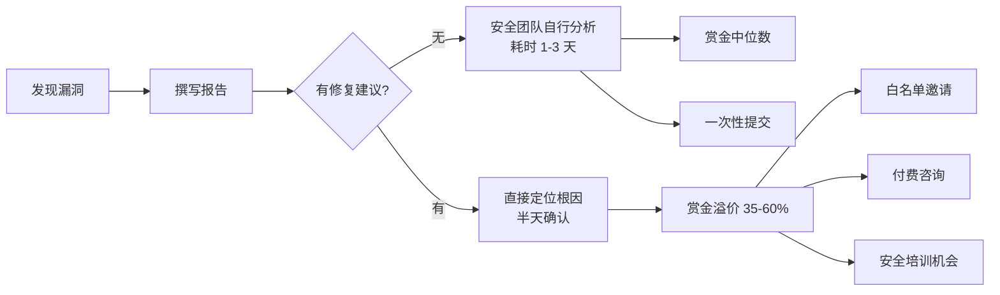

# 修复建议：从漏洞发现者到安全顾问的价值跃迁

## 为什么修复建议决定了你的赏金天花板

许多新手猎人陷入一个误区：认为提交漏洞报告后，修复是厂商的事。实际上，**高质量修复建议是拉开新手与专业猎人差距的核心因素之一**。根据 HackerOne 2024 年发布的平台数据，**附带高质量修复建议的漏洞报告，平均赏金比仅有漏洞描述的报告高出 35%-60%**，且首次通过率（First Response to Triage）缩短约 40%。

原因在于：

| 维度 | 无修复建议 | 有高质量修复建议 |
|------|-----------|----------------|
| 安全团队理解成本 | 需自行分析根因，耗费 1-3 天 | 直接定位问题，半天内确认 |
| 修复开发成本 | 开发需推测修复方案，可能返工 | 开发直接参考方案，一次通过 |
| 赏金谈判空间 | 仅凭漏洞危害说事 | 展现专业能力，增加溢价空间 |
| 长期合作机会 | 一次性关系 | 可能被加入白名单或受邀内测 |



修复建议不只是告诉厂商"修哪里"，更是**展示你作为安全从业者的技术深度、工程思维和沟通能力**的门面。

## 修复建议的核心原则

### 1. 可操作性优先

一条修复建议是否合格，最简单的判断标准是：**开发人员拿着你的建议，能否不依赖额外沟通就直接实施修复**。

**错误的写法：**
```text
加强输入验证，防止 XSS 攻击。
```

**正确的写法：**
```php
// 在输出到 HTML 上下文时，对用户输入进行 HTML 实体编码
echo htmlspecialchars($userInput, ENT_QUOTES | ENT_HTML5, 'UTF-8');
// 或者在模板引擎中启用自动转义（如 Twig 的 autoescape）
```

两者的区别：前者是一句正确的废话，后者是开发可以直接复制粘贴的代码。

判断标准：一条合格的修复建议应至少包含以下三个要素中的两个——**具体位置**（哪个文件/哪行代码/哪个接口）、**具体改动**（用什么 API/什么模式替代）、**预期效果**（改完之后攻击路径被如何阻断）。

### 2. 根因优先于症状

修复建议必须定位到**漏洞的根本原因**，而非仅仅封堵被攻击的点。

**错误示例（仅封堵症状）：**
```text
在 /api/user/profile 接口添加 CSRF Token 验证。
```

**正确示例（根因修复）：**
```text
问题根因：/api/user/profile 接口使用 GET 请求执行状态修改操作，违反了 HTTP 方法的语义约定。攻击者可构造  触发 CSRF。

修复方案：
1. 将状态修改操作改为 POST/PUT/DELETE 请求
2. 为所有修改操作添加 CSRF Token（使用 Double Submit Cookie 模式或 SameSite=Strict）
3. 验证请求的 Origin/Referer 头作为额外防御层
```

根因分析的价值在于：封堵症状可能遗漏同一根因导致的其它攻击路径，而根因修复能一劳永逸。

### 3. 上下文相关

同一个漏洞类型在不同技术栈、不同业务场景下的修复方案截然不同。修复建议必须贴合**目标系统的具体技术架构、框架版本和业务逻辑**。

| 漏洞类型 | PHP 环境 | Java 环境 | Node.js 环境 |
|---------|---------|----------|------------|
| SQL 注入 | 使用 PDO 参数化查询 | 使用 PreparedStatement | 使用参数化查询（pg-promise、Sequelize） |
| XSS | htmlspecialchars + CSP | OWASP Java Encoder + CSP | DOMPurify + helmet CSP |
| SSRF | 白名单 + curl 限制 | URL 白名单 + 网络策略 | axios 代理 + 请求拦截 |
| 反序列化 | 不使用 unserialize | 使用白名单过滤 + 认证校验 | 使用 json 替代 eval |

修复建议脱离上下文，就像医生不看检查报告就开药方。

### 4. 分层防御（Defense in Depth）

顶级修复建议遵循**纵深防御原则**——不依赖单一道防线，而是构建多层防护。

**单层防御（不够好）：**
```text
对用户输入进行 HTML 编码。
```

**纵深防御（推荐）：**
```text
第一层：输入验证——在白名单基础上过滤用户输入，只允许预期字符集
第二层：输出编码——在 HTML 上下文中使用 context-aware 编码（如 OWASP Java Encoder）
第三层：CSP 策略——设置 Content-Security-Policy: default-src 'self'; script-src 'nonce-{random}'
第四层：HttpOnly+Secure Cookie——防止 XSS 后窃取 Session
```

单层防御可能被绕过，而多层防御显著增加了攻击成本。

### 5. 业务感知

好的修复建议要兼顾**安全性和业务可用性**。修复方案不应以牺牲核心业务功能为代价。如果修复会影响正常业务流程，需要在建议中说明影响范围、替代方案和回滚策略，帮助开发团队在安全与业务之间找到平衡点。

## 通用修复建议模板

以下是一个实战验证过的修复建议模板，你可以根据具体漏洞类型调整使用：

```markdown
## 漏洞根因分析
[简述漏洞产生的原因，包括代码层面的直接原因和架构层面的间接原因]

## 影响范围评估
- 影响端点：[相关 URL 或接口路径]
- 影响用户：[哪些用户群体受影响]
- 利用难度：[低/中/高]
- 潜在损失：[数据泄露/权限提升/资金损失等]

## 短期修复方案（Hotfix，1-2 天内可实施）
[给出最小改动量的修复代码或配置变更，定位到具体文件和行号]

## 长期加固方案（2 周内落地）
[给出架构层面的改进方案，如引入 WAF 规则、新增安全中间件、重构危险逻辑等]

## 验证方法
修复后，建议按以下步骤验证漏洞是否已彻底修复：
1. [验证步骤 1]
2. [验证步骤 2]
3. [验证步骤 3]

## 参考资源
- [相关 CWE/CVE 编号]
- [OWASP 相关章节链接]
- [框架官方安全文档]
```

### 完整示例：一份真实水平的修复建议

以下是一份以 SQL 注入漏洞为例的**完整修复建议**，展示上述模板的实际填充效果：

```markdown
## 漏洞根因分析
/app/models/user.py 第 38 行的 `get_user_by_email` 函数直接将用户输入的 email 参数
拼接到 SQL 查询字符串中：

    query = f"SELECT * FROM users WHERE email = '{email}'"

由于 email 参数来自 HTTP 请求参数且未经任何过滤或参数化处理，
攻击者可注入任意 SQL 片段，例如：
    email = ' OR '1'='1' UNION SELECT password_hash,salt FROM admin_users --
可导致管理员凭据泄露。

## 影响范围评估
- 影响端点：POST /api/v1/auth/login、POST /api/v1/users/search
- 影响用户：所有用户（该函数在认证和用户搜索两处被调用）
- 利用难度：低（无需认证，单次请求即可利用）
- 潜在损失：全量用户数据泄露（含密码哈希、手机号、邮箱）

## 短期修复方案（Hotfix，1 天内）
修改 /app/models/user.py 第 38-42 行：

```diff
- query = f"SELECT * FROM users WHERE email = '{email}'"
- cursor.execute(query)
+ query = "SELECT * FROM users WHERE email = %s"
+ cursor.execute(query, (email,))
```text

## 长期加固方案（2 周内）
1. 全局审计所有 `cursor.execute()` 调用，使用 grep 扫描：
   `grep -rn "cursor.execute.*f\"" /app/`
2. 引入 SQLAlchemy ORM 替代原生 SQL，自动参数化
3. 数据库用户权限最小化：应用账号仅授予 SELECT/INSERT/UPDATE，禁止 DROP/ALTER
4. 部署 SQL 注入检测 WAF 规则（如 ModSecurity CRS 规则 942100）

## 验证方法
1. 修复后，使用以下 payload 重放请求，确认返回 400 错误或正常空结果：
   `email=' OR '1'='1`
2. 检查 SQL 日志确认查询使用占位符（`?` 或 `%s`）而非字符串拼接
3. 使用 sqlmap 工具对修复后的端点进行自动化测试：
   `sqlmap -u "https://target.com/api/v1/auth/login" -p email --batch`

## 参考资源
- CWE-89: Improper Neutralization of Special Elements used in an SQL Command
- OWASP SQL Injection Prevention Cheat Sheet:
  https://cheatsheetseries.owasp.org/cheatsheets/SQL_Injection_Prevention_Cheat_Sheet.html
```

## 各类型漏洞的高质量修复建议

### SQL 注入（SQL Injection）

**根因：** 用户输入直接拼接到 SQL 查询语句中，攻击者可通过构造恶意输入改变 SQL 语义。

**推荐修复策略：**

**方案一：参数化查询（首选）**

```python
# ❌ 危险写法
cursor.execute(f"SELECT * FROM users WHERE username = '{username}' AND password = '{password}'")

# ✅ 安全写法（参数化查询）
cursor.execute("SELECT * FROM users WHERE username = %s AND password = %s", (username, password))
```

```java
// ❌ 危险写法
Statement stmt = conn.createStatement();
ResultSet rs = stmt.executeQuery("SELECT * FROM users WHERE id = " + userId);

// ✅ 安全写法（PreparedStatement）
PreparedStatement pstmt = conn.prepareStatement("SELECT * FROM users WHERE id = ?");
pstmt.setString(1, userId);
ResultSet rs = pstmt.executeQuery();
```

**方案二：ORM 安全使用（次选）**

ORM 框架（SQLAlchemy、Hibernate、Entity Framework 等）并非天然防注入。常见漏洞是使用了 ORM 的**原生查询 SQL 接口**：

```python
# ❌ 危险的 ORM 原生查询
session.execute(text(f"SELECT * FROM users WHERE name = '{name}'"))

# ✅ 安全的 ORM 参数化查询
session.execute(text("SELECT * FROM users WHERE name = :name"), {"name": name})
```

**方案三：存储过程（备选）**

```sql
CREATE PROCEDURE GetUserById @UserId INT
AS
BEGIN
    SELECT * FROM users WHERE id = @UserId
END
```

**方案四：输入白名单校验（补充层）**

即使使用参数化查询，也应验证输入的格式和类型：

```python
import re

def validate_user_id(user_id):
    """验证用户 ID 格式：仅允许字母数字和下划线"""
    if not re.match(r'^[a-zA-Z0-9_]+$', user_id):
        raise ValueError("无效的用户 ID 格式")
    return user_id
```

> **常见误区：** 认为存储过程天然防注入。如果存储过程内部仍然使用拼接 SQL，同样存在注入风险。唯一可靠的方案是**参数化**。

**各语言对应方案速查表：**

| 语言/框架 | 推荐库/API | 验证方法 |
|----------|-----------|---------|
| PHP (PDO) | `PDO::prepare()` + `bindParam()` | 检查查询日志无原始 SQL 拼接 |
| Java (JDBC) | `PreparedStatement` | 检查预编译后的 SQL 模板不含变量 |
| Python (psycopg2) | `cursor.execute(sql, params)` | Wireshark 抓包确认参数化 |
| Node.js (mysql2) | `connection.execute(sql, params)` | 确认 SQL 日志中的占位符 |
| Go (database/sql) | `db.Query("SELECT ... WHERE ?", param)` | 检查 `stmt` 对象的参数化状态 |
| Ruby (ActiveRecord) | `where("name = ?", name)` | 使用 `to_sql` 检查无拼接 |

### 跨站脚本攻击（XSS）

**根因：** 用户提供的未经过滤的数据被作为 HTML/JavaScript 代码注入到页面中执行。

**三种上下文的修复策略：**

**上下文一：HTML 标签内（最常见）**

```php
// ❌ 危险的直接输出
echo "<div>" . $userComment . "</div>";

// ✅ HTML 实体编码（HTML Body Context）
echo "<div>" . htmlspecialchars($userComment, ENT_QUOTES | ENT_HTML5, 'UTF-8') . "</div>";
```

```javascript
// React 中默认安全，但 dangerouslySetInnerHTML 需要谨慎
// ❌ 危险
<div dangerouslySetInnerHTML={{ __html: userContent }} />

// ✅ 使用 DOMPurify 消毒后使用
import DOMPurify from 'dompurify';
<div dangerouslySetInnerHTML={{ __html: DOMPurify.sanitize(userContent) }} />
```

**上下文二：JavaScript 字符串内**

```javascript
// ❌ 危险：直接拼接到 JS 字符串
var userName = '<?php echo $userName; ?>';

// ✅ 安全：JSON 编码（处理引号和反斜杠）
var userName = <?php echo json_encode($userName, JSON_HEX_TAG | JSON_HEX_AMP); ?>;
```

**上下文三：CSS/URL 内**

| 上下文 | 处理方法 | 工具库 |
|--------|---------|-------|
| URL 属性（href/src） | URL 编码 + 协议白名单验证 | OWASP URLValidator |
| CSS 属性值 | CSS 转义 + 禁止动态 CSS 拼接 | cssesc 库 |
| SVG/HTML 属性 | 属性上下文编码（区分 HTML 属性和值） | OWASP Java Encoder |

**CSP 策略推荐配置：**

```nginx
# 严格的 CSP 策略（推荐生产环境使用）
Content-Security-Policy: default-src 'none'; 
    script-src 'strict-dynamic' 'nonce-{random}' 'unsafe-inline'?;
    style-src 'self' 'nonce-{random}';
    img-src 'self' data:;
    connect-src 'self';
    font-src 'self';
    frame-ancestors 'none';
    base-uri 'none';
    form-action 'self';
```

> **CSP 配置要点：** `'unsafe-inline'` 与 `nonce` 同时使用时，较新浏览器会忽略 `unsafe-inline`，这确保了非 nonce 的内联脚本被拦截。`strict-dynamic` 允许 nonce 脚本创建的子脚本执行，解决了 SPA 应用的动态加载问题。

### 跨站请求伪造（CSRF）

**根因：** 应用在执行状态变更操作时，未验证请求是否来自用户本人的主动意愿，攻击者可诱导已登录用户在不知情的情况下执行非预期操作。

**修复策略：**

**方案一：同步令牌模式（Synchronizer Token，首选）**

```python
# Flask 示例：生成并验证 CSRF Token
import secrets
from flask import session, request, abort

@app.before_request
def csrf_check():
    """对所有状态变更请求进行 CSRF 校验"""
    if request.method in ('POST', 'PUT', 'DELETE', 'PATCH'):
        token = request.form.get('_csrf_token') or request.headers.get('X-CSRF-Token')
        if not token or token != session.get('csrf_token'):
            abort(403, description="CSRF 验证失败")

@app.route('/transfer', methods=['POST'])
def transfer():
    # 业务逻辑...
    pass

# 模板中生成 token
@app.route('/dashboard')
def dashboard():
    session['csrf_token'] = secrets.token_hex(32)
    return render_template('dashboard.html', csrf_token=session['csrf_token'])
```

**方案二：SameSite Cookie 属性（现代方案）**

```python
# 在 Flask 中设置 SameSite 属性
app.config['SESSION_COOKIE_SAMESITE'] = 'Lax'  # 或 'Strict'
app.config['SESSION_COOKIE_SECURE'] = True       # 仅 HTTPS 传输
app.config['SESSION_COOKIE_HTTPONLY'] = True      # 禁止 JS 读取
```

```text
SameSite 三种模式对比：
- Strict：完全禁止跨站请求携带 Cookie（最安全，但用户从外部链接进入时需重新登录）
- Lax：GET 导航允许携带，POST/iframe 禁止（推荐，安全与体验平衡）
- None：不限制（必须配合 Secure，不推荐用于敏感操作）
```

**方案三：双重提交 Cookie（Double Submit Cookie，适合前后端分离）**

```text
前端流程：
1. 登录后，服务端在 Cookie 中写入随机 token
2. 前端 JS 读取 Cookie 中的 token，放入 X-CSRF-Token 请求头
3. 攻击者的页面可以触发请求，但无法读取目标域的 Cookie 值，因此无法伪造请求头

服务端验证：
比对 Cookie 中的 token 与请求头中的 token 是否一致
```

> **CSRF vs SSRF 区分：** CSRF 是攻击者诱导用户浏览器发起请求（客户端伪造），SSRF 是攻击者诱导服务器发起请求（服务端伪造）。修复方向完全不同——CSRF 防的是跨站请求伪造，SSRF 防的是服务端被利用访问内网。

### 服务器端请求伪造（SSRF）

**根因：** 攻击者控制的目标 URL 参数被服务器端代码直接发起网络请求，导致可访问内部网络资源。

**推荐修复方案：**

**方案一：URL 白名单（最有效）**

```python
import re
from urllib.parse import urlparse

ALLOWED_DOMAINS = [
    'api.example.com',
    'cdn.example.com',
    'images.example.com'
]

def validate_url(url):
    """严格校验目标 URL 是否在白名单内"""
    parsed = urlparse(url)
    if parsed.hostname not in ALLOWED_DOMAINS:
        raise ValueError(f"域名 {parsed.hostname} 不在白名单中")
    return url
```

**方案二：IP 地址黑名单 + 内网检测（补充）**

```python
import ipaddress
import socket

def is_internal_ip(hostname):
    """检测目标 IP 是否为内网地址"""
    try:
        ip = socket.gethostbyname(hostname)
        addr = ipaddress.ip_address(ip)
        private_ranges = [
            ipaddress.ip_network('10.0.0.0/8'),
            ipaddress.ip_network('172.16.0.0/12'),
            ipaddress.ip_network('192.168.0.0/16'),
            ipaddress.ip_network('127.0.0.0/8'),
            ipaddress.ip_network('169.254.0.0/16'),
            ipaddress.ip_network('0.0.0.0/8'),
        ]
        return any(addr in r for r in private_ranges)
    except Exception:
        return True  # 无法解析则拒绝请求
```

**方案三：网络层面限制（纵深防御）**

```bash
# iptables 限制应用服务器对外请求
iptables -A OUTPUT -m owner --uid-owner www-data \
    -d 10.0.0.0/8 -j DROP
iptables -A OUTPUT -m owner --uid-owner www-data \
    -d 172.16.0.0/12 -j DROP
iptables -A OUTPUT -m owner --uid-owner www-data \
    -d 192.168.0.0/16 -j DROP

# 限制 DNS 解析范围（推荐使用内部 DNS 策略）
```

**方案四：禁用不必要的 URL 协议**

```python
import requests

# ❌ 危险配置：允许 file:// dict:// gopher:// 等协议
response = requests.get(user_url, timeout=5)

# ✅ 仅允许 http/https 协议
from urllib.parse import urlparse

parsed = urlparse(user_url)
if parsed.scheme not in ('http', 'https'):
    raise ValueError(f"不支持的协议: {parsed.scheme}")
```

> **SSRF 绕过技巧汇总：** 攻击者可能使用 DNS rebinding、IPv6 映射（`::ffff:10.0.0.1`）、URL 解析差异、302 重定向到内网等手法绕过简单的校验。白名单方案是唯一能对抗所有绕过方法的可靠方案。

### 命令注入（Command Injection）

**根因：** 用户输入被直接拼接到系统命令字符串中，攻击者可注入 shell 元字符（`;`、`|`、`&&`、`$()` 等）执行任意系统命令。这是危害最严重的漏洞类型之一，直接导致 RCE（远程代码执行）。

**修复策略：**

**方案一：避免调用系统命令（首选）**

大多数场景下，系统命令都可以用语言内置库替代：

```python
# ❌ 危险：调用系统命令获取文件信息
import os
filename = request.args.get('file')
os.system(f"ls -la /uploads/{filename}")

# ✅ 安全：使用 Python 内置模块
import os
filename = request.args.get('file')
# 使用 os.listdir 列出文件
files = os.listdir('/uploads')
# 使用 os.path 获取文件信息
file_info = os.stat(os.path.join('/uploads', filename))
```

**方案二：使用参数化命令执行（必须调用系统命令时）**

```python
import subprocess
import shlex

# ❌ 危险：shell=True + 字符串拼接
filename = request.args.get('file')
os.system(f"file /uploads/{filename}")

# ✅ 安全：shell=False + 参数列表
filename = request.args.get('file')
result = subprocess.run(
    ['file', os.path.join('/uploads', filename)],
    capture_output=True,
    text=True,
    timeout=10
)
```

```java
// ❌ 危险
Runtime.getRuntime().exec("ping " + userInput);

// ✅ 安全：使用 ProcessBuilder + 参数数组
ProcessBuilder pb = new ProcessBuilder("ping", "-c", "4", validatedInput);
pb.redirectErrorStream(true);
Process process = pb.start();
```

**方案三：输入白名单校验（底层防线）**

```python
import re

def validate_filename(filename):
    """严格校验文件名：只允许字母数字、下划线、连字符、点号"""
    if not re.match(r'^[a-zA-Z0-9_\-. ]{1,255}$', filename):
        raise ValueError(f"非法文件名: {filename}")
    # 额外检查：禁止 .. 路径穿越
    if '..' in filename:
        raise ValueError(f"文件名包含非法序列: {filename}")
    return filename
```

> **命令注入的致命性：** 与 SQL 注入不同，命令注入的后果通常是**直接 RCE**——攻击者可以上传 webshell、创建持久化后门、加密数据勒索。在 Bug Bounty 中，命令注入通常被评为 Critical/P1 级别，赏金中位数在 $5,000-$15,000。修复建议中应特别强调其严重性。

### XML 外部实体注入（XXE）

**根因：** 应用解析用户可控的 XML 数据时启用了外部实体引用（DTD），攻击者通过构造恶意 XML 实体定义，可读取服务器文件、发起 SSRF 请求或导致拒绝服务。

**修复策略：**

**方案一：禁用外部实体解析（首选）**

```python
# Python - defusedxml 库（推荐）
from defusedxml import ElementTree

# ✅ defusedxml 默认禁用所有危险特性
tree = ElementTree.parse(xml_input)

# ❌ 如果使用标准库，必须手动禁用
import xml.etree.ElementTree as ET
# Python 3.7.1+ 默认禁用外部实体，但旧版本不安全
# 建议始终使用 defusedxml
```

```java
// Java - 禁用 DTD 和外部实体
DocumentBuilderFactory dbf = DocumentBuilderFactory.newInstance();
dbf.setFeature("http://apache.org/xml/features/disallow-doctype-decl", true);
dbf.setFeature("http://xml.org/sax/features/external-general-entities", false);
dbf.setFeature("http://xml.org/sax/features/external-parameter-entities", false);
dbf.setFeature("http://apache.org/xml/features/nonvalidating/load-external-dtd", false);
DocumentBuilder db = dbf.newDocumentBuilder();
Document doc = db.parse(xmlInputStream);
```

```php
// PHP - 禁用外部实体加载
libxml_disable_entity_loader(true);  // PHP < 8.0
// PHP 8.0+ 外部实体加载默认禁用
$doc = simplexml_load_string($xml, 'SimpleXMLElement', LIBXML_NOENT);
// ✅ 更好的做法：不使用 LIBXML_NOENT 标志
$doc = simplexml_load_string($xml);
```

**方案二：使用 JSON 替代 XML（推荐新项目）**

如果业务允许，将数据格式从 XML 迁移到 JSON 可以从根本上消除 XXE 风险。

> **XXE 造成的经典危害：** 2017 年 eBay 曾因 XXE 漏洞泄露了 1.45 亿用户数据。修复建议中应引用此类历史案例以强调严重性。CWE 编号：CWE-611。

### 不安全的反序列化（Insecure Deserialization）

**根因：** 应用从不可信来源反序列化数据，攻击者构造恶意序列化数据触发任意代码执行。

**各语言修复建议：**

| 语言 | 危险函数/操作 | 安全替代方案 |
|------|-------------|------------|
| PHP | `unserialize()` | `json_decode()` + 数据结构校验 |
| Java | `ObjectInputStream.readObject()` | `validatingObjectInputStream` + 白名单 |
| Python | `pickle.loads()` | `json.loads()` 或 `yaml.safe_load()` |
| Ruby | `Marshal.load()` | `JSON.parse()` |
| .NET | `BinaryFormatter.Deserialize()` | `DataContractSerializer` + 类型限制 |

```java
// Java 安全反序列化示例
import org.apache.commons.io.serialization.ValidatingObjectInputStream;

// ❌ 危险
ObjectInputStream ois = new ObjectInputStream(inputStream);
Object obj = ois.readObject();

// ✅ 安全：使用白名单验证
ValidatingObjectInputStream vois = new ValidatingObjectInputStream(inputStream);
vois.accept(UserDTO.class, OrderDTO.class);  // 只允许特定类
vois.reject("java.lang.Runtime", "java.lang.ProcessBuilder");  // 拒绝危险类
Object obj = vois.readObject();
```

### 路径遍历（Path Traversal）

**根因：** 用户输入的文件路径未经过滤直接用于文件操作，攻击者通过 `../` 等序列访问受限目录之外的文件。

**修复方案：**

```python
import os

UPLOAD_DIR = '/var/www/uploads'

def safe_path(user_filename):
    """
    安全的文件路径解析
    1. 使用 os.path.realpath 解析所有符号链接和相对路径
    2. 验证最终路径是否在允许的基目录下
    """
    # 清理文件名（移除路径分隔符）
    safe_name = os.path.basename(user_filename)
    # 构造完整路径
    full_path = os.path.realpath(os.path.join(UPLOAD_DIR, safe_name))
    # 校验路径前缀
    if not full_path.startswith(os.path.realpath(UPLOAD_DIR)):
        raise ValueError("非法路径访问")
    return full_path
```

> **注意符号链接绕过：** `realpath()` 会解析符号链接。如果攻击者在上传目录创建了指向 `/etc/passwd` 的符号链接，`os.path.join()` 不会自动解析。因此必须使用 `realpath()` 获取最终真实路径后再做前缀校验。Windows 环境还需额外处理 UNC 路径（`\\server\share`）和盘符（`C:\`）。

### 权限绕过 / 越权访问（IDOR/Broken Access Control）

**根因：** 应用仅依赖 URL/API 参数中的标识符来判断资源所有权，未实施服务端权限校验。

**修复方案：**

```python
from flask import request, abort
from functools import wraps

def require_ownership(resource_getter):
    """
    通用的资源所有权校验装饰器
    
    Args:
        resource_getter: 根据请求参数和当前用户，验证资源所有权的函数
    """
    def decorator(f):
        @wraps(f)
        def decorated_function(*args, **kwargs):
            # 从 JWT/Session 获取当前用户 ID
            current_user_id = get_current_user_id()
            # 获取请求的资源 ID
            resource_id = request.view_args.get('id')
            # 校验所有权
            if not resource_getter(current_user_id, resource_id):
                abort(403, description="无权访问该资源")
            return f(*args, **kwargs)
        return decorated_function
    return decorator

# 使用示例
@app.route('/api/v1/orders/<int:order_id>')
@require_ownership(lambda uid, oid: Order.query.filter_by(
    id=oid, user_id=uid).first() is not None)
def get_order(order_id):
    order = Order.query.get(order_id)
    return jsonify(order.to_dict())
```

**OWASP 权限校验层级标准：**

```text
第0层：前台隐藏入口（不安全，可被直接 URL 访问绕过）
第1层：客户端校验（不靠谱，请求可被篡改）
第2层：服务端基础校验（检查登录态——不够，不检查权限）
第3层：服务端资源级校验（检查资源所有权——最低安全标准）
第4层：服务端逻辑级校验（检查业务规则、状态流转——推荐）
第5层：审计日志 + 行为分析（检测异常访问模式——纵深防御）
```

**建议最低达到第 3 层（资源级校验）。**

### 认证绕过（Authentication Bypass）

**根因：** 认证逻辑存在设计缺陷，攻击者可通过逻辑绕过、默认凭据、暴力破解等方式绕过身份验证。

**常见场景与修复：**

**场景一：默认/硬编码凭据**

```yaml
# ❌ 危险：配置文件中的默认密码
database:
  username: admin
  password: admin123

# ✅ 安全：使用环境变量 + 密钥管理服务
database:
  username: ${DB_USERNAME}        # 从环境变量读取
  password: ${VAULT_DB_PASSWORD}  # 从 HashiCorp Vault 读取
```

**场景二：登录逻辑绕过**

```python
# ❌ 危险的登录逻辑：只要用户名存在就返回成功
def login(username, password):
    user = User.query.filter_by(username=username).first()
    if user:
        return {"status": "success", "token": generate_token(user)}
    return {"status": "fail"}

# ✅ 安全的登录逻辑：用户名和密码都必须验证
def login(username, password):
    user = User.query.filter_by(username=username).first()
    if not user or not verify_password(password, user.password_hash):
        # 统一错误信息，防止用户名枚举
        return {"status": "fail", "message": "用户名或密码错误"}
    # 登录成功后重置失败计数器
    user.failed_attempts = 0
    user.locked_until = None
    db.session.commit()
    return {"status": "success", "token": generate_token(user)}
```

**场景三：暴力破解防护缺失**

```python
from flask_limiter import Limiter

limiter = Limiter(app=app, key_func=get_remote_address)

# 对登录接口实施速率限制
@app.route('/login', methods=['POST'])
@limiter.limit("5/minute;20/hour")  # 每分钟 5 次，每小时 20 次
def login():
    # ... 登录逻辑
    pass
```

> **认证绕过的修复优先级：** 认证是所有安全机制的基石。修复建议中应强调：认证绕过通常评为 Critical 级别，必须在 24 小时内修复。同时建议厂商检查是否存在同类认证逻辑缺陷（如同一代码库中其他登录入口）。

### 业务逻辑漏洞（Business Logic Flaws）

**根因：** 应用的业务逻辑存在设计缺陷，攻击者通过合法功能的非常规使用方式，实现非预期的业务结果。业务逻辑漏洞无法通过自动化扫描器发现，完全依赖人工分析。

**常见场景与修复：**

**场景一：优惠券/积分重复使用**

```python
# ❌ 危险：未检查优惠券是否已使用
@app.route('/apply_coupon', methods=['POST'])
def apply_coupon():
    code = request.form.get('coupon_code')
    coupon = Coupon.query.filter_by(code=code, is_active=True).first()
    if coupon:
        apply_discount(coupon.value)
        return {"status": "success"}

# ✅ 安全：检查使用状态 + 事务原子性
@app.route('/apply_coupon', methods=['POST'])
def apply_coupon():
    code = request.form.get('coupon_code')
    coupon = Coupon.query.filter_by(code=code, is_active=True).with_for_update().first()
    if not coupon or coupon.used_count >= coupon.max_uses:
        return {"status": "fail", "message": "优惠券无效或已使用"}
    if coupon.user_id and coupon.user_id != current_user.id:
        return {"status": "fail", "message": "无权使用此优惠券"}
    coupon.used_count += 1
    apply_discount(coupon.value)
    db.session.commit()
    return {"status": "success"}
```

**场景二：竞态条件导致的重复提交**

```python
# ❌ 危险：检查余额和扣款之间存在时间窗口
def transfer(user_id, amount):
    balance = get_balance(user_id)
    if balance >= amount:
        # 攻击者可在此时间窗口内发起多次请求
        deduct_balance(user_id, amount)
        send_money(user_id, amount)

# ✅ 安全：使用数据库事务 + 乐观锁/悲观锁
def transfer(user_id, amount):
    with db.session.begin():
        user = User.query.with_for_update().filter_by(id=user_id).first()
        if user.balance < amount:
            raise ValueError("余额不足")
        user.balance -= amount
        db.session.commit()
```

> **业务逻辑漏洞的特殊性：** 这类漏洞的修复建议需要深入理解业务规则。你不能只说"加个校验"，而要具体说明在**哪个环节**加什么校验、需要考虑哪些**边界条件**（如并发、取消、退款等状态流转）。这也是为什么业务逻辑漏洞的赏金往往高于技术漏洞——修复复杂度更高。

### 安全配置错误（Security Misconfiguration）

**根因：** 应用、服务器、框架或云服务的默认配置未被修改，或配置不当导致安全特性缺失。

**常见修复建议：**

| 配置项 | ❌ 不安全配置 | ✅ 安全配置 |
|-------|-------------|-----------|
| HTTP 响应头 | 缺少安全头 | 添加 HSTS、X-Content-Type-Options、X-Frame-Options 等 |
| 目录列表 | `Options +Indexes` | `Options -Indexes` |
| 错误页面 | 显示完整堆栈跟踪 | 自定义错误页，隐藏技术细节 |
| 默认凭据 | admin/admin、root/root | 首次登录强制修改密码 |
| 云存储 | S3 Bucket 公开读写 | 启用 Bucket Policy + 加密 + 访问日志 |
| CORS | `Access-Control-Allow-Origin: *` | 仅允许指定域名白名单 |

```nginx
# Nginx 安全配置模板
server {
    # 隐藏服务器版本信息
    server_tokens off;
    
    # 安全响应头
    add_header X-Content-Type-Options "nosniff" always;
    add_header X-Frame-Options "DENY" always;
    add_header X-XSS-Protection "1; mode=block" always;
    add_header Referrer-Policy "strict-origin-when-cross-origin" always;
    add_header Content-Security-Policy "default-src 'self'" always;
    add_header Strict-Transport-Security "max-age=31536000; includeSubDomains" always;
    
    # 禁止目录列表
    autoindex off;
    
    # 限制请求方法（只允许必要方法）
    if ($request_method !~ ^(GET|POST|PUT|DELETE|PATCH)$) {
        return 405;
    }
}
```

## 常见修复建议误区

### 误区一：过度依赖前端校验

```text
❌ 错误建议："在 JavaScript 中验证输入长度不超过 100 字符。"
```

前端校验可以被攻击者直接绕过（使用 Burp Suite/curl 直接发送请求）。前端校验仅用于**提升用户体验**，**安全必须依赖服务端校验**。

**正确的做法：** 前端 + 后端双重校验，以后端为准。

### 误区二：修复范围过窄

```text
❌ 错误建议："在 register.php 第 45 行添加 htmlspecialchars。"
```

这种修复只封堵了发现漏洞的具体位置，但其他类似位置同样存在风险。更好的做法是对整个输入输出链路进行审计。

**正确的做法：**
```text
短期修复：在 register.php 第 45 行添加 htmlspecialchars
长期加固：在框架层面全局启用输出编码（如中间件或模板引擎的 autoescape），
         并对所有用户输入点进行系统性审计。
```

### 误区三：给出不稳定或影响业务的修复方案

```text
❌ 错误建议："直接删除所有用户评论功能即可消除 XSS 风险。"
```

这种建议完全忽略了业务需求。修复建议必须在**安全和业务之间取得平衡**。

**正确的做法：** 提供不损害核心功能的修复方案，并通过配置开关让业务团队可以控制功能切换。

### 误区四：只给方案不给验证方法

```text
❌ 错误建议："修复后请自行验证。"
```

你没有义务替厂商做全面测试，但给出验证方法体现了你的专业度，也帮助安全团队向开发团队证明修复的有效性。

**正确的做法：**

```markdown
## 验证方法
修复后请按以下步骤验证：
1. 使用 Burp Suite 重放原始 PoC 请求，确认返回 400/403 而非 200
2. 检查应用日志，确认注入的 payload 未被拼接到 SQL 语句中
3. 执行回归测试用例：tests/test_auth.py::TestLogin::test_sql_injection
```

验证方法不需要非常复杂，3-5 个步骤即可。关键是让安全团队知道**如何确认修复生效了**。

### 误区五：忽视修复方案的兼容性

```text
❌ 错误建议："将 PHP 5.x 升级到 PHP 8.2 以修复反序列化漏洞。"
```

这种建议看似正确，但忽略了实际可操作性——升级 PHP 大版本意味着大量 breaking changes，需要数周甚至数月的迁移工作，不是一个"修复"而是一个"项目"。

**正确的做法：**
```text
短期（1 天）：在调用 unserialize() 之前添加白名单过滤
中期（2 周）：逐步替换为 json_decode()，逐个模块迁移
长期（1 个月）：完成 PHP 版本升级计划
```

### 误区六：修复建议中使用不确定的措辞

```text
❌ 错误建议："可能需要在某个地方添加输入校验。"
❌ 错误建议："应该考虑使用更安全的 API。"
```

"可能"、"应该"、"考虑"这类措辞让修复建议失去了可操作性。开发团队需要的是**明确的行动指令**，而不是模糊的建议。

**正确的做法：**

```text
将 /app/views.py 第 42 行的 subprocess.call(cmd, shell=True) 替换为
subprocess.run(cmd.split(), shell=False)，并添加输入白名单校验函数 validate_input()。
```

## 修复建议撰写技巧

### 技巧一：代码级建议优先

一份包含**具体代码段**的修复建议，被接收的概率比纯文字描述高出 3 倍（数据来源：HackerOne 内部统计）。代码段应：

1. 给出**修改前后的对比**（diff 格式最佳）
2. 标注**具体文件和行号**
3. 使用目标系统的**现有技术栈**

```diff
# /app/controllers/users.py 第 28-32 行
- def get_user(user_id):
-     query = f"SELECT * FROM users WHERE id = '{user_id}'"
-     cursor.execute(query)
+ def get_user(user_id):
+     query = "SELECT * FROM users WHERE id = %s"
+     cursor.execute(query, (user_id,))
```

### 技巧二：使用参考链接增加说服力

引用权威来源能增加修复建议的可信度：

- OWASP 官方 Cheat Sheet（https://cheatsheetseries.owasp.org/）
- CWE 条目（https://cwe.mitre.org/）
- 框架官方安全文档
- CVE 历史案例
- 厂商历史安全公告

### 技巧三：区分紧急程度

```markdown
紧急程度：P0（Critical - 24小时内修复）
- 直接导致 RCE/Authentication Bypass 等高危漏洞
- 已确认存在攻击利用
- 影响所有用户

紧急程度：P1（High - 1周内修复）
- 可导致敏感信息泄露
- 需要特定条件触发
- 影响部分用户群体

紧急程度：P2（Medium - 1个月内修复）
- 需结合其他漏洞利用
- 影响有限
- 有替代防护方案
```

### 技巧四：为不同角色提供差异化建议

安全团队关注**风险严重程度**，开发团队关注**具体实现**，管理者关注**修复成本和业务影响**。一份好的修复建议可以针对不同角色给出针对性内容：

```markdown
### 给安全团队
风险评级：高危（CVSS 8.2）
攻击路径：未经认证的攻击者通过特制请求读取任意文件
检测规则：新增 Suricata 规则 ID 2024001 检测 ../ 序列

### 给开发团队
修复位置：/app/routes.php:156-170
改动量：新增 15 行输入校验代码，删除 3 行不安全代码
回归测试：执行 tests/FileAccessTest.php 验证

### 给管理层
修复成本：约 2 人天（编码 1 天 + 测试 1 天）
业务影响：无（不修改现有功能接口）
合规影响：修复后可满足 OWASP Top 10 2021 A01 要求
```

### 技巧五：提供修复验证的自动化脚本

在修复建议中附带一个简单的验证脚本，可以大幅降低安全团队的验证成本：

```bash
#!/bin/bash
# verify_fix.sh - 验证 SQL 注入修复是否生效
TARGET="https://target.com/api/v1/users"

echo "[*] 测试 1: 基本注入 payload"
RESPONSE=$(curl -s -o /dev/null -w "%{http_code}" \
    -X POST "$TARGET/search" \
    -H "Content-Type: application/json" \
    -d '{"email": "test@x.com'\'' OR 1=1--"}')

if [ "$RESPONSE" = "400" ] || [ "$RESPONSE" = "403" ]; then
    echo "[+] PASS: 注入 payload 被正确拒绝 (HTTP $RESPONSE)"
else
    echo "[-] FAIL: 注入 payload 未被拒绝 (HTTP $RESPONSE)"
fi

echo "[*] 测试 2: 正常请求不受影响"
RESPONSE=$(curl -s -o /dev/null -w "%{http_code}" \
    -X POST "$TARGET/search" \
    -H "Content-Type: application/json" \
    -d '{"email": "test@x.com"}')

if [ "$RESPONSE" = "200" ]; then
    echo "[+] PASS: 正常请求正常处理 (HTTP $RESPONSE)"
else
    echo "[-] FAIL: 正常请求被误拦截 (HTTP $RESPONSE)"
fi
```

## 高级进阶：从修复建议到安全顾问

### 建立修复建议模板库

实战经验丰富的猎人会积累一个**修复建议模板库**，覆盖常见技术栈的各类漏洞。建议按照以下结构组织：

```text
fix-templates/
├── sql-injection/
│   ├── php-pdo.md
│   ├── java-jdbc.md
│   ├── python-psycopg2.md
│   ├── node-mysql2.md
│   └── go-database-sql.md
├── xss/
│   ├── php-autoescape.md
│   ├── react-dompurify.md
│   ├── vue-v-html.md
│   └── angular-bypass.md
├── ssrf/
│   ├── python-url-whitelist.md
│   ├── java-url-validator.md
│   └── golang-net-http.md
├── command-injection/
│   ├── python-subprocess.md
│   └── java-processbuilder.md
├── deserialization/
│   ├── php-json.md
│   ├── java-validating-stream.md
│   └── python-pickle-alternatives.md
└── common/
    ├── csrf-token.md
    ├── rate-limiting.md
    ├── authentication-bypass.md
    └── authorization-check.md
```

每次提交报告时，从模板库中提取对应模板，根据目标系统的实际情况**微调**（修改变量名、适配框架版本），即可快速产出高质量的修复建议。

### 修复验证方法论

修复验证是修复建议的延伸——你不仅能告诉厂商怎么修，还能告诉他们怎么确认修好了。以下是系统化的验证方法论：

**静态验证（代码层面）：**

```bash
# 1. 搜索危险函数调用是否已被替换
grep -rn "cursor.execute.*f\"" /app/      # SQL 注入：检查字符串拼接
grep -rn "unserialize(" /app/              # 反序列化：检查危险函数
grep -rn "shell=True" /app/               # 命令注入：检查 shell 模式
grep -rn "dangerouslySetInnerHTML" /app/  # XSS：检查危险属性

# 2. 搜索安全函数是否已被引入
grep -rn "\.prepare(" /app/               # 参数化查询
grep -rn "DOMPurify" /app/               # XSS 防护
grep -rn "subprocess.run" /app/           # 安全命令执行
```

**动态验证（运行时层面）：**

```bash
# 使用自动化工具验证修复效果
# SQL 注入：sqlmap
sqlmap -u "https://target.com/api?id=1" -p id --batch --level=3

# XSS：XSStrike
python xsstrike.py -u "https://target.com/search?q=test"

# SSRF：SSRFire
python ssrfire.py -u "https://target.com/fetch?url=http://example.com"
```

> **验证原则：** 修复验证应同时确认两件事——(1) 原始攻击路径已被阻断；(2) 正常业务功能未受影响。只验证前者可能导致误报（正常功能被破坏），只验证后者可能遗漏修复不彻底的情况。

### 参加 Bug Bounty 平台的修复验证

部分平台（如 HackerOne、Bugcrowd）提供**修复验证（Fix Verification）** 机会——厂商修复漏洞后，邀请原始报告者对修复进行验证。这是一个**二次变现**的机会：

- **修复验证赏金**：通常为原始赏金的 20%-30%
- **获得方式**：修复通过后，平台自动发放验证赏金
- **验证方法**：使用 PoC 再次尝试攻击目标（在授权范围内）
- **注意事项**：验证前确认测试范围，避免触发 WAF 警报或业务中断

修复验证需要你清晰地知道"正确的修复长什么样"——这正是高质量修复建议的价值所在。你建议的修复方案越具体，验证环节就越顺利。

### 积累技术影响力

长期持续输出高质量修复建议，会带来意想不到的回报：

1. **厂商白名单邀请**：厂商发现某位猎人的修复建议一贯高质量，可能直接邀请加入私有项目内测
2. **安全顾问咨询**：部分厂商在遇到技术难题时，会联系曾提交过高水平修复建议的猎人进行付费咨询
3. **安全培训机会**：出色的修复建议是安全能力的证明，可能带来内训或公开演讲的机会
4. **职业发展加速**：将优秀修复建议脱敏后整理到个人博客/GitHub，是求职安全工程师的加分项

### 修复建议与赏金谈判

高质量的修复建议是赏金谈判的有力筹码。当厂商试图压低赏金时，你可以用修复建议证明自己的专业价值：

```text
谈判话术示例：

"我的报告中包含了详细的根因分析、针对你们技术栈的修复方案（Spring Boot + 
MySQL）、短期 hotfix 和长期加固建议，以及修复验证方法。这些内容如果由
你们安全团队自行编写，预计需要 2-3 人天的工作量。考虑到这些附加价值，
我认为当前赏金应反映漏洞的实际影响和我提供的额外贡献。"
```

关键策略：
- 在报告提交时就附带完整修复建议，而不是等谈判时才补充
- 修复建议的**专业度**本身就是谈判筹码——它证明你不是一个"只会报 bug 的人"
- 如果厂商接受你的修复建议并据此修复，后续可以作为"持续贡献"申请更高赏金等级

## 总结

修复建议不是漏洞报告的附属品，而是**展示你安全能力的独立产出**。一条好的修复建议：

- **根因分析精准**——知道为什么出问题
- **修复方案具体**——知道怎么修
- **考虑上下文**——贴合业务和技术栈
- **分层防御**——不依赖单一方案
- **可验证**——修完能确认是否真的修好了
- **业务友好**——不以牺牲核心功能为代价

从今天开始，每次提交漏洞报告前，问自己一个问题：**"如果我是开发这张票的工程师，拿到这份报告和修复建议，我能立刻开始改代码吗？"** 如果答案是肯定的，恭喜你，你已经具备了下一个层级的专业素养。
