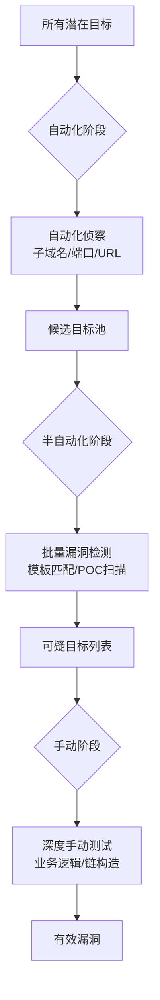
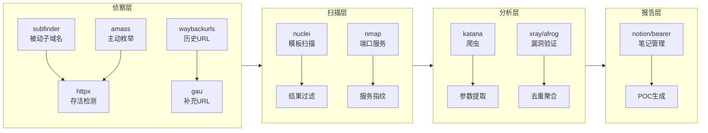
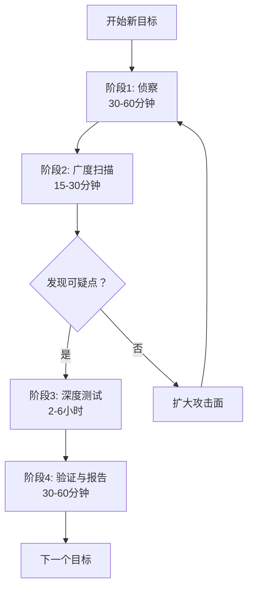

## 27.4 效率提升策略

Bug Bounty 是一个典型的"时间换收入"行业——你的时薪取决于单位时间内的漏洞发现率和报告质量。顶尖赏金猎人年收入可达百万美元级别，而普通参与者可能连平台门槛都难以跨越。差距的核心不在于天赋，而在于**效率系统的构建**。

效率不是"做更多事"，而是"用更少资源产出更高价值的漏洞"。本章从自动化策略、工具链建设、工作流优化、时间管理四个维度，系统化地拆解如何将你的 Bug Bounty 产出提升 3-10 倍。

### 27.4.1 自动化的哲学：什么该自动，什么该手动

许多新人犯的第一个错误是**全盘自动化**——写完一个超级脚本就跑，指望它自动挖洞。另一个极端是**全盘手动**——每个端点手工点，效率低下。真正高效的赏金猎人遵循"**机械重复自动化，认知判断手动化**"的原则。

#### 自动化的三层筛选模型



**第一层：自动化侦察（全覆盖）**——将互联网上的所有可能性缩小为你关注的焦点目标。这一层追求**召回率**：宁可误报，不可漏报。

**第二层：半自动化扫描（中精度）**——使用已知漏洞模板、POC 脚本对候选目标进行批量验证。这一层追求**效率**：快速排除 80% 的无价值目标。

**第三层：手动深度测试（高精度）**——对经过两轮筛选的"高危候选人"进行人工分析。这一层追求**准确率和价值**：发现自动化工具无法触及的逻辑漏洞和利用链。

#### 自动化的三个适用条件

判断一个任务是否应该自动化，可以用这三条标准来检验：

| 条件 | 说明 | 反例 |
|------|------|------|
| **重复性** | 操作模式固定，每次差异小于 20% | 每次目标不同的业务逻辑测试 |
| **可判定性** | 结果能用规则明确区分好坏 | 需要主观判断"这个行为是否可疑" |
| **高频率** | 每周至少执行 5 次以上 | 一年一次的渗透测试报告编写 |

**举例**：子域名枚举满足全部三条——每次执行同样的工具链，结果能用 httpx 判断是否存活，每天可能跑几十个域名。而"判断一个 OAuth 实现是否有授权绕过"一条都不满足——每个目标实现不同，没有统一规则判定，也不经常遇到。

#### 手动测试的四个黄金场景

以下任务自动化工具**永远无法替代**，是手动测试的价值核心：

1. **业务逻辑漏洞**——自动化工具不理解"正常业务流程"。例如：电商平台的优惠券叠加漏洞、积分反转逻辑、多步骤跳过的权限绕过。这些需要理解业务上下文才能发现。

2. **认证/授权缺陷**——自动化扫描器可以检测到"是否存在登录页面"，但无法判断"用户 A 能否访问用户 B 的订单"这种水平越权。这需要理解权限模型。

3. **复杂利用链构造**——单个漏洞可能只是"低危"，但组合起来就是"严重"。例如：信息泄露+CSRF+XSS→Account Takeover。自动化工具看不到这个链条。

4. **新型漏洞模式**——已知漏洞模板只能检测已经公开的漏洞类型。对于 0-day 类别、新技术栈引入的新型攻击面，只有人类的理解力才能发现。

> **经验数据**：根据 HackerOne 2024 年发布的平台统计，收入排名前 10% 的赏金猎人中，**约 65% 的严重漏洞来源于手动测试**，自动化扫描仅贡献了不到 20%。自动化是你的"广度"，手动是你的"深度"。

### 27.4.2 端到端工具链深度建设

一个高效的赏金猎人通常拥有 15-30 个工具，但要的不是工具的堆砌，而是**有机集成的工具链**。下面是一套经过实战验证的端到端工具链架构。

#### 工具链全景图



#### 侦察层：扩大攻击面

侦察是所有后续工作的基础。侦察的深度直接影响漏洞发现的概率。

| 工具 | 用途 | 安装方式 | 关键参数 |
|------|------|----------|----------|
| `subfinder` | 被动子域名枚举 | `go install -v github.com/projectdiscovery/subfinder/v2/cmd/subfinder@latest` | `-d` 指定域名，`-o` 输出文件 |
| `amass` | 主动+被动子域名枚举 | `go install -v github.com/owasp-amass/amass/v4/...@master` | `enum -d` 枚举模式，`intel -whois` Whois 查询 |
| `httpx` | 存活检测+指纹识别 | `go install -v github.com/projectdiscovery/httpx/cmd/httpx@latest` | `-status-code` 显示状态码，`-title` 网页标题，`-tech-detect` 技术栈检测 |
| `waybackurls` | Wayback Machine 历史 URL | `go install github.com/tomnomnom/waybackurls@latest` | 无复杂参数，管道输入域名 |
| `gau` | 多种来源的历史 URL | `go install github.com/lc/gau/v2/cmd/gau@latest` | `--providers` 选择数据源(wayback/commoncrawl/otx) |
| `dnsx` | 批量 DNS 解析 | `go install -v github.com/projectdiscovery/dnsx/cmd/dnsx@latest` | `-a` A 记录，`-cname` CNAME 记录 |

**实战组合技**：

```bash
#!/bin/bash
# invest.sh - 全面侦察脚本
DOMAIN=$1
OUTPUT="recon_${DOMAIN}_$(date +%Y%m%d)"

mkdir -p $OUTPUT

# 阶段1：子域名收集（多工具交叉验证）
echo "[*] 子域名枚举中..."
subfinder -d $DOMAIN -o $OUTPUT/subfinder.txt -silent
amass enum -d $DOMAIN -o $OUTPUT/amass.txt -silent
# 合并去重
cat $OUTPUT/subfinder.txt $OUTPUT/amass.txt | sort -u > $OUTPUT/all_subs.txt

# 阶段2：存活检测+指纹识别
echo "[*] 存活检测中..."
cat $OUTPUT/all_subs.txt | httpx -silent -status-code -title -tech-detect -o $OUTPUT/live.txt

# 阶段3：URL收集（从不同时间窗口）
echo "[*] 历史URL收集中..."
cat $OUTPUT/live.txt | awk '{print $1}' | waybackurls > $OUTPUT/wayback.txt
cat $OUTPUT/live.txt | awk '{print $1}' | gau --providers wayback,commoncrawl,otx > $OUTPUT/gau.txt
cat $OUTPUT/wayback.txt $OUTPUT/gau.txt | sort -u > $OUTPUT/all_urls.txt

# 阶段4：URL分类
echo "[*] URL分类中..."
cat $OUTPUT/all_urls.txt | grep -iE 'api|graphql|v1|v2|rest|swagger|docs' > $OUTPUT/api_endpoints.txt
cat $OUTPUT/all_urls.txt | grep -iE 'admin|dashboard|manage|portal|cpanel|login|signin|auth' > $OUTPUT/admin_panels.txt
cat $OUTPUT/all_urls.txt | grep -iE 'upload|download|file|attachment|document|export|import' > $OUTPUT/file_ops.txt
cat $OUTPUT/all_urls.txt | grep -iE 'debug|test|dev|staging|sandbox|internal' > $OUTPUT/dev_endpoints.txt

# 阶段5：参数提取（为后续测试准备）
echo "[*] 参数提取中..."
cat $OUTPUT/all_urls.txt | grep -E '\?' | sed 's/?/\n/' | grep -v '^$' > $OUTPUT/params_raw.txt

echo "[+] 侦察完成！结果位于 $OUTPUT/"
echo "    存活子域名: $(wc -l < $OUTPUT/live.txt)"
echo "    总URL数: $(wc -l < $OUTPUT/all_urls.txt)"
echo "    API端点: $(wc -l < $OUTPUT/api_endpoints.txt)"
echo "    管理后台: $(wc -l < $OUTPUT/admin_panels.txt)"
```

> **关键技巧**：脚本中的 URL 分类步骤非常重要。许多新人拿到几千个 URL 就直接跑 nuclei，结果淹没在大量低价值结果中。**先分类，再测试**，针对不同类别的端点使用不同的检测策略，效率可提升 3 倍以上。

#### 扫描层：批量漏洞检测

| 工具 | 用途 | 优势 | 局限 |
|------|------|------|------|
| `nuclei` | 模板化漏洞扫描 | 7000+ 社区模板，覆盖几乎所有已知漏洞类型 | 对模板质量敏感，误报率不低 |
| `nmap` | 端口服务探测 | 最成熟、文档最全 | 扫描速度慢（可被 masscan 替代） |
| `masscan` | 大规模端口扫描 | 每秒可扫描百万级 IP | 精度不如 nmap，需要 nmap 二次确认 |
| `xray` | 被动代理扫描器 | 支持流量监听模式，适合深度扫描 | 需要浏览器配合，配置较复杂 |
| `afrog` | 中文友好的漏洞扫描器 | 内置 POC 多，中文文档完善 | 社区规模小于 nuclei |

**nuclei 的高效使用策略**：

```bash
# 基础扫描 - 用所有模板
nuclei -l live_subs.txt -t ~/nuclei-templates/ -o nuclei_results.txt

# 按严重程度分类扫描（推荐策略）
nuclei -l live_subs.txt -t ~/nuclei-templates/ -severity critical,high -o critical_high.txt
nuclei -l live_subs.txt -t ~/nuclei-templates/ -severity medium -o medium.txt

# 按漏洞类型聚焦扫描
nuclei -l api_endpoints.txt -t ~/nuclei-templates/http/cves/ -o api_cves.txt
nuclei -l admin_panels.txt -t ~/nuclei-templates/http/exposures/ -o exposures.txt

# 自定义模板扫描
nuclei -l live_subs.txt -t my-custom-templates/ -o custom_results.txt

# 过滤误报 - 输出只含确定性高的结果
nuclei -l live_subs.txt -t ~/nuclei-templates/ -severity critical,high -duc -o filtered_results.txt
# -duc 参数：只输出唯一的、已确认的结果
```

> **过滤技巧**：nuclei 的默认输出包含大量 informational 级别的结果（如"检测到 Apache 2.4.41"），这些信息对后续手动测试有用，但不值得直接报告。建议将扫描分为两轮：第一轮用 `-duc` 过滤噪音只保留高危结果快速响应，第二轮全量输出作为参考。

#### 分析层：深度测试支持

侦察和扫描层产生的大量数据需要有效的分析和筛选工具：

**参数提取与分析**

```bash
#!/bin/bash
# 从URL中提取参数并分析
URL_FILE=$1

# 提取所有唯一参数名
cat $URL_FILE | grep -oP '[\?&]\K[^=]+' | sort -u > unique_params.txt

# 按参数名分类
# 文件操作相关
grep -iE 'file|path|dir|document|attachment|upload|download' unique_params.txt > file_params.txt
# ID相关
grep -iE 'id|uid|user_id|account|token|session' unique_params.txt > id_params.txt
# 搜索/查询相关
grep -iE 'q|search|query|keyword|filter|page|limit|offset' unique_params.txt > query_params.txt
# 功能控制
grep -iE 'action|mode|type|role|status|state|admin|debug|test' unique_params.txt > control_params.txt

echo "参数分析完成："
echo "  总参数数: $(wc -l < unique_params.txt)"
echo "  文件操作参数: $(wc -l < file_params.txt)"
echo "  ID参数: $(wc -l < id_params.txt)"
echo "  控制参数: $(wc -l < control_params.txt)"
```

参数分析的意义在于：不同参数类型对应不同的测试重点。文件类参数重点测路径遍历、SSRF；ID 类参数重点测 IDOR；控制类参数重点测权限绕过。

#### 报告层：知识管理与模板化

高效的报告系统能让你"一次发现，多次受益"：

**Notion 工作流模板结构**：

```text
📁 Bug Bounty Hub
├── 📋 当前目标
│   ├── target_A (SCOPE, 截止日期，进度)
│   ├── target_B
│   └── target_C
├── 🗺️ 知识库
│   ├── 漏洞类型模版 (XSS/SSRF/SQLi 各一份)
│   ├── POC 收藏 (截图方法、请求示例)
│   └── 学习笔记 (新技术、新技巧)
├── 📊 统计数据
│   ├── 月度报告 (提交数/接受数/收入)
│   ├── 时薪统计
│   └── 目标类型 ROI 分析
└── ⏰ 例行任务 (每天/每周/每月)
```

**POC 生成模板**（Markdown 格式，可以直接粘贴到 HackerOne/Bugcrowd）：

```markdown
# 漏洞标题：[严重] [目标名称] - OAuth回调URL未校验导致的账户接管

## 漏洞类型
OAuth 配置错误 - 重定向URI校验不严

## 影响
攻击者可以无需用户密码接管任意账户

## 漏洞描述
目标系统在 OAuth 登录流程中，未对 redirect_uri 参数进行严格校验，
攻击者可以构造恶意回调 URL，在用户授权后窃取授权码。

## 复现步骤
1. 访问 https://target.com/login
2. 点击"使用Google登录"
3. 拦截请求，修改 redirect_uri 为 https://attacker.com/oauth/callback
4. 使用自己的Google账号完成授权
5. 授权码被发送到 https://attacker.com/oauth/callback?code=xxxx
6. 使用该授权码即可登录目标账户

## 请求/响应
```
POST /oauth/authorize HTTP/1.1
Host: target.com
...
redirect_uri=https://attacker.com/oauth/callback
```text

## POC 截图
[插入截图]

## 修复建议
- 对 redirect_uri 进行白名单校验
- 不允许使用通配符匹配回调域名
- 对授权码进行绑定（与初始请求的 client_id 和 redirect_uri 绑定）

## 参考
- OAuth 2.0 Threat Model (RFC 6819)
- CWE-601: URL Redirection to Untrusted Site
```

> **报告质量决定收入**：经验告诉我，**一个写得好的中危报告，被接受的概率比写得差的高危报告还要大**。平台 triage 团队每天处理数百份报告，一份结构清晰、复现步骤明确、附有 POC 的报告能大幅提升通过率。

#### 工具链维护与版本管理

工具不是装一次就能用一辈子的。建立工具维护周期：

| 维护动作 | 频率 | 说明 |
|----------|------|------|
| 更新 nuclei 模板 | 每天 | `nuclei -ut` 更新社区模板库 |
| 更新工具版本 | 每周 | 用 `go install -u` 或 `brew upgrade` 更新核心工具 |
| 清理临时文件 | 每周 | 删除过期的扫描结果和缓存 |
| 更新 POC 库 | 每次发现新漏洞 | 将新学的技术手法整理成可复用的笔记 |
| 工具链评审 | 每月 | 检查是否有新工具可以替换效率低下的旧工具 |

### 27.4.3 工作流程优化（SOP）

有了工具链，还需要标准化的操作流程（SOP）来确保每次测试都有系统性、不遗漏关键环节。

#### 目标测试四阶段 SOP



**阶段1：侦察（30-60 分钟）**

目标：全面了解目标的攻击面，找出所有可能的入口点。

标准操作清单：
- [ ] 运行侦察脚本获取子域名、存活 URL
- [ ] 检查目标的技术栈（从 httpx 指纹识别）
- [ ] 搜索该目标的公开漏洞历史（hackerone hacktivity、exploit-db）
- [ ] 获取目标的 API 文档（Swagger、GraphQL introspection）
- [ ] 注册/登录目标平台，了解业务流程
- [ ] 记录目标的范围限制和规则

**阶段2：广度扫描（15-30 分钟）**

目标：快速排除已知漏洞，定位需要深度测试的区域。

标准操作清单：
- [ ] 运行 nuclei 高危模板扫描
- [ ] 运行目录/文件爆破（feroxbuster、dirsearch）
- [ ] 检查 CORS 配置
- [ ] 检查 HTTPS/TLS 配置
- [ ] 分析前端 JS 文件中的隐藏端点

**阶段3：深度测试（2-6 小时）**

目标：对可疑区域进行人工深度分析，发现自动化工具无法检测的漏洞。

标准操作清单：
- [ ] 手动测试每个 API 端点的认证/授权
- [ ] 分析业务逻辑流程（注册→登录→操作→登出全链路）
- [ ] 测试参数注入（SQLi/NoSQLi/SSRF/XSS）
- [ ] 测试文件上传功能
- [ ] 测试 SSO/OAuth 流程
- [ ] 检查敏感信息泄露（JS 注释、.git、.env 等）

**阶段4：验证与报告（30-60 分钟）**

目标：确认漏洞的可利用性，编写高质量报告。

标准操作清单：
- [ ] 使用不同账户/环境复现漏洞，确认不是误报
- [ ] 截图记录每个关键步骤
- [ ] 录制 POC 视频（可选，针对复杂利用链）
- [ ] 完成报告模板
- [ ] 提交前再次检查报告的完整性和逻辑性

#### 高效的工作习惯

**批处理模式**：将侦察、扫描等批量任务集中在一个时间段处理。比如每天上午集中跑 3-5 个目标的侦察脚本，下午集中分析扫描结果。这利用了"任务切换成本"——频繁切换工作类型会降低效率约 40%。

**两分钟法则**：如果一次手动操作只需要 2 分钟（比如测试一个端点的基本认证），立即执行，不要推迟。大量"待会儿做"的任务积累起来会成为心理负担，最终导致拖延。

**Triage 优先**：每天到岗后的第一件事——查看昨天的扫描结果，处理已经排队的高优先级发现。**新鲜发现的漏洞贬值速度极快**——别人可能也在测试同一个目标，晚报告 24 小时可能意味着错过奖金。

### 27.4.4 时间管理与精力分配

Bug Bounty 的最大挑战不在于技术难度，而在于**持续输出的能力**。一个猎人每个月可能投入 100 小时，但有效产出取决于这些小时的**质量**而非数量。

#### 专注时段模型

人的注意力资源是有限的，高质量测试需要深度专注。推荐的时间分配模型：

```text
一天 6 小时 Bug Bounty 时间分配：

09:00-10:30  深度测试时段（最高价值）——关闭所有通知，专注一个目标的深度分析
10:30-10:45  休息——离开电脑，活动身体
10:45-11:45  扫描分析与 triage——查看扫描结果，筛选下一个深度目标
11:45-12:00  报告编写——将上午发现的漏洞整理成报告
12:00-14:00  午休——大脑彻底放松
14:00-15:30  侦察与广度扫描——运行新目标的侦察流程
15:30-15:45  休息
15:45-17:00  学习与研究——阅读 CVE、Writeup、新技术
```

> **核心洞察**：深度测试需要比侦察高得多的认知资源。**早上清醒后的 2-3 小时是大脑最敏锐的时段**，这个时段应该留给最需要判断力的深度测试，而不是跑脚本或看邮件。

#### 目标轮换策略

在单一目标上花费过多时间会产生"隧道效应"——你越来越聚焦于细节，越容易错过更大的攻击面。

| 目标类型 | 推荐投入时间 | 轮换信号 |
|----------|-------------|----------|
| 新目标（首次测试） | 4-8 小时 | 连续扫描没有新发现 |
| 老目标（第 2-3 轮） | 2-4 小时 | 超过 90% 的测试点已覆盖 |
| 已知活跃目标 | 1-2 小时/周 | 新功能上线提醒 |
| 混合目标池 | 3-5 个目标同时进行 | 当你在某个目标上"想不出新点子"时 |

**轮换数量的黄金数字**：同时持有 3-5 个活跃目标最佳。少于 3 个，你在单一目标上浪费时间的风险增加；多于 5 个，维护认知负担过大，容易遗漏关键信息。

#### 知识管理：让每次发现都变成复利

Bug Bounty 最大的复利来源于**知识积累**。每次你发现一个漏洞，不仅仅是奖金收入，更是一次学习机会。

**建立个人知识库的三级结构**：

1. **一级：原始笔记**——测试过程中的随手记录。工具：Obsidian/Notion/纯文本。格式不重要，重要的是**马上记下来**。花费不超过 5 分钟。
2. **二级：结构化笔记**——每天晚上花 15 分钟，将当天的原始笔记整理成结构化内容。添加分类标签、复现步骤、相关参考。
3. **三级：可复用的模板**——每个月花 1-2 小时，将积累的测试技巧整理成可复用的 checklist 或模板。比如一套"OAuth 测试 checklist"、一套"文件上传测试流程"。

**个人案例库示例**：

```markdown
# 案例：2025-03-15 - targetX.com - 水平越权
## 漏洞类型
IDOR - 订单查看接口未校验用户归属

## 发现过程
1. 在广度扫描阶段发现 /api/v2/orders/{id} 端点
2. 登陆后查看自己的订单，请求 ID = 10001
3. 修改 ID 为 10002，返回了另一个用户的订单详情
4. 用脚本批量验证，确认了 200 笔订单可被越权访问

## 关键参数
端点：GET /api/v2/orders/{id}
认证：JWT Token（未与订单用户绑定）
影响：泄露所有用户订单信息（含收货地址、联系方式）

## 学到了什么
- 所有需要用户粒度的 RESTful API 都要检查 IDOR
- 用 jq 或 Python 批量验证比手动逐个测试高效 100 倍
- 这个目标的认证和授权是分离的——JWT 只验证"你是谁"不验证"你能看什么"

## 标签
#IDOR #水平越权 #REST-API #订单系统
```

> 六个月后，当你遇到另一个订单系统时，这个案例的笔记能让你在 5 分钟内定位到可能的漏洞点，而不是从头开始分析。

#### 职业倦怠预防

Bug Bounty 是一个高压行业——频繁的拒绝、不稳定的收入、长时间的孤独工作。**职业倦怠是头号杀手**，比技术水平不足更致命。

**倦怠预警信号**：
- 打开 HackerOne 时感到焦虑或抵触
- 同一个目标连续测试 2 小时没有任何进展
- 开始"随便测试"，跳过验证步骤直接提交
- 为拒绝报告感到强烈的沮丧，影响接下来几天的状态

**预防策略**：

1. **设置收入下限和目标上限**——确保基本生活开销有保障，不要把所有希望押在 Bug Bounty 上。设定每月目标收入后，超出部分视为"奖金"而非"预期"。
2. **强制休息**——每 90 分钟休息 10 分钟，离开电脑。每周至少一天完全不碰 Bug Bounty 相关的内容。
3. **社交连接**——加入 Bug Bounty 社区（Discord、Telegram 群组），定期和其他猎人交流。孤独是倦怠的加速器。
4. **多元化**——不要只盯着一两个平台。HackerOne、Bugcrowd、Intigriti、国内补天/漏洞盒子，不同平台的目标类型和竞争强度不同，轮换可以保持新鲜感。
5. **学习与输出平衡**——将 20% 的时间用于学习和输出（写 Writeup、做视频），这能提升自我效能感，缓解"只出不进"的心理疲劳。

### 27.4.5 常见效率陷阱

在提升效率的路上，有六个最常见的陷阱需要注意避免：

**陷阱一：工具迷恋症**

症状：花费大量时间寻找、配置、优化工具，而不是实际测试。"这个用 Go 写的新工具比我的 Python 脚本快 20%，我要重新搭建整个工具链"

真相：工具的效率提升有边际效应递减。从"手动测试"到"使用工具"效率提升 10 倍；从"好工具"到"更好的工具"提升可能只有 10%。**把省下来的时间用来测试**，而不是继续折腾工具。

**陷阱二：全盘自动化幻想**

症状：试图让一个脚本完成从侦察到报告提交的全流程。"等我写好这个自动化流水线，就能躺在床上数钱了"

真相：Bug Bounty 的绝大部分价值在于人类判断。自动化是你的**放大器**，不是你的**替代品**。花 10 小时写"全自动挖洞脚本"的时间，不如手动测试 10 小时可能发现更有价值的东西。

**陷阱三：完美主义拖延**

症状：觉得"侦察数据还不够全"、"这个参数还没分析完"，一直停留在侦察阶段，不肯进入测试阶段。

真相：**侦察是无限游戏**——你永远可以跑更多的工具、收集更多的数据。设定一个时间盒（比如 60 分钟），时间到了就进入测试阶段。测试过程中发现需要更多数据再回去补充。

**陷阱四：忽视非技术漏洞**

症状：只关注 XSS/SQLi/SSRF 等技术类漏洞，完全忽略业务逻辑漏洞、配置错误、信息泄露等"非标准"方向。

真相：根据 HackerOne 2024 Top 10 漏洞排行榜，**信息泄露、配置错误、业务逻辑漏洞占平台总奖金池的 40% 以上**。这些漏洞通常不需要深奥的技术知识，只需要仔细的观察和业务理解。

**陷阱五：报告质量下降**

症状：发现漏洞后草草写几行描述就提交，没有清晰的复现步骤，附 POC 截图。

真相：Triage 团队不会为一个模糊的报告花费 30 分钟来理解你的发现。一份不清晰的报告可能被直接标记为 N/A（Informative），即使漏洞本身是有效的。**报告质量直接决定你付出时间的回报率**。

**陷阱六：单平台依赖**

症状：把所有时间投入到一个平台（通常是 HackerOne），忽视了其他平台和私人项目。

真相：HackerOne 的公共项目竞争极其激烈，有人工智能辅助的猎人也在大量涌入。**私人项目、邀请制项目、新兴平台**的竞争要小得多，漏洞发现率更高。申请加入私人项目、关注 Bugcrowd 的 VDP 项目、尝试国内的补天平台都能分散风险。

### 27.4.6 效率度量与持续改进

无法度量就无法改进。建立简单的效率指标，帮助你持续优化工作方式：

| 指标 | 计算方法 | 目标值 | 说明 |
|------|----------|--------|------|
| 漏洞发现率 | 有效报告数 / 测试小时数 | ≥ 0.5 个/小时 | 低于此值说明目标选择或方法有问题 |
| 接受率 | 接受报告数 / 总提交数 | ≥ 70% | 低于此值说明 triage 质量或报告质量需改进 |
| 严重率 | 严重+高危报告 / 有效报告数 | ≥ 30% | 低于此值说明偏向低价值目标或测试深度不足 |
| 时薪 | 总收入 / 总投入小时数 | ≥ $50/小时 | 低于此值说明投入产出比需要重新评估 |
| 响应时间 | 提交到第一回复的平均时间 | ≤ 48 小时 | 超过此值可能需要换目标或优化报告质量 |

**月度复盘 checklist**：

- [ ] 统计本月有效报告数、接受数、收入
- [ ] 计算各项效率指标，与上月对比
- [ ] 分析被拒绝/标记为 N/A 的报告原因
- [ ] 检查在哪些目标上花费时间最多、回报率是否匹配
- [ ] 学习本月出现的 3-5 个新 POC/技术手法
- [ ] 更新个人知识库，补充新的测试模板
- [ ] 审视工具链，移除不再使用的工具，尝试 1-2 个新工具
- [ ] 调整下月的目标和时间分配策略

### 27.4.7 总结

效率提升不是一蹴而就的，而是一个持续迭代的过程。回到开头的观点：顶尖猎人和普通猎人的差距，核心在于效率系统。

**核心要点回顾**：

1. **自动化与手动结合**——重复性任务自动化，认知型任务手动处理。遵循三层筛选模型：侦察自动化→扫描半自动化→深度测试手动化。

2. **构建端到端工具链**——从侦察到报告，每一层都有标准工具和 SOP。工具链的价值在于集成而非堆砌。

3. **标准化工作流程**——四阶段 SOP（侦察→广度扫描→深度测试→验证报告）确保每次测试都系统完整。

4. **合理分配精力**——将高质量注意力时段留给深度测试，采用目标轮换策略保持新鲜感，建立知识管理体系实现复利增长。

5. **持续度量与改进**——用数据驱动改进，每月复盘调整策略。

最终，效率不是一个"做到了就完了"的状态，而是**持续学习、持续优化、持续适应的过程**。平台规则在变、技术栈在变、攻击面在变，唯一不变的是你对效率的追求本身——这是区分临时参与者和长期职业猎人的根本标志。
