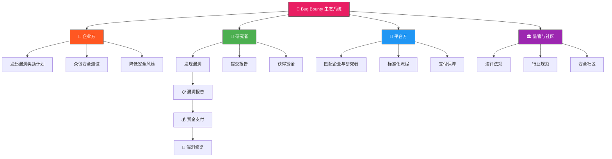
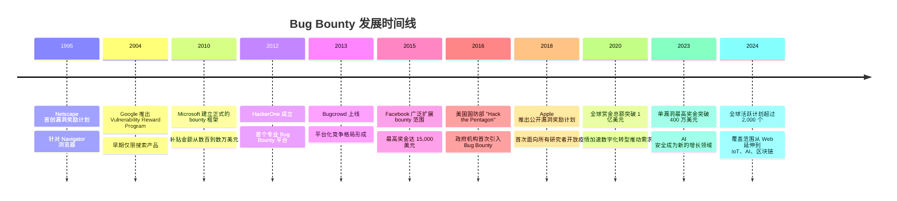
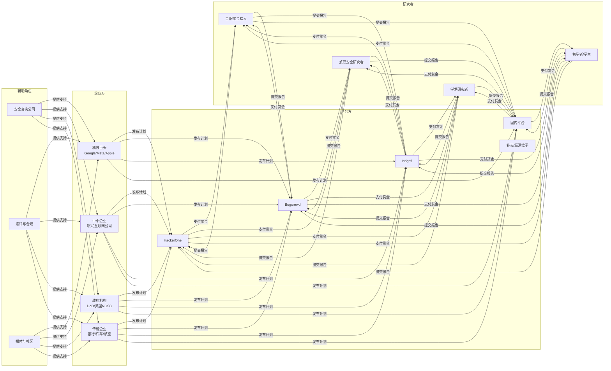
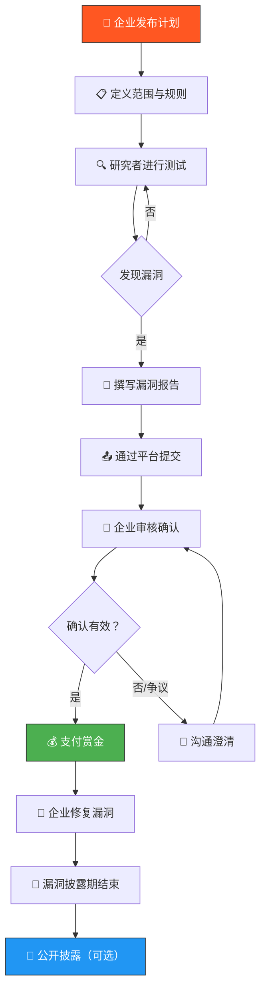
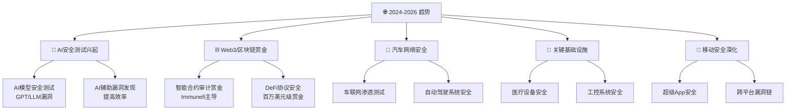

## 27.1 Bug Bounty生态系统概述

### 27.1.1 什么是Bug Bounty



漏洞赏金计划（Bug Bounty Program）是一种由组织发起的安全激励计划，承诺向发现并报告其产品或服务中安全漏洞的研究者支付报酬。这一模式的起源可以追溯到1995年，当时Netscape公司首次推出了针对其浏览器的漏洞奖励计划。此后，随着互联网的发展和网络安全威胁的日益严峻，Bug Bounty模式逐渐被主流科技公司所采纳。

Bug Bounty的核心价值在于创造了一个多方共赢的局面：

- **对企业而言**：通过众包方式获得远超内部安全团队的测试覆盖范围，以可控的成本发现潜在漏洞，降低了被恶意攻击者利用的风险。据HackerOne统计，企业每投入1美元在Bug Bounty上，平均可避免15-30美元的潜在安全损失。
- **对研究者而言**：通过合法渠道将技术能力转化为经济收益，同时建立了可验证的职业声誉。许多研究者通过Bug Bounty实现了全职安全研究者的职业转型。
- **对行业而言**：打破了传统安全测试中"企业雇佣少数安全公司"的局限，实现了安全资源的民主化分配，推动了整体安全水位的提升。

从经济学角度看，Bug Bounty本质上是一个信息市场。安全研究者拥有"漏洞信息"这一特殊商品，企业愿意为这些信息支付报酬以避免更大的潜在损失。这个市场的效率取决于多个关键因素：

| 影响因素 | 正面效应 | 负面效应 |
|---------|---------|---------|
| **信息对称性** | 研究者准确评估漏洞价值，双方达成合理交易 | 价值评估偏差导致赏金争议 |
| **交易成本** | 平台标准化流程降低沟通成本 | 复杂的规则和报告格式增加参与门槛 |
| **信任机制** | 平台托管赏金，保障双方权益 | 黑名单、信誉评分等机制可能产生不公平 |
| **竞争程度** | 激励研究者更深入地挖掘漏洞 | 同一漏洞被多人发现导致"先到先得"的零和博弈 |

### 27.1.2 Bug Bounty的发展历程

Bug Bounty的发展可以分为以下几个关键阶段，每个阶段都深刻改变了行业格局：



**萌芽期（1995—2010）**：这一时期主要是少数技术先驱公司的尝试。Netscape在1995年开创先河，但直到2004年Google才真正将这一模式制度化。Google的Vulnerability Reward Program起初只覆盖搜索引擎产品，后来逐步扩展到Chrome浏览器、Android系统和Google Cloud。这一阶段的特点是：计划数量极少（全球不超过20个）、覆盖面窄（主要集中在浏览器和搜索引擎）、奖金金额低（通常几百到几千美元）、缺乏标准化的报告和支付流程。参与Bug Bounty的研究者大多是出于学术兴趣或个人热情，尚未形成职业化的群体。

**成长期（2011—2016）**：这是Bug Bounty行业最关键的转型期。HackerOne（2012年由前Facebook安全团队创立）和Bugcrowd（2013年上线）等专业平台的出现，彻底改变了行业生态。这些平台提供的核心价值包括：标准化的漏洞报告模板、托管赏金支付保障、私密的沟通渠道、以及研究者信誉评价系统。Facebook、Microsoft、Apple等科技巨头相继推出或扩展自己的漏洞奖励计划。这一阶段的标志性事件是2016年美国国防部推出的"Hack the Pentagon"项目——这是政府机构首次正式采用Bug Bounty模式，在HackerOne平台上向研究者开放了对国防网站的安全测试，最终支付了超过10万美元的赏金。

**成熟期（2017—至今）**：Bug Bounty已经成为许多企业安全策略的标准组成部分。Google将其扩展到覆盖旗下所有产品线，单漏洞最高奖金达20.5万美元（针对Android远程代码执行漏洞）。Apple于2018年推出了面向所有研究者的公开漏洞奖励计划，最高奖金150万美元。GitHub也在2020年加入，为代码托管平台的安全漏洞提供最高3万美元的赏金。这一阶段的显著趋势包括：奖金水平持续攀升（2023年最高单笔奖金超过400万美元）、覆盖范围从传统的Web应用延伸到移动应用、API、IoT设备、AI系统和区块链智能合约、政府和国防部门大规模采用Bug Bounty、以及AI辅助安全测试工具开始进入生态。

### 27.1.3 生态系统的核心参与者

理解Bug Bounty生态系统的完整面貌，需要认识其中的每一个角色及其相互关系：



**企业方（Program Owners）**：发起和维护漏洞奖励计划的组织。它们根据自身规模和安全需求选择不同的计划模式——从完全公开的计划（任何人都可以参与）到仅限邀请的私人计划（只有经过审核的高级研究者才能参与）。企业方的核心诉求是：以合理的预算覆盖尽可能广泛的安全测试范围，同时避免法律风险和品牌声誉损害。

**平台方（Intermediaries）**：连接企业与研究者的桥梁。主要平台的定位各有侧重：

| 平台 | 创立年份 | 特点 | 赏金处理 | 主要客户类型 |
|------|---------|------|---------|------------|
| **HackerOne** | 2012 | 行业规模最大，政府客户多 | 平台托管支付 | 科技公司、政府、金融 |
| **Bugcrowd** | 2013 | 强调crowdsource模型 | 平台托管支付 | 中大型企业、SaaS |
| **Intigriti** | 2016 | 欧洲市场领先 | 平台托管支付 | 欧洲企业、金融 |
| **Immunefi** | 2020 | 专注DeFi/Web3 | 直接支付/托管 | 区块链项目 |
| **补天** | 2013 | 国内最大漏洞响应平台 | 平台支付 | 国内互联网企业 |
| **漏洞盒子** | 2014 | 国内第二大平台 | 平台支付 | 国内中小企业 |

**研究者（Researchers/Bounty Hunters）**：生态系统的执行者。根据参与程度和收入水平，可以大致分为三个层级：

- **顶级猎人**（Top 1%）：年收入超过100万美元，通常全职从事Bug Bounty，拥有数千次漏洞提交经验，在多个平台上都有极高的信誉评分。代表人物如Orange Tsai、Sam Curry、Nathaniel Wakelam等。
- **专业研究者**（Top 10%）：年收入在5万至50万美元之间，可能是全职或高频兼职。他们对特定漏洞类型有深入专长，能够稳定地发现中高危漏洞。
- **入门和业余研究者**：年收入在几千到几万美元，以兼职为主。他们正在积累经验和建立信誉，通常从低悬果实（easy-to-find vulnerabilities）开始。

**辅助角色**：包括提供Bug Bounty咨询服务的安全公司、处理跨境合规和知识产权问题的法律顾问、以及推动行业标准和最佳实践的媒体与社区（如BugBountyHunter.com、Bug Bounty Forum等）。

### 27.1.4 Bug Bounty的运作机制

一个典型的Bug Bounty计划从发布到赏金支付，涉及以下标准化流程：



**第一步：计划定义**。企业通过平台发布计划时，需要明确以下关键要素：

- **范围（Scope）**：明确哪些域名、应用、API和资产在测试范围内。例如：`*.example.com`、特定的移动应用（iOS/Android）、API端点等。范围之外的测试可能违反法律，研究者必须严格遵守。
- **规则（Rules of Engagement）**：定义可接受的测试方法。通常禁止以下行为：拒绝服务攻击（DoS/DDoS）、社会工程学攻击、物理攻击、访问其他用户的数据、利用漏洞进行进一步渗透、对生产环境造成影响。
- **赏金等级（Bounty Table）**：根据漏洞严重程度和影响范围设定奖金。典型的赏金等级如下：

| 漏洞等级 | CVSS 评分 | 典型赏金范围 | 示例漏洞类型 |
|---------|----------|------------|------------|
| **严重（Critical）** | 9.0 - 10.0 | $5,000 - $100,000+ | 远程代码执行、SQL注入获取全部数据 |
| **高危（High）** | 7.0 - 8.9 | $2,000 - $10,000 | 存储型XSS、权限提升、身份认证绕过 |
| **中危（Medium）** | 4.0 - 6.9 | $500 - $2,000 | 反射型XSS、信息泄露、CSRF |
| **低危（Low）** | 0.1 - 3.9 | $100 - $500 | 点击劫持、HTTP安全头缺失 |
| **信息（Info）** | 0 | $0 - $100 | 版本信息泄露、低风险配置问题 |

**第二步：测试与发现**。研究者根据计划范围，运用各种安全测试技术进行漏洞挖掘。这是Bug Bounty中最具技术含量的环节，也是本书后续章节（27.3—27.6）将详细展开的内容。

**第三步：报告提交**。一份高质量的漏洞报告通常包含以下要素：

```markdown
# 漏洞报告模板

## 概要
- 漏洞类型：[例如：存储型XSS]
- 影响范围：[受影响的URL/端点]
- 严重程度：[Critical/High/Medium/Low]

## 复现步骤（PoC）
1. 登录账户A
2. 访问 [具体URL]
3. 在 [具体字段] 中输入 payload：`<script>alert(1)</script>`
4. 以账户B访问 [具体页面]
5. 观察到XSS触发

## 影响分析
- 攻击者可以窃取其他用户的 session cookie
- 可以执行任意JavaScript代码
- 影响所有使用该功能的用户（预估X万用户）

## 修复建议
- 对用户输入进行输出编码
- 实施CSP策略
- 参考：OWASP XSS Prevention Cheat Sheet

## 环境信息
- 测试账户：[账户信息]
- 测试时间：[时间]
- 浏览器：Chrome 120.0
```

**第四步：审核与支付**。企业安全团队收到报告后，会按照SLA（服务等级协议）进行审核。HackerOne平台要求企业在3-5个工作日内做出首次响应。审核确认后，赏金通过平台托管账户支付给研究者。整个过程中，双方通过平台的加密渠道沟通，保护彼此的身份信息。

**第五步：修复与披露**。企业确认漏洞后，需要在约定时间内完成修复。通常有一个90天的负责任披露期限——如果90天后漏洞仍未修复，研究者有权公开披露（但通常会与企业协商延迟）。修复完成后，双方可以决定是否公开漏洞细节以促进安全社区的学习。

### 27.1.5 计划类型：公开、私密与邀请制

Bug Bounty计划按照参与门槛，可以分为三种主要类型。理解每种类型的特点，对于研究者制定参与策略至关重要：

**公开计划（Public Programs）**：任何人都可以注册并参与测试。优点是入门门槛低，适合新手积累经验。缺点是竞争激烈，同一漏洞可能被多人发现，只有第一个提交有效报告的人能获得赏金。公开计划通常出现在HackerOne的公开目录和Bugcrowd的Open programs列表中。

**私密计划（Private/Invite-only Programs）**：只有经过平台审核或被邀请的研究者才能参与。进入私密计划通常需要满足以下条件之一：在公开计划中有良好的提交记录（低无效报告率）、获得平台的信誉评分达标（如HackerOne的"KUDOS"积分）、被平台算法识别为高质量研究者。私密计划的竞争相对较小，赏金通常也更高，且企业对报告的响应更积极。

**混合模式**：许多企业采用分阶段发布的策略——先以私密计划形式运行一段时间，随着漏洞报告数量下降（意味着"低垂果实"已被发现），再转为公开计划以吸引更多研究者。这种策略在企业初次推出Bug Bounty计划时非常常见。

对于中国研究者而言，国内的补天和漏洞盒子平台主要以国内互联网企业为计划主体，语言和沟通无障碍是其优势。但全球性平台（HackerOne、Bugcrowd）上的国际计划通常提供更高的奖金，值得作为进阶目标。

### 27.1.6 当前市场格局与趋势

根据HackerOne《2023 Hacker Report》、Bugcrowd《2023 Priority Poll》以及Synack等平台的公开数据，全球Bug Bounty市场呈现以下关键特征：

**市场规模与增长**：2022年仅通过HackerOne平台支付的赏金总额就超过2.5亿美元，同比增长超过20%。考虑到Bugcrowd、Intigriti、Immunefi等平台以及各企业自营计划的赏金支出，全球Bug Bounty市场总规模估计在5-8亿美元之间。预计到2027年将突破15亿美元，年复合增长率约20-25%。

**研究者群体画像**：

| 指标 | 数据 |
|------|------|
| 全球活跃研究者估计数 | 50-100万人 |
| 研究者数量最多的国家 | 印度（约25%）、美国（约15%）、俄罗斯（约8%）、中国（约5%） |
| 研究者平均年收入 | $25,000-$50,000（全职） |
| 顶级猎人年收入 | $500,000-$2,000,000+ |
| 最受欢迎的漏洞类型 | XSS（约占18%）、信息泄露（约15%）、访问控制缺陷（约12%） |
| 从发现到支付的平均时间 | 15-30天 |

**中国市场现状**：随着国内互联网企业安全意识的提升，中国市场的Bug Bounty生态正在快速发展：

- **补天平台**（qianlan.org）：由360旗下启明星辰运营，是国内最大的漏洞响应平台，覆盖数百家企业。
- **漏洞盒子**（vulbox.com）：第二大国内平台，为企业提供安全众测服务。
- **企业自营计划**：腾讯、阿里巴巴、百度、字节跳动等巨头都建立了自己的SRC（安全应急响应中心），提供独立的漏洞提交渠道和赏金。
- **国内赏金水平**：相比国际平台仍有差距，但头部企业的奖金已接近国际水准（严重漏洞通常在¥50,000-¥200,000之间）。

**关键趋势**：



- **AI安全测试**：随着大语言模型的普及，针对AI系统的安全测试（提示注入、数据泄露、模型对抗攻击）成为新的增长点。OpenAI、Anthropic等AI公司已推出或计划推出专门的Bug Bounty计划。
- **Web3与区块链赏金**：DeFi协议的安全事件频发推动了区块链领域的Bug Bounty市场。Immunefi平台上的DeFi项目单漏洞赏金经常超过100万美元，最高达1000万美元级别。
- **汽车行业网络安全**：随着智能网联汽车的普及，汽车制造商开始将Bug Bounty引入车辆安全领域。丰田、宝马、奔驰等企业已与HackerOne合作推出汽车安全计划。
- **AI辅助安全测试**：AI工具正在被用于自动化漏洞扫描、报告撰写辅助和攻击路径规划，但尚不能替代人类研究者的创造性思维和深度分析能力。

### 27.1.7 新手入门指南

如果你是Bug Bounty的新手，以下是经过验证的入门路径：

**第一阶段：基础技能准备（1-3个月）**

在开始Bug Bounty之前，你需要建立扎实的安全基础知识：

1. **Web安全基础**：理解OWASP Top 10（每两年更新一次的Web应用安全风险清单），重点掌握XSS、SQL注入、CSRF、IDOR等核心漏洞类型的原理和利用方法。
2. **网络协议**：熟练使用浏览器开发者工具（Network/Console标签），理解HTTP请求/响应结构、Cookie机制、CORS策略。
3. **Linux基础**：能够使用命令行工具进行基本操作，理解文件权限、进程管理。
4. **编程能力**：至少掌握一门脚本语言（Python/JavaScript/Bash），能够编写简单的自动化脚本。

**第二阶段：平台注册与首个目标（1-2个月）**

1. **选择平台**：建议从HackerOne（注册地址：hackerone.com）或Bugcrowd（bugcrowd.com）开始。国内研究者可以先从补天（qianlan.org）入手，熟悉报告流程后再拓展到国际平台。
2. **选择入门目标**：优先选择以下类型的公开计划——范围明确（只覆盖少数域名和功能）、赏金表清晰（不同严重程度的奖金明确）、历史报告多（可以参考已公开的报告学习）、响应速度快（通常在几天内回复）。
3. **学习优秀报告**：HackerOne的Hacker Activity页面和Bugcrowd的Bug Bounty 101资源库提供了大量公开的漏洞报告。仔细阅读这些报告，理解什么是一份优秀的PoC。

**第三阶段：建立信誉（3-6个月）**

- 初期不要追求赏金金额，而是追求报告质量。一份被接受的$50报告，比十份被关闭的$5,000报告更有价值。
- 在HackerOne上争取获得"KUDOS"积分，这将帮助你进入更多私密计划。
- 遵循负责任披露原则，不测试范围之外的目标，不进行可能造成系统影响的攻击。

**预期收入**：新手在前3-6个月通常收入有限（$0-$2,000），但随着经验积累，第6-12个月可以期望每月$1,000-$5,000的稳定收入。1-2年后，如果能持续投入时间，年收入$20,000-$50,000是一个合理的目标。

### 27.1.8 常见误区与纠正

新手在进入Bug Bounty领域时常犯以下错误：

| 误区 | 事实 | 纠正方法 |
|------|------|---------|
| "Bug Bounty能快速致富" | 顶级猎人的高收入背后是数年的积累和极高的技术投入 | 设定合理预期，将Bug Bounty视为长期技能投资 |
| "扫描器能代替手工测试" | 自动化工具只能发现已知漏洞模式，创造性漏洞需要人工思维 | 将扫描器作为辅助工具，核心竞争力在于手工测试和逻辑分析 |
| "报告漏洞越多越好" | 大量无效报告（triage rejected）会损害你的信誉评分 | 宁可提交一份经过充分验证的高质量报告 |
| "任何网站都可以测试" | 测试计划范围之外的目标可能违反计算机犯罪法 | 严格遵守计划范围，测试前确认目标在scope内 |
| "找到漏洞就能拿赏金" | 漏洞必须符合计划的严重程度门槛，且不能是已知问题 | 确认漏洞满足赏金表中的最低严重程度要求 |
| "一个人单干效率最高" | 合理分工（一人专攻XSS，一人专攻逻辑漏洞）可以显著提高效率 | 与志同道合的研究者组建小型团队，分工协作 |

### 27.1.9 小结

Bug Bounty生态系统经过近30年的发展，已经形成了一个成熟且充满活力的全球市场。它为企业提供了一种高效、灵活的安全测试方式，同时也为安全研究者开辟了一条将技术能力变现的职业道路。

对于有志于通过Bug Bounty变现的读者而言，关键要点是：

1. **理解生态全貌**：认识企业、平台、研究者和辅助角色各自的诉求和约束条件，才能找到最优的参与策略。
2. **选择合适的切入点**：从与自身技能水平匹配的公开计划开始，逐步拓展到更高级的私密计划。
3. **重视信誉建设**：在Bug Bounty领域，信誉就是货币。一份被接受的高质量报告的价值远超赏金本身。
4. **保持长期视角**：顶级猎人的成功是技术深度、经验积累和持续投入的共同结果，没有捷径可走。

在接下来的章节中，我们将深入探讨具体的漏洞挖掘技术（27.3-27.6）、报告撰写技巧（27.7）以及收入最大化策略（27.8），帮助你从入门走向精通。
