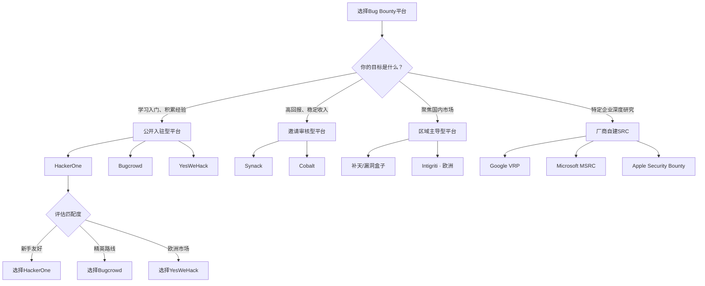
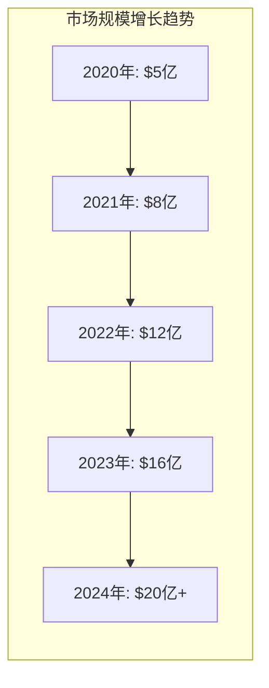
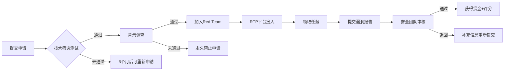
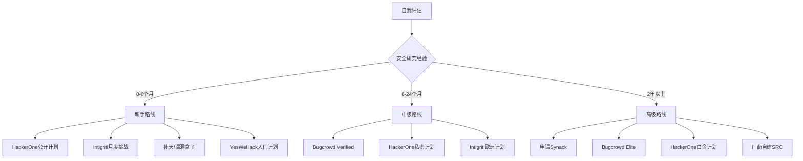

## 27.2 主要Bug Bounty平台分析

Bug Bounty平台是连接安全研究者与企业之间的桥梁。它们提供了标准化的漏洞报告流程、支付保障机制和争议仲裁服务，大幅降低了双方直接合作的信任门槛。选择正确的平台，直接决定了你的投入产出比——在错误的平台上深耕数年可能一无所获，而在正确的平台上半年就能建立稳定的收入来源。本章将从平台定位、核心机制、优劣势对比和选择策略四个维度，对全球主流Bug Bounty平台进行全面深度分析。

---

### 27.2.1 平台生态全景

Bug Bounty平台可以按照运营模式划分为四大类，每一类都有其独特的价值定位和适用场景：

| 分类 | 代表平台 | 核心特征 | 准入门槛 | 收入天花板 |
|------|----------|----------|----------|-----------|
| **公开入驻型** | HackerOne、Bugcrowd | 开放注册，按报告质量建立信誉 | 低（注册即可参与公开计划） | 中高（依赖信誉等级） |
| **邀请审核型** | Synack、Cobalt | 严格筛选，受控测试环境 | 高（需通过技术审核+背景调查） | 高（有保底收入） |
| **区域主导型** | 补天、漏洞盒子、Intigriti | 聚焦特定地域或行业 | 中（区域限制或语言要求） | 中（受区域市场限制） |
| **厂商自建型** | Google VRP、Microsoft MSRC、Apple Security Bounty | 企业直接运营，无中间平台 | 中（需遵守严格规则） | 极高（顶级计划赏金可达百万美元） |



**图27-1：Bug Bounty平台选择决策树** — 根据自身目标、经验和市场定位筛选最合适的平台。

**行业规模数据（2024-2025）：**

根据HackerOne和Bugcrowd联合发布的行业报告，全球Bug Bounty市场规模已突破20亿美元，年增长率保持在25%以上。主要驱动因素包括：

- **企业安全预算增长**：全球企业平均安全预算占IT总预算的比例从2020年的5.3%上升至2024年的9.1%
- **合规要求推动**：PCI DSS 4.0、ISO 27001:2022等标准明确鼓励或要求漏洞披露计划
- **研究者群体扩大**：全球活跃Bug Bounty研究者超过150万人，其中年收入超过$100,000的约有2,000人
- **赏金水平上涨**：Critical漏洞的平均赏金从2020年的$2,000上涨至2024年的$4,500



**图27-2：全球Bug Bounty市场规模增长趋势** — 数据来源：HackerOne Annual Report, Bugcrowd Industry Report

---

### 27.2.2 HackerOne — 全球最大Bug Bounty平台

#### 平台概况

HackerOne成立于2012年，总部位于美国旧金山，是全球漏洞赏金领域的标杆平台。其创始团队包括多位前微软和美国国防部安全专家，平台基因深植于"负责任披露"理念。

**关键数据（截至2025年Q1）：**

| 指标 | 数据 | 说明 |
|------|------|------|
| 注册安全研究者 | 超过100万名 | 覆盖190+国家和地区 |
| 活跃漏洞计划 | 超过3,000个 | 含公开计划和私密计划 |
| 累计支付赏金 | 超过5亿美元 | 全球Bug Bounty平台之最 |
| 有效漏洞报告 | 超过40万份 | 覆盖OWASP Top 10所有类别 |
| 客户企业 | 超过2,500家 | 含70%的福布斯500强科技公司 |
| 平均首次响应 | 公开计划5.2天，私密计划2.1天 | 2024年数据 |
| 平均支付周期 | 确认后14天内 | 支持PayPal、银行转账、USDC |

**知名客户企业（部分）：**

| 行业 | 代表企业 |
|------|---------|
| 科技巨头 | Google、Microsoft、GitHub、Meta、Amazon |
| 金融科技 | PayPal、Visa、Goldman Sachs、Coinbase |
| 互联网服务 | Twitter(X)、Uber、Dropbox、Slack |
| 政府机构 | 美国国防部（Hack the Pentagon）、新加坡国防部 |
| 电信运营商 | AT&T、Verizon、T-Mobile |

#### 核心机制详解

**1. 信誉系统（Reputation System）**

HackerOne的信誉系统是其核心竞争壁垒。信誉积分直接影响研究者能否获得私密计划邀请和更高的赏金上限。理解这套系统是每个HackerOne研究者的必修课。

| 信誉等级 | 所需积分 | 权益 | 典型特征 |
|----------|---------|------|---------|
| 入门（Newcomer） | 0-99 | 参与公开计划 | 刚注册，尚无有效报告 |
| 青铜（Bronze） | 100-499 | 部分私密计划邀请 | 已有3-5个有效报告 |
| 白银（Silver） | 500-999 | 更多私密计划 + Signal提升 | 稳定产出，接受率>50% |
| 黄金（Gold） | 1000-2499 | 高价值私密计划 + 优先审核 | 多个Critical/High漏洞 |
| 白金（Platinum） | 2500+ | 顶级私密计划 + 直接与企业沟通 | 行业顶尖研究者 |

**信誉积分增减规则详解：**

| 行为 | 积分变动 | 说明 |
|------|---------|------|
| 提交有效漏洞（Critical） | +50分 | 最高奖励，需要严重的安全影响 |
| 提交有效漏洞（High） | +25分 | 显著安全影响 |
| 提交有效漏洞（Medium） | +10分 | 中等安全影响 |
| 提交有效漏洞（Low） | +5分 | 轻微安全影响 |
| 提交高质量报告 | 额外+10分 | 需包含完整PoC、复现步骤和修复建议 |
| 被标记为重复报告 | -5分 | 首次可申诉，多次则不可 |
| 提交低质量/误报报告 | -10至-50分 | 严重影响Signal评分 |
| 违反平台规则 | -100分以上 | 严重者永久封号 |
| 安全审计贡献 | +5至+20分 | 参与安全审计或代码审查 |

**2. Signal与Impact双维度评估**

Signal反映研究者的报告质量信誉，Impact反映发现漏洞的实际危害程度。两者共同决定了研究者在平台上的综合评级。

```text
Signal = 有效报告数 / 总提交数 × 100（越高说明准确率越高）
Impact = 所有漏洞的CVSS加权评分之和（越高说明发现能力越强）
综合评级 = Signal × 0.6 + Impact × 0.4
```

**Signal评分的实际意义：**
- Signal > 80%：极高质量，企业高度信任，审核速度最快
- Signal 60-80%：良好水平，大部分企业认可
- Signal 40-60%：一般水平，可能被部分计划拒绝
- Signal < 40%：需要提升报告质量，否则会被限制参与计划

**3. 私密计划（Private Programs）机制**

私密计划是HackerOne的核心优势——它们不对外公开，仅邀请信誉达标的研究者参与。

**私密计划 vs 公开计划对比：**

| 维度 | 私密计划 | 公开计划 |
|------|---------|---------|
| 参与人数 | 通常50-500人 | 可达数千至数万人 |
| 平均赏金 | $2,000-$8,000 | $200-$2,000 |
| 首次响应时间 | 1-3天 | 5-10天 |
| 重复报告率 | 较低（10-20%） | 极高（40-70%） |
| 企业沟通效率 | 高（直接对接安全团队） | 低（需通过平台协调） |
| 获得难度 | 需信誉达标 | 注册即可参与 |

**获得私密计划邀请的常见路径：**

1. **积累信誉分**：在公开计划中持续提交高质量报告，信誉分达到100+即可收到首批私密计划邀请
2. **Skill Challenge测试**：HackerOne定期举办Skill Challenge（如Hacker101 CTF），通过后可能被企业直接关注
3. **社区活跃度**：在HackerOne社区的Discord群组中积极参与讨论，分享技术见解
4. **CTF比赛**：参加HackerOne组织的H1-702等CTF比赛，优胜者通常会收到私密计划邀请
5. **高质量报告**：一篇包含完整PoC、影响分析和修复建议的优秀报告，可能直接触发私密计划邀请
6. **HackerOne团队创建**：组建团队（Team）后，团队成员的信誉可以共享，加速私密计划获取

#### 平台优劣势分析

**优势：**
- 市场规模最大，计划种类最丰富（覆盖Web、移动、IoT、云安全等所有领域）
- 信誉系统成熟，长期积累可形成竞争壁垒
- 学习资源丰富（Hacker101免费课程、CTF、社区周报、HackerOne Disclosure Policy）
- 支付方式多样（PayPal、银行转账、USDC加密货币）
- 支持团队模式，可以组建团队共享信誉和计划访问权限
- 平台API支持，可以自动化报告状态查询

**劣势：**
- 新人竞争激烈，热门公开计划（如Google、Microsoft）可能有数千人同时测试
- 重复报告率极高（热门计划的首个到达者优势明显）
- 部分企业响应缓慢，审核周期长达数周
- 平台抽成较高（企业端收取20%-25%服务费，研究者端无直接抽成但企业可能因此降低赏金）
- 信誉系统对新人不够友好，初期积累速度慢

#### 上手实操指南

**注册与配置流程：**

1. 访问 [hackerone.com](https://hackerone.com)，使用GitHub账号或邮箱注册
2. 完善个人资料：添加头像、Twitter链接、个人简介（增加可信度，企业更倾向邀请资料完整的研究者）
3. 设置Two-Factor Authentication（2FA）保护账户安全
4. 在 Settings → Payments 中配置支付方式
5. 填写W-8BEN（非美国居民税务表格，可免除30%预扣税）
6. 浏览公开计划列表，选择1-2个目标开始研究
7. 加入HackerOne的Discord社区，了解最新动态

**第一个漏洞提交模板：**

```markdown
## 漏洞概述
[一句话描述漏洞类型和影响，例如："发现目标网站存在存储型XSS漏洞，
攻击者可窃取所有用户的会话Cookie"]

## 影响分析
[该漏洞可能被如何利用，造成什么后果]
- 攻击向量：[URL/参数/功能点]
- 影响范围：[受影响的用户数量/数据类型]
- CVSS评分：[自评分数及依据]
- 漏洞类型：[CWE编号]

## 复现步骤
1. [具体操作步骤1]
2. [具体操作步骤2]
3. [具体操作步骤3]
4. [具体操作步骤N]

## PoC代码
[提供可直接运行的证明代码]

## 修复建议
[给出具体的修复方案，包含代码示例]

## 附件
- PoC代码/截图：[提供证明]
- 测试环境：[浏览器版本/工具版本]
- 录屏（可选）：[展示完整复现过程]
```

**关键注意事项：**
- 提交前务必搜索目标计划的历史报告，避免重复（使用HackerOne的搜索功能）
- 严格遵循企业设定的测试范围（Scope），越界测试可能导致封号
- 禁止使用自动化扫描器对目标进行大规模扫描（多数计划明令禁止）
- 发现问题后不要对外公开，遵循负责任的披露流程
- 报告提交后不要频繁催促企业审核，耐心等待
- 如果报告被标记为重复，不要气馁——分析为什么没找到，提升下次的效率

---

### 27.2.3 Bugcrowd — 精英化运营的典范

#### 平台概况

Bugcrowd成立于2012年，总部位于美国旧金山，以"精英化"和"高质量"著称。相比HackerOne的规模优势，Bugcrowd更注重研究者的质量和漏洞报告的精准度。其独特的Priority Score算法确保研究者能获得最匹配的目标。

**关键数据（截至2025年Q1）：**

| 指标 | 数据 | 说明 |
|------|------|------|
| 注册研究者 | 超过60万名 | 覆盖150+国家 |
| 活跃计划 | 超过1,000个 | 含公开与私密计划 |
| 累计支付赏金 | 超过2亿美元 | 年增长率30%+ |
| 知名客户 | Tesla、Spotify、Mastercard、GitHub、Microsoft | 金融科技和科技行业为主 |
| 核心差异化 | Bugcrowd Elite项目 | 平台评审认证的顶级研究者群体 |

#### Bugcrowd Elite机制详解

Bugcrowd Elite是平台最独特的研究者评级体系，分为五个等级。Elite认证意味着你被平台认可为高质量研究者，能获得更好的计划邀请和更高的赏金。

| Elite等级 | 评定标准 | 专属权益 |
|-----------|----------|----------|
| Top Hacker | 平台排名前1% | 最高优先级计划邀请、专属客服、年度峰会邀请、提前体验新功能 |
| Elite | 平台排名前5% | 高价值私密计划、优先支付处理、专属沟通渠道 |
| Verified | 通过身份验证 + 一定接受率 | 更多私密计划访问权限、快速审核通道 |
| Registered | 注册用户 | 访问公开计划、基础学习资源 |
| Beginning | 新注册用户 | 基础公开计划、Bugcrowd University课程 |

**如何晋升Elite等级：**

1. **持续提交高质量漏洞**：至少10个以上被接受的Critical/High级别漏洞
2. **保持高接受率**：维持30%以上的接受率（Acceptance Rate）
3. **参与社区活动**：参加Bugcrowd网络研讨会、线下聚会、Bug Bash活动
4. **完成培训**：完成Bugcrowd University的系统化培训课程
5. **获得正面评价**：企业客户的Post-Remediation Feedback（漏洞修复后的反馈评价）

**Elite认证的实际价值：**
- Top Hacker级别的研究者平均年收入可达$150,000-$300,000
- Elite认证后收到的计划邀请质量提升3-5倍
- 部分企业只为Elite研究者开放高额赏金计划

#### Bugcrowd Priority Score（优先级评分）

Bugcrowd使用独特的Priority Score算法来匹配研究者与计划，这是与其他平台最大的差异化优势：

```text
Priority Score = Researcher Skill Match × 0.4 + 
                 Past Performance × 0.3 + 
                 Program Relevance × 0.2 + 
                 Availability × 0.1
```

- **Researcher Skill Match（40%）**：研究者的技术栈与计划目标的匹配度，包括擅长的漏洞类型、测试工具、行业经验
- **Past Performance（30%）**：在类似计划上的历史表现，包括接受率、报告质量评分、响应速度
- **Program Relevance（20%）**：研究者与计划所在行业的关联性，例如金融行业经验的研究者会被优先匹配金融类计划
- **Availability（10%）**：研究者的近期活跃度，长期不活跃会降低匹配权重

**实际应用建议：**
- 完善个人资料中的技能标签（Skill Tags），让算法更准确匹配
- 定期活跃（至少每周登录一次），保持Availability分数
- 优先完成与自身技能匹配的计划，积累Past Performance

#### Bug Bounty与VDP双轨制

Bugcrowd的独特之处在于同时提供漏洞赏金计划（Bug Bounty）和漏洞披露计划（VDP）：

| 维度 | Bug Bounty | VDP |
|------|-----------|-----|
| 是否提供赏金 | 是 | 否（仅认可贡献） |
| 目标类型 | 有安全预算的企业 | 中小企业或合规需求企业 |
| 测试范围 | 明确限定 | 相对宽泛 |
| 审核速度 | 较快（有激励） | 较慢（依赖企业配合） |
| 适合研究者 | 追求变现的成熟研究者 | 积累经验的新手 |
| 信誉积累 | 可用于Elite晋升 | 不计入Elite评分 |

**VDP的价值：**
VDP虽然没有直接经济回报，但对于新手来说是积累信誉和建立漏洞报告能力的绝佳起点。通过VDP提交的报告可以获得平台认可，为后续参与Bug Bounty计划打下基础。

#### 平台优劣势分析

**优势：**
- Elite研究者市场竞争压力小，赏金单价高于HackerOne平均
- Priority Score算法使研究者能获得更匹配的目标，减少无效探索
- Bugcrowd University提供系统化的培训资源（Web Security 101、API Security等课程）
- 支付流程透明，争议仲裁机制完善
- 支持团队模式，可以组建Crowd（团队）共享资源
- 提供Bug Bash活动——在特定时间段内集中测试特定目标，赏金翻倍

**劣势：**
- 公开计划数量远少于HackerOne
- 新人晋升Elite门槛较高，需要较长的积累期（通常6-12个月）
- 亚洲地区计划覆盖较少，中国相关计划有限
- 部分计划的测试范围描述不够清晰，需要主动与安全团队沟通
- 企业端抽成20%-25%，可能影响赏金设置

---

### 27.2.4 Synack — 邀请制顶级平台

#### 平台概况

Synack成立于2013年，采用完全邀请制的"红队即服务"（Red Team as a Service）模式。与HackerOne和Bugcrowd不同，Synack不对公众开放——所有研究者必须通过严格的技术审核和背景调查才能加入。这种模式确保了平台上的研究者都是经过验证的精英。

**平台特色：**

| 特色 | 说明 | 优势 |
|------|------|------|
| 严格准入 | 通过率约20%，审核内容包括技术测试和背景调查 | 低竞争环境，研究者质量高 |
| 受控环境 | 使用Synack的Red Team Platform（RTP）进行测试 | 法律风险最低 |
| 稳定收入 | 计时补偿机制，有效测试时间按小时计费 | 即使未发现漏洞也有收入保障 |
| 团队协作 | 支持组建团队，分工协作攻克大型系统 | 提高复杂系统的测试效率 |
| 企业信任 | Synack审核过的研究者，企业信任度最高 | 更容易获得测试权限 |

**收入数据：**
- 全职研究者月收入中位数：$8,000-$15,000
- 顶尖研究者年收入：$100,000-$300,000
- 计时补偿费率：$30-$100/小时（取决于技能等级）

#### 加入流程详解



**技术审核阶段考察内容（权重分布）：**

| 考察领域 | 权重 | 考察内容 | 准备建议 |
|----------|------|---------|---------|
| Web Application Penetration Testing | 40% | SQL注入、XSS、CSRF、SSRF等OWASP Top 10 | 练习DVWA、HackTheBox Web模块 |
| Network Penetration Testing | 30% | 端口扫描、服务识别、漏洞利用、内网横向移动 | 熟悉Nmap、Metasploit、BloodHound |
| Mobile Security | 20% | Android/iOS应用逆向分析、API接口安全测试 | 练习Frida、Objection、Burp Suite Mobile |
| Reverse Engineering | 10% | 二进制分析基础、固件安全测试 | 学习Ghidra、IDA Pro基础操作 |

**审核准备时间线：**
- 第1-2周：复习Web安全基础，完成OWASP Top 10练习
- 第3-4周：练习网络渗透测试，搭建本地靶场
- 第5-6周：学习移动端安全，逆向工程基础
- 第7-8周：综合模拟测试，准备申请材料
- 第9周：提交申请，等待审核（1-3个月）

#### 收入与激励机制

Synack的报酬体系与其他平台有显著差异，计时补偿是其核心竞争力：

| 收入构成 | 说明 | 占比 | 金额范围 |
|----------|------|------|---------|
| 漏洞赏金 | 按CVSS评分支付固定赏金 | 60% | $100-$10,000 |
| 计时补偿 | RTP平台上有效测试时间按小时计费 | 25% | $30-$100/h |
| 月度奖金 | 根据当月总贡献发放额外奖金 | 10% | $500-$3,000 |
| 里程碑奖励 | 完成特定目标后的额外激励 | 5% | $1,000-$5,000 |

**计时补偿的深层价值：**

计时补偿是Synack的独特优势——即使没有发现高危漏洞，投入的时间也有收入保障。这对全职研究者非常有吸引力。举例说明：

```text
假设场景：全职研究者每周投入40小时
- 有效测试时间：约30小时/周（去除报告撰写和沟通时间）
- 计时补偿：30小时 × $50/h = $1,500/周
- 月度计时收入：$6,000
- 加上月均发现2个High漏洞：$3,000
- 加上月度奖金：$1,500
- 月均总收入：$10,500
```

#### 平台优劣势分析

**优势：**
- 低竞争环境，每个任务分配给少量研究者（通常3-5人）
- 有固定收入保障（计时补偿），降低全职风险
- 法律风险最低（在RTP受控环境中测试，Synack提供法律保障）
- 社区氛围好，资深研究者乐于分享技术经验
- 企业信任度高，测试权限更宽松

**劣势：**
- 准入门槛极高，不适合新手（需要2年以上渗透测试经验）
- 申请周期长（平均1-3个月）
- 测试受限于RTP环境，部分真实场景无法模拟
- Synack对报告质量要求极高，格式不规范会被退回
- 计时补偿有最低有效时间要求（通常15分钟起计）

---

### 27.2.5 区域特色平台分析

#### YesWeHack — 欧洲新锐力量

YesWeHack成立于2015年，总部位于法国，是欧洲增长最快的Bug Bounty平台之一，也是Intigriti的主要竞争对手。

**核心特征：**
- **GDPR合规**：完全符合欧盟GDPR要求，特别适合处理欧盟用户数据的企业
- **透明定价**：企业端费用透明，研究者端无抽成
- **快速支付**：确认漏洞后平均7天内支付，行业最快
- **Bug Bounty Policy模板**：为企业提供标准化的漏洞披露政策模板
- **月度挑战**：定期举办安全挑战赛，奖金丰厚

**适用场景：**
- 希望进入欧洲市场的研究者
- 专注于法国、德国、瑞士等法语/德语区企业的研究者
- 追求快速支付和透明规则的研究者

#### Intigriti — 欧洲市场领导者

Intigriti成立于2016年，总部位于比利时，是欧洲最大的Bug Bounty平台之一。

**核心特征：**
- **区域优势**：在欧洲企业市场占有率高，尤其适合研究欧洲SaaS产品
- **合规优势**：完全符合GDPR要求，适合处理欧盟用户数据的企业
- **每月挑战**：独特的月度XSS挑战赛，是学习XSS的经典资源
- **社区文化**：欧洲安全社区的交流氛围较为友善，新手友好度较高

**适用场景：**
- 对欧洲科技公司（Spotify、ING银行、Proximus等）有兴趣的研究者
- 希望专注于GDPR合规相关漏洞的研究者
- 刚入门、想找竞争压力较小平台的新手

**YesWeHack vs Intigriti对比：**

| 维度 | YesWeHack | Intigriti |
|------|-----------|-----------|
| 总部 | 法国 | 比利时 |
| 注册研究者 | 50,000+ | 80,000+ |
| 活跃计划 | 300+ | 500+ |
| 支付速度 | 7天 | 10天 |
| 新手友好度 | ★★★★☆ | ★★★★★ |
| 独特优势 | 法语区企业资源 | XSS月度挑战 |

#### 补天平台 — 中国最大漏洞响应平台

补天平台（https://butian.360.cn）由360安全公司运营，是中国最大的漏洞响应平台。

**平台数据（截至2024年）：**

| 指标 | 数据 | 说明 |
|------|------|------|
| 注册白帽子 | 超过25万名 | 中国最大的白帽子社区 |
| 累计收录漏洞 | 超过50万条 | 覆盖Web、移动、IoT等所有领域 |
| 合作企业 | 超过6,000家 | 包括BAT、字节跳动、美团等 |
| 累计发放奖金 | 超过8,000万人民币 | 年增长率20%+ |

**核心机制：**

| 维度 | 说明 |
|------|------|
| 漏洞评级 | 严重/高/中/低四个等级，对应CVSS 3.0评分 |
| 奖金范围 | 严重漏洞(¥5,000-¥50,000)、高危(¥1,000-¥10,000)、中危(¥200-¥2,000)、低危(¥50-¥500) |
| 积分系统 | 每提交有效漏洞获得对应积分，积分影响等级和权益 |
| 等级制度 | LV1-LV10十个等级，高等级获得更多平台权益 |
| 特色活动 | 月度排行榜、年度峰会（补天白帽大会） |

**平台特色：**
- **SRC合作模式**：与企业安全响应中心（SRC）深度合作，大部分企业使用补天的报告流转系统
- **企业直通**：优秀白帽子可获得企业直接聘用机会
- **法律保护**：补天提供法律保障函，降低白帽子的法律风险
- **社区活动**：定期举办线下技术沙龙和培训
- **漏洞趋势报告**：定期发布行业漏洞趋势分析，帮助研究者了解热点方向

**注意事项：**
- 国内平台报告需使用中文撰写
- 部分企业存在奖金发放不及时的情况（平均15-30天）
- 严格遵守《网络安全法》，不得越权测试
- 建议保留所有沟通记录作为法律证据
- 国内平台的漏洞评级标准可能与国际平台不同，需注意适配

#### 漏洞盒子 — 创新运营模式

漏洞盒子（https://www.loudonghezi.com/）是另一家中国主流漏洞平台，由斗象科技（Tophant）运营。

**差异化特点：**
- **企业SRC托管**：为超过400家企业提供SRC托管服务
- **众测服务**：除常规漏洞报告外，还提供定向众测（企业指定时间段集中测试）
- **安全人才对接**：平台同时充当安全人才中介，优秀研究者可获得企业内推
- **漏洞库沉淀**：积累了大量漏洞复现和防护知识，是学习实战漏洞的重要资源

**补天 vs 漏洞盒子对比：**

| 维度 | 补天 | 漏洞盒子 |
|------|------|----------|
| 运营方 | 360 | 斗象科技 |
| 重点领域 | 综合企业、政府 | 金融、电商、运营商 |
| 奖金中位数 | ¥500-¥2,000 | ¥300-¥1,500 |
| 审核速度 | 平均7-14天 | 平均5-10天 |
| 社区活跃度 | 较高（线下活动多） | 中等（偏线上） |
| 企业直通车 | 有（补天白帽大会） | 有（FreeBuf大会） |
| 特色优势 | 企业覆盖广 | 金融行业深度 |

#### 厂商自建SRC

除了第三方平台外，许多大型科技公司建立了自己的安全应急响应中心（SRC），直接在自身平台上运营漏洞赏金计划：

| 厂商SRC | 网址 | 主要关注领域 | 赏金范围 | 特色 |
|---------|------|-------------|---------|------|
| 腾讯安全应急响应中心（TSRC） | security.tencent.com | 微信、QQ、腾讯云 | ¥1,000-¥100,000 | 活跃度高，响应快 |
| 阿里安全应急响应中心（ASRC） | asrc.alibaba.com | 淘宝、支付宝、阿里云 | ¥500-¥100,000 | 生态覆盖广 |
| 字节跳动安全中心（BSRC） | security.bytedance.com | 抖音、TikTok、飞书 | ¥500-¥50,000 | 新兴平台，机会多 |
| 百度安全中心（BSRC） | bsrc.baidu.com | 百度搜索、百度云 | ¥200-¥50,000 | AI安全方向独特 |
| 网易安全中心（NSRC） | nsrc.netease.com | 网易游戏、网易云音乐 | ¥200-¥30,000 | 游戏安全深度 |
| 京东安全中心（JSRC） | jsrc.jd.com | 京东商城、京东物流 | ¥500-¥20,000 | 电商物流安全 |
| 小红书安全中心 | bounty.xiaohongshu.com | 小红书App、社区 | ¥500-¥30,000 | 社交电商安全 |
| 华为PSIRT | consumer.huawei.com | 鸿蒙系统、华为云 | ¥1,000-¥200,000 | IoT和移动安全 |
| 小米安全中心 | sec.xiaomi.com | MIUI、小米IoT | ¥500-¥50,000 | 智能家居安全 |

**自建SRC vs 第三方平台对比：**

| 维度 | 自建SRC | 第三方平台 |
|------|---------|-----------|
| 漏洞响应速度 | 通常更快（内部流程短） | 取决于平台协调效率 |
| 赏金支付 | 直接发放，无中间抽成 | 平台抽成15%-25% |
| 私密计划数量 | 全部公开 | 大量私密计划 |
| 信誉积累 | 仅适用于该公司 | 跨平台通用信誉 |
| 法律保障 | 企业提供 | 平台提供Mediation服务 |
| 报告模板 | 各企业自定义 | 平台标准化模板 |
| 沟通效率 | 直接对接安全团队 | 通过平台协调 |

---

### 27.2.6 全球平台深度对比分析

#### 五维评分对比

| 平台 | 规模 | 新手友好 | 赏金水平 | 私密计划 | 学习资源 |
|------|------|---------|---------|---------|---------|
| HackerOne | ★★★★★ | ★★★★☆ | ★★★★☆ | ★★★★★ | ★★★★★ |
| Bugcrowd | ★★★★☆ | ★★★☆☆ | ★★★★★ | ★★★★☆ | ★★★★☆ |
| Synack | ★★☆☆☆ | ★☆☆☆☆ | ★★★★★ | ★★★★★ | ★★☆☆☆ |
| YesWeHack | ★★★☆☆ | ★★★★☆ | ★★★☆☆ | ★★★☆☆ | ★★★☆☆ |
| Intigriti | ★★★☆☆ | ★★★★★ | ★★★☆☆ | ★★★☆☆ | ★★★★☆ |
| 补天 | ★★★★☆ | ★★★★☆ | ★★★☆☆ | ★★★☆☆ | ★★★☆☆ |
| 漏洞盒子 | ★★★☆☆ | ★★★★☆ | ★★★☆☆ | ★★☆☆☆ | ★★★☆☆ |

**图27-3：全球主要平台五维评分对比** — ★越多表示该维度越强。

#### 关键指标数据对比

| 指标 | HackerOne | Bugcrowd | Synack | YesWeHack | Intigriti | 补天 |
|------|-----------|----------|--------|-----------|-----------|------|
| 注册研究者 | 1,000,000+ | 600,000+ | 20,000+ | 50,000+ | 80,000+ | 250,000+ |
| 活跃计划数 | 3,000+ | 1,000+ | 400+ | 300+ | 500+ | 6,000+ |
| 累计赏金 | $5亿+ | $2亿+ | $1亿+ | $1,500万+ | $1,500万+ | ¥8,000万+ |
| 平均赏金(Critical) | $3,000-$5,000 | $3,500-$6,000 | $2,500-$4,000 | $1,500-$3,000 | $1,500-$3,000 | ¥5,000-¥50,000 |
| 平台抽成(企业端) | 20% | 20%-25% | 30%-35% | 15%-20% | 15%-20% | 15%-20% |
| 审核平均天数 | 5.2天 | 4.8天 | 3.5天 | 5.0天 | 6.0天 | 7-14天 |
| 支付平均天数 | 14天 | 12天 | 30天 | 7天 | 10天 | 15-30天 |
| 主要语言 | 英文 | 英文 | 英文 | 英文/法文 | 英文+欧语 | 中文 |
| 新手适合度 | ★★★★☆ | ★★★☆☆ | ★☆☆☆☆ | ★★★★☆ | ★★★★★ | ★★★★☆ |

#### 支付与税务对比

不同平台的支付方式和税务处理存在显著差异，这直接影响实际到手收入：

| 平台 | 支付方式 | 非美国居民税务 | 最低提现金额 | 到账时间 |
|------|---------|---------------|-------------|---------|
| HackerOne | PayPal、银行转账（ACH）、USDC | 填写W-8BEN免预扣税 | $50 | 1-3天 |
| Bugcrowd | PayPal、TransferWise、USDC | 填写W-8BEN免预扣税 | $100 | 1-2天 |
| Synack | PayPal、银行电汇 | 需提供税务信息，预扣率视国家而定 | $500 | 3-7天 |
| YesWeHack | PayPal、银行转账 | 按欧盟规则处理 | €50 | 1-2天 |
| Intigriti | PayPal、银行转账 | 按欧盟规则处理 | €50 | 2-3天 |
| 补天 | 银行转账、支付宝 | 个人所得税由平台代扣代缴 | ¥100 | 3-7天 |
| 漏洞盒子 | 银行转账、支付宝 | 个人所得税由平台代扣代缴 | ¥100 | 3-7天 |

**税务优化建议：**
1. **非美国居民在HackerOne/Bugcrowd务必填写W-8BEN表格**，否则将被预扣30%收入
2. W-8BEN有效期为3年，到期后需更新
3. 中国研究者在国内平台的收入需自行申报个人所得税（综合所得最高45%）
4. 大额收入建议咨询税务专业人士，合理避税（如注册个体工商户）
5. 跨境收入注意避免双重征税——中国与多数国家有税收协定
6. 保留所有收入记录和平台账单，以备税务审计

#### 平台API与自动化工具

对于专业研究者来说，善用平台API和自动化工具可以大幅提升效率：

| 平台 | API支持 | 自动化功能 | 推荐工具 |
|------|---------|-----------|---------|
| HackerOne | 官方API | 报告状态查询、计划信息获取 | hackerone-api（Python） |
| Bugcrowd | 官方API | 提交状态、排行榜查询 | bugcrowd-api（Python） |
| Synack | 有限API | RTP任务管理 | 平台内置工具 |
| 补天 | 无官方API | 手动操作为主 | 浏览器插件辅助 |
| 漏洞盒子 | 有限API | 基本查询 | 浏览器插件辅助 |

**自动化工作流建议：**
1. 使用HackerOne API监控目标计划的范围变更
2. 定期查询报告状态，避免错过审核反馈
3. 使用脚本自动化重复性任务（如子域名枚举、端口扫描）
4. 建立个人漏洞数据库，跟踪历史报告和学习成果

---

### 27.2.7 平台选择策略：四步决策法

#### 第一步：自我评估



**图27-4：基于经验的平台选择路线图**

#### 第二步：目标匹配

在选择平台前，明确以下五个问题的答案：

**1. 你最擅长的技术领域是什么？**

| 技术领域 | 推荐平台 | 原因 |
|----------|---------|------|
| Web安全 | 所有平台均适合 | Web安全是Bug Bounty的主流领域 |
| 移动端安全 | HackerOne、Bugcrowd | 移动安全计划最丰富 |
| 云安全 | Synack、HackerOne | 云服务测试环境最完善 |
| 二进制/逆向 | Synack、厂商SRC | 需要专业环境和工具支持 |
| API安全 | HackerOne、Bugcrowd | API测试工具和文档最齐全 |
| IoT安全 | 补天（IoT专区）、厂商SRC | 国内IoT设备多，厂商SRC机会多 |

**2. 你所在的地理位置？**

| 地区 | 推荐平台 | 原因 |
|------|---------|------|
| 中国 | 补天、漏洞盒子、厂商SRC | 中文支持，法律保障，本地企业 |
| 欧洲 | Intigriti、YesWeHack | GDPR合规，欧洲企业资源 |
| 北美 | HackerOne、Bugcrowd | 计划最丰富，赏金最高 |
| 东南亚 | HackerOne、补天 | 全球平台覆盖+中国出海企业 |
| 其他地区 | 全球性平台 | HackerOne覆盖最广 |

**3. 你期望的收入水平？**

| 收入目标 | 推荐策略 | 预期时间 |
|----------|---------|---------|
| 副业收入（月$500-$2,000） | HackerOne公开计划 | 3-6个月 |
| 稳定副业（月$2,000-$5,000） | HackerOne私密 + Bugcrowd | 6-12个月 |
| 全职收入（月$5,000-$15,000） | Synack + Bugcrowd Elite | 12-24个月 |
| 团队收入（月$10,000-$30,000+） | 多平台并行 + 厂商SRC | 24个月+ |

**4. 你的合规性要求？**

| 合规需求 | 推荐平台 | 保障机制 |
|----------|---------|---------|
| 法律保障优先 | Synack（受控环境） | Synack提供法律保障 |
| 法律保障函 | 补天 | 提供法律保障函 |
| Safe Harbor | HackerOne、Bugcrowd | 企业承诺不追究合法测试 |
| 自由度高 | 全球性公开平台 | 选择范围广 |

**5. 你愿意投入的时间？**

| 时间投入 | 推荐策略 |
|----------|---------|
| 每周10小时以下 | 集中1个平台深耕 |
| 每周10-20小时 | 1-2个平台并行 |
| 每周20-40小时 | 2-3个平台并行 |
| 每周40小时以上 | 全平台覆盖 + 厂商SRC |

#### 第三步：组合策略

**推荐的多平台组合方案：**

| 策略 | 平台组合 | 适用人群 | 预期月收入 | 关键成功因素 |
|------|---------|---------|-----------|-------------|
| 新手起步 | HackerOne（公开）+ 补天（中文） | 入门0-6个月 | $200-$1,000 | 专注低竞争计划，积累信誉 |
| 稳定增长 | HackerOne（私密）+ Bugcrowd（Verified） | 中级6-24个月 | $1,000-$5,000 | 高质量报告，建立专业口碑 |
| 精英路线 | Synack + Bugcrowd Elite | 高级2年以上 | $3,000-$15,000 | 通过审核，深耕特定领域 |
| 区域深耕 | Intigriti/YesWeHack + 补天/厂商SRC | 特定市场需求 | $2,000-$8,000 | 本地化优势，深度技术研究 |
| 全面覆盖 | HackerOne + Bugcrowd + Synack + 厂商SRC | 全职专业团队 | $8,000-$30,000+ | 多平台信誉积累，团队协作 |

**组合策略的执行要点：**
- **主次分明**：选择1个主要平台（投入70%精力）+ 1-2个辅助平台（投入30%精力）
- **信誉同步**：在主要平台积累的技能和经验可以迁移到辅助平台
- **风险分散**：避免单一平台依赖，防止因平台政策变化影响收入
- **时间分配**：周一至周五主要研究，周末整理报告和学习

#### 第四步：定期复盘调整

建议每季度进行一次平台策略复盘：

```markdown
## 季度复盘模板

### 投入产出统计
- 本季度总投入时间：___小时
- 本季度总提交报告数：___份
- 其中有效报告数：___份（接受率：___%）
- Critical/High漏洞数：___个
- 本季度总收入：$___
- 时薪：$___/小时

### 平台表现排名
1. [平台名]：收入$___，接受率___%，满意度评分___/10
2. [平台名]：收入$___，接受率___%，满意度评分___/10

### 信誉等级变化
- HackerOne：___分 → ___分（等级：___ → ___）
- Bugcrowd：Elite等级：___ → ___

### 下季度调整计划
- 重点发力平台：___
- 放弃/减少投入平台：___
- 新增关注平台：___
- 计划提升的信誉等级：___
- 技能提升方向：___
```

**复盘分析维度：**
1. **投入产出比**：哪个平台的时薪最高？为什么？
2. **信誉增长**：哪个平台的信誉增长最快？是否需要调整策略？
3. **收入稳定性**：收入波动大不大？是否依赖单一计划？
4. **技能匹配**：当前的技术栈与平台需求是否匹配？
5. **市场变化**：是否有新的高价值计划出现？

---

### 27.2.8 常见误区与避坑指南

#### 误区一：注册越多的平台越好

**错误认知**：在十几个平台同时注册，认为平台多=机会多。

**真相**：人的精力有限，在多个平台低水平重复远不如在一个平台深耕。每个平台的信誉系统都需要时间积累，分散精力会导致每个平台都处于低信誉状态，无法获得优质私密计划邀请。

**正确做法**：同时维护不超过3个平台。主要精力投入1-2个核心平台，其余平台保持账户活跃即可。

#### 误区二：只追高赏金计划

**错误认知**：只盯着赏金$10,000以上的顶级计划。

**真相**：高赏金计划的竞争也是最激烈的，新人几乎不可能在Google、Microsoft等顶级计划中抢到第一个有效报告。而且这些计划的安全防御已经非常完善，发现漏洞的难度极高。

**正确做法**：从小型企业的计划开始（赏金$100-$500），积累信誉和技巧后逐步挑战高难度目标。

**收入曲线示例：**
```text
第1-3个月：专注小型计划，月收入$200-$500，积累信誉
第4-6个月：开始中型计划，月收入$500-$1,500，信誉等级提升
第7-12个月：进入大型计划，月收入$1,500-$5,000，获得私密计划邀请
第12个月+：全面覆盖，月收入$5,000+，成为平台认可的研究者
```

#### 误区三：忽视平台规则

**错误认知**：只要找到漏洞，提交就是了。

**真相**：不同平台、不同计划有各自的测试范围和政策。超出范围测试可能导致法律风险。曾经有研究者因为测试了"禁止测试"的第三方组件而被起诉。

**正确做法**：
- 仔细阅读每个计划的Program Policy（至少阅读3遍）
- 严格遵守Scope定义（in-scope vs out-of-scope）
- 了解Safe Harbor条款的覆盖范围
- 保存平台和企业认可的测试许可证明
- 如有疑问，先通过平台向安全团队确认

#### 误区四：忽视税务合规

**错误认知**：Bug Bounty收入是"灰色收入"，不用报税。

**真相**：大多数国家都将Bug Bounty视为合法收入，需要申报纳税。逃税可能导致严重后果。美国IRS曾对未申报Bug Bounty收入的研究者进行审计。

**正确做法**：
- 保留所有收入记录和平台账单
- 咨询税务专业人士
- 按时申报个人所得税
- 考虑注册个体工商户获得税务优惠（中国研究者适用）
- 跨境收入注意双重征税问题

#### 误区五：忽视英语能力

**错误认知（中国研究者）**：只要技术够强，英语不好也没关系。

**真相**：国际平台的所有沟通（报告、审核讨论、争议处理）都使用英语。英文表达不准确可能导致：
- 报告被误解，影响审核结果
- 复现步骤描述不清，被标记为低质量报告
- 错失与安全团队的深入讨论机会

**正确做法**：
- 使用DeepL或ChatGPT辅助英文报告撰写
- 学习安全领域的专业英文术语（CWE、CVSS、OWASP等）
- 多看英文漏洞报告样板，学习表达方式
- 同时利用中文平台（补天等）弥补语言短板

#### 误区六：忽视报告质量

**错误认知**：只要找到漏洞就行，报告写得怎么样不重要。

**真相**：报告质量直接影响审核速度、赏金等级和信誉积分。一份包含完整PoC、影响分析和修复建议的报告，可能获得比漏洞本身更高的赏金。

**高质量报告的特征：**
- 清晰的漏洞描述，一句话说明核心问题
- 详细的复现步骤，任何安全团队都能按步骤复现
- 完整的PoC代码或截图，证明漏洞确实存在
- 准确的影响分析，说明漏洞可能造成的后果
- 具体的修复建议，包含代码示例
- 合规的格式，遵循平台的报告模板

#### 误区七：急于求成，忽视积累

**错误认知**：第一个月就要找到Critical漏洞，月入$5,000。

**真相**：Bug Bounty是一个需要持续积累的领域。大多数成功的研究者在前3-6个月几乎没有收入，但他们在这段时间积累的经验和信誉为后续的成功奠定了基础。

**正确心态：**
- 前3个月：学习阶段，目标是找到第一个有效漏洞
- 3-6个月：成长阶段，目标是建立信誉等级
- 6-12个月：收获阶段，目标是获得私密计划邀请
- 12个月+：稳定阶段，目标是建立稳定收入来源

---

### 27.2.9 平台发展趋势与未来展望

#### 行业趋势

1. **平台整合加速**：小型平台被大型平台收购，市场集中度提高
2. **AI辅助漏洞发现**：AI工具在漏洞挖掘中的应用越来越广泛，但无法完全替代人工
3. **赏金水平持续上涨**：企业安全预算增加，推动赏金水平年均增长20%+
4. **合规要求推动增长**：PCI DSS 4.0、ISO 27001:2022等标准明确鼓励漏洞披露计划
5. **移动和IoT安全崛起**：移动端和物联网设备的安全测试需求快速增长
6. **云安全成为新热点**：云配置错误和API安全成为高价值漏洞领域

#### 新兴平台关注

| 平台 | 特色 | 适合人群 |
|------|------|---------|
| OpenBugBounty | 免费公开平台，无企业抽成 | 追求自由度的研究者 |
| Google VRP | Google产品专属，赏金极高 | 专注Google生态的研究者 |
| Microsoft MSRC | 微软产品专属，漏洞分类细致 | 专注微软生态的研究者 |
| Apple Security Bounty | 苹果产品专属，iOS/macOS漏洞 | 专注苹果生态的研究者 |

---

### 27.2.10 本章总结

| 平台 | 最适合人群 | 核心建议 |
|------|-----------|---------|
| HackerOne | 所有水平的安全研究者 | 新人从这里开始，积累信誉后申请私密计划 |
| Bugcrowd | 追求高赏金的中高级研究者 | 争取进入Elite，享受低竞争高回报 |
| Synack | 全职安全研究者 | 通过严格审核后，获得稳定收入保障 |
| YesWeHack | 追求快速支付的研究者 | 7天支付周期是最大优势 |
| Intigriti | 欧洲市场关注者或新手 | 低竞争环境，适合学习和起步 |
| 补天/漏洞盒子 | 中国研究者 | 国内市场首选，与日常合规需求匹配 |
| 厂商自建SRC | 特定企业关注者 | 响应快、无抽成，适合深度技术研究 |

**最终建议**：没有"最好"的平台，只有"最适合"的平台。根据自身技术水平、地理位置、收入目标和投入时间，选择1-2个核心平台深耕。Bug Bounty的成功不在于平台数量，而在于持续学习和不断提升的漏洞发现能力。记住：信誉是最重要的资产，高质量的报告是积累信誉的唯一途径。

下一节将详细介绍如何在选定平台上注册、完成初始配置，并提交第一个高质量漏洞报告。
