## 27.3 漏洞分级与定价体系

漏洞分级与定价是 Bug Bounty 收益的核心决定因素。同一个漏洞，在不同平台、不同目标、不同报告质量下，奖金可能相差 10 倍以上。理解分级逻辑和定价机制，是猎人从"碰运气"走向"稳定产出"的关键一步。

### 27.3.1 CVSS 评分体系详解

所有主流 Bug Bounty 平台的分级体系都建立在 CVSS（Common Vulnerability Scoring System）基础之上。CVSS 由 FIRST.org 维护，目前主流使用 v3.1 版本，v4.0 已于 2023 年发布。

```mermaid
graph TD
    A["📊 CVSS v3.1 评分矩阵"]
    
    A --> B["🔴 严重 Critical 9.0-10.0<br/>赏金 $10K-$100K+"]
    A --> C["🟠 高危 High 7.0-8.9<br/>赏金 $2K-$10K"]
    A --> D["🟡 中危 Medium 4.0-6.9<br/>赏金 $500-$2K"]
    A --> E["🟢 低危 Low 0.1-3.9<br/>赏金 $100-$500"]
    A --> F["⚪ 信息 Info 0.0<br/>通常无奖金"]
    
    B --> B1["RCE 远程代码执行"]
    B --> B2["未认证管理员访问"]
    B --> B3["大规模数据泄露"]
    B --> B4["认证链完全绕过"]
    
    C --> C1["存储型 XSS"]
    C --> C2["SSRF 访问内部服务"]
    C --> C3["有限制的 SQL 注入"]
    C --> C4["业务逻辑漏洞"]
    
    D --> D1["反射型 XSS"]
    D --> D2["影响重要功能的 CSRF"]
    D --> D3["有限敏感数据泄露"]
    D --> D4["权限提升（有限范围）"]
    
    E --> E1["安全配置缺陷"]
    E --> E2["需特殊条件的低影响漏洞"]
    E --> E3["第三方组件漏洞（不影响主应用）"]

    style A fill:#E91E63,stroke:#333,color:#fff
    style B fill:#D32F2F,stroke:#333,color:#fff
    style C fill:#FF9800,stroke:#333,color:#fff
    style D fill:#FFC107,stroke:#333,color:#000
    style E fill:#4CAF50,stroke:#333,color:#fff
```



#### CVSS v3.1 评分构成

CVSS 评分由三个维度的指标计算得出，总分 0-10.0：

| 维度 | 指标 | 说明 | 权重范围 |
|------|------|------|----------|
| **基础指标** | 攻击向量 (AV) | 网络/相邻/本地/物理 | 网络=0.85, 物理=0.20 |
| | 攻击复杂度 (AC) | 低/高 | 低=0.77, 高=0.44 |
| | 权限要求 (PR) | 无/低/高 | 因影响范围而异 |
| | 用户交互 (UI) | 无/需要 | 无=0.85, 需要=0.62 |
| | 影响范围 (S) | 未改变/已改变 | 改变=1.08 |
| **时效指标** | 可利用性 (E) | 未定义/已利用/高/概念性/不可用 | 已利用=1.00 |
| | 修复级别 (RL) | 未定义/官方修复/临时修复/不可用 | 不可用=1.08 |
| | 报告信心 (RC) | 未定义/合理/确认/不可用 | 确认=1.00 |
| **环境指标** | 机密性/完整性/可用性影响 | 完全/高/低/无 | 按需定制 |

**计算公式核心逻辑：**

```text
基础分 = 范围调整因子 × [(机密性影响 + 完整性影响 + 可用性影响) + 
          攻击向量 × 攻击复杂度 × 权限要求 × 用户交互]
```

实际 Bug Bounty 报告中，你通常不需要手动计算——HackerOne 提供内置的 CVSS 计算器，Bugcrowd 使用自己的 PVS（Priority/Vulnerability Standard）体系。但理解这些指标的含义，能帮助你在报告中准确定位漏洞价值。

#### 一个真实评分案例

假设你在某 SaaS 平台发现一个存储型 XSS 漏洞，攻击者可以通过它窃取所有用户的 session token：

| 指标 | 取值 | 理由 |
|------|------|------|
| AV:N | 网络可达 | 通过网页即可触发 |
| AC:L | 攻击复杂度低 | 无需特殊条件 |
| PR:N | 无需权限 | 未登录用户即可注入 |
| UI:N | 无需用户交互 | 访问页面自动触发 |
| S:C | 影响范围改变 | 可影响其他用户的数据 |
| C:H, I:H, A:N | 高机密性、高完整性影响 | 窃取 session + 篡改数据 |

**CVSS 基础分 ≈ 9.8（严重 Critical）**——这在 HackerOne 上通常对应 $5,000-$20,000 的赏金，取决于目标计划的奖金表。

### 27.3.2 各平台分级体系对比

不同平台在 CVSS 基础上做了自己的调整。了解差异有助于你针对不同平台调整报告策略。

#### HackerOne 分级与奖金范围

| 等级 | CVSS 分数 | 典型奖金范围 | 典型漏洞类型 |
|------|-----------|-------------|-------------|
| **Critical** | 9.0-10.0 | $6,100-$50,000+ | RCE、SQLi 全库、认证链完全绕过、SSRF 读取内部凭证 |
| **High** | 7.0-8.9 | $1,800-$6,100 | 存储型 XSS（关键功能）、SSRF、业务逻辑漏洞、有限 SQLi |
| **Medium** | 4.0-6.9 | $600-$1,800 | 反射型 XSS、CSRF、有限信息泄露、权限提升 |
| **Low** | 0.1-3.9 | $150-$600 | 配置问题、低影响信息泄露、需要特殊条件的漏洞 |
| **None** | 0.0 | $0-$150 | 信息性问题、最佳实践建议 |

HackerOne 使用 **1.3 倍系数**——如果你的 CVSS 评分为 7.0，乘以该目标的奖金系数后才是实际奖金。大型科技公司（Google、Apple、Microsoft）的奖金通常在基准线的 2-5 倍。

#### Bugcrowd PVS 分级体系

Bugcrowd 不直接使用 CVSS，而是采用 **PVS（Priority/Vulnerability Standard）** 体系：

| PVS 严重度 | 典型奖金范围 | 对应 CVSS 等价 | 典型漏洞 |
|-----------|-------------|---------------|---------|
| **P1 Critical** | $3,000-$30,000+ | CVSS ≥ 9.0 | RCE、未认证数据库访问 |
| **P2 High** | $500-$3,000 | CVSS 7.0-8.9 | 认证绕过、SSRF、存储型 XSS |
| **P3 Medium** | $200-$500 | CVSS 4.0-6.9 | 反射型 XSS、CSRF |
| **P4 Low** | $50-$200 | CVSS 0.1-3.9 | 信息泄露、配置问题 |
| **P5 Informational** | $0-$50 | CVSS 0.0 | 最佳实践建议 |

Bugcrowd 的特色是 **快速支付（Fast Cash）** 机制——对于 P2 级别及以上的漏洞，如果你的报告质量足够高且复现步骤清晰，可以获得 48 小时内快速支付。

#### Intigriti 分级体系

Intigriti 的分级相对简洁，但奖金弹性更大：

| 等级 | 典型奖金范围 | 特殊说明 |
|------|-------------|---------|
| **Critical** | €2,500-€10,000+ | 超严重漏洞可触发额外奖金 |
| **High** | €500-€2,500 | 取决于影响范围 |
| **Medium** | €100-€500 | 需要明确的业务影响 |
| **Low** | €25-€100 | 需要可验证的安全风险 |
| **None** | €0-€25 | 仅接受高质量信息性报告 |

Intigriti 独有的 **Monthly Challenge** 机制——每月一个特定主题，发现对应类型的漏洞可获得双倍奖金。

### 27.3.3 影响实际奖金的关键因素

CVSS 评分只是起点。同一个 CVSS 9.8 的漏洞，在不同场景下奖金可能从 $2,000 到 $100,000 不等。以下是决定最终奖金的 8 个关键因素：

#### 因素一：业务影响权重（最核心因素）

业务影响是所有平台定价的首要考量。Bugcrowd 将其定义为 **"对目标业务的潜在损害程度"**。

| 业务影响层级 | 说明 | 示例 | 奖金加成 |
|------------|------|------|---------|
| **致命影响** | 可导致业务中断或数据大规模泄露 | 攻击者可删除所有用户数据、RCE 控制核心服务器 | 基准 × 2-5 |
| **严重影响** | 可窃取大量敏感数据或获取管理员权限 | 未认证访问管理后台、批量导出用户 PII | 基准 × 1.5-3 |
| **中等影响** | 可影响部分用户或功能 | CSRF 修改用户资料、有限范围的 XSS | 基准 × 1-1.5 |
| **轻微影响** | 需要特殊条件或影响极小 | 仅在特定浏览器触发的 XSS、低价值信息泄露 | 基准 × 0.5-1 |

**实战要点：** 写报告时，不要只描述技术细节——必须量化业务影响。"可以修改任意用户的邮箱"比"存在 IDOR 漏洞"有力 10 倍。用数字说话：影响多少用户、涉及多少数据、潜在经济损失多大。

#### 因素二：攻击复杂度

```text
简单利用（AV:N/AC:L）        ████████████ 基准奖金
中等复杂度（AV:N/AC:H）      ████████     基准奖金 × 0.7
高复杂度（AV:L/AC:H）        ████         基准奖金 × 0.4
极端条件（需社工+特定环境）    ██           基准奖金 × 0.2-0.5
```

易于利用的漏洞通常获得更高奖金，但也有例外——**自动化利用**的漏洞（如自动化 SQLi）可能因为"太容易"而被降级，因为平台担心大规模攻击风险。此时报告中强调"攻击者可在 X 分钟内完成利用"反而能提升评分。

#### 因素三：影响范围

| 影响范围 | 说明 | 奖金影响 |
|---------|------|---------|
| **全部用户** | 漏洞影响所有注册用户或所有组织 | 最高奖金 |
| **大量用户** | 影响 >50% 的用户 | 较高奖金 |
| **部分用户** | 影响特定用户组或角色 | 中等奖金 |
| **单个用户** | 仅影响报告者本人 | 较低奖金 |
| **极低概率** | 需要多个极不可能的条件同时满足 | 最低奖金 |

#### 因素四：漏洞稀缺性与稀缺奖金

部分平台为稀缺漏洞类型提供额外奖金加成：

- **SSRF 读取内部元数据（AWS/GCP/Azure）**：因可直接读取云凭证，通常获得 Critical 评定
- **认证链完全绕过**：不依赖任何已知 session，直接获取任意用户权限
- **竞态条件导致资金操作**：双重消费、并发竞态导致的资产损失
- **供应链注入**：通过第三方依赖注入恶意代码
- **反序列化 RCE**：Java/PHP/Python 反序列化漏洞

这些漏洞类型因为影响大、发现难度高，在 HackerOne 的公开数据中，平均赏金比同等级其他漏洞高 30-80%。

#### 因素五：目标计划的奖金表

每个 Bug Bounty 计划都有自己的奖金表（Payout Table），这是最终奖金的直接依据：

```yaml
# HackerOne 某科技公司的典型奖金表示例
payout_table:
  critical:
    min: 5000
    max: 20000
    conditions:
      - "未认证 RCE": max_value  # 触发最高奖金
      - "认证后 RCE": min_value × 1.5
      - "存储型 XSS（关键功能）": min_value × 1.2
  high:
    min: 1500
    max: 5000
    conditions:
      - "认证绕过": max_value
      - "SSRF（内部网络）": min_value × 1.3
      - "存储型 XSS（非关键）": min_value
  medium:
    min: 500
    max: 1500
  low:
    min: 150
    max: 500
```

**关键提示：** 不要假设所有计划的奖金表相同。同一平台的不同计划，Critical 级别的奖金可能从 $2,000 到 $50,000 不等。开始挖洞前，务必查看该计划的 "Payout" 或 "Bounty" 页面。

#### 因素六：报告质量加成

| 报告质量等级 | 特征 | 奖金影响 |
|------------|------|---------|
| **卓越** | 完整 PoC、影响量化、修复建议、自动化利用脚本 | +20-50% |
| **优秀** | 清晰复现步骤、截图/视频、影响分析 | +10-20% |
| **良好** | 完整复现步骤，缺少影响分析 | 基准奖金 |
| **及格** | 步骤不完整，需要 triager 多次沟通 | -10-30% |
| **不合格** | 缺少关键信息，无法复现 | 拒绝/降级 |

HackerOne 的 **Bug Bounty 协议** 明确指出，"清晰、详细的报告可能获得额外奖金"。这不只是客套话——在实际操作中，高质量报告的奖金中位数比低质量报告高出 40%。

#### 因素七：时效性与稀缺性奖金

- **新目标首发漏洞**：首次在该目标上发现漏洞的猎人，通常获得 1.5-2 倍奖金
- **关键漏洞首发**：如 Log4Shell 类零日，首发者奖金可达 10 倍以上
- **季节性奖金**：部分平台在黑五、年中等时段推出奖金翻倍活动

#### 因素八：公司规模与安全预算

| 公司类型 | 典型 Critical 奖金 | 说明 |
|---------|-------------------|------|
| **大型科技公司**（Google、Apple、Microsoft） | $20,000-$250,000 | 有独立安全预算，奖金上限极高 |
| **中型科技公司** | $3,000-$20,000 | Bug Bounty 是安全体系的重要组成 |
| **初创公司** | $500-$5,000 | 预算有限，但对漏洞更敏感 |
| **非科技企业** | $200-$2,000 | 通常通过第三方平台运行 |
| **政府/教育机构** | $100-$1,000 | 奖金较低，但有其他激励 |

### 27.3.4 主流平台奖金对比与选择策略

选择目标平台和计划直接影响你的收入上限。以下是从多个维度的深度对比：

| 维度 | HackerOne | Bugcrowd | Intigriti | YesWeHack | 自建计划 |
|------|-----------|----------|-----------|-----------|---------|
| **活跃计划数** | 2,000+ | 500+ | 1,000+ | 500+ | 不定 |
| **平均 Critical 奖金** | $5,000-$15,000 | $3,000-$10,000 | €2,500-€10,000 | €2,000-€8,000 | 按预算 |
| **支付周期** | T+30 天 | T+15 天（快速支付） | T+30 天 | T+30 天 | 按合同 |
| **支付方式** | PayPal/Wire/HackerOne 汇票 | PayPal/Wire/Payoneer | PayPal/Wire | Wire/PayPal | 自定义 |
| **手续费** | 0%（猎人端） | 0%（猎人端） | 0%（猎人端） | 0%（猎人端） | 不定 |
| **税务处理** | 自行申报 | 自行申报 | 自行申报 | 自行申报 | 企业处理 |
| **积分体系** | 有（影响等级） | 有（影响优先级） | 无 | 有 | 无 |
| **Hall of Fame** | 有 | 有 | 有 | 有 | 不定 |
| **独家计划** | 较多 | 较多 | 中等 | 中等 | 独占 |

**选择策略建议：**

1. **新手期（0-6 个月）**：优先选择 Intigriti 和 HackerOne 的公开计划（范围广、文档全、响应快）
2. **成长期（6-18 个月）**：重点转向 HackerOne 的独家计划和 Bugcrowd 的快速支付计划
3. **成熟期（18 个月以上）**：关注 YesWeHack 的欧洲市场计划和 HackerOne 的 Top-Tier 计划

### 27.3.5 奖金之外的收益

除了现金奖金，Bug Bounty 还提供多种非现金收益，这些收益的长期价值往往超过直接奖金。

#### 非现金收益类型

| 收益类型 | 来源 | 典型价值 | 说明 |
|---------|------|---------|------|
| **Hall of Fame** | 所有平台 | 简历加分、行业认可 | Google、Apple 的 HOF 对职业发展有实质帮助 |
| **Swag（周边）** | 多数计划 | $50-$200 | 品牌 T恤、贴纸、笔记本等 |
| **邀请制计划** | HackerOne/Bugcrowd | 独家奖金 $1K-$50K+ | 根据你的历史表现获得独家目标 |
| **安全研究员等级** | 平台积分系统 | 影响优先处理、奖金加成 | HackerOne 的 Top 100/1000 研究员 |
| **漏洞悬赏竞标** | HackerOne | 最高奖金 | 多个猎人竞标同一漏洞 |
| **技能提升** | 所有计划 | 无价 | 实战经验、CVE 编号、技术深度 |

#### CVE 编号的长期价值

发现严重漏洞后，你可以申请 CVE 编号（通过 MITRE 或平台协助）。CVE 编号是：

- **简历上的硬通货**：安全岗位面试时最直接的能力证明
- **学术研究的基础**：用于发表安全论文、写书、演讲
- **行业地位的象征**：CVE 数量是衡量研究员水平的客观指标
- **长期收入来源**：部分平台为 CVE 持有者提供额外的咨询收入

### 27.3.6 税务与合规考量

Bug Bounty 收入的税务处理是多数猎人忽视的重要问题。

#### 各地区税务处理

| 地区 | 税务分类 | 税率参考 | 合规要求 |
|------|---------|---------|---------|
| **中国大陆** | 个人偶然所得/劳务报酬 | 20% 或并入综合所得税 | 收入超过起征点需申报 |
| **美国** | 自雇收入 (Schedule C) | 15.3% 自雇税 + 所得税 | 需申请 EIN，季度预估税 |
| **欧洲（多数国家）** | 自由职业收入 | 20-45% 各国不同 | 部分国家需注册个体户 |
| **新加坡** | 个人收入 | 0-22% | 年收入 >$20K 需申报 |
| **中国香港** | 无资本利得税 | 0-15% | 离岸收入通常免税 |

#### 合规建议

1. **保留所有记录**：平台付款截图、漏洞报告内容、沟通记录，至少保留 5 年
2. **区分收入类型**：奖金是劳务报酬还是经营所得，不同分类税率差异巨大
3. **考虑注册个体户**：如果年收入超过一定门槛（中国约 ¥10 万），注册个体户可降低税负
4. **跨境收入申报**：来自海外平台的收入，无论是否已扣税，都需要在国内申报

### 27.3.7 定价策略与收入最大化

作为赏金猎人，制定合理的定价策略是可持续收入的关键。

#### 新手策略（月收入目标：$500-$2,000）

**核心目标：** 积累经验、建立信誉、快速产出

**具体方法：**
- 优先选择奖金在 $200-$2,000 的 Medium/Low 级别漏洞
- 专注 2-3 个目标，深入了解其业务逻辑
- 每周产出 3-5 份报告，质量优先于数量
- 不要追逐 Critical 级别——那是经验积累后的自然结果
- 利用 Intigriti 的 Monthly Challenge 和 Bugcrowd 的快速支付机制

**时间分配：**
```text
侦察 (30%) → 漏洞挖掘 (40%) → 报告撰写 (20%) → 学习提升 (10%)
```

#### 进阶策略（月收入目标：$2,000-$10,000）

**核心目标：** 提升效率、专注高价值目标、建立个人品牌

**具体方法：**
- 专注高价值漏洞类型：SSRF、认证绕过、业务逻辑漏洞
- 建立个人工具库：自动化侦察脚本、常见漏洞模板、报告模板
- 申请独家计划邀请——这是收入跃升的关键门槛
- 深度研究 1-2 个领域（如云安全、移动安全），成为细分专家
- 利用 CVE 编号建立行业影响力

**时间分配：**
```text
目标研究 (20%) → 深度挖掘 (45%) → 报告优化 (15%) → 平台经营 (10%) → 学习前沿 (10%)
```

#### 专家策略（月收入目标：$10,000+）

**核心目标：** 系统化流程、多目标管理、收入多元化

**具体方法：**
- 同时维护 5-10 个高价值目标的持续监控
- 建立自动化监控体系：API 变更检测、新端点发现、配置漂移告警
- 参与漏洞悬赏竞标（HackerOne 的 Bounty Board）
- 从纯漏洞挖掘扩展到安全咨询（通过平台或个人品牌）
- 关注零日漏洞（虽然风险高，但单个漏洞收入可达 $100K+）

**时间分配：**
```text
战略规划 (15%) → 自动化维护 (20%) → 深度挖掘 (35%) → 报告与沟通 (15%) → 行业活动 (15%)
```

### 27.3.8 收入优化实战技巧

#### 技巧一：目标选择的 ROI 分析

不要盲目选择目标。在开始之前，做一次快速 ROI 评估：

```text
目标 ROI = (预估奖金 × 预估成功率) / 投入时间

示例对比：
目标 A：大公司，奖金高，但竞争激烈
  ROI = ($5,000 × 5%) / 40h = $6.25/小时

目标 B：中型公司，奖金适中，竞争较少  
  ROI = ($2,000 × 20%) / 20h = $20/小时

结论：目标 B 的时间回报率更高
```

#### 技巧二：漏洞链组合提效

单个漏洞可能只是 Medium 级别，但两个 Medium 漏洞组合后可能变成 Critical：

| 组合 | 单独评级 | 组合后评级 | 奖金变化 |
|------|---------|-----------|---------|
| 存储型 XSS + Cookie 窃取 | Medium + Low | **High** | $500 → $3,000 |
| IDOR + 批量数据导出 | Medium + Info | **Critical** | $300 → $15,000 |
| CSRF + 权限提升 | Low + Medium | **High** | $200 → $4,000 |
| SSRF + 内部 API 读取 | High + Info | **Critical** | $2,000 → $20,000 |

**报告技巧：** 将漏洞链作为完整的攻击场景报告，而不是拆成多个独立报告。完整的攻击链不仅奖金更高，triager 的处理速度也更快。

#### 技巧三：时间窗口选择

不同时间提交报告，奖金可能有显著差异：

| 时间窗口 | 奖金影响 | 原因 |
|---------|---------|------|
| **财年结束前（Q4）** | +10-30% | 企业有剩余安全预算需要使用 |
| **安全事件后** | +50-200% | 企业对特定漏洞类型的紧迫感提升 |
| **平台活动期间** | +20-100% | 平台提供奖金加成以吸引更多报告 |
| **周末/节假日** | -10-20% | triager 响应慢，可能影响报告质量评估 |
| **新计划发布初期** | +20-50% | 企业希望快速建立漏洞数据库 |

#### 技巧四：多平台策略

同时在多个平台提交报告，但需要注意：

1. **绝不重复提交**：同一漏洞不得提交给多个计划，这是所有平台的红线
2. **选择性提交**：不同漏洞类型选择最匹配的平台（如移动端优先选 HackerOne）
3. **独家计划优先**：独家计划的奖金通常比公开计划高 30-50%
4. **维护统一的漏洞数据库**：用 SQLite 或 Notion 记录所有已提交和待提交的漏洞

### 27.3.9 常见定价误区与纠正

| 误区 | 真相 | 纠正方法 |
|------|------|---------|
| "CVSS 分数高 = 奖金高" | CVSS 只是参考，业务影响才是核心 | 报告中重点描述业务影响，而非技术指标 |
| "Critical 漏洞一定赚得多" | Critical 但无法复现 = $0 | 确保有完整的 PoC 再提交 |
| "低危漏洞不值得挖" | 低危 × 数量 + 漏洞链 = 可观收入 | 低危漏洞是建立信誉的最佳途径 |
| "奖金可以讨价还价" | 多数计划奖金固定，不可协商 | 例外：HackerOne 有申诉机制，但成功率低 |
| "一次提交越高越好" | 报告质量 > 技术复杂度 | 投入时间打磨报告格式和影响力分析 |
| "只挖大公司" | 小公司竞争少、响应快、奖金也不低 | 混合策略：大公司建品牌，小公司赚收入 |
| "免费工具就够了" | 基础工具够用，但效率有天花板 | 在收入稳定后投资 Burp Suite Pro 等专业工具 |

### 27.3.10 实用工具与资源

#### 奖金计算与评估工具

- **HackerOne CVSS 计算器**：hackerone.com/cvss-calculator
- **NIST CVSS v3.1 计算器**：nvd.nist.gov/vuln-metrics/cvss/v3-calculator
- **Bugcrowd PVS 计算器**：bugcrowd.com/vulnerability-rating-taxonomy
- **漏洞奖励追踪器**：用 SQLite/Notion 建立个人漏洞数据库，记录提交时间、奖金、CVSS 评分等

#### 行业数据参考

- **HackerOne 年度报告**（hackerone.com/hacker-report）：包含奖金分布、漏洞类型统计、研究员收入等
- **Bugcrowd 渗透测试报告**（bugcrowd.com/bug-barometer）：漏洞类型趋势分析
- **OWASP Top 10**：了解最常见的安全风险，指导你的漏洞挖掘方向

#### 社区与学习资源

- **Bug Bounty Discord/Telegram 群组**：与其他猎人交流，获取目标推荐
- **HackerOne Hacktivity**：查看已公开的漏洞报告，学习优秀报告的写法
- **PortSwigger Web Security Academy**：免费学习 Web 安全技术
- **CTF 比赛**：通过 CTF 提升实战技能，积累竞赛成绩

---

**本节核心要点：**

1. CVSS 评分是定价基础，但业务影响才是最终决定因素
2. 不同平台的分级体系和奖金范围差异显著，选择适合自己的平台
3. 报告质量直接决定奖金上限——投入时间打磨报告是最高 ROI 的行为
4. 漏洞链组合和目标选择的 ROI 分析是收入最大化的关键
5. 税务合规不可忽视，建议在收入稳定后咨询专业税务顾问
