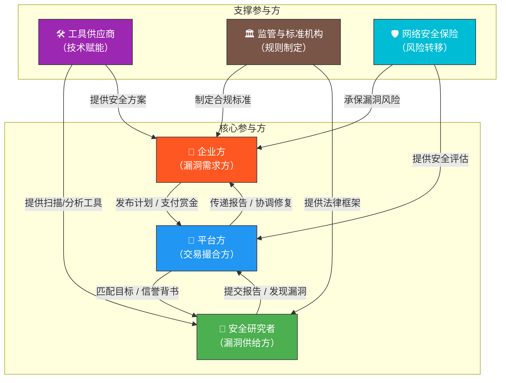
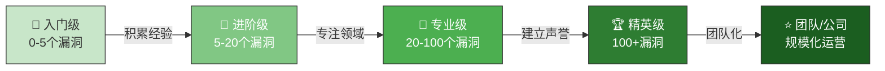
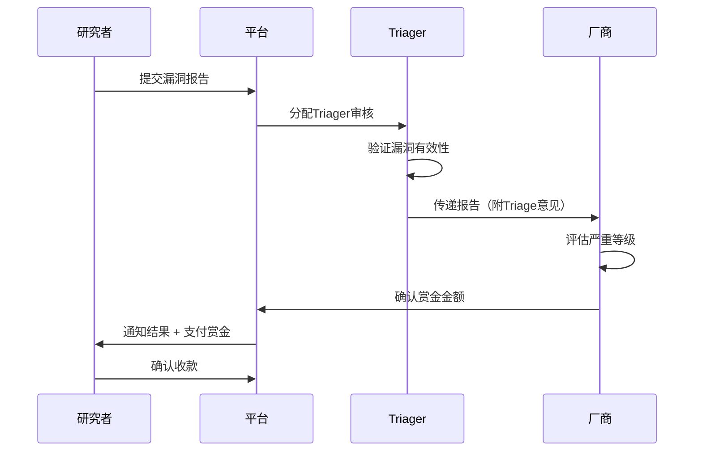

## 27.5 Bug Bounty生态系统参与者

Bug Bounty生态系统是一个由多方参与者协同运作的价值网络。理解每个参与者的角色定位、动机机制和行为模式，是制定有效参与策略的基础。本节将深入剖析生态系统中的六类核心参与者，揭示他们之间的利益关系和互动逻辑。

### 27.5.1 生态系统全景图

从经济学视角看，Bug Bounty生态本质上是一个**信息不对称条件下的安全服务市场**。企业拥有资金但缺乏足够的安全测试覆盖，研究者拥有技术能力但缺乏合法测试渠道和经济回报，平台则通过降低交易成本和建立信任机制来促成双方合作。理解这个市场结构，有助于每一方参与者找到最优策略。

### 27.5.2 企业方（漏洞需求方）

企业是Bug Bounty计划的发起者和资金提供方，也是整个生态系统的"需求引擎"。

#### 企业参与动机深度分析

| 动机类型 | 具体表现 | 典型代表 |
|----------|----------|----------|
| **安全能力补充** | 内部安全团队覆盖不足，需要外部视角 | 中小科技公司、初创企业 |
| **合规驱动** | PCI DSS、ISO 27001等标准鼓励或要求漏洞奖励计划 | 金融、支付行业 |
| **品牌信任建设** | 展示对安全的重视，增强用户和投资者信心 | 消费级SaaS产品 |
| **成本效益优化** | 相比全职安全团队或渗透测试公司，按结果付费更经济 | 预算有限的企业 |
| **竞争差异化** | 在安全成熟度上领先竞争对手 | 技术驱动型企业 |
| **攻击面管理** | 持续发现未知资产和攻击向量 | 大型互联网平台 |

#### 企业类型与参与模式

**大型科技企业**（Google、Microsoft、Apple、Meta）通常采用**自主运营模式**，直接在官网维护漏洞奖励计划页面，不依赖第三方平台。这类企业的特点包括：

- 赏金范围宽泛（$100-$250,000+），Google最高支付过$200,000+的单笔赏金
- 拥有成熟的安全响应团队（PSIRT），平均响应时间在24-48小时内
- 提供详细的安全港条款和法律保护
- 通常维护多个产品线的独立奖励计划
- 信号体系透明，研究者可以清晰了解晋升路径

**中型企业**更倾向于通过**第三方平台**（HackerOne、Bugcrowd）启动计划，因为：

- 平台提供了开箱即用的流程管理工具
- 不需要自建安全响应团队，可以借助平台的Triager服务
- 初始成本更低，通常按漏洞处理数量付费
- 可以利用平台的研究者社区快速获得测试覆盖

**政府机构**的参与是一个重要趋势。美国国防部的"Hack the Pentagon"、"Hack the Army"系列计划开创了政府Bug Bounty的先河。政府参与的特点：

- 法律框架更复杂，需要额外的授权文件和安全审查
- 赏金通常由政府预算拨付，流程较长
- 目标范围往往受到严格限制（如仅限公开网站，排除内部系统）
- 通常选择与Synack等具有安全 clearance 的平台合作
- 更注重合规性和可审计性

#### 企业方的常见误区

1. **"Bug Bounty可以替代渗透测试"**：Bug Bounty是渗透测试的补充而非替代。众包模式擅长发现广度问题，但缺乏深度业务逻辑测试的系统性。正确做法是将Bug Bounty作为安全测试矩阵中的一层。

2. **"发布计划就万事大吉"**：缺乏及时响应和透明沟通会导致研究者流失。数据显示，平均响应时间超过7天的计划，研究者留存率下降40%以上。

3. **"赏金越低越省钱"**：过低的赏金无法吸引高质量研究者，反而可能招致低质量报告泛滥，增加Triager的工作负担。合理定价应参考漏洞严重等级和行业基准。

4. **"所有资产都应纳入计划"**：内部管理系统、员工工具等不应开放给外部测试。应明确界定范围（Scope），避免法律和安全风险。

### 27.5.3 安全研究者（漏洞供给方）

安全研究者是Bug Bounty生态系统的核心价值创造者。他们发现漏洞、撰写报告、推动修复，是整个生态运转的原动力。

#### 研究者层级体系

**入门级研究者（Newcomer）**

- **特征**：刚开始接触Bug Bounty，技术栈尚在构建中，以学习和积累经验为主要目标
- **典型行为**：主要在公开计划中活动，依赖自动化扫描工具发现低危漏洞（XSS、信息泄露等）
- **收入预期**：月均$0-$500，多数时间在学习阶段
- **晋升路径**：完成HackerOne 101 CTF → 提交首个有效报告 → 积累Signal/Kudos积分
- **常见陷阱**：提交大量低质量报告导致信誉受损；不理解范围定义导致越界测试

**进阶级研究者（Intermediate）**

- **特征**：已有稳定发现漏洞的能力，开始建立自己的测试方法论和工具链
- **典型行为**：能够发现业务逻辑漏洞、认证绕过等中高危漏洞，开始获得私密计划邀请
- **收入预期**：月均$500-$3,000
- **核心竞争力**：某一领域的深度专长（如API安全、移动端安全、云配置错误）
- **关键转折点**：从"什么都会一点"转向"某个领域精通"，这是收入跃升的关键

**专业级研究者（Professional）**

- **特征**：以Bug Bounty为主要收入来源，拥有成熟的漏洞发现流程和客户管理能力
- **典型行为**：专注于少数高价值目标，深入研究业务逻辑，产出高质量报告
- **收入预期**：月均$3,000-$15,000+，顶级研究者年收入可达$500,000+
- **代表人物**：Orange Tsai（$1M+累计赏金）、James Kettle、Sam Curry等
- **成功因素**：深度理解目标业务逻辑、持续跟踪代码变更、建立与企业的信任关系

**精英级研究者（Elite）**

- **特征**：行业顶尖水平，能够发现其他研究者无法发现的深层漏洞
- **典型行为**：发现架构级安全缺陷、设计层面的逻辑漏洞、链式攻击路径
- **收入预期**：单笔赏金$50,000-$250,000+并不罕见
- **稀缺性**：全球活跃精英研究者不超过500人
- **生态价值**：他们的研究成果推动了整个行业安全标准的提升

**专业团队（Security Teams）**

以HackerOne的"Top 100"研究者为例，其中约30%属于有组织的团队。团队化运营的优势包括：

- **分工协作**：不同成员专注不同技术领域（前端、后端、移动端、基础设施）
- **知识共享**：内部工具链和漏洞模式库的积累
- **规模效应**：同时测试多个目标，提高发现概率
- **风险分散**：降低对单一研究者的依赖

但团队化也面临挑战：利润分配、知识产权归属、内部竞争等问题需要明确的协议框架。

#### 研究者收入数据

根据HackerOne 2023年报告和公开数据，Bug Bounty研究者的收入呈现明显的幂律分布：

| 研究者层级 | 占比 | 年收入范围 | 累计发现漏洞数 |
|------------|------|------------|----------------|
| 业余爱好者 | ~60% | <$1,000 | 0-3 |
| 兼职研究者 | ~25% | $1,000-$30,000 | 3-20 |
| 全职独立研究者 | ~10% | $30,000-$150,000 | 20-200 |
| 顶级研究者 | ~4% | $150,000-$500,000+ | 200+ |
| 精英团队 | ~1% | $500,000+ | 500+ |

这个分布表明，Bug Bounty遵循"赢家通吃"的市场规律。少数精英研究者获得了大部分赏金，而大多数参与者只能获得有限收入。这并不意味着Bug Bounty不适合普通研究者——关键是找到自己的差异化定位。

### 27.5.4 平台方（交易撮合方）

平台是Bug Bounty生态的基础设施层，通过标准化流程和信任机制降低交易成本。

#### 平台的核心功能

**匹配与发现**

平台最重要的功能是连接企业与研究者。这不仅仅是简单的列表展示，而是一个复杂的匹配系统：

- **算法推荐**：根据研究者的技能标签、历史报告、信誉积分，推荐最匹配的目标
- **分层访问**：公开计划对所有人开放，私密计划基于信誉积分定向邀请
- **动态调整**：根据计划效果（报告质量、响应速度）调整推荐权重

**流程标准化**

平台定义了Bug Bounty的"游戏规则"：

**信誉系统**

信誉系统是平台治理的核心机制，它解决了"谁值得信任"的问题：

- **HackerOne Signal**：基于报告质量、响应速度、报告详细度等维度的综合评分。高Signal分可获得私密计划邀请和优先响应
- **Bugcrowd Kudos**：类似信用积分系统，反映研究者的整体贡献和协作态度
- **Synack内部评级**：更不透明但更严格的评估体系，基于技术测试和持续表现

信誉系统的"马太效应"值得关注：高信誉研究者获得更多高价值机会，进一步积累信誉；低信誉研究者则陷入"低价值目标 → 低质量报告 → 低信誉"的循环。打破这个循环的关键是：在少数目标上做出高质量贡献，而非在大量目标上刷数量。

**争议解决**

平台在企业与研究者之间扮演"仲裁者"角色：

- **重复报告判定**：当多个研究者报告同一漏洞时，确定谁是"首次发现者"
- **严重等级争议**：研究者认为厂商低估了漏洞严重性时，平台进行复审
- **范围界定争议**：测试行为是否超出授权范围的判定
- **赏金谈判**：在厂商报价与研究者预期不一致时的调解

#### 平台商业模式

| 收入来源 | 说明 | 占比（估算） |
|----------|------|-------------|
| 企业订阅费 | 按月/年收取平台使用费 | 40-50% |
| 赏金分成 | 从每笔赏金中抽取5-20% | 25-35% |
| 增值服务 | Triage、私有化部署、安全咨询 | 15-25% |
| 数据洞察 | 安全态势报告、行业基准数据 | 5-10% |

平台面临的挑战包括：研究者和企业的"去平台化"倾向（私下合作绕过平台）、信誉系统的公平性质疑、以及新兴平台的竞争压力。

### 27.5.5 工具供应商（技术赋能方）

工具供应商虽然不直接参与漏洞交易，但为整个生态提供了技术基础设施。

**漏洞扫描与发现工具**

- **Burp Suite**（PortSwigger）：Web安全测试的事实标准，其Professional版本被超过60%的Bug Bounty研究者使用
- **Nuclei**（ProjectDiscovery）：基于模板的开源扫描器，社区维护的模板库覆盖了数千种漏洞模式
- **Subfinder/httpx**：资产发现和探测工具链，用于构建目标的攻击面地图
- **SQLMap**：自动化SQL注入检测工具，虽老旧但仍被广泛使用

**报告与协作工具**

- **Markdown编辑器**：大多数平台原生支持Markdown格式的报告
- **屏幕录制工具**：Loom、OBS等用于录制漏洞复现过程
- **笔记管理系统**：Notion、Obsidian等用于管理漏洞研究笔记和目标情报

**云基础设施**

- **VPS/代理服务**：用于测试环境搭建和IP伪装
- **容器化工具**：Docker封装的安全测试环境，确保可复现性
- **自动化流水线**：GitHub Actions等用于持续监控目标变更

工具供应商与Bug Bounty生态的关系是共生的：工具的成功依赖于Bug Bounty市场的增长，而Bug Bounty的效率提升也依赖于工具的进化。

### 27.5.6 监管与标准机构（规则制定方）

监管机构通过法律框架和行业标准影响Bug Bounty的运作方式。

**政府监管**

- **美国CISA**：发布联邦漏洞披露政策指南，推动政府机构采用结构化的VDP/Bug Bounty
- **欧盟NIS2指令**：要求关键基础设施运营商建立漏洞管理流程，间接推动Bug Bounty采用
- **中国网信办**：通过《网络安全法》和相关配套法规，规范安全研究活动的合法性边界

**行业标准组织**

- **FIRST**（Forum of Incident Response and Security Teams）：制定漏洞评分标准（CVSS）和协调披露流程
- **OWASP**：提供Web安全测试标准和最佳实践指南
- **MITRE**：维护CVE系统，是漏洞标识的全球标准

**标准对Bug Bounty的影响**

CVSS评分直接影响漏洞定价——CVSS 9.0+的漏洞通常对应$5,000-$100,000+的赏金，而CVSS 3.0-5.9的漏洞通常在$100-$500范围。研究者理解CVSS评分机制，有助于准确预估漏洞价值并合理定价。

### 27.5.7 网络安全保险方（风险转移方）

网络安全保险是Bug Bounty生态中较新但增长迅速的参与者。

**保险与Bug Bounty的交叉领域**

- **VDP保险**：部分保险公司为企业提供漏洞披露计划的 liability coverage，覆盖因安全港条款争议导致的法律费用
- **漏洞披露保险**：承保因漏洞披露不当造成的业务损失
- **安全评估报告**：保险公司将Bug Bounty计划的执行情况作为风险评估的参考因素

**趋势**

越来越多的网络安全保险公司将企业是否建立了Bug Bounty或VDP计划纳入保费定价模型。建立了成熟漏洞管理流程的企业可能获得5-15%的保费折扣。这为Bug Bounty的推广提供了额外的经济激励。

### 27.5.8 参与者之间的动态博弈

生态系统的健康运转依赖于各方参与者之间的激励平衡。以下是几个关键的博弈场景：

**研究者 vs 企业：漏洞估值博弈**

企业希望以最低成本获得漏洞信息，研究者希望获得与其发现价值匹配的报酬。这个博弈的结果取决于：

- **信息对称性**：研究者能否准确评估漏洞的真实影响（CVSS评分是折中方案）
- **替代选择**：漏洞是否可以通过其他渠道出售（暗网价格是研究者的BATNA）
- **声誉成本**：企业拒绝合理赏金对其品牌声誉的长期损害

**研究者 vs 研究者：竞争与合作**

同一漏洞可能被多个研究者独立发现，"首次报告者"获得赏金的规则引发了激烈竞争：

- **速度竞争**：先到先得规则促使研究者快速报告，有时导致报告质量下降
- **信息不对称**：部分研究者通过监控代码变更提前锁定新功能，获得信息优势
- **合作模式**：部分研究者选择组队，分摊侦察成本，共享发现

**平台 vs 去平台化**

部分企业和资深研究者倾向于绕过平台直接合作，以避免平台分成。平台的应对策略：

- **提高平台价值**：提供信誉背书、法律保护、流程自动化等不可替代的服务
- **锁定机制**：通过信誉积分和私密计划邀请绑定研究者
- **降低摩擦**：简化支付流程、提供税务处理服务

### 27.5.9 生态系统演进趋势

**趋势一：保险化与合规驱动**

Bug Bounty正从"安全创新实践"转变为"合规基线要求"。NIS2、SEC网络安全披露规则等法规正在推动更多企业建立结构化的漏洞管理流程，Bug Bounty是其中的重要组成部分。

**趋势二：AI对生态的冲击**

AI工具（如自动化漏洞扫描、AI辅助报告撰写）正在改变生态的力量对比：

- **降低了入门门槛**：新手研究者可以借助AI快速发现常见漏洞
- **加剧了低价值漏洞的拥挤**：自动化工具发现的漏洞趋于同质化
- **提高了高价值漏洞的稀缺性**：AI难以发现的业务逻辑漏洞变得更值钱
- **催生了新的参与者**：AI安全公司开始专门测试AI系统的安全漏洞

**趋势三：垂直化与专业化**

通用型Bug Bounty正在向垂直领域分化：

- **移动应用安全**：iOS/Android特有的漏洞模式
- **云原生安全**：Kubernetes、Serverless配置错误
- **AI/ML安全**：模型窃取、对抗样本、Prompt注入
- **IoT安全**：固件漏洞、物理接口攻击
- **Web3安全**：智能合约漏洞、DeFi协议安全

**趋势四：政府深度参与**

各国政府正在从"旁观者"转变为"积极参与者"。除了美国的Hack the Pentagon系列，欧盟、澳大利亚、日本等国家和地区也相继推出了政府Bug Bounty计划。政府参与带来了更严格的标准、更大的资金规模、以及更强的合规要求。

### 27.5.10 本节小结

理解生态系统的运作机制，有助于你更好地定位自己的角色，制定有效的参与策略。无论你是企业决策者、安全研究者、平台运营者，还是生态中的其他参与者，都需要认识到：Bug Bounty不是零和游戏，而是多方共赢的价值创造机制。

关键要点回顾：

- **企业方**：Bug Bounty是安全能力的补充而非替代，成功的关键在于透明沟通和及时响应
- **研究者**：从广度向深度转型是收入跃升的关键，找到差异化定位比刷数量更重要
- **平台方**：信誉系统是治理核心，降低交易成本是核心竞争力
- **工具/标准/保险**：这些支撑参与者虽然不直接参与交易，但深刻影响生态效率
- **趋势**：AI冲击、合规驱动、垂直化、政府参与正在重塑生态格局
